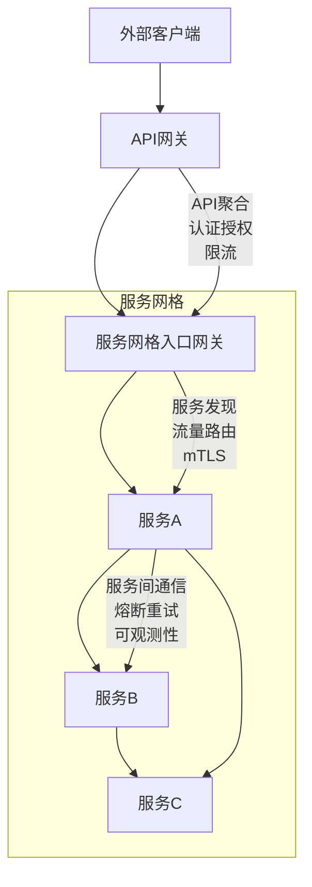
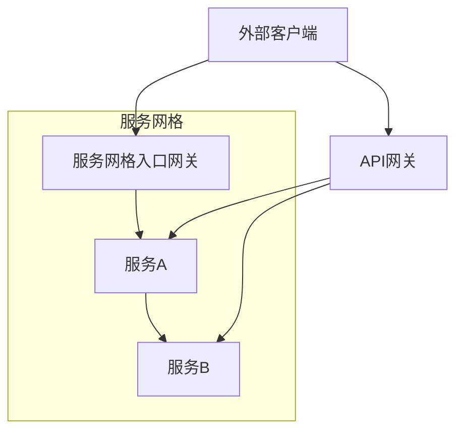
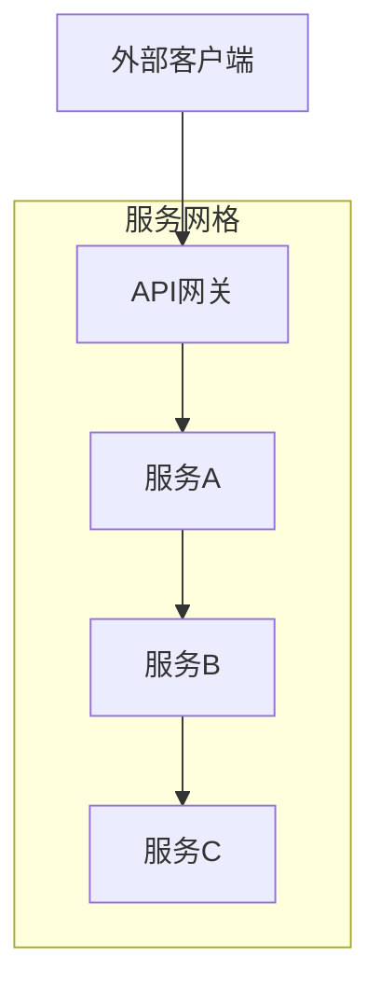
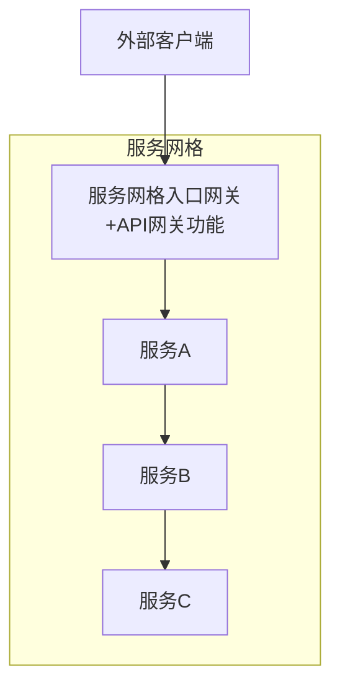
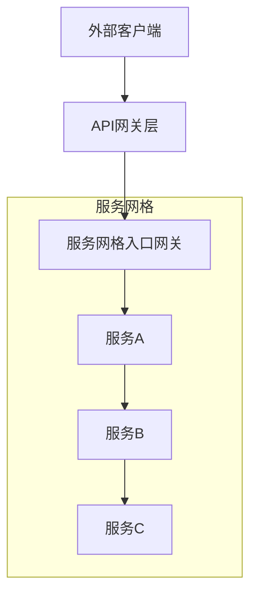
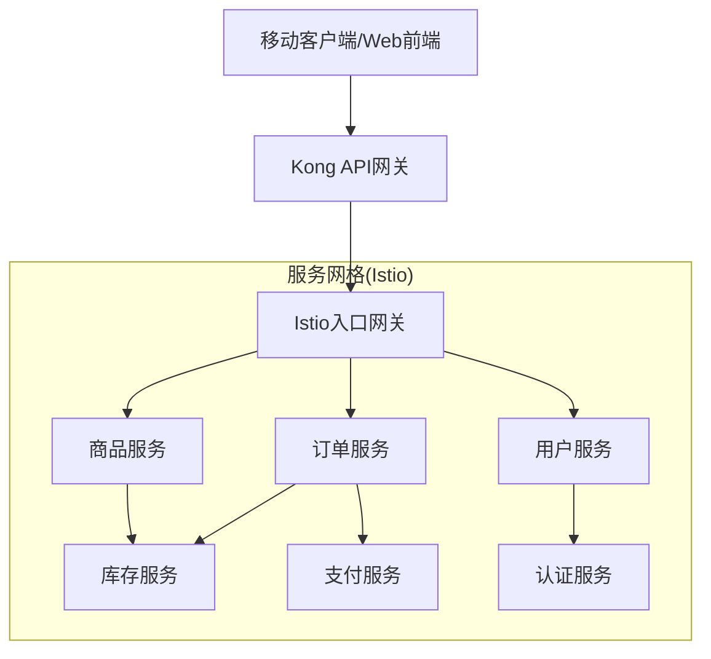
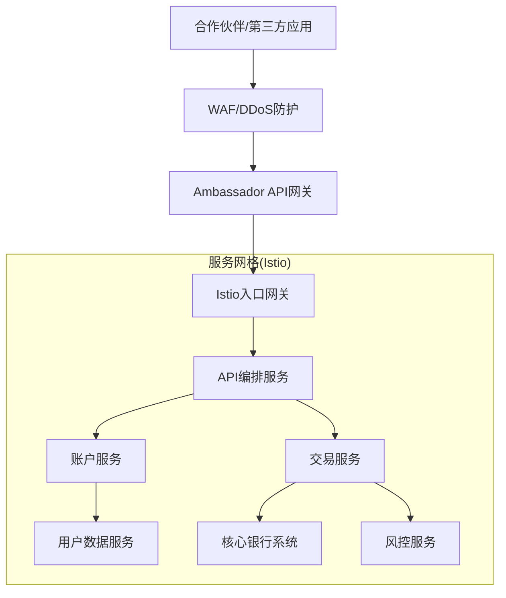
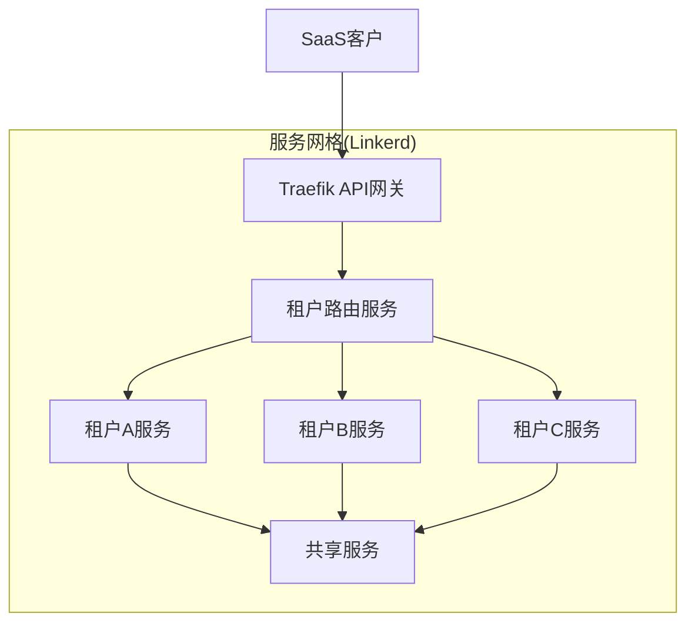
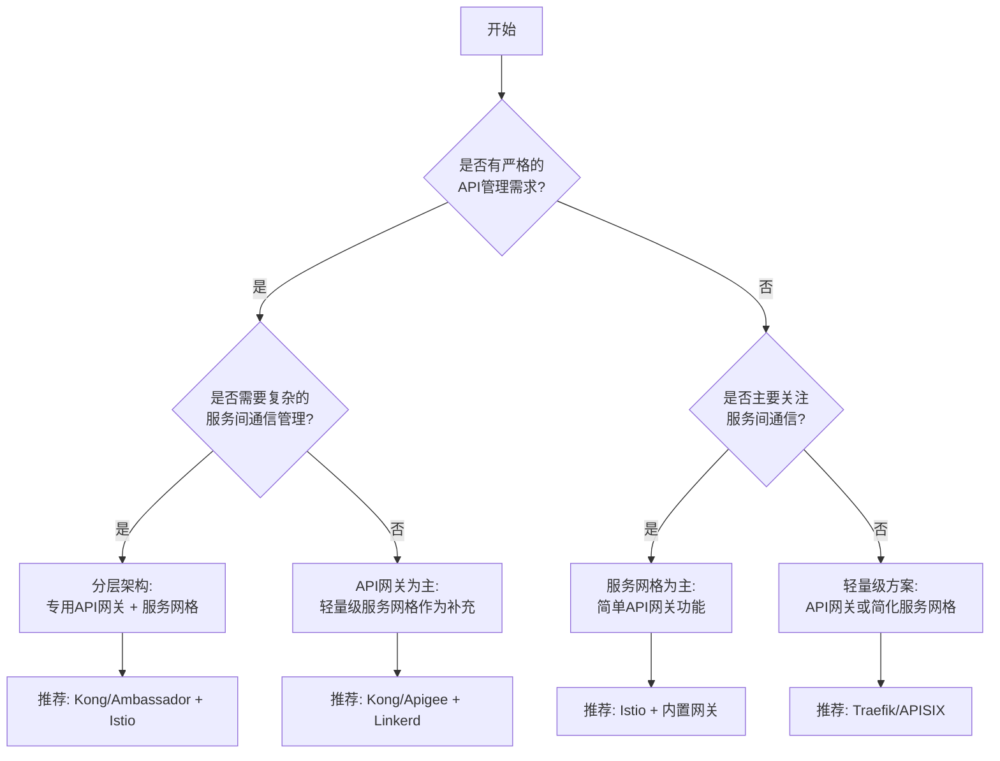

# 服务网格与API网关集成

服务网格和API网关在微服务架构中扮演不同但互补的角色。本文将详细介绍服务网格与API网关的关系、集成方案和最佳实践，帮助读者构建完整的服务治理体系。

## 理解服务网格与API网关

在深入探讨集成方案之前，我们需要明确服务网格和API网关各自的职责和特点，以及它们在微服务架构中的定位。

### 服务网格的核心职责

服务网格主要关注**服务间通信**，它通过一组轻量级网络代理（通常以边车容器形式部署）来管理服务之间的流量。服务网格的主要职责包括：

1. **服务间流量管理**：路由、负载均衡、流量分割
2. **服务间安全通信**：mTLS加密、身份验证、授权
3. **服务弹性**：超时、重试、熔断、故障注入
4. **可观测性**：指标收集、分布式追踪、访问日志

服务网格的工作范围主要在集群内部，关注的是微服务之间的东西向流量。

### API网关的核心职责

API网关则主要关注**外部流量入口**，它作为系统的统一入口，管理来自外部客户端的请求。API网关的主要职责包括：

1. **API聚合与编排**：将多个微服务API组合成面向客户端的统一API
2. **流量控制**：限流、熔断、API版本管理
3. **安全防护**：认证、授权、API密钥管理、防DDoS
4. **协议转换**：HTTP到gRPC、REST到GraphQL等
5. **开发者体验**：API文档、开发者门户、API分析

API网关主要处理进入系统的南北向流量，是外部与内部系统的边界。

### 功能对比与互补性

服务网格和API网关在某些功能上有重叠，但侧重点不同：

| 功能 | 服务网格 | API网关 |
|------|---------|---------|
| **流量路由** | 服务间细粒度路由 | 面向API的路由 |
| **认证授权** | 服务间身份认证 | 用户/客户端认证 |
| **流量控制** | 服务级别控制 | API级别控制 |
| **可观测性** | 服务间通信监控 | API调用监控 |
| **协议支持** | 专注服务间协议 | 多协议转换 |
| **部署位置** | 与服务共同部署 | 系统边界 |

这种互补性使得两者结合使用可以构建更完整的服务治理体系。



## 集成架构模式

服务网格与API网关的集成可以采用多种架构模式，每种模式有其适用场景和优缺点。

### 模式1：并列模式

在并列模式中，API网关和服务网格入口网关并排部署，各自负责不同类型的流量。



**优点**：
- 职责明确分离
- 可以独立扩展和管理
- 可以选择最适合各自职责的产品

**缺点**：
- 流量路径不统一
- 可能导致策略重复配置
- 运维复杂度增加

**适用场景**：
- 已有成熟API网关，后续引入服务网格
- 不同类型API需要不同处理方式
- 团队职责明确划分

### 模式2：API网关作为服务网格入口

在这种模式中，API网关充当服务网格的入口点，所有外部流量都通过API网关进入服务网格。



**优点**：
- 流量路径统一
- API管理集中
- 简化外部客户端配置

**缺点**：
- API网关成为单点
- 可能限制服务网格某些功能
- 需要API网关支持服务网格集成

**适用场景**：
- 以API为中心的架构
- 外部流量远多于内部流量
- 需要强化API管理能力

### 模式3：服务网格网关作为API网关

在这种模式中，服务网格的入口网关扩展API网关功能，成为统一入口。



**优点**：
- 架构简化
- 统一的流量管理
- 减少网络跳转

**缺点**：
- 服务网格网关功能可能不如专用API网关丰富
- 可能导致网关过载
- 职责边界模糊

**适用场景**：
- 小型到中型微服务架构
- 服务网格先于API需求建立
- 内部服务通信为主

### 模式4：分层架构

在分层架构中，API网关处理外部流量，然后将请求传递给服务网格入口网关，形成分层结构。



**优点**：
- 职责明确分离
- 可以充分发挥各自优势
- 灵活性高，便于演进

**缺点**：
- 增加网络跳转
- 配置复杂度增加
- 可能增加延迟

**适用场景**：
- 大型企业级微服务架构
- 需要严格的安全隔离
- 复杂的API管理和服务治理需求

## 主流产品集成方案

不同的API网关和服务网格产品有各自的集成方案，下面介绍几种常见组合的具体实现。

### Istio + Kong集成

Kong是一个流行的开源API网关，与Istio服务网格的集成是一种常见选择。

#### 方案1：Kong作为Istio入口网关前置代理

```yaml
# Kong配置示例
apiVersion: configuration.konghq.com/v1
kind: KongIngress
metadata:
  name: istio-proxy
spec:
  route:
    protocols:
      - http
      - https
    strip_path: true
    preserve_host: true
---
apiVersion: extensions/v1beta1
kind: Ingress
metadata:
  name: api-routes
  annotations:
    kubernetes.io/ingress.class: kong
    konghq.com/override: istio-proxy
spec:
  rules:
  - host: api.example.com
    http:
      paths:
      - path: /users
        backend:
          serviceName: istio-ingressgateway
          servicePort: 80
```

```yaml
# Istio配置示例
apiVersion: networking.istio.io/v1alpha3
kind: Gateway
metadata:
  name: api-gateway
spec:
  selector:
    istio: ingressgateway
  servers:
  - port:
      number: 80
      name: http
      protocol: HTTP
    hosts:
    - "*"
---
apiVersion: networking.istio.io/v1alpha3
kind: VirtualService
metadata:
  name: user-service
spec:
  hosts:
  - "*"
  gateways:
  - api-gateway
  http:
  - match:
    - uri:
        prefix: /users
    route:
    - destination:
        host: user-service
        port:
          number: 8080
```

#### 方案2：Kong作为Istio服务的一部分

在这种方案中，Kong部署在服务网格内部，作为一个普通服务，但承担API网关职责。

```yaml
# 将Kong部署为Istio服务
apiVersion: v1
kind: Service
metadata:
  name: kong
  labels:
    app: kong
spec:
  type: ClusterIP
  ports:
  - port: 8000
    name: proxy
  - port: 8443
    name: proxy-ssl
  selector:
    app: kong
---
apiVersion: apps/v1
kind: Deployment
metadata:
  name: kong
spec:
  selector:
    matchLabels:
      app: kong
  template:
    metadata:
      labels:
        app: kong
      annotations:
        sidecar.istio.io/inject: "true"  # 启用Istio边车注入
    spec:
      containers:
      - name: kong
        image: kong:2.8
        ports:
        - containerPort: 8000
        - containerPort: 8443
```

### Istio + Ambassador集成

Ambassador是一个基于Envoy的API网关，与Istio有良好的集成性。

```yaml
# Ambassador配置示例
apiVersion: getambassador.io/v2
kind: Mapping
metadata:
  name: user-service
spec:
  prefix: /users/
  service: istio-ingressgateway.istio-system:80
  host: api.example.com
  headers:
    x-service: user-service
---
# Istio配置示例
apiVersion: networking.istio.io/v1alpha3
kind: EnvoyFilter
metadata:
  name: ambassador-headers
  namespace: istio-system
spec:
  workloadSelector:
    labels:
      istio: ingressgateway
  configPatches:
  - applyTo: HTTP_ROUTE
    match:
      context: GATEWAY
    patch:
      operation: MERGE
      value:
        route:
          request_headers_to_add:
          - header:
              key: x-service
              value: "%REQ(x-service)%"
            append: false
```

### Linkerd + Traefik集成

Linkerd是一个轻量级服务网格，可以与Traefik API网关集成。

```yaml
# Traefik配置示例
apiVersion: traefik.containo.us/v1alpha1
kind: IngressRoute
metadata:
  name: api-routes
spec:
  entryPoints:
    - web
  routes:
  - match: Host(`api.example.com`) && PathPrefix(`/users`)
    kind: Rule
    services:
    - name: linkerd-gateway
      port: 80
      passHostHeader: true
```

```yaml
# Linkerd配置示例
apiVersion: v1
kind: Service
metadata:
  name: linkerd-gateway
  annotations:
    linkerd.io/inject: enabled
spec:
  selector:
    app: linkerd-gateway
  ports:
  - port: 80
    targetPort: 8080
---
apiVersion: apps/v1
kind: Deployment
metadata:
  name: linkerd-gateway
spec:
  selector:
    matchLabels:
      app: linkerd-gateway
  template:
    metadata:
      labels:
        app: linkerd-gateway
      annotations:
        linkerd.io/inject: enabled
    spec:
      containers:
      - name: gateway
        image: nginx:alpine
        ports:
        - containerPort: 8080
```

### AWS App Mesh + API Gateway集成

在AWS环境中，可以集成AWS App Mesh服务网格和AWS API Gateway。

```json
// AWS API Gateway配置示例
{
  "swagger": "2.0",
  "info": {
    "title": "UserAPI",
    "version": "1.0"
  },
  "paths": {
    "/users": {
      "get": {
        "responses": {
          "200": {
            "description": "OK"
          }
        },
        "x-amazon-apigateway-integration": {
          "uri": "http://app-mesh-virtual-gateway.example.com/users",
          "type": "http_proxy",
          "httpMethod": "GET"
        }
      }
    }
  }
}
```

```yaml
# AWS App Mesh配置示例
apiVersion: appmesh.k8s.aws/v1beta2
kind: VirtualGateway
metadata:
  name: ingress-gateway
  namespace: appmesh-system
spec:
  namespaceSelector:
    matchLabels:
      gateway: ingress
  podSelector:
    matchLabels:
      app: ingress-gateway
  listeners:
    - portMapping:
        port: 8080
        protocol: http
---
apiVersion: appmesh.k8s.aws/v1beta2
kind: VirtualService
metadata:
  name: user-service
  namespace: default
spec:
  awsName: user-service.default.svc.cluster.local
  provider:
    virtualRouter:
      virtualRouterRef:
        name: user-service-router
```

## 集成实施最佳实践

成功实施服务网格与API网关集成需要遵循一系列最佳实践，以下是关键领域的建议。

### 流量管理策略协调

服务网格和API网关都有流量管理能力，需要协调这些策略以避免冲突：

1. **明确职责边界**：
   - API网关：API版本管理、客户端路由、API组合
   - 服务网格：服务间路由、流量分割、故障注入

2. **避免重复配置**：
   ```yaml
   # API网关层 - Kong配置
   apiVersion: configuration.konghq.com/v1
   kind: KongPlugin
   metadata:
     name: rate-limiting
   plugin: rate-limiting
   config:
     minute: 100
     policy: local
   
   # 服务网格层 - 不重复配置限流
   # 而是专注于服务间通信
   apiVersion: networking.istio.io/v1alpha3
   kind: DestinationRule
   metadata:
     name: user-service
   spec:
     host: user-service
     trafficPolicy:
       connectionPool:
         http:
           http1MaxPendingRequests: 100
   ```

3. **统一配置管理**：使用GitOps流程管理所有配置，确保一致性

### 安全策略分层

安全是微服务架构的关键考量，需要在API网关和服务网格之间建立分层安全模型：

1. **边界安全（API网关）**：
   - 用户认证与授权
   - API密钥管理
   - OAuth/OIDC集成
   - 输入验证与清理

   ```yaml
   # Kong OAuth2插件配置
   apiVersion: configuration.konghq.com/v1
   kind: KongPlugin
   metadata:
     name: oauth2
   plugin: oauth2
   config:
     scopes:
     - email
     - profile
     mandatory_scope: true
     token_expiration: 7200
     enable_authorization_code: true
     enable_client_credentials: true
   ```

2. **服务间安全（服务网格）**：
   - mTLS加密
   - 服务身份认证
   - 细粒度访问控制

   ```yaml
   # Istio安全策略
   apiVersion: security.istio.io/v1beta1
   kind: PeerAuthentication
   metadata:
     name: default
     namespace: istio-system
   spec:
     mtls:
       mode: STRICT
   ---
   apiVersion: security.istio.io/v1beta1
   kind: AuthorizationPolicy
   metadata:
     name: user-service-policy
   spec:
     selector:
       matchLabels:
         app: user-service
     action: ALLOW
     rules:
     - from:
       - source:
           principals: ["cluster.local/ns/default/sa/order-service"]
   ```

3. **安全上下文传递**：在API网关和服务网格之间传递安全上下文

   ```yaml
   # API网关配置 - 提取JWT并传递为HTTP头
   apiVersion: getambassador.io/v2
   kind: Filter
   metadata:
     name: jwt-filter
   spec:
     JWT:
       jwksURI: https://auth.example.com/.well-known/jwks.json
       insecureTLS: false
       requireAudience: example-api
       forwardHeaders:
         - "X-User-ID"
         - "X-User-Role"
   ```

### 可观测性整合

整合API网关和服务网格的可观测性数据，提供端到端的可见性：

1. **分布式追踪**：
   - 确保追踪上下文在API网关和服务网格之间正确传递
   - 使用统一的追踪后端（如Jaeger）

   ```yaml
   # API网关配置 - Kong
   apiVersion: configuration.konghq.com/v1
   kind: KongPlugin
   metadata:
     name: zipkin
   plugin: zipkin
   config:
     http_endpoint: http://zipkin:9411/api/v2/spans
     sample_ratio: 1.0
     traceid_header_name: x-b3-traceid
     parentid_header_name: x-b3-parentspanid
     
   # Istio配置
   apiVersion: telemetry.istio.io/v1alpha1
   kind: Telemetry
   metadata:
     name: tracing-config
   spec:
     tracing:
     - providers:
       - name: zipkin
       randomSamplingPercentage: 100.0
   ```

2. **指标聚合**：
   - 将API网关和服务网格指标发送到同一监控系统（如Prometheus）
   - 创建统一的仪表盘（如Grafana）

   ```yaml
   # Grafana仪表盘配置示例
   {
     "dashboard": {
       "title": "API与服务网格监控",
       "panels": [
         {
           "title": "API请求量",
           "targets": [
             {
               "expr": "sum(rate(kong_http_requests_total[5m])) by (service)"
             }
           ]
         },
         {
           "title": "服务网格请求量",
           "targets": [
             {
               "expr": "sum(rate(istio_requests_total[5m])) by (destination_service)"
             }
           ]
         },
         {
           "title": "端到端延迟",
           "targets": [
             {
               "expr": "histogram_quantile(0.95, sum(rate(kong_latency_bucket[5m])) by (le, service))"
             },
             {
               "expr": "histogram_quantile(0.95, sum(rate(istio_request_duration_milliseconds_bucket[5m])) by (le, destination_service))"
             }
           ]
         }
       ]
     }
   }
   ```

3. **日志关联**：
   - 使用统一的请求ID
   - 集中日志存储和分析（如ELK栈）

   ```yaml
   # API网关配置 - 生成请求ID
   apiVersion: configuration.konghq.com/v1
   kind: KongPlugin
   metadata:
     name: correlation-id
   plugin: correlation-id
   config:
     header_name: X-Request-ID
     generator: uuid
     echo_downstream: true
     
   # Istio访问日志配置
   apiVersion: telemetry.istio.io/v1alpha1
   kind: Telemetry
   metadata:
     name: access-logs
   spec:
     accessLogging:
     - providers:
       - name: envoy
       filter:
         expression: "true"
   ```

### 性能优化

集成API网关和服务网格可能引入额外的网络跳转和处理开销，需要注意性能优化：

1. **减少网络跳转**：
   - 选择合适的集成模式，减少不必要的网络跳转
   - 考虑使用服务网格网关作为API网关（适用于简单场景）

2. **资源分配**：
   - 为API网关和服务网格入口网关分配足够资源
   - 使用自动扩展确保处理能力

   ```yaml
   # API网关资源配置
   apiVersion: apps/v1
   kind: Deployment
   metadata:
     name: kong
   spec:
     template:
       spec:
         containers:
         - name: kong
           resources:
             requests:
               cpu: 500m
               memory: 512Mi
             limits:
               cpu: 2000m
               memory: 1Gi
   
   # 自动扩展配置
   apiVersion: autoscaling/v2
   kind: HorizontalPodAutoscaler
   metadata:
     name: kong-hpa
   spec:
     scaleTargetRef:
       apiVersion: apps/v1
       kind: Deployment
       name: kong
     minReplicas: 2
     maxReplicas: 10
     metrics:
     - type: Resource
       resource:
         name: cpu
         target:
           type: Utilization
           averageUtilization: 70
   ```

3. **缓存策略**：
   - 在API网关层实施响应缓存
   - 使用分布式缓存减少后端负载

   ```yaml
   # Kong缓存插件配置
   apiVersion: configuration.konghq.com/v1
   kind: KongPlugin
   metadata:
     name: proxy-cache
   plugin: proxy-cache
   config:
     content_type:
     - application/json
     cache_ttl: 300
     strategy: memory
   ```

4. **协议优化**：
   - 使用HTTP/2或gRPC提高性能
   - 启用长连接减少连接建立开销

   ```yaml
   # Istio协议设置
   apiVersion: networking.istio.io/v1alpha3
   kind: DestinationRule
   metadata:
     name: http2-example
   spec:
     host: my-service
     trafficPolicy:
       connectionPool:
         http:
           h2UpgradePolicy: UPGRADE  # 尝试升级到HTTP/2
       tls:
         mode: ISTIO_MUTUAL
   ```

## 实际案例分析

以下是几个实际案例，展示了不同场景下服务网格与API网关的集成方案。

### 案例1：电子商务平台

**场景**：大型电子商务平台，有数百个微服务，需要对外提供API并管理内部服务通信。

**解决方案**：采用分层架构，Kong作为API网关，Istio作为服务网格。

**架构图**：


**关键配置**：
- Kong处理API密钥、限流、OAuth认证
- Kong将请求路由到Istio入口网关
- Istio管理服务间通信、mTLS、熔断
- 统一的追踪和监控系统

**成果**：
- 外部API访问安全可控
- 服务间通信可靠且可观测
- 开发团队可以专注于业务逻辑
- 运维团队获得统一的管理界面

### 案例2：金融服务API平台

**场景**：金融机构提供对外API服务，同时有严格的安全和合规要求。

**解决方案**：使用Ambassador作为API网关，Istio作为服务网格，实现多层安全防护。

**架构图**：


**关键配置**：
- 多层安全防护：WAF、API网关认证、服务网格mTLS
- 严格的访问控制和审计日志
- 细粒度的流量管理和监控
- 合规报告自动生成

**成果**：
- 满足金融行业安全合规要求
- 提供安全可靠的API服务
- 实现细粒度访问控制
- 全面的审计和监控能力

### 案例3：云原生SaaS应用

**场景**：SaaS提供商需要支持多租户架构，同时提供API和服务间通信管理。

**解决方案**：使用Traefik作为API网关，Linkerd作为轻量级服务网格。

**架构图**：


**关键配置**：
- Traefik处理租户识别和API路由
- Linkerd提供轻量级服务网格功能
- 基于租户的流量隔离和资源限制
- 简化的部署和管理流程

**成果**：
- 资源高效利用
- 租户间严格隔离
- 简化的运维管理
- 良好的性能表现

## 演进策略与未来趋势

服务网格和API网关技术仍在快速发展，集成方案也在不断演进。

### 渐进式采用策略

对于现有系统，可以采用渐进式策略引入服务网格和API网关：

1. **阶段1：引入API网关**
   - 统一外部API入口
   - 实现基本的认证和流量控制
   - 为服务网格做准备

2. **阶段2：小规模服务网格试点**
   - 选择关键服务引入服务网格
   - 验证服务网格与API网关集成
   - 建立监控和可观测性体系

3. **阶段3：扩大服务网格覆盖范围**
   - 逐步将更多服务纳入服务网格
   - 优化API网关与服务网格集成
   - 完善自动化部署和配置

4. **阶段4：全面服务治理**
   - 所有服务纳入统一管理
   - 实现高级流量管理和安全策略
   - 持续优化性能和可靠性

### 未来发展趋势

服务网格与API网关集成的未来发展趋势包括：

1. **统一控制平面**
   - API网关和服务网格共享配置和控制平面
   - 减少重复配置和管理复杂性
   - 提供统一的管理界面

2. **WebAssembly扩展**
   - 使用WebAssembly扩展API网关和服务网格功能
   - 支持自定义处理逻辑和协议
   - 提高扩展性和性能

3.
让我继续完成服务网格与API网关集成的文档内容：

### 未来发展趋势（续）

3. **无边车架构**
   - 探索无边车代理的服务网格实现（如eBPF技术）
   - 减少资源消耗和性能开销
   - 简化部署和管理

4. **多集群和混合云支持**
   - 跨集群和跨云的统一服务治理
   - 全球流量管理和路由
   - 统一的安全策略和可观测性

5. **API生命周期管理集成**
   - 将API设计、测试、部署、监控集成到统一流程
   - 支持API版本管理和弃用策略
   - 提供开发者体验和API分析

## 选择合适的集成方案

选择合适的服务网格和API网关集成方案需要考虑多种因素：

### 评估因素

1. **规模和复杂度**：
   - 服务数量和类型
   - 流量模式和规模
   - 团队规模和技能水平

2. **功能需求**：
   - API管理需求（文档、开发者门户等）
   - 服务间通信需求（路由、弹性等）
   - 安全需求（认证、授权、加密等）

3. **性能要求**：
   - 延迟敏感度
   - 吞吐量要求
   - 资源限制

4. **运维考量**：
   - 部署和管理复杂度
   - 监控和故障排除能力
   - 升级和维护难度

### 决策框架

以下是一个简化的决策框架，帮助选择合适的集成方案：



### 产品选择建议

根据不同场景的需求，以下是一些产品组合建议：

| 场景 | API网关推荐 | 服务网格推荐 | 集成模式 |
|------|------------|-------------|---------|
| 大型企业 | Kong Enterprise/Apigee | Istio | 分层架构 |
| 中型企业 | Kong/Ambassador | Linkerd/Istio | API网关前置 |
| 初创公司 | Traefik/APISIX | Linkerd/Kuma | 简化架构 |
| AWS环境 | Amazon API Gateway | AWS App Mesh | 云服务集成 |
| Azure环境 | Azure API Management | Linkerd/Istio | 云服务集成 |
| 高性能要求 | NGINX/Traefik | Linkerd | 性能优化架构 |
| 多集群/混合云 | Kong/Ambassador | Istio/Kuma | 分层联邦架构 |

## 总结

服务网格和API网关是微服务架构中的关键组件，它们各自解决不同的问题，但通过合理集成可以构建完整的服务治理体系。

### 关键要点

1. **明确职责边界**：
   - API网关负责外部流量入口、API管理和客户端体验
   - 服务网格负责服务间通信、内部安全和可观测性

2. **选择合适的集成模式**：
   - 根据需求选择并列、分层或嵌入式架构
   - 考虑性能、复杂度和管理便捷性

3. **协调关键功能**：
   - 流量管理策略协调
   - 分层安全模型
   - 端到端可观测性
   - 统一配置管理

4. **渐进式采用**：
   - 从小规模试点开始
   - 逐步扩大覆盖范围
   - 持续优化和调整

通过合理集成服务网格和API网关，组织可以构建既安全可靠又灵活高效的微服务架构，满足现代应用开发和运维的需求。随着技术的不断发展，服务网格和API网关的边界可能会变得更加模糊，但它们作为微服务架构的关键基础设施的重要性将持续存在。