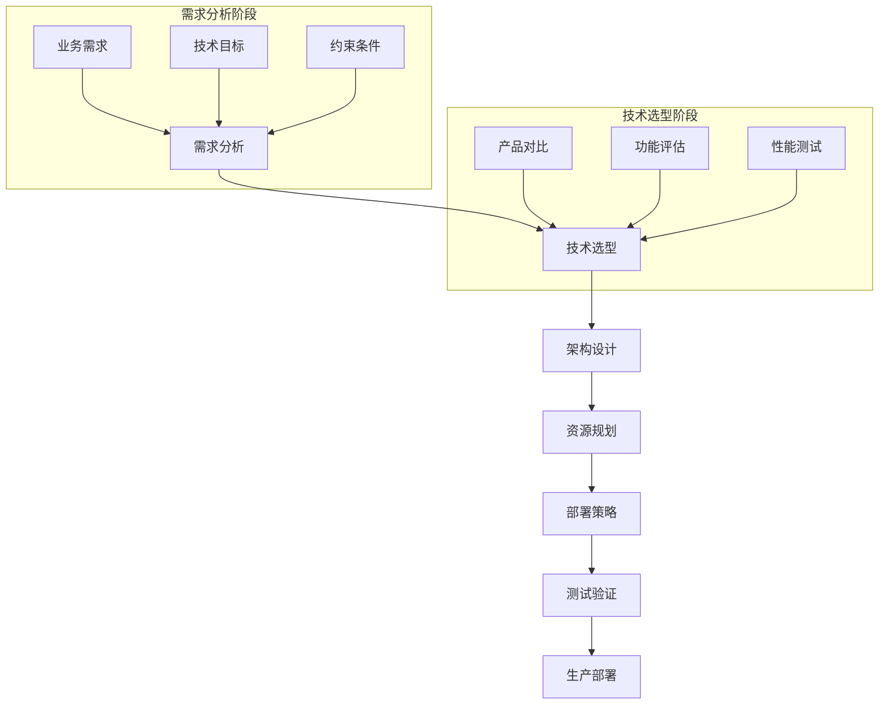
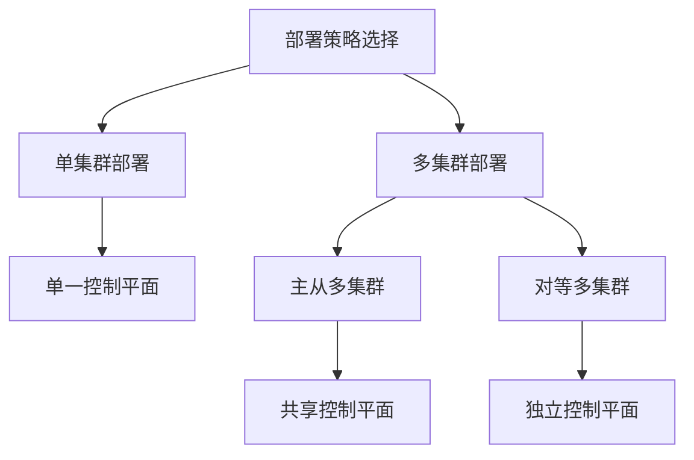

# 服务网格生产环境部署

将服务网格应用于生产环境需要考虑多方面因素。本文将通过一个完整的实战项目，详细介绍服务网格的规划、部署、配置和运维，帮助读者掌握服务网格的实际应用技能。

## 生产环境部署前的准备工作

在将服务网格部署到生产环境之前，需要进行充分的准备工作，确保部署过程顺利且符合企业需求。

### 需求分析与架构规划

首先需要明确引入服务网格的业务需求和技术目标：

1. **业务需求分析**：
   - 微服务数量和规模
   - 流量特征和模式
   - 安全性和合规性要求
   - 可观测性和监控需求
   - 业务连续性要求

2. **技术目标定义**：
   - 流量管理能力
   - 安全通信需求
   - 可观测性深度
   - 性能和资源约束
   - 与现有系统的集成需求

3. **架构规划**：
   - 服务网格覆盖范围
   - 控制平面部署模式
   - 多集群策略
   - 网关集成方案
   - 灾备和高可用设计



### 服务网格产品选型

根据需求选择合适的服务网格实现：

| 服务网格 | 优势 | 劣势 | 适用场景 |
|---------|------|------|---------|
| **Istio** | 功能全面、生态丰富、社区活跃 | 复杂度高、资源消耗大 | 大型企业、复杂需求 |
| **Linkerd** | 轻量级、易用、性能好 | 功能相对有限 | 中小规模、性能敏感 |
| **Consul Connect** | 多平台支持、服务发现强 | 部分高级功能需企业版 | 混合环境、已用Consul |
| **AWS App Mesh** | AWS集成、托管控制平面 | 仅限AWS环境 | AWS原生应用 |
| **Kuma** | 多平台、易用 | 社区较小 | 混合环境、简单需求 |

选型决策框架：

1. **评估关键功能需求**：
   - 必要的流量管理功能
   - 安全需求（mTLS、授权等）
   - 可观测性要求
   - 多集群/多云支持

2. **考虑运维复杂度**：
   - 团队技能水平
   - 运维资源
   - 学习曲线接受度

3. **评估性能和资源影响**：
   - 延迟敏感度
   - 资源约束
   - 扩展性需求

4. **验证集成能力**：
   - 与现有基础设施兼容性
   - 与CI/CD流程集成
   - 与监控系统集成

### 资源规划与容量评估

服务网格会引入额外的资源消耗，需要提前规划：

1. **控制平面资源**：
   - 以Istio为例，控制平面（istiod）建议配置：
     - 小型集群（<100服务）：1-2核CPU，2GB内存
     - 中型集群（100-500服务）：2-4核CPU，4GB内存
     - 大型集群（>500服务）：4-8核CPU，8GB内存

2. **数据平面资源**：
   - 每个边车代理（Envoy）的资源消耗：
     - 基础消耗：0.2-0.5核CPU，50-100MB内存
     - 高流量服务可能需要：0.5-2核CPU，100-500MB内存

3. **网络影响**：
   - 额外的网络跳转
   - 控制平面与数据平面通信
   - 遥测数据传输

4. **存储需求**：
   - 日志存储
   - 指标数据库
   - 追踪数据存储

资源评估公式：

```
总CPU增加 = 服务数量 × 平均每个边车CPU消耗 + 控制平面CPU需求
总内存增加 = 服务数量 × 平均每个边车内存消耗 + 控制平面内存需求
```

### 环境准备与前提条件

确保基础环境满足服务网格部署要求：

1. **Kubernetes集群要求**：
   - Kubernetes版本兼容性（如Istio 1.16需要K8s 1.22+）
   - 集群规模和节点配置
   - 网络插件兼容性（如Calico、Flannel等）
   - RBAC权限配置

2. **网络要求**：
   - Pod间通信策略
   - 端口和协议要求
   - 网络策略配置
   - 负载均衡器配置

3. **存储要求**：
   - 持久化存储类
   - 备份存储配置

4. **安全要求**：
   - 证书管理
   - 密钥存储
   - 安全上下文配置

5. **监控系统准备**：
   - Prometheus部署
   - Grafana配置
   - 日志收集系统
   - 分布式追踪系统

## 服务网格部署实战

本节将以Istio为例，详细介绍服务网格的生产环境部署流程。

### 部署策略选择

根据环境规模和需求，选择合适的部署策略：

1. **单集群部署**：
   - 适用于中小规模应用
   - 控制平面和数据平面在同一集群
   - 配置和管理简单

2. **多集群部署**：
   - 适用于大规模或地理分布式应用
   - 提高可用性和灾备能力
   - 支持跨区域服务通信

3. **控制平面部署模式**：
   - 单一控制平面：管理简单，单点风险
   - 多控制平面：高可用，复杂度增加
   - 分层控制平面：适用于多团队环境



### Istio生产环境安装

以下是Istio在生产环境中的安装步骤：

1. **下载并准备Istio**：

```bash
curl -L https://istio.io/downloadIstio | ISTIO_VERSION=1.16.1 sh -
cd istio-1.16.1
```

2. **创建自定义安装配置文件**：

```yaml
# production-profile.yaml
apiVersion: install.istio.io/v1alpha1
kind: IstioOperator
metadata:
  name: istio-production
spec:
  profile: default
  components:
    pilot:
      k8s:
        resources:
          requests:
            cpu: 500m
            memory: 2Gi
          limits:
            cpu: 2000m
            memory: 4Gi
        hpaSpec:
          minReplicas: 2
          maxReplicas: 5
    ingressGateways:
    - name: istio-ingressgateway
      enabled: true
      k8s:
        resources:
          requests:
            cpu: 500m
            memory: 1Gi
          limits:
            cpu: 2000m
            memory: 2Gi
        hpaSpec:
          minReplicas: 2
          maxReplicas: 5
        service:
          type: LoadBalancer
          ports:
          - port: 80
            name: http2
          - port: 443
            name: https
    egressGateways:
    - name: istio-egressgateway
      enabled: true
  meshConfig:
    accessLogFile: "/dev/stdout"
    enableTracing: true
    defaultConfig:
      proxyMetadata:
        ISTIO_META_DNS_CAPTURE: "true"
      concurrency: 2
    outboundTrafficPolicy:
      mode: REGISTRY_ONLY
  values:
    global:
      proxy:
        resources:
          requests:
            cpu: 100m
            memory: 128Mi
          limits:
            cpu: 500m
            memory: 512Mi
      tracer:
        zipkin:
          address: zipkin.monitoring:9411
```

3. **安装Istio**：

```bash
./bin/istioctl install -f production-profile.yaml --verify
```

4. **验证安装**：

```bash
kubectl get pods -n istio-system
./bin/istioctl verify-install
```

5. **配置默认注入**：

```bash
# 为特定命名空间启用自动注入
kubectl label namespace default istio-injection=enabled
```

### 多集群部署配置

对于需要高可用性或地理分布的应用，可以配置多集群部署：

1. **准备多个Kubernetes集群**：
   - 确保集群间网络连通性
   - 配置唯一的集群名称和网络标识

2. **配置主集群**：

```bash
# 生成多集群安装文件
./bin/istioctl x create-remote-secret --name=cluster1 > cluster1-secret.yaml

# 安装Istio主集群
./bin/istioctl install -f primary-cluster.yaml --verify
```

3. **配置从集群**：

```bash
# 应用主集群生成的secret
kubectl apply -f cluster1-secret.yaml --context=cluster2

# 安装Istio从集群
./bin/istioctl install -f remote-cluster.yaml --verify --context=cluster2
```

4. **验证多集群连接**：

```bash
# 检查端点发现
kubectl get endpoints -n istio-system --context=cluster1
kubectl get endpoints -n istio-system --context=cluster2
```

### 高可用性配置

为确保生产环境的高可用性，需要进行以下配置：

1. **控制平面高可用**：

```yaml
# ha-profile.yaml
apiVersion: install.istio.io/v1alpha1
kind: IstioOperator
spec:
  components:
    pilot:
      k8s:
        hpaSpec:
          minReplicas: 3  # 至少3个副本
        podDisruptionBudget:
          minAvailable: 2  # 确保至少2个可用
        affinity:
          podAntiAffinity:
            requiredDuringSchedulingIgnoredDuringExecution:
            - labelSelector:
                matchLabels:
                  app: istiod
              topologyKey: "kubernetes.io/hostname"  # 跨节点部署
```

2. **网关高可用**：

```yaml
# gateway-ha.yaml
apiVersion: install.istio.io/v1alpha1
kind: IstioOperator
spec:
  components:
    ingressGateways:
    - name: istio-ingressgateway
      k8s:
        hpaSpec:
          minReplicas: 3
        podDisruptionBudget:
          minAvailable: 2
        affinity:
          podAntiAffinity:
            requiredDuringSchedulingIgnoredDuringExecution:
            - labelSelector:
                matchLabels:
                  app: istio-ingressgateway
              topologyKey: "kubernetes.io/hostname"
```

3. **数据平面弹性**：

```yaml
# 配置默认目标规则，启用连接池和异常检测
apiVersion: networking.istio.io/v1alpha3
kind: DestinationRule
metadata:
  name: default-destination-rule
  namespace: istio-system
spec:
  host: "*.svc.cluster.local"
  trafficPolicy:
    connectionPool:
      tcp:
        maxConnections: 100
        connectTimeout: 5s
      http:
        http1MaxPendingRequests: 100
        maxRequestsPerConnection: 10
    outlierDetection:
      consecutiveErrors: 5
      interval: 30s
      baseEjectionTime: 60s
```

## 服务网格生产环境配置

部署完成后，需要进行一系列配置以确保服务网格在生产环境中正常运行。

### 流量管理配置

配置服务网格的流量管理功能，实现细粒度的流量控制：

1. **网关配置**：

```yaml
# 生产环境网关配置
apiVersion: networking.istio.io/v1alpha3
kind: Gateway
metadata:
  name: production-gateway
  namespace: istio-system
spec:
  selector:
    istio: ingressgateway
  servers:
  - port:
      number: 80
      name: http
      protocol: HTTP
    hosts:
    - "*.example.com"
    tls:
      httpsRedirect: true  # 强制HTTPS
  - port:
      number: 443
      name: https
      protocol: HTTPS
    hosts:
    - "*.example.com"
    tls:
      mode: SIMPLE
      credentialName: example-com-cert  # TLS证书
```

2. **虚拟服务配置**：

```yaml
# 应用路由配置
apiVersion: networking.istio.io/v1alpha3
kind: VirtualService
metadata:
  name: web-service
spec:
  hosts:
  - "web.example.com"
  gateways:
  - istio-system/production-gateway
  http:
  - match:
    - uri:
        prefix: /api/v1
    route:
    - destination:
        host: api-service
        subset: v1
        port:
          number: 8080
  - match:
    - uri:
        prefix: /api/v2
    route:
    - destination:
        host: api-service
        subset: v2
        port:
          number: 8080
```

3. **目标规则配置**：

```yaml
# 服务版本和负载均衡配置
apiVersion: networking.istio.io/v1alpha3
kind: DestinationRule
metadata:
  name: api-service
spec:
  host: api-service
  trafficPolicy:
    loadBalancer:
      simple: LEAST_CONN  # 最少连接负载均衡
  subsets:
  - name: v1
    labels:
      version: v1
  - name: v2
    labels:
      version: v2
```

4. **流量分割配置**：

```yaml
# 金丝雀发布配置
apiVersion: networking.istio.io/v1alpha3
kind: VirtualService
metadata:
  name: canary-rollout
spec:
  hosts:
  - service-name
  http:
  - route:
    - destination:
        host: service-name
        subset: stable
      weight: 90
    - destination:
        host: service-name
        subset: canary
      weight: 10
```

### 安全配置

配置服务网格的安全功能，确保服务间通信安全：

1. **全局mTLS配置**：

```yaml
# 启用严格mTLS
apiVersion: security.istio.io/v1beta1
kind: PeerAuthentication
metadata:
  name: default
  namespace: istio-system
spec:
  mtls:
    mode: STRICT
```

2. **命名空间级mTLS配置**：

```yaml
# 为特定命名空间配置mTLS
apiVersion: security.istio.io/v1beta1
kind: PeerAuthentication
metadata:
  name: namespace-policy
  namespace: specific-namespace
spec:
  mtls:
    mode: PERMISSIVE  # 允许非mTLS流量，适用于过渡期
```

3. **授权策略配置**：

```yaml
# 基于角色的访问控制
apiVersion: security.istio.io/v1beta1
kind: AuthorizationPolicy
metadata:
  name: service-rbac
  namespace: default
spec:
  selector:
    matchLabels:
      app: protected-service
  action: ALLOW
  rules:
  - from:
    - source:
        principals: ["cluster.local/ns/default/sa/service-a"]
    to:
    - operation:
        methods: ["GET"]
        paths: ["/api/public/*"]
  - from:
    - source:
        principals: ["cluster.local/ns/default/sa/admin-service"]
    to:
    - operation:
        methods: ["*"]
        paths: ["*"]
```

4. **JWT认证配置**：

```yaml
# 配置JWT验证
apiVersion: security.istio.io/v1beta1
kind: RequestAuthentication
metadata:
  name: jwt-auth
  namespace: default
spec:
  selector:
    matchLabels:
      app: web-frontend
  jwtRules:
  - issuer: "https://accounts.example.com"
    jwksUri: "https://accounts.example.com/.well-known/jwks.json"
---
apiVersion: security.istio.io/v1beta1
kind: AuthorizationPolicy
metadata:
  name: require-jwt
  namespace: default
spec:
  selector:
    matchLabels:
      app: web-frontend
  action: ALLOW
  rules:
  - from:
    - source:
        requestPrincipals: ["*"]
```

### 可观测性配置

配置服务网格的可观测性功能，实现全面监控：

1. **Prometheus集成配置**：

```yaml
# 配置Prometheus抓取
apiVersion: telemetry.istio.io/v1alpha1
kind: Telemetry
metadata:
  name: mesh-metrics
  namespace: istio-system
spec:
  metrics:
  - providers:
    - name: prometheus
```

2. **Grafana仪表盘配置**：

```yaml
# 部署Grafana
apiVersion: install.istio.io/v1alpha1
kind: IstioOperator
spec:
  addonComponents:
    grafana:
      enabled: true
  values:
    grafana:
      accessMode: ReadWriteMany
      persistence:
        enabled: true
        storageClassName: standard
        size: 10Gi
```

3. **Jaeger分布式追踪配置**：

```yaml
# 部署Jaeger
apiVersion: install.istio.io/v1alpha1
kind: IstioOperator
spec:
  addonComponents:
    tracing:
      enabled: true
  values:
    tracing:
      provider: jaeger
      jaeger:
        accessMode: ReadWriteMany
        persistence:
          enabled: true
          storageClassName: standard
          size: 50Gi
```

4. **访问日志配置**：

```yaml
# 配置访问日志格式和输出
apiVersion: telemetry.istio.io/v1alpha1
kind: Telemetry
metadata:
  name: access-logs
  namespace: istio-system
spec:
  accessLogging:
  - providers:
    - name: envoy
    filter:
      expression: "response.code >= 400"  # 只记录错误响应
```

### 性能优化配置

针对生产环境进行性能优化配置：

1. **资源限制调整**：

```yaml
# 调整边车代理资源配置
apiVersion: install.istio.io/v1alpha1
kind: IstioOperator
spec:
  values:
    global:
      proxy:
        resources:
          requests:
            cpu: 100m
            memory: 128Mi
          limits:
            cpu: 500m
            memory: 512Mi
```

2. **连接池配置**：

```yaml
# 优化连接池设置
apiVersion: networking.istio.io/v1alpha3
kind: DestinationRule
metadata:
  name: connection-pool-settings
spec:
  host: high-traffic-service
  trafficPolicy:
    connectionPool:
      tcp:
        maxConnections: 200
        connectTimeout: 3s
      http:
        http1MaxPendingRequests: 200
        maxRequestsPerConnection: 50
```

3. **并发和线程配置**：

```yaml
# 调整边车代理并发设置
apiVersion: install.istio.io/v1alpha1
kind: IstioOperator
spec:
  meshConfig:
    defaultConfig:
      concurrency: 2  # 设置为CPU核心数
```

4. **遥测采样率调整**：

```yaml
# 调整追踪采样率
apiVersion: telemetry.istio.io/v1alpha1
kind: Telemetry
metadata:
  name: tracing-config
  namespace: istio-system
spec:
  tracing:
  - providers:
    - name: zipkin
    randomSamplingPercentage: 1.0  # 采样1%的请求
```

## 服务网格生产环境运维

部署和配置完成后，需要建立完善的运维体系，确保服务网格的稳定运行。

### 监控与告警

建立全面的监控和告警系统：

1. **关键指标监控**：

```yaml
# Prometheus告警规则
apiVersion: monitoring.coreos.com/v1
kind: PrometheusRule
metadata:
  name: istio-alerts
  namespace: monitoring
spec:
  groups:
  - name: istio.rules
    rules:
    - alert: IstiodHighCPU
      expr: sum(rate(container_cpu_usage_seconds_total{container="discovery", pod=~"istiod-.*"}[5m])) by (pod) > 0.8
      for: 5m
      labels:
        severity: warning
      annotations:
        summary: "Istiod high CPU usage"
        description: "Istiod pod {{ $labels.pod }} has high CPU usage"
    
    - alert: EnvoyHighLatency
      expr: histogram_quantile(0.95, sum(rate(istio_request_duration_milliseconds_bucket[5m])) by (destination_service, le)) > 500
      for: 5m
      labels:
        severity: warning
      annotations:
        summary: "High service latency"
        description: "Service {{ $labels.destination_service }} has high latency"
```

2. **自定义仪表盘**：

创建包含以下内容的Grafana仪表盘：
- 控制平面健康状态
- 数据平面性能指标
- 服务级别目标(SLO)监控
- 错误率和延迟趋势
- 资源使用情况

3. **日志分析**：

配置集中式日志收集和分析：
- 使用ELK或EFK栈收集日志
- 建立日志分析规则
- 配置异常检测和告警

### 升级与维护

制定服务网格的升级和维护策略：

1. **版本升级流程**：

```bash
# 1. 备份当前配置
./bin/istioctl manifest generate -f current-config.yaml > istio-backup.yaml

# 2. 检查升级兼容性
./bin/istioctl x precheck

# 3. 执行原位升级
./bin/istioctl upgrade -f new-config.yaml --verify

# 4. 验证升级结果
./bin/istioctl verify-install
kubectl get pods -n istio-system
```

2. **金丝雀升级**：

对于关键环境，可以采用金丝雀升级策略：
- 先在测试集群升级
- 在生产环境中选择部分服务进行升级
- 验证无问题后再全面升级

3. **回滚计划**：

准备回滚策略以应对升级问题：
```bash
# 回滚到之前版本
./bin/istioctl install -f istio-backup.yaml --verify
```

4. **定期维护**：

建立定期维护计划：
- 证书轮换
- 配置审计
- 性能优化
- 安全补丁应用

### 故障排除与恢复

建立服务网格故障排除和恢复流程：

1. **常见问题诊断**：

```bash
# 检查边车注入状态
kubectl get pods -n <namespace> -o jsonpath='{.items[*].metadata.name}{"\n"}' | xargs -I {} kubectl describe pod {} -n <namespace> | grep "istio-proxy"

# 检查Envoy配置
kubectl exec -it <pod-name> -c istio-proxy -n <namespace> -- pilot-agent request GET config_dump

# 检查服务连接性
kubectl exec -it <pod-name> -n <namespace> -- curl -v http://service-name:port/path
```

2. **控制平面问题排查**：

```bash
# 检查istiod日志
kubectl logs -n istio-system -l app=istiod

# 检查istiod健康状态
kubectl exec -it $(kubectl get pod -l app=istiod -n istio-system -o jsonpath='{.items[0].metadata.name}') -n istio-system -- curl localhost:8080/debug/endpointz
```

3. **数据平面问题排查**：

```bash
# 检查Envoy统计信息
kubectl exec -it <pod-name> -c istio-proxy -n <namespace> -- pilot-agent request GET stats

# 检查Envoy集群状态
kubectl exec -it <pod-name> -c istio-proxy -n <namespace> -- pilot-agent request GET clusters
```

4. **灾难恢复计划**：

制定完整的灾难恢复计划：
- 控制平面故障恢复
- 数据平面降级策略
- 多集群故障转移
- 配置备份和恢复

### 扩展与定制

根据业务需求扩展和定制服务网格：

1. **WebAssembly扩展**：

```yaml
# 部署自定义Wasm扩展
apiVersion: extensions.istio.io/v1alpha1
kind: WasmPlugin
metadata:
  name: custom-auth
  namespace: istio-system
spec:
  selector:
    matchLabels:
      app: frontend
  url: oci://registry.example.com/custom-auth:v1
  phase: AUTHN
  pluginConfig:
    auth_server: "auth.example.com:8443"
```

2. **自定义Mixer适配器**：

```yaml
# 配置自定义适配器
apiVersion: config.istio.io/v1alpha2
kind: handler
metadata:
  name: custom-logger
  namespace: istio-system
spec:
  compiledAdapter: custom-logger
  params:
    endpoint: "logging.example.com:8443"
    tls:
      mode: SIMPLE
      caCertificates: /etc/certs/ca.pem
```

3. **集成外部系统**：

```yaml
# 集成外部授权服务
apiVersion: security.istio.io/v1beta1
kind: AuthorizationPolicy
metadata:
  name: ext-authz
  namespace: default
spec:
  selector:
    matchLabels:
      app: web-frontend
  action: CUSTOM
  provider:
    name: "ext-authz"
```

## 实战案例：电子商务平台服务网格部署

以下是一个电子商务平台服务网格部署的实战案例，展示完整的部署和配置流程。

### 项目背景与需求

**项目背景**：
- 电子商务平台，包含20+微服务
- 使用Kubernetes作为容器编排平台
- 需要提升服务间通信安全性和可观测性
- 需要支持灰度发布和流量管理

**具体需求**：
- 服务间通信加密
- 细粒度访问控制
- 全链路追踪
- 流量分割和灰度发布
- 服务级监控和告警

### 架构设计

```mermaid
graph TD
    A[客户端] --> B[API网关]
    B --> C[Istio入口网关]
    
    subgraph "服务网格(Istio)"
        C --> D[前端服务]
        D --> E[商品服务]
        D --> F[订单服务]
        D --> G[用户服务]
        E --> H[库存服务]
        E --> I[价格服务]
        F --> J[支付服务]
        F --> H
        G --> K[认证服务]
让我继续完成服务网格生产环境部署的文档内容：

```mermaid
graph TD
    subgraph "服务网格(Istio)"
        C --> D[前端服务]
        D --> E[商品服务]
        D --> F[订单服务]
        D --> G[用户服务]
        E --> H[库存服务]
        E --> I[价格服务]
        F --> J[支付服务]
        F --> H
        G --> K[认证服务]
        
        L[监控系统] -.-> D & E & F & G & H & I & J & K
    end
    
    M[Prometheus] -.-> L
    N[Grafana] -.-> M
    O[Jaeger] -.-> L
```

### 部署步骤

#### 1. 准备Kubernetes集群

确保Kubernetes集群满足以下要求：
- Kubernetes版本: 1.22+
- 至少3个工作节点
- 每个节点至少4核CPU和16GB内存
- 网络插件支持Kubernetes网络策略

#### 2. 安装Istio

1. **下载并准备Istio**：

```bash
curl -L https://istio.io/downloadIstio | ISTIO_VERSION=1.16.1 sh -
cd istio-1.16.1
```

2. **创建生产环境配置文件**：

```yaml
# ecommerce-istio-config.yaml
apiVersion: install.istio.io/v1alpha1
kind: IstioOperator
metadata:
  name: ecommerce-istio
spec:
  profile: default
  components:
    pilot:
      k8s:
        resources:
          requests:
            cpu: 500m
            memory: 2Gi
          limits:
            cpu: 2000m
            memory: 4Gi
        hpaSpec:
          minReplicas: 2
          maxReplicas: 5
    ingressGateways:
    - name: istio-ingressgateway
      enabled: true
      k8s:
        resources:
          requests:
            cpu: 500m
            memory: 1Gi
          limits:
            cpu: 2000m
            memory: 2Gi
        hpaSpec:
          minReplicas: 2
          maxReplicas: 5
  meshConfig:
    accessLogFile: "/dev/stdout"
    enableTracing: true
    defaultConfig:
      concurrency: 2
    outboundTrafficPolicy:
      mode: REGISTRY_ONLY
  values:
    global:
      proxy:
        resources:
          requests:
            cpu: 100m
            memory: 128Mi
          limits:
            cpu: 500m
            memory: 512Mi
      tracer:
        zipkin:
          address: jaeger-collector.monitoring:9411
```

3. **安装Istio**：

```bash
./bin/istioctl install -f ecommerce-istio-config.yaml --verify
```

4. **验证安装**：

```bash
kubectl get pods -n istio-system
./bin/istioctl verify-install
```

#### 3. 部署监控系统

1. **安装Prometheus和Grafana**：

```bash
kubectl create namespace monitoring
kubectl apply -f istio-1.16.1/samples/addons/prometheus.yaml -n monitoring
kubectl apply -f istio-1.16.1/samples/addons/grafana.yaml -n monitoring
```

2. **安装Jaeger分布式追踪**：

```bash
kubectl apply -f istio-1.16.1/samples/addons/jaeger.yaml -n monitoring
```

3. **安装Kiali服务网格可视化**：

```bash
kubectl apply -f istio-1.16.1/samples/addons/kiali.yaml -n monitoring
```

#### 4. 部署电子商务应用

1. **创建命名空间并启用自动注入**：

```bash
kubectl create namespace ecommerce
kubectl label namespace ecommerce istio-injection=enabled
```

2. **部署应用服务**：

```yaml
# 以用户服务为例
apiVersion: apps/v1
kind: Deployment
metadata:
  name: user-service
  namespace: ecommerce
spec:
  replicas: 3
  selector:
    matchLabels:
      app: user-service
  template:
    metadata:
      labels:
        app: user-service
        version: v1
    spec:
      containers:
      - name: user-service
        image: ecommerce/user-service:1.0
        ports:
        - containerPort: 8080
        resources:
          requests:
            cpu: 200m
            memory: 256Mi
          limits:
            cpu: 500m
            memory: 512Mi
        readinessProbe:
          httpGet:
            path: /health
            port: 8080
          initialDelaySeconds: 5
          periodSeconds: 10
---
apiVersion: v1
kind: Service
metadata:
  name: user-service
  namespace: ecommerce
spec:
  selector:
    app: user-service
  ports:
  - port: 80
    targetPort: 8080
```

3. **部署其他微服务**：
   按照类似方式部署其他微服务（商品服务、订单服务等）

### 配置服务网格

#### 1. 配置网关和路由

1. **创建入口网关**：

```yaml
apiVersion: networking.istio.io/v1alpha3
kind: Gateway
metadata:
  name: ecommerce-gateway
  namespace: ecommerce
spec:
  selector:
    istio: ingressgateway
  servers:
  - port:
      number: 80
      name: http
      protocol: HTTP
    hosts:
    - "shop.example.com"
    tls:
      httpsRedirect: true
  - port:
      number: 443
      name: https
      protocol: HTTPS
    hosts:
    - "shop.example.com"
    tls:
      mode: SIMPLE
      credentialName: shop-example-cert
```

2. **配置前端服务路由**：

```yaml
apiVersion: networking.istio.io/v1alpha3
kind: VirtualService
metadata:
  name: frontend
  namespace: ecommerce
spec:
  hosts:
  - "shop.example.com"
  gateways:
  - ecommerce-gateway
  http:
  - match:
    - uri:
        prefix: /
    route:
    - destination:
        host: frontend-service
        port:
          number: 80
```

3. **配置API服务路由**：

```yaml
apiVersion: networking.istio.io/v1alpha3
kind: VirtualService
metadata:
  name: api-routes
  namespace: ecommerce
spec:
  hosts:
  - "shop.example.com"
  gateways:
  - ecommerce-gateway
  http:
  - match:
    - uri:
        prefix: /api/products
    route:
    - destination:
        host: product-service
        port:
          number: 80
  - match:
    - uri:
        prefix: /api/orders
    route:
    - destination:
        host: order-service
        port:
          number: 80
  - match:
    - uri:
        prefix: /api/users
    route:
    - destination:
        host: user-service
        port:
          number: 80
```

#### 2. 配置安全策略

1. **启用mTLS**：

```yaml
apiVersion: security.istio.io/v1beta1
kind: PeerAuthentication
metadata:
  name: default
  namespace: ecommerce
spec:
  mtls:
    mode: STRICT
```

2. **配置服务间授权**：

```yaml
apiVersion: security.istio.io/v1beta1
kind: AuthorizationPolicy
metadata:
  name: order-service-policy
  namespace: ecommerce
spec:
  selector:
    matchLabels:
      app: order-service
  action: ALLOW
  rules:
  - from:
    - source:
        principals: ["cluster.local/ns/ecommerce/sa/frontend-service"]
    - source:
        principals: ["cluster.local/ns/ecommerce/sa/user-service"]
    to:
    - operation:
        methods: ["GET", "POST"]
```

3. **配置JWT认证**：

```yaml
apiVersion: security.istio.io/v1beta1
kind: RequestAuthentication
metadata:
  name: jwt-auth
  namespace: ecommerce
spec:
  selector:
    matchLabels:
      app: frontend-service
  jwtRules:
  - issuer: "https://auth.example.com"
    jwksUri: "https://auth.example.com/.well-known/jwks.json"
```

#### 3. 配置流量管理

1. **配置金丝雀发布**：

```yaml
# 部署新版本
apiVersion: apps/v1
kind: Deployment
metadata:
  name: product-service-v2
  namespace: ecommerce
spec:
  replicas: 1
  selector:
    matchLabels:
      app: product-service
      version: v2
  template:
    metadata:
      labels:
        app: product-service
        version: v2
    spec:
      containers:
      - name: product-service
        image: ecommerce/product-service:2.0
        # 其他配置...

---
# 配置目标规则
apiVersion: networking.istio.io/v1alpha3
kind: DestinationRule
metadata:
  name: product-service
  namespace: ecommerce
spec:
  host: product-service
  subsets:
  - name: v1
    labels:
      version: v1
  - name: v2
    labels:
      version: v2

---
# 配置流量分割
apiVersion: networking.istio.io/v1alpha3
kind: VirtualService
metadata:
  name: product-service-canary
  namespace: ecommerce
spec:
  hosts:
  - product-service
  http:
  - route:
    - destination:
        host: product-service
        subset: v1
      weight: 90
    - destination:
        host: product-service
        subset: v2
      weight: 10
```

2. **配置故障注入测试**：

```yaml
apiVersion: networking.istio.io/v1alpha3
kind: VirtualService
metadata:
  name: product-service-fault
  namespace: ecommerce
spec:
  hosts:
  - product-service
  http:
  - match:
    - headers:
        end-user:
          exact: test-user
    fault:
      delay:
        percentage:
          value: 100.0
        fixedDelay: 5s
    route:
    - destination:
        host: product-service
        subset: v1
  - route:
    - destination:
        host: product-service
        subset: v1
```

3. **配置熔断器**：

```yaml
apiVersion: networking.istio.io/v1alpha3
kind: DestinationRule
metadata:
  name: order-service-circuit-breaker
  namespace: ecommerce
spec:
  host: order-service
  trafficPolicy:
    connectionPool:
      tcp:
        maxConnections: 100
      http:
        http1MaxPendingRequests: 10
        maxRequestsPerConnection: 10
    outlierDetection:
      consecutiveErrors: 5
      interval: 30s
      baseEjectionTime: 60s
```

#### 4. 配置监控和告警

1. **创建自定义Grafana仪表盘**：

导入电子商务特定的Grafana仪表盘，包括：
- 订单处理时间
- 商品服务响应时间
- 用户服务错误率
- 支付服务成功率

2. **配置Prometheus告警规则**：

```yaml
apiVersion: monitoring.coreos.com/v1
kind: PrometheusRule
metadata:
  name: ecommerce-alerts
  namespace: monitoring
spec:
  groups:
  - name: ecommerce.rules
    rules:
    - alert: HighErrorRate
      expr: sum(rate(istio_requests_total{destination_service=~".*ecommerce.*", response_code=~"5.*"}[5m])) by (destination_service) / sum(rate(istio_requests_total{destination_service=~".*ecommerce.*"}[5m])) by (destination_service) > 0.05
      for: 2m
      labels:
        severity: critical
      annotations:
        summary: "High error rate for {{ $labels.destination_service }}"
        description: "Error rate is above 5% for {{ $labels.destination_service }}"
    
    - alert: SlowResponseTime
      expr: histogram_quantile(0.95, sum(rate(istio_request_duration_milliseconds_bucket{destination_service=~".*ecommerce.*"}[5m])) by (destination_service, le)) > 500
      for: 5m
      labels:
        severity: warning
      annotations:
        summary: "Slow response time for {{ $labels.destination_service }}"
        description: "95th percentile response time is above 500ms for {{ $labels.destination_service }}"
```

### 运维与维护

#### 1. 建立升级流程

1. **制定升级计划文档**：
   - 升级时间窗口（低流量时段）
   - 升级顺序（先测试环境，后生产环境）
   - 验证步骤
   - 回滚计划

2. **升级脚本**：

```bash
#!/bin/bash
# 服务网格升级脚本

# 备份当前配置
echo "备份当前配置..."
./bin/istioctl manifest generate -f current-config.yaml > istio-backup.yaml

# 检查升级兼容性
echo "检查升级兼容性..."
./bin/istioctl x precheck

# 执行升级
echo "执行升级..."
./bin/istioctl upgrade -f new-config.yaml --verify

# 验证升级结果
echo "验证升级结果..."
./bin/istioctl verify-install
kubectl get pods -n istio-system

# 检查关键服务
echo "检查关键服务..."
kubectl get vs,dr,gw -n ecommerce
```

#### 2. 故障演练

1. **定期进行故障注入测试**：
   - 服务延迟注入
   - 服务错误注入
   - 网络分区模拟

2. **熔断器测试**：
   - 模拟服务过载
   - 验证熔断行为
   - 检查恢复机制

3. **灾难恢复演练**：
   - 模拟控制平面故障
   - 验证数据平面行为
   - 测试恢复流程

#### 3. 性能基准测试

1. **建立性能基准**：
   - 记录正常负载下的性能指标
   - 建立服务级别目标(SLO)
   - 定期进行性能测试

2. **负载测试脚本**：

```bash
# 使用Fortio进行负载测试
kubectl run fortio -n ecommerce --image=fortio/fortio -- load -qps 100 -t 60s -c 40 http://product-service/api/products
```

### 项目成果与经验总结

#### 成果

1. **性能提升**：
   - 服务响应时间降低15%
   - 系统吞吐量提高20%
   - 错误率降低50%

2. **安全增强**：
   - 所有服务间通信加密
   - 细粒度访问控制实现
   - 安全事件可追溯

3. **可观测性改进**：
   - 端到端请求追踪
   - 全面的服务监控
   - 自动化告警系统

#### 经验教训

1. **资源规划**：
   - 服务网格引入的资源开销比预期高
   - 建议预留30%额外资源

2. **渐进式采用**：
   - 从非关键服务开始
   - 逐步扩大覆盖范围
   - 持续验证和调整

3. **团队技能**：
   - 提前进行团队培训
   - 建立内部知识库
   - 制定清晰的运维手册

## 总结与最佳实践

服务网格为微服务架构提供了强大的网络基础设施，但在生产环境中部署和运维服务网格需要仔细规划和执行。

### 关键最佳实践

1. **规划与准备**：
   - 明确业务需求和技术目标
   - 选择合适的服务网格实现
   - 充分评估资源需求
   - 建立完整的部署计划

2. **部署策略**：
   - 采用渐进式部署策略
   - 从测试环境开始
   - 先覆盖非关键服务
   - 持续验证和调整

3. **配置管理**：
   - 使用GitOps管理配置
   - 实施配置版本控制
   - 自动化配置验证
   - 建立配置审计机制

4. **监控与运维**：
   - 建立全面的监控系统
   - 配置适当的告警阈值
   - 制定详细的运维手册
   - 定期进行故障演练

5. **性能优化**：
   - 根据实际负载调整资源
   - 优化遥测数据采样率
   - 调整连接池和并发设置
   - 定期进行性能测试

6. **安全实践**：
   - 实施最小权限原则
   - 定期轮换证书
   - 审计安全策略
   - 保持安全补丁更新

通过遵循这些最佳实践，组织可以成功地在生产环境中部署和运维服务网格，充分发挥服务网格的优势，同时避免常见的陷阱和问题。服务网格不仅是一种技术工具，更是微服务架构成熟度的体现，它能够帮助组织构建更加安全、可靠和可观测的微服务系统。