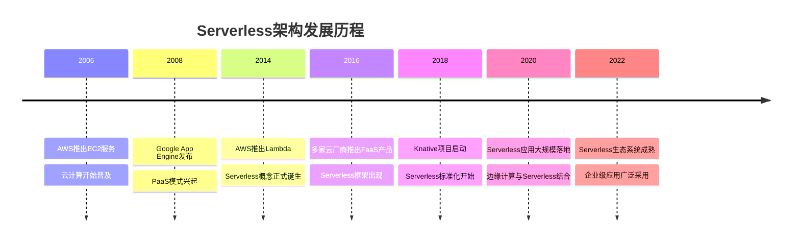
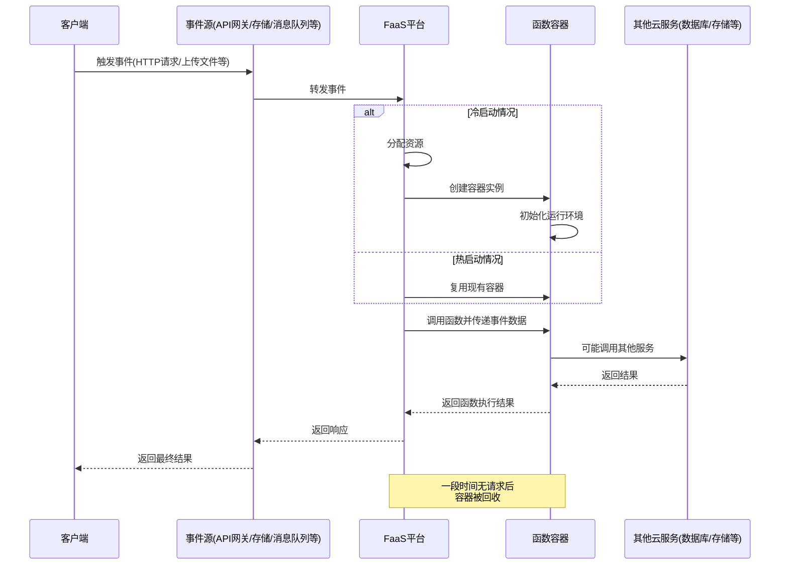
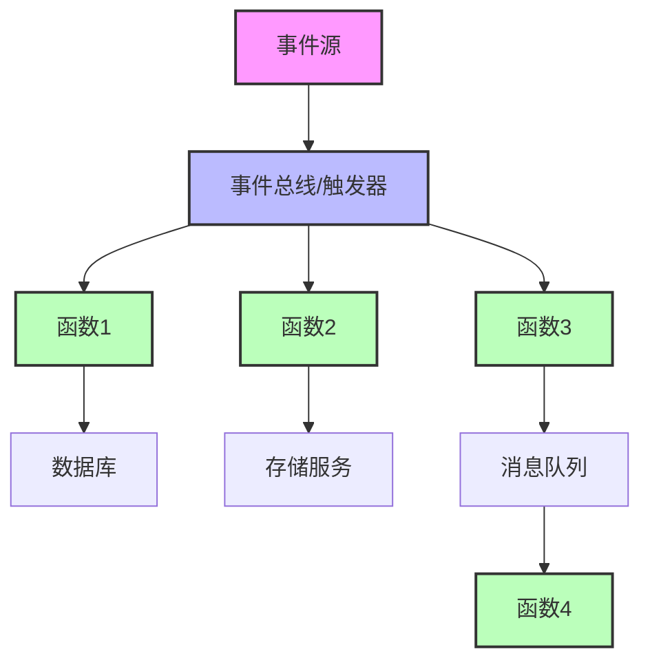
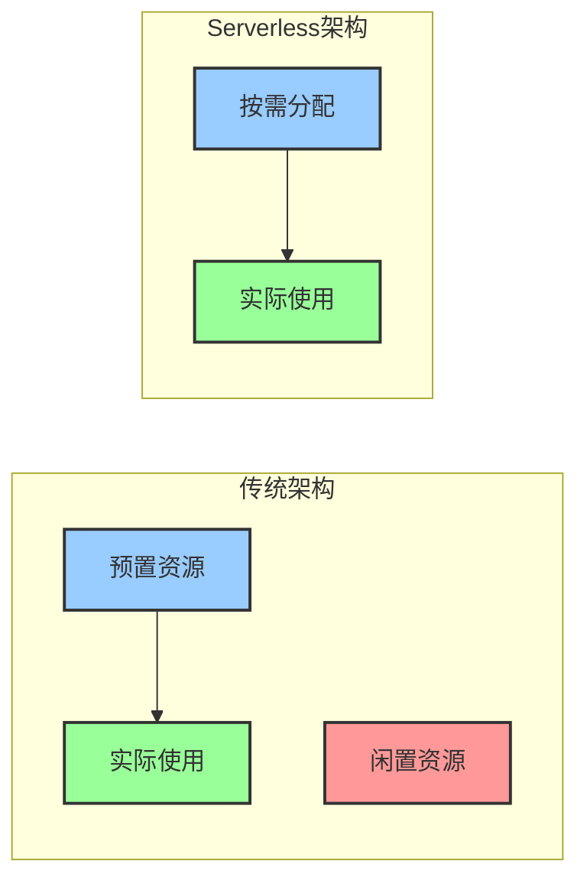
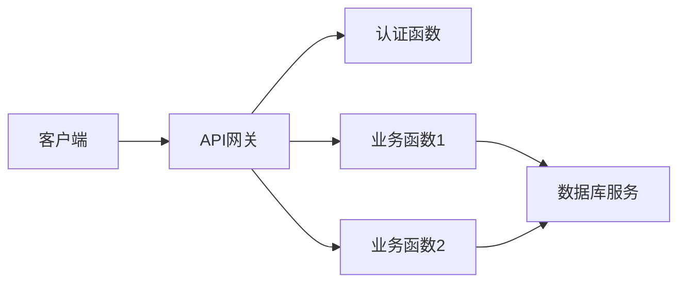
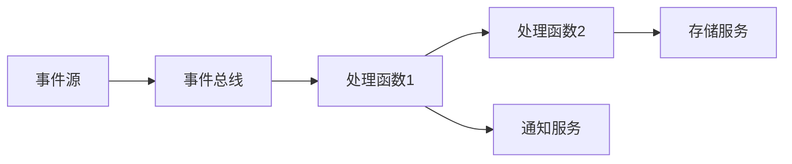
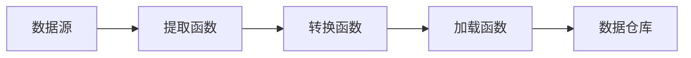
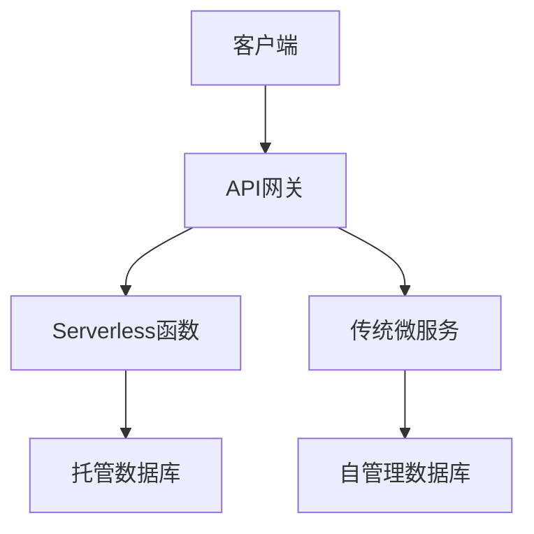

# Serverless架构原理与优势

Serverless架构是一种全新的云计算范式，它让开发者专注于业务逻辑而非基础设施管理。本文将详细介绍Serverless的工作原理、核心特性和主要优势。

## Serverless的概念与发展

### 什么是Serverless

Serverless（无服务器）并非真的没有服务器，而是开发者不再需要关心服务器的存在。在这种架构模式下，云服务提供商负责动态管理底层计算资源的分配，而开发者只需专注于编写和部署代码。

Serverless架构主要包含两种核心服务模式：
- **函数即服务（FaaS, Function as a Service）**：提供一个平台，允许开发者运行事件驱动的函数，无需管理服务器
- **后端即服务（BaaS, Backend as a Service）**：提供第三方API和云服务，替代自建后端组件

### Serverless的发展历程

Serverless架构的发展经历了以下几个关键阶段：

1. **传统架构时代（2000年代初）**：应用程序运行在自有或租用的物理服务器上，开发者需要管理所有基础设施
2. **虚拟化时代（2000年代中期）**：虚拟机技术兴起，提高了资源利用率，但仍需管理虚拟服务器
3. **云计算时代（2010年前后）**：AWS等云服务商提供IaaS服务，简化了基础设施管理
4. **容器时代（2013年后）**：Docker和Kubernetes的出现，使应用部署更加轻量和灵活
5. **Serverless时代（2014年后）**：AWS Lambda发布，标志着Serverless计算模式的正式诞生



## Serverless架构工作原理

### 基本工作流程

Serverless架构的基本工作流程如下：

1. **事件触发**：函数执行由特定事件触发，如HTTP请求、数据库变更、文件上传等
2. **资源分配**：云平台自动分配执行环境和计算资源
3. **函数执行**：代码在隔离的环境中执行，处理输入事件
4. **结果返回**：函数执行完毕，返回结果
5. **资源释放**：若无新请求，执行环境会被回收



### 冷启动与热启动

Serverless架构中的一个重要概念是冷启动和热启动：

- **冷启动（Cold Start）**：当函数被首次调用或长时间未被调用时，平台需要创建新的执行环境，这个过程会导致一定的延迟
- **热启动（Warm Start）**：如果函数最近被调用过，平台可能会保留执行环境一段时间，使后续调用能够快速响应

冷启动延迟通常由以下几个阶段组成：
1. 分配计算资源（虚拟机/容器）
2. 下载函数代码包
3. 启动运行时环境（如Node.js、Python等）
4. 执行函数初始化代码

不同云服务提供商和不同运行时环境的冷启动性能各不相同，这也是Serverless架构需要考虑的重要性能因素。

### 事件驱动模型

Serverless架构采用事件驱动模型，函数的执行由特定事件触发。常见的事件源包括：

- HTTP请求（通过API网关）
- 数据库变更（如DynamoDB Streams）
- 文件上传或修改（如S3事件）
- 消息队列消息（如SQS、Kafka）
- 定时触发器（如CloudWatch Events）
- IoT设备事件
- 自定义应用事件

这种事件驱动的特性使Serverless特别适合处理异步工作流、微服务集成和事件处理场景。



## Serverless的核心特性

### 自动弹性伸缩

Serverless平台能够根据请求负载自动扩展或收缩资源，无需人工干预：

- **精细的扩展粒度**：可以精确到单个函数实例级别
- **无限扩展能力**：理论上可以处理任意规模的并发请求（受限于云服务商的配额）
- **按需扩展**：只在需要时分配资源，无需预置
- **自动缩减**：请求减少时自动释放资源

这种特性使应用能够应对流量波峰，同时在低负载时期最小化资源消耗。

### 按使用付费模式

Serverless采用精确的按使用付费模式：

- **计算时间计费**：按函数实际执行时间计费（通常以毫秒为单位）
- **调用次数计费**：按函数被调用的次数计费
- **零使用零费用**：没有请求时不产生费用
- **资源消耗计费**：根据函数分配的内存、网络流量等资源计费

这种计费模式与传统的按时间付费（如按小时、按月）模式有本质区别，能够更精确地反映实际资源使用情况。

```
传统服务器成本 = 服务器数量 × 单价 × 时间
Serverless成本 = 调用次数 × 单次调用价格 + 执行时间 × 时间单价 × 资源配置
```

### 无状态计算

Serverless函数本质上是无状态的，这意味着：

- 每次函数调用都应该被视为独立的执行单元
- 函数执行环境可能在调用间被回收
- 不应依赖函数执行环境中的本地状态
- 需要持久化的数据应存储在外部服务中（如数据库、对象存储）

虽然在实际实现中，云服务提供商可能会在一段时间内保留函数实例以提高性能，但开发者不应依赖这种行为。

### 有限的执行时间

Serverless函数通常有执行时间限制：

- AWS Lambda：最长15分钟
- Azure Functions：最长10分钟
- Google Cloud Functions：最长9分钟

这种限制使Serverless更适合短时运行的任务，而不适合长时间运行的进程。对于需要长时间运行的任务，通常需要将其拆分为多个短时函数，或使用其他计算服务。

## Serverless架构的主要优势

### 降低运维复杂度

Serverless显著降低了运维工作量：

- **无服务器管理**：不需要配置、维护或修补服务器
- **自动扩展**：无需手动设置自动扩展规则
- **减少监控负担**：平台提供基本的监控和日志功能
- **简化部署流程**：专注于代码部署而非环境配置

这使开发团队能够将更多精力放在业务逻辑开发上，减少在基础设施管理上的投入。

### 降低成本

Serverless可以在多个方面降低成本：

- **消除资源闲置**：不再为闲置资源付费
- **精确的计费模式**：只为实际使用的资源付费
- **减少运维成本**：降低DevOps团队的工作量
- **优化开发效率**：加速开发和部署周期

特别是对于负载变化大、使用不频繁的应用，Serverless可以显著降低运营成本。



### 提高开发效率

Serverless架构能够提高开发团队的工作效率：

- **关注业务逻辑**：开发者可以专注于核心业务功能
- **减少基础代码**：许多底层功能由平台提供
- **加速上市时间**：缩短从开发到部署的周期
- **简化微服务实现**：更容易构建和管理微服务架构

通过消除对基础设施的关注，开发团队可以更快地迭代和创新。

### 内置高可用性

Serverless平台通常提供内置的高可用性特性：

- **多可用区部署**：函数自动部署在多个可用区
- **自动故障转移**：在硬件或软件故障时自动切换
- **平台级冗余**：云服务提供商管理底层冗余
- **自动恢复能力**：出现问题时自动重启函数实例

这些特性使开发者无需额外工作即可获得高可用性，减少了构建可靠系统的复杂性。

### 简化扩展能力

Serverless架构极大地简化了应用扩展：

- **自动处理流量波峰**：无需提前规划容量
- **无需配置扩展规则**：平台自动处理扩展逻辑
- **全球部署简化**：更容易在多区域部署应用
- **无扩展上限**：理论上可以扩展到任意规模

这种特性使应用能够从小规模起步，随着业务增长无缝扩展，而无需重新架构。

## Serverless的适用场景

Serverless架构并非适用于所有场景，以下是特别适合的应用类型：

### 事件处理系统

Serverless天然适合事件驱动的应用：
- 文件处理（如图像调整大小、视频转码）
- 数据流处理（如日志分析、IoT数据处理）
- 消息处理系统（如通知服务、工作流触发器）

这类应用通常有明确的触发条件和处理流程，非常契合Serverless的事件驱动模型。

### Web API和微服务

Serverless适合构建轻量级API和微服务：
- RESTful API后端
- GraphQL服务
- 微服务组件
- Webhook处理器

这些服务通常是无状态的、请求驱动的，可以充分利用Serverless的按需扩展特性。

### 定时任务和批处理

Serverless非常适合执行定期任务：
- 数据备份和同步
- 报表生成
- 定期数据清理
- 计划任务执行

这些任务通常是短时运行的，且执行频率可预测，使用Serverless可以避免为偶尔运行的任务维护专用服务器。

### 移动应用后端

Serverless可以作为移动应用的理想后端：
- 用户认证
- 数据存储和同步
- 推送通知
- API集成

移动应用的使用模式通常是突发性的，Serverless的自动扩展特性可以有效应对这种负载模式。

## Serverless的挑战与限制

尽管Serverless有诸多优势，但也面临一些挑战和限制：

### 冷启动延迟

冷启动可能导致响应延迟：
- 首次请求或长时间未使用后的请求响应较慢
- 不同语言和运行时的冷启动性能差异大
- 函数依赖项越多，冷启动越慢

对于对延迟敏感的应用，需要采取策略减轻冷启动影响，如预热函数、优化代码包大小等。

### 执行时间限制

函数执行时间的限制可能成为障碍：
- 长时间运行的任务无法直接使用Serverless
- 需要重新设计工作流以适应时间限制
- 可能需要将大任务拆分为多个小任务

对于需要长时间运行的应用，可能需要结合其他计算模式或重新设计架构。

### 状态管理复杂性

无状态特性增加了状态管理的复杂性：
- 需要依赖外部服务存储状态
- 分布式状态管理带来一致性挑战
- 可能增加对数据库和缓存服务的依赖

开发者需要精心设计状态管理策略，以确保应用正确处理状态信息。

### 供应商锁定风险

使用Serverless服务可能导致供应商锁定：
- 不同云服务提供商的API和服务不兼容
- 迁移到其他平台可能需要大量重构
- 依赖特定云服务的功能增加迁移难度

可以通过使用开源Serverless框架、采用标准化接口和避免过度依赖特定云服务来减轻这种风险。

### 监控和调试挑战

Serverless环境下的监控和调试更具挑战性：
- 分布式系统增加了问题定位难度
- 缺乏对底层基础设施的可见性
- 传统调试工具可能不适用
- 需要依赖云服务提供商的监控工具

这要求开发团队采用新的监控和调试策略，如分布式追踪、结构化日志等。

## Serverless架构模式与最佳实践

### 常见架构模式

在Serverless应用中，常见的架构模式包括：

1. **API后端模式**：
   - 使用API网关作为入口点
   - 函数处理HTTP请求
   - 数据存储在托管数据库服务中



2. **事件处理模式**：
   - 事件源触发函数执行
   - 函数处理事件并可能产生新事件
   - 形成事件驱动的处理链



3. **数据处理管道**：
   - 使用函数构建数据处理流水线
   - 每个函数负责特定的转换或处理步骤
   - 数据在函数间流动



4. **混合架构**：
   - 结合Serverless和传统架构
   - 将适合Serverless的部分迁移到函数
   - 保留需要长时间运行的组件在传统架构中



### 开发最佳实践

开发Serverless应用时的最佳实践包括：

1. **函数设计原则**：
   - 单一职责：每个函数专注于一个特定任务
   - 轻量级：保持函数代码和依赖简洁
   - 无状态：不依赖函数实例的本地状态
   - 幂等性：多次执行相同请求产生相同结果

2. **性能优化**：
   - 最小化依赖项：减少不必要的库和框架
   - 代码分层：将核心逻辑与框架代码分离
   - 使用语言运行时缓存：利用函数实例重用
   - 优化冷启动：预热函数、减小部署包大小

3. **错误处理**：
   - 实施重试机制：处理临时故障
   - 使用死信队列：捕获无法处理的消息
   - 全面日志记录：记录关键信息和错误
   - 优雅降级：在依赖服务不可用时提供备选方案

```javascript
// 函数设计示例：单一职责、错误处理、幂等性
exports.handler = async (event) => {
  try {
    // 提取请求ID用于幂等性检查
    const requestId = event.requestId || event.headers['x-request-id'];
    
    // 检查是否已处理过该请求（使用外部存储如DynamoDB）
    if (await hasProcessed(requestId)) {
      return {
        statusCode: 200,
        body: JSON.stringify({ message: 'Request already processed' })
      };
    }
    
    // 处理业务逻辑
    const result = await processBusinessLogic(event);
    
    // 记录处理结果
    await markAsProcessed(requestId);
    
    return {
      statusCode: 200,
      body: JSON.stringify(result)
    };
  } catch (error) {
    // 错误日志记录
    console.error('Error processing request:', error);
    
    // 区分不同类型的错误
    if (error.name === 'ValidationError') {
      return {
        statusCode: 400,
        body: JSON.stringify({ error: 'Invalid input' })
      };
    }
    
    if (error.name === 'DependencyError') {
      // 记录依赖服务故障，可能触发告警
      await notifyOperations(error);
      return {
        statusCode: 503,
        body: JSON.stringify({ error: 'Service temporarily unavailable' })
      };
    }
    
    // 通用错误处理
    return {
      statusCode: 500,
      body: JSON.stringify({ error: 'Internal server error' })
    };
  }
};
```

### 部署与运维最佳实践

Serverless应用的部署和运维最佳实践包括：

1. **基础设施即代码**：
   - 使用CloudFormation、Terraform等工具定义基础设施
   - 将基础设施配置纳入版本控制
   - 使用环境变量管理配置

2. **CI/CD流水线**：
   - 自动化测试和部署流程
   - 实施蓝绿部署或金丝雀发布
   - 使用专用的Serverless框架（如Serverless Framework、AWS SAM）

3. **监控与可观测性**：
   - 实施分布式追踪
   - 设置关键指标的告警
   - 集中化日志管理
   - 使用结构化日志格式

4. **安全最佳实践**：
   - 遵循最小权限原则
   - 加密敏感数据
   - 定期审计权限和配置
   - 使用安全扫描工具检查依赖项

```yaml
# Serverless Framework配置示例
service: serverless-api

provider:
  name: aws
  runtime: nodejs14.x
  stage: ${opt:stage, 'dev'}
  region: ${opt:region, 'us-east-1'}
  environment:
    DB_TABLE: ${self:service}-${self:provider.stage}
  iamRoleStatements:
    - Effect: Allow
      Action:
        - dynamodb:Query
        - dynamodb:Scan
        - dynamodb:GetItem
        - dynamodb:PutItem
      Resource: !GetAtt UsersTable.Arn

functions:
  getUser:
    handler: src/handlers/getUser.handler
    events:
      - http:
          path: users/{id}
          method: get
          cors: true
  createUser:
    handler: src/handlers/createUser.handler
    events:
      - http:
          path: users
          method: post
          cors: true

resources:
  Resources:
    UsersTable:
      Type: AWS::DynamoDB::Table
      Properties:
        TableName: ${self:provider.environment.DB_TABLE}
        BillingMode: PAY_PER_REQUEST
        AttributeDefinitions:
          - AttributeName: id
            AttributeType: S
        KeySchema:
          - AttributeName: id
            KeyType: HASH
```

## 结论

Serverless架构代表了云计算的一次重要演进，它通过抽象底层基础设施，让开发者能够更专注于业务逻辑的实现。其自动扩展、按使用付费和低运维特性，使其成为构建现代云应用的强大选择。

虽然Serverless并非适用于所有场景，且存在一些挑战和限制，但随着技术的不断成熟和生态系统的完善，这些问题正在逐步得到解决。对于许多应用场景，特别是事件驱动型应用、API和微服务，Serverless已经成为一种高效且经济的解决方案。

通过理解Serverless的核心原理、优势和最佳实践，开发者可以更好地评估其适用性，并在适当的场景中充分发挥其优势，构建更具弹性、更易维护且更具成本效益的应用。