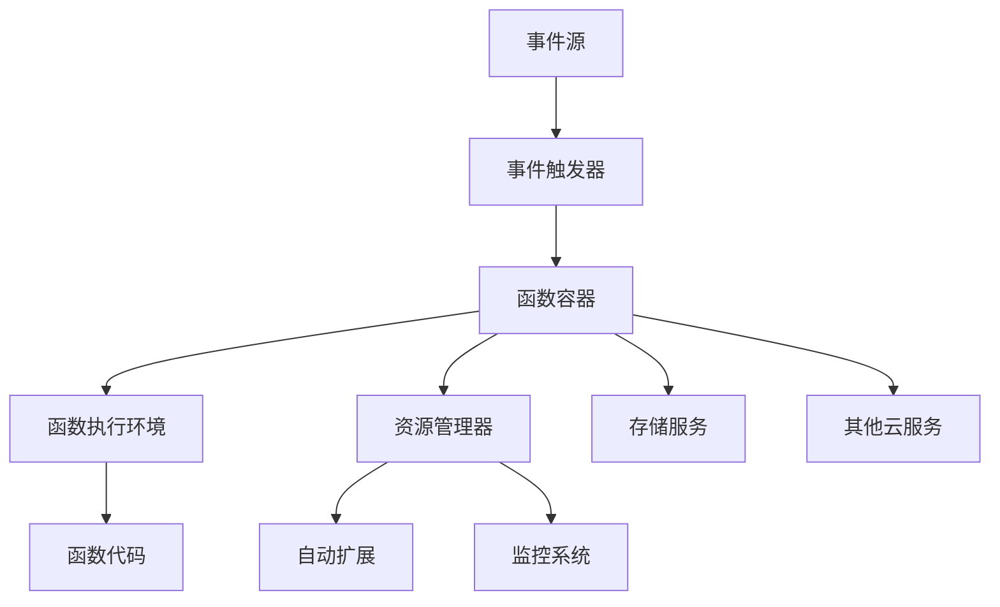
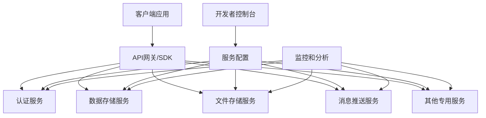
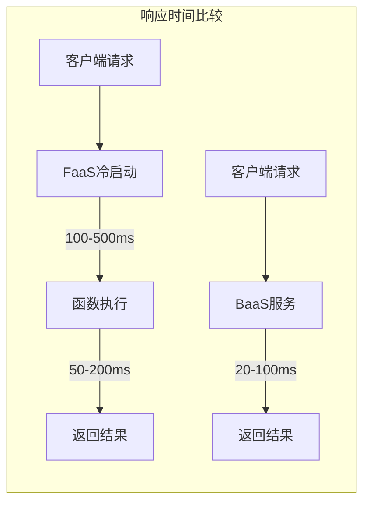
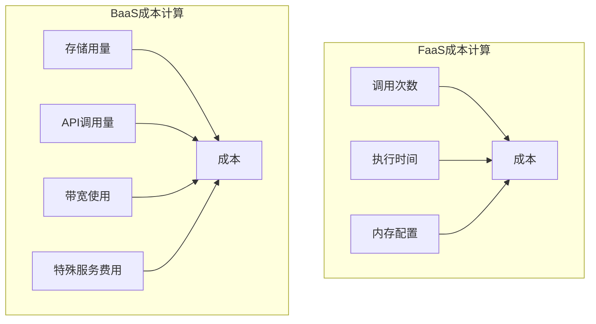
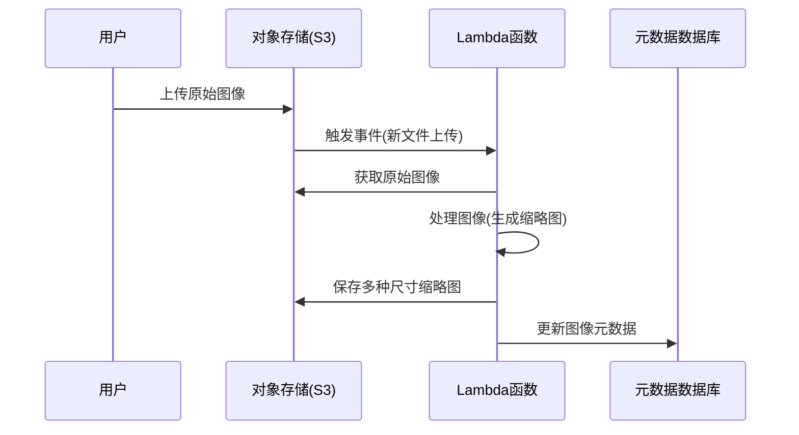
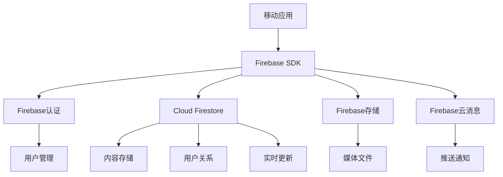
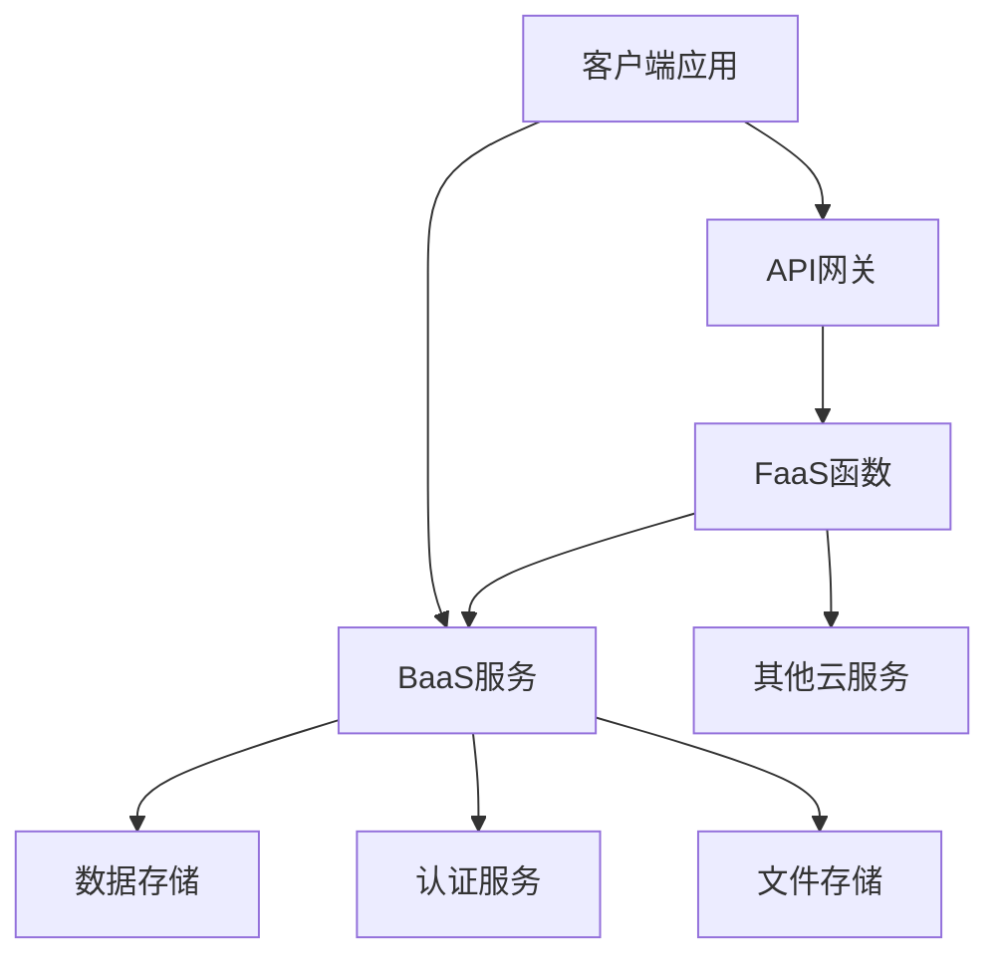
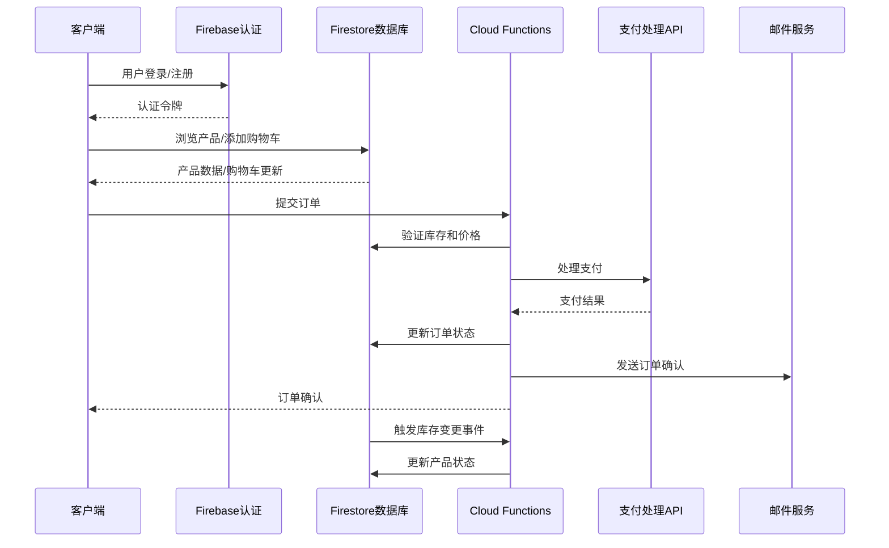
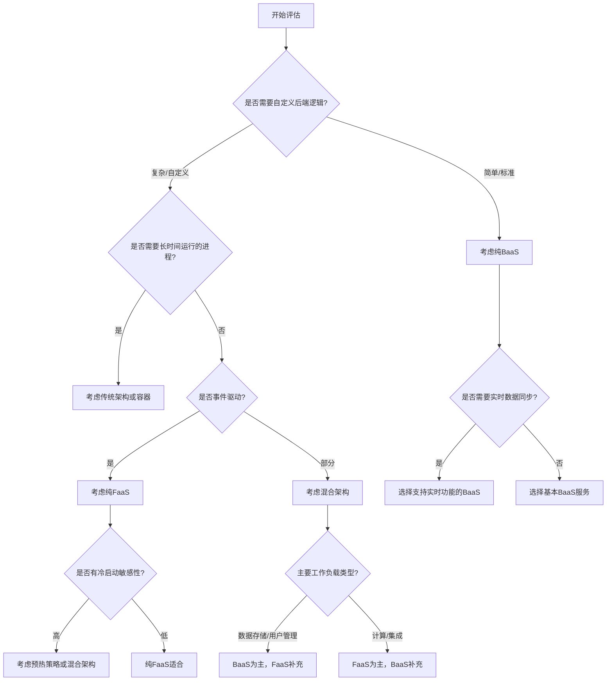

# FaaS与BaaS技术对比

Serverless架构主要包含FaaS（函数即服务）和BaaS（后端即服务）两种技术模式。本文将详细对比这两种技术的特点、应用场景和实现方式。

## FaaS与BaaS的基本概念

### FaaS（函数即服务）

FaaS是Serverless架构的核心组成部分，它提供了一个平台，允许开发者编写、部署和运行事件驱动的函数，而无需管理底层服务器基础设施。在FaaS模型中，开发者只需关注单个函数的实现，这些函数通常是短暂的、无状态的，并由特定事件触发执行。

FaaS的关键特征包括：

- **事件驱动**：函数由特定事件（如HTTP请求、数据库变更、文件上传等）触发执行
- **短暂执行**：函数通常设计为短时间运行（秒或分钟级别）
- **无状态**：函数执行之间不保留状态，每次执行都是独立的
- **自动扩展**：平台根据事件数量自动扩展函数实例
- **精确计费**：按函数实际执行时间和资源消耗计费

主流的FaaS平台包括：
- AWS Lambda
- Azure Functions
- Google Cloud Functions
- IBM Cloud Functions
- Cloudflare Workers

### BaaS（后端即服务）

BaaS提供了一系列预构建的后端服务和API，使开发者能够将这些服务直接集成到应用程序中，而无需自行构建和维护这些后端组件。BaaS服务通常包括数据存储、用户认证、文件存储、消息推送等功能。

BaaS的关键特征包括：

- **预构建服务**：提供现成的后端功能，如数据库、认证、存储等
- **API驱动**：通过API接口直接从客户端访问后端服务
- **减少服务器端代码**：减少或消除编写自定义后端代码的需求
- **统一管理**：集中管理后端服务的配置、安全和扩展
- **按使用付费**：根据服务使用量（如存储空间、API调用次数）计费

主流的BaaS服务包括：
- Firebase
- AWS Amplify
- Supabase
- MongoDB Realm
- Microsoft Azure Mobile Apps

## FaaS与BaaS的技术架构对比

### FaaS架构

FaaS平台的架构通常包含以下核心组件：



1. **事件触发系统**：接收和处理来自各种事件源的事件
2. **函数容器**：为函数提供隔离的执行环境
3. **资源管理器**：负责分配和回收计算资源
4. **自动扩展组件**：根据负载自动调整函数实例数量
5. **监控和日志系统**：跟踪函数执行和性能

FaaS的工作流程：
1. 事件源（如API网关、数据库变更）产生事件
2. 事件触发器接收事件并确定要调用的函数
3. 平台分配资源并准备函数执行环境
4. 函数代码在隔离环境中执行
5. 函数执行完毕，返回结果
6. 如无新请求，平台可能回收资源

### BaaS架构

BaaS平台的架构通常包含以下核心组件：



1. **API网关**：处理客户端请求并路由到相应服务
2. **服务集合**：包括数据库、认证、存储等预构建服务
3. **开发者控制台**：用于配置和管理服务
4. **SDK和客户端库**：简化客户端与服务的集成
5. **监控和分析工具**：提供使用情况和性能洞察

BaaS的工作流程：
1. 客户端应用通过SDK或API直接访问BaaS服务
2. BaaS平台验证请求的身份和权限
3. 相应的服务处理请求（如存储数据、验证用户）
4. 服务返回结果给客户端
5. BaaS平台负责服务的扩展、维护和监控

## 技术特点详细对比

### 开发模型对比

| 特性 | FaaS | BaaS |
|------|------|------|
| **开发重点** | 函数逻辑 | 客户端与服务集成 |
| **代码组织** | 离散函数 | 客户端应用代码 |
| **编程语言** | 多语言支持 | 取决于SDK支持 |
| **开发工作流** | 编写函数→部署→配置触发器 | 配置服务→集成SDK→开发客户端 |
| **测试方法** | 单元测试、集成测试、模拟事件 | 端到端测试、API测试 |
| **部署模式** | 函数级部署 | 服务配置部署 |

FaaS要求开发者编写和部署独立的函数，这些函数通常是事件处理的核心逻辑。而BaaS则更专注于配置和集成预构建服务，减少自定义后端代码的需求。

```javascript
// FaaS示例：AWS Lambda函数
exports.handler = async (event) => {
    // 解析请求
    const userId = event.pathParameters.userId;
    
    // 处理业务逻辑
    const userDetails = await getUserDetails(userId);
    
    // 返回响应
    return {
        statusCode: 200,
        body: JSON.stringify(userDetails)
    };
};

// BaaS示例：使用Firebase
// 客户端代码
import { initializeApp } from "firebase/app";
import { getFirestore, doc, getDoc } from "firebase/firestore";

// 初始化Firebase
const app = initializeApp(firebaseConfig);
const db = getFirestore(app);

// 直接从客户端访问数据
async function getUserDetails(userId) {
    const docRef = doc(db, "users", userId);
    const docSnap = await getDoc(docRef);
    
    if (docSnap.exists()) {
        return docSnap.data();
    } else {
        throw new Error("User not found");
    }
}
```

### 技术架构对比

| 特性 | FaaS | BaaS |
|------|------|------|
| **架构焦点** | 计算 | 服务 |
| **状态管理** | 无状态（需外部存储） | 服务内管理状态 |
| **执行模型** | 事件触发、短暂执行 | 持续可用的服务 |
| **扩展模型** | 函数实例自动扩展 | 服务级自动扩展 |
| **资源隔离** | 函数级隔离 | 服务级隔离 |
| **集成方式** | 事件和API | SDK和API |

FaaS专注于提供计算能力，函数本身是无状态的，需要依赖外部服务存储状态。而BaaS则提供完整的后端服务，这些服务内部管理状态，客户端可以直接访问。

### 性能特性对比

| 特性 | FaaS | BaaS |
|------|------|------|
| **冷启动** | 存在冷启动延迟 | 服务常驻，无冷启动 |
| **响应时间** | 可能受冷启动影响 | 通常更稳定 |
| **执行限制** | 有时间和资源限制 | 服务级限制，通常更宽松 |
| **并发处理** | 自动扩展处理并发 | 服务内部处理并发 |
| **资源效率** | 按需分配资源 | 服务级资源分配 |

FaaS的一个主要挑战是冷启动延迟，当函数长时间未被调用时，首次调用可能需要额外时间来准备执行环境。BaaS服务通常是持续运行的，不存在这个问题，但可能在资源效率上不如FaaS。



### 成本模型对比

| 特性 | FaaS | BaaS |
|------|------|------|
| **计费单位** | 函数调用次数、执行时间、内存分配 | 服务使用量（存储、带宽、API调用） |
| **闲置成本** | 几乎为零 | 可能有基础费用 |
| **扩展成本** | 线性增长 | 可能有阶梯式定价 |
| **预测性** | 与请求量直接相关 | 与服务使用模式相关 |
| **优化方向** | 减少执行时间和内存使用 | 优化服务使用效率 |

FaaS的成本与函数的实际执行直接相关，无请求时基本无成本。BaaS的成本则与使用的服务类型和用量相关，可能包含一些基础费用。



### 安全模型对比

| 特性 | FaaS | BaaS |
|------|------|------|
| **认证模型** | 通常需要自定义实现或集成 | 内置认证服务 |
| **授权控制** | 函数级和资源级权限 | 服务级和数据级权限 |
| **数据安全** | 开发者负责实现 | 部分内置安全功能 |
| **网络安全** | 平台提供基础保护 | 服务内置保护 |
| **合规性** | 取决于平台和实现 | 服务级合规性 |

BaaS通常提供更多内置的安全功能，如用户认证和数据访问控制。而FaaS则需要开发者更多地自行实现或集成这些安全功能。

## 应用场景对比

### FaaS适用场景

FaaS特别适合以下应用场景：

1. **事件处理和工作流**
   - 文件处理（如图像调整大小、视频转码）
   - 数据转换和ETL流程
   - 消息处理和通知系统

2. **API后端**
   - 轻量级REST API
   - 微服务组件
   - Webhook处理器

3. **定时任务**
   - 定期数据处理
   - 报表生成
   - 系统维护任务

4. **实时数据处理**
   - IoT数据处理
   - 日志分析
   - 流数据处理

5. **异步任务处理**
   - 后台作业
   - 长时间运行任务的协调者
   - 队列处理器

FaaS的优势在这些场景中体现为：
- 精确的资源分配
- 事件驱动的自然契合
- 简化的扩展和运维
- 按使用付费的经济性

### BaaS适用场景

BaaS特别适合以下应用场景：

1. **移动应用后端**
   - 用户认证和管理
   - 数据同步
   - 推送通知
   - 社交功能

2. **Web应用**
   - 单页应用(SPA)后端
   - 实时协作应用
   - 内容管理系统

3. **原型和MVP开发**
   - 快速验证产品概念
   - 减少初始开发时间
   - 专注于前端体验

4. **数据驱动应用**
   - 实时数据库应用
   - 分析仪表板
   - 用户生成内容平台

5. **IoT应用**
   - 设备管理
   - 数据收集和存储
   - 设备通知和控制

BaaS的优势在这些场景中体现为：
- 减少后端开发工作
- 内置的用户管理和认证
- 实时数据同步能力
- 集成的文件存储和CDN

## 实际应用案例分析

### FaaS应用案例：图像处理服务

**需求**：构建一个服务，当用户上传图像到存储桶时，自动生成多种尺寸的缩略图。

**FaaS实现方案**：



**代码示例**：

```javascript
// AWS Lambda图像处理函数
const AWS = require('aws-sdk');
const sharp = require('sharp');
const s3 = new AWS.S3();
const dynamoDB = new AWS.DynamoDB.DocumentClient();

exports.handler = async (event) => {
    // 获取上传事件信息
    const bucket = event.Records[0].s3.bucket.name;
    const key = decodeURIComponent(event.Records[0].s3.object.key.replace(/\+/g, ' '));
    
    try {
        // 获取原始图像
        const originalImage = await s3.getObject({ Bucket: bucket, Key: key }).promise();
        
        // 定义缩略图尺寸
        const sizes = [
            { width: 100, height: 100, suffix: 'thumb' },
            { width: 300, height: 300, suffix: 'small' },
            { width: 800, height: 800, suffix: 'medium' }
        ];
        
        // 处理每种尺寸
        const thumbnailPromises = sizes.map(async (size) => {
            // 生成缩略图
            const thumbnail = await sharp(originalImage.Body)
                .resize(size.width, size.height, { fit: 'inside' })
                .toBuffer();
            
            // 构建新的文件名
            const thumbnailKey = `thumbnails/${key.split('.')[0]}_${size.suffix}.jpg`;
            
            // 上传缩略图
            await s3.putObject({
                Bucket: bucket,
                Key: thumbnailKey,
                Body: thumbnail,
                ContentType: 'image/jpeg'
            }).promise();
            
            return thumbnailKey;
        });
        
        // 等待所有缩略图处理完成
        const thumbnailKeys = await Promise.all(thumbnailPromises);
        
        // 更新元数据
        await dynamoDB.put({
            TableName: 'ImageMetadata',
            Item: {
                imageId: key.split('/').pop().split('.')[0],
                originalKey: key,
                thumbnails: thumbnailKeys,
                processedAt: new Date().toISOString()
            }
        }).promise();
        
        return {
            statusCode: 200,
            body: JSON.stringify({ message: 'Image processed successfully' })
        };
    } catch (error) {
        console.error('Error processing image:', error);
        return {
            statusCode: 500,
            body: JSON.stringify({ error: 'Failed to process image' })
        };
    }
};
```

**优势**：
- 按需处理，无需常驻服务器
- 自动扩展处理能力，应对上传高峰
- 只在处理图像时产生成本
- 与存储服务紧密集成

### BaaS应用案例：社交媒体应用

**需求**：构建一个社交媒体应用，用户可以创建账户、发布内容、关注其他用户并接收实时更新。

**BaaS实现方案**：



**代码示例**：

```javascript
// 使用Firebase的React Native应用示例

// 初始化Firebase
import { initializeApp } from 'firebase/app';
import { getAuth, signInWithEmailAndPassword, createUserWithEmailAndPassword } from 'firebase/auth';
import { getFirestore, collection, addDoc, query, where, onSnapshot } from 'firebase/firestore';
import { getStorage, ref, uploadBytes, getDownloadURL } from 'firebase/storage';
import { getMessaging, getToken } from 'firebase/messaging';

const firebaseConfig = {
    apiKey: "YOUR_API_KEY",
    authDomain: "your-app.firebaseapp.com",
    projectId: "your-app",
    storageBucket: "your-app.appspot.com",
    messagingSenderId: "YOUR_SENDER_ID",
    appId: "YOUR_APP_ID"
};

const app = initializeApp(firebaseConfig);
const auth = getAuth(app);
const db = getFirestore(app);
const storage = getStorage(app);
const messaging = getMessaging(app);

// 用户注册
async function registerUser(email, password, displayName) {
    try {
        // 创建用户
        const userCredential = await createUserWithEmailAndPassword(auth, email, password);
        const user = userCredential.user;
        
        // 创建用户资料
        await addDoc(collection(db, "users"), {
            uid: user.uid,
            displayName: displayName,
            email: email,
            createdAt: new Date(),
            followers: [],
            following: []
        });
        
        // 设置消息推送令牌
        const token = await getToken(messaging);
        await addDoc(collection(db, "tokens"), {
            uid: user.uid,
            token: token
        });
        
        return user;
    } catch (error) {
        console.error("Error registering user:", error);
        throw error;
    }
}

// 发布内容
async function createPost(content, imageUri) {
    try {
        const user = auth.currentUser;
        
        // 上传图片（如果有）
        let imageUrl = null;
        if (imageUri) {
            const storageRef = ref(storage, `posts/${user.uid}/${Date.now()}`);
            const response = await fetch(imageUri);
            const blob = await response.blob();
            await uploadBytes(storageRef, blob);
            imageUrl = await getDownloadURL(storageRef);
        }
        
        // 创建帖子
        const postRef = await addDoc(collection(db, "posts"), {
            content: content,
            imageUrl: imageUrl,
            authorId: user.uid,
            createdAt: new Date(),
            likes: 0,
            comments: []
        });
        
        return postRef.id;
    } catch (error) {
        console.error("Error creating post:", error);
        throw error;
    }
}

// 关注用户
async function followUser(targetUserId) {
    try {
        const user = auth.currentUser;
        
        // 更新当前用户的following列表
        const userQuery = query(collection(db, "users"), where("uid", "==", user.uid));
        const userSnapshot = await getDocs(userQuery);
        const userDoc = userSnapshot.docs[0];
        await updateDoc(userDoc.ref, {
            following: arrayUnion(targetUserId)
        });
        
        // 更新目标用户的followers列表
        const targetQuery = query(collection(db, "users"), where("uid", "==", targetUserId));
        const targetSnapshot = await getDocs(targetQuery);
        const targetDoc = targetSnapshot.docs[0];
        await updateDoc(targetDoc.ref, {
            followers: arrayUnion(user.uid)
        });
        
        return true;
    } catch (error) {
        console.error("Error following user:", error);
        throw error;
    }
}

// 实时获取关注用户的帖子
function subscribeToFeed(callback) {
    const user = auth.currentUser;
    
    // 获取用户关注的人
    const userQuery = query(collection(db, "users"), where("uid", "==", user.uid));
    onSnapshot(userQuery, (userSnapshot) => {
        const userData = userSnapshot.docs[0].data();
        const following = userData.following || [];
        
        // 查询关注用户的帖子
        const postsQuery = query(
            collection(db, "posts"),
            where("authorId", "in", [...following, user.uid]),
            orderBy("createdAt", "desc")
        );
        
        // 实时监听帖子更新
        onSnapshot(postsQuery, (postsSnapshot) => {
            const posts = postsSnapshot.docs.map(doc => ({
                id: doc.id,
                ...doc.data()
            }));
            callback(posts);
        });
    });
}
```

**优势**：
- 内置用户认证和管理
- 实时数据同步和更新
- 集成的文件存储和消息推送
- 减少后端开发工作
- 客户端直接访问数据，减少延迟

## 混合使用策略

在实际应用中，FaaS和BaaS通常不是非此即彼的选择，而是可以结合使用，发挥各自优势。

### 混合架构模式



常见的混合使用模式包括：

1. **BaaS作为数据层，FaaS作为处理层**
   - 使用BaaS服务（如Firebase）存储和管理数据
   - 使用FaaS处理复杂业务逻辑或执行后台任务

2. **BaaS处理标准功能，FaaS处理自定义逻辑**
   - 使用BaaS提供认证、存储等标准功能
   - 使用FaaS实现特定的业务逻辑或集成第三方服务

3. **FaaS扩展BaaS能力**
   - 使用BaaS作为主要后端
   - 使用FaaS添加BaaS平台不提供的功能

4. **事件驱动的混合架构**
   - BaaS服务产生事件
   - FaaS函数响应这些事件并执行操作

### 混合架构案例：电子商务应用

**需求**：构建一个电子商务应用，包含产品浏览、用户认证、购物车和订单处理功能。

**混合实现方案**：



**代码示例**：

```javascript
// 混合使用Firebase(BaaS)和Cloud Functions(FaaS)

// 客户端代码 - 使用BaaS服务
import { initializeApp } from 'firebase/app';
import { getAuth, signInWithEmailAndPassword } from 'firebase/auth';
import { getFirestore, collection, addDoc, doc, updateDoc } from 'firebase/firestore';

const app = initializeApp(firebaseConfig);
const auth = getAuth(app);
const db = getFirestore(app);

// 用户登录 - 使用BaaS认证服务
async function loginUser(email, password) {
    try {
        const userCredential = await signInWithEmailAndPassword(auth, email, password);
        return userCredential.user;
    } catch (error) {
        console.error("Login error:", error);
        throw error;
    }
}

// 添加到购物车 - 使用BaaS数据库
async function addToCart(productId, quantity) {
    try {
        const user = auth.currentUser;
        
        // 检查购物车是否已存在
        const cartQuery = query(collection(db, "carts"), where("userId", "==", user.uid));
        const cartSnapshot = await getDocs(cartQuery);
        
        if (cartSnapshot.empty) {
            // 创建新购物车
            await addDoc(collection(db, "carts"), {
                userId: user.uid,
                items: [{productId, quantity}],
                updatedAt: new Date()
            });
        } else {
            // 更新现有购物车
            const cartDoc = cartSnapshot.docs[0];
            const cartData = cartDoc.data();
            const items = cartData.items || [];
            
            // 检查产品是否已在购物车中
            const existingItemIndex = items.findIndex(item => item.productId === productId);
            
            if (existingItemIndex >= 0) {
                items[existingItemIndex].quantity += quantity;
            } else {
                items.push({productId, quantity});
            }
            
            await updateDoc(cartDoc.ref, {
                items: items,
                updatedAt: new Date()
            });
        }
    } catch (error) {
        console.error("Error adding to cart:", error);
        throw error;
    }
}

// 服务端代码 - Cloud Functions (FaaS)

// 订单处理函数 - 复杂业务逻辑使用FaaS
exports.processOrder = functions.https.onCall(async (data, context) => {
    // 验证用户身份
    if (!context.auth) {
        throw new functions.https.HttpsError('unauthenticated', 'User must be logged in');
    }
    
    const userId = context.auth.uid;
    const { cartId, paymentDetails, shippingAddress } = data;
    
    try {
        //
让我继续完成 FaaS 与 BaaS 技术对比的内容：

```javascript
// 订单处理函数 - 复杂业务逻辑使用FaaS
exports.processOrder = functions.https.onCall(async (data, context) => {
    // 验证用户身份
    if (!context.auth) {
        throw new functions.https.HttpsError('unauthenticated', 'User must be logged in');
    }
    
    const userId = context.auth.uid;
    const { cartId, paymentDetails, shippingAddress } = data;
    
    try {
        // 获取购物车数据
        const cartRef = db.collection('carts').doc(cartId);
        const cartSnapshot = await cartRef.get();
        
        if (!cartSnapshot.exists) {
            throw new functions.https.HttpsError('not-found', 'Cart not found');
        }
        
        const cartData = cartSnapshot.data();
        
        // 验证购物车属于当前用户
        if (cartData.userId !== userId) {
            throw new functions.https.HttpsError('permission-denied', 'Not authorized to access this cart');
        }
        
        // 获取产品详情并计算总价
        const items = cartData.items || [];
        let orderItems = [];
        let totalAmount = 0;
        
        for (const item of items) {
            const productRef = db.collection('products').doc(item.productId);
            const productSnapshot = await productRef.get();
            
            if (!productSnapshot.exists) {
                throw new functions.https.HttpsError('not-found', `Product ${item.productId} not found`);
            }
            
            const productData = productSnapshot.data();
            
            // 检查库存
            if (productData.stock < item.quantity) {
                throw new functions.https.HttpsError('failed-precondition', 
                    `Not enough stock for product ${productData.name}`);
            }
            
            // 计算商品总价
            const itemTotal = productData.price * item.quantity;
            totalAmount += itemTotal;
            
            orderItems.push({
                productId: item.productId,
                name: productData.name,
                price: productData.price,
                quantity: item.quantity,
                total: itemTotal
            });
            
            // 更新库存
            await productRef.update({
                stock: admin.firestore.FieldValue.increment(-item.quantity)
            });
        }
        
        // 处理支付 - 集成第三方支付API
        const paymentResult = await processPayment(paymentDetails, totalAmount);
        
        if (!paymentResult.success) {
            throw new functions.https.HttpsError('aborted', 'Payment failed: ' + paymentResult.message);
        }
        
        // 创建订单
        const orderRef = await db.collection('orders').add({
            userId,
            items: orderItems,
            totalAmount,
            shippingAddress,
            paymentId: paymentResult.paymentId,
            status: 'paid',
            createdAt: admin.firestore.FieldValue.serverTimestamp()
        });
        
        // 清空购物车
        await cartRef.update({
            items: [],
            updatedAt: admin.firestore.FieldValue.serverTimestamp()
        });
        
        // 发送订单确认邮件
        await sendOrderConfirmationEmail(userId, orderRef.id, orderItems, totalAmount);
        
        return {
            success: true,
            orderId: orderRef.id
        };
    } catch (error) {
        console.error('Order processing error:', error);
        throw new functions.https.HttpsError('internal', 'Failed to process order');
    }
});

// 库存变更触发函数 - 事件驱动的FaaS
exports.onProductStockChange = functions.firestore
    .document('products/{productId}')
    .onUpdate(async (change, context) => {
        const previousData = change.before.data();
        const newData = change.after.data();
        
        // 只在库存变化时触发
        if (previousData.stock === newData.stock) {
            return null;
        }
        
        // 库存低于阈值时发送通知
        if (newData.stock < newData.lowStockThreshold) {
            await db.collection('notifications').add({
                type: 'low_stock',
                productId: context.params.productId,
                productName: newData.name,
                currentStock: newData.stock,
                threshold: newData.lowStockThreshold,
                createdAt: admin.firestore.FieldValue.serverTimestamp()
            });
            
            // 通知管理员
            await sendLowStockAlert(newData.name, newData.stock);
        }
        
        return null;
    });
```

**优势**：
- 使用BaaS处理用户认证和基本数据存储，简化客户端开发
- 使用FaaS处理复杂的订单逻辑和支付集成，确保安全性和一致性
- 利用FaaS的事件驱动特性自动响应库存变化
- 结合两种技术的优势，既简化开发又保持灵活性

## 选择指南与决策框架

在选择FaaS、BaaS或混合架构时，可以参考以下决策框架：

### 技术选择决策树



### 评估因素清单

在做技术选择时，应考虑以下关键因素：

1. **应用特性**
   - 应用类型（Web、移动、IoT等）
   - 交互模式（实时、请求-响应、批处理）
   - 状态管理需求
   - 计算密集度

2. **技术要求**
   - 响应时间要求
   - 扩展性需求
   - 集成需求
   - 安全要求

3. **团队因素**
   - 开发团队技能
   - 开发速度要求
   - 维护资源

4. **业务考量**
   - 预算约束
   - 供应商锁定风险
   - 合规性要求
   - 长期演进计划

### 选择矩阵

| 需求/特性 | 推荐选择 | 理由 |
|---------|---------|------|
| 快速开发移动应用 | BaaS | 内置用户管理、数据存储和实时同步 |
| 事件处理系统 | FaaS | 事件驱动、按需扩展、精确计费 |
| 复杂业务逻辑 | FaaS或混合 | 自定义代码灵活性、集成能力 |
| 实时协作应用 | BaaS | 内置实时数据同步功能 |
| 高性能API | 混合或传统 | 避免冷启动延迟、资源控制 |
| 批处理任务 | FaaS | 按需执行、无需常驻资源 |
| 完整应用生态系统 | 混合 | 结合两种技术的优势 |

## 未来趋势与发展方向

FaaS和BaaS技术正在不断发展，未来趋势包括：

### 技术融合

1. **无缝集成**
   - FaaS和BaaS服务之间的边界逐渐模糊
   - 统一的开发体验和管理界面
   - 自动化的服务编排和集成

2. **低代码/无代码整合**
   - 可视化工具集成FaaS和BaaS功能
   - 拖放式服务组合和工作流定义
   - 减少编码需求，提高开发效率

### 性能优化

1. **冷启动改进**
   - 更快的容器初始化
   - 预热和保持活动策略
   - 轻量级运行时环境

2. **边缘计算集成**
   - FaaS扩展到边缘节点
   - 减少延迟，提高响应速度
   - 本地数据处理与云端协同

### 开发体验提升

1. **开发工具改进**
   - 更好的本地开发和测试体验
   - 增强的调试和监控能力
   - 完整的CI/CD集成

2. **标准化**
   - 跨平台标准和规范
   - 减少供应商锁定
   - 开源实现的普及

### 企业级功能增强

1. **高级安全特性**
   - 细粒度访问控制
   - 增强的加密和合规功能
   - 安全最佳实践自动化

2. **混合云和多云支持**
   - 跨云环境的一致体验
   - 统一管理和监控
   - 灵活的部署选项

## 总结

FaaS和BaaS代表了Serverless架构的两种核心技术模式，各自具有独特的特点和优势。FaaS专注于提供事件驱动的计算能力，让开发者只需关注函数逻辑；而BaaS则提供预构建的后端服务，减少或消除自定义后端代码的需求。

在实际应用中，这两种技术并非相互排斥，而是可以结合使用，形成强大的混合架构。选择适当的技术组合应基于应用需求、团队能力和业务目标，通过评估各种因素做出明智决策。

随着技术的不断发展，FaaS和BaaS之间的界限可能会逐渐模糊，形成更加集成和无缝的Serverless体验。开发者应保持对这一领域新趋势的关注，以便充分利用Serverless技术带来的优势，构建更具弹性、可扩展性和成本效益的应用。