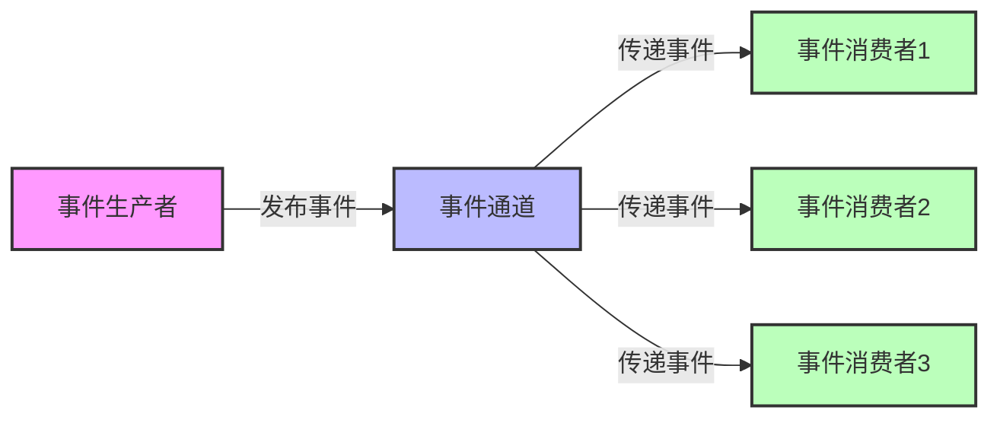
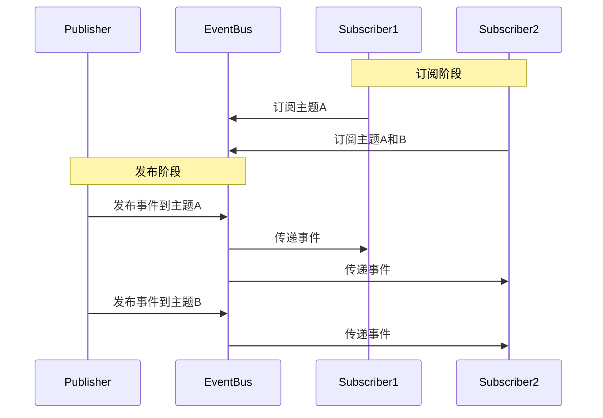
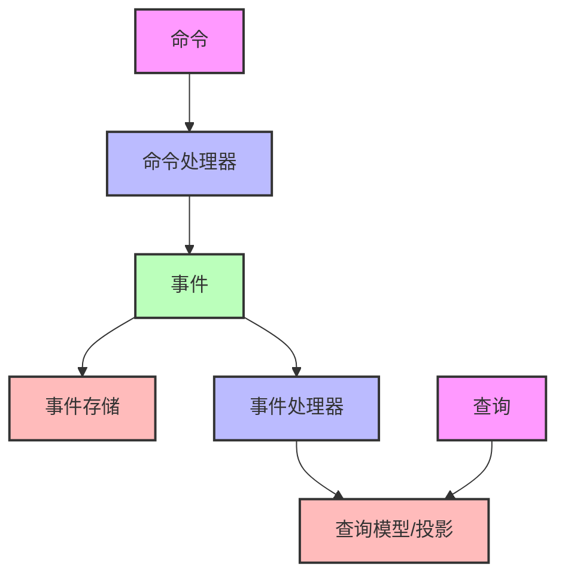
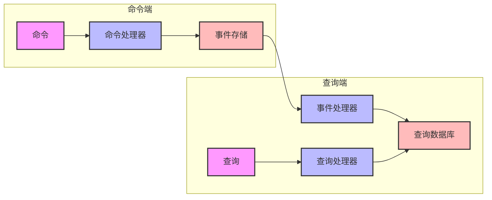
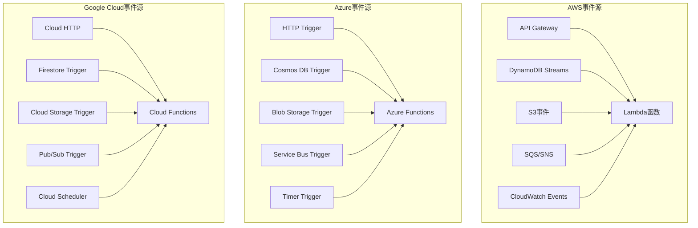
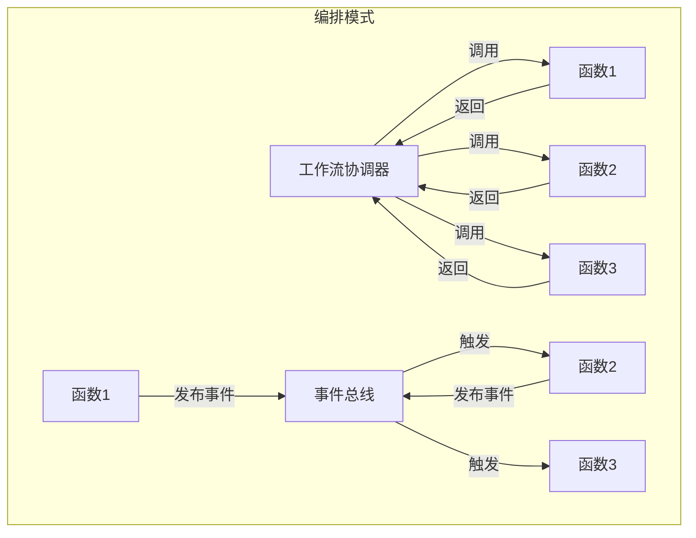
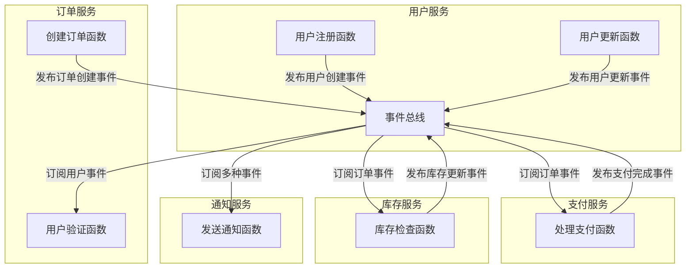
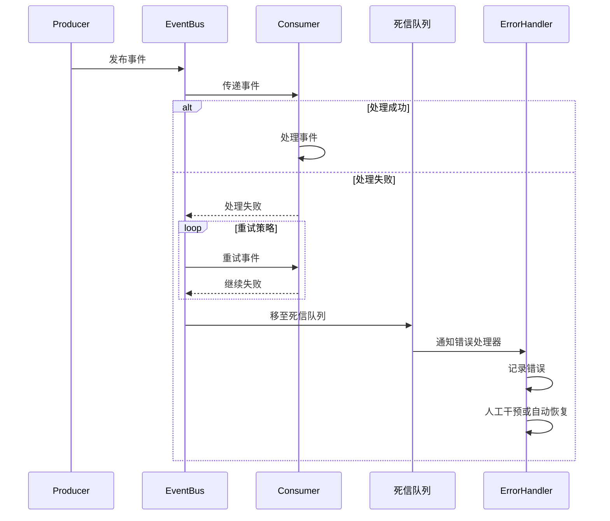
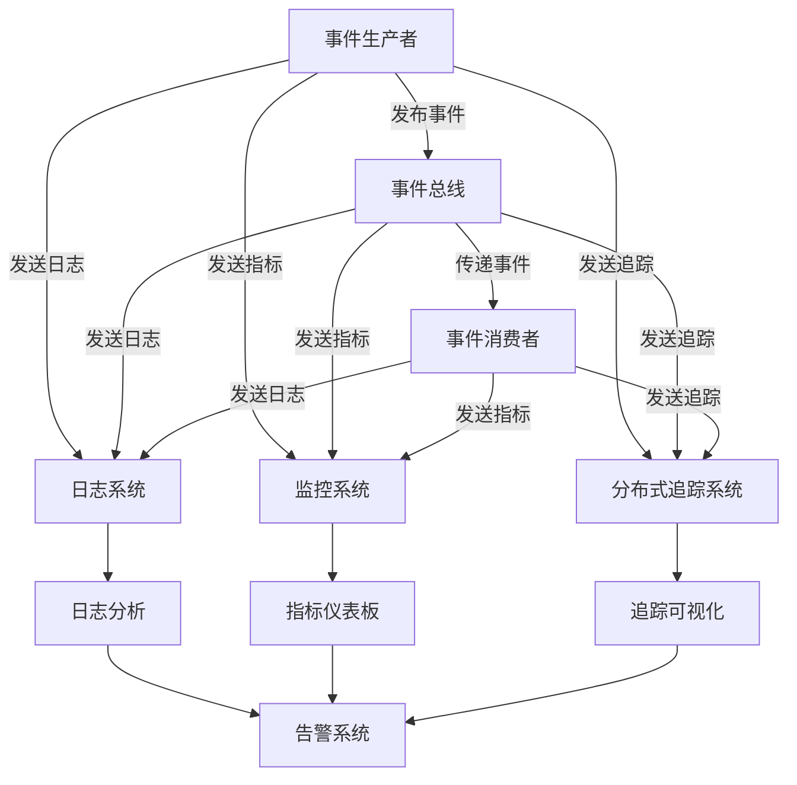
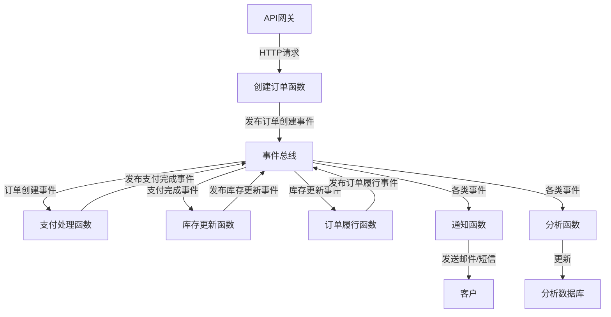

# 事件驱动架构设计

事件驱动架构是Serverless应用的核心设计模式，它通过事件触发函数执行，实现松耦合和高扩展性。本文将详细介绍事件驱动架构的原理和设计方法。

## 事件驱动架构的基本概念

### 什么是事件驱动架构

事件驱动架构（Event-Driven Architecture，简称EDA）是一种软件架构模式，其中系统的各个组件通过生产和消费事件进行通信，而不是通过直接调用彼此的方法或API。在这种架构中，当某个重要的状态变化（事件）发生时，会生成一个事件通知，然后由一个或多个事件消费者对该事件做出响应。

事件驱动架构的核心元素包括：

- **事件（Event）**：表示系统中发生的某种状态变化，通常包含事件类型和相关数据
- **事件生产者（Event Producer）**：生成事件并将其发布到事件通道的组件
- **事件通道（Event Channel）**：传输事件的媒介，如消息队列、事件总线等
- **事件消费者（Event Consumer）**：订阅并响应事件的组件
- **事件处理器（Event Handler）**：实际处理事件的逻辑单元



### 事件驱动架构与Serverless的关系

事件驱动架构与Serverless计算模型有着天然的契合性，主要体现在以下几个方面：

1. **按需执行**：Serverless函数只在事件发生时才会执行，与事件驱动模型的按需响应特性一致
2. **无状态特性**：事件驱动架构鼓励组件之间通过事件通信而非共享状态，这与Serverless函数的无状态特性相符
3. **自动扩展**：事件驱动架构可以根据事件流量自动扩展处理能力，这与Serverless的自动扩展特性相匹配
4. **松耦合设计**：事件生产者和消费者之间的解耦，使系统更容易扩展和演化，这也是Serverless应用的设计目标

在Serverless环境中，函数通常由各种事件触发，如HTTP请求、数据库变更、文件上传、消息队列消息等，使得Serverless应用天然地采用事件驱动架构。

## 事件驱动架构的核心模式

### 发布-订阅模式

发布-订阅（Publish-Subscribe，简称Pub/Sub）是事件驱动架构中最基本的模式。在这种模式下：

- 发布者（Publisher）生成事件并发布到一个主题（Topic）
- 订阅者（Subscriber）订阅感兴趣的主题
- 当发布者发布事件时，所有订阅该主题的订阅者都会收到通知

这种模式实现了发布者和订阅者之间的完全解耦，发布者不需要知道谁在订阅，订阅者也不需要知道谁在发布。



在Serverless环境中，这种模式通常通过云服务提供商的事件总线或消息服务实现，如AWS EventBridge、Google Cloud Pub/Sub或Azure Event Grid。

### 事件溯源模式

事件溯源（Event Sourcing）是一种更高级的事件驱动模式，它将应用程序状态的变化存储为一系列事件，而不是仅存储当前状态。这种模式的核心思想是：

- 将所有状态变更作为事件序列持久化存储
- 通过重放事件序列可以重建任意时间点的系统状态
- 当前状态只是事件序列的派生结果



事件溯源在Serverless架构中特别有用，因为：

- 它支持事件驱动的函数触发
- 它允许构建不同的数据视图（投影）以满足不同查询需求
- 它提供了完整的审计跟踪和历史记录
- 它使系统能够在任何时间点重建状态

### 命令查询责任分离（CQRS）

命令查询责任分离（Command Query Responsibility Segregation，简称CQRS）通常与事件溯源结合使用，它将系统的读操作（查询）和写操作（命令）分离：

- **命令端**：处理所有修改系统状态的操作，生成事件
- **查询端**：提供优化的数据视图，用于读取操作



在Serverless环境中，CQRS模式可以通过以下方式实现：

- 使用不同的函数处理命令和查询
- 命令函数生成事件并存储到事件存储中
- 事件触发其他函数更新查询数据库
- 查询函数从优化的查询数据库中读取数据

这种分离允许命令端和查询端独立扩展，并针对各自的需求进行优化。

## 事件驱动架构在Serverless中的实现

### 事件源与触发器

在Serverless环境中，函数通常由各种事件源触发。常见的事件源包括：

1. **HTTP事件**：通过API网关触发的HTTP请求
2. **数据库事件**：数据库记录的创建、更新或删除
3. **存储事件**：文件的上传、删除或修改
4. **消息队列事件**：队列中新消息的到达
5. **定时事件**：按计划触发的事件
6. **自定义事件**：应用程序定义的特定事件

每种云服务提供商都提供了各种事件源和触发器，以支持事件驱动的Serverless应用程序：



### 事件格式与结构

事件通常以JSON格式表示，包含以下关键部分：

1. **事件元数据**：事件ID、时间戳、类型等
2. **事件来源**：生成事件的系统或组件
3. **事件数据**：事件的具体内容或负载

以下是一个典型的AWS Lambda事件示例（S3事件）：

```json
{
  "Records": [
    {
      "eventVersion": "2.1",
      "eventSource": "aws:s3",
      "awsRegion": "us-east-1",
      "eventTime": "2023-01-15T12:34:56.000Z",
      "eventName": "ObjectCreated:Put",
      "userIdentity": {
        "principalId": "EXAMPLE"
      },
      "requestParameters": {
        "sourceIPAddress": "127.0.0.1"
      },
      "responseElements": {
        "x-amz-request-id": "EXAMPLE123456789",
        "x-amz-id-2": "EXAMPLE123/abcdefghijklmno"
      },
      "s3": {
        "s3SchemaVersion": "1.0",
        "configurationId": "testConfigRule",
        "bucket": {
          "name": "example-bucket",
          "ownerIdentity": {
            "principalId": "EXAMPLE"
          },
          "arn": "arn:aws:s3:::example-bucket"
        },
        "object": {
          "key": "test/key",
          "size": 1024,
          "eTag": "0123456789abcdef0123456789abcdef",
          "sequencer": "0A1B2C3D4E5F678901"
        }
      }
    }
  ]
}
```

设计良好的事件应该：

- 包含足够的信息，使消费者能够处理事件而无需额外查询
- 使用版本控制，以支持事件结构的演化
- 遵循一致的命名约定和结构
- 避免包含敏感信息或过大的数据负载

### 事件路由与过滤

在复杂的事件驱动系统中，有效的事件路由和过滤至关重要：

1. **基于主题的路由**：根据事件主题或类型将事件路由到相应的处理程序
2. **基于内容的过滤**：根据事件内容或属性过滤事件
3. **事件转换**：在路由过程中转换事件格式或结构

大多数云服务提供商都提供了事件过滤功能：

```javascript
// AWS EventBridge规则示例
{
  "source": ["aws.s3"],
  "detail-type": ["Object Created"],
  "detail": {
    "bucket": {
      "name": ["my-important-bucket"]
    },
    "object": {
      "key": [{
        "prefix": "uploads/"
      }]
    }
  }
}
```

在Serverless应用中，可以使用以下策略进行事件路由：

1. **使用专用的事件路由服务**：如AWS EventBridge、Google Cloud Pub/Sub
2. **使用函数内部逻辑进行路由**：在函数内部根据事件类型调用不同的处理逻辑
3. **使用事件总线模式**：实现自定义的事件总线来路由和分发事件

## 事件驱动架构的设计模式与最佳实践

### 事件驱动工作流设计

事件驱动工作流是一种通过事件链接多个函数来实现复杂业务流程的模式。在Serverless环境中，可以通过以下方式实现：

1. **编排模式**：使用中央协调器（如AWS Step Functions、Azure Durable Functions）管理工作流
2. **编排模式**：函数之间通过事件链式触发，形成工作流



编排模式的优势：
- 中央可视化和监控
- 内置错误处理和重试
- 状态管理和工作流控制

编排模式的优势：
- 松耦合设计
- 更好的扩展性
- 更灵活的事件处理

以下是使用AWS Step Functions实现订单处理工作流的示例：

```json
{
  "Comment": "订单处理工作流",
  "StartAt": "验证订单",
  "States": {
    "验证订单": {
      "Type": "Task",
      "Resource": "arn:aws:lambda:us-east-1:123456789012:function:validateOrder",
      "Next": "检查库存"
    },
    "检查库存": {
      "Type": "Task",
      "Resource": "arn:aws:lambda:us-east-1:123456789012:function:checkInventory",
      "Next": "处理支付",
      "Catch": [
        {
          "ErrorEquals": ["InventoryError"],
          "Next": "库存不足处理"
        }
      ]
    },
    "库存不足处理": {
      "Type": "Task",
      "Resource": "arn:aws:lambda:us-east-1:123456789012:function:handleOutOfStock",
      "End": true
    },
    "处理支付": {
      "Type": "Task",
      "Resource": "arn:aws:lambda:us-east-1:123456789012:function:processPayment",
      "Next": "创建发货单",
      "Catch": [
        {
          "ErrorEquals": ["PaymentError"],
          "Next": "支付失败处理"
        }
      ]
    },
    "支付失败处理": {
      "Type": "Task",
      "Resource": "arn:aws:lambda:us-east-1:123456789012:function:handlePaymentFailure",
      "End": true
    },
    "创建发货单": {
      "Type": "Task",
      "Resource": "arn:aws:lambda:us-east-1:123456789012:function:createShipment",
      "Next": "发送订单确认"
    },
    "发送订单确认": {
      "Type": "Task",
      "Resource": "arn:aws:lambda:us-east-1:123456789012:function:sendOrderConfirmation",
      "End": true
    }
  }
}
```

### 事件驱动的微服务设计

事件驱动架构非常适合微服务设计，因为它促进了服务之间的松耦合。在事件驱动的微服务架构中：

1. **每个微服务负责特定的业务功能**
2. **微服务通过事件进行通信，而不是直接调用**
3. **每个微服务可以有自己的数据存储**
4. **微服务可以独立部署和扩展**



在Serverless环境中实现事件驱动微服务的最佳实践：

1. **定义清晰的服务边界**：基于业务能力或领域划分服务
2. **设计丰富的事件模型**：事件应包含足够的上下文信息
3. **实现事件版本控制**：支持事件结构的演化
4. **使用异步通信**：减少服务间的直接依赖
5. **实现幂等性处理**：确保重复事件不会导致错误

### 事件驱动架构中的错误处理

在事件驱动架构中，错误处理尤为重要，因为事件处理通常是异步的，没有直接的调用方等待响应。有效的错误处理策略包括：

1. **死信队列（DLQ）**：将无法处理的事件路由到专门的队列进行后续处理
2. **重试策略**：定义适当的重试次数和退避策略
3. **补偿事务**：实现撤销操作的事件处理程序
4. **事件追踪**：记录事件处理的每个步骤，便于调试和审计



在AWS Lambda中实现死信队列：

```yaml
Resources:
  MyFunction:
    Type: AWS::Serverless::Function
    Properties:
      Handler: index.handler
      Runtime: nodejs14.x
      Events:
        SQSEvent:
          Type: SQS
          Properties:
            Queue: !GetAtt MyQueue.Arn
            BatchSize: 10
      DeadLetterQueue:
        Type: SQS
        TargetArn: !GetAtt MyDLQ.Arn

  MyQueue:
    Type: AWS::SQS::Queue

  MyDLQ:
    Type: AWS::SQS::Queue
    Properties:
      MessageRetentionPeriod: 1209600  # 14天
```

### 事件驱动架构的监控与可观测性

在事件驱动系统中，由于组件之间的松耦合性，监控和可观测性尤为重要。有效的监控策略包括：

1. **分布式追踪**：跟踪事件在不同服务间的流转
2. **事件日志**：记录事件的生产、传递和消费
3. **指标收集**：监控事件处理的性能和健康状况
4. **告警设置**：对异常情况进行及时告警



在AWS环境中实现事件驱动架构的监控：

1. **使用X-Ray进行分布式追踪**
2. **使用CloudWatch Logs记录事件日志**
3. **使用CloudWatch Metrics监控事件处理指标**
4. **设置CloudWatch Alarms进行告警**

```javascript
// 在Lambda函数中启用X-Ray追踪
const AWSXRay = require('aws-xray-sdk-core');
const AWS = AWSXRay.captureAWS(require('aws-sdk'));

exports.handler = async (event) => {
    // 创建新的子分段
    const subsegment = AWSXRay.getSegment().addNewSubsegment('processEvent');
    
    try {
        // 记录事件信息
        subsegment.addAnnotation('eventType', event.detail.type);
        subsegment.addAnnotation('eventSource', event.source);
        
        // 处理事件
        const result = await processEvent(event);
        
        // 记录处理结果
        subsegment.addMetadata('result', result);
        
        subsegment.close();
        return result;
    } catch (error) {
        // 记录错误
        subsegment.addError(error);
        subsegment.close();
        throw error;
    }
};

async function processEvent(event) {
    // 事件处理逻辑
    // ...
}
```

## 实际案例分析

### 电子商务订单处理系统

**需求**：构建一个电子商务订单处理系统，包括订单创建、支付处理、库存管理和订单履行。

**事件驱动解决方案**：



**实现要点**：

1. **事件定义**：
   - 订单创建事件（OrderCreated）
   - 支付完成事件（PaymentProcessed）
   - 库存更新事件（InventoryUpdated）
   - 订单履行事件（OrderFulfilled）

2. **函数实现**：
   - 每个函数专注于单一责任
   - 函数通过事件总线通信
   - 实现幂等性处理

3. **错误处理**：
   - 使用死信队列处理失败事件
   - 实现补偿事务（如支付失败时恢复库存）

```javascript
// 创建订单函数示例
exports.handler = async (event) => {
    try {
        // 解析请求
        const orderData = JSON.parse(event.body);
        
        // 验证订单数据
        validateOrderData(orderData);
        
        // 创建订单记录
        const order = await createOrderInDatabase(orderData);
        
        // 发布订单创建事件
        await publishEvent('OrderCreated', {
            orderId: order.id,
            customerId: order.customerId,
            items: order.items,
            totalAmount: order.totalAmount,
            timestamp: new Date().toISOString()
        });
        
        return {
            statusCode: 201,
            body: JSON.stringify({ orderId: order.id })
        };
    } catch (error) {
        console.error('Error creating order:', error);
        
        return {
            statusCode: 500,
            body: JSON.stringify({ error: 'Failed to create order' })
        };
    }
};

// 支付处理函数示例
exports.handler = async (event) => {
    try {
        // 处理订单创建事件
        const orderCreatedEvent = event.detail;
        const orderId = orderCreatedEvent.orderId;
        
        // 检查是否已处理（幂等性检查）
        if (await hasPaymentBeenProcessed(orderId)) {
            console.log(`Payment for order ${orderId} already processed`);
            return;
        }
        
        // 处理支付
        const paymentResult = await processPayment(orderCreatedEvent);
        
        // 记录支付结果
        await recordPaymentResult(orderId, paymentResult);
        
        // 发布支付完成事件
        await publishEvent('PaymentProcessed', {
            orderId: orderId,
            paymentId: paymentResult.paymentId,
            status: paymentResult.status,
            timestamp: new Date().toISOString()
        });
    } catch (error) {
        console.error(`Error processing payment for order ${event.detail.orderId}:`, error);
        
        // 发布支付失败事件
        await publishEvent('PaymentFailed', {
            orderId: event.detail.orderId,
            reason: error.message,
            timestamp: new Date().toISOString()
        });
        
        throw error;
    }
};
```

### 实时数据处理管道

**需求**：构建一个实时数据处理管道，用于收集、处理和分析IoT设备数据。

**事件驱动解决方案**：

```mermaid
graph TD
    A[IoT设备] -->|发送数据| B[IoT Hub]
    B -->|设备数据事件| C[数据摄取函数]
    C -->|发布原始数据事件| D[事件总线]
    
    D -->|原始数据事件| E[数据验证函数]
    E -->|发布验证数据事件| D
    
    D -->|验证数据事件| F[数据转换函数]
    F -->|发布转换数据事件| D
    
    D -->|转换数据事件| G[数据聚合函数]
    G -->|发布聚合数据事件| D
    
    D -->|聚合数据事
让我继续完成事件驱动架构设计的内容：

```mermaid
graph TD
    D -->|转换数据事件| G[数据聚合函数]
    G -->|发布聚合数据事件| D
    
    D -->|聚合数据事件| H[数据存储函数]
    H -->|存储数据| I[时序数据库]
    
    D -->|各类数据事件| J[异常检测函数]
    J -->|发布告警事件| D
    
    D -->|告警事件| K[通知函数]
    K -->|发送告警| L[运维人员]
    
    D -->|聚合数据事件| M[可视化函数]
    M -->|更新| N[实时仪表板]
```

**实现要点**：

1. **事件定义**：
   - 原始数据事件（RawDataReceived）
   - 验证数据事件（DataValidated）
   - 转换数据事件（DataTransformed）
   - 聚合数据事件（DataAggregated）
   - 告警事件（AnomalyDetected）

2. **函数实现**：
   - 每个函数专注于数据处理管道的一个阶段
   - 使用事件总线连接各个处理阶段
   - 实现并行处理以提高吞吐量

3. **性能优化**：
   - 使用批处理减少函数调用次数
   - 实现缓存减少数据库访问
   - 使用流处理框架处理高吞吐量数据

```javascript
// 数据摄取函数示例
exports.handler = async (event) => {
    try {
        // 批量处理IoT消息
        const messages = event.Records.map(record => {
            // 解析设备消息
            const message = JSON.parse(record.body);
            
            // 添加元数据
            return {
                deviceId: message.deviceId,
                sensorType: message.sensorType,
                value: message.value,
                timestamp: message.timestamp || new Date().toISOString(),
                receivedAt: new Date().toISOString()
            };
        });
        
        // 批量发布原始数据事件
        await Promise.all(messages.map(message => 
            publishEvent('RawDataReceived', message)
        ));
        
        return { processed: messages.length };
    } catch (error) {
        console.error('Error ingesting IoT data:', error);
        throw error;
    }
};

// 数据验证函数示例
exports.handler = async (event) => {
    try {
        // 获取原始数据事件
        const rawData = event.detail;
        
        // 验证数据
        const validationResult = validateData(rawData);
        
        if (validationResult.valid) {
            // 发布验证数据事件
            await publishEvent('DataValidated', {
                ...rawData,
                validatedAt: new Date().toISOString()
            });
        } else {
            // 发布数据验证失败事件
            await publishEvent('DataValidationFailed', {
                data: rawData,
                errors: validationResult.errors,
                timestamp: new Date().toISOString()
            });
        }
    } catch (error) {
        console.error('Error validating data:', error);
        throw error;
    }
};
```

## 事件驱动架构的挑战与解决方案

### 事件一致性与顺序保证

在分布式事件驱动系统中，确保事件的一致性和顺序是一个挑战：

1. **事件顺序问题**：事件可能不按发生顺序到达
2. **事件重复问题**：同一事件可能被多次传递
3. **事件丢失问题**：事件可能在传输过程中丢失

解决方案：

1. **事件版本化**：为事件添加版本号或序列号
2. **幂等性处理**：确保多次处理同一事件不会产生副作用
3. **事件溯源**：通过事件日志重建状态
4. **使用有序队列**：某些消息队列服务提供FIFO（先进先出）保证

```javascript
// 幂等性处理示例
async function processPayment(orderId, amount) {
    // 生成幂等键（可以是订单ID加上操作类型）
    const idempotencyKey = `payment_${orderId}`;
    
    // 检查是否已处理
    const processed = await checkProcessed(idempotencyKey);
    if (processed) {
        console.log(`Payment for order ${orderId} already processed`);
        return processed.result;
    }
    
    try {
        // 处理支付
        const result = await paymentService.charge(orderId, amount);
        
        // 记录处理结果
        await recordProcessed(idempotencyKey, result);
        
        return result;
    } catch (error) {
        // 如果是非临时性错误，也记录失败结果
        if (!isTransientError(error)) {
            await recordProcessed(idempotencyKey, { error: error.message });
        }
        throw error;
    }
}
```

### 事件驱动系统的测试策略

测试事件驱动系统比测试传统单体应用更具挑战性：

1. **单元测试**：测试单个函数的逻辑
2. **集成测试**：测试函数与其他服务的交互
3. **端到端测试**：测试完整的事件流程
4. **混沌测试**：测试系统在故障情况下的行为

有效的测试策略包括：

1. **事件模拟**：模拟事件源生成的事件
2. **本地测试环境**：使用本地模拟器测试函数
3. **事件回放**：记录和回放生产环境中的事件
4. **契约测试**：确保事件生产者和消费者之间的契约一致

```javascript
// 单元测试示例（使用Jest）
test('订单创建函数应正确处理有效订单', async () => {
    // 模拟数据库函数
    const mockCreateOrder = jest.fn().mockResolvedValue({
        id: 'order-123',
        customerId: 'customer-456',
        items: [{ productId: 'product-789', quantity: 2 }],
        totalAmount: 100
    });
    
    // 模拟事件发布函数
    const mockPublishEvent = jest.fn().mockResolvedValue({});
    
    // 替换实际实现
    createOrderInDatabase = mockCreateOrder;
    publishEvent = mockPublishEvent;
    
    // 创建模拟事件
    const event = {
        body: JSON.stringify({
            customerId: 'customer-456',
            items: [{ productId: 'product-789', quantity: 2 }],
            totalAmount: 100
        })
    };
    
    // 调用函数
    const result = await createOrderHandler(event);
    
    // 验证结果
    expect(result.statusCode).toBe(201);
    expect(JSON.parse(result.body).orderId).toBe('order-123');
    
    // 验证数据库调用
    expect(mockCreateOrder).toHaveBeenCalledTimes(1);
    
    // 验证事件发布
    expect(mockPublishEvent).toHaveBeenCalledTimes(1);
    expect(mockPublishEvent).toHaveBeenCalledWith(
        'OrderCreated',
        expect.objectContaining({
            orderId: 'order-123',
            customerId: 'customer-456'
        })
    );
});
```

### 事件驱动架构的性能优化

事件驱动系统的性能优化策略包括：

1. **批处理**：批量处理事件减少函数调用开销
2. **并行处理**：并行处理独立事件提高吞吐量
3. **事件过滤**：只处理相关事件减少不必要的处理
4. **缓存**：缓存频繁访问的数据减少外部调用
5. **预热**：保持函数实例温暖减少冷启动延迟

```javascript
// 批处理示例
exports.handler = async (event) => {
    // 批量获取事件
    const events = event.Records;
    
    // 按类型分组事件
    const eventsByType = events.reduce((groups, record) => {
        const event = JSON.parse(record.body);
        const type = event.type;
        
        if (!groups[type]) {
            groups[type] = [];
        }
        
        groups[type].push(event);
        return groups;
    }, {});
    
    // 并行处理不同类型的事件
    await Promise.all(
        Object.entries(eventsByType).map(([type, events]) => 
            processEventBatch(type, events)
        )
    );
    
    return { processed: events.length };
};

async function processEventBatch(type, events) {
    console.log(`Processing ${events.length} events of type ${type}`);
    
    // 批量获取相关数据
    const ids = events.map(e => e.entityId);
    const entities = await batchGetEntities(ids);
    
    // 处理每个事件
    const results = await Promise.all(
        events.map(event => 
            processEvent(event, entities[event.entityId])
        )
    );
    
    // 批量写入结果
    await batchWriteResults(results);
    
    return results;
}
```

### 事件驱动架构的安全考虑

事件驱动系统的安全挑战和解决方案：

1. **事件认证和授权**：
   - 使用签名验证事件来源
   - 实现细粒度的事件访问控制

2. **敏感数据处理**：
   - 加密敏感事件数据
   - 实现数据脱敏策略

3. **事件注入防护**：
   - 验证事件格式和内容
   - 实施输入验证和清理

4. **审计和合规**：
   - 记录事件处理的完整审计跟踪
   - 实现数据保留和删除策略

```javascript
// 事件验证示例
function verifyEvent(event, signature, publicKey) {
    // 验证事件签名
    const isSignatureValid = crypto.verify(
        'sha256',
        Buffer.from(JSON.stringify(event)),
        publicKey,
        Buffer.from(signature, 'base64')
    );
    
    if (!isSignatureValid) {
        throw new Error('Invalid event signature');
    }
    
    // 验证事件时间戳（防止重放攻击）
    const eventTime = new Date(event.timestamp);
    const now = new Date();
    const fiveMinutesAgo = new Date(now.getTime() - 5 * 60 * 1000);
    
    if (eventTime < fiveMinutesAgo || eventTime > now) {
        throw new Error('Event timestamp is outside acceptable range');
    }
    
    // 验证事件格式和内容
    validateEventSchema(event);
    
    return true;
}
```

## 结论与最佳实践总结

### 事件驱动架构的关键优势

1. **松耦合**：组件之间通过事件通信，减少直接依赖
2. **可扩展性**：系统可以根据事件负载自动扩展
3. **响应性**：实时响应事件，提高系统响应能力
4. **弹性**：组件故障不会直接影响其他组件
5. **演进性**：系统可以通过添加新的事件消费者轻松扩展功能

### 设计事件驱动系统的最佳实践

1. **事件设计**：
   - 设计丰富、自包含的事件
   - 实现事件版本控制
   - 使用一致的命名约定

2. **系统架构**：
   - 根据业务能力划分服务边界
   - 选择适当的事件传递机制
   - 实现有效的事件路由和过滤

3. **实现策略**：
   - 编写幂等的事件处理程序
   - 实现有效的错误处理和重试策略
   - 构建全面的监控和可观测性

4. **运维考虑**：
   - 实施有效的测试策略
   - 规划适当的扩展策略
   - 建立安全最佳实践

### 何时选择事件驱动架构

事件驱动架构特别适合以下场景：

1. **实时数据处理**：需要实时响应和处理数据流
2. **微服务集成**：需要在微服务之间实现松耦合通信
3. **复杂工作流**：需要协调多个步骤的业务流程
4. **高扩展性需求**：需要根据负载自动扩展系统
5. **多方通知**：需要将变更通知多个消费者

在Serverless环境中，事件驱动架构是一种自然的设计选择，它充分利用了Serverless的按需执行、自动扩展和松耦合特性，帮助开发者构建响应迅速、高度可扩展且成本效益高的应用程序。

通过深入理解事件驱动架构的原理、模式和最佳实践，开发者可以有效地设计和实现现代Serverless应用，充分发挥事件驱动模型的优势，同时避免常见的陷阱和挑战。