# Serverless应用设计模式

Serverless环境下的应用设计需要遵循特定的模式和最佳实践。本文将详细介绍Serverless应用的常见设计模式、架构考量和实现策略。

## Serverless设计模式基础

### Serverless架构的特性与约束

Serverless架构具有以下核心特性，这些特性直接影响了应用设计模式的选择：

1. **无状态执行**：函数实例之间不共享内存状态
2. **短暂生命周期**：函数执行完成后资源被回收
3. **事件驱动**：函数由事件触发而非持续运行
4. **自动扩展**：根据事件数量自动扩展实例数
5. **按使用付费**：仅为实际执行时间和资源付费

这些特性带来的设计约束包括：

- **冷启动延迟**：首次调用或长时间未调用后的延迟
- **执行时间限制**：大多数平台限制单次执行时间（通常为几分钟）
- **状态管理挑战**：需要依赖外部服务存储状态
- **资源限制**：内存、CPU、并发数等资源限制

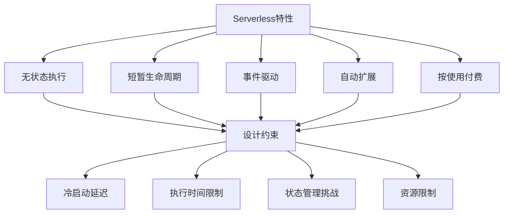

### Serverless设计原则

在设计Serverless应用时，应遵循以下核心原则：

1. **单一职责**：每个函数应专注于单一任务
2. **无状态设计**：避免依赖函数实例的内部状态
3. **事件驱动思维**：围绕事件流设计应用架构
4. **异步处理**：将长时间运行的任务拆分为多个异步步骤
5. **最小化依赖**：减少依赖项以降低冷启动时间
6. **幂等性**：确保函数可以安全地多次执行
7. **弹性设计**：处理临时故障和重试逻辑

这些原则帮助开发者充分利用Serverless的优势，同时规避其局限性。

## 函数设计模式

### 单一职责函数模式

**描述**：每个函数专注于单一、明确定义的任务。

**优势**：
- 简化测试和调试
- 提高代码可维护性
- 优化函数执行时间
- 支持独立扩展和部署

**实现示例**：

```javascript
// 不推荐：多职责函数
exports.processOrder = async (event) => {
    // 验证订单
    const order = JSON.parse(event.body);
    const validationResult = validateOrder(order);
    if (!validationResult.valid) {
        return { statusCode: 400, body: JSON.stringify(validationResult.errors) };
    }
    
    // 处理支付
    const paymentResult = await processPayment(order);
    if (!paymentResult.success) {
        return { statusCode: 400, body: JSON.stringify({ error: 'Payment failed' }) };
    }
    
    // 更新库存
    await updateInventory(order.items);
    
    // 发送确认邮件
    await sendOrderConfirmation(order, paymentResult);
    
    return { statusCode: 200, body: JSON.stringify({ orderId: order.id }) };
};

// 推荐：单一职责函数
// 1. 订单验证函数
exports.validateOrder = async (event) => {
    const order = JSON.parse(event.body);
    const validationResult = validateOrder(order);
    
    if (!validationResult.valid) {
        return { statusCode: 400, body: JSON.stringify(validationResult.errors) };
    }
    
    // 发布订单验证事件
    await publishEvent('OrderValidated', { order });
    
    return { statusCode: 200, body: JSON.stringify({ orderId: order.id }) };
};

// 2. 支付处理函数
exports.processPayment = async (event) => {
    const { order } = event.detail;
    const paymentResult = await processPayment(order);
    
    if (paymentResult.success) {
        await publishEvent('PaymentProcessed', { order, paymentResult });
    } else {
        await publishEvent('PaymentFailed', { order, error: paymentResult.error });
    }
};

// 3. 库存更新函数
exports.updateInventory = async (event) => {
    const { order } = event.detail;
    await updateInventory(order.items);
    await publishEvent('InventoryUpdated', { order });
};

// 4. 订单确认函数
exports.sendOrderConfirmation = async (event) => {
    const { order, paymentResult } = event.detail;
    await sendOrderConfirmation(order, paymentResult);
    await publishEvent('OrderConfirmationSent', { order });
};
```

### 函数组合模式

**描述**：将复杂流程分解为多个小型函数，并通过事件或工作流编排它们。

**优势**：
- 提高代码复用性
- 简化单个函数的复杂度
- 支持并行执行
- 提高系统弹性

**实现方式**：

1. **事件链模式**：函数通过发布事件触发下一个函数

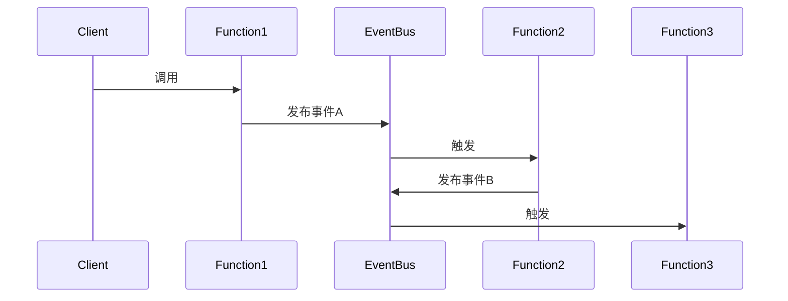

2. **工作流编排模式**：使用工作流服务（如AWS Step Functions）编排函数执行

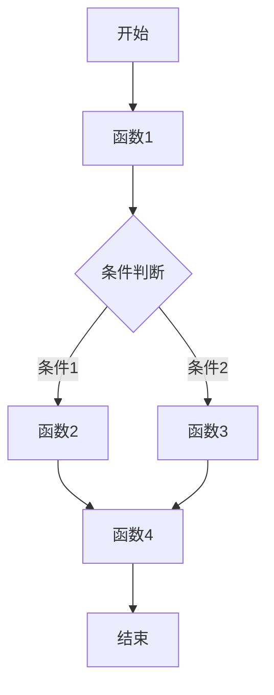

**实现示例**（使用AWS Step Functions）：

```json
{
  "Comment": "订单处理工作流",
  "StartAt": "ValidateOrder",
  "States": {
    "ValidateOrder": {
      "Type": "Task",
      "Resource": "arn:aws:lambda:us-east-1:123456789012:function:validateOrder",
      "Next": "ProcessPayment"
    },
    "ProcessPayment": {
      "Type": "Task",
      "Resource": "arn:aws:lambda:us-east-1:123456789012:function:processPayment",
      "Next": "PaymentChoice"
    },
    "PaymentChoice": {
      "Type": "Choice",
      "Choices": [
        {
          "Variable": "$.paymentResult.success",
          "BooleanEquals": true,
          "Next": "UpdateInventory"
        }
      ],
      "Default": "HandlePaymentFailure"
    },
    "HandlePaymentFailure": {
      "Type": "Task",
      "Resource": "arn:aws:lambda:us-east-1:123456789012:function:handlePaymentFailure",
      "End": true
    },
    "UpdateInventory": {
      "Type": "Task",
      "Resource": "arn:aws:lambda:us-east-1:123456789012:function:updateInventory",
      "Next": "SendOrderConfirmation"
    },
    "SendOrderConfirmation": {
      "Type": "Task",
      "Resource": "arn:aws:lambda:us-east-1:123456789012:function:sendOrderConfirmation",
      "End": true
    }
  }
}
```

### 扇出模式

**描述**：一个函数触发多个并行执行的函数，用于并行处理任务。

**优势**：
- 提高处理速度
- 支持大规模并行处理
- 降低单个函数的复杂度

**实现方式**：

1. **消息队列扇出**：将消息发送到队列，多个函数实例并行处理
2. **事件总线扇出**：发布事件到事件总线，多个订阅者并行处理
3. **直接调用扇出**：函数直接并行调用多个其他函数

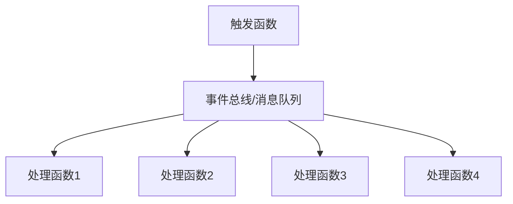

**实现示例**：

```javascript
// 扇出函数 - 使用事件总线
exports.processImageBatch = async (event) => {
    const images = JSON.parse(event.body).images;
    
    // 为每个图像发布单独的处理事件
    const publishPromises = images.map(image => 
        publishEvent('ImageProcessingRequested', { imageUrl: image.url, options: image.options })
    );
    
    await Promise.all(publishPromises);
    
    return {
        statusCode: 202,
        body: JSON.stringify({ message: `Processing ${images.length} images` })
    };
};

// 图像处理函数 - 订阅事件
exports.processImage = async (event) => {
    const { imageUrl, options } = event.detail;
    
    // 处理单个图像
    const processedImageUrl = await processImage(imageUrl, options);
    
    // 发布处理完成事件
    await publishEvent('ImageProcessingCompleted', {
        originalUrl: imageUrl,
        processedUrl: processedImageUrl
    });
};
```

### 扇入模式

**描述**：多个函数的输出汇集到一个函数进行聚合处理。

**优势**：
- 支持分布式处理和聚合
- 提高系统可扩展性
- 简化复杂数据处理流程

**实现方式**：

1. **聚合存储模式**：多个函数将结果写入共享存储，聚合函数读取并处理
2. **消息队列聚合**：多个函数发送结果到队列，聚合函数批量处理
3. **事件驱动聚合**：使用事件计数器跟踪和聚合结果

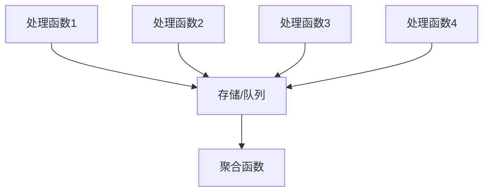

**实现示例**：

```javascript
// 处理函数 - 将结果写入DynamoDB
exports.processDataChunk = async (event) => {
    const { chunkId, data, batchId } = event.detail;
    
    // 处理数据块
    const result = processData(data);
    
    // 存储结果
    await dynamoDB.put({
        TableName: 'ProcessingResults',
        Item: {
            batchId,
            chunkId,
            result,
            processedAt: new Date().toISOString()
        }
    }).promise();
    
    // 发布处理完成事件
    await publishEvent('ChunkProcessingCompleted', {
        batchId,
        chunkId,
        timestamp: new Date().toISOString()
    });
};

// 聚合函数 - 监听完成事件并聚合结果
exports.aggregateResults = async (event) => {
    const { batchId, chunkId } = event.detail;
    
    // 获取批次信息
    const batchInfo = await getBatchInfo(batchId);
    
    // 更新已完成的块计数
    await updateCompletedCount(batchId);
    
    // 检查是否所有块都已处理完成
    const completedCount = await getCompletedCount(batchId);
    
    if (completedCount >= batchInfo.totalChunks) {
        // 获取所有结果
        const results = await getAllResults(batchId);
        
        // 聚合结果
        const aggregatedResult = aggregateData(results);
        
        // 存储聚合结果
        await storeAggregatedResult(batchId, aggregatedResult);
        
        // 发布聚合完成事件
        await publishEvent('BatchProcessingCompleted', {
            batchId,
            resultUrl: `https://results-bucket.s3.amazonaws.com/${batchId}.json`
        });
    }
};
```

### 异步通信模式

**描述**：使用异步消息传递而非同步调用来协调函数之间的通信。

**优势**：
- 降低系统耦合度
- 提高系统弹性
- 支持更好的扩展性
- 减少超时问题

**实现方式**：

1. **消息队列**：使用SQS、Kafka等消息队列服务
2. **事件总线**：使用EventBridge、Event Grid等事件路由服务
3. **发布-订阅**：使用SNS、Pub/Sub等发布-订阅服务

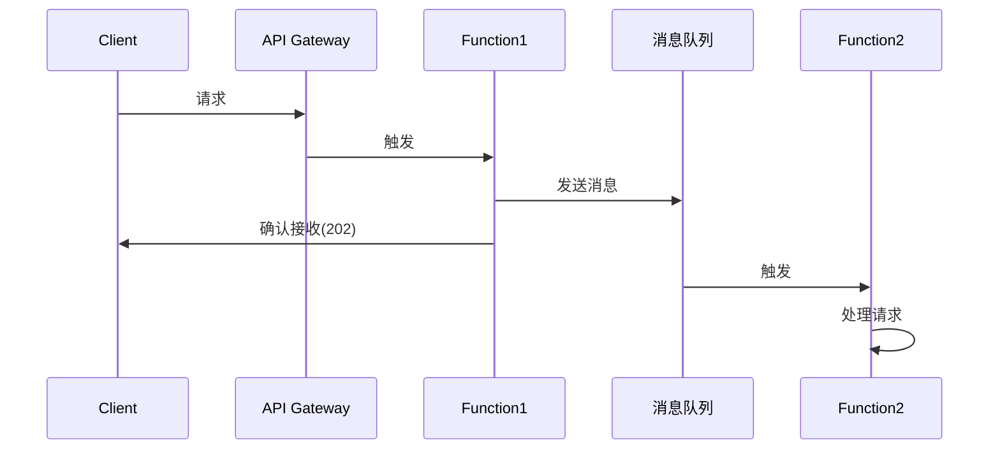

**实现示例**：

```javascript
// API处理函数 - 接收请求并发送到队列
exports.handleRequest = async (event) => {
    const requestData = JSON.parse(event.body);
    
    // 验证请求
    if (!isValidRequest(requestData)) {
        return {
            statusCode: 400,
            body: JSON.stringify({ error: 'Invalid request' })
        };
    }
    
    // 生成请求ID
    const requestId = generateRequestId();
    
    // 发送消息到队列
    await sqs.sendMessage({
        QueueUrl: process.env.PROCESSING_QUEUE_URL,
        MessageBody: JSON.stringify({
            requestId,
            data: requestData,
            timestamp: new Date().toISOString()
        })
    }).promise();
    
    // 返回确认响应
    return {
        statusCode: 202,
        body: JSON.stringify({
            requestId,
            message: 'Request accepted for processing',
            statusUrl: `https://api.example.com/status/${requestId}`
        })
    };
};

// 处理函数 - 从队列接收消息并处理
exports.processRequest = async (event) => {
    // 批量处理队列消息
    for (const record of event.Records) {
        const message = JSON.parse(record.body);
        const { requestId, data } = message;
        
        try {
            // 处理请求
            const result = await processData(data);
            
            // 存储结果
            await storeResult(requestId, result);
            
            // 发布处理完成事件
            await publishEvent('RequestProcessed', {
                requestId,
                status: 'completed',
                timestamp: new Date().toISOString()
            });
        } catch (error) {
            console.error(`Error processing request ${requestId}:`, error);
            
            // 存储错误信息
            await storeError(requestId, error);
            
            // 发布处理失败事件
            await publishEvent('RequestFailed', {
                requestId,
                error: error.message,
                timestamp: new Date().toISOString()
            });
        }
    }
};
```

## 状态管理模式

### 外部状态存储模式

**描述**：将状态存储在外部持久化服务中，而非函数内部。

**优势**：
- 支持函数的无状态特性
- 提供持久化存储
- 支持跨函数和跨实例共享状态

**实现方式**：

1. **数据库存储**：使用关系型或NoSQL数据库存储状态
2. **键值存储**：使用Redis、DynamoDB等键值存储服务
3. **对象存储**：使用S3、Blob Storage等对象存储服务

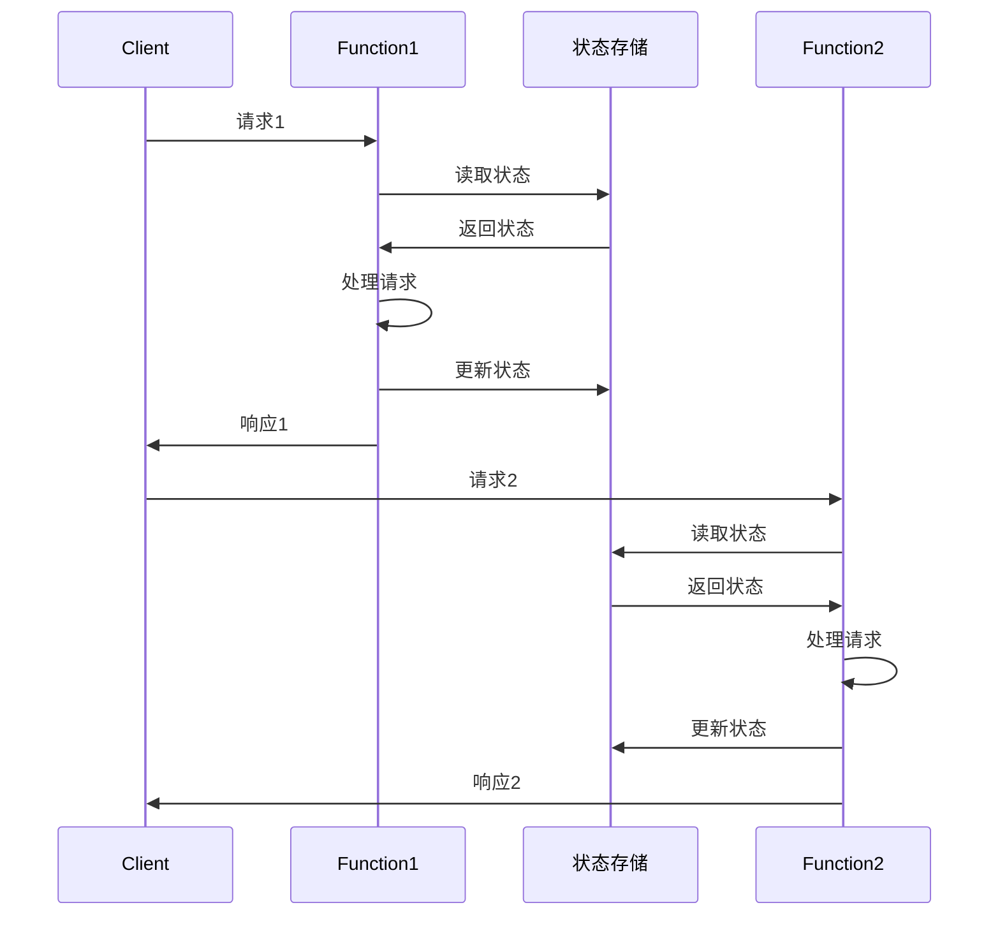

**实现示例**：

```javascript
// 使用DynamoDB存储会话状态
exports.handleUserAction = async (event) => {
    const { userId, action } = JSON.parse(event.body);
    const sessionId = event.headers.sessionId;
    
    // 获取会话状态
    const sessionData = await getSessionState(sessionId);
    
    // 处理用户操作
    const result = processUserAction(action, sessionData, userId);
    
    // 更新会话状态
    await updateSessionState(sessionId, result.newSessionState);
    
    return {
        statusCode: 200,
        body: JSON.stringify(result.response)
    };
};

// 获取会话状态
async function getSessionState(sessionId) {
    const params = {
        TableName: 'UserSessions',
        Key: { sessionId }
    };
    
    const result = await dynamoDB.get(params).promise();
    return result.Item?.state || { isNew: true };
}

// 更新会话状态
async function updateSessionState(sessionId, state) {
    const params = {
        TableName: 'UserSessions',
        Item: {
            sessionId,
            state,
            lastUpdated: new Date().toISOString(),
            ttl: Math.floor(Date.now() / 1000) + 86400 // 24小时过期
        }
    };
    
    await dynamoDB.put(params).promise();
}
```

### 事件溯源模式

**描述**：将状态变化存储为事件序列，而非仅存储当前状态。

**优势**：
- 提供完整的状态变化历史
- 支持状态重建和回溯
- 提高系统审计能力
- 支持事件驱动架构

**实现方式**：

1. **事件存储**：将所有状态变更事件存储在专用存储中
2. **状态重建**：通过重放事件序列重建当前状态
3. **快照**：定期创建状态快照以优化重建性能

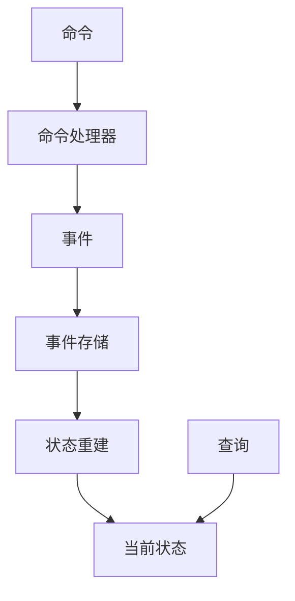

**实现示例**：

```javascript
// 命令处理函数
exports.handleCommand = async (event) => {
    const command = JSON.parse(event.body);
    const { aggregateId, type, payload } = command;
    
    // 获取聚合根的事件历史
    const events = await getEvents(aggregateId);
    
    // 重建当前状态
    const currentState = rebuildState(events);
    
    // 处理命令
    const commandHandler = commandHandlers[type];
    if (!commandHandler) {
        return {
            statusCode: 400,
            body: JSON.stringify({ error: `Unknown command type: ${type}` })
        };
    }
    
    try {
        // 生成新事件
        const newEvents = commandHandler(currentState, payload);
        
        // 存储新事件
        await storeEvents(aggregateId, newEvents);
        
        // 发布事件
        await publishEvents(newEvents);
        
        return {
            statusCode: 200,
            body: JSON.stringify({ success: true })
        };
    } catch (error) {
        return {
            statusCode: 400,
            body: JSON.stringify({ error: error.message })
        };
    }
};

// 查询函数
exports.getAggregate = async (event) => {
    const aggregateId = event.pathParameters.id;
    
    // 获取事件
    const events = await getEvents(aggregateId);
    
    // 重建状态
    const currentState = rebuildState(events);
    
    return {
        statusCode: 200,
        body: JSON.stringify(currentState)
    };
};

// 获取事件历史
async function getEvents(aggregateId) {
    const params = {
        TableName: 'EventStore',
        KeyConditionExpression: 'aggregateId = :id',
        ExpressionAttributeValues: {
            ':id': aggregateId
        },
        ConsistentRead: true
    };
    
    const result = await dynamoDB.query(params).promise();
    return result.Items || [];
}

// 存储新事件
async function storeEvents(aggregateId, events) {
    const timestamp = new Date().toISOString();
    
    const putRequests = events.map((event, index) => ({
        PutRequest: {
            Item: {
                aggregateId,
                sequenceNumber: Date.now() + index, // 简化的序列号生成
                eventType: event.type,
                payload: event.payload,
                timestamp
            }
        }
    }));
    
    await dynamoDB.batchWrite({
        RequestItems: {
            'EventStore': putRequests
        }
    }).promise();
}

// 重建状态
function rebuildState(events) {
    // 按序列号排序事件
    const sortedEvents = [...events].sort((a, b) => 
        a.sequenceNumber - b.sequenceNumber
    );
    
    // 应用事件重建状态
    return sortedEvents.reduce((state, event) => {
        const eventHandler = eventHandlers[event.eventType];
        return eventHandler ? eventHandler(state, event.payload) : state;
    }, {});
}
```

### 缓存模式

**描述**：使用缓存服务存储临时状态和频繁访问的数据。

**优势**：
- 减少数据库访问
- 提高响应速度
- 降低成本
- 减轻数据库负载

**实现方式**：

1. **分布式缓存**：使用Redis、Memcached等分布式缓存服务
2. **本地缓存**：利用函数实例的生命周期进行本地缓存
3. **CDN缓存**：使用CDN缓存静态内容和API响应

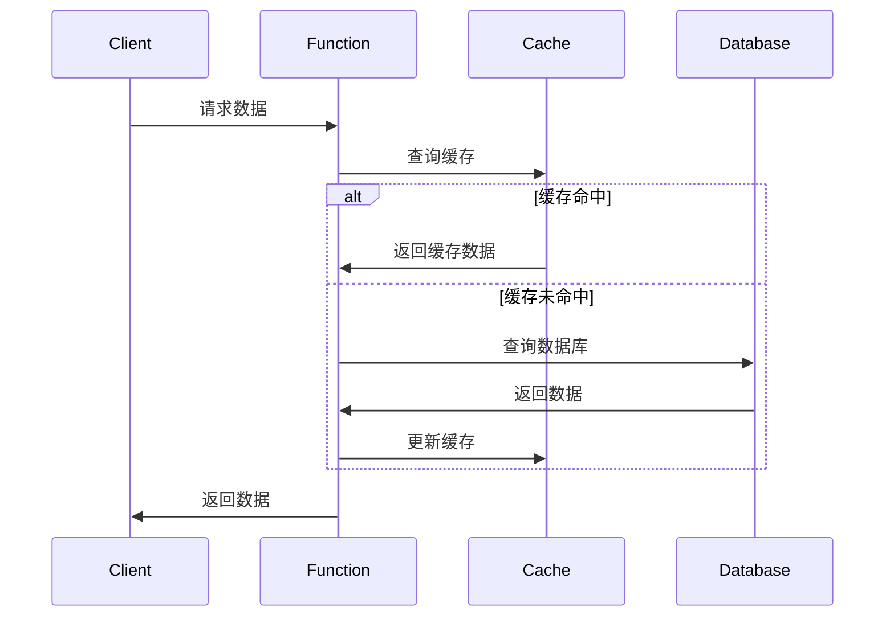

**实现示例**：

```javascript
// 使用Redis缓存产品数据
exports.getProduct = async (event) => {
    const productId = event.pathParameters.id;
    
    try {
        // 尝试从缓存获取
        const cachedProduct = await getFromCache(`product:${productId}`);
        
        if (cachedProduct) {
            return {
                statusCode: 200,
                body: cachedProduct
            };
        }
        
        // 缓存未命中，从数据库获取
        const product = await getProductFromDatabase(productId);
        
        if (!product) {
            return {
                statusCode: 404,
                body: JSON.stringify({ error: 'Product not found' })
            };
        }
        
        // 更新缓存
        await setCache(`product:${productId}`, JSON.stringify(product), 3600); // 缓存1小时
        
        return {
            statusCode: 200,
            body: JSON.stringify(product)
        };
    } catch (error) {
        console.error('Error fetching product:', error);
        
        return {
            statusCode: 500,
            body: JSON.stringify({ error: 'Failed to fetch product' })
        };
    }
};

// Redis缓存操作
async function getFromCache(key) {
    const result = await redis.get(key);
    return result;
}

async function setCache(key, value, ttl) {
    await redis.set(key, value, 'EX', ttl);
}
```

## 数据处理模式

### 流处理模式

**描述**：使用流式处理处理大量数据或实时数据。

**优势**：
- 支持实时数据处理
- 提高处理效率
- 降低延迟
- 支持大规模数据处理

**实现方式**：

1. **流处理服务**：使用Kinesis、Kafka等流处理服务
2. **函数链**：将数据通过函数链进行流式处理
3. **批处理**：使用批处理优化处理效率

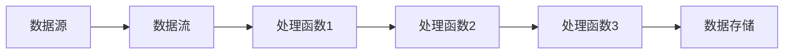

**实现示例**（使用AWS Kinesis）：

```javascript
// Kinesis流处理函数
exports.processStreamData = async (event) => {
    const processedRecords = [];
    
    for (const record of event.Records) {
        // 解码Base64数据
        const payload = Buffer.from(record.kinesis.data, 'base64').toString();
        const data = JSON.parse(payload);
        
        try {
            // 处理数据
            const processedData = transformData(data);
            
            // 添加到处理结果
            processedRecords.push({
                recordId: record.recordId,
                result: 'Ok',
                data: processedData
            });
        } catch (error) {
            console.error('Error processing record:', error);
            
            // 记录处理失败
            processedRecords.push({
                recordId: record.recordId,
                result: 'ProcessingFailed',
                data: payload
            });
        }
    }
    
    // 批量存储处理结果
    if (processedRecords.length > 0) {
        await storeProcessedRecords(processedRecords);
    }
    
    return { processed: processedRecords.length };
};

// 数据转换函数
function transformData(data) {
    // 数据转换逻辑
    return {
        id: data.id,
        timestamp: data.timestamp,
        value: data.value * 1.5, // 示例转换
        category: categorize(data.value),
        processedAt: new Date().toISOString()
    };
}

// 批量存储处理结果
async function storeProcessedRecords(records) {
    // 批量写入到目标存储
    const putRequests = records.map(record => ({
        PutRequest: {
            Item: {
                id: record.data.id,
                timestamp: record.data.timestamp,
                value: record.data.value,
                category: record.data.category,
                processedAt: record.data.processedAt
            }
        }
    }));
    
    await dynamoDB.batchWrite({
        RequestItems: {
            'ProcessedData': putRequests
        }
    }).promise();
}
```

### 批处理模式

**描述**：将多个项目批量处理以提高效率和降低成本。

**优势**：
- 减少函数调用次数
- 优化数据库操作
- 降低API调用成本
- 提高吞吐量

**实现方式**：

1. **批量触发**：配置批量事件触发函数
2. **批量操作**：在函数内部实现批量数据操作
3. **聚合处理**：聚合多个请求进行批量处理

```mermaid
sequenceDiagram
    participant Source as 数据源
    participant Queue as 消息队列
    participant Function as 批处理函数
    participant Database as 数据
让我继续完成 Serverless 应用设计模式的内容：

```mermaid
sequenceDiagram
    participant Source as 数据源
    participant Queue as 消息队列
    participant Function as 批处理函数
    participant Database as 数据库
    
    Source->>Queue: 发送消息1
    Source->>Queue: 发送消息2
    Source->>Queue: 发送消息3
    Source->>Queue: 发送消息4
    Source->>Queue: 发送消息5
    
    Queue->>Function: 批量触发(5条消息)
    
    Function->>Database: 批量写入
    Database->>Function: 确认
    
    Function->>Queue: 确认处理
```

**实现示例**（使用AWS SQS批处理）：

```javascript
// SQS批处理函数
exports.processBatch = async (event) => {
    console.log(`Processing batch of ${event.Records.length} messages`);
    
    // 提取消息
    const messages = event.Records.map(record => {
        try {
            return JSON.parse(record.body);
        } catch (error) {
            console.error('Error parsing message:', error);
            return { error: 'Failed to parse', raw: record.body };
        }
    });
    
    // 按类型分组消息
    const messagesByType = messages.reduce((groups, message) => {
        const type = message.type || 'unknown';
        if (!groups[type]) {
            groups[type] = [];
        }
        groups[type].push(message);
        return groups;
    }, {});
    
    // 并行处理不同类型的消息
    const results = await Promise.all(
        Object.entries(messagesByType).map(([type, messages]) => 
            processBatchByType(type, messages)
        )
    );
    
    // 汇总处理结果
    const summary = results.reduce((sum, result) => {
        sum.processed += result.processed;
        sum.failed += result.failed;
        return sum;
    }, { processed: 0, failed: 0 });
    
    console.log(`Batch processing complete: ${summary.processed} processed, ${summary.failed} failed`);
    
    return summary;
};

// 按类型批处理消息
async function processBatchByType(type, messages) {
    console.log(`Processing ${messages.length} messages of type ${type}`);
    
    try {
        // 根据消息类型选择处理器
        const processor = messageProcessors[type] || messageProcessors.default;
        
        // 批量处理
        const result = await processor(messages);
        
        return { processed: result.processed, failed: result.failed };
    } catch (error) {
        console.error(`Error processing batch of type ${type}:`, error);
        return { processed: 0, failed: messages.length };
    }
}

// 消息处理器映射
const messageProcessors = {
    // 用户数据处理器
    'user': async (messages) => {
        // 准备批量写入项
        const items = messages.map(msg => ({
            userId: msg.userId,
            name: msg.name,
            email: msg.email,
            updatedAt: new Date().toISOString()
        }));
        
        // 批量写入数据库
        await batchWriteUsers(items);
        
        return { processed: items.length, failed: 0 };
    },
    
    // 订单处理器
    'order': async (messages) => {
        // 批量处理订单逻辑
        // ...
        
        return { processed: messages.length, failed: 0 };
    },
    
    // 默认处理器
    'default': async (messages) => {
        console.warn(`Using default processor for ${messages.length} messages`);
        // 简单记录未知类型消息
        await logUnknownMessages(messages);
        
        return { processed: messages.length, failed: 0 };
    }
};
```

### 数据分区模式

**描述**：将数据分区以支持并行处理和更好的扩展性。

**优势**：
- 提高并行处理能力
- 改善数据局部性
- 支持更大规模数据处理
- 优化查询性能

**实现方式**：

1. **键分区**：基于键值将数据分区
2. **时间分区**：基于时间范围分区
3. **哈希分区**：使用哈希函数均匀分布数据

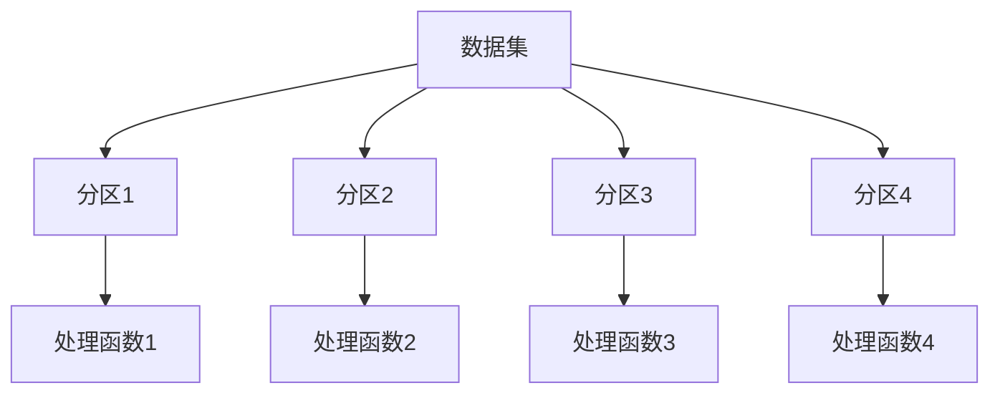

**实现示例**：

```javascript
// 数据分区处理函数
exports.processDataPartition = async (event) => {
    const { partitionKey, partitionType, startDate, endDate } = event;
    
    console.log(`Processing partition: ${partitionKey}, type: ${partitionType}`);
    
    try {
        // 根据分区类型获取数据
        let data;
        
        if (partitionType === 'time') {
            // 时间分区
            data = await getDataByTimeRange(startDate, endDate);
        } else if (partitionType === 'key') {
            // 键分区
            data = await getDataByKeyRange(partitionKey);
        } else if (partitionType === 'hash') {
            // 哈希分区
            data = await getDataByHashPartition(partitionKey);
        } else {
            throw new Error(`Unknown partition type: ${partitionType}`);
        }
        
        // 处理分区数据
        const result = await processPartitionData(data);
        
        // 存储处理结果
        await storePartitionResult(partitionKey, result);
        
        return {
            partitionKey,
            recordsProcessed: data.length,
            status: 'completed'
        };
    } catch (error) {
        console.error(`Error processing partition ${partitionKey}:`, error);
        
        // 记录失败
        await recordPartitionFailure(partitionKey, error);
        
        throw error;
    }
};

// 创建分区任务
exports.createPartitionTasks = async (event) => {
    const { datasetId, partitionType, partitionCount } = JSON.parse(event.body);
    
    try {
        // 获取数据集信息
        const dataset = await getDatasetInfo(datasetId);
        
        // 创建分区
        let partitions;
        
        if (partitionType === 'time') {
            // 创建时间分区
            partitions = createTimePartitions(dataset.startDate, dataset.endDate, partitionCount);
        } else if (partitionType === 'key') {
            // 创建键分区
            partitions = createKeyPartitions(dataset.keyRange, partitionCount);
        } else if (partitionType === 'hash') {
            // 创建哈希分区
            partitions = createHashPartitions(partitionCount);
        } else {
            return {
                statusCode: 400,
                body: JSON.stringify({ error: `Unknown partition type: ${partitionType}` })
            };
        }
        
        // 为每个分区创建处理任务
        const tasks = await Promise.all(
            partitions.map(partition => 
                createProcessingTask(datasetId, partition)
            )
        );
        
        return {
            statusCode: 200,
            body: JSON.stringify({
                datasetId,
                partitionType,
                partitionCount,
                tasks
            })
        };
    } catch (error) {
        console.error('Error creating partition tasks:', error);
        
        return {
            statusCode: 500,
            body: JSON.stringify({ error: 'Failed to create partition tasks' })
        };
    }
};
```

## API设计模式

### API网关模式

**描述**：使用API网关作为Serverless函数的前端，处理请求路由、认证和转换。

**优势**：
- 集中管理API端点
- 提供认证和授权
- 支持请求验证和转换
- 实现API版本控制和文档

**实现方式**：

1. **HTTP API**：使用API Gateway、Cloud Functions等HTTP触发器
2. **GraphQL API**：实现GraphQL端点统一访问多个函数
3. **WebSocket API**：支持双向实时通信

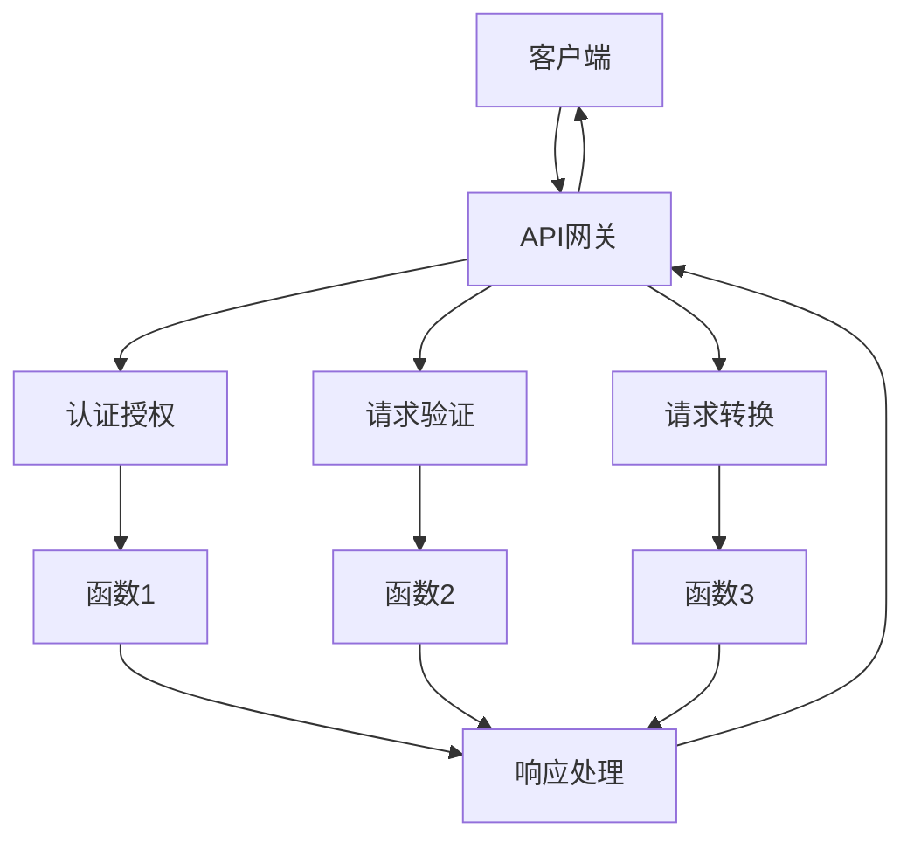

**实现示例**（AWS API Gateway + Lambda）：

```yaml
# serverless.yml
service: api-gateway-example

provider:
  name: aws
  runtime: nodejs14.x
  region: us-east-1

functions:
  getUsers:
    handler: handlers/users.getUsers
    events:
      - http:
          path: /users
          method: get
          authorizer: jwtAuthorizer
          cors: true
          
  getUserById:
    handler: handlers/users.getUserById
    events:
      - http:
          path: /users/{id}
          method: get
          authorizer: jwtAuthorizer
          cors: true
          request:
            parameters:
              paths:
                id: true
                
  createUser:
    handler: handlers/users.createUser
    events:
      - http:
          path: /users
          method: post
          authorizer: jwtAuthorizer
          cors: true
          request:
            schemas:
              application/json: ${file(schemas/user-create.json)}
              
  jwtAuthorizer:
    handler: handlers/auth.authorize
```

```javascript
// handlers/users.js
// 获取用户列表
exports.getUsers = async (event) => {
    try {
        // 解析查询参数
        const queryParams = event.queryStringParameters || {};
        const limit = parseInt(queryParams.limit) || 10;
        const offset = parseInt(queryParams.offset) || 0;
        
        // 获取用户列表
        const users = await getUsersFromDatabase(limit, offset);
        const total = await countUsers();
        
        return {
            statusCode: 200,
            headers: {
                'Content-Type': 'application/json',
                'Access-Control-Allow-Origin': '*'
            },
            body: JSON.stringify({
                users,
                pagination: {
                    total,
                    limit,
                    offset,
                    hasMore: offset + users.length < total
                }
            })
        };
    } catch (error) {
        console.error('Error fetching users:', error);
        
        return {
            statusCode: 500,
            headers: {
                'Content-Type': 'application/json',
                'Access-Control-Allow-Origin': '*'
            },
            body: JSON.stringify({ error: 'Failed to fetch users' })
        };
    }
};

// 获取单个用户
exports.getUserById = async (event) => {
    try {
        const userId = event.pathParameters.id;
        
        // 获取用户
        const user = await getUserById(userId);
        
        if (!user) {
            return {
                statusCode: 404,
                headers: {
                    'Content-Type': 'application/json',
                    'Access-Control-Allow-Origin': '*'
                },
                body: JSON.stringify({ error: 'User not found' })
            };
        }
        
        return {
            statusCode: 200,
            headers: {
                'Content-Type': 'application/json',
                'Access-Control-Allow-Origin': '*'
            },
            body: JSON.stringify(user)
        };
    } catch (error) {
        console.error(`Error fetching user:`, error);
        
        return {
            statusCode: 500,
            headers: {
                'Content-Type': 'application/json',
                'Access-Control-Allow-Origin': '*'
            },
            body: JSON.stringify({ error: 'Failed to fetch user' })
        };
    }
};
```

### BFF模式（Backend For Frontend）

**描述**：为特定前端创建专用的后端API，优化数据传输和交互。

**优势**：
- 减少前端数据处理
- 优化API响应格式
- 减少网络请求
- 提高用户体验

**实现方式**：

1. **聚合API**：聚合多个后端服务的数据
2. **转换API**：转换数据格式以适应前端需求
3. **专用API**：为不同设备类型提供专用API

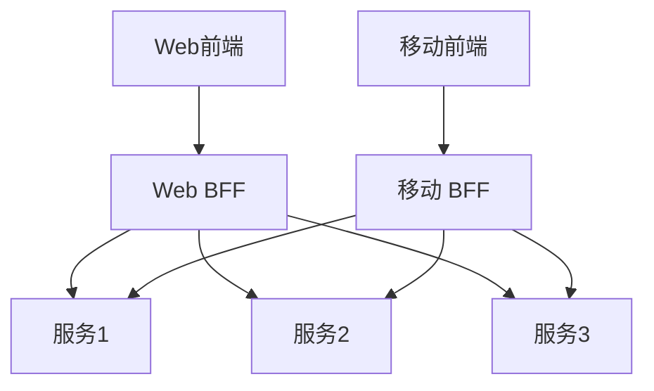

**实现示例**：

```javascript
// Web BFF - 产品详情页API
exports.getProductDetailsForWeb = async (event) => {
    const productId = event.pathParameters.id;
    
    try {
        // 并行获取所需数据
        const [
            product,
            reviews,
            relatedProducts,
            inventory
        ] = await Promise.all([
            getProduct(productId),
            getProductReviews(productId),
            getRelatedProducts(productId),
            getProductInventory(productId)
        ]);
        
        if (!product) {
            return {
                statusCode: 404,
                body: JSON.stringify({ error: 'Product not found' })
            };
        }
        
        // 为Web前端聚合和转换数据
        const response = {
            product: {
                id: product.id,
                name: product.name,
                description: product.description,
                price: product.price,
                images: product.images,
                specifications: product.specifications,
                availability: inventory.inStock ? 'In Stock' : 'Out of Stock',
                estimatedDelivery: calculateDeliveryEstimate(inventory)
            },
            reviews: {
                average: calculateAverageRating(reviews),
                count: reviews.length,
                topReviews: reviews.slice(0, 3).map(review => ({
                    id: review.id,
                    rating: review.rating,
                    title: review.title,
                    comment: review.comment,
                    author: review.authorName,
                    date: review.createdAt
                }))
            },
            relatedProducts: relatedProducts.map(product => ({
                id: product.id,
                name: product.name,
                price: product.price,
                thumbnail: product.images[0]
            }))
        };
        
        return {
            statusCode: 200,
            body: JSON.stringify(response)
        };
    } catch (error) {
        console.error('Error fetching product details:', error);
        
        return {
            statusCode: 500,
            body: JSON.stringify({ error: 'Failed to fetch product details' })
        };
    }
};

// 移动 BFF - 产品详情页API
exports.getProductDetailsForMobile = async (event) => {
    const productId = event.pathParameters.id;
    
    try {
        // 并行获取所需数据
        const [
            product,
            inventory
        ] = await Promise.all([
            getProduct(productId),
            getProductInventory(productId)
        ]);
        
        if (!product) {
            return {
                statusCode: 404,
                body: JSON.stringify({ error: 'Product not found' })
            };
        }
        
        // 为移动前端优化的轻量级响应
        const response = {
            id: product.id,
            name: product.name,
            price: product.price,
            mainImage: product.images[0],
            shortDescription: product.shortDescription || truncate(product.description, 100),
            inStock: inventory.inStock,
            rating: product.averageRating
        };
        
        return {
            statusCode: 200,
            body: JSON.stringify(response)
        };
    } catch (error) {
        console.error('Error fetching product details:', error);
        
        return {
            statusCode: 500,
            body: JSON.stringify({ error: 'Failed to fetch product details' })
        };
    }
};
```

### 无服务器GraphQL模式

**描述**：使用GraphQL作为Serverless API的查询语言，提供灵活的数据获取。

**优势**：
- 减少网络请求
- 客户端决定数据形状
- 强类型API定义
- 版本控制简化

**实现方式**：

1. **单函数GraphQL**：单个函数处理所有GraphQL请求
2. **解析器函数**：为不同字段使用专用函数
3. **联合模式**：组合多个微服务的GraphQL模式

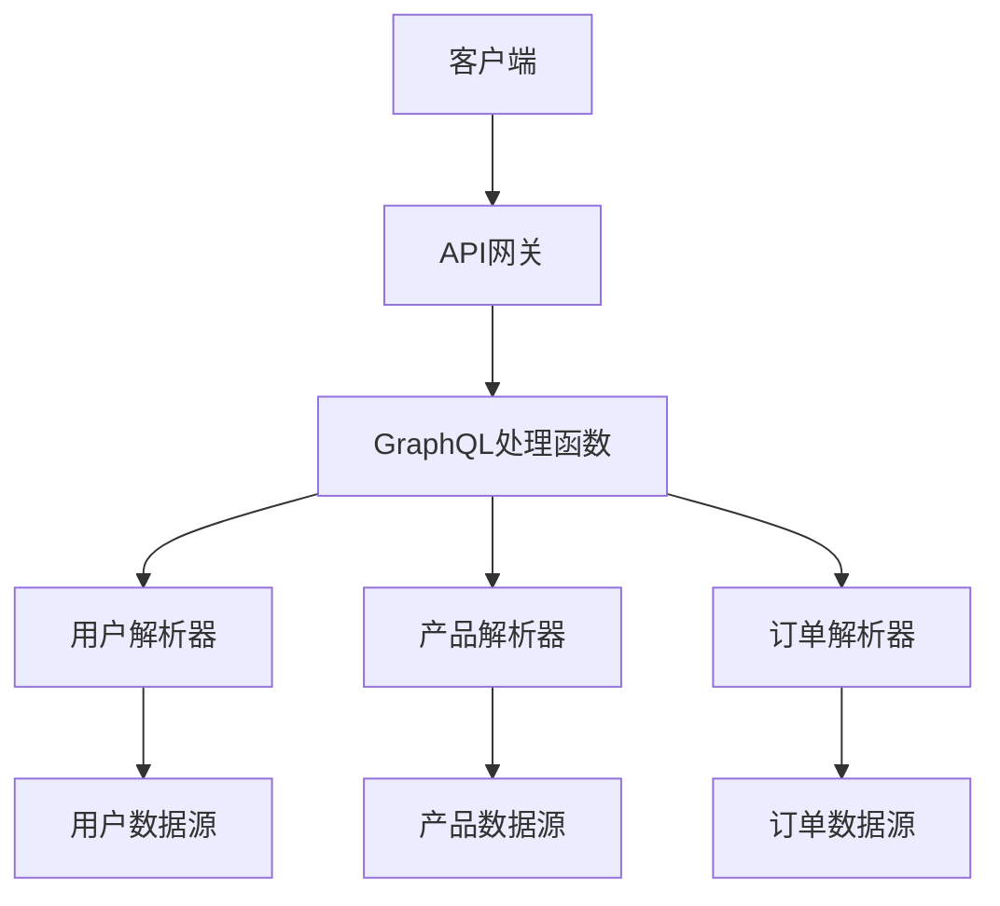

**实现示例**：

```javascript
// GraphQL处理函数
const { ApolloServer, gql } = require('apollo-server-lambda');

// 定义模式
const typeDefs = gql`
  type User {
    id: ID!
    name: String!
    email: String!
    orders: [Order!]
  }
  
  type Product {
    id: ID!
    name: String!
    description: String
    price: Float!
    inStock: Boolean!
  }
  
  type OrderItem {
    product: Product!
    quantity: Int!
    price: Float!
  }
  
  type Order {
    id: ID!
    user: User!
    items: [OrderItem!]!
    totalAmount: Float!
    status: String!
    createdAt: String!
  }
  
  type Query {
    user(id: ID!): User
    product(id: ID!): Product
    products(limit: Int, offset: Int): [Product!]!
    order(id: ID!): Order
  }
  
  type Mutation {
    createOrder(userId: ID!, items: [OrderItemInput!]!): Order
  }
  
  input OrderItemInput {
    productId: ID!
    quantity: Int!
  }
`;

// 解析器
const resolvers = {
  Query: {
    user: async (_, { id }) => {
      return getUserById(id);
    },
    product: async (_, { id }) => {
      return getProductById(id);
    },
    products: async (_, { limit = 10, offset = 0 }) => {
      return getProducts(limit, offset);
    },
    order: async (_, { id }) => {
      return getOrderById(id);
    }
  },
  Mutation: {
    createOrder: async (_, { userId, items }) => {
      return createOrder(userId, items);
    }
  },
  User: {
    orders: async (user) => {
      return getOrdersByUserId(user.id);
    }
  },
  Order: {
    user: async (order) => {
      return getUserById(order.userId);
    },
    items: async (order) => {
      return getOrderItems(order.id);
    }
  },
  OrderItem: {
    product: async (item) => {
      return getProductById(item.productId);
    }
  }
};

// 创建Apollo服务器
const server = new ApolloServer({
  typeDefs,
  resolvers,
  context: ({ event, context }) => ({
    headers: event.headers,
    functionName: context.functionName,
    event,
    context
  })
});

// 导出处理函数
exports.handler = server.createHandler({
  cors: {
    origin: '*',
    credentials: true
  }
});
```

## 安全模式

### 最小权限模式

**描述**：为每个函数分配最小必要权限，减少潜在安全风险。

**优势**：
- 减少攻击面
- 限制潜在损害
- 符合安全最佳实践
- 提高合规性

**实现方式**：

1. **函数级IAM策略**：为每个函数定义精确的权限
2. **资源级权限**：限制对特定资源的访问
3. **条件访问**：基于条件限制权限

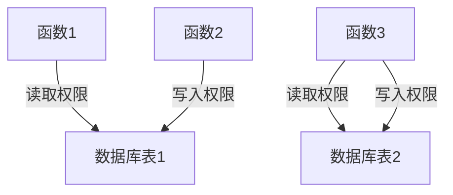

**实现示例**（AWS IAM策略）：

```yaml
# serverless.yml
functions:
  getUser:
    handler: handlers/users.getUser
    iamRoleStatements:
      - Effect: Allow
        Action:
          - dynamodb:GetItem
        Resource: arn:aws:dynamodb:${self:provider.region}:*:table/Users
        
  createUser:
    handler: handlers/users.createUser
    iamRoleStatements:
      - Effect: Allow
        Action:
          - dynamodb:PutItem
        Resource: arn:aws:dynamodb:${self:provider.region}:*:table/Users
      - Effect: Allow
        Action:
          - ses:SendEmail
        Resource: "*"
        
  processOrder:
    handler: handlers/orders.processOrder
    iamRoleStatements:
      - Effect: Allow
        Action:
          - dynamodb:GetItem
        Resource: arn:aws:dynamodb:${self:provider.region}:*:table/Orders
      - Effect: Allow
        Action:
          - dynamodb:UpdateItem
        Resource: arn:aws:dynamodb:${self:provider.region}:*:table/Orders
      - Effect: Allow
        Action:
          - dynamodb:UpdateItem
        Resource: arn:aws:dynamodb:${self:provider.region}:*:table/Inventory
      - Effect: Allow
        Action:
          - sqs:SendMessage
        Resource: arn:aws:sqs:${self:provider.region}:*:OrderProcessingQueue
```

### 密钥管理模式

**描述**：安全管理和访问应用密钥和敏感配置。

**优势**：
- 集中管理敏感信息
- 减少密钥泄露风险
- 支持密钥轮换
- 提高安全审计能力

**实现方式**：

1. **密钥存储服务**：使用AWS Secrets Manager、Azure Key Vault等
2. **环境变量**：使用加密的环境变量
3. **参数存储**：使用参数存储服务

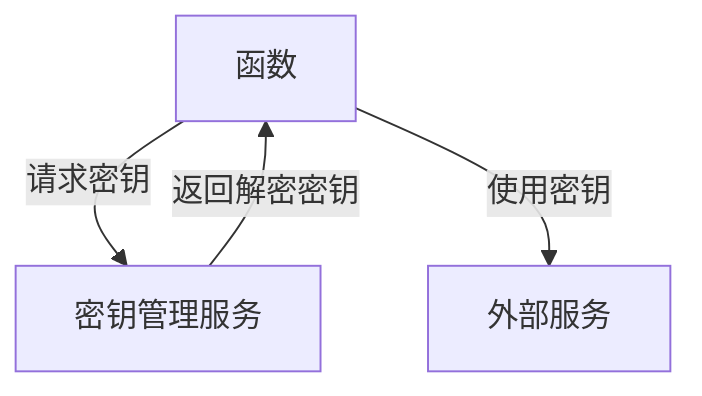

**实现示例**：

```javascript
// 使用AWS Secrets Manager获取数据库凭证
const AWS = require('aws-sdk');
const secretsManager = new AWS.SecretsManager();

// 缓存密钥
let cachedSecrets = {};

// 获取密钥
async function getSecret(secretName) {
    // 检查缓存
    if (cachedSecrets[secretName] && cachedSecrets[secretName].expiry > Date.now()) {
        return cachedSecrets[secretName].value;
    }
    
    try {
        // 从Secrets Manager获取密钥
        const data = await secretsManager.getSecretValue({ SecretId: secretName }).promise();
        let secret;
        
        // 解析密钥
        if ('SecretString' in data) {
            secret = JSON.parse(data.SecretString);
        } else {
            const buff = Buffer.from(data.SecretBinary, 'base64');
            secret = JSON.parse(buff.toString('ascii'));
        }
        
        // 缓存密钥（1小时）
        cachedSecrets[secretName] = {
            value: secret,
            expiry: Date.now() + 3600000
        };
        
        return secret;
    } catch (error) {
        console.error(`Error retrieving secret ${secretName}:`, error);
        throw error;
    }
}

// 数据库连接函数
async function connectToDatabase() {
    // 获取数据库凭证
    const dbCredentials = await getSecret('database/credentials');
    
    // 创建数据库连接
    const connection = await createConnection({
        host: dbCredentials.host,
        user: dbCredentials.username,
        password: dbCredentials.password,
        database: dbCredentials.dbname
    });
    
    return connection;
}

// API处理函数
exports.handler = async (event) => {
    try {
        // 获取数据库连接
        const db = await connectToDatabase();
        
        // 处理请求
        const result = await processRequest(db, event);
        
        // 关闭连接
        await db.close();
        
        return {
            statusCode: 200,
            body: JSON.stringify(result)
        };
    } catch (error) {
        console.error('Error processing request:', error);
        
        return {
            statusCode: 500,
            body: JSON.stringify({ error: 'Internal server error' })
        };
    }
};
```

### 认证授权模式

**描述**：在Serverless环境中实现用户认证和授权。

**优势**：
- 集中管理用户身份
- 简化认证流程
- 支持多种认证方式
- 细粒度访问控制

**实现方式**：

1. **托管身份服务**：使用Cognito、Auth0等服务
2. **JWT认证**：使用JWT进行API认证
3. **API网关授权器**：实现自定义授权逻辑

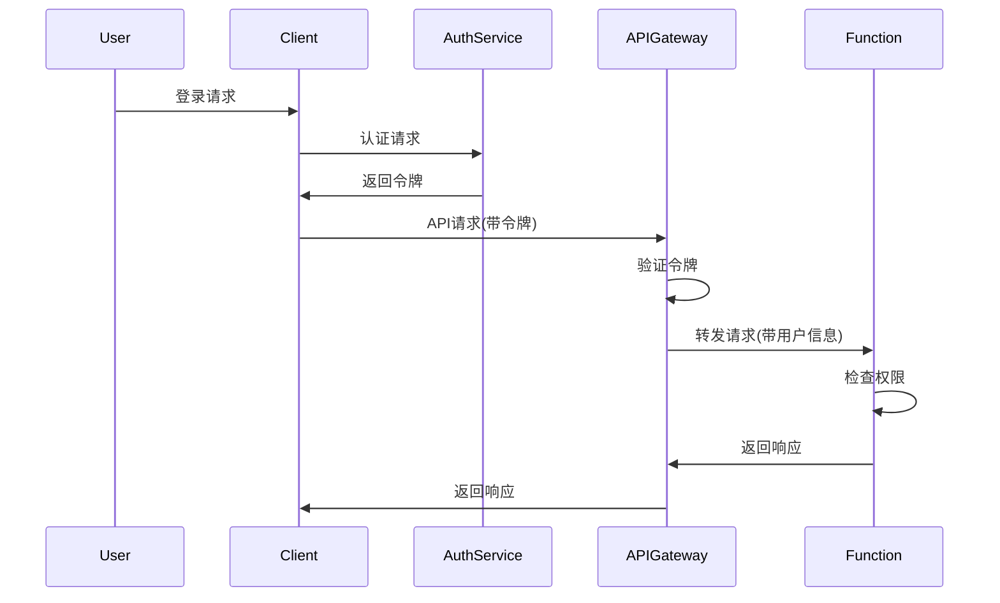

**实现示例**（JWT授权器）：

```javascript
// JWT授权器函数
exports.authorize = async (event) => {
    try {
        // 获取授权头
        const authHeader = event.headers.Authorization || event.headers.authorization;
        
        if (!authHeader) {
            return generatePolicy('user', 'Deny', event.methodArn);
        }
        
        // 提取令牌
        const token = authHeader.replace('Bearer ', '');
        
        // 验证令牌
        const decoded = verifyToken(token);
        
        // 检查令牌是否有效
        if (!decoded) {
            return generatePolicy('user', 'Deny', event.methodArn);
        }
        
        // 检查令牌是否过期
        if (decoded.exp < Math.floor(Date.now() / 1000)) {
            return generatePolicy('user', 'Deny', event.methodArn);
        }
        
        // 生成IAM策略
        const policy = generatePolicy(decoded.sub, 'Allow', event.methodArn);
        
        // 添加用户信息到上下文
        policy.context = {
            userId: decoded.sub,
            email: decoded.email,
            scope: decoded.scope
        };
        
        return policy;
    } catch (error) {
        console.error('Authorization error:', error);
        return generatePolicy('user', 'Deny', event.methodArn);
    }
};

// 验证JWT令牌
function verifyToken(token) {
    try {
        // 使用jsonwebtoken库验证令牌
        return jwt.verify(token, process.env.JWT_SECRET);
    } catch (error) {
        console.error('Token verification error:', error);
        return null;
    }
}

// 生成IAM策略
function generatePolicy(principalId, effect, resource) {
    const authResponse = {
        principalId
    };
    
    if (effect && resource) {
        const policyDocument = {
            Version: '2012-10-17',
            Statement: [
                {
                    Action: 'execute-api:Invoke',
                    Effect: effect,
                    Resource: resource
                }
            ]
        };
        
        authResponse.policyDocument = policyDocument;
    }
    
    return authResponse;
}
```

## 部署和运维模式

### 基础设施即代码模式

**描述**：使用代码定义和管理Serverless应用的基础设施。

**优势**：
- 一致的环境配置
- 版本控制基础设施
- 自动化部署
- 减少人为错误

**实现方式**：

1. **Serverless框架**：使用Serverless Framework、SAM等工具
2. **云形成模板**：使用CloudFormation、ARM模板等
3. **基础设施工具**：使用Terraform、Pulumi等工具

**实现示例**（Serverless Framework）：

```yaml
# serverless.yml
service: e-commerce-api

provider:
  name: aws
  runtime: nodejs14.x
  stage: ${opt
让我继续完成 Serverless 应用设计模式的内容：

```yaml
# serverless.yml
service: e-commerce-api

provider:
  name: aws
  runtime: nodejs14.x
  stage: ${opt:stage, 'dev'}
  region: ${opt:region, 'us-east-1'}
  environment:
    USERS_TABLE: ${self:service}-${self:provider.stage}-users
    PRODUCTS_TABLE: ${self:service}-${self:provider.stage}-products
    ORDERS_TABLE: ${self:service}-${self:provider.stage}-orders
    ORDER_EVENTS_TOPIC: ${self:service}-${self:provider.stage}-order-events
  
  iamRoleStatements:
    - Effect: Allow
      Action:
        - dynamodb:Query
        - dynamodb:Scan
        - dynamodb:GetItem
        - dynamodb:PutItem
        - dynamodb:UpdateItem
        - dynamodb:DeleteItem
      Resource:
        - !GetAtt UsersTable.Arn
        - !GetAtt ProductsTable.Arn
        - !GetAtt OrdersTable.Arn

functions:
  # 用户API
  getUsers:
    handler: src/handlers/users.getUsers
    events:
      - http:
          path: /users
          method: get
          authorizer: jwtAuthorizer
          cors: true
  
  getUserById:
    handler: src/handlers/users.getUserById
    events:
      - http:
          path: /users/{id}
          method: get
          authorizer: jwtAuthorizer
          cors: true
  
  createUser:
    handler: src/handlers/users.createUser
    events:
      - http:
          path: /users
          method: post
          cors: true
  
  # 产品API
  getProducts:
    handler: src/handlers/products.getProducts
    events:
      - http:
          path: /products
          method: get
          cors: true
  
  getProductById:
    handler: src/handlers/products.getProductById
    events:
      - http:
          path: /products/{id}
          method: get
          cors: true
  
  # 订单API
  createOrder:
    handler: src/handlers/orders.createOrder
    events:
      - http:
          path: /orders
          method: post
          authorizer: jwtAuthorizer
          cors: true
  
  processOrder:
    handler: src/handlers/orders.processOrder
    events:
      - sns:
          topicName: ${self:provider.environment.ORDER_EVENTS_TOPIC}
          filterPolicy:
            eventType:
              - OrderCreated

resources:
  Resources:
    # DynamoDB表
    UsersTable:
      Type: AWS::DynamoDB::Table
      Properties:
        TableName: ${self:provider.environment.USERS_TABLE}
        BillingMode: PAY_PER_REQUEST
        AttributeDefinitions:
          - AttributeName: id
            AttributeType: S
        KeySchema:
          - AttributeName: id
            KeyType: HASH
    
    ProductsTable:
      Type: AWS::DynamoDB::Table
      Properties:
        TableName: ${self:provider.environment.PRODUCTS_TABLE}
        BillingMode: PAY_PER_REQUEST
        AttributeDefinitions:
          - AttributeName: id
            AttributeType: S
        KeySchema:
          - AttributeName: id
            KeyType: HASH
    
    OrdersTable:
      Type: AWS::DynamoDB::Table
      Properties:
        TableName: ${self:provider.environment.ORDERS_TABLE}
        BillingMode: PAY_PER_REQUEST
        AttributeDefinitions:
          - AttributeName: id
            AttributeType: S
          - AttributeName: userId
            AttributeType: S
        KeySchema:
          - AttributeName: id
            KeyType: HASH
        GlobalSecondaryIndexes:
          - IndexName: UserOrders
            KeySchema:
              - AttributeName: userId
                KeyType: HASH
            Projection:
              ProjectionType: ALL
    
    # SNS主题
    OrderEventsTopic:
      Type: AWS::SNS::Topic
      Properties:
        TopicName: ${self:provider.environment.ORDER_EVENTS_TOPIC}
```

### 蓝绿部署模式

**描述**：使用两个相同但独立的环境进行无缝部署和回滚。

**优势**：
- 零停机部署
- 快速回滚能力
- 生产环境验证
- 降低部署风险

**实现方式**：

1. **别名路由**：使用函数别名或API阶段路由流量
2. **权重分配**：逐步将流量从蓝环境转移到绿环境
3. **环境切换**：完全切换流量后停用旧环境

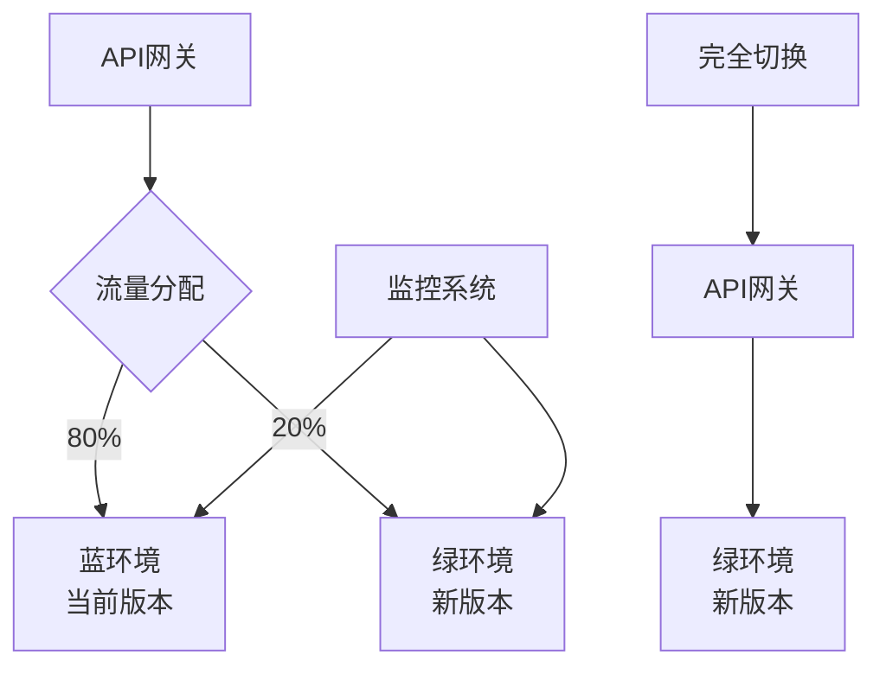

**实现示例**（AWS Lambda别名和流量分配）：

```yaml
# serverless.yml
service: blue-green-example

provider:
  name: aws
  runtime: nodejs14.x
  stage: ${opt:stage, 'dev'}
  region: ${opt:region, 'us-east-1'}

functions:
  api:
    handler: src/handler.api
    events:
      - http:
          path: /api
          method: any
    deploymentSettings:
      type: Linear10PercentEvery1Minute
      alias: live

resources:
  Resources:
    ApiGatewayDeployment:
      Type: AWS::ApiGateway::Deployment
      Properties:
        RestApiId: !Ref ApiGatewayRestApi
        StageName: ${self:provider.stage}
    
    ApiGatewayStage:
      Type: AWS::ApiGateway::Stage
      Properties:
        RestApiId: !Ref ApiGatewayRestApi
        DeploymentId: !Ref ApiGatewayDeployment
        StageName: ${self:provider.stage}
        Variables:
          lambdaAlias: live
```

```javascript
// 部署脚本示例
const AWS = require('aws-sdk');
const lambda = new AWS.Lambda();

async function deployWithBlueGreen() {
    const functionName = 'blue-green-example-dev-api';
    const aliasName = 'live';
    
    try {
        // 1. 获取当前函数版本
        const currentFunction = await lambda.getFunction({
            FunctionName: functionName
        }).promise();
        
        const currentVersion = currentFunction.Configuration.Version;
        console.log(`Current version: ${currentVersion}`);
        
        // 2. 发布新版本
        const publishResult = await lambda.publishVersion({
            FunctionName: functionName,
            Description: `Deployment at ${new Date().toISOString()}`
        }).promise();
        
        const newVersion = publishResult.Version;
        console.log(`Published new version: ${newVersion}`);
        
        // 3. 获取当前别名配置
        const currentAlias = await lambda.getAlias({
            FunctionName: functionName,
            Name: aliasName
        }).promise();
        
        // 4. 开始流量转移
        console.log('Starting traffic shift...');
        
        // 初始权重: 10% 到新版本
        await updateAliasRouting(functionName, aliasName, currentAlias.FunctionVersion, newVersion, 0.1);
        console.log('Shifted 10% traffic to new version');
        await sleep(60000); // 等待1分钟
        
        // 增加权重: 50% 到新版本
        await updateAliasRouting(functionName, aliasName, currentAlias.FunctionVersion, newVersion, 0.5);
        console.log('Shifted 50% traffic to new version');
        await sleep(60000); // 等待1分钟
        
        // 完全切换: 100% 到新版本
        await lambda.updateAlias({
            FunctionName: functionName,
            Name: aliasName,
            FunctionVersion: newVersion
        }).promise();
        
        console.log(`Deployment complete. All traffic now routed to version ${newVersion}`);
    } catch (error) {
        console.error('Deployment failed:', error);
        throw error;
    }
}

// 更新别名路由配置
async function updateAliasRouting(functionName, aliasName, currentVersion, newVersion, newVersionWeight) {
    await lambda.updateAlias({
        FunctionName: functionName,
        Name: aliasName,
        FunctionVersion: currentVersion,
        RoutingConfig: {
            AdditionalVersionWeights: {
                [newVersion]: newVersionWeight
            }
        }
    }).promise();
}

function sleep(ms) {
    return new Promise(resolve => setTimeout(resolve, ms));
}

deployWithBlueGreen().catch(console.error);
```

### 金丝雀发布模式

**描述**：将新版本逐步部署给一小部分用户，监控效果后再全面推广。

**优势**：
- 降低部署风险
- 早期发现问题
- 可控的发布过程
- 支持A/B测试

**实现方式**：

1. **流量分配**：控制流向新版本的流量百分比
2. **用户分组**：将特定用户组定向到新版本
3. **地理分区**：按地理位置逐步推广

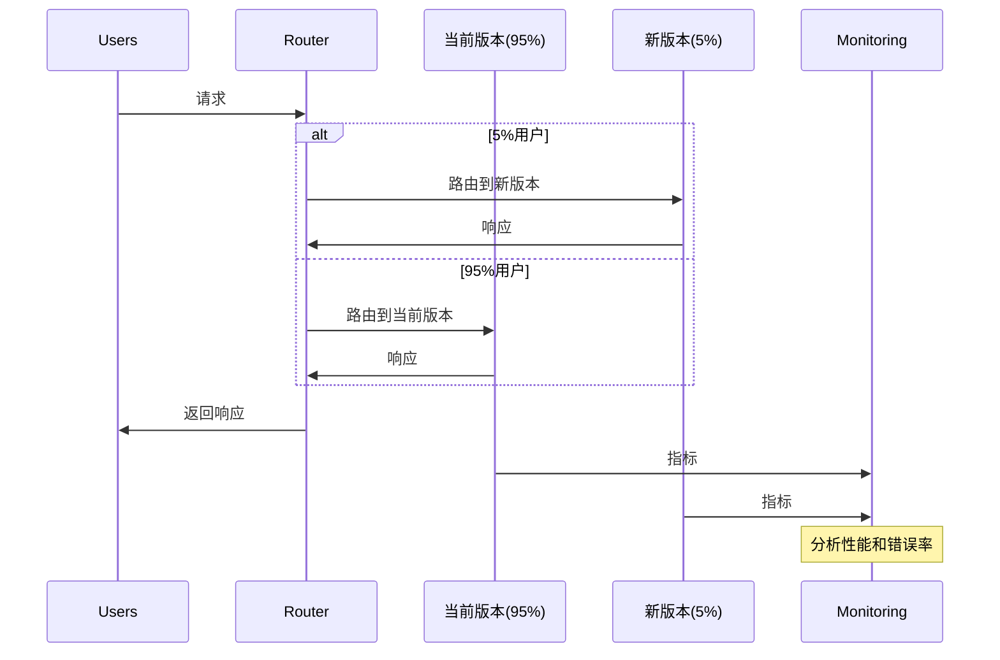

**实现示例**（AWS API Gateway金丝雀部署）：

```yaml
# serverless.yml
service: canary-deployment-example

provider:
  name: aws
  runtime: nodejs14.x
  stage: ${opt:stage, 'dev'}
  region: ${opt:region, 'us-east-1'}

functions:
  apiV1:
    handler: src/handlerV1.api
    description: Current production version
  
  apiV2:
    handler: src/handlerV2.api
    description: New canary version

resources:
  Resources:
    ApiGatewayRestApi:
      Type: AWS::ApiGateway::RestApi
      Properties:
        Name: ${self:service}-${self:provider.stage}
    
    ApiResource:
      Type: AWS::ApiGateway::Resource
      Properties:
        RestApiId: !Ref ApiGatewayRestApi
        ParentId: !GetAtt ApiGatewayRestApi.RootResourceId
        PathPart: api
    
    ApiMethodV1:
      Type: AWS::ApiGateway::Method
      Properties:
        RestApiId: !Ref ApiGatewayRestApi
        ResourceId: !Ref ApiResource
        HttpMethod: ANY
        AuthorizationType: NONE
        Integration:
          Type: AWS_PROXY
          IntegrationHttpMethod: POST
          Uri: !Sub arn:aws:apigateway:${AWS::Region}:lambda:path/2015-03-31/functions/${ApiV1LambdaFunction.Arn}/invocations
    
    ApiMethodV2:
      Type: AWS::ApiGateway::Method
      Properties:
        RestApiId: !Ref ApiGatewayRestApi
        ResourceId: !Ref ApiResource
        HttpMethod: ANY
        AuthorizationType: NONE
        Integration:
          Type: AWS_PROXY
          IntegrationHttpMethod: POST
          Uri: !Sub arn:aws:apigateway:${AWS::Region}:lambda:path/2015-03-31/functions/${ApiV2LambdaFunction.Arn}/invocations
    
    Deployment:
      Type: AWS::ApiGateway::Deployment
      DependsOn:
        - ApiMethodV1
        - ApiMethodV2
      Properties:
        RestApiId: !Ref ApiGatewayRestApi
    
    ProdStage:
      Type: AWS::ApiGateway::Stage
      Properties:
        RestApiId: !Ref ApiGatewayRestApi
        DeploymentId: !Ref Deployment
        StageName: prod
        Variables:
          lambdaVersion: v1
    
    CanaryStage:
      Type: AWS::ApiGateway::Stage
      Properties:
        RestApiId: !Ref ApiGatewayRestApi
        DeploymentId: !Ref Deployment
        StageName: canary
        Variables:
          lambdaVersion: v2
    
    # 金丝雀设置
    CanarySettings:
      Type: AWS::ApiGateway::CanarySettings
      Properties:
        RestApiId: !Ref ApiGatewayRestApi
        StageName: prod
        DeploymentId: !Ref Deployment
        PercentTraffic: 5
        StageVariableOverrides:
          lambdaVersion: v2
        UseStageCache: false
```

```javascript
// 监控脚本示例
const AWS = require('aws-sdk');
const cloudwatch = new AWS.CloudWatch();

async function monitorCanaryDeployment() {
    const apiName = 'canary-deployment-example-dev';
    const stageName = 'prod';
    const canaryPercentage = 5;
    
    try {
        // 获取基线指标
        const baselineMetrics = await getApiMetrics(apiName, stageName, 'v1');
        
        // 获取金丝雀指标
        const canaryMetrics = await getApiMetrics(apiName, stageName, 'v2');
        
        // 比较指标
        const comparison = compareMetrics(baselineMetrics, canaryMetrics);
        
        console.log('Metrics comparison:');
        console.log(JSON.stringify(comparison, null, 2));
        
        // 决策逻辑
        if (comparison.errorRate.increase > 50) {
            console.log('ERROR: Canary error rate increased by more than 50%. Rolling back...');
            await rollbackCanary(apiName, stageName);
        } else if (comparison.latency.increase > 100) {
            console.log('WARNING: Canary latency increased by more than 100ms. Rolling back...');
            await rollbackCanary(apiName, stageName);
        } else if (comparison.errorRate.increase < 10 && comparison.latency.increase < 50) {
            console.log('SUCCESS: Canary metrics look good. Promoting...');
            await promoteCanary(apiName, stageName);
        } else {
            console.log('MONITORING: Continuing to monitor canary deployment...');
        }
    } catch (error) {
        console.error('Error monitoring canary deployment:', error);
    }
}

// 获取API指标
async function getApiMetrics(apiName, stageName, version) {
    // 实现CloudWatch指标查询
    // ...
}

// 比较指标
function compareMetrics(baseline, canary) {
    return {
        errorRate: {
            baseline: baseline.errorRate,
            canary: canary.errorRate,
            increase: canary.errorRate - baseline.errorRate
        },
        latency: {
            baseline: baseline.latency,
            canary: canary.latency,
            increase: canary.latency - baseline.latency
        },
        throughput: {
            baseline: baseline.throughput,
            canary: canary.throughput,
            change: ((canary.throughput - baseline.throughput) / baseline.throughput) * 100
        }
    };
}

// 回滚金丝雀
async function rollbackCanary(apiName, stageName) {
    // 实现回滚逻辑
    // ...
}

// 提升金丝雀
async function promoteCanary(apiName, stageName) {
    // 实现提升逻辑
    // ...
}

// 执行监控
monitorCanaryDeployment().catch(console.error);
```

### 可观测性模式

**描述**：实现全面的监控、日志记录和追踪，以便了解Serverless应用的行为和性能。

**优势**：
- 提高问题排查能力
- 了解应用性能
- 支持自动化告警
- 提供业务洞察

**实现方式**：

1. **集中式日志**：将所有函数日志发送到中央存储
2. **分布式追踪**：实现跨函数和服务的请求追踪
3. **自定义指标**：收集和监控业务相关指标
4. **健康检查**：实现定期健康检查和告警

```mermaid
graph TD
    A[Serverless函数] -->|日志| B[日志聚合服务]
    A -->|指标| C[监控系统]
    A -->|追踪| D[分布式追踪系统]
    
    B --> E[日志分析]
    C --> F[指标仪表板]
    D --> G[追踪可视化]
    
    E --> H[告警系统]
    F --> H
    G --> H
    
    H --> I[通知]
```

**实现示例**：

```javascript
// 带有增强可观测性的处理函数
const AWSXRay = require('aws-xray-sdk-core');
const AWS = AWSXRay.captureAWS(require('aws-sdk'));
const dynamoDB = new AWS.DynamoDB.DocumentClient();
const cloudwatch = new AWS.CloudWatch();

// 自定义指标记录
async function recordMetric(name, value, unit, dimensions) {
    try {
        await cloudwatch.putMetricData({
            Namespace: 'MyApplication',
            MetricData: [
                {
                    MetricName: name,
                    Value: value,
                    Unit: unit,
                    Dimensions: Object.entries(dimensions).map(([name, value]) => ({
                        Name: name,
                        Value: value
                    }))
                }
            ]
        }).promise();
    } catch (error) {
        console.error('Error recording metric:', error);
    }
}

// 结构化日志
function log(level, message, data = {}) {
    const logEntry = {
        level,
        message,
        timestamp: new Date().toISOString(),
        requestId: process.env.AWS_LAMBDA_REQUEST_ID,
        ...data
    };
    
    console.log(JSON.stringify(logEntry));
}

// API处理函数
exports.handler = async (event) => {
    // 开始计时
    const startTime = Date.now();
    
    // 创建子分段
    const segment = AWSXRay.getSegment();
    const subsegment = segment.addNewSubsegment('processRequest');
    
    try {
        // 记录请求
        log('info', 'Processing request', {
            path: event.path,
            method: event.httpMethod,
            queryParams: event.queryStringParameters
        });
        
        // 添加请求注释
        subsegment.addAnnotation('path', event.path);
        subsegment.addAnnotation('method', event.httpMethod);
        
        // 处理请求
        const userId = event.pathParameters.id;
        
        // 创建数据库子分段
        const dbSubsegment = subsegment.addNewSubsegment('getUserFromDB');
        
        let user;
        try {
            // 获取用户数据
            const result = await dynamoDB.get({
                TableName: process.env.USERS_TABLE,
                Key: { id: userId }
            }).promise();
            
            user = result.Item;
            
            // 记录数据库结果
            dbSubsegment.addMetadata('user', user);
            dbSubsegment.close();
        } catch (error) {
            dbSubsegment.addError(error);
            dbSubsegment.close();
            throw error;
        }
        
        if (!user) {
            // 记录未找到用户
            log('warn', 'User not found', { userId });
            
            // 记录404指标
            await recordMetric('UserNotFound', 1, 'Count', {
                Service: 'UserAPI',
                Environment: process.env.STAGE
            });
            
            return {
                statusCode: 404,
                body: JSON.stringify({ error: 'User not found' })
            };
        }
        
        // 计算处理时间
        const processingTime = Date.now() - startTime;
        
        // 记录处理时间指标
        await recordMetric('RequestProcessingTime', processingTime, 'Milliseconds', {
            Service: 'UserAPI',
            Operation: 'GetUser',
            Environment: process.env.STAGE
        });
        
        // 记录成功请求
        log('info', 'Request processed successfully', {
            userId,
            processingTime
        });
        
        // 关闭子分段
        subsegment.close();
        
        return {
            statusCode: 200,
            body: JSON.stringify(user)
        };
    } catch (error) {
        // 记录错误
        log('error', 'Error processing request', {
            error: error.message,
            stack: error.stack
        });
        
        // 记录错误指标
        await recordMetric('RequestError', 1, 'Count', {
            Service: 'UserAPI',
            ErrorType: error.name,
            Environment: process.env.STAGE
        });
        
        // 添加错误到子分段
        subsegment.addError(error);
        subsegment.close();
        
        return {
            statusCode: 500,
            body: JSON.stringify({ error: 'Internal server error' })
        };
    }
};
```

## 结论与最佳实践

### Serverless设计模式选择指南

选择合适的Serverless设计模式应考虑以下因素：

1. **应用需求**：功能、性能、可靠性和安全性需求
2. **团队经验**：团队对特定模式的熟悉程度
3. **云服务提供商**：不同提供商支持的服务和特性
4. **成本考量**：不同模式的成本影响
5. **扩展需求**：当前和未来的扩展需求

设计模式选择流程：

1. **需求分析**：明确应用的功能和非功能需求
2. **模式识别**：识别适用的设计模式
3. **权衡分析**：评估每种模式的优缺点
4. **原型验证**：构建原型验证模式的适用性
5. **迭代优化**：根据反馈调整和优化设计

### Serverless应用设计最佳实践

1. **函数设计**：
   - 遵循单一职责原则
   - 保持函数轻量级
   - 优化冷启动性能
   - 实现幂等性处理

2. **状态管理**：
   - 使用外部服务存储状态
   - 实现有效的缓存策略
   - 考虑事件溯源模式
   - 处理分布式状态一致性

3. **API设计**：
   - 设计RESTful或GraphQL API
   - 实现有效的认证和授权
   - 使用API网关功能
   - 考虑BFF模式

4. **数据处理**：
   - 使用批处理优化性能
   - 实现有效的数据分区
   - 考虑流处理模式
   - 优化数据库访问

5. **安全性**：
   - 应用最小权限原则
   - 安全管理密钥和配置
   - 实现多层次安全防护
   - 定期安全审计

6. **部署和运维**：
   - 使用基础设施即代码
   - 实现自动化部署
   - 考虑蓝绿或金丝雀部署
   - 实现全面的可观测性

### 常见陷阱和解决方案

1. **冷启动延迟**：
   - 使用预置并发
   - 优化依赖项
   - 实现函数预热
   - 使用轻量级运行时

2. **分布式系统复杂性**：
   - 实现有效的错误处理
   - 使用分布式追踪
   - 设计弹性系统
   - 实现断路器模式

3. **成本管理挑战**：
   - 实现成本监控
   - 优化资源使用
   - 使用预留容量
   - 定期成本审查

4. **调试和监控困难**：
   - 实现结构化日志
   - 使用分布式追踪
   - 收集自定义指标
   - 设置有效的告警

5. **供应商锁定**：
   - 使用抽象层
   - 实现可移植设计
   - 考虑多云策略
   - 使用开源工具

通过理解和应用这些Serverless设计模式和最佳实践，开发者可以构建高效、可靠、安全且具有成本效益的Serverless应用，充分利用Serverless计算模型的优势，同时避免常见的陷阱和挑战。