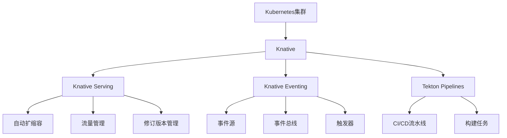
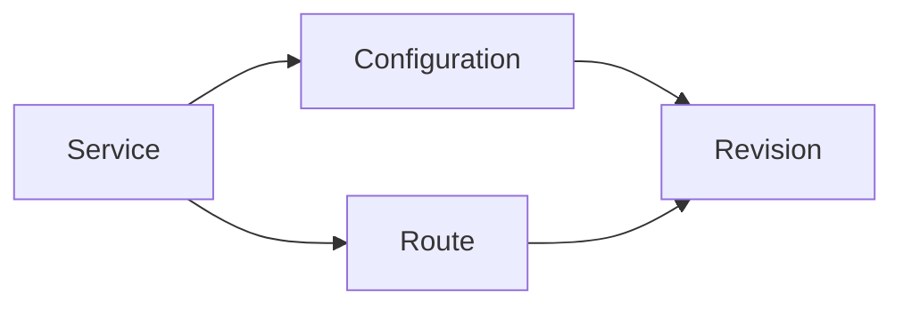
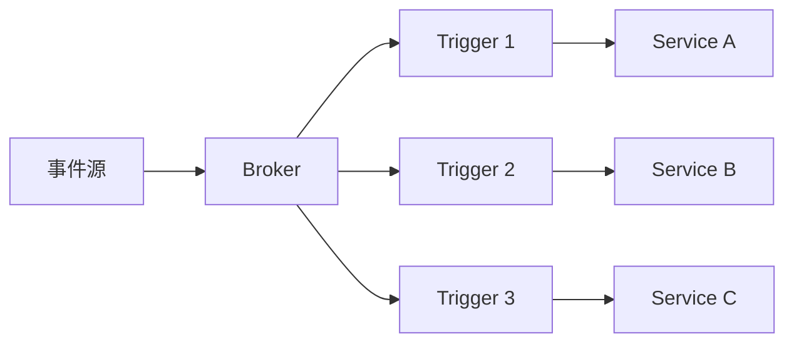

# Knative平台部署与使用

Knative是一个基于Kubernetes的Serverless平台，提供了构建、部署和管理Serverless工作负载的能力。本文将详细介绍Knative的架构、部署方法和使用场景。

## Knative架构概述

Knative由三个核心组件构成，每个组件负责Serverless应用生命周期的不同方面：

1. **Knative Serving**：负责部署和自动扩缩容应用
2. **Knative Eventing**：提供事件驱动的架构支持
3. **Knative Build**（已被Tekton替代）：负责从源代码构建容器镜像



### Knative Serving

Knative Serving负责应用的部署、版本管理和自动扩缩容，包括以下核心功能：

- **快速部署容器**：将容器快速部署到Kubernetes集群
- **自动扩缩容**：根据流量自动扩展和缩减实例，支持缩减到零
- **版本管理**：管理应用的多个版本，支持蓝绿部署和金丝雀发布
- **流量分配**：在不同版本之间精确控制流量分配

Knative Serving引入了四个自定义资源（CRD）：

1. **Service**：管理工作负载的整个生命周期
2. **Route**：映射网络端点到一个或多个修订版本
3. **Configuration**：维护部署的期望状态
4. **Revision**：代码和配置的不可变快照



### Knative Eventing

Knative Eventing提供了事件驱动架构的构建块，使应用能够以松耦合的方式响应事件：

- **事件源**：连接外部事件生产者
- **事件总线**：分发事件到多个消费者
- **触发器**：根据事件属性过滤和路由事件
- **代理**：提供事件过滤和订阅功能

Knative Eventing的主要自定义资源包括：

1. **EventSource**：连接外部事件源
2. **Broker**：事件的中央集线器
3. **Trigger**：根据属性将事件从Broker路由到服务
4. **Channel**：事件传递的持久层
5. **Subscription**：将事件从Channel路由到接收者



## Knative部署指南

### 环境准备

部署Knative之前，需要满足以下先决条件：

1. **Kubernetes集群**：版本1.21或更高
2. **kubectl**：与集群版本匹配的命令行工具
3. **网络插件**：支持Knative的网络插件（如Istio、Contour或Kourier）
4. **存储类**：用于持久化存储（可选）

### 安装Knative Operator

使用Knative Operator是最简单的安装方式，它可以管理Knative组件的安装、升级和配置。

```bash
# 安装Knative Operator
kubectl apply -f https://github.com/knative/operator/releases/download/knative-v1.8.1/operator.yaml

# 验证安装
kubectl get deployment knative-operator -n knative-operator
```

### 安装Knative Serving

通过创建KnativeServing自定义资源来安装Serving组件：

```yaml
# knative-serving.yaml
apiVersion: v1
kind: Namespace
metadata:
  name: knative-serving
---
apiVersion: operator.knative.dev/v1alpha1
kind: KnativeServing
metadata:
  name: knative-serving
  namespace: knative-serving
```

应用配置文件：

```bash
kubectl apply -f knative-serving.yaml
```

### 配置网络层

Knative需要一个网络层来管理入站流量。以下是使用Kourier（推荐的轻量级选项）的配置：

```bash
# 安装Kourier
kubectl apply -f https://github.com/knative/net-kourier/releases/download/knative-v1.8.0/kourier.yaml

# 配置Knative Serving使用Kourier
kubectl patch configmap/config-network \
  --namespace knative-serving \
  --type merge \
  --patch '{"data":{"ingress.class":"kourier.ingress.networking.knative.dev"}}'
```

### 配置DNS

为了访问Knative服务，需要配置DNS。对于本地开发，可以使用Magic DNS（sslip.io）：

```bash
# 配置Magic DNS
kubectl apply -f https://github.com/knative/serving/releases/download/knative-v1.8.0/serving-default-domain.yaml
```

### 安装Knative Eventing

通过创建KnativeEventing自定义资源来安装Eventing组件：

```yaml
# knative-eventing.yaml
apiVersion: v1
kind: Namespace
metadata:
  name: knative-eventing
---
apiVersion: operator.knative.dev/v1alpha1
kind: KnativeEventing
metadata:
  name: knative-eventing
  namespace: knative-eventing
```

应用配置文件：

```bash
kubectl apply -f knative-eventing.yaml
```

### 验证安装

验证Knative组件是否正确安装：

```bash
# 检查Serving组件
kubectl get pods -n knative-serving

# 检查Eventing组件
kubectl get pods -n knative-eventing

# 检查CRD是否已安装
kubectl get crd | grep knative
```

## Knative Serving使用指南

### 部署第一个Serverless应用

创建一个简单的Knative Service来部署应用：

```yaml
# hello-world.yaml
apiVersion: serving.knative.dev/v1
kind: Service
metadata:
  name: hello-world
  namespace: default
spec:
  template:
    spec:
      containers:
        - image: gcr.io/knative-samples/helloworld-go
          env:
            - name: TARGET
              value: "Knative"
```

应用配置文件：

```bash
kubectl apply -f hello-world.yaml
```

查看创建的资源：

```bash
kubectl get ksvc hello-world
```

访问应用：

```bash
# 获取应用URL
kubectl get ksvc hello-world -o jsonpath="{.status.url}"

# 使用curl访问
curl $(kubectl get ksvc hello-world -o jsonpath="{.status.url}")
```

### 自动扩缩容配置

Knative Serving提供了强大的自动扩缩容功能，可以根据需求从零扩展：

```yaml
# autoscale-config.yaml
apiVersion: serving.knative.dev/v1
kind: Service
metadata:
  name: autoscale-demo
  namespace: default
spec:
  template:
    metadata:
      annotations:
        # 目标并发请求数
        autoscaling.knative.dev/target: "10"
        # 最小副本数（包括0）
        autoscaling.knative.dev/minScale: "0"
        # 最大副本数
        autoscaling.knative.dev/maxScale: "10"
        # 扩缩容算法（默认为KPA）
        autoscaling.knative.dev/class: "kpa.autoscaling.knative.dev"
    spec:
      containers:
        - image: gcr.io/knative-samples/autoscale-go:latest
```

应用配置文件：

```bash
kubectl apply -f autoscale-config.yaml
```

### 流量管理与蓝绿部署

Knative支持在不同修订版本之间分配流量，实现蓝绿部署和金丝雀发布：

```yaml
# traffic-splitting.yaml
apiVersion: serving.knative.dev/v1
kind: Service
metadata:
  name: traffic-demo
  namespace: default
spec:
  template:
    metadata:
      name: traffic-demo-v2
    spec:
      containers:
        - image: gcr.io/knative-samples/helloworld-go
          env:
            - name: TARGET
              value: "Version 2"
  traffic:
    - revisionName: traffic-demo-v1
      percent: 80
    - revisionName: traffic-demo-v2
      percent: 20
```

应用配置文件：

```bash
kubectl apply -f traffic-splitting.yaml
```

### 私有容器镜像配置

使用私有容器仓库的镜像需要配置镜像拉取密钥：

```bash
# 创建Docker仓库密钥
kubectl create secret docker-registry my-registry-secret \
  --docker-server=<your-registry-server> \
  --docker-username=<your-username> \
  --docker-password=<your-password> \
  --docker-email=<your-email>
```

在Service定义中使用密钥：

```yaml
# private-image.yaml
apiVersion: serving.knative.dev/v1
kind: Service
metadata:
  name: private-image-demo
  namespace: default
spec:
  template:
    spec:
      containers:
        - image: <your-private-registry>/<image-name>:<tag>
      imagePullSecrets:
        - name: my-registry-secret
```

## Knative Eventing使用指南

### 创建事件源

Knative Eventing支持多种事件源，以下是创建一个PingSource（定时事件源）的示例：

```yaml
# ping-source.yaml
apiVersion: sources.knative.dev/v1
kind: PingSource
metadata:
  name: ping-source
  namespace: default
spec:
  schedule: "*/1 * * * *"  # 每分钟触发一次
  data: '{"message": "Hello, Knative!"}'
  sink:
    ref:
      apiVersion: serving.knative.dev/v1
      kind: Service
      name: event-display
```

创建一个简单的事件显示服务：

```yaml
# event-display.yaml
apiVersion: serving.knative.dev/v1
kind: Service
metadata:
  name: event-display
  namespace: default
spec:
  template:
    spec:
      containers:
        - image: gcr.io/knative-releases/knative.dev/eventing-contrib/cmd/event_display
```

应用配置文件：

```bash
kubectl apply -f event-display.yaml
kubectl apply -f ping-source.yaml
```

### 使用Broker和Trigger

Broker和Trigger模型是Knative Eventing的核心，它允许事件消费者声明对特定事件的兴趣：

```yaml
# broker.yaml
apiVersion: eventing.knative.dev/v1
kind: Broker
metadata:
  name: default
  namespace: default
```

创建Trigger将特定事件路由到服务：

```yaml
# trigger.yaml
apiVersion: eventing.knative.dev/v1
kind: Trigger
metadata:
  name: hello-trigger
  namespace: default
spec:
  broker: default
  filter:
    attributes:
      type: greeting
  subscriber:
    ref:
      apiVersion: serving.knative.dev/v1
      kind: Service
      name: hello-display
```

应用配置文件：

```bash
kubectl apply -f broker.yaml
kubectl apply -f trigger.yaml
```

### 创建事件生产者

创建一个事件生产者，向Broker发送事件：

```yaml
# event-producer.yaml
apiVersion: serving.knative.dev/v1
kind: Service
metadata:
  name: event-producer
  namespace: default
spec:
  template:
    spec:
      containers:
        - image: gcr.io/knative-samples/event-producer:latest
          env:
            - name: BROKER_URL
              value: http://broker-ingress.knative-eventing.svc.cluster.local/default/default
```

应用配置文件：

```bash
kubectl apply -f event-producer.yaml
```

### 使用Channel和Subscription

Channel和Subscription提供了更灵活的事件路由机制：

```yaml
# channel.yaml
apiVersion: messaging.knative.dev/v1
kind: InMemoryChannel
metadata:
  name: my-channel
  namespace: default
```

创建订阅将Channel连接到服务：

```yaml
# subscription.yaml
apiVersion: messaging.knative.dev/v1
kind: Subscription
metadata:
  name: my-subscription
  namespace: default
spec:
  channel:
    apiVersion: messaging.knative.dev/v1
    kind: InMemoryChannel
    name: my-channel
  subscriber:
    ref:
      apiVersion: serving.knative.dev/v1
      kind: Service
      name: event-display
```

应用配置文件：

```bash
kubectl apply -f channel.yaml
kubectl apply -f subscription.yaml
```

## Knative高级配置

### 自定义域名配置

为Knative服务配置自定义域名：

```yaml
# config-domain.yaml
apiVersion: v1
kind: ConfigMap
metadata:
  name: config-domain
  namespace: knative-serving
data:
  example.com: ""  # 将所有服务映射到 *.example.com
```

应用配置文件：

```bash
kubectl apply -f config-domain.yaml
```

### HTTPS配置

为Knative服务配置HTTPS：

```yaml
# https-config.yaml
apiVersion: v1
kind: Secret
metadata:
  name: wildcard-certs
  namespace: knative-serving
type: kubernetes.io/tls
data:
  tls.crt: <base64-encoded-certificate>
  tls.key: <base64-encoded-private-key>
```

更新网络配置：

```bash
kubectl patch configmap/config-network \
  --namespace knative-serving \
  --type merge \
  --patch '{"data":{"default-external-scheme":"https"}}'
```

### 资源限制配置

为Knative服务配置资源限制：

```yaml
# resource-limits.yaml
apiVersion: serving.knative.dev/v1
kind: Service
metadata:
  name: resource-demo
  namespace: default
spec:
  template:
    spec:
      containers:
        - image: gcr.io/knative-samples/helloworld-go
          resources:
            requests:
              cpu: "100m"
              memory: "128Mi"
            limits:
              cpu: "500m"
              memory: "256Mi"
```

应用配置文件：

```bash
kubectl apply -f resource-limits.yaml
```

## Knative监控与故障排除

### 监控配置

Knative可以与Prometheus和Grafana集成进行监控：

```bash
# 安装Prometheus和Grafana
kubectl apply -f https://github.com/knative/serving/releases/download/knative-v1.8.0/monitoring-core.yaml
kubectl apply -f https://github.com/knative/serving/releases/download/knative-v1.8.0/monitoring-metrics-prometheus.yaml
```

### 日志收集

配置日志收集以便于故障排除：

```bash
# 安装Fluent Bit进行日志收集
kubectl apply -f https://raw.githubusercontent.com/fluent/fluent-bit-kubernetes-logging/master/fluent-bit-service-account.yaml
kubectl apply -f https://raw.githubusercontent.com/fluent/fluent-bit-kubernetes-logging/master/fluent-bit-role.yaml
kubectl apply -f https://raw.githubusercontent.com/fluent/fluent-bit-kubernetes-logging/master/fluent-bit-role-binding.yaml
kubectl apply -f https://raw.githubusercontent.com/fluent/fluent-bit-kubernetes-logging/master/fluent-bit-configmap.yaml
kubectl apply -f https://raw.githubusercontent.com/fluent/fluent-bit-kubernetes-logging/master/fluent-bit-ds.yaml
```

### 常见问题排查

1. **服务无法访问**：
   - 检查服务状态：`kubectl get ksvc <service-name>`
   - 检查Pod状态：`kubectl get pods`
   - 查看Pod日志：`kubectl logs -l serving.knative.dev/service=<service-name>`

2. **自动扩缩容问题**：
   - 检查自动扩缩容配置：`kubectl get ksvc <service-name> -o yaml`
   - 查看Activator日志：`kubectl logs -n knative-serving -l app=activator`

3. **事件传递问题**：
   - 检查事件源状态：`kubectl get pingsource`
   - 检查Broker状态：`kubectl get broker`
   - 检查Trigger状态：`kubectl get trigger`
   - 查看事件日志：`kubectl logs -l app=broker-filter -n knative-eventing`

## Knative最佳实践

### 应用设计原则

1. **无状态设计**：设计无状态应用以充分利用Knative的自动扩缩容
2. **快速启动**：优化应用启动时间，减少冷启动延迟
3. **优雅关闭**：实现优雅关闭以处理缩容场景
4. **健康检查**：实现适当的就绪和存活探针

### 性能优化

1. **容器镜像优化**：
   - 使用多阶段构建减小镜像大小
   - 使用轻量级基础镜像
   - 优化依赖层次

2. **冷启动优化**：
   - 配置预热（预留）实例
   - 优化应用初始化逻辑
   - 使用轻量级运行时

3. **资源配置优化**：
   - 根据实际需求配置资源请求和限制
   - 使用自动扩缩容配置调整并发目标

### 生产环境部署清单

生产环境部署Knative的关键考虑因素：

1. **高可用性配置**：
   - 控制平面组件多副本
   - 跨可用区部署
   - 备份和恢复策略

2. **安全配置**：
   - 网络策略
   - RBAC权限控制
   - 密钥管理
   - HTTPS配置

3. **监控和告警**：
   - 关键指标监控
   - 日志聚合
   - 告警配置
   - 分布式追踪

4. **资源规划**：
   - 节点容量规划
   - 自动扩缩容限制
   - 资源配额

## 结论

Knative为构建、部署和管理Serverless应用提供了强大的平台，它结合了Kubernetes的灵活性和Serverless的简便性。通过本文的指南，您应该能够部署Knative平台，并开始构建和运行Serverless应用。

随着Serverless架构的不断发展，Knative正在成为企业级Serverless解决方案的标准选择。它不仅提供了强大的功能，还保持了与Kubernetes生态系统的兼容性，使组织能够在现有的Kubernetes基础设施上构建Serverless能力。

无论您是构建微服务、事件驱动的应用还是API后端，Knative都能提供所需的工具和抽象，帮助您专注于业务逻辑而非基础设施管理。