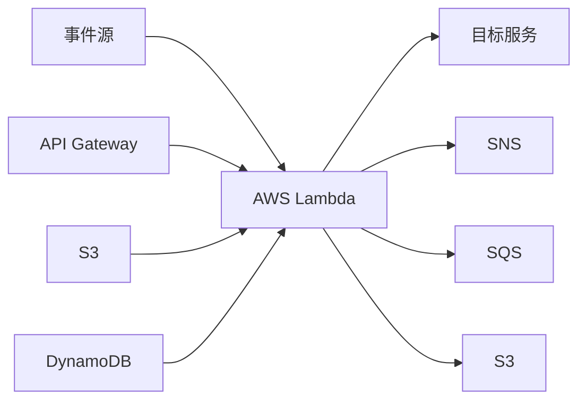
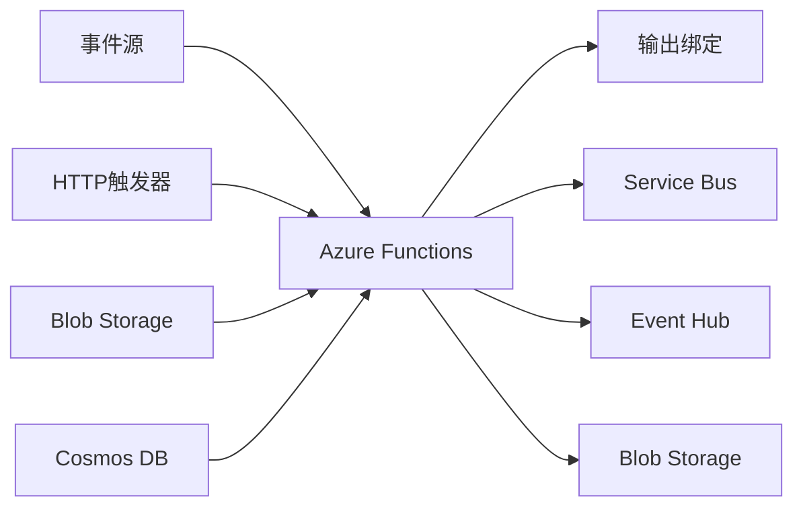
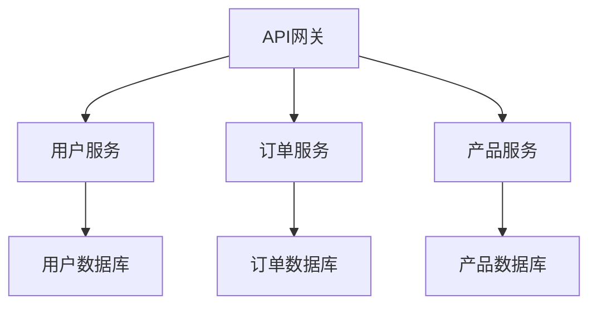
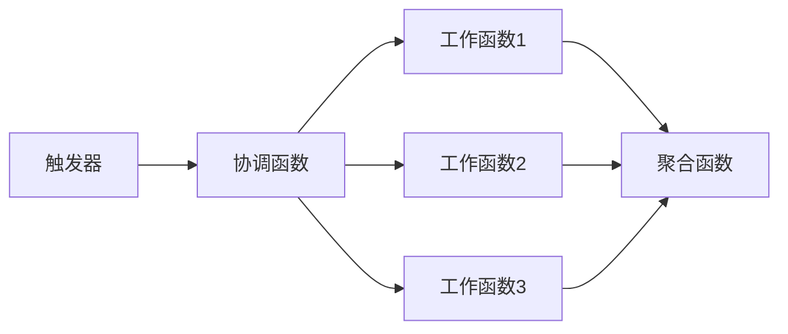

# AWS Lambda/Azure Functions集成

AWS Lambda和Azure Functions是两大主流云服务商提供的Serverless计算服务。本文将详细介绍如何使用和集成这些服务，以及与其他云服务的协作方式。

## AWS Lambda概述

AWS Lambda是Amazon Web Services提供的一种无服务器计算服务，允许开发者运行代码而无需配置或管理服务器。Lambda函数在高可用性计算基础设施上运行，并自动扩展以满足应用需求。

### Lambda核心特性

1. **事件驱动执行**：Lambda函数可以响应各种AWS服务触发的事件
2. **自动扩缩**：根据请求量自动扩展或缩减资源
3. **按使用付费**：仅为实际执行时间和资源消耗付费
4. **多语言支持**：支持Node.js、Python、Java、Go、.NET等多种编程语言
5. **无状态函数**：每次调用都是独立的，不保留执行上下文



## Azure Functions概述

Azure Functions是Microsoft Azure提供的无服务器计算服务，允许开发者在云中运行事件驱动的代码，而无需管理基础设施。

### Azure Functions核心特性

1. **事件驱动**：响应Azure服务或第三方服务的事件
2. **自动扩缩**：根据需求自动扩展计算资源
3. **灵活的开发**：支持C#、JavaScript、Python、Java等多种语言
4. **集成绑定**：简化与其他服务的集成
5. **本地开发体验**：提供完整的本地开发和调试体验



## AWS Lambda开发与部署

### 创建第一个Lambda函数

#### 使用AWS控制台创建

1. 登录AWS管理控制台，导航到Lambda服务
2. 点击"创建函数"
3. 选择"从头开始创作"
4. 输入函数名称，选择运行时（如Node.js 14.x）
5. 配置执行角色（可以创建新角色或使用现有角色）
6. 点击"创建函数"

#### 使用AWS CLI创建

```bash
# 创建执行角色
aws iam create-role --role-name lambda-basic-execution --assume-role-policy-document '{
  "Version": "2012-10-17",
  "Statement": [
    {
      "Effect": "Allow",
      "Principal": {
        "Service": "lambda.amazonaws.com"
      },
      "Action": "sts:AssumeRole"
    }
  ]
}'

# 附加基本执行策略
aws iam attach-role-policy --role-name lambda-basic-execution --policy-arn arn:aws:iam::aws:policy/service-role/AWSLambdaBasicExecutionRole

# 创建函数部署包
zip function.zip index.js

# 创建Lambda函数
aws lambda create-function --function-name my-function \
  --zip-file fileb://function.zip \
  --handler index.handler \
  --runtime nodejs14.x \
  --role arn:aws:iam::<account-id>:role/lambda-basic-execution
```

### Lambda函数示例

#### Node.js示例

```javascript
exports.handler = async (event, context) => {
    console.log('事件数据:', JSON.stringify(event, null, 2));
    
    try {
        // 处理事件数据
        const name = event.name || 'World';
        const response = {
            statusCode: 200,
            body: JSON.stringify({
                message: `Hello, ${name}!`,
                timestamp: new Date().toISOString()
            })
        };
        
        return response;
    } catch (error) {
        console.error('处理错误:', error);
        return {
            statusCode: 500,
            body: JSON.stringify({
                message: '内部服务器错误',
                error: error.message
            })
        };
    }
};
```

#### Python示例

```python
import json
import logging
import datetime

logger = logging.getLogger()
logger.setLevel(logging.INFO)

def lambda_handler(event, context):
    logger.info('事件数据: %s', json.dumps(event))
    
    try:
        # 处理事件数据
        name = event.get('name', 'World')
        response = {
            'statusCode': 200,
            'body': json.dumps({
                'message': f'Hello, {name}!',
                'timestamp': datetime.datetime.now().isoformat()
            })
        }
        
        return response
    except Exception as e:
        logger.error('处理错误: %s', e)
        return {
            'statusCode': 500,
            'body': json.dumps({
                'message': '内部服务器错误',
                'error': str(e)
            })
        }
```

### Lambda部署选项

#### 使用AWS控制台部署

1. 在Lambda函数页面，选择"上传"选项
2. 选择".zip文件"或"Amazon S3位置"
3. 上传函数代码包或指定S3 URI
4. 点击"保存"

#### 使用AWS SAM部署

AWS Serverless Application Model (SAM) 是一个简化无服务器应用程序开发的框架。

1. 创建SAM模板文件 `template.yaml`：

```yaml
AWSTemplateFormatVersion: '2010-09-09'
Transform: AWS::Serverless-2016-10-31
Resources:
  MyFunction:
    Type: AWS::Serverless::Function
    Properties:
      CodeUri: ./
      Handler: index.handler
      Runtime: nodejs14.x
      Events:
        ApiEvent:
          Type: Api
          Properties:
            Path: /hello
            Method: get
```

2. 构建和部署应用：

```bash
# 构建应用
sam build

# 部署应用
sam deploy --guided
```

#### 使用AWS CDK部署

AWS Cloud Development Kit (CDK) 允许使用熟悉的编程语言定义云基础设施。

```typescript
import * as cdk from 'aws-cdk-lib';
import { Construct } from 'constructs';
import * as lambda from 'aws-cdk-lib/aws-lambda';
import * as apigateway from 'aws-cdk-lib/aws-apigateway';

export class LambdaStack extends cdk.Stack {
  constructor(scope: Construct, id: string, props?: cdk.StackProps) {
    super(scope, id, props);

    // 创建Lambda函数
    const helloFunction = new lambda.Function(this, 'HelloHandler', {
      runtime: lambda.Runtime.NODEJS_14_X,
      code: lambda.Code.fromAsset('lambda'),
      handler: 'index.handler'
    });

    // 创建API Gateway
    const api = new apigateway.RestApi(this, 'HelloApi', {
      restApiName: 'Hello Service',
      description: 'This service says hello.'
    });

    const helloIntegration = new apigateway.LambdaIntegration(helloFunction);
    api.root.addMethod('GET', helloIntegration);
  }
}
```

## Azure Functions开发与部署

### 创建第一个Azure Function

#### 使用Azure门户创建

1. 登录Azure门户，导航到"创建资源"
2. 搜索并选择"Function App"
3. 配置基本信息（订阅、资源组、函数应用名称）
4. 选择运行时堆栈（如.NET、Node.js、Python）
5. 选择区域和计划类型
6. 点击"审阅+创建"，然后点击"创建"

#### 使用Azure CLI创建

```bash
# 创建资源组
az group create --name myResourceGroup --location westeurope

# 创建存储账户
az storage account create --name mystorageaccount --location westeurope --resource-group myResourceGroup --sku Standard_LRS

# 创建函数应用
az functionapp create --resource-group myResourceGroup --consumption-plan-location westeurope --runtime node --runtime-version 14 --functions-version 4 --name myFunctionApp --storage-account mystorageaccount
```

### Azure Functions示例

#### JavaScript示例

```javascript
module.exports = async function (context, req) {
    context.log('JavaScript HTTP触发器函数已处理请求');

    const name = req.query.name || (req.body && req.body.name) || 'World';
    
    const responseMessage = `Hello, ${name}!`;
    
    context.res = {
        status: 200,
        body: {
            message: responseMessage,
            timestamp: new Date().toISOString()
        }
    };
};
```

#### C#示例

```csharp
using System;
using System.IO;
using System.Threading.Tasks;
using Microsoft.AspNetCore.Mvc;
using Microsoft.Azure.WebJobs;
using Microsoft.Azure.WebJobs.Extensions.Http;
using Microsoft.AspNetCore.Http;
using Microsoft.Extensions.Logging;
using Newtonsoft.Json;

public static class HelloFunction
{
    [FunctionName("HelloFunction")]
    public static async Task<IActionResult> Run(
        [HttpTrigger(AuthorizationLevel.Function, "get", "post", Route = null)] HttpRequest req,
        ILogger log)
    {
        log.LogInformation("C# HTTP触发器函数已处理请求");

        string name = req.Query["name"];

        string requestBody = await new StreamReader(req.Body).ReadToEndAsync();
        dynamic data = JsonConvert.DeserializeObject(requestBody);
        name = name ?? data?.name ?? "World";

        var response = new {
            message = $"Hello, {name}!",
            timestamp = DateTime.UtcNow.ToString("o")
        };

        return new OkObjectResult(response);
    }
}
```

### Azure Functions部署选项

#### 使用Visual Studio Code部署

1. 安装Azure Functions扩展
2. 创建新的函数项目
3. 开发函数
4. 点击"部署到Function App"
5. 选择订阅和目标Function App

#### 使用Azure Functions Core Tools部署

```bash
# 安装Azure Functions Core Tools
npm install -g azure-functions-core-tools@4

# 创建新的函数项目
func init MyFunctionProject --javascript

# 创建新函数
cd MyFunctionProject
func new --name HttpExample --template "HTTP trigger"

# 本地运行
func start

# 部署到Azure
func azure functionapp publish myFunctionApp
```

#### 使用GitHub Actions部署

1. 在GitHub仓库中创建`.github/workflows/azure-functions-app.yml`文件：

```yaml
name: Deploy Node.js project to Azure Function App

on:
  push:
    branches: [ main ]

env:
  AZURE_FUNCTIONAPP_NAME: your-app-name
  AZURE_FUNCTIONAPP_PACKAGE_PATH: '.'
  NODE_VERSION: '14.x'

jobs:
  build-and-deploy:
    runs-on: ubuntu-latest
    steps:
    - name: 'Checkout GitHub Action'
      uses: actions/checkout@v2

    - name: Setup Node ${{ env.NODE_VERSION }} Environment
      uses: actions/setup-node@v1
      with:
        node-version: ${{ env.NODE_VERSION }}

    - name: 'Resolve Project Dependencies Using Npm'
      shell: bash
      run: |
        pushd './${{ env.AZURE_FUNCTIONAPP_PACKAGE_PATH }}'
        npm install
        npm run build --if-present
        npm run test --if-present
        popd

    - name: 'Run Azure Functions Action'
      uses: Azure/functions-action@v1
      with:
        app-name: ${{ env.AZURE_FUNCTIONAPP_NAME }}
        package: ${{ env.AZURE_FUNCTIONAPP_PACKAGE_PATH }}
        publish-profile: ${{ secrets.AZURE_FUNCTIONAPP_PUBLISH_PROFILE }}
```

## AWS Lambda与其他AWS服务集成

### Lambda与API Gateway集成

API Gateway允许创建、发布、维护、监控和保护API，可以与Lambda函数无缝集成。

#### 创建REST API

1. 在API Gateway控制台创建新的REST API
2. 创建资源和方法（如GET /hello）
3. 将方法集成到Lambda函数
4. 部署API到阶段

```yaml
# SAM模板示例
AWSTemplateFormatVersion: '2010-09-09'
Transform: AWS::Serverless-2016-10-31
Resources:
  HelloWorldFunction:
    Type: AWS::Serverless::Function
    Properties:
      CodeUri: ./
      Handler: index.handler
      Runtime: nodejs14.x
      Events:
        HelloWorld:
          Type: Api
          Properties:
            Path: /hello
            Method: get
```

#### 使用API Gateway调用Lambda

```javascript
// 前端调用示例
async function callLambdaFunction() {
    try {
        const response = await fetch('https://your-api-id.execute-api.region.amazonaws.com/prod/hello?name=John');
        const data = await response.json();
        console.log('响应数据:', data);
    } catch (error) {
        console.error('调用错误:', error);
    }
}
```

### Lambda与S3集成

Lambda可以响应S3存储桶中的事件，如文件上传、删除等。

#### 配置S3事件触发Lambda

```yaml
# SAM模板示例
Resources:
  ProcessS3Function:
    Type: AWS::Serverless::Function
    Properties:
      Handler: index.handler
      Runtime: nodejs14.x
      Events:
        S3Event:
          Type: S3
          Properties:
            Bucket: !Ref MyBucket
            Events: s3:ObjectCreated:*
  
  MyBucket:
    Type: AWS::S3::Bucket
```

#### 处理S3事件的Lambda函数

```javascript
exports.handler = async (event, context) => {
    console.log('接收到S3事件:', JSON.stringify(event, null, 2));
    
    // 处理每个记录
    for (const record of event.Records) {
        const bucket = record.s3.bucket.name;
        const key = decodeURIComponent(record.s3.object.key.replace(/\+/g, ' '));
        
        console.log(`处理文件: s3://${bucket}/${key}`);
        
        // 处理文件逻辑
        // ...
    }
    
    return {
        statusCode: 200,
        body: JSON.stringify({
            message: '处理完成',
            processedFiles: event.Records.length
        })
    };
};
```

### Lambda与DynamoDB集成

Lambda可以响应DynamoDB流事件，处理表中的数据变更。

#### 配置DynamoDB流触发Lambda

```yaml
Resources:
  MyTable:
    Type: AWS::DynamoDB::Table
    Properties:
      AttributeDefinitions:
        - AttributeName: id
          AttributeType: S
      KeySchema:
        - AttributeName: id
          KeyType: HASH
      BillingMode: PAY_PER_REQUEST
      StreamSpecification:
        StreamViewType: NEW_AND_OLD_IMAGES
  
  ProcessDynamoDBFunction:
    Type: AWS::Serverless::Function
    Properties:
      Handler: index.handler
      Runtime: nodejs14.x
      Events:
        DynamoDBEvent:
          Type: DynamoDB
          Properties:
            Stream: !GetAtt MyTable.StreamArn
            StartingPosition: LATEST
            BatchSize: 10
```

#### 处理DynamoDB流事件的Lambda函数

```javascript
exports.handler = async (event, context) => {
    console.log('接收到DynamoDB流事件:', JSON.stringify(event, null, 2));
    
    // 处理每个记录
    for (const record of event.Records) {
        const eventName = record.eventName;
        
        // 获取新旧镜像
        const oldImage = record.dynamodb.OldImage ? AWS.DynamoDB.Converter.unmarshall(record.dynamodb.OldImage) : null;
        const newImage = record.dynamodb.NewImage ? AWS.DynamoDB.Converter.unmarshall(record.dynamodb.NewImage) : null;
        
        console.log(`事件类型: ${eventName}`);
        console.log('旧数据:', oldImage);
        console.log('新数据:', newImage);
        
        // 根据事件类型处理
        switch (eventName) {
            case 'INSERT':
                await handleInsert(newImage);
                break;
            case 'MODIFY':
                await handleModify(oldImage, newImage);
                break;
            case 'REMOVE':
                await handleRemove(oldImage);
                break;
        }
    }
    
    return { status: 'success' };
};

async function handleInsert(item) {
    // 处理插入事件
}

async function handleModify(oldItem, newItem) {
    // 处理修改事件
}

async function handleRemove(item) {
    // 处理删除事件
}
```

## Azure Functions与其他Azure服务集成

### Azure Functions与HTTP触发器

HTTP触发器允许通过HTTP请求调用函数。

#### 创建HTTP触发器函数

```bash
# 使用Azure Functions Core Tools创建HTTP触发器函数
func new --name HttpTriggerFunction --template "HTTP trigger"
```

#### 函数代码示例

```javascript
module.exports = async function (context, req) {
    context.log('HTTP触发器函数已处理请求');

    const name = req.query.name || (req.body && req.body.name) || 'World';
    
    context.res = {
        status: 200,
        body: {
            message: `Hello, ${name}!`,
            timestamp: new Date().toISOString()
        }
    };
};
```

### Azure Functions与Blob Storage集成

Blob触发器允许函数响应Blob存储中的文件变更。

#### 创建Blob触发器函数

```bash
# 使用Azure Functions Core Tools创建Blob触发器函数
func new --name BlobTriggerFunction --template "Blob trigger"
```

#### 函数代码示例

```javascript
module.exports = async function (context, myBlob) {
    context.log("Blob触发器函数已处理blob\n Name:", context.bindingData.name, "\n Blob Size:", myBlob.length, "Bytes");
    
    // 处理blob内容
    const content = myBlob.toString();
    
    // 输出处理结果到另一个blob
    context.bindings.outputBlob = `处理时间: ${new Date().toISOString()}\n原始内容: ${content}`;
    
    context.done();
};
```

#### 函数配置（function.json）

```json
{
  "bindings": [
    {
      "name": "myBlob",
      "type": "blobTrigger",
      "direction": "in",
      "path": "samples-workitems/{name}",
      "connection": "AzureWebJobsStorage"
    },
    {
      "name": "outputBlob",
      "type": "blob",
      "direction": "out",
      "path": "samples-output/{name}-processed",
      "connection": "AzureWebJobsStorage"
    }
  ]
}
```

### Azure Functions与Cosmos DB集成

Cosmos DB触发器允许函数响应Cosmos DB中的数据变更。

#### 创建Cosmos DB触发器函数

```bash
# 使用Azure Functions Core Tools创建Cosmos DB触发器函数
func new --name CosmosDBTriggerFunction --template "Cosmos DB trigger"
```

#### 函数代码示例

```javascript
module.exports = async function (context, documents) {
    if (documents && documents.length > 0) {
        context.log(`处理 ${documents.length} 个文档`);
        
        for (const document of documents) {
            context.log(`处理文档: ${document.id}`);
            
            // 处理文档
            // ...
            
            // 输出处理后的文档
            context.bindings.outputDocument = {
                id: document.id,
                processedData: document.data,
                processedAt: new Date().toISOString()
            };
        }
    }
};
```

#### 函数配置（function.json）

```json
{
  "bindings": [
    {
      "type": "cosmosDBTrigger",
      "name": "documents",
      "direction": "in",
      "leaseCollectionName": "leases",
      "connectionStringSetting": "CosmosDBConnection",
      "databaseName": "myDatabase",
      "collectionName": "myCollection",
      "createLeaseCollectionIfNotExists": true
    },
    {
      "type": "cosmosDB",
      "name": "outputDocument",
      "direction": "out",
      "connectionStringSetting": "CosmosDBConnection",
      "databaseName": "myDatabase",
      "collectionName": "processedItems"
    }
  ]
}
```

## 高级主题

### 冷启动优化

冷启动是指函数首次执行或长时间未执行后的初始化过程，可能导致延迟。

#### AWS Lambda冷启动优化

1. **使用预置并发**：为关键函数配置预置并发，保持函数实例预热

```bash
# 配置预置并发
aws lambda put-provisioned-concurrency-config \
  --function-name my-function \
  --qualifier prod \
  --provisioned-concurrent-executions 10
```

2. **优化依赖**：减少依赖数量和大小
3. **使用Lambda层**：将公共依赖移至Lambda层
4. **增加内存分配**：更多内存通常意味着更多CPU，加快启动速度

#### Azure Functions冷启动优化

1. **使用Premium计划**：提供预热实例，减少冷启动
2. **优化依赖**：减少依赖数量和大小
3. **使用Durable Functions**：保持函数实例活跃
4. **实现单例模式**：重用昂贵的连接和资源

### 无服务器应用架构模式

#### 事件处理模式


#### 微服务模式



#### 扇出模式



### 安全最佳实践

#### AWS Lambda安全最佳实践

1. **最小权限原则**：为Lambda函数分配最小所需权限
2. **使用环境变量**：存储配置，避免硬编码敏感信息
3. **使用AWS Secrets Manager**：安全存储和管理敏感凭证
4. **启用VPC集成**：将Lambda函数部署在VPC中，增强网络安全
5. **实施输入验证**：验证所有输入数据，防止注入攻击

#### Azure Functions安全最佳实践

1. **使用托管身份**：避免存储凭证，使用Azure托管身份
2. **应用程序设置**：使用应用程序设置存储配置
3. **使用Key Vault**：安全存储和管理敏感凭证
4. **网络隔离**：使用VNet集成和私有端点
5. **启用身份验证**：配置适当的身份验证机制

### 监控和日志记录

#### AWS Lambda监控

1. **CloudWatch指标**：监控调用次数、持续时间、错误率等
2. **CloudWatch Logs**：查看函数日志
3. **X-Ray**：跟踪和分析函数执行

```javascript
// 启用X-Ray跟踪
const AWSXRay = require('aws-xray-sdk-core');
const AWS = AWSXRay.captureAWS(require('aws-sdk'));

exports.handler = async (event, context) => {
    // 创建子分段
    const segment = AWSXRay.getSegment();
    const subsegment = segment.addNewSubsegment('处理逻辑');
    
    try {
        // 函数逻辑
        // ...
        
        subsegment.close();
        return { status: 'success' };
    } catch (error) {
        subsegment.addError(error);
        subsegment.close();
        throw error;
    }
};
```

#### Azure Functions监控

1. **Application Insights**：监控性能、错误和使用情况
2. **Azure Monitor**：查看指标和日志
3. **Kusto查询语言(KQL)**：分析日志数据

```javascript
// 使用Application Insights
const appInsights = require('applicationinsights');
appInsights.setup().start();
const client = appInsights.defaultClient;

module.exports = async function (context, req) {
    // 跟踪请求
    client.trackEvent({name: "FunctionInvoked", properties: {functionName: context.executionContext.functionName}});
    
    try {
        // 函数逻辑
        // ...
        
        client.trackMetric({name: "ProcessingTime", value: processingTime});
        return { status: 'success' };
    } catch (error) {
        client.trackException({exception: error});
        throw error;
    }
};
```

## 多云策略与最佳实践

### 跨云函数设计

设计可在多个云平台运行的函数，减少供应商锁定。

#### 抽象层模式

```javascript
// 抽象存储层示例
class StorageService {
    constructor(provider) {
        this.provider = provider;
        this.client = this._initializeClient();
    }
    
    _initializeClient() {
        switch (this.provider) {
            case 'aws':
                return new AWS.S3();
            case 'azure':
                return new Azure.Storage.Blob();
            default:
                throw new Error(`不支持的提供商: ${this.provider}`);
        }
    }
    
    async uploadFile(container, fileName, content) {
        if (this.provider === 'aws') {
            return this.client.putObject({
                Bucket: container,
                Key: fileName,
                Body: content
            }).promise();
        } else if (this.provider === 'azure') {
            const containerClient = this.client.getContainerClient(container);
            const blockBlobClient = containerClient.getBlockBlobClient(fileName);
            return blockBlobClient.upload(content, content.length);
        }
    }
    
    // 其他方法...
}
```

### 成本优化策略

#### AWS Lambda成本优化

1. **优化内存配置**：找到性能和成本的最佳平衡点
2. **减少执行时间**：优化代码，减少执行时间
3. **使用预留并发**：为关键函数预留容量，避免过度扩展
4. **实施缓存**：缓存频繁访问的数据，减少函数调用

#### Azure Functions成本优化

1. **选择合适的计划**：消费计划、高级计划或App Service计划
2. **优化执行时间**：减少函数执行时间
3. **使用Durable Functions**：合并多个小操作，减少总体执行次数
4. **实施缓存**：使用Azure Redis Cache缓存数据

### 持续集成/持续部署(CI/CD)

#### AWS Lambda CI/CD

使用AWS CodePipeline和CodeBuild自动化部署：

```yaml
# buildspec.yml示例
version: 0.2

phases:
  install:
    runtime-versions:
      nodejs: 14
  pre_build:
    commands:
      - echo Installing dependencies...
      - npm install
  build:
    commands:
      - echo Running tests...
      - npm test
      - echo Building the Lambda package...
      - npm run build
  post_build:
    commands:
      - echo Creating deployment package...
      - aws cloudformation package --template-file template.yaml --s3-bucket ${DEPLOYMENT_BUCKET} --output-template-file packaged.yaml

artifacts:
  files:
    - packaged.yaml
    - appspec.yml
```

#### Azure Functions CI/CD

使用Azure DevOps或GitHub Actions自动化部署：

```yaml
# azure-pipelines.yml示例
trigger:
- main

pool:
  
继续介绍Azure Functions CI/CD的部分：

```yaml
# azure-pipelines.yml示例
trigger:
- main

pool:
  vmImage: 'ubuntu-latest'

steps:
- task: NodeTool@0
  inputs:
    versionSpec: '14.x'
  displayName: '安装Node.js'

- script: |
    npm install
    npm test
  displayName: '安装依赖并测试'

- task: ArchiveFiles@2
  inputs:
    rootFolderOrFile: '$(System.DefaultWorkingDirectory)'
    includeRootFolder: false
    archiveType: 'zip'
    archiveFile: '$(Build.ArtifactStagingDirectory)/$(Build.BuildId).zip'
    replaceExistingArchive: true

- task: AzureFunctionApp@1
  inputs:
    azureSubscription: 'Your-Azure-Subscription'
    appType: 'functionApp'
    appName: 'your-function-app-name'
    package: '$(Build.ArtifactStagingDirectory)/$(Build.BuildId).zip'
    deploymentMethod: 'auto'
```

## 实际应用案例

### 无服务器API后端

#### AWS Lambda实现

使用API Gateway和Lambda构建RESTful API：

```javascript
// 用户服务 - 获取用户信息
exports.getUserHandler = async (event, context) => {
    const userId = event.pathParameters.id;
    
    try {
        // 从DynamoDB获取用户
        const dynamoDB = new AWS.DynamoDB.DocumentClient();
        const result = await dynamoDB.get({
            TableName: 'Users',
            Key: { id: userId }
        }).promise();
        
        if (!result.Item) {
            return {
                statusCode: 404,
                body: JSON.stringify({ message: '用户不存在' })
            };
        }
        
        return {
            statusCode: 200,
            body: JSON.stringify(result.Item)
        };
    } catch (error) {
        console.error('获取用户错误:', error);
        return {
            statusCode: 500,
            body: JSON.stringify({ message: '内部服务器错误' })
        };
    }
};

// 订单服务 - 创建订单
exports.createOrderHandler = async (event, context) => {
    try {
        const body = JSON.parse(event.body);
        const userId = body.userId;
        const products = body.products;
        
        // 验证输入
        if (!userId || !products || !Array.isArray(products) || products.length === 0) {
            return {
                statusCode: 400,
                body: JSON.stringify({ message: '无效的请求数据' })
            };
        }
        
        // 创建订单
        const orderId = uuid.v4();
        const timestamp = new Date().toISOString();
        
        const dynamoDB = new AWS.DynamoDB.DocumentClient();
        await dynamoDB.put({
            TableName: 'Orders',
            Item: {
                id: orderId,
                userId: userId,
                products: products,
                status: 'PENDING',
                createdAt: timestamp,
                updatedAt: timestamp
            }
        }).promise();
        
        // 发布订单创建事件
        const sns = new AWS.SNS();
        await sns.publish({
            TopicArn: process.env.ORDER_CREATED_TOPIC,
            Message: JSON.stringify({
                orderId: orderId,
                userId: userId,
                products: products
            }),
            MessageAttributes: {
                eventType: {
                    DataType: 'String',
                    StringValue: 'ORDER_CREATED'
                }
            }
        }).promise();
        
        return {
            statusCode: 201,
            body: JSON.stringify({
                orderId: orderId,
                status: 'PENDING',
                message: '订单已创建'
            })
        };
    } catch (error) {
        console.error('创建订单错误:', error);
        return {
            statusCode: 500,
            body: JSON.stringify({ message: '内部服务器错误' })
        };
    }
};
```

#### Azure Functions实现

使用HTTP触发器构建RESTful API：

```javascript
// 用户服务 - 获取用户信息
module.exports = async function (context, req) {
    const userId = req.params.id;
    
    try {
        // 从Cosmos DB获取用户
        const container = context.bindings.cosmosDB;
        const query = {
            query: "SELECT * FROM c WHERE c.id = @userId",
            parameters: [
                {
                    name: "@userId",
                    value: userId
                }
            ]
        };
        
        const user = await container.queryItems(query).toArray();
        
        if (!user || user.length === 0) {
            context.res = {
                status: 404,
                body: { message: '用户不存在' }
            };
            return;
        }
        
        context.res = {
            status: 200,
            body: user[0]
        };
    } catch (error) {
        context.log.error('获取用户错误:', error);
        context.res = {
            status: 500,
            body: { message: '内部服务器错误' }
        };
    }
};

// 订单服务 - 创建订单
module.exports = async function (context, req) {
    try {
        const body = req.body;
        const userId = body.userId;
        const products = body.products;
        
        // 验证输入
        if (!userId || !products || !Array.isArray(products) || products.length === 0) {
            context.res = {
                status: 400,
                body: { message: '无效的请求数据' }
            };
            return;
        }
        
        // 创建订单
        const orderId = context.bindings.uuid;
        const timestamp = new Date().toISOString();
        
        const order = {
            id: orderId,
            userId: userId,
            products: products,
            status: 'PENDING',
            createdAt: timestamp,
            updatedAt: timestamp
        };
        
        // 保存到Cosmos DB
        context.bindings.orderDocument = order;
        
        // 发送订单创建事件
        context.bindings.orderCreatedEvent = {
            orderId: orderId,
            userId: userId,
            products: products,
            eventType: 'ORDER_CREATED'
        };
        
        context.res = {
            status: 201,
            body: {
                orderId: orderId,
                status: 'PENDING',
                message: '订单已创建'
            }
        };
    } catch (error) {
        context.log.error('创建订单错误:', error);
        context.res = {
            status: 500,
            body: { message: '内部服务器错误' }
        };
    }
};
```

### 实时数据处理

#### AWS Lambda实现

使用Kinesis和Lambda处理实时数据流：

```javascript
exports.processStreamHandler = async (event, context) => {
    console.log('接收到Kinesis事件:', JSON.stringify(event, null, 2));
    
    // 处理每条记录
    const processedRecords = [];
    
    for (const record of event.Records) {
        // 解码Base64数据
        const payload = Buffer.from(record.kinesis.data, 'base64').toString('utf-8');
        const data = JSON.parse(payload);
        
        console.log('处理数据:', data);
        
        try {
            // 数据转换和处理
            const processedData = {
                id: data.id,
                timestamp: data.timestamp,
                value: data.value,
                normalizedValue: data.value / 100,
                processedAt: new Date().toISOString()
            };
            
            // 存储处理后的数据
            const dynamoDB = new AWS.DynamoDB.DocumentClient();
            await dynamoDB.put({
                TableName: 'ProcessedData',
                Item: processedData
            }).promise();
            
            // 计算聚合指标
            if (data.value > 90) {
                // 发布高值警报
                const sns = new AWS.SNS();
                await sns.publish({
                    TopicArn: process.env.ALERTS_TOPIC,
                    Message: JSON.stringify({
                        message: '检测到高值',
                        data: processedData
                    }),
                    Subject: '数据处理警报'
                }).promise();
            }
            
            processedRecords.push({
                id: data.id,
                status: 'processed'
            });
        } catch (error) {
            console.error('处理记录错误:', error);
            processedRecords.push({
                id: data.id,
                status: 'error',
                error: error.message
            });
        }
    }
    
    return {
        recordsProcessed: event.Records.length,
        successful: processedRecords.filter(r => r.status === 'processed').length,
        failed: processedRecords.filter(r => r.status === 'error').length,
        records: processedRecords
    };
};
```

#### Azure Functions实现

使用Event Hub和Azure Functions处理实时数据流：

```javascript
module.exports = async function (context, eventHubMessages) {
    context.log(`处理 ${eventHubMessages.length} 条Event Hub消息`);
    
    // 处理每条消息
    const processedMessages = [];
    
    for (const message of eventHubMessages) {
        context.log('处理数据:', message);
        
        try {
            // 数据转换和处理
            const processedData = {
                id: message.id,
                timestamp: message.timestamp,
                value: message.value,
                normalizedValue: message.value / 100,
                processedAt: new Date().toISOString()
            };
            
            // 存储处理后的数据
            context.bindings.outputDocument = processedData;
            
            // 计算聚合指标
            if (message.value > 90) {
                // 发送高值警报
                context.bindings.outputEvent = {
                    message: '检测到高值',
                    data: processedData
                };
            }
            
            processedMessages.push({
                id: message.id,
                status: 'processed'
            });
        } catch (error) {
            context.log.error('处理消息错误:', error);
            processedMessages.push({
                id: message.id,
                status: 'error',
                error: error.message
            });
        }
    }
    
    context.bindings.outputSummary = {
        messagesProcessed: eventHubMessages.length,
        successful: processedMessages.filter(m => m.status === 'processed').length,
        failed: processedMessages.filter(m => m.status === 'error').length,
        messages: processedMessages
    };
};
```

### 定时任务和批处理

#### AWS Lambda实现

使用CloudWatch Events定期触发Lambda函数：

```javascript
exports.dailyReportHandler = async (event, context) => {
    console.log('开始生成每日报告:', new Date().toISOString());
    
    try {
        // 获取昨天的日期
        const yesterday = new Date();
        yesterday.setDate(yesterday.getDate() - 1);
        const dateString = yesterday.toISOString().split('T')[0];
        
        // 查询数据
        const dynamoDB = new AWS.DynamoDB.DocumentClient();
        const result = await dynamoDB.query({
            TableName: 'ProcessedData',
            IndexName: 'DateIndex',
            KeyConditionExpression: 'date = :date',
            ExpressionAttributeValues: {
                ':date': dateString
            }
        }).promise();
        
        const data = result.Items;
        
        // 生成报告
        const report = generateReport(data, dateString);
        
        // 保存报告到S3
        const s3 = new AWS.S3();
        await s3.putObject({
            Bucket: process.env.REPORTS_BUCKET,
            Key: `daily-reports/${dateString}.json`,
            Body: JSON.stringify(report),
            ContentType: 'application/json'
        }).promise();
        
        // 发送报告通知
        const sns = new AWS.SNS();
        await sns.publish({
            TopicArn: process.env.REPORTS_TOPIC,
            Message: JSON.stringify({
                message: `${dateString}的每日报告已生成`,
                reportUrl: `s3://${process.env.REPORTS_BUCKET}/daily-reports/${dateString}.json`
            }),
            Subject: `每日报告 - ${dateString}`
        }).promise();
        
        return {
            statusCode: 200,
            body: JSON.stringify({
                message: '报告生成成功',
                date: dateString,
                reportUrl: `s3://${process.env.REPORTS_BUCKET}/daily-reports/${dateString}.json`
            })
        };
    } catch (error) {
        console.error('生成报告错误:', error);
        return {
            statusCode: 500,
            body: JSON.stringify({
                message: '生成报告失败',
                error: error.message
            })
        };
    }
};

function generateReport(data, date) {
    // 计算聚合指标
    const totalRecords = data.length;
    const totalValue = data.reduce((sum, item) => sum + item.value, 0);
    const averageValue = totalValue / totalRecords;
    const maxValue = Math.max(...data.map(item => item.value));
    const minValue = Math.min(...data.map(item => item.value));
    
    // 按小时分组
    const hourlyData = {};
    for (const item of data) {
        const hour = new Date(item.timestamp).getHours();
        if (!hourlyData[hour]) {
            hourlyData[hour] = [];
        }
        hourlyData[hour].push(item);
    }
    
    // 计算每小时聚合指标
    const hourlyStats = {};
    for (const [hour, items] of Object.entries(hourlyData)) {
        const total = items.reduce((sum, item) => sum + item.value, 0);
        hourlyStats[hour] = {
            count: items.length,
            total: total,
            average: total / items.length,
            max: Math.max(...items.map(item => item.value)),
            min: Math.min(...items.map(item => item.value))
        };
    }
    
    return {
        date: date,
        summary: {
            totalRecords: totalRecords,
            totalValue: totalValue,
            averageValue: averageValue,
            maxValue: maxValue,
            minValue: minValue
        },
        hourlyStats: hourlyStats,
        generatedAt: new Date().toISOString()
    };
}
```

#### Azure Functions实现

使用Timer触发器定期执行函数：

```javascript
module.exports = async function (context, myTimer) {
    const timeStamp = new Date().toISOString();
    context.log('每日报告函数开始执行:', timeStamp);
    
    try {
        // 获取昨天的日期
        const yesterday = new Date();
        yesterday.setDate(yesterday.getDate() - 1);
        const dateString = yesterday.toISOString().split('T')[0];
        
        // 查询数据
        const container = context.bindings.cosmosDB;
        const query = {
            query: "SELECT * FROM c WHERE c.date = @date",
            parameters: [
                {
                    name: "@date",
                    value: dateString
                }
            ]
        };
        
        const data = await container.queryItems(query).toArray();
        
        // 生成报告
        const report = generateReport(data, dateString);
        
        // 保存报告到Blob存储
        context.bindings.outputBlob = JSON.stringify(report);
        
        // 发送报告通知
        context.bindings.outputEvent = {
            message: `${dateString}的每日报告已生成`,
            reportUrl: `https://${process.env.STORAGE_ACCOUNT}.blob.core.windows.net/reports/daily-reports/${dateString}.json`
        };
        
        context.res = {
            status: 200,
            body: {
                message: '报告生成成功',
                date: dateString,
                reportUrl: `https://${process.env.STORAGE_ACCOUNT}.blob.core.windows.net/reports/daily-reports/${dateString}.json`
            }
        };
    } catch (error) {
        context.log.error('生成报告错误:', error);
        context.res = {
            status: 500,
            body: {
                message: '生成报告失败',
                error: error.message
            }
        };
    }
};

function generateReport(data, date) {
    // 计算聚合指标
    const totalRecords = data.length;
    const totalValue = data.reduce((sum, item) => sum + item.value, 0);
    const averageValue = totalValue / totalRecords;
    const maxValue = Math.max(...data.map(item => item.value));
    const minValue = Math.min(...data.map(item => item.value));
    
    // 按小时分组
    const hourlyData = {};
    for (const item of data) {
        const hour = new Date(item.timestamp).getHours();
        if (!hourlyData[hour]) {
            hourlyData[hour] = [];
        }
        hourlyData[hour].push(item);
    }
    
    // 计算每小时聚合指标
    const hourlyStats = {};
    for (const [hour, items] of Object.entries(hourlyData)) {
        const total = items.reduce((sum, item) => sum + item.value, 0);
        hourlyStats[hour] = {
            count: items.length,
            total: total,
            average: total / items.length,
            max: Math.max(...items.map(item => item.value)),
            min: Math.min(...items.map(item => item.value))
        };
    }
    
    return {
        date: date,
        summary: {
            totalRecords: totalRecords,
            totalValue: totalValue,
            averageValue: averageValue,
            maxValue: maxValue,
            minValue: minValue
        },
        hourlyStats: hourlyStats,
        generatedAt: new Date().toISOString()
    };
}
```

## 结论

AWS Lambda和Azure Functions都是强大的Serverless计算服务，它们使开发者能够专注于业务逻辑而不必担心基础设施管理。两者都提供了丰富的集成选项，使得构建复杂的Serverless应用变得简单高效。

选择哪个平台取决于多种因素，包括：

1. **现有技术栈**：如果已经使用AWS或Azure的其他服务，选择相同生态系统的Serverless服务通常更合理
2. **特定功能需求**：两个平台在某些特定功能上有差异，需要根据应用需求选择
3. **成本考量**：根据应用的使用模式，不同平台的成本结构可能更有利
4. **团队熟悉度**：团队对特定平台的熟悉程度也是重要考虑因素

无论选择哪个平台，遵循本文介绍的最佳实践都能帮助构建高效、可靠、安全的Serverless应用。随着Serverless技术的不断发展，AWS Lambda和Azure Functions也在持续改进和创新，为开发者提供更强大的工具和服务。