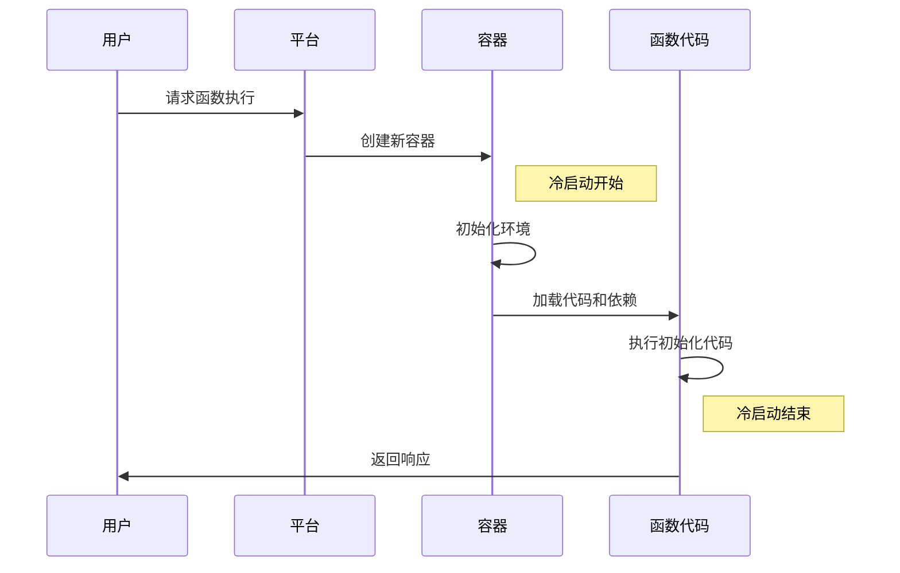
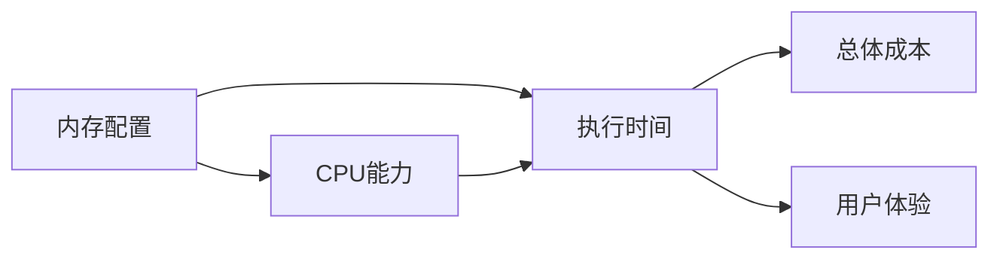
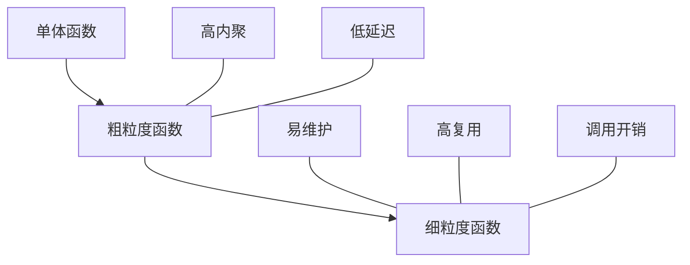
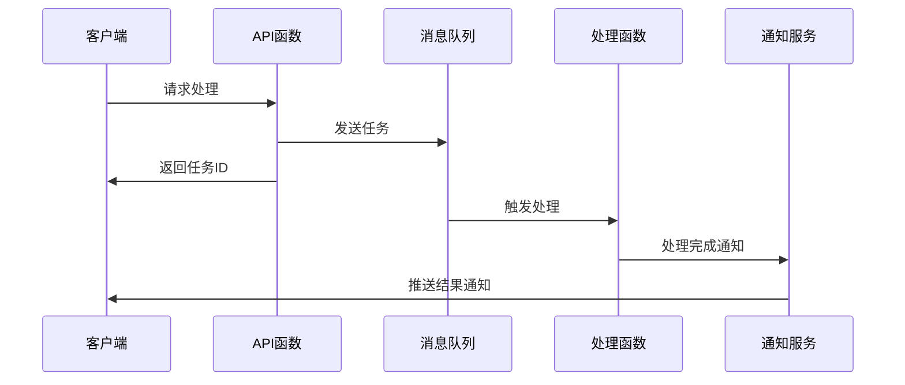
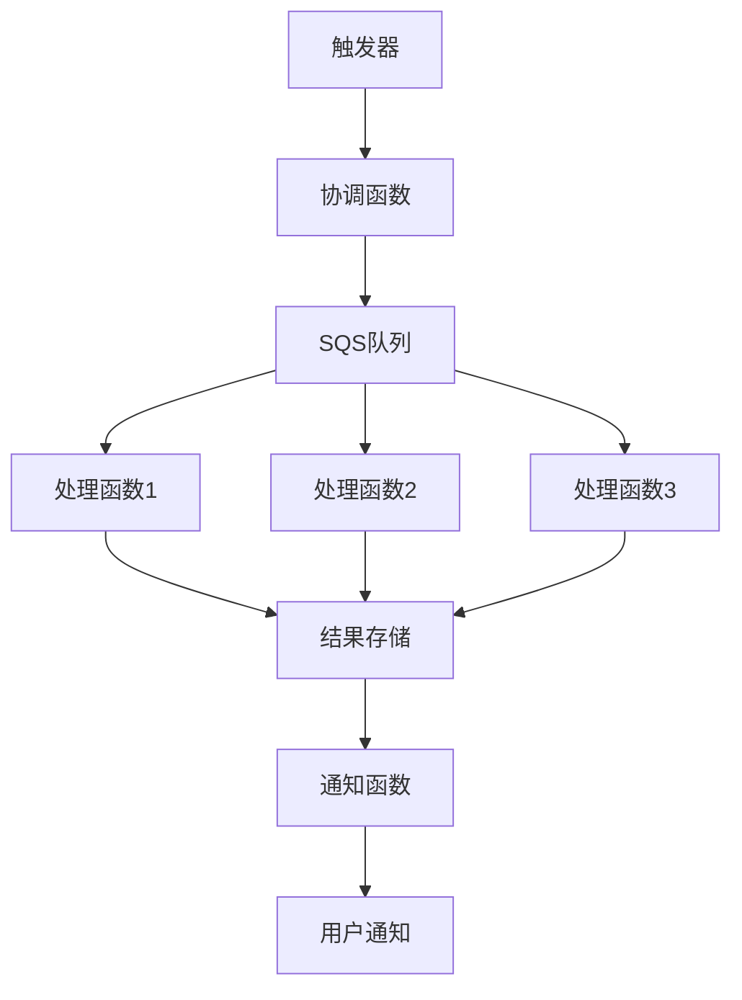

# Serverless应用性能优化

Serverless应用虽然简化了基础设施管理，但也带来了性能挑战。本文将详细介绍Serverless环境下的性能优化策略、冷启动问题解决方案和资源配置最佳实践。

## Serverless性能挑战概述

Serverless架构为开发者提供了"无需管理服务器"的便利，但同时也引入了一系列独特的性能挑战。了解这些挑战是优化Serverless应用的第一步。

### 冷启动问题

冷启动是指函数首次调用或长时间未使用后被重新激活时，平台需要准备执行环境所花费的额外时间。这个过程包括：

1. **容器初始化**：分配并启动容器实例
2. **运行时加载**：加载语言运行时环境（如Node.js、Python等）
3. **代码加载**：加载函数代码和依赖项
4. **应用初始化**：执行函数的初始化代码（如连接数据库、加载配置等）



冷启动可能导致几百毫秒到几秒的延迟，这对于需要快速响应的应用（如API或Web应用）是不可接受的。

### 资源限制

Serverless平台通常对函数执行施加各种限制：

1. **执行时间限制**：函数执行的最大持续时间（如AWS Lambda为15分钟）
2. **内存限制**：可分配给函数的最大内存（如AWS Lambda为10GB）
3. **并发限制**：可同时运行的函数实例数量
4. **部署包大小限制**：函数代码和依赖的最大大小

这些限制要求开发者更加谨慎地设计应用架构和优化代码执行效率。

### 网络延迟

Serverless函数通常需要与其他服务（如数据库、API等）进行通信，这会引入额外的网络延迟：

1. **函数到服务的延迟**：函数与外部服务之间的网络通信时间
2. **冷连接建立**：首次建立连接的额外开销
3. **跨区域通信**：跨地理区域的服务通信带来的延迟

### 状态管理挑战

Serverless函数本质上是无状态的，这意味着：

1. **每次调用都是独立的**：不能依赖函数实例之间共享内存状态
2. **需要外部存储**：持久化状态需要使用外部服务（如数据库、缓存等）
3. **连接管理**：每次函数调用可能需要重新建立连接

## 冷启动优化策略

冷启动是影响Serverless应用性能的最主要因素之一，以下是一系列有效的优化策略：

### 选择合适的运行时

不同的编程语言和运行时环境在冷启动性能上有显著差异：

| 运行时 | 冷启动性能 | 原因 |
|-------|-----------|------|
| Node.js | 优秀 | 轻量级运行时，启动快速 |
| Python | 良好 | 解释型语言，启动相对快速 |
| Java | 较慢 | JVM启动时间长，内存占用大 |
| .NET | 中等 | 运行时较重，但有优化 |
| Go | 优秀 | 编译为单一二进制文件，启动迅速 |
| Ruby | 中等 | 解释型语言，依赖加载较慢 |

对于对延迟敏感的应用，优先考虑Node.js、Go或Python等冷启动性能较好的运行时。

### 优化函数包大小

函数包越大，加载时间越长，冷启动延迟越高：

1. **仅包含必要依赖**：审查并移除未使用的依赖
2. **使用轻量级库**：选择体积小、功能专注的库
3. **代码分割**：将大型应用拆分为多个小型函数
4. **使用构建工具优化**：如webpack、rollup等打包工具的tree-shaking功能

```javascript
// 优化前：导入整个库
const _ = require('lodash');
const result = _.sortBy(items, 'name');

// 优化后：仅导入需要的函数
const sortBy = require('lodash/sortBy');
const result = sortBy(items, 'name');
```

### 代码优化

优化函数代码可以减少初始化时间和执行时间：

1. **移动初始化代码到全局作用域**：将不需要每次执行的初始化代码放在函数处理程序之外

```javascript
// 优化前：每次调用都初始化
exports.handler = async (event) => {
  const AWS = require('aws-sdk');
  const s3 = new AWS.S3();
  const dynamoDB = new AWS.DynamoDB.DocumentClient();
  
  // 处理逻辑...
};

// 优化后：全局初始化，在容器生命周期内复用
const AWS = require('aws-sdk');
const s3 = new AWS.S3();
const dynamoDB = new AWS.DynamoDB.DocumentClient();

exports.handler = async (event) => {
  // 处理逻辑...
};
```

2. **延迟加载非关键依赖**：仅在需要时加载不常用的依赖

```javascript
exports.handler = async (event) => {
  // 核心逻辑
  
  // 仅在特定条件下加载重量级依赖
  if (needsImageProcessing) {
    const sharp = require('sharp');
    // 处理图像...
  }
};
```

3. **使用异步并行处理**：并行执行独立任务

```javascript
// 优化前：串行执行
async function processItem(item) {
  const userData = await getUserData(item.userId);
  const productData = await getProductData(item.productId);
  return { userData, productData, item };
}

// 优化后：并行执行
async function processItem(item) {
  const [userData, productData] = await Promise.all([
    getUserData(item.userId),
    getProductData(item.productId)
  ]);
  return { userData, productData, item };
}
```

### 预热策略

通过定期调用函数，保持函数实例处于"热"状态，避免冷启动：

1. **定时触发器**：设置定时器定期调用函数
2. **预置并发**：在AWS Lambda中使用Provisioned Concurrency
3. **保持温暖模式**：实现函数自我调用的逻辑

```yaml
# AWS CloudFormation示例：设置定时预热
Resources:
  WarmingFunction:
    Type: AWS::Serverless::Function
    Properties:
      Handler: index.handler
      Runtime: nodejs14.x
      Events:
        KeepWarm:
          Type: Schedule
          Properties:
            Schedule: rate(5 minutes)
```

### 连接池和复用

优化外部服务连接，减少每次函数调用的连接建立开销：

1. **全局连接池**：在函数全局作用域维护连接池
2. **连接复用**：使用支持连接复用的客户端库
3. **保持连接活跃**：实现连接保活机制

```javascript
// 数据库连接池示例（Node.js + MySQL）
let pool;

function getConnectionPool() {
  if (!pool) {
    const mysql = require('mysql2/promise');
    pool = mysql.createPool({
      host: process.env.DB_HOST,
      user: process.env.DB_USER,
      password: process.env.DB_PASSWORD,
      database: process.env.DB_NAME,
      waitForConnections: true,
      connectionLimit: 10,
      queueLimit: 0
    });
  }
  return pool;
}

exports.handler = async (event) => {
  const pool = getConnectionPool();
  const [rows] = await pool.query('SELECT * FROM users WHERE id = ?', [event.userId]);
  return rows[0];
};
```

### 使用缓存

缓存可以显著减少函数执行时间和外部服务调用：

1. **内存缓存**：在函数实例内存中缓存数据（适用于容器复用场景）
2. **外部缓存**：使用Redis、Memcached或DynamoDB等外部缓存服务
3. **CDN缓存**：对静态内容使用CDN缓存

```javascript
// 内存缓存示例
const cache = {};

exports.handler = async (event) => {
  const key = event.userId;
  
  // 检查缓存
  if (cache[key] && cache[key].expiry > Date.now()) {
    console.log('Cache hit');
    return cache[key].data;
  }
  
  // 缓存未命中，从数据源获取
  console.log('Cache miss');
  const data = await fetchUserData(key);
  
  // 更新缓存（设置10分钟过期）
  cache[key] = {
    data,
    expiry: Date.now() + 10 * 60 * 1000
  };
  
  return data;
};
```

## 资源配置优化

合理配置Serverless函数的资源参数对性能有直接影响：

### 内存分配优化

在大多数Serverless平台上，分配给函数的内存也会影响CPU能力：

1. **内存与性能关系**：更多内存通常意味着更多CPU资源和更快的执行速度
2. **成本与性能平衡**：更高的内存配置会增加成本
3. **找到最佳点**：通过性能测试找到成本效益最佳的内存配置



AWS Lambda示例：不同内存配置下的性能和成本比较

| 内存配置 | 执行时间 | 每次调用成本 | 相对性能 |
|---------|---------|------------|---------|
| 128MB   | 1000ms  | $0.0000002083 | 1x     |
| 256MB   | 500ms   | $0.0000002083 | 2x     |
| 512MB   | 250ms   | $0.0000004167 | 4x     |
| 1024MB  | 125ms   | $0.0000008333 | 8x     |

注意：实际性能提升可能不是线性的，需要针对具体应用进行测试。

### 超时设置

合理设置函数超时时间：

1. **避免过短超时**：确保正常执行路径有足够时间完成
2. **避免过长超时**：防止异常情况下函数长时间运行浪费资源
3. **考虑用户体验**：对于同步API调用，超时应考虑用户等待时间

```yaml
# AWS SAM示例：设置合理的超时
Resources:
  MyFunction:
    Type: AWS::Serverless::Function
    Properties:
      Handler: index.handler
      Runtime: nodejs14.x
      Timeout: 10  # 10秒超时
      MemorySize: 512  # 512MB内存
```

### 并发管理

管理函数的并发执行：

1. **预置并发**：为关键函数预留并发实例
2. **并发限制**：设置最大并发限制，防止成本失控
3. **并发分配**：在多个函数间合理分配并发配额

```bash
# AWS CLI示例：配置预置并发
aws lambda put-provisioned-concurrency-config \
  --function-name my-function \
  --qualifier prod \
  --provisioned-concurrent-executions 10
```

## 架构优化策略

除了函数级别的优化，整体架构设计对Serverless应用性能也至关重要：

### 函数粒度设计

合理设计函数粒度可以提高性能和可维护性：

1. **单一职责原则**：每个函数专注于一个特定任务
2. **避免过度拆分**：过多的小函数会增加调用开销
3. **考虑数据局部性**：相关数据处理应在同一函数中完成



### 异步处理模式

对于非实时需求，采用异步处理模式可以提高性能和用户体验：

1. **消息队列**：使用SQS、Kafka等消息队列解耦处理流程
2. **事件驱动**：利用事件总线（如EventBridge）构建松耦合系统
3. **响应式设计**：实现请求确认和异步通知机制



### 数据局部性优化

减少数据传输和跨服务调用可以显著提高性能：

1. **函数与数据共置**：将函数部署在靠近数据源的区域
2. **数据预加载**：预先加载和缓存常用数据
3. **批处理**：合并多个小操作为批量操作

```javascript
// 优化前：单条处理
async function processItems(items) {
  for (const item of items) {
    await dynamoDB.put({
      TableName: 'MyTable',
      Item: item
    }).promise();
  }
}

// 优化后：批量处理
async function processItems(items) {
  // 分批处理，每批最多25个（DynamoDB限制）
  const batches = [];
  for (let i = 0; i < items.length; i += 25) {
    batches.push(items.slice(i, i + 25));
  }
  
  await Promise.all(batches.map(async batch => {
    const requests = batch.map(item => ({
      PutRequest: { Item: item }
    }));
    
    await dynamoDB.batchWrite({
      RequestItems: {
        'MyTable': requests
      }
    }).promise();
  }));
}
```

### API设计优化

优化API设计可以减少延迟和资源消耗：

1. **GraphQL**：允许客户端指定所需数据，减少过度获取
2. **批量API**：支持一次请求处理多个操作
3. **分页和筛选**：实现服务端分页和筛选，减少数据传输

```javascript
// GraphQL处理函数示例
const { ApolloServer, gql } = require('apollo-server-lambda');

const typeDefs = gql`
  type User {
    id: ID!
    name: String!
    email: String!
    posts: [Post]
  }
  
  type Post {
    id: ID!
    title: String!
    content: String!
  }
  
  type Query {
    user(id: ID!): User
  }
`;

const resolvers = {
  Query: {
    user: async (_, { id }) => {
      return await getUserById(id);
    }
  },
  User: {
    posts: async (user) => {
      // 仅当客户端请求posts字段时才加载
      return await getPostsByUserId(user.id);
    }
  }
};

const server = new ApolloServer({
  typeDefs,
  resolvers
});

exports.handler = server.createHandler();
```

## 监控与性能分析

持续监控和性能分析是优化Serverless应用的关键：

### 关键性能指标

监控以下关键指标以识别性能瓶颈：

1. **执行持续时间**：函数执行的总时间
2. **初始化时间**：冷启动过程所需时间
3. **内存使用**：函数使用的内存量
4. **调用频率**：函数被调用的频率
5. **错误率**：函数执行失败的比率
6. **节流次数**：因并发限制而被节流的请求数

### 分布式追踪

实现分布式追踪以了解端到端性能：

1. **AWS X-Ray**：AWS提供的分布式追踪服务
2. **Azure Application Insights**：Azure的应用性能监控服务
3. **OpenTelemetry**：开源的可观测性框架

```javascript
// AWS X-Ray集成示例
const AWSXRay = require('aws-xray-sdk-core');
const AWS = AWSXRay.captureAWS(require('aws-sdk'));

exports.handler = async (event) => {
  // 创建子分段
  const segment = AWSXRay.getSegment();
  const subsegment = segment.addNewSubsegment('getData');
  
  try {
    const dynamoDB = new AWS.DynamoDB.DocumentClient();
    const result = await dynamoDB.get({
      TableName: 'MyTable',
      Key: { id: event.id }
    }).promise();
    
    subsegment.close();
    return result.Item;
  } catch (error) {
    subsegment.addError(error);
    subsegment.close();
    throw error;
  }
};
```

### 性能测试

定期进行性能测试以评估优化效果：

1. **负载测试**：测试在不同负载下的性能
2. **冷启动测试**：专门测试冷启动性能
3. **A/B测试**：比较不同实现或配置的性能差异

```bash
# 使用Artillery进行负载测试
npm install -g artillery
artillery run --output report.json loadtest.yml
artillery report report.json
```

```yaml
# loadtest.yml示例
config:
  target: "https://api.example.com"
  phases:
    - duration: 60
      arrivalRate: 5
      rampTo: 50
      name: "Warm up phase"
    - duration: 120
      arrivalRate: 50
      name: "Sustained load"
  defaults:
    headers:
      Content-Type: "application/json"
      Authorization: "Bearer {{$processEnvironment.API_TOKEN}}"

scenarios:
  - name: "Get user data"
    flow:
      - get:
          url: "/users/{{$randomNumber(1, 1000)}}"
          capture:
            - json: "$.id"
              as: "userId"
      - get:
          url: "/users/{{userId}}/orders"
```

## 平台特定优化

不同Serverless平台有其特定的优化策略：

### AWS Lambda优化

1. **Lambda Layers**：将共享依赖移至层，减少部署包大小
2. **Lambda@Edge**：将函数部署到边缘位置，减少延迟
3. **预置并发**：为关键函数预留并发实例
4. **VPC连接优化**：使用VPC端点减少VPC内函数的网络延迟

```yaml
# 使用Lambda Layers示例
Resources:
  SharedDependenciesLayer:
    Type: AWS::Serverless::LayerVersion
    Properties:
      LayerName: shared-dependencies
      Description: Common dependencies
      ContentUri: layers/
      CompatibleRuntimes:
        - nodejs14.x
  
  MyFunction:
    Type: AWS::Serverless::Function
    Properties:
      Handler: index.handler
      Runtime: nodejs14.x
      Layers:
        - !Ref SharedDependenciesLayer
```

### Azure Functions优化

1. **Premium计划**：使用Premium计划获得预热实例和更好的性能
2. **Durable Functions**：使用Durable Functions优化长时间运行的工作流
3. **应用设置**：优化应用设置和主机配置
4. **WEBSITE_CONTENTAZUREFILECONNECTIONSTRING**：配置此设置可以提高文件访问性能

```json
// host.json优化示例
{
  "version": "2.0",
  "logging": {
    "applicationInsights": {
      "samplingSettings": {
        "isEnabled": true,
        "excludedTypes": "Request"
      }
    }
  },
  "functionTimeout": "00:05:00",
  "extensions": {
    "http": {
      "routePrefix": "api",
      "maxOutstandingRequests": 200,
      "maxConcurrentRequests": 100,
      "dynamicThrottlesEnabled": true
    }
  }
}
```

### Google Cloud Functions优化

1. **内存设置**：调整内存设置以获得更好的CPU性能
2. **区域选择**：选择靠近用户或数据的区域
3. **Cloud Run**：考虑使用Cloud Run获得更好的可定制性
4. **连接器**：使用VPC连接器优化网络连接

```bash
# 部署优化的Cloud Function
gcloud functions deploy my-function \
  --runtime nodejs14 \
  --trigger-http \
  --memory 512MB \
  --timeout 60s \
  --min-instances 1
```

## 实际案例分析

### 案例一：API服务优化

**问题**：REST API服务在高峰期响应缓慢，冷启动延迟明显。

**解决方案**：

1. **代码优化**：
   - 将数据库连接移至全局作用域
   - 实现连接池管理
   - 优化查询逻辑

2. **资源配置**：
   - 增加内存配置从256MB到1GB
   - 设置预置并发为10

3. **架构调整**：
   - 实现API级缓存
   - 使用DynamoDB DAX加速数据访问
   - 将静态资源移至CDN

**结果**：
- 平均响应时间从800ms降至120ms
- 冷启动延迟从3秒降至300ms
- 成功处理峰值流量增加了5倍

```javascript
// 优化后的API处理函数
const AWS = require('aws-sdk');
const mysql = require('mysql2/promise');

// 全局连接池
let pool;
function getConnectionPool() {
  if (!pool) {
    pool = mysql.createPool({
      host: process.env.DB_HOST,
      user: process.env.DB_USER,
      password: process.env.DB_PASSWORD,
      database: process.env.DB_NAME,
      waitForConnections: true,
      connectionLimit: 10,
      queueLimit: 0
    });
  }
  return pool;
}

// 内存缓存
const cache = {};
const CACHE_TTL = 60 * 1000; // 1分钟缓存

exports.handler = async (event) => {
  const userId = event.pathParameters.userId;
  const cacheKey = `user_${userId}`;
  
  // 检查缓存
  if (cache[cacheKey] && cache[cacheKey].expiry > Date.now()) {
    return {
      statusCode: 200,
      headers: { 'Content-Type': 'application/json' },
      body: JSON.stringify(cache[cacheKey].data)
    };
  }
  
  try {
    // 获取数据库连接
    const pool = getConnectionPool();
    
    // 并行获取用户数据和订单
    const [userResult, ordersResult] = await Promise.all([
      pool.query('SELECT * FROM users WHERE id = ?', [userId]),
      pool.query('SELECT * FROM orders WHERE user_id = ? LIMIT 10', [userId])
    ]);
    
    const user = userResult[0][0];
    if (!user) {
      return {
        statusCode: 404,
        body: JSON.stringify({ message: 'User not found' })
      };
    }
    
    const orders = ordersResult[0];
    
    // 构建响应
    const response = {
      user: {
        id: user.id,
        name: user.name,
        email: user.email
      },
      recentOrders: orders.map(order => ({
        id: order.id,
        date: order.created_at,
        total: order.total
      }))
    };
    
    // 更新缓存
    cache[cacheKey] = {
      data: response,
      expiry: Date.now() + CACHE_TTL
    };
    
    return {
      statusCode: 200,
      headers: { 'Content-Type': 'application/json' },
      body: JSON.stringify(response)
    };
  } catch (error) {
    console.error('Error:', error);
    return {
      statusCode: 500,
      body: JSON.stringify({ message: 'Internal server error' })
    };
  }
};
```

### 案例二：数据处理管道优化

**问题**：大数据处理管道在处理大量记录时超时，成本高昂。

**解决方案**：

1. **架构重设计**：
   - 将单一大函数拆分为多个专用函数
   - 实现基于事件的异步处理流程
   - 使用SQS队列进行任务分发

2. **批处理优化**：
   - 实现动态批处理大小
   - 使用并行处理
   - 添加检查点和恢复机制

3. **资源优化**：
   - 为CPU密集型任务增加内存
   - 为IO密集型任务优化并发

**结果**：
- 处理时间减少70%
- 成本降低50%
- 系统可靠性显著提高



## 总结与最佳实践

### 性能优化核心原则

1. **测量先于优化**：始终基于实际性能数据进行优化
2. **关注热路径**：优先优化频繁执行的代码路径
3. **平衡成本与性能**：寻找成本效益最佳点
4. **持续监控**：实施持续性能监控和改进

### 优化清单

以下是Serverless应用性能优化的综合清单：

#### 冷启动优化
- [ ] 选择适合的运行时环境
- [ ] 优化函数包大小
- [ ] 将初始化代码移至全局作用域
- [ ] 实现预热策略
- [ ] 配置预置并发（如适用）

#### 执行优化
- [ ] 优化内存配置
- [ ] 实现连接池和复用
- [ ] 使用缓存减少重复计算和查询
- [ ] 并行处理独立任务
- [ ] 批处理小操作

#### 架构优化
- [ ] 合理设计函数粒度
- [ ] 实现异步处理模式
- [ ] 优化数据局部性
- [ ] 设计高效API
- [ ] 使用合适的存储服务

#### 监控与分析
- [ ] 实施全面监控
- [ ] 配置分布式追踪
- [
继续完成监控与分析部分以及后续内容：

#### 监控与分析
- [ ] 实施全面监控
- [ ] 配置分布式追踪
- [ ] 定期进行性能测试
- [ ] 分析并解决性能瓶颈
- [ ] 建立性能基准和目标

#### 平台特定优化
- [ ] 利用平台特有功能（如Lambda Layers、Azure Premium计划）
- [ ] 优化区域和位置设置
- [ ] 配置平台特定的高级设置
- [ ] 使用专用网络功能优化连接

### 常见陷阱与避免方法

在优化Serverless应用性能时，有一些常见陷阱需要避免：

1. **过早优化**：在没有性能数据支持的情况下进行猜测性优化
   - 解决方法：先建立监控，基于数据进行优化

2. **忽视成本影响**：过度追求性能而忽略成本增加
   - 解决方法：同时监控性能和成本指标，寻找平衡点

3. **依赖全局状态**：错误地假设函数实例会被复用
   - 解决方法：设计无状态函数，使用外部存储保存状态

4. **连接管理不当**：每次调用创建新连接
   - 解决方法：实现连接池和复用机制

5. **过度拆分函数**：创建过多小函数导致调用开销增加
   - 解决方法：根据业务边界和性能需求合理设计函数粒度

### 未来趋势

Serverless性能优化领域的未来发展趋势：

1. **WebAssembly (WASM)**：使用WASM运行时提供更快的启动时间和更高的性能

2. **边缘计算**：将Serverless函数部署到离用户更近的边缘位置，减少延迟

3. **专用硬件加速**：利用GPU、TPU等专用硬件加速特定工作负载

4. **自适应优化**：平台自动根据工作负载特性调整资源配置

5. **改进的冷启动技术**：云提供商不断改进冷启动性能的技术

## 结论

Serverless应用性能优化是一个持续的过程，需要综合考虑代码、配置、架构和监控等多个方面。通过本文介绍的策略和最佳实践，开发者可以显著提高Serverless应用的性能，同时保持Serverless架构的成本效益和可扩展性优势。

记住，性能优化不是一次性工作，而是应用生命周期中的持续活动。随着应用的发展和用户需求的变化，性能优化策略也需要相应调整。通过建立良好的监控和测试实践，可以确保Serverless应用始终保持最佳性能状态。

最后，随着Serverless技术的不断发展，新的优化技术和最佳实践也会不断涌现。保持对行业趋势的关注，积极尝试新的优化方法，将有助于在Serverless领域保持竞争优势。