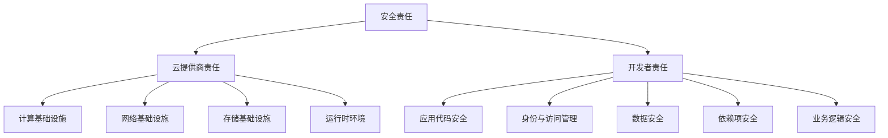
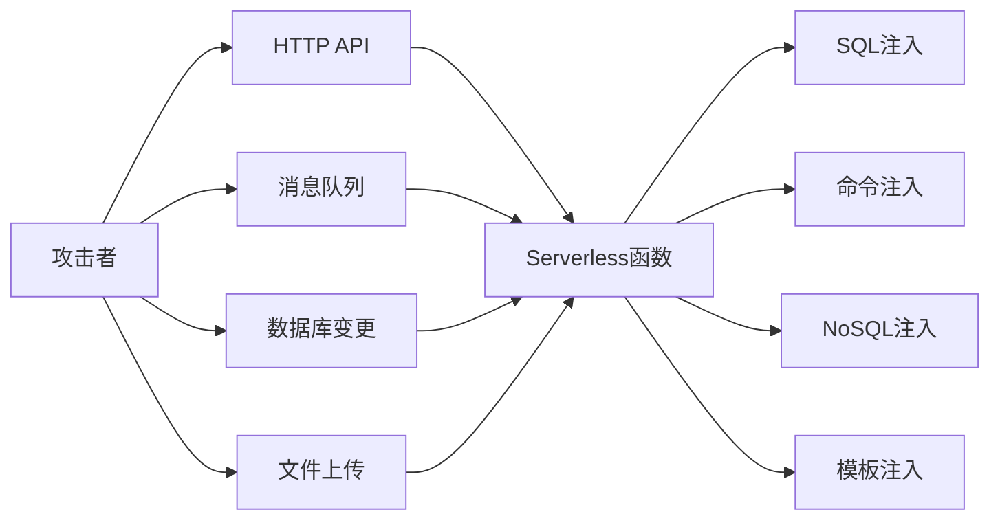
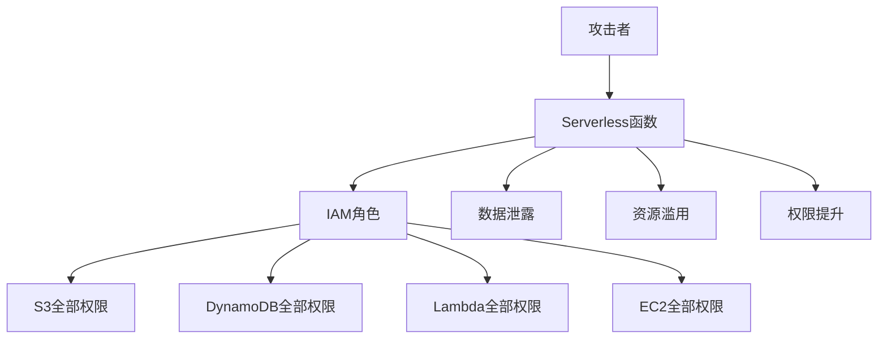
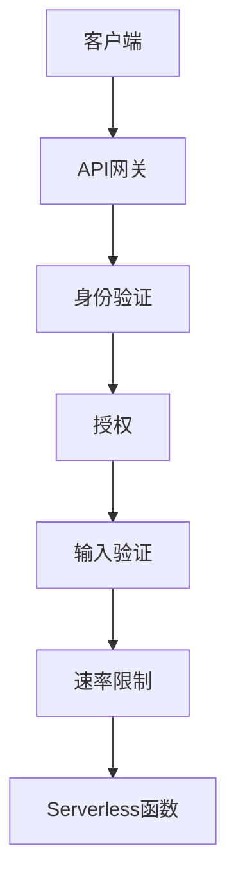
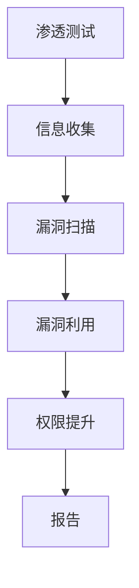

# Serverless安全最佳实践

Serverless架构带来了新的安全挑战和考量。本文将详细介绍Serverless环境下的安全威胁、防护策略和最佳实践，帮助构建安全可靠的Serverless应用。

## Serverless安全概述

Serverless架构通过消除服务器管理的负担，为开发者带来了诸多便利。然而，"无服务器"并不意味着"无需关注安全"。相反，Serverless环境引入了一系列独特的安全挑战，需要采用新的安全思维和实践。

### 传统应用与Serverless安全的区别

Serverless架构与传统应用在安全方面有显著差异：

| 安全方面 | 传统应用 | Serverless应用 |
|---------|---------|--------------|
| 基础设施安全 | 开发者负责服务器安全 | 云提供商负责底层安全 |
| 攻击面 | 较大且持久 | 较小但分散 |
| 执行环境 | 长期运行 | 短暂执行 |
| 安全边界 | 明确的网络边界 | 分散的函数边界 |
| 安全责任 | 全栈安全责任 | 共享安全责任 |

### 共享安全责任模型

在Serverless环境中，安全责任在云提供商和开发者之间共享：



云提供商负责底层基础设施的安全，而开发者则需要确保应用代码、配置和数据的安全。

## Serverless安全威胁与风险

了解Serverless环境中的主要安全威胁是制定有效防护策略的第一步。

### OWASP Serverless Top 10

OWASP（开放Web应用安全项目）发布了Serverless应用的十大安全风险：

1. **函数事件数据注入**：通过事件数据进行的注入攻击
2. **破损的身份验证**：身份验证机制实现不当
3. **不安全的第三方依赖**：使用存在漏洞的依赖项
4. **过度权限的IAM角色**：函数拥有超出需要的权限
5. **不足的监控和日志记录**：缺乏有效的安全监控
6. **不安全的密钥处理**：敏感信息管理不当
7. **业务逻辑缺陷和拒绝服务**：应用逻辑中的安全漏洞
8. **函数执行流被劫持**：攻击者控制函数执行流程
9. **不当的异常处理和详细错误消息**：泄露敏感信息
10. **跨函数共享资源**：不同函数间不安全的资源共享

### 函数事件数据注入

Serverless函数可以由多种事件触发，每种事件都可能成为注入攻击的载体：



示例：HTTP API触发的SQL注入

```javascript
// 不安全的实现
exports.handler = async (event) => {
  const userId = event.queryStringParameters.userId;
  
  // 直接使用用户输入构建SQL查询
  const query = `SELECT * FROM users WHERE id = ${userId}`;
  
  // 执行查询...
};
```

攻击者可以提供类似 `1 OR 1=1` 的输入，导致查询返回所有用户记录。

### 过度权限的IAM角色

Serverless函数通常通过IAM（身份和访问管理）角色获取对其他资源的访问权限。过度宽松的权限可能导致严重的安全风险：



过度权限的示例：

```yaml
# 过度宽松的IAM策略
{
  "Version": "2012-10-17",
  "Statement": [
    {
      "Effect": "Allow",
      "Action": "*",
      "Resource": "*"
    }
  ]
}
```

这种策略授予函数对所有AWS资源的完全访问权限，远超过大多数函数的实际需求。

## 安全防护策略

针对Serverless环境的安全威胁，以下是一系列有效的防护策略：

### 输入验证与净化

对所有函数输入进行严格验证和净化，防止注入攻击：

```javascript
// 使用验证库进行输入验证
const Joi = require('joi');

exports.handler = async (event) => {
  // 定义验证模式
  const schema = Joi.object({
    userId: Joi.number().integer().required(),
    action: Joi.string().valid('read', 'write', 'delete').required()
  });
  
  try {
    // 验证输入
    const { userId, action } = await schema.validateAsync({
      userId: event.queryStringParameters.userId,
      action: event.queryStringParameters.action
    });
    
    // 使用验证后的安全输入
    // ...
    
    return {
      statusCode: 200,
      body: JSON.stringify({ message: 'Success' })
    };
  } catch (error) {
    return {
      statusCode: 400,
      body: JSON.stringify({ message: 'Invalid input' })
    };
  }
};
```

对于SQL查询，使用参数化查询防止SQL注入：

```javascript
// 使用参数化查询
const mysql = require('mysql2/promise');

exports.handler = async (event) => {
  const userId = event.queryStringParameters.userId;
  
  const connection = await mysql.createConnection({
    host: process.env.DB_HOST,
    user: process.env.DB_USER,
    password: process.env.DB_PASSWORD,
    database: process.env.DB_NAME
  });
  
  // 使用参数化查询
  const [rows] = await connection.execute(
    'SELECT * FROM users WHERE id = ?',
    [userId]
  );
  
  await connection.end();
  
  return {
    statusCode: 200,
    body: JSON.stringify(rows)
  };
};
```

### 最小权限原则

为每个函数分配最小所需权限，减少潜在攻击面：

```yaml
# AWS SAM模板中的最小权限示例
Resources:
  ProcessPaymentFunction:
    Type: AWS::Serverless::Function
    Properties:
      Handler: index.handler
      Runtime: nodejs14.x
      Policies:
        - DynamoDBCrudPolicy:
            TableName: !Ref PaymentsTable
        - SQSSendMessagePolicy:
            QueueName: !GetAtt PaymentQueue.QueueName
```

这个示例仅授予函数对特定DynamoDB表的CRUD权限和向特定SQS队列发送消息的权限。

对于Azure Functions，使用托管身份和基于角色的访问控制(RBAC)：

```json
{
  "type": "Microsoft.Authorization/roleAssignments",
  "apiVersion": "2020-04-01-preview",
  "name": "[guid(resourceGroup().id, variables('functionAppName'), variables('storageBlobDataContributorRoleId'))]",
  "properties": {
    "roleDefinitionId": "[variables('storageBlobDataContributorRoleId')]",
    "principalId": "[reference(resourceId('Microsoft.Web/sites', variables('functionAppName')), '2019-08-01', 'Full').identity.principalId]",
    "scope": "[resourceId('Microsoft.Storage/storageAccounts', variables('storageAccountName'))]"
  },
  "dependsOn": [
    "[resourceId('Microsoft.Web/sites', variables('functionAppName'))]",
    "[resourceId('Microsoft.Storage/storageAccounts', variables('storageAccountName'))]"
  ]
}
```

### 安全密钥管理

使用专用的密钥管理服务存储和访问敏感信息：

```javascript
// AWS Secrets Manager示例
const AWS = require('aws-sdk');
const secretsManager = new AWS.SecretsManager();

exports.handler = async (event) => {
  try {
    // 获取密钥
    const secretData = await secretsManager.getSecretValue({
      SecretId: process.env.DB_SECRET_ID
    }).promise();
    
    // 解析密钥
    const secret = JSON.parse(secretData.SecretString);
    
    // 使用密钥
    const connection = await mysql.createConnection({
      host: secret.host,
      user: secret.username,
      password: secret.password,
      database: secret.dbname
    });
    
    // 执行数据库操作...
    
  } catch (error) {
    console.error('Error retrieving secret:', error);
    throw error;
  }
};
```

对于Azure Functions，使用Key Vault：

```javascript
const { DefaultAzureCredential } = require('@azure/identity');
const { SecretClient } = require('@azure/keyvault-secrets');

module.exports = async function (context, req) {
  // 使用托管身份访问Key Vault
  const credential = new DefaultAzureCredential();
  const vaultName = process.env.KEY_VAULT_NAME;
  const url = `https://${vaultName}.vault.azure.net`;
  
  const client = new SecretClient(url, credential);
  
  try {
    // 获取密钥
    const dbPasswordSecret = await client.getSecret('db-password');
    const apiKeySecret = await client.getSecret('api-key');
    
    // 使用密钥
    // ...
    
    context.res = {
      status: 200,
      body: { message: 'Success' }
    };
  } catch (error) {
    context.log.error('Error retrieving secrets:', error);
    context.res = {
      status: 500,
      body: { message: 'Internal server error' }
    };
  }
};
```

### 依赖项安全

定期扫描和更新依赖项，防止已知漏洞：

1. **使用依赖扫描工具**：集成npm audit、Snyk或OWASP Dependency-Check等工具

```bash
# 使用npm audit扫描依赖项
npm audit

# 使用Snyk扫描依赖项
snyk test

# 自动修复可修复的漏洞
npm audit fix
```

2. **在CI/CD流程中集成依赖扫描**：

```yaml
# GitHub Actions工作流示例
name: Security Scan

on:
  push:
    branches: [ main ]
  pull_request:
    branches: [ main ]
  schedule:
    - cron: '0 0 * * 0'  # 每周日运行

jobs:
  security:
    runs-on: ubuntu-latest
    steps:
      - uses: actions/checkout@v2
      - name: Setup Node.js
        uses: actions/setup-node@v2
        with:
          node-version: '14'
      - name: Install dependencies
        run: npm ci
      - name: Run security audit
        run: npm audit --audit-level=high
      - name: Run Snyk to check for vulnerabilities
        uses: snyk/actions/node@master
        env:
          SNYK_TOKEN: ${{ secrets.SNYK_TOKEN }}
```

3. **使用锁定文件固定依赖版本**：使用package-lock.json或yarn.lock确保依赖版本一致

### 安全监控与日志记录

实施全面的监控和日志记录，及时发现安全问题：

```javascript
// AWS Lambda中的结构化日志记录
const winston = require('winston');

// 创建日志记录器
const logger = winston.createLogger({
  level: process.env.LOG_LEVEL || 'info',
  format: winston.format.json(),
  defaultMeta: { service: 'user-service' },
  transports: [
    new winston.transports.Console()
  ]
});

exports.handler = async (event) => {
  // 记录请求信息（注意不要记录敏感数据）
  logger.info('Processing request', {
    requestId: event.requestContext?.requestId,
    path: event.path,
    method: event.httpMethod,
    sourceIp: event.requestContext?.identity?.sourceIp
  });
  
  try {
    // 业务逻辑...
    
    // 记录成功信息
    logger.info('Request processed successfully', {
      requestId: event.requestContext?.requestId,
      processingTime: Date.now() - startTime
    });
    
    return {
      statusCode: 200,
      body: JSON.stringify({ message: 'Success' })
    };
  } catch (error) {
    // 记录错误信息
    logger.error('Error processing request', {
      requestId: event.requestContext?.requestId,
      error: error.message,
      stack: error.stack
    });
    
    return {
      statusCode: 500,
      body: JSON.stringify({ message: 'Internal server error' })
    };
  }
};
```

配置云平台的安全监控服务：

1. **AWS CloudWatch Logs Insights**：分析日志模式
2. **AWS CloudTrail**：跟踪API调用
3. **Azure Monitor**：监控应用性能和安全
4. **Azure Security Center**：检测和响应安全威胁

### 安全的API设计

为Serverless API实施多层安全防护：



1. **使用API网关**：集中管理API安全

```yaml
# AWS SAM模板中的API网关配置
Resources:
  ApiGatewayApi:
    Type: AWS::Serverless::Api
    Properties:
      StageName: prod
      Auth:
        DefaultAuthorizer: CognitoAuthorizer
        Authorizers:
          CognitoAuthorizer:
            UserPoolArn: !GetAtt UserPool.Arn
      GatewayResponses:
        DEFAULT_4XX:
          ResponseTemplates:
            application/json: '{"message":"Client error"}'
        DEFAULT_5XX:
          ResponseTemplates:
            application/json: '{"message":"Server error"}'
```

2. **实施速率限制**：防止滥用和DoS攻击

```yaml
# API网关中的速率限制配置
Resources:
  ApiGatewayApi:
    Type: AWS::Serverless::Api
    Properties:
      StageName: prod
      MethodSettings:
        - ResourcePath: "/*"
          HttpMethod: "*"
          ThrottlingBurstLimit: 100
          ThrottlingRateLimit: 50
```

3. **使用CORS策略**：控制跨域资源访问

```yaml
# API网关中的CORS配置
Resources:
  ApiGatewayApi:
    Type: AWS::Serverless::Api
    Properties:
      StageName: prod
      Cors:
        AllowMethods: "'GET,POST,OPTIONS'"
        AllowHeaders: "'Content-Type,Authorization'"
        AllowOrigin: "'https://www.example.com'"
```

## 身份验证与授权

在Serverless应用中实施强大的身份验证和授权机制至关重要。

### 使用托管身份服务

利用云提供商的托管身份服务简化身份验证：

1. **AWS Cognito**：

```javascript
// 使用AWS Cognito验证JWT令牌
const jwt = require('jsonwebtoken');
const jwksClient = require('jwks-rsa');

// 初始化JWKS客户端
const client = jwksClient({
  jwksUri: `https://cognito-idp.${process.env.REGION}.amazonaws.com/${process.env.USER_POOL_ID}/.well-known/jwks.json`
});

// 获取签名密钥
function getSigningKey(kid) {
  return new Promise((resolve, reject) => {
    client.getSigningKey(kid, (err, key) => {
      if (err) return reject(err);
      resolve(key.getPublicKey());
    });
  });
}

// 验证令牌
async function verifyToken(token) {
  try {
    // 解码令牌头部获取kid
    const decoded = jwt.decode(token, { complete: true });
    if (!decoded || !decoded.header || !decoded.header.kid) {
      throw new Error('Invalid token');
    }
    
    // 获取签名密钥
    const key = await getSigningKey(decoded.header.kid);
    
    // 验证令牌
    return jwt.verify(token, key, {
      issuer: `https://cognito-idp.${process.env.REGION}.amazonaws.com/${process.env.USER_POOL_ID}`,
      audience: process.env.CLIENT_ID
    });
  } catch (error) {
    console.error('Token verification failed:', error);
    throw new Error('Authentication failed');
  }
}

exports.handler = async (event) => {
  try {
    // 从请求中提取令牌
    const token = event.headers.Authorization?.replace('Bearer ', '');
    if (!token) {
      return {
        statusCode: 401,
        body: JSON.stringify({ message: 'Missing authentication token' })
      };
    }
    
    // 验证令牌
    const user = await verifyToken(token);
    
    // 处理授权业务逻辑
    // ...
    
    return {
      statusCode: 200,
      body: JSON.stringify({ message: 'Authorized' })
    };
  } catch (error) {
    return {
      statusCode: 401,
      body: JSON.stringify({ message: error.message })
    };
  }
};
```

2. **Azure AD B2C**：

```javascript
const { BearerStrategy } = require('passport-azure-ad');
const passport = require('passport');

module.exports = function (context, req) {
  // 配置Azure AD B2C策略
  const bearerStrategy = new BearerStrategy({
    identityMetadata: `https://${process.env.TENANT_NAME}.b2clogin.com/${process.env.TENANT_NAME}.onmicrosoft.com/${process.env.POLICY_NAME}/v2.0/.well-known/openid-configuration`,
    clientID: process.env.CLIENT_ID,
    audience: process.env.CLIENT_ID,
    issuer: `https://${process.env.TENANT_NAME}.b2clogin.com/${process.env.TENANT_ID}/v2.0/`,
    validateIssuer: true,
    passReqToCallback: false
  }, (token, done) => {
    return done(null, token);
  });
  
  // 使用Passport验证请求
  passport.use(bearerStrategy);
  
  // 验证令牌
  passport.authenticate('oauth-bearer', { session: false }, (err, user, info) => {
    if (err) {
      context.res = {
        status: 500,
        body: { message: 'Internal server error' }
      };
      context.done();
      return;
    }
    
    if (!user) {
      context.res = {
        status: 401,
        body: { message: 'Unauthorized' }
      };
      context.done();
      return;
    }
    
    // 用户已验证，处理请求
    // ...
    
    context.res = {
      status: 200,
      body: { message: 'Authorized' }
    };
    context.done();
  })(req);
};
```

### 细粒度访问控制

实施基于属性的访问控制(ABAC)或基于角色的访问控制(RBAC)：

```javascript
// 基于角色的访问控制示例
function checkPermission(user, resource, action) {
  // 获取用户角色
  const roles = user['cognito:groups'] || [];
  
  // 定义权限矩阵
  const permissions = {
    admin: {
      users: ['read', 'write', 'delete'],
      orders: ['read', 'write', 'delete'],
      reports: ['read', 'write', 'delete']
    },
    manager: {
      users: ['read'],
      orders: ['read', 'write'],
      reports: ['read', 'write']
    },
    user: {
      users: ['read'],
      orders: ['read'],
      reports: ['read']
    }
  };
  
  // 检查是否有任何角色允许该操作
  return roles.some(role => {
    const rolePermissions = permissions[role] || {};
    const resourcePermissions = rolePermissions[resource] || [];
    return resourcePermissions.includes(action);
  });
}

exports.handler = async (event) => {
  try {
    // 验证用户身份
    const user = await verifyToken(event.headers.Authorization);
    
    // 从请求中提取资源和操作
    const resource = event.pathParameters.resource;
    const action = event.httpMethod.toLowerCase();
    
    // 检查权限
    if (!checkPermission(user, resource, action)) {
      return {
        statusCode: 403,
        body: JSON.stringify({ message: 'Permission denied' })
      };
    }
    
    // 处理授权请求
    // ...
    
    return {
      statusCode: 200,
      body: JSON.stringify({ message: 'Operation successful' })
    };
  } catch (error) {
    return {
      statusCode: 401,
      body: JSON.stringify({ message: error.message })
    };
  }
};
```

## 数据安全

保护Serverless应用中的数据安全是一项关键任务。

### 数据加密

实施全面的数据加密策略：

1. **传输中加密**：使用HTTPS/TLS保护数据传输

```yaml
# API网关中启用HTTPS
Resources:
  ApiGatewayApi:
    Type: AWS::Serverless::Api
    Properties:
      StageName: prod
      Domain:
        DomainName: api.example.com
        CertificateArn: !Ref CertificateArn
        EndpointConfiguration: EDGE
        Route53:
          HostedZoneId: !Ref HostedZoneId
```

2. **静态数据加密**：加密存储的敏感数据

```javascript
// 使用AWS KMS加密数据
const AWS = require('aws-sdk');
const kms = new AWS.KMS();

async function encryptData(plaintext) {
  const params = {
    KeyId: process.env.KMS_KEY_ID,
    Plaintext: Buffer.from(plaintext)
  };
  
  const result = await kms.encrypt(params).promise();
  return result.CiphertextBlob.toString('base64');
}

async function decryptData(ciphertext) {
  const params = {
    CiphertextBlob: Buffer.from(ciphertext, 'base64')
  };
  
  const result = await kms.decrypt(params).promise();
  return result.Plaintext.toString();
}

exports.handler = async (event) => {
  // 加密敏感数据
  const sensitiveData = {
    creditCard: '1234-5678-9012-3456',
    ssn: '123-45-6789'
  };
  
  const encryptedData = await encryptData(JSON.stringify(sensitiveData));
  
  // 存储加密数据
  await dynamoDB.put({
    TableName: 'UserData',
    Item: {
      userId: event.userId,
      encryptedInfo: encryptedData
    }
  }).promise();
  
  return {
    statusCode: 200,
    body: JSON.stringify({ message: 'Data stored securely' })
  };
};
```

3. **应用层加密**：在应用层实施额外加密

```javascript
// 使用Node.js crypto模块进行应用层加密
const crypto = require('crypto');

// 加密函数
function encrypt(text, masterKey) {
  // 生成随机初始化向量
  const iv = crypto.randomBytes(16);
  
  // 创建加密器
  const cipher = crypto.createCipheriv(
    'aes-256-gcm',
    Buffer.from(masterKey, 'hex'),
    iv
  );
  
  // 加密数据
  let encrypted = cipher.update(text, 'utf8', 'hex');
  encrypted += cipher.final('hex');
  
  // 获取认证标签
  const authTag = cipher.getAuthTag().toString('hex');
  
  // 返回加密结果
  return {
    iv: iv.toString('hex'),
    encrypted,
    authTag
  };
}

// 解密函数
function decrypt(encryptedData, masterKey) {
  const { iv, encrypted, authTag } = encryptedData;
  
  // 创建解密器
  const decipher = crypto.createDecipheriv(
    'aes-256-gcm',
    Buffer.from(masterKey, 'hex'),
    Buffer.from(iv, 'hex')
  );
  
  // 设置认证标签
  decipher.setAuthTag(Buffer.from(authTag, 'hex'));
  
  // 解密数据
  let decrypted = decipher.update(encrypted, 'hex', 'utf8');
  decrypted += decipher.final('utf8');
  
  return decrypted;
}
```

### 数据隔离

确保不同租户或用户的数据得到适当隔离：

1. **使用分区键**：在数据库设计中使用租户ID或用户ID作为分区键

```javascript
// DynamoDB中的数据隔离示例
async function getUserData(userId, tenantId) {
  const params = {
    TableName: 'UserData',
    Key: {
      tenantId: tenantId,
      userId: userId
    }
  };
  
  const result = await dynamoDB.get(params).promise();
  return result.Item;
}

// 确保用户只能访问自己的数据
exports.handler = async (event) => {
  // 从令牌中获取用户ID和租户ID
  const user = await verifyToken(event.headers.Authorization);
  const requestedUserId = event.pathParameters.userId;
  
  // 验证用户是否有权访问请求的数据
  if (user.sub !== requestedUserId && !isAdmin(user)) {
    return {
      statusCode: 403,
      body: JSON.stringify({ message: 'Access denied' })
    };
  }
  
  // 获取用户数据
  const userData = await getUserData(requestedUserId, user.tenantId);
  
  return {
    statusCode: 200,
    body: JSON.stringify(userData)
  };
};
```

2. **使用行级安全性**：在数据库层实施访问控制

```sql
-- PostgreSQL行级安全性示例
CREATE TABLE user_data (
  id SERIAL PRIMARY KEY,
  user_id TEXT NOT NULL,
  tenant_id TEXT NOT NULL,
  data JSONB NOT NULL
);

-- 创建行级安全策略
ALTER TABLE user_data ENABLE ROW LEVEL SECURITY;

-- 创建策略：用户只能访问自己的数据
CREATE POLICY user_isolation ON user_data
  USING (user_id = current_setting('app.user_id')::TEXT);

-- 创建策略：管理员可以访问同一租户的所有数据
CREATE POLICY admin_tenant_access ON user_data
  USING (tenant_id = current_setting('app.tenant_id')::TEXT)
  TO admin_role;
```

## 安全测试与审计

定期进行安全测试和审计是确保Serverless应用安全的关键步骤。

### 安全测试策略

实施全面的安全测试策略：

1. **静态应用安全测试(SAST)**：分析源代码查找安全漏洞

```bash
# 使用ESLint进行安全静态分析
npm install eslint eslint-plugin-security

# .eslintrc.json配置
{
  "plugins": ["security"],
  "extends": ["plugin:security/recommended"]
}
继续完成安全测试与审计部分：

```bash
# 运行ESLint安全检查
npx eslint --ext .js,.ts src/
```

2. **动态应用安全测试(DAST)**：测试运行中的应用查找漏洞

```bash
# 使用OWASP ZAP进行API安全测试
docker run -t owasp/zap2docker-stable zap-api-scan.py -t https://api.example.com/openapi.json -f openapi
```

3. **依赖扫描**：检查第三方依赖中的已知漏洞

```bash
# 使用OWASP依赖检查
npm install -g dependency-check
dependency-check --project "My Project" --scan node_modules
```

4. **基础设施即代码(IaC)扫描**：检查基础设施配置中的安全问题

```bash
# 使用cfn-nag扫描CloudFormation模板
gem install cfn-nag
cfn_nag_scan --input-path template.yaml
```

5. **渗透测试**：模拟攻击者行为测试应用安全性



### 安全审计与合规

实施持续的安全审计和合规检查：

1. **日志审计**：定期审查安全日志

```javascript
// 创建日志审计函数
exports.auditLogHandler = async (event) => {
  // 处理CloudWatch Logs事件
  const logEvents = event.awslogs.data
    ? JSON.parse(Buffer.from(event.awslogs.data, 'base64').toString())
    : { logEvents: [] };
  
  // 分析日志事件
  for (const logEvent of logEvents.logEvents) {
    try {
      const logData = JSON.parse(logEvent.message);
      
      // 检测可疑活动
      if (logData.statusCode >= 400) {
        // 记录失败的API调用
        await recordSecurityEvent({
          type: 'API_FAILURE',
          timestamp: logEvent.timestamp,
          sourceIp: logData.sourceIp,
          path: logData.path,
          statusCode: logData.statusCode,
          userId: logData.userId
        });
      }
      
      // 检测异常访问模式
      if (logData.responseTime > 5000) {
        // 记录异常响应时间
        await recordSecurityEvent({
          type: 'SLOW_RESPONSE',
          timestamp: logEvent.timestamp,
          sourceIp: logData.sourceIp,
          path: logData.path,
          responseTime: logData.responseTime
        });
      }
      
      // 检测权限变更
      if (logData.action === 'PERMISSION_CHANGE') {
        await recordSecurityEvent({
          type: 'PERMISSION_CHANGE',
          timestamp: logEvent.timestamp,
          userId: logData.userId,
          resource: logData.resource,
          oldPermission: logData.oldPermission,
          newPermission: logData.newPermission
        });
      }
    } catch (error) {
      console.error('Error processing log event:', error);
    }
  }
};
```

2. **合规检查**：确保应用符合相关法规和标准

```yaml
# AWS Config规则示例
Resources:
  S3BucketServerSideEncryptionEnabled:
    Type: AWS::Config::ConfigRule
    Properties:
      ConfigRuleName: s3-bucket-server-side-encryption-enabled
      Description: 检查S3存储桶是否启用了服务器端加密
      Source:
        Owner: AWS
        SourceIdentifier: S3_BUCKET_SERVER_SIDE_ENCRYPTION_ENABLED
  
  IAMUserMFAEnabled:
    Type: AWS::Config::ConfigRule
    Properties:
      ConfigRuleName: iam-user-mfa-enabled
      Description: 检查IAM用户是否启用了MFA
      Source:
        Owner: AWS
        SourceIdentifier: IAM_USER_MFA_ENABLED
```

## Serverless安全最佳实践

总结Serverless应用的安全最佳实践：

### 开发阶段最佳实践

1. **安全编码**：
   - 遵循安全编码标准
   - 使用安全的编程模式
   - 实施代码审查

2. **依赖管理**：
   - 使用锁定文件固定依赖版本
   - 定期更新依赖
   - 使用私有依赖仓库

3. **安全测试**：
   - 集成自动化安全测试
   - 进行代码安全审查
   - 实施持续安全测试

### 部署阶段最佳实践

1. **安全配置**：
   - 使用基础设施即代码(IaC)
   - 实施配置验证
   - 使用安全参数

2. **CI/CD安全**：
   - 保护CI/CD管道
   - 实施部署前安全检查
   - 使用不可变部署

```yaml
# GitLab CI/CD中的安全检查示例
stages:
  - test
  - security
  - build
  - deploy

security_scan:
  stage: security
  script:
    - npm audit
    - npx eslint --ext .js,.ts src/
    - npx snyk test
  only:
    - main
    - merge_requests
```

### 运行时最佳实践

1. **监控与检测**：
   - 实施实时安全监控
   - 配置异常检测
   - 设置安全警报

2. **事件响应**：
   - 制定安全事件响应计划
   - 实施自动化响应
   - 定期演练响应流程

```javascript
// 自动响应可疑活动
exports.securityResponseHandler = async (event) => {
  // 处理安全事件
  const securityEvent = JSON.parse(event.Records[0].Sns.Message);
  
  // 根据事件类型采取不同响应
  switch (securityEvent.type) {
    case 'BRUTE_FORCE_ATTEMPT':
      // 暂时阻止可疑IP
      await blockSuspiciousIp(securityEvent.sourceIp, 30); // 阻止30分钟
      break;
      
    case 'UNUSUAL_ACCESS_PATTERN':
      // 记录异常并通知安全团队
      await notifySecurityTeam(securityEvent);
      break;
      
    case 'DATA_EXFILTRATION_ATTEMPT':
      // 立即阻止访问并触发详细调查
      await blockUserAccess(securityEvent.userId);
      await initiateSecurityInvestigation(securityEvent);
      break;
      
    default:
      // 记录未知事件类型
      console.log('Unknown security event type:', securityEvent.type);
  }
};
```

## 安全合规与法规

Serverless应用需要遵守各种安全合规标准和法规：

### 常见合规标准

1. **PCI DSS**：支付卡行业数据安全标准
   - 保护持卡人数据
   - 实施强访问控制
   - 定期监控和测试网络

2. **HIPAA**：健康保险可携性和责任法案
   - 保护健康信息
   - 实施技术保障措施
   - 维护审计跟踪

3. **GDPR**：通用数据保护条例
   - 数据处理合法性
   - 数据主体权利
   - 数据保护设计

### 合规实施策略

1. **数据分类**：识别和分类敏感数据

```javascript
// 数据分类示例
function classifyData(data) {
  // 定义敏感数据模式
  const patterns = {
    PII: {
      ssn: /\d{3}-\d{2}-\d{4}/,
      creditCard: /\d{4}-\d{4}-\d{4}-\d{4}/,
      email: /[a-zA-Z0-9._%+-]+@[a-zA-Z0-9.-]+\.[a-zA-Z]{2,}/
    },
    PHI: {
      medicalRecordNumber: /MRN-\d{10}/,
      diagnosis: /diagnosis|condition|treatment/i
    },
    FINANCIAL: {
      accountNumber: /ACCT-\d{10}/,
      routingNumber: /\d{9}/
    }
  };
  
  // 检查数据匹配模式
  const classifications = [];
  
  for (const category in patterns) {
    for (const type in patterns[category]) {
      if (patterns[category][type].test(JSON.stringify(data))) {
        classifications.push({ category, type });
      }
    }
  }
  
  return classifications;
}

// 在处理数据前进行分类
exports.handler = async (event) => {
  const data = JSON.parse(event.body);
  
  // 分类数据
  const classifications = classifyData(data);
  
  // 根据分类应用不同的安全控制
  if (classifications.some(c => c.category === 'PII' || c.category === 'PHI')) {
    // 应用更严格的安全控制
    await applyEnhancedSecurity(data, classifications);
  }
  
  // 处理请求...
};
```

2. **合规性文档**：维护合规性文档和证据

```javascript
// 自动生成合规性报告
exports.generateComplianceReport = async (event) => {
  // 获取时间范围
  const startDate = new Date(event.startDate || new Date().setDate(new Date().getDate() - 30));
  const endDate = new Date(event.endDate || new Date());
  
  // 收集合规性数据
  const complianceData = {
    accessControls: await getAccessControlAuditLogs(startDate, endDate),
    dataEncryption: await getEncryptionStatus(),
    securityIncidents: await getSecurityIncidents(startDate, endDate),
    vulnerabilityScans: await getVulnerabilityScans(startDate, endDate),
    patchStatus: await getPatchStatus(),
    userActivity: await getUserActivityLogs(startDate, endDate)
  };
  
  // 生成报告
  const report = generateReportDocument(complianceData);
  
  // 存储报告
  const reportKey = `compliance-reports/${startDate.toISOString()}-${endDate.toISOString()}.pdf`;
  await s3.putObject({
    Bucket: process.env.REPORTS_BUCKET,
    Key: reportKey,
    Body: report,
    ContentType: 'application/pdf',
    Metadata: {
      'report-type': 'compliance',
      'start-date': startDate.toISOString(),
      'end-date': endDate.toISOString()
    }
  }).promise();
  
  return {
    statusCode: 200,
    body: JSON.stringify({
      message: 'Compliance report generated successfully',
      reportUrl: `s3://${process.env.REPORTS_BUCKET}/${reportKey}`
    })
  };
};
```

## 结论

Serverless架构为开发者提供了巨大的便利，但也带来了独特的安全挑战。通过实施本文介绍的安全最佳实践，开发者可以构建既高效又安全的Serverless应用。

关键要点总结：

1. **了解共享责任模型**：明确云提供商和开发者各自的安全责任
2. **实施深度防御**：在应用的各个层面实施安全控制
3. **遵循最小权限原则**：为函数分配最小所需权限
4. **保护敏感数据**：实施全面的数据加密和保护策略
5. **持续监控与改进**：实施安全监控并持续改进安全措施

通过将安全考虑融入Serverless应用的设计、开发和运维的每个阶段，开发者可以充分利用Serverless架构的优势，同时有效管理其安全风险。