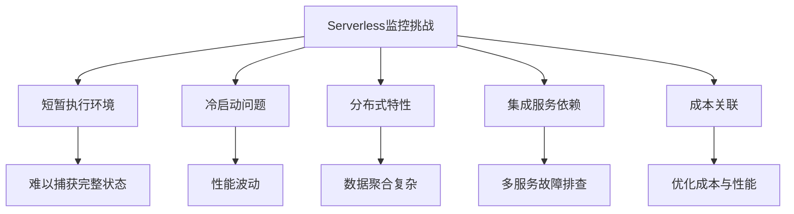
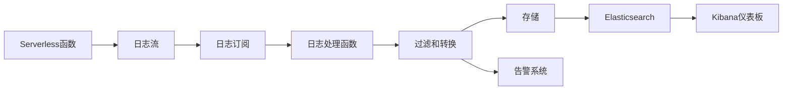
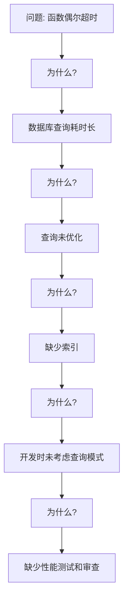
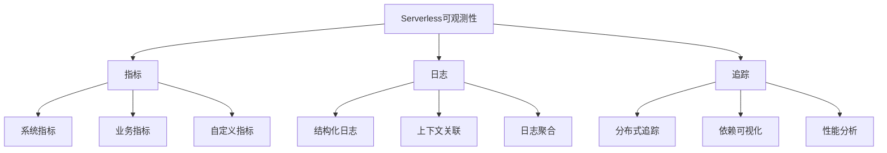
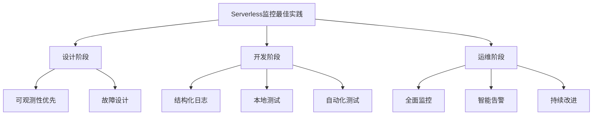

# Serverless监控与调试

Serverless应用的监控和调试具有特殊性和挑战性。本文将详细介绍Serverless环境下的监控策略、日志管理、调试技术和问题排查方法。

## Serverless监控的特殊性

Serverless架构与传统应用在监控方面有显著差异，理解这些差异是实施有效监控的基础。

### 传统应用 vs Serverless监控

| 特性 | 传统应用 | Serverless应用 |
|-----|---------|--------------|
| 运行环境 | 持续运行的服务器 | 短暂的函数实例 |
| 可见性 | 完全访问底层基础设施 | 有限的基础设施可见性 |
| 监控范围 | 主要关注服务器指标 | 关注函数执行和集成服务 |
| 调试方式 | 可直接访问运行环境 | 间接调试，依赖日志和跟踪 |
| 性能分析 | 可使用本地分析工具 | 需要云原生或专用工具 |

### Serverless监控的关键挑战

1. **短暂的执行环境**：函数实例可能只存在几毫秒到几分钟，难以捕获完整状态
2. **冷启动问题**：需要特别监控冷启动延迟及其影响
3. **分布式特性**：函数可能在多个实例上并行执行，需要聚合监控数据
4. **集成服务依赖**：需要监控与多个服务的集成点
5. **成本关联**：监控需要与资源使用和成本直接关联



## 全面的监控策略

有效的Serverless监控策略应覆盖多个维度，确保应用的可靠性、性能和成本效益。

### 关键监控指标

#### 1. 执行指标

* **调用次数**：函数被触发的频率
* **执行持续时间**：函数执行所需时间
* **内存使用**：函数使用的内存量
* **冷启动频率**：冷启动发生的次数
* **冷启动延迟**：冷启动引起的额外延迟
* **并发执行**：同时运行的函数实例数

#### 2. 错误指标

* **错误率**：函数执行失败的百分比
* **超时次数**：函数执行超时的次数
* **节流次数**：因并发限制被节流的请求数
* **错误类型分布**：不同类型错误的分布情况

#### 3. 集成服务指标

* **API网关延迟**：API请求的处理时间
* **数据库操作延迟**：数据库查询和写入时间
* **第三方API调用延迟**：外部服务调用的响应时间
* **消息队列延迟**：消息处理的延迟时间

#### 4. 业务指标

* **业务事务完成率**：成功完成的业务事务百分比
* **端到端延迟**：从请求到响应的总时间
* **用户体验指标**：如页面加载时间、API响应时间

### 监控工具与服务

#### 云提供商原生工具

**AWS监控工具**：

* **CloudWatch**：AWS的主要监控服务
  * 收集和跟踪指标
  * 设置警报和自动化操作
  * 日志聚合和分析

```javascript
// 使用AWS SDK发布自定义指标
const AWS = require('aws-sdk');
const cloudwatch = new AWS.CloudWatch();

exports.handler = async (event) => {
  const startTime = Date.now();
  
  try {
    // 函数主要逻辑
    const result = await processData(event);
    
    // 记录处理时间
    const processingTime = Date.now() - startTime;
    
    // 发布自定义指标
    await cloudwatch.putMetricData({
      Namespace: 'MyApplication',
      MetricData: [
        {
          MetricName: 'ProcessingTime',
          Dimensions: [
            {
              Name: 'FunctionName',
              Value: process.env.AWS_LAMBDA_FUNCTION_NAME
            },
            {
              Name: 'Environment',
              Value: process.env.ENVIRONMENT
            }
          ],
          Value: processingTime,
          Unit: 'Milliseconds'
        },
        {
          MetricName: 'SuccessfulExecution',
          Dimensions: [
            {
              Name: 'FunctionName',
              Value: process.env.AWS_LAMBDA_FUNCTION_NAME
            }
          ],
          Value: 1,
          Unit: 'Count'
        }
      ]
    }).promise();
    
    return result;
  } catch (error) {
    // 发布错误指标
    await cloudwatch.putMetricData({
      Namespace: 'MyApplication',
      MetricData: [
        {
          MetricName: 'ExecutionError',
          Dimensions: [
            {
              Name: 'FunctionName',
              Value: process.env.AWS_LAMBDA_FUNCTION_NAME
            },
            {
              Name: 'ErrorType',
              Value: error.name
            }
          ],
          Value: 1,
          Unit: 'Count'
        }
      ]
    }).promise();
    
    throw error;
  }
};
```

* **X-Ray**：分布式追踪服务
  * 跟踪请求通过应用的路径
  * 识别性能瓶颈
  * 可视化服务依赖关系

```javascript
// 使用AWS X-Ray进行分布式追踪
const AWSXRay = require('aws-xray-sdk-core');
const AWS = AWSXRay.captureAWS(require('aws-sdk'));
const dynamoDB = new AWS.DynamoDB.DocumentClient();

exports.handler = async (event) => {
  // 创建新的分段
  const segment = AWSXRay.getSegment();
  const subsegment = segment.addNewSubsegment('processData');
  
  try {
    // 添加注释和元数据
    subsegment.addAnnotation('userId', event.userId);
    subsegment.addMetadata('payload', event);
    
    // 数据库操作（自动被X-Ray跟踪）
    const result = await dynamoDB.get({
      TableName: 'Users',
      Key: { id: event.userId }
    }).promise();
    
    // 处理业务逻辑
    const processedData = processUserData(result.Item);
    
    subsegment.close();
    return processedData;
  } catch (error) {
    subsegment.addError(error);
    subsegment.close();
    throw error;
  }
};
```

**Azure监控工具**：

* **Application Insights**：
  * 应用性能监控
  * 自动检测性能异常
  * 分布式追踪

```javascript
// Azure Functions中使用Application Insights
const appInsights = require('applicationinsights');
appInsights.setup().start();
const client = appInsights.defaultClient;

module.exports = async function (context, req) {
  const startTime = Date.now();
  
  try {
    // 记录请求遥测
    client.trackRequest({
      name: "ProcessUserData",
      url: req.url,
      duration: 0,
      resultCode: 200,
      success: true,
      properties: {
        userId: req.query.userId
      }
    });
    
    // 函数主要逻辑
    const result = await processUserData(req.query.userId);
    
    // 记录自定义指标
    client.trackMetric({
      name: "ProcessingTime",
      value: Date.now() - startTime
    });
    
    context.res = {
      status: 200,
      body: result
    };
  } catch (error) {
    // 记录异常
    client.trackException({
      exception: error,
      properties: {
        userId: req.query.userId,
        functionName: context.executionContext.functionName
      }
    });
    
    context.res = {
      status: 500,
      body: { error: "Processing failed" }
    };
  }
};
```

* **Azure Monitor**：
  * 全面的监控解决方案
  * 指标收集和警报
  * 日志分析

**Google Cloud监控工具**：

* **Cloud Monitoring**：
  * 性能监控和警报
  * 自定义仪表板
  * 上采样策略

* **Cloud Trace**：
  * 分布式追踪
  * 延迟分析
  * 性能瓶颈识别

#### 第三方监控工具

* **Datadog**：全面的监控平台，特别适合混合云环境
* **New Relic**：提供深入的性能监控和分析
* **Epsagon**：专为Serverless和微服务设计的监控工具
* **Lumigo**：专注于Serverless应用的调试和监控
* **Thundra**：提供Serverless应用的可观测性和安全性

```javascript
// 使用Datadog监控Lambda函数
const tracer = require('dd-trace').init();
const { DatadogLambdaHandler } = require('datadog-lambda-js');

// 包装Lambda处理程序
exports.handler = DatadogLambdaHandler.datadog(
  async (event, context) => {
    // 创建自定义span
    const span = tracer.startSpan('process.data');
    
    try {
      // 添加标签
      span.setTag('user.id', event.userId);
      
      // 函数主要逻辑
      const result = await processData(event);
      
      // 结束span
      span.finish();
      
      return result;
    } catch (error) {
      // 记录错误并结束span
      span.setTag('error', error);
      span.finish();
      throw error;
    }
  }
);
```

### 自定义监控解决方案

有时云提供商原生工具和第三方服务可能无法满足特定需求，此时可以构建自定义监控解决方案：

```javascript
// 自定义监控中间件
const monitoringMiddleware = (handler) => {
  return async (event, context) => {
    const requestId = context.awsRequestId;
    const startTime = Date.now();
    const metadata = {
      functionName: context.functionName,
      functionVersion: context.functionVersion,
      memoryLimitInMB: context.memoryLimitInMB,
      awsRequestId: requestId,
      event: JSON.stringify(event)
    };
    
    console.log(`REQUEST_START: ${JSON.stringify(metadata)}`);
    
    try {
      // 监控内存使用
      const memoryUsageInterval = setInterval(() => {
        const memoryUsage = process.memoryUsage();
        console.log(`MEMORY_USAGE: ${JSON.stringify({
          requestId,
          rss: memoryUsage.rss / 1024 / 1024, // MB
          heapTotal: memoryUsage.heapTotal / 1024 / 1024, // MB
          heapUsed: memoryUsage.heapUsed / 1024 / 1024, // MB
          external: memoryUsage.external / 1024 / 1024 // MB
        })}`);
      }, 100);
      
      // 执行原始处理程序
      const result = await handler(event, context);
      
      // 清理监控
      clearInterval(memoryUsageInterval);
      
      // 记录执行结果
      console.log(`REQUEST_END: ${JSON.stringify({
        requestId,
        duration: Date.now() - startTime,
        status: 'success'
      })}`);
      
      return result;
    } catch (error) {
      // 清理监控
      clearInterval(memoryUsageInterval);
      
      // 记录错误
      console.log(`REQUEST_ERROR: ${JSON.stringify({
        requestId,
        duration: Date.now() - startTime,
        errorName: error.name,
        errorMessage: error.message,
        stackTrace: error.stack
      })}`);
      
      throw error;
    }
  };
};

// 使用监控中间件
exports.handler = monitoringMiddleware(async (event, context) => {
  // 函数主要逻辑
  return processData(event);
});
```

## 高效的日志管理

日志是Serverless应用调试和监控的核心，有效的日志管理策略至关重要。

### 结构化日志记录

使用结构化日志格式（如JSON）可以大大提高日志的可搜索性和分析价值：

```javascript
// 结构化日志记录
const logger = {
  info: (message, data = {}) => {
    console.log(JSON.stringify({
      level: 'INFO',
      timestamp: new Date().toISOString(),
      message,
      ...data
    }));
  },
  
  error: (message, error, data = {}) => {
    console.error(JSON.stringify({
      level: 'ERROR',
      timestamp: new Date().toISOString(),
      message,
      errorName: error.name,
      errorMessage: error.message,
      stackTrace: error.stack,
      ...data
    }));
  },
  
  warn: (message, data = {}) => {
    console.warn(JSON.stringify({
      level: 'WARN',
      timestamp: new Date().toISOString(),
      message,
      ...data
    }));
  },
  
  debug: (message, data = {}) => {
    if (process.env.LOG_LEVEL === 'DEBUG') {
      console.debug(JSON.stringify({
        level: 'DEBUG',
        timestamp: new Date().toISOString(),
        message,
        ...data
      }));
    }
  }
};

// 使用结构化日志记录器
exports.handler = async (event) => {
  logger.info('Function invoked', { event });
  
  try {
    // 处理业务逻辑
    const userId = event.pathParameters.userId;
    logger.debug('Processing user data', { userId });
    
    const userData = await getUserData(userId);
    
    if (!userData) {
      logger.warn('User not found', { userId });
      return {
        statusCode: 404,
        body: JSON.stringify({ message: 'User not found' })
      };
    }
    
    logger.info('User data retrieved successfully', { userId });
    return {
      statusCode: 200,
      body: JSON.stringify(userData)
    };
  } catch (error) {
    logger.error('Error processing request', error, { event });
    return {
      statusCode: 500,
      body: JSON.stringify({ message: 'Internal server error' })
    };
  }
};
```

### 日志级别策略

实施合理的日志级别策略，平衡信息详细度和成本：

| 日志级别 | 使用场景 | 示例 |
|---------|---------|------|
| ERROR | 影响功能的错误 | 数据库连接失败、API调用异常 |
| WARN | 潜在问题但不影响功能 | 性能下降、重试操作 |
| INFO | 重要操作和事件 | 函数调用开始/结束、业务事件 |
| DEBUG | 详细调试信息 | 变量值、中间状态、详细流程 |
| TRACE | 最详细的诊断信息 | 仅在深度调试时使用 |

```javascript
// 根据环境设置日志级别
const LOG_LEVELS = {
  ERROR: 0,
  WARN: 1,
  INFO: 2,
  DEBUG: 3,
  TRACE: 4
};

const currentLogLevel = LOG_LEVELS[process.env.LOG_LEVEL || 'INFO'];

function log(level, message, data = {}) {
  if (LOG_LEVELS[level] <= currentLogLevel) {
    console.log(JSON.stringify({
      level,
      timestamp: new Date().toISOString(),
      message,
      ...data
    }));
  }
}
```

### 日志聚合与分析

将分散的函数日志聚合到中央系统进行分析：

1. **使用云提供商的日志服务**：
   * AWS CloudWatch Logs
   * Azure Log Analytics
   * Google Cloud Logging

2. **第三方日志管理工具**：
   * ELK Stack (Elasticsearch, Logstash, Kibana)
   * Splunk
   * Sumo Logic
   * Datadog Logs

3. **自定义日志处理管道**：



AWS示例：设置CloudWatch Logs订阅过滤器将日志发送到Elasticsearch

```yaml
# CloudFormation模板片段
Resources:
  LogsToElasticsearchLambda:
    Type: AWS::Serverless::Function
    Properties:
      Handler: index.handler
      Runtime: nodejs14.x
      Policies:
        - ElasticsearchHttpPostPolicy: 
            DomainName: !Ref ElasticsearchDomain
      Environment:
        Variables:
          ES_ENDPOINT: !GetAtt ElasticsearchDomain.DomainEndpoint
  
  LogsSubscriptionFilter:
    Type: AWS::Logs::SubscriptionFilter
    Properties:
      LogGroupName: !Ref FunctionLogGroup
      FilterPattern: ""  # 捕获所有日志
      DestinationArn: !GetAtt LogsToElasticsearchLambda.Arn
```

### 避免常见日志陷阱

1. **过度日志记录**：记录过多信息会增加成本并降低有用信息的可见性
2. **记录敏感信息**：避免记录密码、令牌等敏感数据
3. **非结构化日志**：难以搜索和分析
4. **缺少上下文**：确保日志包含足够上下文（请求ID、用户ID等）
5. **忽略日志成本**：日志存储和分析会产生额外成本

```javascript
// 敏感数据过滤示例
function sanitizeData(data) {
  const sensitiveFields = ['password', 'token', 'creditCard', 'ssn'];
  const sanitized = { ...data };
  
  for (const field of sensitiveFields) {
    if (sanitized[field]) {
      sanitized[field] = '***REDACTED***';
    }
  }
  
  return sanitized;
}

// 使用过滤后的数据记录日志
logger.info('User data', sanitizeData(userData));
```

## Serverless调试技术

Serverless环境的调试具有特殊挑战，需要采用专门的技术和工具。

### 本地调试

在部署前在本地环境调试Serverless函数可以大大提高开发效率：

#### 模拟Serverless环境

使用模拟工具创建本地Serverless环境：

1. **AWS SAM CLI**：模拟AWS Lambda和API Gateway

```bash
# 安装AWS SAM CLI
npm install -g aws-sam-cli

# 使用SAM本地调用函数
sam local invoke -e event.json MyFunction

# 启动本地API Gateway
sam local start-api
```

2. **Serverless Framework**：支持多个云提供商的本地调试

```bash
# 安装Serverless Framework
npm install -g serverless

# 本地调用函数
serverless invoke local --function myFunction --path event.json

# 启动本地HTTP服务器
serverless offline
```

3. **Azure Functions Core Tools**：本地开发Azure Functions

```bash
# 安装Azure Functions Core Tools
npm install -g azure-functions-core-tools

# 创建新函数项目
func init MyFunctionProject

# 本地运行函数
func start
```

#### 集成开发环境(IDE)调试

利用IDE的调试功能进行Serverless函数调试：

1. **VS Code调试配置**：

```json
// .vscode/launch.json
{
  "version": "0.2.0",
  "configurations": [
    {
      "type": "node",
      "request": "launch",
      "name": "Debug AWS Lambda",
      "program": "${workspaceFolder}/node_modules/aws-sam-local/bin/sam.js",
      "args": [
        "local",
        "invoke",
        "MyFunction",
        "-e",
        "${workspaceFolder}/events/event.json"
      ],
      "console": "integratedTerminal"
    },
    {
      "type": "node",
      "request": "launch",
      "name": "Debug Azure Function",
      "program": "${workspaceFolder}/node_modules/azure-functions-core-tools/bin/func",
      "args": [
        "start",
        "--javascript"
      ],
      "console": "integratedTerminal"
    }
  ]
}
```

2. **断点和变量检查**：设置断点，检查变量值和调用堆栈

3. **条件断点**：仅在特定条件满足时中断执行

### 远程调试

有时需要在云环境中直接调试函数：

#### 增强日志调试

使用详细日志进行远程调试：

```javascript
// 详细日志调试示例
exports.handler = async (event) => {
  console.log('DEBUG: Function started', { event });
  
  try {
    // 步骤1: 解析输入
    console.log('DEBUG: Parsing input');
    const userId = event.pathParameters?.userId;
    console.log('DEBUG: Parsed userId', { userId });
    
    if (!userId) {
      console.log('DEBUG: Missing userId');
      return { statusCode: 400, body: JSON.stringify({ error: 'Missing userId' }) };
    }
    
    // 步骤2: 获取用户数据
    console.log('DEBUG: Fetching user data');
    const userData = await getUserData(userId);
    console.log('DEBUG: User data result', { userData });
    
    // 步骤3: 处理业务逻辑
    console.log('DEBUG: Processing business logic');
    const result = processUserData(userData);
    console.log('DEBUG: Processing result', { result });
    
    // 返回结果
    console.log('DEBUG: Function completed successfully');
    return {
      statusCode: 200,
      body: JSON.stringify(result)
    };
  } catch (error) {
    console.log('DEBUG: Error occurred', { 
      errorMessage: error.message,
      errorStack: error.stack
    });
    return {
      statusCode: 500,
      body: JSON.stringify({ error: 'Internal server error' })
    };
  }
};
```

#### 使用调试端点

某些Serverless平台支持远程调试连接：

1. **AWS Lambda调试**：
   * 使用AWS X-Ray进行追踪
   * 使用AWS Lambda Layers添加调试工具

2. **Azure Functions调试**：
   * 使用Application Insights Snapshot Debugger
   * 远程调试连接（在开发环境中）

```javascript
// Azure Functions远程调试配置
module.exports = {
  "IsEncrypted": false,
  "Values": {
    "FUNCTIONS_WORKER_RUNTIME": "node",
    "AzureWebJobsStorage": "UseDevelopmentStorage=true",
    "NODE_OPTIONS": "--inspect=0.0.0.0:9229"
  }
}
```

### 专用调试工具

一些专门为Serverless设计的调试工具：

1. **AWS Serverless Application Model (SAM)**：
   * 本地测试和调试
   * 模拟API Gateway和Lambda

2. **Thundra Debugger**：
   * 非侵入式调试
   * 生产环境调试能力

3. **Lumigo**：
   * 分布式追踪
   * 可视化调试

4. **Rookout**：
   * 实时调试
   * 无需重新部署即可添加断点

## 问题排查策略

即使有良好的监控和调试实践，Serverless应用仍会遇到问题。以下是有效的问题排查策略：

### 常见问题及解决方案

#### 1. 冷启动延迟问题

**症状**：函数偶尔响应时间异常长

**排查步骤**：
1. 检查CloudWatch Logs中的初始化时间
2. 分析函数包大小和依赖项
3. 监控内存配置与执行时间的关系

**解决方案**：
* 优化函数包大小
* 将初始化代码移至全局作用域
* 增加内存配置
* 实施预热策略

```javascript
// 优化冷启动的代码示例
// 全局初始化（在容器生命周期内只执行一次）
const AWS = require('aws-sdk');
const dynamoDB = new AWS.DynamoDB.DocumentClient();
const axios = require('axios');

// 预先初始化连接
const apiClient = axios.create({
  baseURL: process.env.API_BASE_URL,
  timeout: 3000
});

// 缓存常用数据
let configCache = null;
let configLastFetched = 0;
const CONFIG_TTL = 5 * 60 * 1000; // 5分钟缓存

async function getConfig() {
  const now = Date.now();
  if (configCache && (now - configLastFetched < CONFIG_TTL)) {
    return configCache;
  }
  
  const result = await dynamoDB.get({
    TableName: 'Configurations',
    Key: { id: 'app-config' }
  }).promise();
  
  configCache = result.Item;
  configLastFetched = now;
  return configCache;
}

exports.handler = async (event) => {
  // 函数处理逻辑
  const config = await getConfig();
  // ...
};
```

#### 2. 权限和配置问题

**症状**：函数返回权限错误或无法访问资源

**排查步骤**：
1. 检查IAM角色和策略配置
2. 验证资源ARN和区域设置
3. 检查VPC配置（如适用）

**解决方案**：
* 更新IAM策略授予必要权限
* 确保资源名称和区域正确
* 检查网络配置和安全组设置

```yaml
# 修复IAM权限的CloudFormation示例
Resources:
  MyFunction:
    Type: AWS::Serverless::Function
    Properties:
      Handler: index.handler
      Runtime: nodejs14.x
      Policies:
        - DynamoDBCrudPolicy:
            TableName: !Ref MyTable
        - S3ReadPolicy:
            BucketName: !Ref MyBucket
        - SQSPollerPolicy:
            QueueName: !GetAtt MyQueue.QueueName
```

#### 3. 集成服务问题

**症状**：与外部服务集成失败

**排查步骤**：
1. 检查外部服务的状态和可用性
2. 验证连接参数和凭证
3. 分析请求和响应日志

**解决方案**：
* 实施重试机制
* 添加超时和断路器模式
* 改进错误处理和回退策略

```javascript
// 实现重试和断路器模式
const axios = require('axios');
const axiosRetry = require('axios-retry');

// 配置重试
const apiClient = axios.create({
  baseURL: process.env.API_BASE_URL,
  timeout: 3000
});

axiosRetry(apiClient, {
  retries: 3,
  retryDelay: axiosRetry.exponentialDelay,
  retryCondition: (error) => {
    // 仅重试服务器错误和网络错误
    return axiosRetry.isNetworkOrIdempotentRequestError(error) || 
           (error.response && error.response.status >= 500);
  }
});

// 简单断路器实现
class CircuitBreaker {
  constructor(options = {}) {
    this.failureThreshold = options.failureThreshold || 5;
    this.resetTimeout = options.resetTimeout || 30000;
    this.failures = 0;
    this.state = 'CLOSED';
    this.nextAttempt = Date.now();
继续完成Serverless监控与调试文档的内容：

```javascript
  constructor(options = {}) {
    this.failureThreshold = options.failureThreshold || 5;
    this.resetTimeout = options.resetTimeout || 30000;
    this.failures = 0;
    this.state = 'CLOSED';
    this.nextAttempt = Date.now();
  }
  
  async exec(fn) {
    if (this.state === 'OPEN') {
      if (Date.now() < this.nextAttempt) {
        throw new Error('Circuit breaker is OPEN');
      }
      this.state = 'HALF-OPEN';
    }
    
    try {
      const result = await fn();
      this.reset();
      return result;
    } catch (error) {
      this.failures++;
      if (this.failures >= this.failureThreshold) {
        this.trip();
      }
      throw error;
    }
  }
  
  trip() {
    this.state = 'OPEN';
    this.nextAttempt = Date.now() + this.resetTimeout;
  }
  
  reset() {
    this.failures = 0;
    this.state = 'CLOSED';
  }
}

// 使用断路器
const apiBreaker = new CircuitBreaker({
  failureThreshold: 3,
  resetTimeout: 10000
});

exports.handler = async (event) => {
  try {
    // 使用断路器包装API调用
    const result = await apiBreaker.exec(async () => {
      return await apiClient.get(`/users/${event.userId}`);
    });
    
    return {
      statusCode: 200,
      body: JSON.stringify(result.data)
    };
  } catch (error) {
    if (error.message === 'Circuit breaker is OPEN') {
      return {
        statusCode: 503,
        body: JSON.stringify({ message: 'Service temporarily unavailable' })
      };
    }
    
    return {
      statusCode: 500,
      body: JSON.stringify({ message: 'Internal server error' })
    };
  }
};
```

#### 4. 内存和超时问题

**症状**：函数执行超时或内存不足错误

**排查步骤**：
1. 分析内存使用趋势
2. 检查执行时间分布
3. 识别资源密集型操作

**解决方案**：
* 增加内存配置
* 延长超时设置
* 优化资源密集型操作
* 考虑异步处理模式

```javascript
// 内存使用监控和优化
exports.handler = async (event) => {
  // 记录初始内存使用
  const initialMemory = process.memoryUsage();
  console.log('Initial memory usage:', {
    rss: `${Math.round(initialMemory.rss / 1024 / 1024)} MB`,
    heapTotal: `${Math.round(initialMemory.heapTotal / 1024 / 1024)} MB`,
    heapUsed: `${Math.round(initialMemory.heapUsed / 1024 / 1024)} MB`
  });
  
  try {
    // 处理大型数据集
    const items = event.items || [];
    
    // 批量处理而非一次性加载全部数据
    const batchSize = 100;
    const results = [];
    
    for (let i = 0; i < items.length; i += batchSize) {
      const batch = items.slice(i, i + batchSize);
      const batchResults = await processBatch(batch);
      results.push(...batchResults);
      
      // 记录批处理后的内存使用
      if (i % 500 === 0) {
        const currentMemory = process.memoryUsage();
        console.log(`Memory usage after processing ${i} items:`, {
          rss: `${Math.round(currentMemory.rss / 1024 / 1024)} MB`,
          heapTotal: `${Math.round(currentMemory.heapTotal / 1024 / 1024)} MB`,
          heapUsed: `${Math.round(currentMemory.heapUsed / 1024 / 1024)} MB`
        });
      }
    }
    
    // 记录最终内存使用
    const finalMemory = process.memoryUsage();
    console.log('Final memory usage:', {
      rss: `${Math.round(finalMemory.rss / 1024 / 1024)} MB`,
      heapTotal: `${Math.round(finalMemory.heapTotal / 1024 / 1024)} MB`,
      heapUsed: `${Math.round(finalMemory.heapUsed / 1024 / 1024)} MB`
    });
    
    return {
      statusCode: 200,
      body: JSON.stringify({ results })
    };
  } catch (error) {
    console.error('Error:', error);
    return {
      statusCode: 500,
      body: JSON.stringify({ error: 'Processing failed' })
    };
  }
};

// 优化的批处理函数
async function processBatch(batch) {
  // 实现高效的批处理逻辑
  // ...
}
```

### 系统性问题排查方法

#### 根本原因分析

使用系统性方法找出问题的根本原因：

1. **5个为什么分析法**：连续提问"为什么"，深入挖掘问题根源
2. **鱼骨图分析**：识别可能的原因类别和具体因素
3. **变更分析**：检查最近的代码或配置变更



#### 问题模式识别

识别常见的问题模式可以加速诊断：

| 问题模式 | 特征 | 可能原因 |
|---------|------|---------|
| 冷启动问题 | 间歇性延迟，首次调用慢 | 大型依赖、初始化代码位置不当 |
| 资源耗尽 | 随着负载增加而失败 | 内存泄漏、连接未关闭、并发限制 |
| 级联失败 | 一个服务失败导致连锁反应 | 缺少断路器、超时设置不当 |
| 配置漂移 | 环境间行为不一致 | 手动配置更改、环境变量不同 |

#### 调试清单

系统性问题排查清单：

1. **基础检查**：
   - 函数是否被正确触发？
   - IAM权限是否正确？
   - 环境变量是否正确设置？

2. **执行检查**：
   - 函数是否超时？
   - 内存使用是否接近限制？
   - 是否有未捕获的异常？

3. **集成检查**：
   - 外部服务是否可用？
   - 网络配置是否正确？
   - 凭证是否有效？

4. **代码检查**：
   - 是否有逻辑错误？
   - 是否正确处理边缘情况？
   - 是否有性能瓶颈？

## 高级监控与可观测性

随着Serverless应用的复杂性增加，需要更高级的监控和可观测性策略。

### 可观测性三大支柱

全面的可观测性基于三个关键支柱：

1. **指标(Metrics)**：可量化的数据点，如执行时间、内存使用
2. **日志(Logs)**：详细的事件记录
3. **追踪(Traces)**：请求通过系统的完整路径



### 分布式追踪

在微服务和Serverless架构中，分布式追踪至关重要：

```javascript
// 使用OpenTelemetry实现分布式追踪
const opentelemetry = require('@opentelemetry/api');
const { NodeTracerProvider } = require('@opentelemetry/node');
const { SimpleSpanProcessor } = require('@opentelemetry/tracing');
const { ZipkinExporter } = require('@opentelemetry/exporter-zipkin');

// 初始化追踪提供者
const provider = new NodeTracerProvider();

// 配置Zipkin导出器
const exporter = new ZipkinExporter({
  serviceName: process.env.SERVICE_NAME,
  url: process.env.ZIPKIN_URL
});

// 使用简单的span处理器
provider.addSpanProcessor(new SimpleSpanProcessor(exporter));
provider.register();

// 获取追踪器
const tracer = opentelemetry.trace.getTracer('serverless-service');

// Lambda处理程序
exports.handler = async (event) => {
  // 创建新的span
  const span = tracer.startSpan('processRequest');
  
  // 设置span属性
  span.setAttribute('event.type', event.type);
  span.setAttribute('user.id', event.userId);
  
  try {
    // 创建子span处理数据库操作
    const dbSpan = tracer.startSpan('database.query', {
      parent: span
    });
    
    try {
      // 数据库操作
      const userData = await getUserData(event.userId);
      dbSpan.setAttribute('db.success', true);
      dbSpan.end();
      
      // 创建子span处理API调用
      const apiSpan = tracer.startSpan('api.call', {
        parent: span
      });
      
      try {
        // 外部API调用
        const apiData = await callExternalApi(userData.externalId);
        apiSpan.setAttribute('api.success', true);
        apiSpan.end();
        
        // 处理结果
        const result = processData(userData, apiData);
        
        span.setStatus({ code: opentelemetry.SpanStatusCode.OK });
        span.end();
        
        return {
          statusCode: 200,
          body: JSON.stringify(result)
        };
      } catch (apiError) {
        apiSpan.setAttribute('api.success', false);
        apiSpan.setAttribute('error', true);
        apiSpan.setAttribute('error.message', apiError.message);
        apiSpan.end();
        throw apiError;
      }
    } catch (dbError) {
      dbSpan.setAttribute('db.success', false);
      dbSpan.setAttribute('error', true);
      dbSpan.setAttribute('error.message', dbError.message);
      dbSpan.end();
      throw dbError;
    }
  } catch (error) {
    span.setAttribute('error', true);
    span.setAttribute('error.message', error.message);
    span.setStatus({
      code: opentelemetry.SpanStatusCode.ERROR,
      message: error.message
    });
    span.end();
    
    return {
      statusCode: 500,
      body: JSON.stringify({ error: 'Processing failed' })
    };
  }
};
```

### 业务指标监控

除了技术指标，监控业务指标也很重要：

```javascript
// 监控业务指标示例
const AWS = require('aws-sdk');
const cloudwatch = new AWS.CloudWatch();

// 业务指标记录函数
async function recordBusinessMetric(metricName, value, dimensions = []) {
  try {
    await cloudwatch.putMetricData({
      Namespace: 'BusinessMetrics',
      MetricData: [
        {
          MetricName: metricName,
          Value: value,
          Unit: 'Count',
          Dimensions: dimensions
        }
      ]
    }).promise();
  } catch (error) {
    console.error('Failed to record business metric:', error);
  }
}

// 订单处理函数
exports.processOrderHandler = async (event) => {
  try {
    const order = JSON.parse(event.body);
    
    // 处理订单
    const result = await processOrder(order);
    
    // 记录业务指标
    await Promise.all([
      // 订单总数
      recordBusinessMetric('OrdersProcessed', 1, [
        { Name: 'Region', Value: order.region }
      ]),
      
      // 订单金额
      recordBusinessMetric('OrderValue', order.totalAmount, [
        { Name: 'Region', Value: order.region },
        { Name: 'ProductCategory', Value: order.category }
      ]),
      
      // 客户类型
      recordBusinessMetric('CustomerOrders', 1, [
        { Name: 'CustomerType', Value: order.customerType },
        { Name: 'Region', Value: order.region }
      ])
    ]);
    
    return {
      statusCode: 200,
      body: JSON.stringify({ orderId: result.orderId })
    };
  } catch (error) {
    // 记录失败指标
    await recordBusinessMetric('OrderProcessingFailures', 1);
    
    return {
      statusCode: 500,
      body: JSON.stringify({ error: 'Order processing failed' })
    };
  }
};
```

### 异常检测与告警

实施智能告警和异常检测：

1. **基于阈值的告警**：当指标超过预定阈值时触发

```yaml
# CloudWatch告警示例
Resources:
  ErrorRateAlarm:
    Type: AWS::CloudWatch::Alarm
    Properties:
      AlarmName: HighErrorRate
      AlarmDescription: Alarm when error rate exceeds 5%
      MetricName: Errors
      Namespace: AWS/Lambda
      Dimensions:
        - Name: FunctionName
          Value: !Ref MyFunction
      Statistic: Sum
      Period: 60
      EvaluationPeriods: 5
      Threshold: 5
      ComparisonOperator: GreaterThanThreshold
      TreatMissingData: notBreaching
      AlarmActions:
        - !Ref AlertSNSTopic
```

2. **异常检测**：基于机器学习识别异常模式

```yaml
# CloudWatch异常检测告警
Resources:
  AnomalyDetectionAlarm:
    Type: AWS::CloudWatch::Alarm
    Properties:
      AlarmName: AnomalousLatency
      AlarmDescription: Alarm when latency is anomalous
      MetricName: Duration
      Namespace: AWS/Lambda
      Dimensions:
        - Name: FunctionName
          Value: !Ref MyFunction
      Statistic: Average
      Period: 60
      EvaluationPeriods: 3
      ThresholdMetricId: ad1
      ComparisonOperator: GreaterThanUpperThreshold
      TreatMissingData: notBreaching
      AlarmActions:
        - !Ref AlertSNSTopic
      Metrics:
        - Id: m1
          MetricStat:
            Metric:
              Namespace: AWS/Lambda
              MetricName: Duration
              Dimensions:
                - Name: FunctionName
                  Value: !Ref MyFunction
            Period: 60
            Stat: Average
        - Id: ad1
          Expression: ANOMALY_DETECTION_BAND(m1, 2)
          Label: DurationAnomalyDetection
```

3. **复合告警**：基于多个条件的复杂告警

```yaml
# 复合告警示例
Resources:
  CompositeAlarm:
    Type: AWS::CloudWatch::CompositeAlarm
    Properties:
      AlarmName: ServiceHealthAlarm
      AlarmRule: ALARM(HighErrorRate) OR ALARM(AnomalousLatency) OR ALARM(HighThrottling)
      AlarmActions:
        - !Ref CriticalAlertSNSTopic
```

## 监控与调试最佳实践

总结Serverless应用的监控与调试最佳实践：

### 设计阶段最佳实践

1. **可观测性优先**：
   - 在设计阶段考虑监控需求
   - 定义关键指标和日志要求
   - 规划分布式追踪策略

2. **故障设计**：
   - 设计易于调试的系统
   - 实施优雅降级机制
   - 考虑故障注入测试

### 开发阶段最佳实践

1. **结构化日志**：
   - 使用一致的日志格式
   - 包含关联ID和上下文
   - 区分不同日志级别

2. **本地测试**：
   - 使用模拟工具进行本地测试
   - 编写单元测试和集成测试
   - 模拟各种故障场景

### 运维阶段最佳实践

1. **全面监控**：
   - 监控技术和业务指标
   - 实施分布式追踪
   - 设置智能告警

2. **持续改进**：
   - 定期审查监控数据
   - 优化告警阈值
   - 更新监控策略



### 监控与调试清单

实施Serverless监控与调试的综合清单：

#### 基础监控
- [ ] 配置函数执行指标（持续时间、内存使用等）
- [ ] 设置错误率和失败告警
- [ ] 实施结构化日志记录
- [ ] 配置日志保留策略

#### 高级监控
- [ ] 实施分布式追踪
- [ ] 监控集成服务性能
- [ ] 设置业务指标监控
- [ ] 配置异常检测告警

#### 调试准备
- [ ] 设置本地开发环境
- [ ] 配置IDE调试工具
- [ ] 准备测试事件和场景
- [ ] 实施日志增强策略

#### 问题排查
- [ ] 创建问题排查流程
- [ ] 准备常见问题解决方案
- [ ] 建立升级路径
- [ ] 实施事后分析流程

## 结论

Serverless应用的监控与调试虽然具有挑战性，但通过实施本文介绍的策略和最佳实践，可以构建可靠、高性能且易于维护的Serverless系统。

关键要点总结：

1. **理解Serverless监控的特殊性**：短暂执行环境、分布式特性和集成服务依赖带来独特挑战
2. **实施全面监控策略**：覆盖执行指标、错误指标、集成服务指标和业务指标
3. **采用高效日志管理**：使用结构化日志、合理的日志级别和集中式日志分析
4. **掌握Serverless调试技术**：结合本地调试和远程调试技术，使用专用调试工具
5. **建立系统性问题排查方法**：根本原因分析、问题模式识别和调试清单
6. **实现高级可观测性**：整合指标、日志和追踪，实施异常检测和智能告警

随着Serverless技术的不断发展，监控和调试工具也在不断改进。保持对最新工具和最佳实践的了解，将有助于更有效地管理Serverless应用的可靠性和性能。