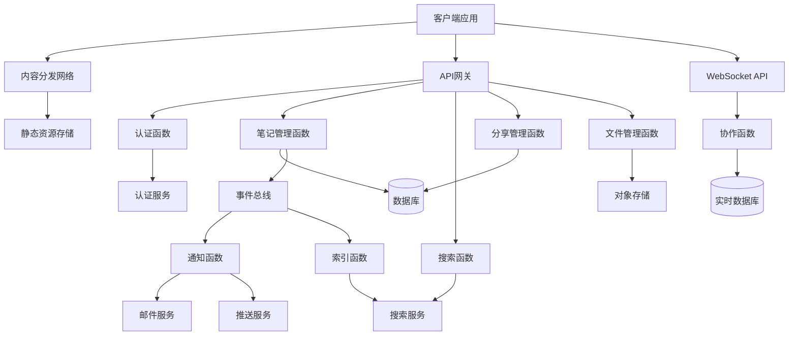
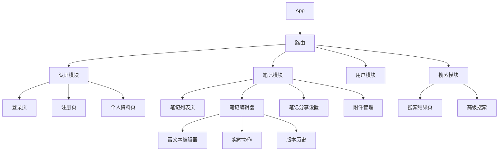

# 构建Serverless应用系统

本文将通过一个完整的实战项目，详细介绍如何设计和构建基于Serverless架构的应用系统，包括架构设计、功能实现、部署管理和运维策略。

## 项目概述

我们将构建一个名为"ServerlessNotes"的云笔记应用，这是一个允许用户创建、编辑、分享笔记的系统。该项目将充分利用Serverless架构的优势，实现高可用、可扩展且成本效益高的解决方案。

### 项目需求

1. **用户管理**：注册、登录、个人资料管理
2. **笔记功能**：创建、读取、更新、删除笔记
3. **分享功能**：通过链接分享笔记，设置访问权限
4. **搜索功能**：全文搜索笔记内容
5. **文件附件**：上传和管理笔记附件
6. **实时协作**：多用户同时编辑笔记
7. **通知系统**：重要事件的邮件和推送通知

### 技术栈选择

我们将使用以下技术栈构建这个Serverless应用：

- **前端**：React.js + TypeScript
- **后端**：AWS Lambda / Azure Functions / Google Cloud Functions
- **数据库**：DynamoDB / Cosmos DB / Firestore
- **存储**：S3 / Azure Blob Storage / Google Cloud Storage
- **认证**：Cognito / Auth0 / Firebase Authentication
- **API层**：API Gateway / Azure API Management
- **实时通信**：WebSockets / SignalR / Firebase Realtime Database
- **搜索服务**：Elasticsearch / Algolia
- **CDN**：CloudFront / Azure CDN / Cloud CDN

## 系统架构设计

### 整体架构

ServerlessNotes应用采用事件驱动的微服务架构，各个功能模块通过事件和API相互协作。



### 数据模型设计

为了适应Serverless环境和NoSQL数据库，我们需要精心设计数据模型：

#### 用户表

```json
{
  "userId": "user123",
  "email": "user@example.com",
  "name": "John Doe",
  "createdAt": "2023-01-15T10:30:00Z",
  "lastLogin": "2023-02-20T14:45:00Z",
  "preferences": {
    "theme": "dark",
    "language": "en"
  }
}
```

#### 笔记表

```json
{
  "noteId": "note456",
  "userId": "user123",
  "title": "Serverless架构设计",
  "content": "Serverless架构的主要优势包括...",
  "tags": ["serverless", "cloud", "architecture"],
  "createdAt": "2023-02-01T09:15:00Z",
  "updatedAt": "2023-02-10T11:20:00Z",
  "version": 5,
  "isPublic": false,
  "sharedWith": ["user789", "user456"]
}
```

#### 访问控制表

```json
{
  "resourceId": "note456",
  "resourceType": "note",
  "permissions": [
    {
      "userId": "user789",
      "accessLevel": "read"
    },
    {
      "userId": "user456",
      "accessLevel": "edit"
    }
  ],
  "publicLink": {
    "enabled": true,
    "token": "abc123xyz",
    "expiresAt": "2023-03-15T00:00:00Z"
  }
}
```

#### 附件表

```json
{
  "attachmentId": "attach789",
  "noteId": "note456",
  "userId": "user123",
  "fileName": "diagram.png",
  "fileType": "image/png",
  "fileSize": 256000,
  "storageKey": "attachments/user123/note456/diagram.png",
  "uploadedAt": "2023-02-05T10:25:00Z"
}
```

### API设计

我们将采用RESTful API设计，主要端点如下：

#### 认证API

- `POST /auth/register` - 用户注册
- `POST /auth/login` - 用户登录
- `POST /auth/refresh` - 刷新令牌
- `POST /auth/logout` - 用户登出
- `GET /auth/me` - 获取当前用户信息

#### 笔记API

- `GET /notes` - 获取用户笔记列表
- `POST /notes` - 创建新笔记
- `GET /notes/{noteId}` - 获取特定笔记
- `PUT /notes/{noteId}` - 更新笔记
- `DELETE /notes/{noteId}` - 删除笔记
- `GET /notes/{noteId}/versions` - 获取笔记版本历史

#### 分享API

- `POST /notes/{noteId}/share` - 分享笔记
- `DELETE /notes/{noteId}/share/{userId}` - 取消分享
- `POST /notes/{noteId}/public-link` - 创建公共链接
- `DELETE /notes/{noteId}/public-link` - 删除公共链接

#### 附件API

- `POST /notes/{noteId}/attachments` - 上传附件
- `GET /notes/{noteId}/attachments` - 获取附件列表
- `GET /notes/{noteId}/attachments/{attachmentId}` - 下载附件
- `DELETE /notes/{noteId}/attachments/{attachmentId}` - 删除附件

#### 搜索API

- `GET /search?q={query}` - 搜索笔记

### 事件设计

事件驱动架构是Serverless应用的核心，我们定义以下关键事件：

```json
// 笔记创建事件
{
  "eventType": "NOTE_CREATED",
  "timestamp": "2023-02-01T09:15:00Z",
  "data": {
    "noteId": "note456",
    "userId": "user123",
    "title": "Serverless架构设计"
  }
}

// 笔记更新事件
{
  "eventType": "NOTE_UPDATED",
  "timestamp": "2023-02-10T11:20:00Z",
  "data": {
    "noteId": "note456",
    "userId": "user123",
    "title": "Serverless架构设计",
    "version": 5
  }
}

// 笔记分享事件
{
  "eventType": "NOTE_SHARED",
  "timestamp": "2023-02-12T14:30:00Z",
  "data": {
    "noteId": "note456",
    "ownerId": "user123",
    "sharedWith": "user789",
    "accessLevel": "read"
  }
}

// 附件上传事件
{
  "eventType": "ATTACHMENT_UPLOADED",
  "timestamp": "2023-02-05T10:25:00Z",
  "data": {
    "attachmentId": "attach789",
    "noteId": "note456",
    "userId": "user123",
    "fileName": "diagram.png"
  }
}
```

## 功能实现

### 用户认证与授权

我们将使用AWS Cognito实现用户认证，并结合自定义授权逻辑：

```javascript
// 用户注册函数
exports.registerUser = async (event) => {
  const { email, password, name } = JSON.parse(event.body);
  
  try {
    // 使用Cognito注册用户
    const params = {
      ClientId: process.env.COGNITO_CLIENT_ID,
      Username: email,
      Password: password,
      UserAttributes: [
        {
          Name: 'name',
          Value: name
        },
        {
          Name: 'email',
          Value: email
        }
      ]
    };
    
    const cognito = new AWS.CognitoIdentityServiceProvider();
    await cognito.signUp(params).promise();
    
    // 创建用户记录
    const user = {
      userId: uuid.v4(),
      email,
      name,
      createdAt: new Date().toISOString(),
      preferences: {
        theme: 'light',
        language: 'en'
      }
    };
    
    await dynamoDB.put({
      TableName: process.env.USERS_TABLE,
      Item: user
    }).promise();
    
    return {
      statusCode: 201,
      body: JSON.stringify({ message: '用户注册成功', userId: user.userId })
    };
  } catch (error) {
    console.error('注册失败:', error);
    return {
      statusCode: 400,
      body: JSON.stringify({ message: '注册失败', error: error.message })
    };
  }
};

// 自定义授权函数
exports.authorizer = async (event) => {
  try {
    // 从请求中提取JWT令牌
    const token = event.authorizationToken.replace('Bearer ', '');
    
    // 验证令牌
    const decodedToken = await verifyToken(token);
    
    // 检查用户权限
    const userPermissions = await getUserPermissions(decodedToken.sub);
    
    // 构建IAM策略
    const policy = generateIAMPolicy(decodedToken.sub, 'Allow', event.methodArn, userPermissions);
    
    return policy;
  } catch (error) {
    console.error('授权失败:', error);
    throw new Error('Unauthorized');
  }
};

// 验证令牌函数
async function verifyToken(token) {
  // 实现JWT验证逻辑
  // ...
}

// 生成IAM策略
function generateIAMPolicy(principalId, effect, resource, context) {
  // 构建IAM策略文档
  // ...
}
```

### 笔记管理功能

笔记CRUD操作的核心实现：

```javascript
// 创建笔记函数
exports.createNote = async (event) => {
  const { title, content, tags } = JSON.parse(event.body);
  const userId = event.requestContext.authorizer.principalId;
  
  try {
    const noteId = uuid.v4();
    const timestamp = new Date().toISOString();
    
    const note = {
      noteId,
      userId,
      title,
      content,
      tags: tags || [],
      createdAt: timestamp,
      updatedAt: timestamp,
      version: 1,
      isPublic: false,
      sharedWith: []
    };
    
    // 保存笔记到数据库
    await dynamoDB.put({
      TableName: process.env.NOTES_TABLE,
      Item: note
    }).promise();
    
    // 发布笔记创建事件
    await eventBridge.putEvents({
      Entries: [
        {
          Source: 'serverlessnotes.notes',
          DetailType: 'NOTE_CREATED',
          Detail: JSON.stringify({
            noteId,
            userId,
            title
          }),
          EventBusName: process.env.EVENT_BUS_NAME
        }
      ]
    }).promise();
    
    return {
      statusCode: 201,
      body: JSON.stringify(note)
    };
  } catch (error) {
    console.error('创建笔记失败:', error);
    return {
      statusCode: 500,
      body: JSON.stringify({ message: '创建笔记失败', error: error.message })
    };
  }
};

// 获取笔记函数
exports.getNote = async (event) => {
  const noteId = event.pathParameters.noteId;
  const userId = event.requestContext.authorizer.principalId;
  
  try {
    // 从数据库获取笔记
    const result = await dynamoDB.get({
      TableName: process.env.NOTES_TABLE,
      Key: { noteId }
    }).promise();
    
    if (!result.Item) {
      return {
        statusCode: 404,
        body: JSON.stringify({ message: '笔记不存在' })
      };
    }
    
    const note = result.Item;
    
    // 检查访问权限
    if (note.userId !== userId && !note.isPublic && !note.sharedWith.includes(userId)) {
      return {
        statusCode: 403,
        body: JSON.stringify({ message: '无权访问此笔记' })
      };
    }
    
    return {
      statusCode: 200,
      body: JSON.stringify(note)
    };
  } catch (error) {
    console.error('获取笔记失败:', error);
    return {
      statusCode: 500,
      body: JSON.stringify({ message: '获取笔记失败', error: error.message })
    };
  }
};

// 更新笔记函数
exports.updateNote = async (event) => {
  const noteId = event.pathParameters.noteId;
  const userId = event.requestContext.authorizer.principalId;
  const { title, content, tags } = JSON.parse(event.body);
  
  try {
    // 先获取当前笔记
    const result = await dynamoDB.get({
      TableName: process.env.NOTES_TABLE,
      Key: { noteId }
    }).promise();
    
    if (!result.Item) {
      return {
        statusCode: 404,
        body: JSON.stringify({ message: '笔记不存在' })
      };
    }
    
    const note = result.Item;
    
    // 检查编辑权限
    if (note.userId !== userId) {
      // 检查是否有编辑权限的共享用户
      const shareResult = await dynamoDB.get({
        TableName: process.env.ACCESS_CONTROL_TABLE,
        Key: { 
          resourceId: noteId,
          resourceType: 'note'
        }
      }).promise();
      
      const accessControl = shareResult.Item;
      const hasEditAccess = accessControl?.permissions.some(
        p => p.userId === userId && p.accessLevel === 'edit'
      );
      
      if (!hasEditAccess) {
        return {
          statusCode: 403,
          body: JSON.stringify({ message: '无权编辑此笔记' })
        };
      }
    }
    
    // 保存旧版本
    await saveNoteVersion(note);
    
    // 更新笔记
    const updatedNote = {
      ...note,
      title: title || note.title,
      content: content || note.content,
      tags: tags || note.tags,
      updatedAt: new Date().toISOString(),
      version: note.version + 1
    };
    
    await dynamoDB.put({
      TableName: process.env.NOTES_TABLE,
      Item: updatedNote
    }).promise();
    
    // 发布笔记更新事件
    await eventBridge.putEvents({
      Entries: [
        {
          Source: 'serverlessnotes.notes',
          DetailType: 'NOTE_UPDATED',
          Detail: JSON.stringify({
            noteId,
            userId,
            title: updatedNote.title,
            version: updatedNote.version
          }),
          EventBusName: process.env.EVENT_BUS_NAME
        }
      ]
    }).promise();
    
    return {
      statusCode: 200,
      body: JSON.stringify(updatedNote)
    };
  } catch (error) {
    console.error('更新笔记失败:', error);
    return {
      statusCode: 500,
      body: JSON.stringify({ message: '更新笔记失败', error: error.message })
    };
  }
};

// 保存笔记版本
async function saveNoteVersion(note) {
  await dynamoDB.put({
    TableName: process.env.NOTE_VERSIONS_TABLE,
    Item: {
      noteId: note.noteId,
      version: note.version,
      data: note,
      timestamp: new Date().toISOString()
    }
  }).promise();
}
```

### 文件附件处理

实现文件上传和管理功能：

```javascript
// 生成预签名上传URL
exports.getUploadUrl = async (event) => {
  const noteId = event.pathParameters.noteId;
  const userId = event.requestContext.authorizer.principalId;
  const { fileName, fileType } = JSON.parse(event.body);
  
  try {
    // 检查笔记访问权限
    const hasAccess = await checkNoteAccess(noteId, userId, 'edit');
    if (!hasAccess) {
      return {
        statusCode: 403,
        body: JSON.stringify({ message: '无权为此笔记上传附件' })
      };
    }
    
    // 生成唯一的附件ID
    const attachmentId = uuid.v4();
    const key = `attachments/${userId}/${noteId}/${attachmentId}/${fileName}`;
    
    // 创建预签名URL
    const s3 = new AWS.S3();
    const uploadUrl = s3.getSignedUrl('putObject', {
      Bucket: process.env.ATTACHMENTS_BUCKET,
      Key: key,
      ContentType: fileType,
      Expires: 300 // 5分钟有效期
    });
    
    // 创建附件记录
    const attachment = {
      attachmentId,
      noteId,
      userId,
      fileName,
      fileType,
      storageKey: key,
      uploadedAt: new Date().toISOString()
    };
    
    await dynamoDB.put({
      TableName: process.env.ATTACHMENTS_TABLE,
      Item: attachment
    }).promise();
    
    return {
      statusCode: 200,
      body: JSON.stringify({
        attachmentId,
        uploadUrl
      })
    };
  } catch (error) {
    console.error('生成上传URL失败:', error);
    return {
      statusCode: 500,
      body: JSON.stringify({ message: '生成上传URL失败', error: error.message })
    };
  }
};

// 确认文件上传完成
exports.confirmUpload = async (event) => {
  const { s3 } = event.Records[0];
  const bucket = s3.bucket.name;
  const key = decodeURIComponent(s3.object.key.replace(/\+/g, ' '));
  const size = s3.object.size;
  
  // 从存储路径中提取信息
  const keyParts = key.split('/');
  const userId = keyParts[1];
  const noteId = keyParts[2];
  const attachmentId = keyParts[3];
  const fileName = keyParts.slice(4).join('/');
  
  try {
    // 更新附件记录
    await dynamoDB.update({
      TableName: process.env.ATTACHMENTS_TABLE,
      Key: { attachmentId },
      UpdateExpression: 'set fileSize = :size, status = :status',
      ExpressionAttributeValues: {
        ':size': size,
        ':status': 'COMPLETED'
      }
    }).promise();
    
    // 发布附件上传事件
    await eventBridge.putEvents({
      Entries: [
        {
          Source: 'serverlessnotes.attachments',
          DetailType: 'ATTACHMENT_UPLOADED',
          Detail: JSON.stringify({
            attachmentId,
            noteId,
            userId,
            fileName,
            fileSize: size
          }),
          EventBusName: process.env.EVENT_BUS_NAME
        }
      ]
    }).promise();
    
    console.log('附件上传确认成功:', { attachmentId, noteId, fileName });
  } catch (error) {
    console.error('确认上传失败:', error);
    throw error;
  }
};

// 获取附件下载URL
exports.getDownloadUrl = async (event) => {
  const noteId = event.pathParameters.noteId;
  const attachmentId = event.pathParameters.attachmentId;
  const userId = event.requestContext.authorizer.principalId;
  
  try {
    // 检查笔记访问权限
    const hasAccess = await checkNoteAccess(noteId, userId, 'read');
    if (!hasAccess) {
      return {
        statusCode: 403,
        body: JSON.stringify({ message: '无权访问此附件' })
      };
    }
    
    // 获取附件信息
    const result = await dynamoDB.get({
      TableName: process.env.ATTACHMENTS_TABLE,
      Key: { attachmentId }
    }).promise();
    
    if (!result.Item || result.Item.noteId !== noteId) {
      return {
        statusCode: 404,
        body: JSON.stringify({ message: '附件不存在' })
      };
    }
    
    const attachment = result.Item;
    
    // 生成下载URL
    const s3 = new AWS.S3();
    const downloadUrl = s3.getSignedUrl('getObject', {
      Bucket: process.env.ATTACHMENTS_BUCKET,
      Key: attachment.storageKey,
      Expires: 300 // 5分钟有效期
    });
    
    return {
      statusCode: 200,
      body: JSON.stringify({
        downloadUrl,
        fileName: attachment.fileName,
        fileType: attachment.fileType,
        fileSize: attachment.fileSize
      })
    };
  } catch (error) {
    console.error('获取下载URL失败:', error);
    return {
      statusCode: 500,
      body: JSON.stringify({ message: '获取下载URL失败', error: error.message })
    };
  }
};
```

### 搜索功能实现

使用Elasticsearch实现全文搜索：

```javascript
// 索引笔记函数 - 由笔记创建/更新事件触发
exports.indexNote = async (event) => {
  const { detail } = event;
  const { noteId } = detail;
  
  try {
    // 获取完整笔记内容
    const result = await dynamoDB.get({
      TableName: process.env.NOTES_TABLE,
      Key: { noteId }
    }).promise();
    
    if (!result.Item) {
      console.error('索引笔记失败: 笔记不存在', { noteId });
      return;
    }
    
    const note = result.Item;
    
    // 准备索引文档
    const document = {
      noteId: note.noteId,
      userId: note.userId,
      title: note.title,
      content: note.content,
      tags: note.tags,
      createdAt: note.createdAt,
      updatedAt: note.updatedAt,
      isPublic: note.isPublic
    };
    
    // 发送到Elasticsearch
    const { Client } = require('@elastic/elasticsearch');
    const client = new Client({
      node: process.env.ELASTICSEARCH_ENDPOINT,
      auth: {
        apiKey: process.env.ELASTICSEARCH_API_KEY
      }
    });
    
    await client.index({
      index: 'notes',
      id: noteId,
      body: document,
      refresh: true
    });
    
    console.log('笔记索引成功:', { noteId });
  } catch (error) {
    console.error('索引笔记失败:', error);
    throw error;
  }
};

// 搜索笔记函数
exports.searchNotes = async (event) => {
  const userId = event.requestContext.authorizer.principalId;
  const query = event.queryStringParameters.q;
  
  try {
    const { Client } = require('@elastic/elasticsearch');
    const client = new Client({
      node: process.env.ELASTICSEARCH_ENDPOINT,
      auth: {
        apiKey: process.env.ELASTICSEARCH_API_KEY
      }
    });
    
    // 构建搜索查询
    const searchResult = await client.search({
      index: 'notes',
      body: {
        query: {
          bool: {
            must: {
              multi_match: {
                query,
                fields: ['title^2', 'content', 'tags^1.5']
              }
            },
            filter: {
              bool: {
                should: [
                  { term: { userId } },
                  { term: { isPublic: true } }
                  // 共享笔记的访问控制会在应用层处理
                ]
              }
            }
          }
        },
        highlight: {
          fields: {
            title: {},
            content: {}
          }
        }
      }
    });
    
    // 处理搜索结果
    const hits = searchResult.body.hits.hits;
    const results = await Promise.all(hits.map(async hit => {
      const note = hit._source;
      
      // 对于非用户自己的私有笔记，检查是否有访问权限
      if (note.userId !== userId && !note.isPublic) {
        const hasAccess = await checkNoteAccess(note.noteId, userId, 'read');
        if (!hasAccess) return null;
      }
      
      return {
        noteId: note.noteId,
        title: note.title,
        snippet: hit.highlight?.content?.[0] || note.content.substring(0, 150) + '...',
        updatedAt: note.updatedAt,
        tags: note.tags,
        score: hit._score,
        highlights: hit.highlight
      };
    }));
    
    // 过滤掉无权访问的笔记
    const filteredResults = results.filter(result => result !== null);
    
    return {
      statusCode: 200,
      body: JSON.stringify({
        total: filteredResults.length,
        results: filteredResults
      })
    };
  } catch (error) {
    console.error('搜索笔记失败:', error);
    return {
      statusCode: 500,
      body: JSON.stringify({ message: '搜索失败', error: error.message })
    };
  }
};
```

### 实时协作功能

使用WebSocket实现多用户实时协作：

```javascript
// WebSocket连接处理
exports.handleConnect = async (event) => {
  const connectionId = event.requestContext.connectionId;
  const domainName = event.requestContext.domainName;
  const stage = event.requestContext.stage;
  
  // 从查询字符串获取认证令牌和笔记ID
  const queryParams = event.queryStringParameters || {};
  const token = queryParams.token;
  const noteId = queryParams.noteId;
  
  try {
    // 验证令牌
    const user = await verifyToken(token);
    
    if (!user) {
      // 认证失败，关闭连接
      const apiGateway = new AWS.ApiGatewayManagementApi({
        endpoint: `${domainName}/${stage}`
      });
      
      await apiGateway.deleteConnection({
        ConnectionId: connectionId
      }).promise();
      
      return { statusCode: 401 };
    }
    
    // 检查笔记访问权限
    const hasAccess = await checkNoteAccess(noteId, user.userId, 'read');
    if (!hasAccess) {
      // 无权访问，关闭连接
      const apiGateway = new AWS.ApiGatewayManagementApi({
        endpoint: `${domainName}/${stage}`
      });
      
      await apiGateway.deleteConnection({
        ConnectionId: connectionId
      }).promise();
      
      return { statusCode: 403 };
    }
    
    // 保存连接信息
    await dynamoDB.put({
      TableName: process.env.CONNECTIONS_TABLE,
      Item: {
        connectionId,
        userId: user.userId,
        noteId,
        username: user.name,
        connectedAt: new Date().toISOString()
      }
    }).promise();
    
    // 通知其他用户有新用户加入
    await broadcastToNote(noteId, connectionId, {
      type: 'USER_JOINED',
      data: {
        userId: user.userId,
        username: user.name
      }
    }, domainName, stage);
    
    // 发送当前在线用户列表
    const onlineUsers = await getOnlineUsers(noteId);
    
    const apiGateway = new AWS.ApiGatewayManagementApi({
      endpoint: `${domainName}/${stage}`
    });
    
    await apiGateway.postToConnection({
      ConnectionId: connectionId,
      Data: JSON.stringify({
        type: 'ONLINE_USERS',
        data: {
          users: onlineUsers
        }
      })
    }).promise();
    
    return { statusCode: 200 };
  } catch (error) {
    console.error('WebSocket连接处理失败:', error);
    return { statusCode: 500 };
  }
};

// 处理WebSocket消息
exports.handleMessage = async (event) => {
  const
继续完成Serverless应用系统的构建内容：

```javascript
// 处理WebSocket消息
exports.handleMessage = async (event) => {
  const connectionId = event.requestContext.connectionId;
  const domainName = event.requestContext.domainName;
  const stage = event.requestContext.stage;
  
  try {
    // 解析消息
    const message = JSON.parse(event.body);
    
    // 获取连接信息
    const connectionResult = await dynamoDB.get({
      TableName: process.env.CONNECTIONS_TABLE,
      Key: { connectionId }
    }).promise();
    
    if (!connectionResult.Item) {
      console.error('无效的连接:', connectionId);
      return { statusCode: 400 };
    }
    
    const connection = connectionResult.Item;
    const { userId, noteId, username } = connection;
    
    // 根据消息类型处理
    switch (message.type) {
      case 'CURSOR_POSITION':
        // 广播光标位置
        await broadcastToNote(noteId, connectionId, {
          type: 'CURSOR_POSITION',
          data: {
            userId,
            username,
            position: message.data.position
          }
        }, domainName, stage);
        break;
        
      case 'TEXT_CHANGE':
        // 检查编辑权限
        const hasEditAccess = await checkNoteAccess(noteId, userId, 'edit');
        if (!hasEditAccess) {
          // 发送错误消息
          const apiGateway = new AWS.ApiGatewayManagementApi({
            endpoint: `${domainName}/${stage}`
          });
          
          await apiGateway.postToConnection({
            ConnectionId: connectionId,
            Data: JSON.stringify({
              type: 'ERROR',
              data: {
                message: '无权编辑此笔记'
              }
            })
          }).promise();
          
          return { statusCode: 403 };
        }
        
        // 广播文本变更
        await broadcastToNote(noteId, connectionId, {
          type: 'TEXT_CHANGE',
          data: {
            userId,
            username,
            changes: message.data.changes,
            version: message.data.version
          }
        }, domainName, stage);
        
        // 保存变更到数据库
        await saveNoteChanges(noteId, userId, message.data.changes, message.data.version);
        break;
        
      default:
        console.warn('未知消息类型:', message.type);
    }
    
    return { statusCode: 200 };
  } catch (error) {
    console.error('处理WebSocket消息失败:', error);
    return { statusCode: 500 };
  }
};

// 处理WebSocket断开连接
exports.handleDisconnect = async (event) => {
  const connectionId = event.requestContext.connectionId;
  const domainName = event.requestContext.domainName;
  const stage = event.requestContext.stage;
  
  try {
    // 获取连接信息
    const connectionResult = await dynamoDB.get({
      TableName: process.env.CONNECTIONS_TABLE,
      Key: { connectionId }
    }).promise();
    
    if (connectionResult.Item) {
      const connection = connectionResult.Item;
      const { userId, noteId, username } = connection;
      
      // 通知其他用户此用户离开
      await broadcastToNote(noteId, connectionId, {
        type: 'USER_LEFT',
        data: {
          userId,
          username
        }
      }, domainName, stage);
    }
    
    // 删除连接记录
    await dynamoDB.delete({
      TableName: process.env.CONNECTIONS_TABLE,
      Key: { connectionId }
    }).promise();
    
    return { statusCode: 200 };
  } catch (error) {
    console.error('处理WebSocket断开连接失败:', error);
    return { statusCode: 500 };
  }
};

// 广播消息到笔记的所有连接
async function broadcastToNote(noteId, senderConnectionId, message, domainName, stage) {
  // 查询所有连接到此笔记的连接
  const connectionsResult = await dynamoDB.query({
    TableName: process.env.CONNECTIONS_TABLE,
    IndexName: 'NoteIdIndex',
    KeyConditionExpression: 'noteId = :noteId',
    ExpressionAttributeValues: {
      ':noteId': noteId
    }
  }).promise();
  
  const connections = connectionsResult.Items || [];
  
  // 创建API Gateway管理API客户端
  const apiGateway = new AWS.ApiGatewayManagementApi({
    endpoint: `${domainName}/${stage}`
  });
  
  // 向每个连接发送消息（除了发送者）
  const messageData = JSON.stringify(message);
  const sendPromises = connections
    .filter(conn => conn.connectionId !== senderConnectionId)
    .map(async (conn) => {
      try {
        await apiGateway.postToConnection({
          ConnectionId: conn.connectionId,
          Data: messageData
        }).promise();
      } catch (error) {
        if (error.statusCode === 410) {
          // 连接已关闭，删除记录
          await dynamoDB.delete({
            TableName: process.env.CONNECTIONS_TABLE,
            Key: { connectionId: conn.connectionId }
          }).promise();
        } else {
          console.error('发送消息失败:', error);
        }
      }
    });
  
  await Promise.all(sendPromises);
}

// 获取笔记的在线用户
async function getOnlineUsers(noteId) {
  const connectionsResult = await dynamoDB.query({
    TableName: process.env.CONNECTIONS_TABLE,
    IndexName: 'NoteIdIndex',
    KeyConditionExpression: 'noteId = :noteId',
    ExpressionAttributeValues: {
      ':noteId': noteId
    }
  }).promise();
  
  const connections = connectionsResult.Items || [];
  
  // 提取用户信息并去重
  const userMap = new Map();
  connections.forEach(conn => {
    userMap.set(conn.userId, {
      userId: conn.userId,
      username: conn.username
    });
  });
  
  return Array.from(userMap.values());
}

// 保存笔记变更
async function saveNoteChanges(noteId, userId, changes, version) {
  // 获取当前笔记
  const noteResult = await dynamoDB.get({
    TableName: process.env.NOTES_TABLE,
    Key: { noteId }
  }).promise();
  
  if (!noteResult.Item) {
    throw new Error('笔记不存在');
  }
  
  const note = noteResult.Item;
  
  // 应用变更
  // 这里简化处理，实际应用中需要更复杂的操作转换算法
  let updatedContent = note.content;
  
  for (const change of changes) {
    if (change.type === 'insert') {
      const before = updatedContent.substring(0, change.position);
      const after = updatedContent.substring(change.position);
      updatedContent = before + change.text + after;
    } else if (change.type === 'delete') {
      const before = updatedContent.substring(0, change.position);
      const after = updatedContent.substring(change.position + change.length);
      updatedContent = before + after;
    }
  }
  
  // 更新笔记
  await dynamoDB.update({
    TableName: process.env.NOTES_TABLE,
    Key: { noteId },
    UpdateExpression: 'set content = :content, updatedAt = :updatedAt, version = :version, lastEditedBy = :userId',
    ExpressionAttributeValues: {
      ':content': updatedContent,
      ':updatedAt': new Date().toISOString(),
      ':version': version,
      ':userId': userId
    },
    ConditionExpression: 'version < :version' // 乐观锁，防止冲突
  }).promise();
}
```

### 通知系统实现

使用事件驱动架构实现通知系统：

```javascript
// 处理笔记分享事件
exports.handleNoteShared = async (event) => {
  const { detail } = event;
  const { noteId, ownerId, sharedWith, accessLevel } = detail;
  
  try {
    // 获取笔记信息
    const noteResult = await dynamoDB.get({
      TableName: process.env.NOTES_TABLE,
      Key: { noteId }
    }).promise();
    
    if (!noteResult.Item) {
      console.error('笔记不存在:', noteId);
      return;
    }
    
    const note = noteResult.Item;
    
    // 获取所有者信息
    const ownerResult = await dynamoDB.get({
      TableName: process.env.USERS_TABLE,
      Key: { userId: ownerId }
    }).promise();
    
    const owner = ownerResult.Item || { name: 'Unknown User' };
    
    // 获取被分享用户信息
    const sharedWithResult = await dynamoDB.get({
      TableName: process.env.USERS_TABLE,
      Key: { userId: sharedWith }
    }).promise();
    
    if (!sharedWithResult.Item) {
      console.error('用户不存在:', sharedWith);
      return;
    }
    
    const sharedUser = sharedWithResult.Item;
    
    // 创建通知
    const notification = {
      notificationId: uuid.v4(),
      userId: sharedWith,
      type: 'NOTE_SHARED',
      title: `${owner.name} 与您分享了笔记`,
      message: `${owner.name} 与您分享了笔记 "${note.title}" 并授予您${accessLevel === 'edit' ? '编辑' : '查看'}权限`,
      data: {
        noteId,
        ownerId,
        accessLevel
      },
      isRead: false,
      createdAt: new Date().toISOString()
    };
    
    await dynamoDB.put({
      TableName: process.env.NOTIFICATIONS_TABLE,
      Item: notification
    }).promise();
    
    // 发送邮件通知
    if (sharedUser.email) {
      const ses = new AWS.SES();
      
      await ses.sendEmail({
        Source: process.env.NOTIFICATION_EMAIL_SENDER,
        Destination: {
          ToAddresses: [sharedUser.email]
        },
        Message: {
          Subject: {
            Data: `${owner.name} 与您分享了笔记`
          },
          Body: {
            Html: {
              Data: `
                <h2>您收到了一个笔记分享</h2>
                <p>${owner.name} 与您分享了笔记 "${note.title}" 并授予您${accessLevel === 'edit' ? '编辑' : '查看'}权限。</p>
                <p>点击下面的链接查看笔记：</p>
                <p><a href="${process.env.APP_URL}/notes/${noteId}">查看笔记</a></p>
              `
            }
          }
        }
      }).promise();
    }
    
    console.log('笔记分享通知已发送:', { noteId, sharedWith });
  } catch (error) {
    console.error('处理笔记分享事件失败:', error);
    throw error;
  }
};

// 获取用户通知
exports.getUserNotifications = async (event) => {
  const userId = event.requestContext.authorizer.principalId;
  
  try {
    // 查询用户通知
    const result = await dynamoDB.query({
      TableName: process.env.NOTIFICATIONS_TABLE,
      IndexName: 'UserIdIndex',
      KeyConditionExpression: 'userId = :userId',
      ExpressionAttributeValues: {
        ':userId': userId
      },
      ScanIndexForward: false, // 降序排列，最新的通知在前
      Limit: 20 // 限制返回数量
    }).promise();
    
    return {
      statusCode: 200,
      body: JSON.stringify({
        notifications: result.Items || [],
        count: result.Count
      })
    };
  } catch (error) {
    console.error('获取用户通知失败:', error);
    return {
      statusCode: 500,
      body: JSON.stringify({ message: '获取通知失败', error: error.message })
    };
  }
};

// 标记通知为已读
exports.markNotificationRead = async (event) => {
  const userId = event.requestContext.authorizer.principalId;
  const notificationId = event.pathParameters.notificationId;
  
  try {
    // 获取通知
    const result = await dynamoDB.get({
      TableName: process.env.NOTIFICATIONS_TABLE,
      Key: { notificationId }
    }).promise();
    
    if (!result.Item) {
      return {
        statusCode: 404,
        body: JSON.stringify({ message: '通知不存在' })
      };
    }
    
    const notification = result.Item;
    
    // 检查通知是否属于当前用户
    if (notification.userId !== userId) {
      return {
        statusCode: 403,
        body: JSON.stringify({ message: '无权访问此通知' })
      };
    }
    
    // 更新通知状态
    await dynamoDB.update({
      TableName: process.env.NOTIFICATIONS_TABLE,
      Key: { notificationId },
      UpdateExpression: 'set isRead = :isRead',
      ExpressionAttributeValues: {
        ':isRead': true
      }
    }).promise();
    
    return {
      statusCode: 200,
      body: JSON.stringify({ message: '通知已标记为已读' })
    };
  } catch (error) {
    console.error('标记通知已读失败:', error);
    return {
      statusCode: 500,
      body: JSON.stringify({ message: '操作失败', error: error.message })
    };
  }
};
```

## 前端应用实现

### React应用架构

前端应用采用React和TypeScript构建，使用以下架构：



### API客户端实现

创建与后端API交互的客户端：

```typescript
// src/api/client.ts
import axios, { AxiosInstance, AxiosRequestConfig } from 'axios';
import { AuthService } from '../services/auth';

export class ApiClient {
  private client: AxiosInstance;
  private authService: AuthService;
  
  constructor(authService: AuthService) {
    this.authService = authService;
    
    this.client = axios.create({
      baseURL: process.env.REACT_APP_API_URL,
      timeout: 10000,
      headers: {
        'Content-Type': 'application/json'
      }
    });
    
    // 请求拦截器 - 添加认证令牌
    this.client.interceptors.request.use(
      async (config) => {
        const token = await this.authService.getToken();
        if (token) {
          config.headers.Authorization = `Bearer ${token}`;
        }
        return config;
      },
      (error) => Promise.reject(error)
    );
    
    // 响应拦截器 - 处理令牌过期
    this.client.interceptors.response.use(
      (response) => response,
      async (error) => {
        const originalRequest = error.config;
        
        // 如果是401错误且未尝试过刷新令牌
        if (error.response?.status === 401 && !originalRequest._retry) {
          originalRequest._retry = true;
          
          try {
            // 尝试刷新令牌
            await this.authService.refreshToken();
            
            // 使用新令牌重试请求
            const token = await this.authService.getToken();
            originalRequest.headers.Authorization = `Bearer ${token}`;
            return this.client(originalRequest);
          } catch (refreshError) {
            // 刷新令牌失败，需要重新登录
            this.authService.logout();
            return Promise.reject(refreshError);
          }
        }
        
        return Promise.reject(error);
      }
    );
  }
  
  // 通用请求方法
  async request<T>(config: AxiosRequestConfig): Promise<T> {
    const response = await this.client(config);
    return response.data;
  }
  
  // 便捷方法
  async get<T>(url: string, params?: any): Promise<T> {
    return this.request<T>({ method: 'GET', url, params });
  }
  
  async post<T>(url: string, data?: any): Promise<T> {
    return this.request<T>({ method: 'POST', url, data });
  }
  
  async put<T>(url: string, data?: any): Promise<T> {
    return this.request<T>({ method: 'PUT', url, data });
  }
  
  async delete<T>(url: string): Promise<T> {
    return this.request<T>({ method: 'DELETE', url });
  }
}
```

### 笔记编辑器组件

实现支持实时协作的笔记编辑器：

```tsx
// src/components/NoteEditor/index.tsx
import React, { useState, useEffect, useRef } from 'react';
import { useParams } from 'react-router-dom';
import { Editor } from '@tinymce/tinymce-react';
import { useAuth } from '../../hooks/useAuth';
import { useNotes } from '../../hooks/useNotes';
import { useWebSocket } from '../../hooks/useWebSocket';
import { Note } from '../../types/Note';
import { CursorPosition, TextChange } from '../../types/Collaboration';
import { AttachmentList } from '../AttachmentList';
import { ShareSettings } from '../ShareSettings';
import { VersionHistory } from '../VersionHistory';
import './NoteEditor.css';

interface NoteEditorProps {
  onSave?: (note: Note) => void;
}

export const NoteEditor: React.FC<NoteEditorProps> = ({ onSave }) => {
  const { noteId } = useParams<{ noteId: string }>();
  const { user } = useAuth();
  const { getNote, updateNote } = useNotes();
  const editorRef = useRef<any>(null);
  const [note, setNote] = useState<Note | null>(null);
  const [loading, setLoading] = useState(true);
  const [saving, setSaving] = useState(false);
  const [error, setError] = useState<string | null>(null);
  const [activeUsers, setActiveUsers] = useState<Array<{ userId: string; username: string; cursorPosition?: CursorPosition }>>([]);
  
  // 初始化WebSocket连接
  const { connected, lastMessage, sendMessage } = useWebSocket(
    `${process.env.REACT_APP_WS_URL}?noteId=${noteId}&token=${user?.token}`
  );
  
  // 加载笔记数据
  useEffect(() => {
    const fetchNote = async () => {
      try {
        setLoading(true);
        const noteData = await getNote(noteId);
        setNote(noteData);
        setError(null);
      } catch (err) {
        setError('加载笔记失败');
        console.error('加载笔记失败:', err);
      } finally {
        setLoading(false);
      }
    };
    
    if (noteId) {
      fetchNote();
    }
  }, [noteId, getNote]);
  
  // 处理WebSocket消息
  useEffect(() => {
    if (!lastMessage) return;
    
    try {
      const message = JSON.parse(lastMessage.data);
      
      switch (message.type) {
        case 'ONLINE_USERS':
          setActiveUsers(message.data.users);
          break;
          
        case 'USER_JOINED':
          setActiveUsers(prev => {
            const exists = prev.some(u => u.userId === message.data.userId);
            if (exists) return prev;
            return [...prev, { userId: message.data.userId, username: message.data.username }];
          });
          break;
          
        case 'USER_LEFT':
          setActiveUsers(prev => prev.filter(u => u.userId !== message.data.userId));
          break;
          
        case 'CURSOR_POSITION':
          setActiveUsers(prev => {
            return prev.map(u => {
              if (u.userId === message.data.userId) {
                return { ...u, cursorPosition: message.data.position };
              }
              return u;
            });
          });
          break;
          
        case 'TEXT_CHANGE':
          if (message.data.userId !== user?.id && editorRef.current) {
            // 应用其他用户的文本变更
            applyExternalChanges(message.data.changes);
          }
          break;
          
        case 'ERROR':
          setError(message.data.message);
          break;
      }
    } catch (err) {
      console.error('处理WebSocket消息失败:', err);
    }
  }, [lastMessage, user?.id]);
  
  // 应用外部变更到编辑器
  const applyExternalChanges = (changes: TextChange[]) => {
    if (!editorRef.current) return;
    
    const editor = editorRef.current.editor;
    
    // 暂停编辑器的变更事件，防止循环
    editor.undoManager.ignore(() => {
      changes.forEach(change => {
        if (change.type === 'insert') {
          const bookmark = editor.selection.getBookmark();
          editor.selection.setCursor(change.position);
          editor.insertContent(change.text);
          editor.selection.moveToBookmark(bookmark);
        } else if (change.type === 'delete') {
          const bookmark = editor.selection.getBookmark();
          editor.selection.setCursor(change.position);
          editor.selection.setContent('');
          editor.selection.moveToBookmark(bookmark);
        }
      });
    });
  };
  
  // 发送光标位置
  const handleCursorPositionChange = () => {
    if (!editorRef.current || !connected) return;
    
    const editor = editorRef.current.editor;
    const selection = editor.selection;
    const position = selection.getStart();
    
    sendMessage(JSON.stringify({
      type: 'CURSOR_POSITION',
      data: {
        position: {
          node: editor.dom.getPath(position),
          offset: selection.getRng().startOffset
        }
      }
    }));
  };
  
  // 发送文本变更
  const handleEditorChange = (content: string) => {
    if (!note || !connected) return;
    
    // 这里简化处理，实际应用中需要计算具体的变更
    // 可以使用diff算法比较前后内容差异
    const changes: TextChange[] = [
      {
        type: 'insert',
        position: 0,
        text: content
      }
    ];
    
    sendMessage(JSON.stringify({
      type: 'TEXT_CHANGE',
      data: {
        changes,
        version: note.version + 1
      }
    }));
    
    // 更新本地笔记状态
    setNote(prev => {
      if (!prev) return null;
      return {
        ...prev,
        content,
        version: prev.version + 1
      };
    });
  };
  
  // 保存笔记
  const handleSave = async () => {
    if (!note || !editorRef.current) return;
    
    try {
      setSaving(true);
      const content = editorRef.current.editor.getContent();
      
      const updatedNote = await updateNote(noteId, {
        title: note.title,
        content,
        tags: note.tags
      });
      
      setNote(updatedNote);
      setError(null);
      
      if (onSave) {
        onSave(updatedNote);
      }
    } catch (err) {
      setError('保存笔记失败');
      console.error('保存笔记失败:', err);
    } finally {
      setSaving(false);
    }
  };
  
  if (loading) {
    return <div className="note-editor-loading">加载中...</div>;
  }
  
  if (error) {
    return <div className="note-editor-error">{error}</div>;
  }
  
  if (!note) {
    return <div className="note-editor-error">笔记不存在</div>;
  }
  
  return (
    <div className="note-editor">
      <div className="note-editor-header">
        <input
          type="text"
          className="note-title-input"
          value={note.title}
          onChange={(e) => setNote({ ...note, title: e.target.value })}
        />
        
        <div className="note-editor-actions">
          <button
            className="save-button"
            onClick={handleSave}
            disabled={saving}
          >
            {saving ? '保存中...' : '保存'}
          </button>
        </div>
      </div>
      
      <div className="note-editor-toolbar">
        <div className="note-tags">
          {note.tags.map(tag => (
            <span key={tag} className="note-tag">{tag}</span>
          ))}
          <button className="add-tag-button">+ 添加标签</button>
        </div>
        
        <div className="collaboration-status">
          {connected ? (
            <span className="status-connected">已连接</span>
          ) : (
            <span className="status-disconnected">未连接</span>
          )}
          
          <div className="active-users">
            {activeUsers.map(user => (
              <div key={user.userId} className="active-user" title={user.username}>
                {user.username.charAt(0).toUpperCase()}
              </div>
            ))}
          </div>
        </div>
      </div>
      
      <div className="note-editor-content">
        <Editor
          ref={editorRef}
          initialValue={note.content}
          init={{
            height: 500,
            menubar: false,
            plugins: [
              'advlist autolink lists link image charmap print preview anchor',
              'searchreplace visualblocks code fullscreen',
              'insertdatetime media table paste code help wordcount'
            ],
            toolbar:
              'undo redo | formatselect | bold italic backcolor | \
              alignleft aligncenter alignright alignjustify | \
              bullist numlist outdent indent | removeformat | help'
          }}
          onEditorChange={handleEditorChange}
          onSelectionChange={handleCursorPositionChange}
        />
      </div>
      
      <div className="note-editor-sidebar">
        <div className="sidebar-section">
          <h3>附件</h3>
          <AttachmentList noteId={noteId} />
        </div>
        
        <div className="sidebar-section">
          <h3>分享设置</h3>
          <ShareSettings noteId={noteId} />
        </div>
        
        <div className="sidebar-section">
          <h3>版本历史</h3>
          <VersionHistory noteId={noteId} />
        </div>
      </div>
    </div>
  );
};
```

## 部署与基础设施

### 基础设施即代码(IaC)

使用AWS CloudFormation/SAM定义基础设施：

```yaml
AWSTemplateFormatVersion: '2010-09-09'
Transform: AWS::Serverless-2016-10-31
Description: ServerlessNotes Application

Parameters:
  Environment:
    Type: String
    Default: dev
    AllowedValues:
      - dev
      - test
      - prod
    Description: Deployment environment

Globals:
  Function:
    Runtime: nodejs14.x
    MemorySize: 256
    Timeout: 30
    Environment:
      Variables:
        ENVIRONMENT: !Ref Environment

Resources:
  # API Gateway
  ApiGateway:
    Type: AWS::Serverless::Api
    Properties:
      StageName: !Ref Environment
      Cors:
        AllowMethods: "'GET,POST,PUT,DELETE,OPTIONS'"
        AllowHeaders: "'Content-Type,Authorization'"
        AllowOrigin: "'*'"
      Auth:
        DefaultAuthorizer: JwtAuthorizer
        Authorizers:
          JwtAuthorizer:
            FunctionArn: !GetAtt AuthorizerFunction.Arn
  
  # WebSocket API
  WebSocketApi:
    Type: AWS::ApiGatewayV2::Api
    Properties:
      Name: !Sub "ServerlessNotes-WebSocket-${Environment}"
      ProtocolType: WEBSOCKET
      RouteSelectionExpression: "$request.body.action"
  
  # DynamoDB Tables
  UsersTable:
    Type: AWS::DynamoDB::Table
    Properties:
      TableName: !Sub "ServerlessNotes-Users-${Environment}"
      BillingMode: PAY_PER_REQUEST
      AttributeDefinitions:
        - AttributeName: userId
          AttributeType: S
        - AttributeName: email
          AttributeType: S
      KeySchema:
        - AttributeName: userId
          KeyType: HASH
      GlobalSecondaryIndexes:
        - IndexName: EmailIndex
          KeySchema:
            - AttributeName: email
              KeyType: HASH
          Projection:
            ProjectionType: ALL
  
  NotesTable:
    Type: AWS::DynamoDB::Table
    Properties:
      TableName: !Sub "ServerlessNotes-Notes-${Environment}"
      BillingMode: PAY
继续完成Serverless应用系统的部署与基础设施部分：

```yaml
  NotesTable:
    Type: AWS::DynamoDB::Table
    Properties:
      TableName: !Sub "ServerlessNotes-Notes-${Environment}"
      BillingMode: PAY_PER_REQUEST
      AttributeDefinitions:
        - AttributeName: noteId
          AttributeType: S
        - AttributeName: userId
          AttributeType: S
      KeySchema:
        - AttributeName: noteId
          KeyType: HASH
      GlobalSecondaryIndexes:
        - IndexName: UserIdIndex
          KeySchema:
            - AttributeName: userId
              KeyType: HASH
          Projection:
            ProjectionType: ALL
  
  AccessControlTable:
    Type: AWS::DynamoDB::Table
    Properties:
      TableName: !Sub "ServerlessNotes-AccessControl-${Environment}"
      BillingMode: PAY_PER_REQUEST
      AttributeDefinitions:
        - AttributeName: resourceId
          AttributeType: S
        - AttributeName: resourceType
          AttributeType: S
      KeySchema:
        - AttributeName: resourceId
          KeyType: HASH
        - AttributeName: resourceType
          KeyType: RANGE
  
  AttachmentsTable:
    Type: AWS::DynamoDB::Table
    Properties:
      TableName: !Sub "ServerlessNotes-Attachments-${Environment}"
      BillingMode: PAY_PER_REQUEST
      AttributeDefinitions:
        - AttributeName: attachmentId
          AttributeType: S
        - AttributeName: noteId
          AttributeType: S
      KeySchema:
        - AttributeName: attachmentId
          KeyType: HASH
      GlobalSecondaryIndexes:
        - IndexName: NoteIdIndex
          KeySchema:
            - AttributeName: noteId
              KeyType: HASH
          Projection:
            ProjectionType: ALL
  
  ConnectionsTable:
    Type: AWS::DynamoDB::Table
    Properties:
      TableName: !Sub "ServerlessNotes-Connections-${Environment}"
      BillingMode: PAY_PER_REQUEST
      AttributeDefinitions:
        - AttributeName: connectionId
          AttributeType: S
        - AttributeName: noteId
          AttributeType: S
      KeySchema:
        - AttributeName: connectionId
          KeyType: HASH
      GlobalSecondaryIndexes:
        - IndexName: NoteIdIndex
          KeySchema:
            - AttributeName: noteId
              KeyType: HASH
          Projection:
            ProjectionType: ALL
  
  NotificationsTable:
    Type: AWS::DynamoDB::Table
    Properties:
      TableName: !Sub "ServerlessNotes-Notifications-${Environment}"
      BillingMode: PAY_PER_REQUEST
      AttributeDefinitions:
        - AttributeName: notificationId
          AttributeType: S
        - AttributeName: userId
          AttributeType: S
      KeySchema:
        - AttributeName: notificationId
          KeyType: HASH
      GlobalSecondaryIndexes:
        - IndexName: UserIdIndex
          KeySchema:
            - AttributeName: userId
              KeyType: HASH
          Projection:
            ProjectionType: ALL
  
  # S3 Buckets
  StaticWebsiteBucket:
    Type: AWS::S3::Bucket
    Properties:
      BucketName: !Sub "serverlessnotes-website-${Environment}-${AWS::AccountId}"
      WebsiteConfiguration:
        IndexDocument: index.html
        ErrorDocument: index.html
      CorsConfiguration:
        CorsRules:
          - AllowedHeaders: ['*']
            AllowedMethods: [GET]
            AllowedOrigins: ['*']
            MaxAge: 3000
  
  AttachmentsBucket:
    Type: AWS::S3::Bucket
    Properties:
      BucketName: !Sub "serverlessnotes-attachments-${Environment}-${AWS::AccountId}"
      CorsConfiguration:
        CorsRules:
          - AllowedHeaders: ['*']
            AllowedMethods: [GET, PUT, POST, DELETE]
            AllowedOrigins: ['*']
            MaxAge: 3000
  
  # CloudFront Distribution
  CloudFrontDistribution:
    Type: AWS::CloudFront::Distribution
    Properties:
      DistributionConfig:
        Origins:
          - DomainName: !GetAtt StaticWebsiteBucket.RegionalDomainName
            Id: S3Origin
            S3OriginConfig:
              OriginAccessIdentity: !Sub "origin-access-identity/cloudfront/${CloudFrontOAI}"
        Enabled: true
        DefaultRootObject: index.html
        DefaultCacheBehavior:
          TargetOriginId: S3Origin
          ViewerProtocolPolicy: redirect-to-https
          AllowedMethods: [GET, HEAD, OPTIONS]
          CachedMethods: [GET, HEAD]
          ForwardedValues:
            QueryString: false
            Cookies:
              Forward: none
        CustomErrorResponses:
          - ErrorCode: 403
            ResponseCode: 200
            ResponsePagePath: /index.html
          - ErrorCode: 404
            ResponseCode: 200
            ResponsePagePath: /index.html
        PriceClass: PriceClass_100
        ViewerCertificate:
          CloudFrontDefaultCertificate: true
  
  CloudFrontOAI:
    Type: AWS::CloudFront::CloudFrontOriginAccessIdentity
    Properties:
      CloudFrontOriginAccessIdentityConfig:
        Comment: !Sub "OAI for ServerlessNotes ${Environment}"
  
  # Lambda Functions
  AuthorizerFunction:
    Type: AWS::Serverless::Function
    Properties:
      CodeUri: ./src/functions/authorizer/
      Handler: index.handler
      Policies:
        - DynamoDBReadPolicy:
            TableName: !Ref UsersTable
      Environment:
        Variables:
          COGNITO_USER_POOL_ID: !Ref UserPool
          COGNITO_CLIENT_ID: !Ref UserPoolClient
  
  RegisterUserFunction:
    Type: AWS::Serverless::Function
    Properties:
      CodeUri: ./src/functions/auth/
      Handler: register.handler
      Events:
        ApiEvent:
          Type: Api
          Properties:
            RestApiId: !Ref ApiGateway
            Path: /auth/register
            Method: post
            Auth:
              Authorizer: NONE
      Policies:
        - DynamoDBCrudPolicy:
            TableName: !Ref UsersTable
        - Statement:
            - Effect: Allow
              Action:
                - cognito-idp:SignUp
                - cognito-idp:AdminConfirmSignUp
              Resource: !GetAtt UserPool.Arn
      Environment:
        Variables:
          USERS_TABLE: !Ref UsersTable
          COGNITO_USER_POOL_ID: !Ref UserPool
          COGNITO_CLIENT_ID: !Ref UserPoolClient
  
  CreateNoteFunction:
    Type: AWS::Serverless::Function
    Properties:
      CodeUri: ./src/functions/notes/
      Handler: create.handler
      Events:
        ApiEvent:
          Type: Api
          Properties:
            RestApiId: !Ref ApiGateway
            Path: /notes
            Method: post
      Policies:
        - DynamoDBCrudPolicy:
            TableName: !Ref NotesTable
        - EventBridgePutEventsPolicy:
            EventBusName: !Ref EventBus
      Environment:
        Variables:
          NOTES_TABLE: !Ref NotesTable
          EVENT_BUS_NAME: !Ref EventBus
  
  GetNoteFunction:
    Type: AWS::Serverless::Function
    Properties:
      CodeUri: ./src/functions/notes/
      Handler: get.handler
      Events:
        ApiEvent:
          Type: Api
          Properties:
            RestApiId: !Ref ApiGateway
            Path: /notes/{noteId}
            Method: get
      Policies:
        - DynamoDBReadPolicy:
            TableName: !Ref NotesTable
        - DynamoDBReadPolicy:
            TableName: !Ref AccessControlTable
      Environment:
        Variables:
          NOTES_TABLE: !Ref NotesTable
          ACCESS_CONTROL_TABLE: !Ref AccessControlTable
  
  UpdateNoteFunction:
    Type: AWS::Serverless::Function
    Properties:
      CodeUri: ./src/functions/notes/
      Handler: update.handler
      Events:
        ApiEvent:
          Type: Api
          Properties:
            RestApiId: !Ref ApiGateway
            Path: /notes/{noteId}
            Method: put
      Policies:
        - DynamoDBCrudPolicy:
            TableName: !Ref NotesTable
        - DynamoDBReadPolicy:
            TableName: !Ref AccessControlTable
        - EventBridgePutEventsPolicy:
            EventBusName: !Ref EventBus
      Environment:
        Variables:
          NOTES_TABLE: !Ref NotesTable
          ACCESS_CONTROL_TABLE: !Ref AccessControlTable
          EVENT_BUS_NAME: !Ref EventBus
  
  # WebSocket Functions
  WebSocketConnectFunction:
    Type: AWS::Serverless::Function
    Properties:
      CodeUri: ./src/functions/websocket/
      Handler: connect.handler
      Events:
        WebSocketConnect:
          Type: WebSocket
          Properties:
            ApiId: !Ref WebSocketApi
            Route: $connect
      Policies:
        - DynamoDBCrudPolicy:
            TableName: !Ref ConnectionsTable
        - DynamoDBReadPolicy:
            TableName: !Ref NotesTable
        - DynamoDBReadPolicy:
            TableName: !Ref AccessControlTable
      Environment:
        Variables:
          CONNECTIONS_TABLE: !Ref ConnectionsTable
          NOTES_TABLE: !Ref NotesTable
          ACCESS_CONTROL_TABLE: !Ref AccessControlTable
          COGNITO_USER_POOL_ID: !Ref UserPool
  
  WebSocketDisconnectFunction:
    Type: AWS::Serverless::Function
    Properties:
      CodeUri: ./src/functions/websocket/
      Handler: disconnect.handler
      Events:
        WebSocketDisconnect:
          Type: WebSocket
          Properties:
            ApiId: !Ref WebSocketApi
            Route: $disconnect
      Policies:
        - DynamoDBCrudPolicy:
            TableName: !Ref ConnectionsTable
        - Statement:
            - Effect: Allow
              Action:
                - execute-api:ManageConnections
              Resource: !Sub "arn:aws:execute-api:${AWS::Region}:${AWS::AccountId}:${WebSocketApi}/${Environment}/*"
      Environment:
        Variables:
          CONNECTIONS_TABLE: !Ref ConnectionsTable
  
  WebSocketMessageFunction:
    Type: AWS::Serverless::Function
    Properties:
      CodeUri: ./src/functions/websocket/
      Handler: message.handler
      Events:
        WebSocketMessage:
          Type: WebSocket
          Properties:
            ApiId: !Ref WebSocketApi
            Route: $default
      Policies:
        - DynamoDBCrudPolicy:
            TableName: !Ref ConnectionsTable
        - DynamoDBCrudPolicy:
            TableName: !Ref NotesTable
        - Statement:
            - Effect: Allow
              Action:
                - execute-api:ManageConnections
              Resource: !Sub "arn:aws:execute-api:${AWS::Region}:${AWS::AccountId}:${WebSocketApi}/${Environment}/*"
      Environment:
        Variables:
          CONNECTIONS_TABLE: !Ref ConnectionsTable
          NOTES_TABLE: !Ref NotesTable
  
  # Event Processing Functions
  IndexNoteFunction:
    Type: AWS::Serverless::Function
    Properties:
      CodeUri: ./src/functions/search/
      Handler: index.handler
      Events:
        NoteCreatedEvent:
          Type: EventBridgeRule
          Properties:
            EventBusName: !Ref EventBus
            Pattern:
              source:
                - serverlessnotes.notes
              detail-type:
                - NOTE_CREATED
                - NOTE_UPDATED
      Policies:
        - DynamoDBReadPolicy:
            TableName: !Ref NotesTable
        - Statement:
            - Effect: Allow
              Action:
                - es:ESHttpPost
                - es:ESHttpPut
              Resource: !Sub "arn:aws:es:${AWS::Region}:${AWS::AccountId}:domain/${ElasticsearchDomain}/*"
      Environment:
        Variables:
          NOTES_TABLE: !Ref NotesTable
          ELASTICSEARCH_ENDPOINT: !GetAtt ElasticsearchDomain.DomainEndpoint
  
  NotificationFunction:
    Type: AWS::Serverless::Function
    Properties:
      CodeUri: ./src/functions/notifications/
      Handler: process.handler
      Events:
        NoteSharedEvent:
          Type: EventBridgeRule
          Properties:
            EventBusName: !Ref EventBus
            Pattern:
              source:
                - serverlessnotes.notes
              detail-type:
                - NOTE_SHARED
      Policies:
        - DynamoDBReadPolicy:
            TableName: !Ref NotesTable
        - DynamoDBReadPolicy:
            TableName: !Ref UsersTable
        - DynamoDBCrudPolicy:
            TableName: !Ref NotificationsTable
        - SESCrudPolicy:
            IdentityName: !Ref NotificationEmailIdentity
      Environment:
        Variables:
          NOTES_TABLE: !Ref NotesTable
          USERS_TABLE: !Ref UsersTable
          NOTIFICATIONS_TABLE: !Ref NotificationsTable
          NOTIFICATION_EMAIL_SENDER: !Ref NotificationEmailSender
          APP_URL: !Sub "https://${CloudFrontDistribution.DomainName}"
  
  # Cognito Resources
  UserPool:
    Type: AWS::Cognito::UserPool
    Properties:
      UserPoolName: !Sub "ServerlessNotes-UserPool-${Environment}"
      AutoVerifiedAttributes:
        - email
      UsernameAttributes:
        - email
      Policies:
        PasswordPolicy:
          MinimumLength: 8
          RequireLowercase: true
          RequireNumbers: true
          RequireSymbols: false
          RequireUppercase: true
  
  UserPoolClient:
    Type: AWS::Cognito::UserPoolClient
    Properties:
      ClientName: !Sub "ServerlessNotes-App-${Environment}"
      UserPoolId: !Ref UserPool
      GenerateSecret: false
      ExplicitAuthFlows:
        - ALLOW_USER_PASSWORD_AUTH
        - ALLOW_REFRESH_TOKEN_AUTH
  
  # EventBridge
  EventBus:
    Type: AWS::Events::EventBus
    Properties:
      Name: !Sub "ServerlessNotes-EventBus-${Environment}"
  
  # Elasticsearch Domain
  ElasticsearchDomain:
    Type: AWS::Elasticsearch::Domain
    Properties:
      DomainName: !Sub "serverlessnotes-${Environment}"
      ElasticsearchVersion: "7.10"
      ElasticsearchClusterConfig:
        InstanceType: "t3.small.elasticsearch"
        InstanceCount: 1
      EBSOptions:
        EBSEnabled: true
        VolumeSize: 10
        VolumeType: "gp2"
      AccessPolicies:
        Version: "2012-10-17"
        Statement:
          - Effect: "Allow"
            Principal:
              AWS: !Sub "arn:aws:iam::${AWS::AccountId}:root"
            Action: "es:*"
            Resource: !Sub "arn:aws:es:${AWS::Region}:${AWS::AccountId}:domain/serverlessnotes-${Environment}/*"
  
  # SES Resources
  NotificationEmailIdentity:
    Type: AWS::SES::EmailIdentity
    Properties:
      EmailIdentity: !Ref NotificationEmailSender
  
  # Parameters
  NotificationEmailSender:
    Type: AWS::SSM::Parameter
    Properties:
      Name: !Sub "/serverlessnotes/${Environment}/notification-email-sender"
      Type: String
      Value: "notifications@example.com"
      Description: "Email address used to send notifications"

Outputs:
  ApiEndpoint:
    Description: "API Gateway endpoint URL"
    Value: !Sub "https://${ApiGateway}.execute-api.${AWS::Region}.amazonaws.com/${Environment}"
  
  WebSocketEndpoint:
    Description: "WebSocket API endpoint URL"
    Value: !Sub "wss://${WebSocketApi}.execute-api.${AWS::Region}.amazonaws.com/${Environment}"
  
  WebsiteURL:
    Description: "CloudFront Distribution URL"
    Value: !Sub "https://${CloudFrontDistribution.DomainName}"
  
  UserPoolId:
    Description: "Cognito User Pool ID"
    Value: !Ref UserPool
  
  UserPoolClientId:
    Description: "Cognito User Pool Client ID"
    Value: !Ref UserPoolClient
  
  ElasticsearchEndpoint:
    Description: "Elasticsearch Domain Endpoint"
    Value: !GetAtt ElasticsearchDomain.DomainEndpoint
```

### CI/CD 流水线

使用AWS CodePipeline实现持续集成和部署：

```yaml
AWSTemplateFormatVersion: '2010-09-09'
Description: CI/CD Pipeline for ServerlessNotes Application

Parameters:
  GitHubOwner:
    Type: String
    Description: GitHub repository owner
  
  GitHubRepo:
    Type: String
    Description: GitHub repository name
  
  GitHubBranch:
    Type: String
    Default: main
    Description: GitHub repository branch
  
  GitHubToken:
    Type: String
    NoEcho: true
    Description: GitHub OAuth token
  
  Environment:
    Type: String
    Default: dev
    AllowedValues:
      - dev
      - test
      - prod
    Description: Deployment environment

Resources:
  # CodeBuild Role
  CodeBuildServiceRole:
    Type: AWS::IAM::Role
    Properties:
      AssumeRolePolicyDocument:
        Version: '2012-10-17'
        Statement:
          - Effect: Allow
            Principal:
              Service: codebuild.amazonaws.com
            Action: 'sts:AssumeRole'
      ManagedPolicyArns:
        - 'arn:aws:iam::aws:policy/AmazonS3FullAccess'
        - 'arn:aws:iam::aws:policy/CloudWatchLogsFullAccess'
  
  CodeBuildPolicy:
    Type: AWS::IAM::Policy
    Properties:
      PolicyName: CodeBuildPolicy
      PolicyDocument:
        Version: '2012-10-17'
        Statement:
          - Effect: Allow
            Action:
              - 'cloudformation:*'
              - 'lambda:*'
              - 'apigateway:*'
              - 'cognito-idp:*'
              - 'dynamodb:*'
              - 's3:*'
              - 'cloudfront:*'
              - 'events:*'
              - 'es:*'
              - 'ses:*'
              - 'ssm:*'
              - 'iam:PassRole'
            Resource: '*'
      Roles:
        - !Ref CodeBuildServiceRole
  
  # CodePipeline Role
  CodePipelineServiceRole:
    Type: AWS::IAM::Role
    Properties:
      AssumeRolePolicyDocument:
        Version: '2012-10-17'
        Statement:
          - Effect: Allow
            Principal:
              Service: codepipeline.amazonaws.com
            Action: 'sts:AssumeRole'
      ManagedPolicyArns:
        - 'arn:aws:iam::aws:policy/AmazonS3FullAccess'
  
  CodePipelinePolicy:
    Type: AWS::IAM::Policy
    Properties:
      PolicyName: CodePipelinePolicy
      PolicyDocument:
        Version: '2012-10-17'
        Statement:
          - Effect: Allow
            Action:
              - 'codebuild:StartBuild'
              - 'codebuild:BatchGetBuilds'
              - 'cloudformation:*'
              - 'iam:PassRole'
            Resource: '*'
      Roles:
        - !Ref CodePipelineServiceRole
  
  # Artifact Bucket
  ArtifactBucket:
    Type: AWS::S3::Bucket
    Properties:
      VersioningConfiguration:
        Status: Enabled
  
  # CodeBuild Projects
  BackendBuildProject:
    Type: AWS::CodeBuild::Project
    Properties:
      Name: !Sub "ServerlessNotes-Backend-${Environment}"
      ServiceRole: !GetAtt CodeBuildServiceRole.Arn
      Artifacts:
        Type: CODEPIPELINE
      Environment:
        Type: LINUX_CONTAINER
        ComputeType: BUILD_GENERAL1_SMALL
        Image: aws/codebuild/amazonlinux2-x86_64-standard:3.0
        PrivilegedMode: true
        EnvironmentVariables:
          - Name: ENVIRONMENT
            Value: !Ref Environment
      Source:
        Type: CODEPIPELINE
        BuildSpec: backend/buildspec.yml
      TimeoutInMinutes: 15
  
  FrontendBuildProject:
    Type: AWS::CodeBuild::Project
    Properties:
      Name: !Sub "ServerlessNotes-Frontend-${Environment}"
      ServiceRole: !GetAtt CodeBuildServiceRole.Arn
      Artifacts:
        Type: CODEPIPELINE
      Environment:
        Type: LINUX_CONTAINER
        ComputeType: BUILD_GENERAL1_SMALL
        Image: aws/codebuild/amazonlinux2-x86_64-standard:3.0
        EnvironmentVariables:
          - Name: ENVIRONMENT
            Value: !Ref Environment
          - Name: REACT_APP_API_URL
            Value: !Sub "https://${ApiGateway}.execute-api.${AWS::Region}.amazonaws.com/${Environment}"
          - Name: REACT_APP_WS_URL
            Value: !Sub "wss://${WebSocketApi}.execute-api.${AWS::Region}.amazonaws.com/${Environment}"
          - Name: REACT_APP_USER_POOL_ID
            Value: !Ref UserPool
          - Name: REACT_APP_USER_POOL_CLIENT_ID
            Value: !Ref UserPoolClient
      Source:
        Type: CODEPIPELINE
        BuildSpec: frontend/buildspec.yml
      TimeoutInMinutes: 15
  
  # CodePipeline
  Pipeline:
    Type: AWS::CodePipeline::Pipeline
    Properties:
      RoleArn: !GetAtt CodePipelineServiceRole.Arn
      ArtifactStore:
        Type: S3
        Location: !Ref ArtifactBucket
      Stages:
        - Name: Source
          Actions:
            - Name: Source
              ActionTypeId:
                Category: Source
                Owner: ThirdParty
                Provider: GitHub
                Version: '1'
              Configuration:
                Owner: !Ref GitHubOwner
                Repo: !Ref GitHubRepo
                Branch: !Ref GitHubBranch
                OAuthToken: !Ref GitHubToken
              OutputArtifacts:
                - Name: SourceCode
        
        - Name: Build
          Actions:
            - Name: BuildBackend
              ActionTypeId:
                Category: Build
                Owner: AWS
                Provider: CodeBuild
                Version: '1'
              Configuration:
                ProjectName: !Ref BackendBuildProject
              InputArtifacts:
                - Name: SourceCode
              OutputArtifacts:
                - Name: BackendBuildOutput
            
            - Name: BuildFrontend
              ActionTypeId:
                Category: Build
                Owner: AWS
                Provider: CodeBuild
                Version: '1'
              Configuration:
                ProjectName: !Ref FrontendBuildProject
              InputArtifacts:
                - Name: SourceCode
              OutputArtifacts:
                - Name: FrontendBuildOutput
        
        - Name: Deploy
          Actions:
            - Name: DeployBackend
              ActionTypeId:
                Category: Deploy
                Owner: AWS
                Provider: CloudFormation
                Version: '1'
              Configuration:
                ActionMode: CREATE_UPDATE
                RoleArn: !GetAtt CloudFormationServiceRole.Arn
                StackName: !Sub "ServerlessNotes-Backend-${Environment}"
                TemplatePath: BackendBuildOutput::packaged.yaml
                Capabilities: CAPABILITY_IAM,CAPABILITY_AUTO_EXPAND
                ParameterOverrides: !Sub |
                  {
                    "Environment": "${Environment}"
                  }
              InputArtifacts:
                - Name: BackendBuildOutput
            
            - Name: DeployFrontend
              ActionTypeId:
                Category: Build
                Owner: AWS
                Provider: CodeBuild
                Version: '1'
              Configuration:
                ProjectName: !Ref FrontendDeployProject
              InputArtifacts:
                - Name: FrontendBuildOutput
  
  # Frontend Deployment Project
  FrontendDeployProject:
    Type: AWS::CodeBuild::Project
    Properties:
      Name: !Sub "ServerlessNotes-Frontend-Deploy-${Environment}"
      ServiceRole: !GetAtt CodeBuildServiceRole.Arn
      Artifacts:
        Type: CODEPIPELINE
      Environment:
        Type: LINUX_CONTAINER
        ComputeType: BUILD_GENERAL1_SMALL
        Image: aws/codebuild/amazonlinux2-x86_64-standard:3.0
        EnvironmentVariables:
          - Name: WEBSITE_BUCKET
            Value: !Sub "serverlessnotes-website-${Environment}-${AWS::AccountId}"
          - Name: CLOUDFRONT_DISTRIBUTION_ID
            Value: !Ref CloudFrontDistribution
      Source:
        Type: CODEPIPELINE
        BuildSpec: |
          version: 0.2
          phases:
            build:
              commands:
                - echo "Deploying frontend to S3..."
                - aws s3 sync build/ s3://$WEBSITE_BUCKET/ --delete
                - echo "Invalidating CloudFront cache..."
                - aws cloudfront create-invalidation --distribution-id $CLOUDFRONT_DISTRIBUTION_ID --paths "/*"
          artifacts:
            files:
              - '**/*'
      TimeoutInMinutes: 10
  
  # CloudFormation Service Role
  CloudFormationServiceRole:
    Type: AWS::IAM::Role
    Properties:
      AssumeRolePolicyDocument:
        Version: '2012-10-17'
        Statement:
          - Effect: Allow
            Principal:
              Service: cloudformation.amazonaws.com
            Action: 'sts:AssumeRole'
      ManagedPolicyArns:
        - 'arn:aws:iam::aws:policy/AdministratorAccess'

Outputs:
  PipelineURL:
    Description: "URL to the CodePipeline console"
    Value: !Sub "https://console.aws.amazon.com/codepipeline/home?region=${AWS::Region}#/view/${Pipeline}"
```

### 构建规范文件

后端构建规范文件 (backend/buildspec.yml)：

```yaml
version: 0.2

phases:
  install:
    runtime-versions:
      nodejs: 14
    commands:
      - echo Installing dependencies...
      - cd backend
      - npm install
      - npm install -g aws-sam-cli
  
  build:
    commands:
      - echo Building and packaging SAM application...
      - sam build
      - sam package --s3-bucket $ARTIFACT_BUCKET --output-template-file packaged.yaml
  
  post_build:
    commands:
      - echo Build completed

artifacts:
  files:
    - backend/packaged.yaml
    - appspec.yml
  discard-paths: yes
```

前端构建规范文件 (frontend/buildspec.yml)：

```yaml
version: 0.2

phases:
  install:
    runtime-versions:
      nodejs: 14
    commands:
      - echo Installing dependencies...
      - cd frontend
      - npm install
  
  build:
    commands:
      - echo Building React application...
      - echo "REACT_APP_API_URL=$REACT_APP_API_URL" > .env
      - echo "REACT_APP_WS_URL=$REACT_APP_WS_URL" >> .env
      - echo "REACT_APP_USER_POOL_ID=$REACT_APP_USER_POOL_ID" >> .env
      - echo "REACT_APP_USER_POOL_CLIENT_ID=$REACT_APP_USER_POOL_CLIENT_ID" >> .env
      - npm run build
  
  post_build:
    commands:
      - echo Build completed

artifacts:
  base-directory: frontend/build
  files:
    - '**/*'
```

## 运维与监控

### 监控策略

为Serverless应用实现全面监控：

```yaml
Resources:
  # CloudWatch Alarms
  ApiLatencyAlarm:
    Type: AWS::CloudWatch::Alarm
    Properties:
      AlarmName: !Sub "ServerlessNotes-ApiLatency-${Environment}"
      AlarmDescription: "Alarm when API latency exceeds threshold"
      MetricName: Latency
      Namespace: AWS/ApiGateway
      Dimensions:
        - Name: ApiName
          Value: !Ref ApiGateway
      Statistic: Average
      Period: 60
      EvaluationPeriods: 5
      Threshold: 1000
      ComparisonOperator: GreaterThanThreshold
      TreatMissingData: notBreaching
      AlarmActions:
        - !Ref AlertTopic
  
  ApiErrorsAlarm:
    Type: AWS::CloudWatch::Alarm
    Properties:
      AlarmName: !Sub "ServerlessNotes-ApiErrors-${Environment}"
      AlarmDescription: "Alarm when API error rate exceeds threshold"
      MetricName: 5XXError
      Namespace: AWS/ApiGateway
      Dimensions:
        - Name: ApiName
          Value: !Ref ApiGateway
      Statistic: Sum
      Period: 60
      EvaluationPeriods: 5
      Threshold: 10
      ComparisonOperator: GreaterThanThreshold
      TreatMissingData: notBreaching
      AlarmActions:
        - !Ref AlertTopic
  
  LambdaErrorsAlarm:
    Type: AWS::CloudWatch::Alarm
    Properties:
      AlarmName: !Sub "ServerlessNotes-LambdaErrors-${Environment}"
      AlarmDescription: "Alarm when Lambda functions have errors"
      MetricName: Errors
      Namespace: AWS/Lambda
      Statistic: Sum
      Period: 60
      EvaluationPeriods: 5
      Threshold: 5
      ComparisonOperator: GreaterThanThreshold
      TreatMissingData: notBreaching
      AlarmActions:
        - !Ref AlertTopic
  
  DynamoDBThrottlingAlarm:
    Type: AWS::CloudWatch::Alarm
    Properties:
      AlarmName: !Sub "ServerlessNotes-DynamoDBThrottling-${Environment}"
      AlarmDescription: "Alarm when DynamoDB throttling occurs"
      MetricName: ThrottledRequests
      Namespace: AWS/DynamoDB
      Statistic: Sum
      Period: 60
      EvaluationPeriods: 5
      Threshold: 10
      ComparisonOperator: GreaterThanThreshold
      TreatMissingData: notBreaching
      AlarmActions:
        - !Ref AlertTopic
继续完成Serverless应用系统的运维与监控部分：

```yaml
  # SNS Topic for Alerts
  AlertTopic:
    Type: AWS::SNS::Topic
    Properties:
      TopicName: !Sub "ServerlessNotes-Alerts-${Environment}"
  
  AlertTopicSubscription:
    Type: AWS::SNS::Subscription
    Properties:
      TopicArn: !Ref AlertTopic
      Protocol: email
      Endpoint: !Ref AlertEmail
  
  # CloudWatch Dashboard
  ApplicationDashboard:
    Type: AWS::CloudWatch::Dashboard
    Properties:
      DashboardName: !Sub "ServerlessNotes-Dashboard-${Environment}"
      DashboardBody: !Sub |
        {
          "widgets": [
            {
              "type": "metric",
              "x": 0,
              "y": 0,
              "width": 12,
              "height": 6,
              "properties": {
                "metrics": [
                  [ "AWS/ApiGateway", "Count", "ApiName", "${ApiGateway}" ],
                  [ ".", "Latency", ".", "." ],
                  [ ".", "4XXError", ".", "." ],
                  [ ".", "5XXError", ".", "." ]
                ],
                "view": "timeSeries",
                "stacked": false,
                "region": "${AWS::Region}",
                "title": "API Gateway Metrics",
                "period": 300
              }
            },
            {
              "type": "metric",
              "x": 12,
              "y": 0,
              "width": 12,
              "height": 6,
              "properties": {
                "metrics": [
                  [ "AWS/Lambda", "Invocations", "FunctionName", "${CreateNoteFunction}" ],
                  [ ".", "Errors", ".", "." ],
                  [ ".", "Duration", ".", "." ],
                  [ ".", "Throttles", ".", "." ]
                ],
                "view": "timeSeries",
                "stacked": false,
                "region": "${AWS::Region}",
                "title": "Lambda Function Metrics",
                "period": 300
              }
            },
            {
              "type": "metric",
              "x": 0,
              "y": 6,
              "width": 12,
              "height": 6,
              "properties": {
                "metrics": [
                  [ "AWS/DynamoDB", "ConsumedReadCapacityUnits", "TableName", "${NotesTable}" ],
                  [ ".", "ConsumedWriteCapacityUnits", ".", "." ],
                  [ ".", "ThrottledRequests", ".", "." ]
                ],
                "view": "timeSeries",
                "stacked": false,
                "region": "${AWS::Region}",
                "title": "DynamoDB Metrics",
                "period": 300
              }
            },
            {
              "type": "metric",
              "x": 12,
              "y": 6,
              "width": 12,
              "height": 6,
              "properties": {
                "metrics": [
                  [ "AWS/S3", "NumberOfObjects", "BucketName", "${AttachmentsBucket}" ],
                  [ ".", "BucketSizeBytes", ".", "." ]
                ],
                "view": "timeSeries",
                "stacked": false,
                "region": "${AWS::Region}",
                "title": "S3 Bucket Metrics",
                "period": 300
              }
            },
            {
              "type": "metric",
              "x": 0,
              "y": 12,
              "width": 24,
              "height": 6,
              "properties": {
                "metrics": [
                  [ "AWS/CloudFront", "Requests", "DistributionId", "${CloudFrontDistribution}" ],
                  [ ".", "BytesDownloaded", ".", "." ],
                  [ ".", "4xxErrorRate", ".", "." ],
                  [ ".", "5xxErrorRate", ".", "." ]
                ],
                "view": "timeSeries",
                "stacked": false,
                "region": "${AWS::Region}",
                "title": "CloudFront Metrics",
                "period": 300
              }
            }
          ]
        }

  # X-Ray Tracing
  XRayTracingPolicy:
    Type: AWS::IAM::Policy
    Properties:
      PolicyName: XRayTracingPolicy
      PolicyDocument:
        Version: '2012-10-17'
        Statement:
          - Effect: Allow
            Action:
              - 'xray:PutTraceSegments'
              - 'xray:PutTelemetryRecords'
            Resource: '*'
      Roles:
        - !Ref LambdaExecutionRole

  # Parameters
  AlertEmail:
    Type: AWS::SSM::Parameter
    Properties:
      Name: !Sub "/serverlessnotes/${Environment}/alert-email"
      Type: String
      Value: "alerts@example.com"
      Description: "Email address for system alerts"
```

### 日志管理

实现集中式日志管理和分析：

```yaml
Resources:
  # CloudWatch Logs Subscription
  LogsSubscriptionFilter:
    Type: AWS::Logs::SubscriptionFilter
    Properties:
      LogGroupName: !Sub "/aws/lambda/${CreateNoteFunction}"
      FilterPattern: "ERROR"
      DestinationArn: !GetAtt LogProcessorFunction.Arn
    DependsOn: LogProcessorPermission
  
  LogProcessorFunction:
    Type: AWS::Serverless::Function
    Properties:
      CodeUri: ./src/functions/logging/
      Handler: processor.handler
      Policies:
        - CloudWatchLogsFullAccess
        - DynamoDBCrudPolicy:
            TableName: !Ref ErrorLogsTable
      Environment:
        Variables:
          ERROR_LOGS_TABLE: !Ref ErrorLogsTable
  
  LogProcessorPermission:
    Type: AWS::Lambda::Permission
    Properties:
      Action: lambda:InvokeFunction
      FunctionName: !Ref LogProcessorFunction
      Principal: logs.amazonaws.com
      SourceArn: !Sub "arn:aws:logs:${AWS::Region}:${AWS::AccountId}:log-group:/aws/lambda/${CreateNoteFunction}:*"
  
  ErrorLogsTable:
    Type: AWS::DynamoDB::Table
    Properties:
      TableName: !Sub "ServerlessNotes-ErrorLogs-${Environment}"
      BillingMode: PAY_PER_REQUEST
      AttributeDefinitions:
        - AttributeName: id
          AttributeType: S
        - AttributeName: timestamp
          AttributeType: S
      KeySchema:
        - AttributeName: id
          KeyType: HASH
        - AttributeName: timestamp
          KeyType: RANGE
```

### 成本优化策略

为Serverless应用实施成本优化：

```yaml
Resources:
  # Lambda Function Configurations for Cost Optimization
  CostOptimizedFunction:
    Type: AWS::Serverless::Function
    Properties:
      CodeUri: ./src/functions/example/
      Handler: index.handler
      MemorySize: 128  # Start with minimal memory
      Timeout: 10      # Appropriate timeout
      ReservedConcurrentExecutions: 10  # Limit concurrency
      Environment:
        Variables:
          CACHE_ENABLED: "true"
          CACHE_TTL: "300"
  
  # DynamoDB Auto Scaling
  NotesTableReadCapacityScalableTarget:
    Type: AWS::ApplicationAutoScaling::ScalableTarget
    Properties:
      MaxCapacity: 100
      MinCapacity: 5
      ResourceId: !Sub "table/${NotesTable}"
      RoleARN: !GetAtt DynamoDBScalingRole.Arn
      ScalableDimension: dynamodb:table:ReadCapacityUnits
      ServiceNamespace: dynamodb
  
  NotesTableReadScalingPolicy:
    Type: AWS::ApplicationAutoScaling::ScalingPolicy
    Properties:
      PolicyName: !Sub "${NotesTable}-read-scaling-policy"
      PolicyType: TargetTrackingScaling
      ScalingTargetId: !Ref NotesTableReadCapacityScalableTarget
      TargetTrackingScalingPolicyConfiguration:
        PredefinedMetricSpecification:
          PredefinedMetricType: DynamoDBReadCapacityUtilization
        TargetValue: 70.0
  
  # S3 Lifecycle Policy
  AttachmentsBucketLifecycleConfiguration:
    Type: AWS::S3::BucketPolicy
    Properties:
      Bucket: !Ref AttachmentsBucket
      PolicyDocument:
        Version: '2012-10-17'
        Statement:
          - Sid: LifecycleRule
            Effect: Allow
            Principal: '*'
            Action: 's3:GetObject'
            Resource: !Sub "${AttachmentsBucket.Arn}/*"
  
  # Cost Budget
  CostBudget:
    Type: AWS::Budgets::Budget
    Properties:
      Budget:
        BudgetName: !Sub "ServerlessNotes-${Environment}-Monthly"
        BudgetLimit:
          Amount: 100
          Unit: USD
        TimeUnit: MONTHLY
        BudgetType: COST
        CostFilters:
          TagKeyValue:
            - Key: "Application"
              Value: !Sub "ServerlessNotes-${Environment}"
      NotificationsWithSubscribers:
        - Notification:
            NotificationType: ACTUAL
            ComparisonOperator: GREATER_THAN
            Threshold: 80
          Subscribers:
            - SubscriptionType: EMAIL
              Address: !Ref AlertEmail
        - Notification:
            NotificationType: FORECASTED
            ComparisonOperator: GREATER_THAN
            Threshold: 100
          Subscribers:
            - SubscriptionType: EMAIL
              Address: !Ref AlertEmail
```

### 安全策略

实现Serverless应用的安全最佳实践：

```yaml
Resources:
  # IAM Roles with Least Privilege
  LambdaExecutionRole:
    Type: AWS::IAM::Role
    Properties:
      AssumeRolePolicyDocument:
        Version: '2012-10-17'
        Statement:
          - Effect: Allow
            Principal:
              Service: lambda.amazonaws.com
            Action: 'sts:AssumeRole'
      ManagedPolicyArns:
        - 'arn:aws:iam::aws:policy/service-role/AWSLambdaBasicExecutionRole'
  
  # WAF for API Protection
  ApiWAF:
    Type: AWS::WAFv2::WebACL
    Properties:
      Name: !Sub "ServerlessNotes-WAF-${Environment}"
      Scope: REGIONAL
      DefaultAction:
        Allow: {}
      VisibilityConfig:
        SampledRequestsEnabled: true
        CloudWatchMetricsEnabled: true
        MetricName: !Sub "ServerlessNotes-WAF-${Environment}"
      Rules:
        - Name: RateLimitRule
          Priority: 0
          Action:
            Block: {}
          VisibilityConfig:
            SampledRequestsEnabled: true
            CloudWatchMetricsEnabled: true
            MetricName: RateLimitRule
          Statement:
            RateBasedStatement:
              Limit: 1000
              AggregateKeyType: IP
        - Name: SQLiRule
          Priority: 1
          OverrideAction:
            None: {}
          VisibilityConfig:
            SampledRequestsEnabled: true
            CloudWatchMetricsEnabled: true
            MetricName: SQLiRule
          Statement:
            ManagedRuleGroupStatement:
              VendorName: AWS
              Name: AWSManagedRulesSQLiRuleSet
  
  ApiGatewayWAFAssociation:
    Type: AWS::WAFv2::WebACLAssociation
    Properties:
      ResourceArn: !Sub "arn:aws:apigateway:${AWS::Region}::/restapis/${ApiGateway}/stages/${Environment}"
      WebACLArn: !GetAtt ApiWAF.Arn
  
  # Secrets Management
  ApplicationSecrets:
    Type: AWS::SecretsManager::Secret
    Properties:
      Name: !Sub "ServerlessNotes/${Environment}/Secrets"
      Description: "Application secrets for ServerlessNotes"
      SecretString: !Sub |
        {
          "apiKey": "example-api-key",
          "dbCredentials": {
            "username": "admin",
            "password": "example-password"
          }
        }
  
  # KMS Key for Encryption
  EncryptionKey:
    Type: AWS::KMS::Key
    Properties:
      Description: "KMS key for encrypting ServerlessNotes data"
      Enabled: true
      EnableKeyRotation: true
      KeyPolicy:
        Version: '2012-10-17'
        Statement:
          - Sid: "Allow administration of the key"
            Effect: Allow
            Principal:
              AWS: !Sub "arn:aws:iam::${AWS::AccountId}:root"
            Action:
              - "kms:Create*"
              - "kms:Describe*"
              - "kms:Enable*"
              - "kms:List*"
              - "kms:Put*"
              - "kms:Update*"
              - "kms:Revoke*"
              - "kms:Disable*"
              - "kms:Get*"
              - "kms:Delete*"
              - "kms:ScheduleKeyDeletion"
              - "kms:CancelKeyDeletion"
            Resource: "*"
          - Sid: "Allow use of the key"
            Effect: Allow
            Principal:
              AWS: !GetAtt LambdaExecutionRole.Arn
            Action:
              - "kms:Encrypt"
              - "kms:Decrypt"
              - "kms:ReEncrypt*"
              - "kms:GenerateDataKey*"
              - "kms:DescribeKey"
            Resource: "*"
  
  # S3 Bucket Encryption
  EncryptedAttachmentsBucket:
    Type: AWS::S3::Bucket
    Properties:
      BucketName: !Sub "serverlessnotes-encrypted-attachments-${Environment}-${AWS::AccountId}"
      BucketEncryption:
        ServerSideEncryptionConfiguration:
          - ServerSideEncryptionByDefault:
              SSEAlgorithm: aws:kms
              KMSMasterKeyID: !GetAtt EncryptionKey.Arn
```

## 总结与最佳实践

### Serverless架构的优势

1. **成本效益**：按使用量付费，无需为闲置资源付费
2. **自动扩展**：根据负载自动扩展，无需手动配置
3. **减少运维负担**：无需管理服务器，专注于业务逻辑
4. **高可用性**：云服务提供商确保基础设施的高可用性
5. **快速部署**：简化的部署流程，加快上线速度

### 常见挑战与解决方案

1. **冷启动延迟**
   - 解决方案：预热函数、使用预置并发、优化代码包大小

2. **状态管理**
   - 解决方案：使用专门的状态存储服务、实现无状态设计

3. **监控与调试**
   - 解决方案：实施全面的日志记录、使用分布式追踪、设置适当的警报

4. **安全性**
   - 解决方案：遵循最小权限原则、加密敏感数据、实施适当的认证和授权

5. **成本控制**
   - 解决方案：设置预算警报、优化资源使用、监控异常使用模式

### 最佳实践

1. **函数设计**
   - 保持函数专注于单一职责
   - 优化函数大小和依赖
   - 合理设置内存和超时

2. **数据管理**
   - 为Serverless环境设计数据模型
   - 实施有效的缓存策略
   - 考虑数据一致性和事务需求

3. **事件驱动架构**
   - 利用事件总线解耦服务
   - 实施可靠的事件处理
   - 设计适当的重试和死信队列策略

4. **CI/CD流程**
   - 自动化测试和部署
   - 实施基础设施即代码
   - 使用环境隔离和蓝绿部署

5. **安全性**
   - 加密敏感数据
   - 实施适当的API保护
   - 定期审计权限和依赖

### 未来趋势

1. **Serverless容器**：结合容器的灵活性和Serverless的管理简便性
2. **边缘计算**：将Serverless功能部署到离用户更近的位置
3. **AI/ML集成**：简化AI和机器学习功能的集成
4. **多云策略**：跨多个云提供商的Serverless应用部署
5. **开发工具改进**：更好的本地开发、测试和调试体验

通过本文的实战项目，我们展示了如何设计和构建一个完整的Serverless应用系统，涵盖了从架构设计到部署运维的各个方面。这些知识和实践可以帮助开发者充分利用Serverless架构的优势，构建高效、可扩展且经济的云应用。