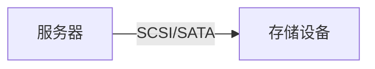
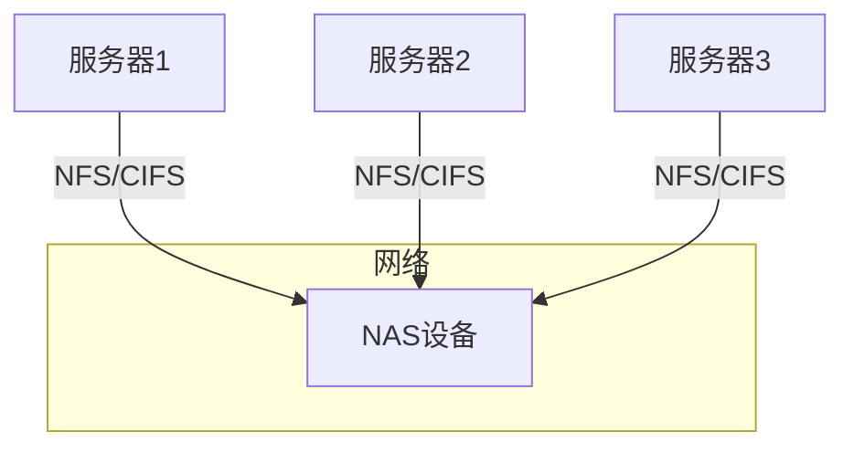
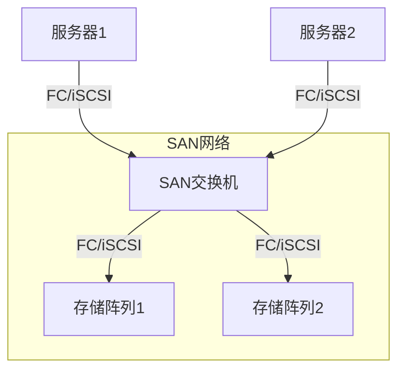
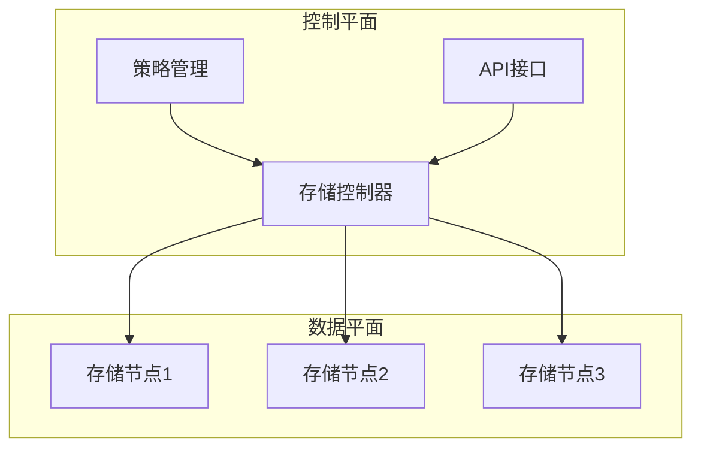
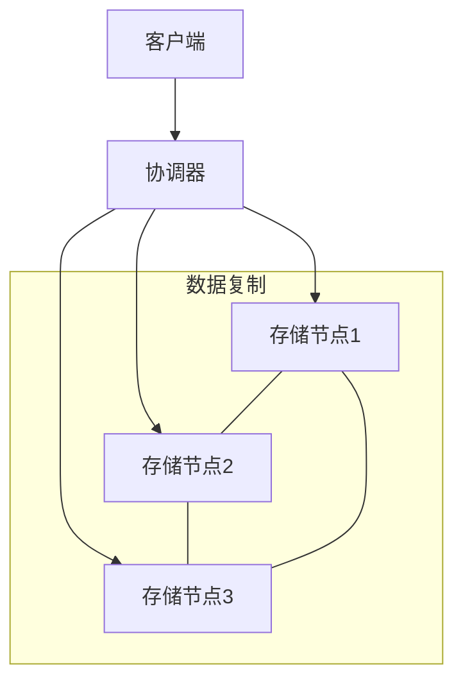
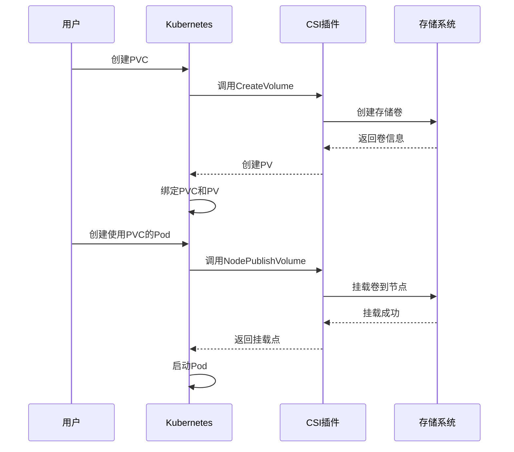

# 云原生存储技术演进

## 存储技术的发展历程

### 传统存储时代（1980s-2000s）

传统存储技术主要围绕物理硬件设备展开，这一阶段的存储解决方案主要包括：

#### 直连存储（DAS）

直连存储（Direct Attached Storage）是最早的企业级存储形式，它将存储设备直接连接到服务器。

- **工作原理**：存储设备（如硬盘）通过接口（如SCSI、SATA）直接连接到单台服务器
- **特点**：
  - 结构简单，易于实施
  - 成本相对较低
  - 访问速度快，延迟低
- **局限性**：
  - 存储资源无法共享
  - 扩展性受限
  - 数据备份和恢复复杂



#### 网络附加存储（NAS）

网络附加存储（Network Attached Storage）通过网络提供文件级的数据访问服务。

- **工作原理**：专用存储设备通过TCP/IP网络连接到多台服务器，提供文件共享服务
- **协议**：主要使用NFS（Network File System）和CIFS（Common Internet File System）协议
- **特点**：
  - 支持多服务器共享存储
  - 文件级访问，易于管理
  - 适合非结构化数据存储（文档、图片、视频等）
- **应用场景**：文件共享、协作环境、内容管理系统



#### 存储区域网络（SAN）

存储区域网络（Storage Area Network）提供了块级存储访问，为企业级应用提供高性能存储解决方案。

- **工作原理**：通过专用高速网络（如光纤通道）连接服务器和存储设备
- **协议**：主要使用FC（Fibre Channel）、iSCSI（Internet Small Computer System Interface）
- **特点**：
  - 高性能、低延迟
  - 块级访问，适合数据库等应用
  - 支持高级功能（如快照、复制）
  - 高可用性和可靠性
- **局限性**：
  - 实施和管理复杂
  - 成本高昂
  - 专业技能要求高



### 虚拟化存储时代（2000s-2010s）

随着服务器虚拟化技术的发展，存储技术也开始向虚拟化方向演进，主要包括：

#### 存储虚拟化

存储虚拟化将物理存储资源抽象为逻辑资源池，实现了存储资源的统一管理。

- **工作原理**：在物理存储设备之上添加虚拟化层，将多个物理存储设备呈现为单一逻辑资源
- **特点**：
  - 提高存储利用率
  - 简化存储管理
  - 支持异构存储设备整合
  - 实现存储资源动态分配
- **关键技术**：
  - 存储池（Storage Pool）
  - 精简配置（Thin Provisioning）
  - 数据迁移（Data Migration）

#### 软件定义存储（SDS）

软件定义存储（Software-Defined Storage）将存储功能从硬件中分离出来，通过软件实现存储管理和功能。

- **核心理念**：存储控制平面与数据平面分离
- **特点**：
  - 基于商用硬件构建
  - 可编程API接口
  - 自动化管理
  - 弹性扩展
- **代表技术**：
  - VMware vSAN
  - Microsoft Storage Spaces
  - Ceph
  - GlusterFS



#### 统一存储

统一存储（Unified Storage）将文件存储（NAS）和块存储（SAN）功能整合到单一平台。

- **工作原理**：同一套存储系统同时支持文件访问协议（NFS/CIFS）和块访问协议（FC/iSCSI）
- **优势**：
  - 简化基础设施
  - 降低总体拥有成本（TCO）
  - 统一管理界面
  - 提高资源利用率
- **应用场景**：混合工作负载环境，需要同时支持结构化和非结构化数据的企业

## 云原生存储时代（2010s至今）

随着云计算和容器技术的兴起，存储技术进入了云原生时代，主要特点包括：

### 分布式存储系统

分布式存储系统是云原生存储的基础，它将数据分散存储在多个节点上，提供高可用性和可扩展性。

- **核心特性**：
  - 水平扩展（Scale-out）架构
  - 数据分片和复制
  - 自动负载均衡
  - 故障自动恢复
- **代表技术**：
  - Ceph：统一的分布式存储系统，支持对象、块和文件存储
  - HDFS：Hadoop分布式文件系统，为大数据处理优化
  - MinIO：高性能对象存储服务器
  - GlusterFS：可扩展的网络文件系统



### 容器存储接口（CSI）

容器存储接口（Container Storage Interface）是Kubernetes等容器编排平台与存储系统之间的标准接口。

- **设计目标**：
  - 提供标准化的存储插件机制
  - 支持第三方存储系统集成
  - 不依赖于特定容器编排系统
- **核心组件**：
  - CSI Controller：处理卷的创建、删除等管理操作
  - CSI Node：负责将存储卷挂载到容器
  - CSI Identity：提供插件身份信息
- **工作流程**：
  1. 用户创建PVC（PersistentVolumeClaim）
  2. Kubernetes调用CSI插件创建PV（PersistentVolume）
  3. 当Pod调度到节点时，CSI Node组件将卷挂载到容器



### 对象存储

对象存储是云原生应用的主要存储方式之一，它通过HTTP/HTTPS协议提供RESTful API访问。

- **核心概念**：
  - 对象：数据的基本单位，包含数据、元数据和唯一标识符
  - 桶（Bucket）：对象的容器，用于组织和控制对象访问
- **特点**：
  - 无限扩展能力
  - 高耐久性和可用性
  - 丰富的元数据支持
  - 基于HTTP的简单访问方式
- **代表产品**：
  - Amazon S3
  - Google Cloud Storage
  - Azure Blob Storage
  - MinIO
  - Ceph RADOS Gateway

### 云原生数据库

云原生数据库是专为云环境设计的数据库系统，具有弹性扩展、高可用和自动化运维等特性。

- **类型**：
  - 关系型：Amazon Aurora、Google Cloud Spanner、CockroachDB
  - NoSQL：MongoDB Atlas、Amazon DynamoDB、Azure Cosmos DB
  - 时序数据库：InfluxDB、Prometheus TSDB
  - 图数据库：Neo4j、Amazon Neptune
- **特点**：
  - 分布式架构
  - 自动分片
  - 多区域复制
  - 自动扩缩容
  - 按需付费模式

### 存储即服务（STaaS）

存储即服务（Storage as a Service）是云服务提供商提供的托管存储服务，用户无需管理底层基础设施。

- **服务模式**：
  - 块存储服务：AWS EBS、Azure Disk Storage
  - 文件存储服务：AWS EFS、Azure Files、Google Filestore
  - 对象存储服务：AWS S3、Google Cloud Storage、Azure Blob Storage
- **优势**：
  - 无需前期投资
  - 按使用量付费
  - 高可靠性和可用性
  - 简化管理和维护
  - 全球分布式访问

## 云原生存储关键技术

### 数据持久化

在容器环境中，数据持久化是一个关键挑战，主要解决方案包括：

#### Kubernetes持久卷

Kubernetes提供了PersistentVolume（PV）和PersistentVolumeClaim（PVC）机制来管理持久化存储。

- **PV**：代表集群中的存储资源，由管理员创建或通过存储类动态配置
- **PVC**：用户对存储的请求，类似于Pod对CPU和内存的请求
- **StorageClass**：定义存储的"类"，支持动态配置PV

```yaml
# StorageClass示例
apiVersion: storage.k8s.io/v1
kind: StorageClass
metadata:
  name: fast
provisioner: kubernetes.io/aws-ebs
parameters:
  type: gp2
reclaimPolicy: Retain

# PVC示例
apiVersion: v1
kind: PersistentVolumeClaim
metadata:
  name: myclaim
spec:
  accessModes:
    - ReadWriteOnce
  storageClassName: fast
  resources:
    requests:
      storage: 8Gi

# Pod使用PVC示例
apiVersion: v1
kind: Pod
metadata:
  name: mypod
spec:
  containers:
    - name: mycontainer
      image: nginx
      volumeMounts:
        - mountPath: "/var/www/html"
          name: mypd
  volumes:
    - name: mypd
      persistentVolumeClaim:
        claimName: myclaim
```

#### 容器本地存储

容器本地存储是指容器内部的临时存储空间，适用于非持久化数据。

- **类型**：
  - emptyDir：Pod生命周期内的临时目录
  - hostPath：使用节点上的文件或目录
  - configMap和secret：用于配置和敏感数据

### 数据复制与同步

为了保证数据的高可用性和灾难恢复能力，云原生存储系统通常实现多种数据复制机制：

- **同步复制**：写操作必须在所有副本上完成才返回成功，保证强一致性
- **异步复制**：主副本完成写操作后立即返回，数据异步复制到其他副本
- **多区域复制**：数据跨地理区域复制，提供灾难恢复能力
- **反熵机制**：后台进程定期比较副本间数据差异并同步，修复不一致

### 数据一致性模型

云原生存储系统支持不同的一致性模型，以平衡可用性、性能和一致性：

- **强一致性**：所有读操作都能看到最新写入的数据
- **最终一致性**：系统保证在没有新更新的情况下，最终所有副本都会收敛到相同状态
- **因果一致性**：保证有因果关系的操作按正确顺序被观察到
- **会话一致性**：在同一会话内保证读取到自己写入的数据

### 存储性能优化

云原生存储系统采用多种技术来优化性能：

- **缓存层**：使用内存缓存加速读取操作
- **预读和预写**：预测性地加载或写入数据
- **数据分层**：根据访问频率将数据存储在不同性能层级的存储介质上
- **数据压缩**：减少存储空间和网络传输量
- **数据去重**：消除重复数据，节省存储空间

## 云原生存储最佳实践

### 存储架构设计

设计云原生存储架构时应考虑以下因素：

- **应用需求分析**：了解应用的IO模式、吞吐量和延迟要求
- **数据分类**：根据数据特性选择合适的存储类型
- **多层存储策略**：热数据使用高性能存储，冷数据使用低成本存储
- **容灾设计**：规划数据备份和恢复策略
- **安全考虑**：加密、访问控制和审计

### 容器环境存储配置

在Kubernetes等容器环境中配置存储时的最佳实践：

- **使用StorageClass实现动态配置**：避免手动创建PV
- **正确设置访问模式**：根据应用需求选择ReadWriteOnce、ReadOnlyMany或ReadWriteMany
- **合理规划资源请求**：避免过度配置或配置不足
- **使用卷快照进行备份**：利用CSI卷快照功能实现应用一致性备份
- **实施存储监控**：监控存储使用率、性能和健康状态

### 数据备份与恢复

云原生环境中的数据备份与恢复策略：

- **定期备份**：根据RPO（恢复点目标）设置备份频率
- **备份验证**：定期测试备份的有效性
- **多级备份**：实施3-2-1备份策略（3份数据，2种介质，1份异地）
- **自动化备份流程**：使用工具如Velero自动化Kubernetes备份
- **应用一致性备份**：确保备份时应用数据处于一致状态

## 未来趋势

云原生存储技术正在快速发展，未来趋势包括：

### 存储与计算融合

- **超融合基础设施（HCI）**：将存储、计算和网络整合到单一平台
- **计算存储融合**：在存储设备上执行数据处理，减少数据移动
- **存储侧AI加速**：存储系统内置AI处理能力

### 自动化与智能化

- **AI驱动的存储管理**：使用机器学习优化存储配置和性能
- **自修复系统**：自动检测和修复存储问题
- **预测性维护**：预测潜在故障并提前采取行动

### 新型存储技术

- **持久内存**：如Intel Optane，提供接近内存的性能和持久性
- **计算表达式存储**：支持在存储层执行复杂查询
- **量子存储**：利用量子技术实现超高密度存储

### 多云存储策略

- **存储抽象层**：统一管理多云环境中的存储资源
- **数据流动性**：在不同云环境间无缝迁移数据
- **全局命名空间**：跨云环境的统一数据访问

## 总结

云原生存储技术的演进反映了IT基础设施向更加灵活、弹性和自动化方向发展的趋势。从传统的直连存储到现代的分布式云原生存储系统，每一次技术变革都为应用提供了更好的性能、可靠性和可扩展性。

随着容器和微服务架构的普及，云原生存储将继续发展，以满足新型应用的需求。企业在选择和实施存储解决方案时，应充分考虑应用特性、性能需求和成本因素，采用适合自身业务场景的存储架构。

未来，随着新技术的出现和成熟，云原生存储将进一步简化管理、提高效率并降低成本，为数字化转型提供强大支持。