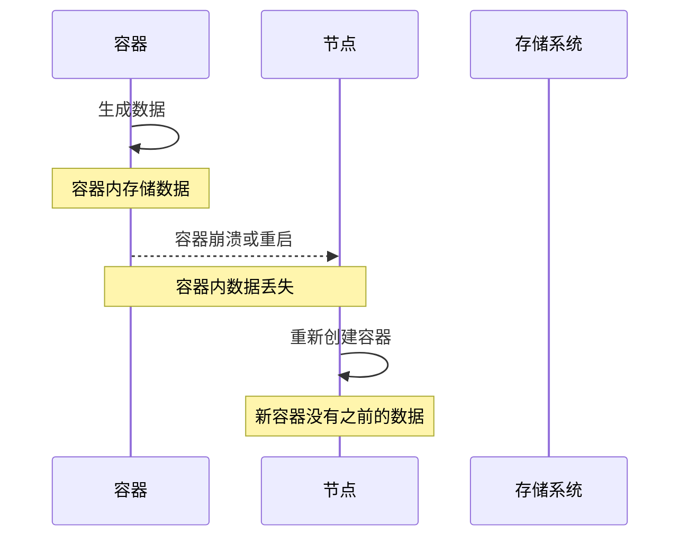
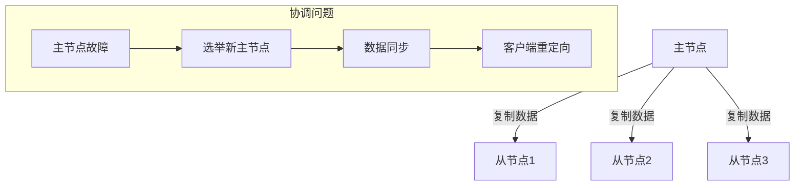
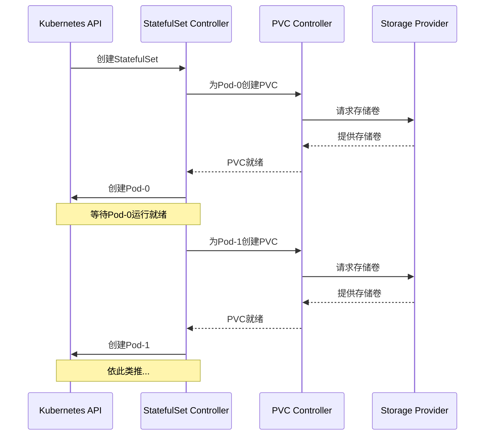
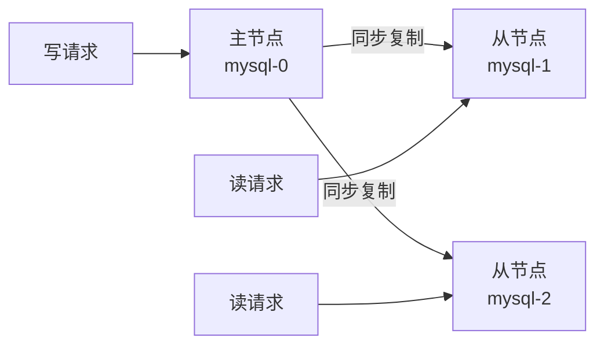
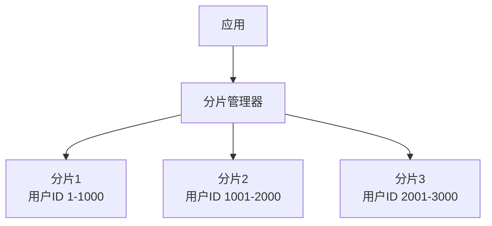
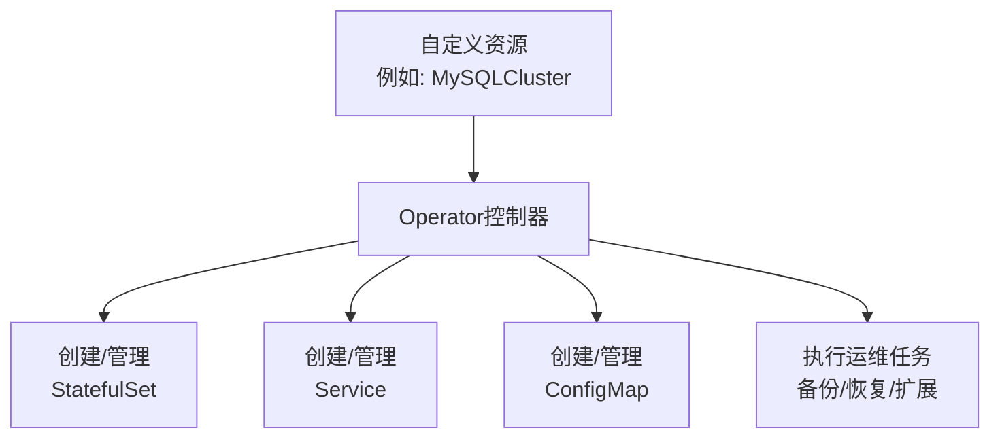
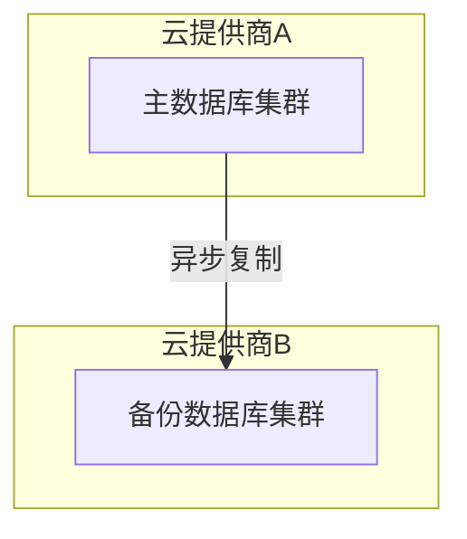
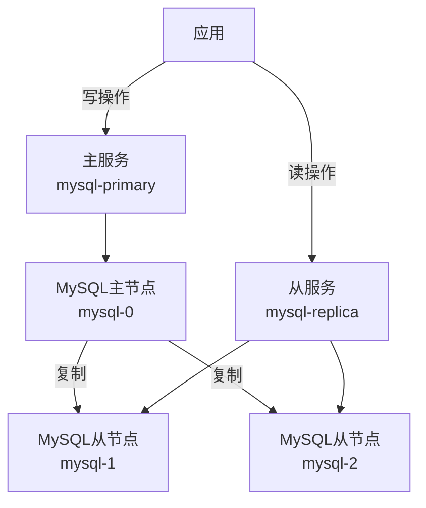
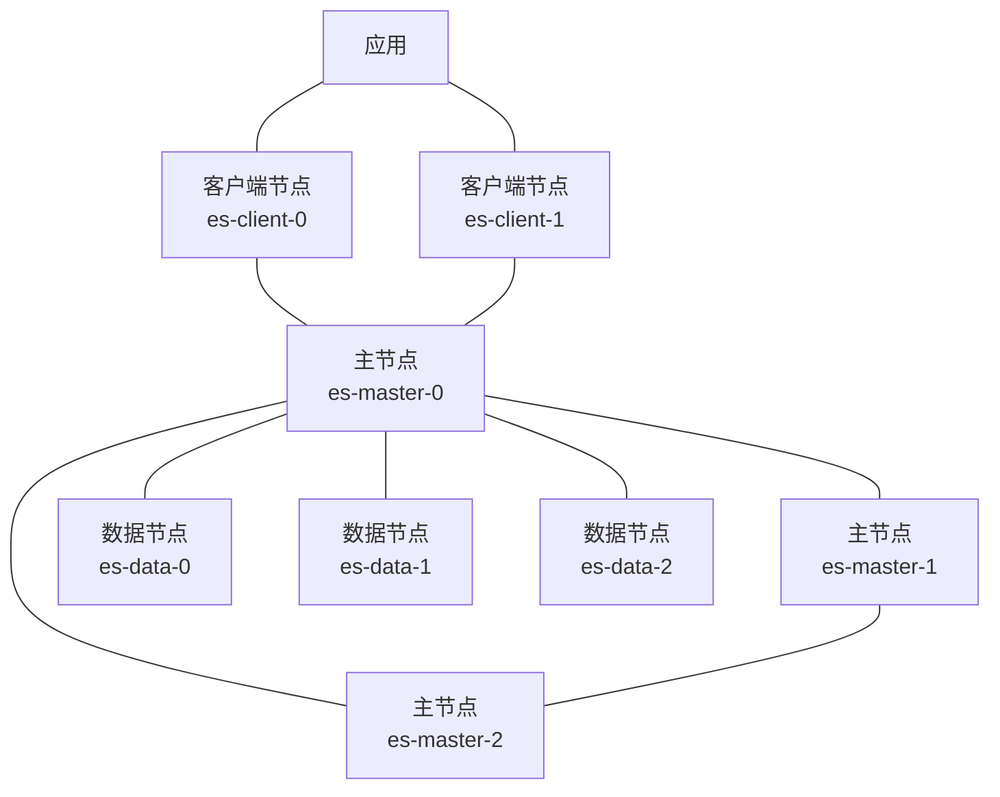

# 有状态应用挑战与解决方案

## 有状态应用的基本概念

有状态应用是指需要持久化数据的应用程序，这些应用在运行过程中会产生需要保存的状态信息。与无状态应用不同，有状态应用的实例不能随意替换，因为它们维护着重要的业务数据和状态。

### 有状态与无状态应用对比

| 特性 | 有状态应用 | 无状态应用 |
|------|------------|------------|
| 数据存储 | 需要持久化存储 | 不需要持久化存储 |
| 实例替换 | 不可随意替换 | 可以随意替换 |
| 扩展难度 | 较难 | 较容易 |
| 部署复杂性 | 高 | 低 |
| 典型例子 | 数据库、消息队列、文件系统 | Web服务器、API网关、函数计算 |

### 常见的有状态应用类型

1. **数据库系统**：
   - 关系型数据库：MySQL、PostgreSQL、Oracle
   - NoSQL数据库：MongoDB、Cassandra、Redis
   - 时序数据库：InfluxDB、Prometheus

2. **消息中间件**：
   - Kafka
   - RabbitMQ
   - RocketMQ

3. **分布式文件系统**：
   - HDFS
   - Ceph
   - GlusterFS

4. **搜索引擎**：
   - Elasticsearch
   - Solr

## 云原生环境中的挑战

在云原生环境（特别是Kubernetes）中部署有状态应用面临以下主要挑战：

### 1. 数据持久性挑战

容器本质上是临时性的，当容器重启或重新调度时，容器内的数据会丢失。这对有状态应用来说是致命的。



### 2. 网络标识挑战

有状态应用通常需要稳定的网络标识（如主机名、IP地址），以便其他服务能够可靠地连接到它们。然而，在容器环境中，容器的IP地址和主机名在重启后通常会发生变化。

### 3. 有序部署和扩展

许多有状态应用需要按特定顺序进行部署、扩展和更新。例如，数据库集群中的主节点需要先于从节点启动，或者在扩展时需要遵循特定的数据再平衡过程。

### 4. 备份和恢复

在云原生环境中实现有状态应用的备份和恢复比传统环境更加复杂，需要考虑容器生命周期、数据一致性和分布式系统特性。

### 5. 多实例协调

有状态应用的多个实例之间通常需要协调工作，例如选主、数据同步等，这在动态的容器环境中实现起来更具挑战性。



### 6. 资源管理

有状态应用通常对资源（CPU、内存、存储I/O）有特定要求，需要精细的资源管理和隔离机制。

## 解决方案与最佳实践

### Kubernetes中的StatefulSet

StatefulSet是Kubernetes专为有状态应用设计的工作负载API对象，它解决了许多有状态应用在容器环境中面临的挑战。

#### StatefulSet的核心特性

1. **稳定的网络标识**：
   - 每个Pod获得稳定的主机名和DNS记录
   - 命名模式：`<statefulset-name>-<ordinal-index>`
   - 例如：`mysql-0`, `mysql-1`, `mysql-2`

2. **有序部署和扩展**：
   - 按顺序创建Pod（从0到N-1）
   - 按反序删除Pod（从N-1到0）
   - 一个Pod必须处于Running和Ready状态后才会创建下一个Pod

3. **稳定的存储**：
   - 使用PersistentVolumeClaim为每个Pod提供持久存储
   - 即使Pod重新调度到不同节点，存储也会跟随Pod

#### StatefulSet示例

以下是一个MySQL StatefulSet的简化示例：

```yaml
apiVersion: apps/v1
kind: StatefulSet
metadata:
  name: mysql
spec:
  selector:
    matchLabels:
      app: mysql
  serviceName: mysql
  replicas: 3
  template:
    metadata:
      labels:
        app: mysql
    spec:
      containers:
      - name: mysql
        image: mysql:5.7
        env:
        - name: MYSQL_ROOT_PASSWORD
          valueFrom:
            secretKeyRef:
              name: mysql-secret
              key: password
        ports:
        - containerPort: 3306
          name: mysql
        volumeMounts:
        - name: data
          mountPath: /var/lib/mysql
  volumeClaimTemplates:
  - metadata:
      name: data
    spec:
      accessModes: ["ReadWriteOnce"]
      storageClassName: "standard"
      resources:
        requests:
          storage: 10Gi
```

#### StatefulSet工作原理



### 持久卷与存储类

Kubernetes提供了持久卷（PersistentVolume，PV）和持久卷声明（PersistentVolumeClaim，PVC）机制来管理存储资源。

#### 持久卷生命周期

1. **配置**：管理员创建PV或配置StorageClass实现动态配置
2. **绑定**：用户创建PVC，Kubernetes将其与合适的PV绑定
3. **使用**：Pod使用PVC挂载存储
4. **释放**：Pod删除后，PVC可以被删除
5. **回收**：PV根据回收策略（Retain、Delete、Recycle）进行处理

#### 存储类（StorageClass）

StorageClass允许管理员描述他们提供的存储"类"，并使用户能够动态请求所需的存储资源。

```yaml
apiVersion: storage.k8s.io/v1
kind: StorageClass
metadata:
  name: fast
provisioner: kubernetes.io/aws-ebs
parameters:
  type: gp2
  fsType: ext4
reclaimPolicy: Retain
allowVolumeExpansion: true
```

#### 存储选择最佳实践

1. **根据应用需求选择合适的存储类型**：
   - 高性能数据库：使用SSD或NVMe存储
   - 日志存储：可以使用标准磁盘
   - 共享文件系统：选择支持ReadWriteMany访问模式的存储

2. **考虑数据持久性要求**：
   - 关键业务数据：使用多副本或跨区域复制的存储
   - 临时数据：可以使用本地存储提高性能

3. **评估性能需求**：
   - IOPS（每秒输入/输出操作）
   - 吞吐量
   - 延迟

### 有状态应用的备份与恢复

#### 备份策略

1. **快照备份**：
   - 利用云提供商的卷快照功能
   - 使用Kubernetes CSI快照功能

   ```yaml
   apiVersion: snapshot.storage.k8s.io/v1
   kind: VolumeSnapshot
   metadata:
     name: mysql-snapshot
   spec:
     volumeSnapshotClassName: csi-hostpath-snapclass
     source:
       persistentVolumeClaimName: data-mysql-0
   ```

2. **应用级备份**：
   - 使用应用自身的备份工具（如mysqldump）
   - 结合Kubernetes Job实现定期备份

   ```yaml
   apiVersion: batch/v1
   kind: CronJob
   metadata:
     name: mysql-backup
   spec:
     schedule: "0 2 * * *"
     jobTemplate:
       spec:
         template:
           spec:
             containers:
             - name: backup
               image: mysql:5.7
               command:
               - /bin/sh
               - -c
               - |
                 mysqldump -h mysql-0.mysql --all-databases > /backup/backup-$(date +%Y%m%d).sql
               volumeMounts:
               - name: backup-volume
                 mountPath: /backup
             volumes:
             - name: backup-volume
               persistentVolumeClaim:
                 claimName: mysql-backup-pvc
             restartPolicy: OnFailure
   ```

3. **使用专门的备份工具**：
   - Velero：Kubernetes集群备份工具
   - Kasten K10：专注于Kubernetes数据管理的平台
   - Stash：Kubernetes原生备份工具

#### 恢复策略

1. **从快照恢复**：
   - 创建基于快照的新PVC
   - 将新PVC挂载到Pod

   ```yaml
   apiVersion: v1
   kind: PersistentVolumeClaim
   metadata:
     name: mysql-restored
   spec:
     dataSource:
       name: mysql-snapshot
       kind: VolumeSnapshot
       apiGroup: snapshot.storage.k8s.io
     accessModes:
       - ReadWriteOnce
     resources:
       requests:
         storage: 10Gi
   ```

2. **应用级恢复**：
   - 使用应用自身的恢复工具
   - 结合Kubernetes Job实现恢复过程

3. **灾难恢复演练**：
   - 定期测试备份恢复流程
   - 记录恢复时间目标（RTO）和恢复点目标（RPO）

### 高可用性设计

#### 多副本部署

使用StatefulSet部署多个副本，并实现适当的主从架构或集群模式。

```yaml
apiVersion: apps/v1
kind: StatefulSet
metadata:
  name: mysql
spec:
  replicas: 3  # 多副本部署
  # ... 其他配置 ...
```

#### 反亲和性调度

确保应用的多个实例分布在不同的节点上，避免单点故障。

```yaml
spec:
  template:
    spec:
      affinity:
        podAntiAffinity:
          requiredDuringSchedulingIgnoredDuringExecution:
          - labelSelector:
              matchExpressions:
              - key: app
                operator: In
                values:
                - mysql
            topologyKey: "kubernetes.io/hostname"
```

#### 自动故障转移

实现自动故障检测和故障转移机制，例如：

1. **使用Operator**：
   - MySQL Operator
   - Elasticsearch Operator
   - Redis Operator

2. **利用服务发现**：
   - Kubernetes Service
   - Headless Service

```yaml
apiVersion: v1
kind: Service
metadata:
  name: mysql
  labels:
    app: mysql
spec:
  ports:
  - port: 3306
    name: mysql
  clusterIP: None  # Headless Service
  selector:
    app: mysql
```

3. **健康检查与自愈**：
   - 配置适当的liveness和readiness探针
   - 实现自动重启和恢复机制

```yaml
spec:
  containers:
  - name: mysql
    # ... 其他配置 ...
    livenessProbe:
      exec:
        command:
        - mysqladmin
        - ping
      initialDelaySeconds: 30
      periodSeconds: 10
      timeoutSeconds: 5
    readinessProbe:
      exec:
        command:
        - mysql
        - -h
        - 127.0.0.1
        - -e
        - "SELECT 1"
      initialDelaySeconds: 5
      periodSeconds: 2
      timeoutSeconds: 1
```

### 数据一致性与复制

#### 主从复制

许多数据库系统支持主从复制模式，可以在Kubernetes中实现：



#### 共识算法

对于需要强一致性的系统，可以实现基于共识算法的复制：

1. **Raft**：
   - etcd
   - Consul

2. **Paxos**：
   - Chubby
   - Spanner

3. **ZAB**：
   - ZooKeeper

#### 数据分片

对于大规模数据，可以实现数据分片策略：



### 网络配置与服务发现

#### Headless Service

Headless Service为StatefulSet中的每个Pod提供DNS记录，格式为：`<pod-name>.<service-name>.<namespace>.svc.cluster.local`

```yaml
apiVersion: v1
kind: Service
metadata:
  name: mysql
spec:
  clusterIP: None  # 定义为Headless Service
  selector:
    app: mysql
  ports:
  - port: 3306
```

#### 服务拓扑

在复杂的有状态应用中，可能需要定义不同的服务入口点：

```yaml
# 主服务（写操作）
apiVersion: v1
kind: Service
metadata:
  name: mysql-primary
spec:
  selector:
    app: mysql
    role: primary
  ports:
  - port: 3306

# 从服务（读操作）
apiVersion: v1
kind: Service
metadata:
  name: mysql-replica
spec:
  selector:
    app: mysql
    role: replica
  ports:
  - port: 3306
```

### 使用Operator管理有状态应用

Operator是Kubernetes的扩展，用于自动化有状态应用的管理。

#### Operator的工作原理



#### 常用的Operator

1. **数据库Operator**：
   - MySQL Operator
   - PostgreSQL Operator
   - MongoDB Operator
   - Redis Operator

2. **消息队列Operator**：
   - Kafka Operator
   - RabbitMQ Operator

3. **搜索引擎Operator**：
   - Elasticsearch Operator

#### Operator示例

以下是使用MySQL Operator创建MySQL集群的示例：

```yaml
apiVersion: mysql.presslabs.org/v1alpha1
kind: MysqlCluster
metadata:
  name: mysql-cluster
spec:
  replicas: 3
  secretName: mysql-secret
  volumeSpec:
    persistentVolumeClaim:
      storageClassName: standard
      accessModes: ["ReadWriteOnce"]
      resources:
        requests:
          storage: 10Gi
```

### 资源管理与性能优化

#### 资源请求与限制

为有状态应用设置适当的资源请求和限制：

```yaml
resources:
  requests:
    memory: "1Gi"
    cpu: "500m"
  limits:
    memory: "2Gi"
    cpu: "1000m"
```

#### 存储性能优化

1. **选择合适的存储类**：
   - 高性能应用：SSD或NVMe
   - 大容量存储：HDD

2. **配置适当的I/O调度器**：
   - 数据库：deadline或noop
   - 文件服务：cfq

3. **使用本地存储提高性能**：
   - 对于需要极高I/O性能的应用

```yaml
apiVersion: storage.k8s.io/v1
kind: StorageClass
metadata:
  name: local-storage
provisioner: kubernetes.io/no-provisioner
volumeBindingMode: WaitForFirstConsumer
```

#### 网络性能优化

1. **使用网络策略限制流量**：
   - 减少不必要的网络通信
   - 提高安全性

2. **考虑网络拓扑**：
   - 将相关服务部署在同一区域
   - 使用亲和性规则优化网络延迟

### 有状态应用的滚动更新

#### 更新策略

StatefulSet支持两种更新策略：

1. **RollingUpdate**：按照与创建相反的顺序（从N-1到0）更新Pod
2. **OnDelete**：仅在手动删除Pod时更新

```yaml
spec:
  updateStrategy:
    type: RollingUpdate
    rollingUpdate:
      partition: 1  # 只更新序号大于等于1的Pod
```

#### 分区更新

使用partition参数实现分阶段更新，先更新部分Pod验证新版本，再更新其余Pod。

#### 蓝绿部署

对于关键的有状态应用，可以实现蓝绿部署策略：

1. 部署新版本的StatefulSet（绿色环境）
2. 迁移数据到新环境
3. 切换流量到新环境
4. 验证后删除旧环境（蓝色环境）

### 多云和混合云部署

#### 数据复制跨云

实现跨云数据复制以提高可用性和灾难恢复能力：



#### 联邦集群

使用Kubernetes Federation在多个集群间协调有状态应用的部署：

```yaml
apiVersion: types.kubefed.io/v1beta1
kind: FederatedStatefulSet
metadata:
  name: mysql
  namespace: mysql
spec:
  template:
    spec:
      replicas: 3
      # ... StatefulSet配置 ...
  placement:
    clusters:
    - name: cluster1
    - name: cluster2
  overrides:
  - clusterName: cluster2
    clusterOverrides:
    - path: "/spec/replicas"
      value: 2
```

## 实际案例分析

### 案例一：MySQL集群在Kubernetes中的部署

#### 架构设计



#### 关键配置

1. **StatefulSet配置**：
   - 3个副本（1主2从）
   - 使用ConfigMap存储配置
   - 使用Secret存储密码

2. **初始化容器**：
   - 配置主从关系
   - 设置复制用户

3. **服务配置**：
   - Headless Service用于DNS解析
   - 主服务和从服务分别用于写和读

#### 备份策略

1. 每日全量备份（使用CronJob）
2. 二进制日志持久化存储
3. 定期备份验证

### 案例二：Elasticsearch集群在Kubernetes中的部署

#### 架构设计



#### 关键配置

1. **多StatefulSet部署**：
   - 主节点StatefulSet
   - 数据节点StatefulSet
   - 客户端节点StatefulSet

2. **资源配置**：
   - 主节点：低CPU，中等内存
   - 数据节点：高CPU，高内存，高存储
   - 客户端节点：中等CPU，中等内存

3. **网络配置**：
   - 内部通信使用Headless Service
   - 外部访问通过客户端节点Service

#### 数据管理

1. 使用Elasticsearch Snapshot API进行备份
2. 实现索引生命周期管理
3. 使用Curator进行索引维护

## 总结与最佳实践

### 设计原则

1. **状态分离**：尽可能将状态与应用逻辑分离
2. **弹性设计**：设计应用以适应容器环境的动态特性
3. **自动化运维**：利用Operator实现自动化管理
4. **数据安全**：实施多层次的数据保护策略
5. **监控与可观测性**：全面监控有状态应用的健康状态

### 部署清单

在Kubernetes中部署有状态应用时，通常需要以下资源：

1. **StatefulSet**：管理有状态应用的Pod
2. **PersistentVolumeClaim**：请求持久存储
3. **ConfigMap**：存储配置信息
4. **Secret**：存储敏感信息
5. **Service**：提供网络访问
6. **ServiceAccount**：定义权限
7. **NetworkPolicy**：控制网络流量
8. **PodDisruptionBudget**：控制中断影响

### 未来趋势

1. **Operator生态系统的扩展**：更多专业化的Operator
2. **存储技术的进步**：更好的性能和可靠性
3. **多云数据管理**：跨云数据复制和管理
4. **自愈系统**：更智能的故障检测和恢复
5. **声明式数据管理**：更简单的数据生命周期管理

通过理解这些挑战并采用适当的解决方案，开发团队可以在云原生环境中成功部署和管理有状态应用，充分利用容器化和编排技术的优势，同时确保数据的持久性、一致性和可用性。