# 分布式存储系统原理

## 分布式存储基础概念

分布式存储系统是将数据分散存储在多个物理节点上，通过网络连接形成一个逻辑整体的存储系统。与传统的集中式存储相比，分布式存储能够提供更高的可扩展性、可用性和容错能力。

### 分布式存储的核心特性

1. **可扩展性（Scalability）**：
   - 水平扩展：通过增加节点数量来提高系统容量和性能
   - 垂直扩展：通过提升单个节点的硬件配置来提高性能

2. **高可用性（High Availability）**：
   - 数据冗余：多副本存储确保数据不会因单点故障而丢失
   - 故障检测：自动检测节点故障
   - 自动恢复：在节点故障后自动恢复数据

3. **容错性（Fault Tolerance）**：
   - 系统能够在部分节点故障的情况下继续正常运行
   - 通过冗余和错误恢复机制实现

4. **一致性（Consistency）**：
   - 确保分布在不同节点上的数据副本保持一致
   - 根据应用需求提供不同级别的一致性保证

### 分布式存储系统分类

根据提供的接口和抽象级别，分布式存储系统可分为三类：

#### 1. 分布式文件存储

提供类似于传统文件系统的接口，支持文件和目录操作。

- **代表系统**：
  - HDFS (Hadoop Distributed File System)
  - GlusterFS
  - Ceph FS
  - Amazon EFS (Elastic File System)

- **特点**：
  - 支持POSIX或类POSIX文件操作
  - 适合存储大文件和顺序访问模式
  - 通常提供强一致性保证

#### 2. 分布式块存储

提供类似于物理硬盘的块级存储接口，应用可以直接读写数据块。

- **代表系统**：
  - Ceph RBD (RADOS Block Device)
  - Amazon EBS (Elastic Block Store)
  - OpenStack Cinder

- **特点**：
  - 低级别存储抽象，应用可以实现自己的文件系统
  - 适合数据库等需要直接控制存储的应用
  - 通常提供强一致性保证

#### 3. 分布式对象存储

将数据作为对象存储，每个对象包含数据、元数据和唯一标识符。

- **代表系统**：
  - Amazon S3 (Simple Storage Service)
  - OpenStack Swift
  - Ceph RADOSGW
  - MinIO

- **特点**：
  - 通过HTTP/HTTPS提供RESTful API访问
  - 适合存储大量非结构化数据
  - 高可扩展性和弹性
  - 通常提供最终一致性保证

## 分布式存储系统架构

### 基本架构组件

分布式存储系统通常由以下核心组件构成：

#### 1. 客户端（Client）

- 提供API或接口供应用程序访问存储系统
- 负责将用户请求转换为系统内部操作

#### 2. 元数据服务（Metadata Service）

- 管理文件/对象的元数据信息（如名称、大小、权限、位置等）
- 提供命名空间管理和目录服务
- 在某些系统中作为中央协调者

#### 3. 数据节点（Data Node）

- 实际存储数据的服务器
- 负责数据的读写、复制和恢复

#### 4. 监控和管理服务（Monitor & Manager）

- 监控系统健康状态
- 检测节点故障
- 协调数据恢复和负载均衡

### 典型架构模式

#### 集中式元数据架构

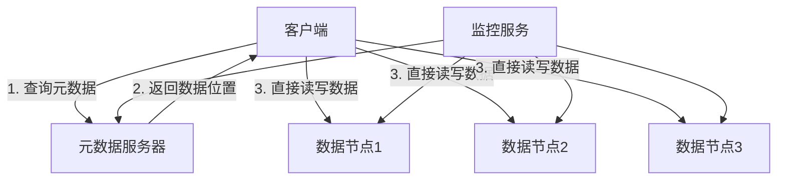

- **代表系统**：HDFS
- **优点**：
  - 元数据管理简单
  - 全局一致性容易实现
- **缺点**：
  - 元数据服务器可能成为性能瓶颈
  - 单点故障风险（通常通过高可用配置缓解）

#### 分布式元数据架构

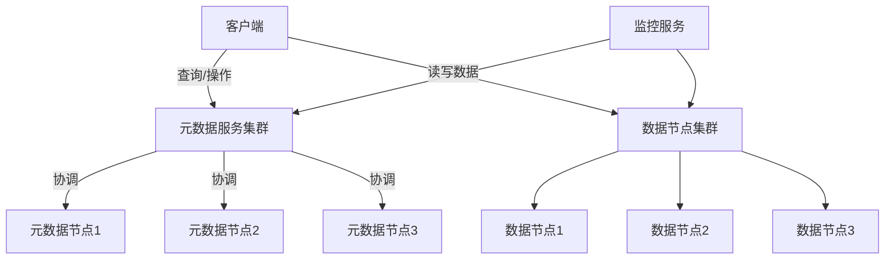

- **代表系统**：Ceph, GlusterFS
- **优点**：
  - 避免元数据服务单点瓶颈
  - 更好的可扩展性
- **缺点**：
  - 实现复杂
  - 一致性保证更具挑战性

#### 无中心架构

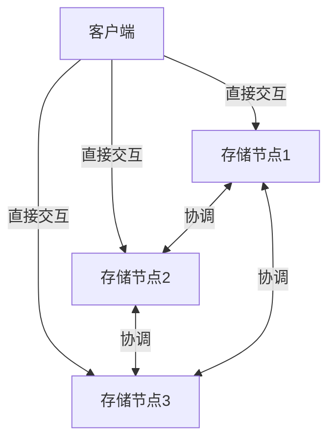

- **代表系统**：某些P2P存储系统
- **优点**：
  - 无单点故障
  - 极高的可扩展性
- **缺点**：
  - 一致性难以保证
  - 管理复杂

## 数据分布与路由

分布式存储系统需要决定如何将数据分散到多个节点上，并在需要时快速定位数据。

### 数据分片（Sharding）

数据分片是将大型数据集分割成更小的、可管理的部分，并将这些部分分布到不同节点上的技术。

#### 分片策略

1. **哈希分片（Hash Sharding）**


- **工作原理**：
  - 对数据标识符（如文件名、对象ID）应用哈希函数
  - 将哈希值对节点数量取模，确定分片位置
- **优点**：
  - 数据分布均匀
  - 定位简单高效
- **缺点**：
  - 节点数量变化时需要大量数据迁移

2. **一致性哈希（Consistent Hashing）**

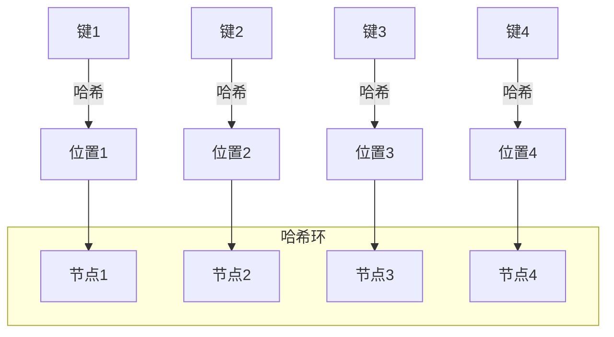

- **工作原理**：
  - 将节点和数据映射到同一个哈希环上
  - 数据存储在哈希环上顺时针方向的第一个节点
- **优点**：
  - 节点增减时只影响相邻节点的数据
  - 最小化数据迁移
- **缺点**：
  - 实现稍复杂
  - 可能出现数据分布不均

3. **范围分片（Range Sharding）**

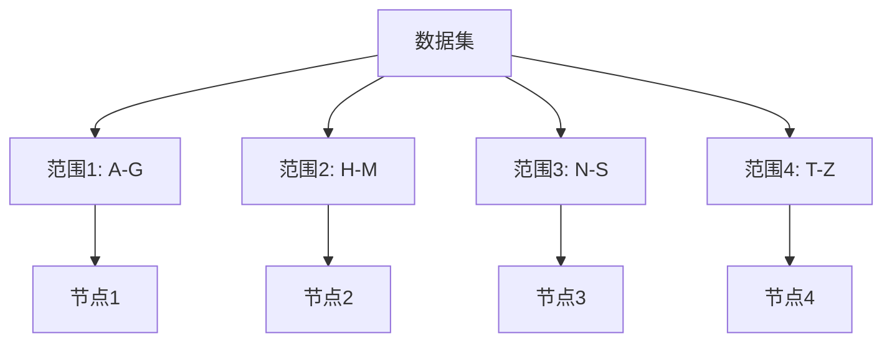

- **工作原理**：
  - 根据键的范围划分数据
  - 每个节点负责特定范围的数据
- **优点**：
  - 支持范围查询
  - 数据局部性好
- **缺点**：
  - 可能导致热点问题
  - 需要中央元数据服务维护范围信息

### 数据路由

数据路由是确定数据位置并将请求导向正确节点的过程。

#### 路由策略

1. **中央目录服务**：
   - 维护一个中央目录，记录所有数据的位置信息
   - 客户端先查询目录服务，再访问相应的数据节点

2. **分布式哈希表（DHT）**：
   - 在节点间分布存储位置信息
   - 每个节点只存储部分路由信息
   - 通过节点间协作完成路由

3. **客户端计算**：
   - 客户端直接计算数据位置
   - 适用于使用确定性算法（如一致性哈希）的系统

## 数据复制与一致性

### 复制策略

为了提高数据可用性和容错能力，分布式存储系统通常会创建多个数据副本。

#### 1. 同步复制（Synchronous Replication）

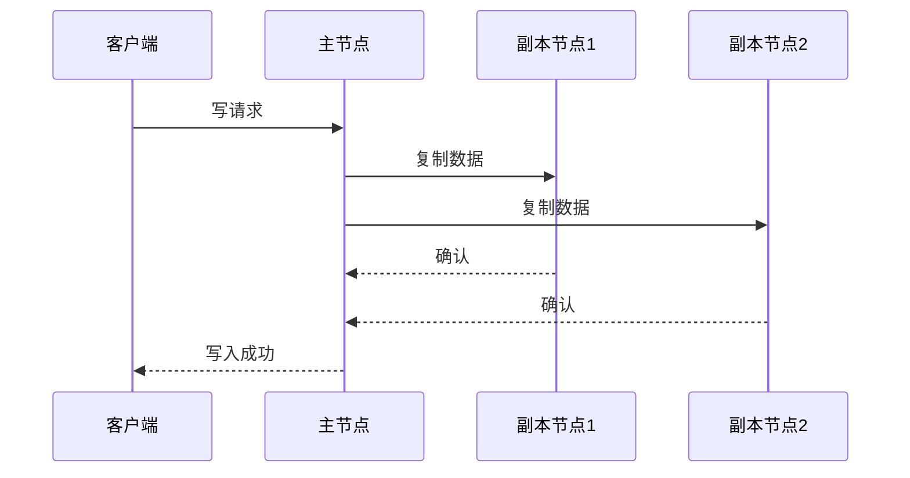

- **工作原理**：
  - 主节点收到写请求后，同时向所有副本节点发送更新
  - 只有当所有（或法定数量）副本确认更新后，才向客户端返回成功
- **优点**：
  - 强一致性保证
  - 数据不会丢失
- **缺点**：
  - 写入延迟高
  - 可用性受限于最慢的副本

#### 2. 异步复制（Asynchronous Replication）

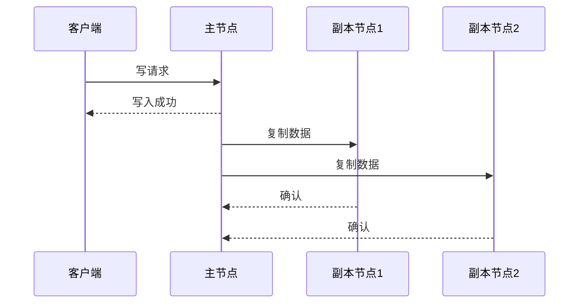

- **工作原理**：
  - 主节点收到写请求后，立即向客户端返回成功
  - 然后在后台异步地将更新发送到副本节点
- **优点**：
  - 低延迟
  - 高吞吐量
- **缺点**：
  - 可能丢失数据
  - 副本之间可能不一致

#### 3. 半同步复制（Semi-synchronous Replication）

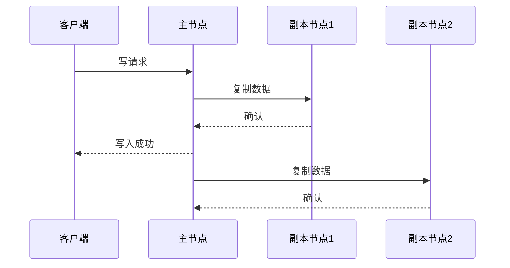

- **工作原理**：
  - 主节点等待至少一个副本确认后，才向客户端返回成功
  - 其余副本异步更新
- **优点**：
  - 平衡了一致性和性能
  - 提供了基本的数据安全保证
- **缺点**：
  - 仍可能出现部分副本不一致

### 一致性模型

分布式系统中的一致性模型定义了系统对外呈现的数据一致性保证。

#### 1. 强一致性（Strong Consistency）

- **特点**：
  - 所有读操作都能看到最近一次成功写入的结果
  - 所有节点上的数据在同一时刻保持一致
- **实现方式**：
  - 同步复制
  - 分布式锁
  - 共识算法（如Paxos、Raft）
- **适用场景**：
  - 金融交易
  - 数据库系统
  - 需要严格数据正确性的应用

#### 2. 最终一致性（Eventual Consistency）

- **特点**：
  - 在没有新更新的情况下，最终所有副本都会收敛到相同状态
  - 短时间内可能读取到旧数据
- **实现方式**：
  - 异步复制
  - 反熵（Anti-entropy）过程
  - 读修复（Read-repair）
- **适用场景**：
  - 社交媒体
  - 内容分发
  - 对一致性要求不严格的应用

#### 3. 因果一致性（Causal Consistency）

- **特点**：
  - 保证因果相关的操作按正确顺序被观察到
  - 不相关的操作可能被不同节点以不同顺序观察到
- **实现方式**：
  - 向量时钟（Vector Clock）
  - 版本向量（Version Vector）
- **适用场景**：
  - 协作应用
  - 分布式数据库

#### 4. 会话一致性（Session Consistency）

- **特点**：
  - 在单个客户端会话内提供读己所写（Read-your-writes）一致性
  - 不同会话之间可能看到不同的数据视图
- **实现方式**：
  - 会话追踪
  - 客户端与特定服务器绑定
- **适用场景**：
  - Web应用
  - 用户配置系统

### CAP定理

CAP定理是分布式系统设计中的基本原则，它指出在分布式系统中，以下三个特性最多只能同时满足两个：

- **一致性（Consistency）**：所有节点在同一时间看到相同的数据
- **可用性（Availability）**：每个请求都能收到响应（成功或失败）
- **分区容错性（Partition Tolerance）**：系统在网络分区的情况下仍能继续运行

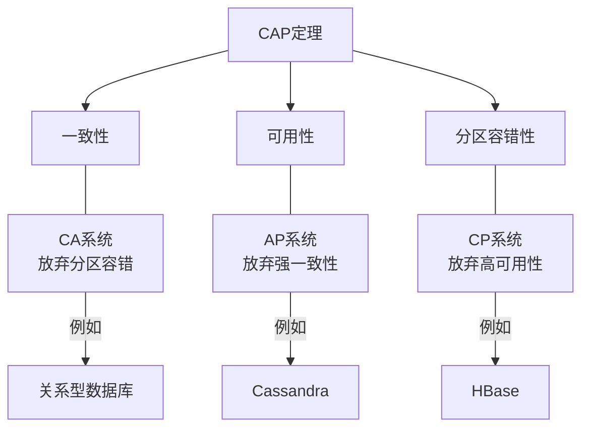

在实际的分布式系统中，由于网络分区是不可避免的，系统设计者通常需要在一致性和可用性之间做出权衡。

## 共识算法

共识算法用于确保分布式系统中的多个节点对某个值达成一致，是实现强一致性的关键技术。

### Paxos算法

Paxos是最早被广泛研究的共识算法之一，由Leslie Lamport提出。

#### 基本角色

- **提议者（Proposer）**：提出提案
- **接受者（Acceptor）**：接受或拒绝提案
- **学习者（Learner）**：学习已被接受的提案

#### 算法流程

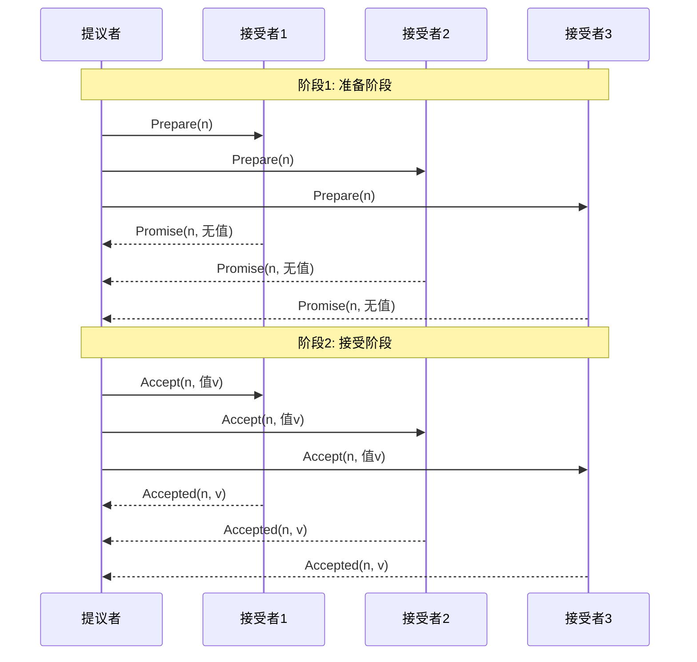

### Raft算法

Raft是一种为易于理解而设计的共识算法，由Diego Ongaro和John Ousterhout提出。

#### 基本角色

- **领导者（Leader）**：处理所有客户端请求，管理日志复制
- **跟随者（Follower）**：被动接收领导者的请求
- **候选者（Candidate）**：在选举过程中的临时角色

#### 算法流程

1. **领导者选举**：
   - 跟随者超时未收到领导者心跳时转变为候选者
   - 候选者向其他节点请求投票
   - 获得多数票的候选者成为新领导者

2. **日志复制**：
   - 领导者接收客户端请求，将其追加到本地日志
   - 领导者将日志条目发送给跟随者
   - 当多数节点确认后，领导者提交该条目
   - 领导者通知跟随者提交条目

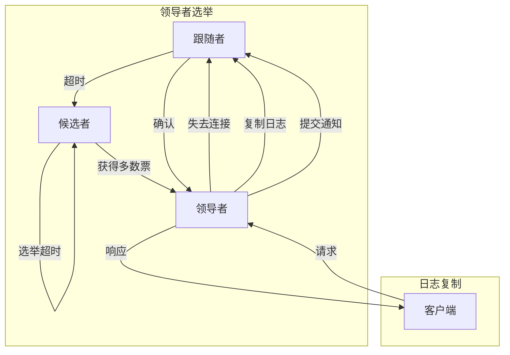

### ZAB协议

ZAB（ZooKeeper Atomic Broadcast）是ZooKeeper使用的原子广播协议。

#### 基本角色

- **领导者（Leader）**：处理写请求，广播更新
- **跟随者（Follower）**：接收领导者的更新，处理读请求
- **观察者（Observer）**：只接收更新，不参与投票

#### 算法流程

1. **领导者选举**：
   - 类似Raft，选出具有最高zxid的节点作为领导者

2. **发现阶段**：
   - 领导者确定系统中最新的事务状态

3. **同步阶段**：
   - 领导者确保所有跟随者与自己同步

4. **广播阶段**：
   - 领导者接收新事务并广播给所有跟随者

## 数据一致性与可靠性保障

### 故障检测与恢复

#### 心跳机制

节点间定期发送心跳消息，检测对方是否存活。

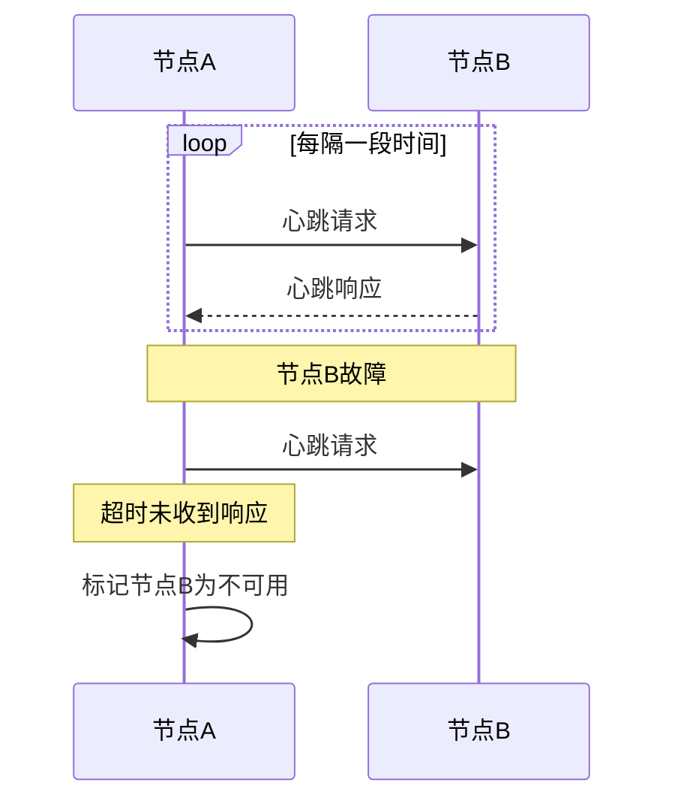

#### 法定人数（Quorum）机制

在分布式系统中，通常使用多数派（majority）作为法定人数，确保在网络分区的情况下最多只有一个分区能够继续运行。

- **法定人数计算**：N/2 + 1（N为节点总数）
- **例如**：5个节点系统的法定人数为3

#### 数据恢复流程

1. **检测到节点故障**
2. **选择新的主节点**（如果故障节点是主节点）
3. **确定需要恢复的数据**
4. **从健康副本复制数据**
5. **验证数据一致性**
6. **恢复服务**

### 数据修复与反熵

#### 读修复（Read Repair）

在读取操作中检测并修复不一致的数据。

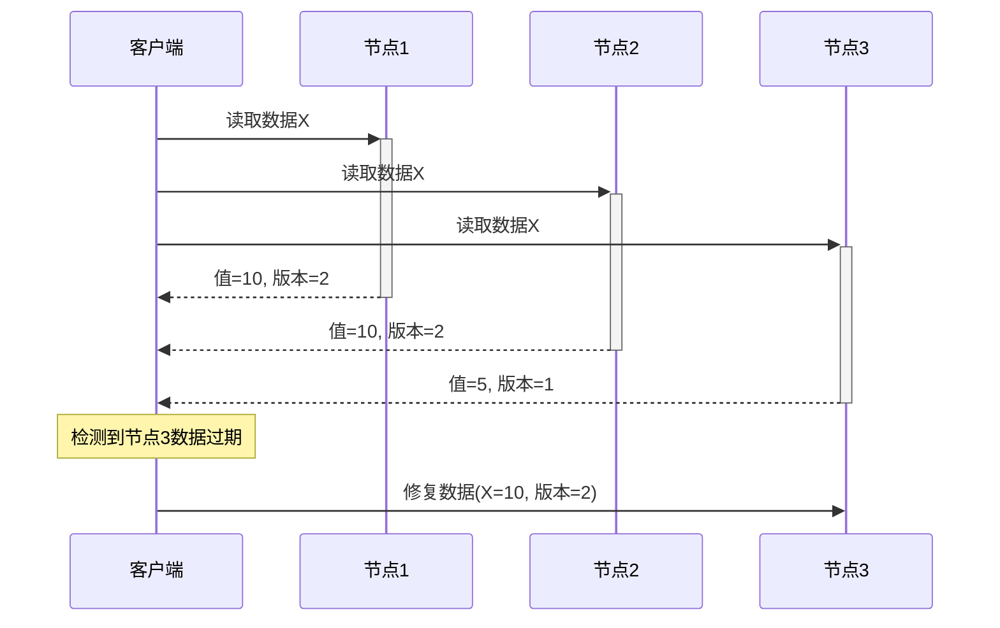

#### 反熵过程（Anti-entropy Process）

后台进程定期比较节点间的数据差异并同步。

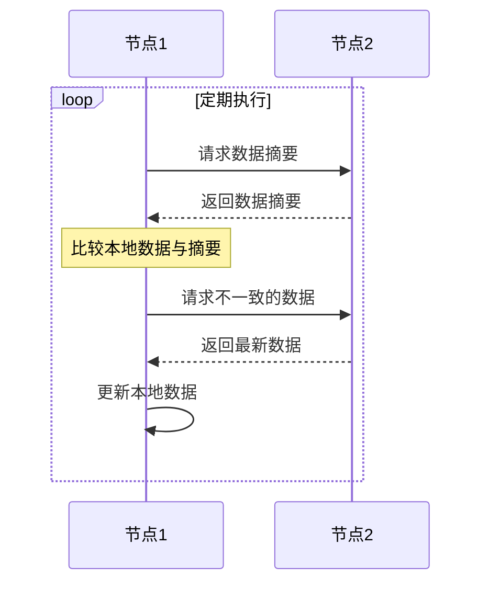

#### 墓碑（Tombstone）机制

在删除数据时，不立即物理删除，而是标记为已删除（墓碑），并在一段时间后才真正删除。这有助于解决分布式系统中的删除冲突。

### 版本控制与冲突解决

#### 向量时钟（Vector Clock）

向量时钟是一种逻辑时钟，用于跟踪分布式系统中事件的因果关系。

- **结构**：每个节点维护一个向量，记录已知的每个节点的逻辑时钟值
- **更新规则**：
  - 本地操作：增加自己的计数器
  - 收到消息：取自己和发送者向量的最大值，然后增加自己的计数器

```
示例：
初始状态：A:[0,0,0], B:[0,0,0], C:[0,0,0]
A执行写操作：A:[1,0,0]
A将数据发送给B：B更新为[1,1,0]
B执行写操作：B:[1,2,0]
C执行写操作：C:[0,0,1]
```

#### 多版本并发控制（MVCC）

MVCC允许系统维护数据的多个版本，每个版本对应一个时间戳或版本号。

- **读操作**：读取特定版本的数据（通常是最新提交的版本）
- **写操作**：创建数据的新版本
- **优点**：
  - 读操作不阻塞写操作
  - 写操作不阻塞读操作
  - 支持时间点查询

#### 冲突解决策略

1. **最后写入胜出（Last-Write-Wins）**：
   - 基于时间戳选择最新的写入
   - 简单但可能丢失更新

2. **客户端解决**：
   - 将冲突的版本返回给客户端
   - 由客户端或用户决定如何合并

3. **自动合并**：
   - 系统尝试自动合并冲突的更新
   - 适用于某些数据类型（如CRDT）

4. **冲突避免**：
   - 使用分布式锁或租约防止冲突发生
   - 牺牲可用性换取一致性

## 分布式存储系统案例分析

### Ceph

Ceph是一个统一的分布式存储系统，能够同时提供对象、块和文件存储。

#### 架构组件

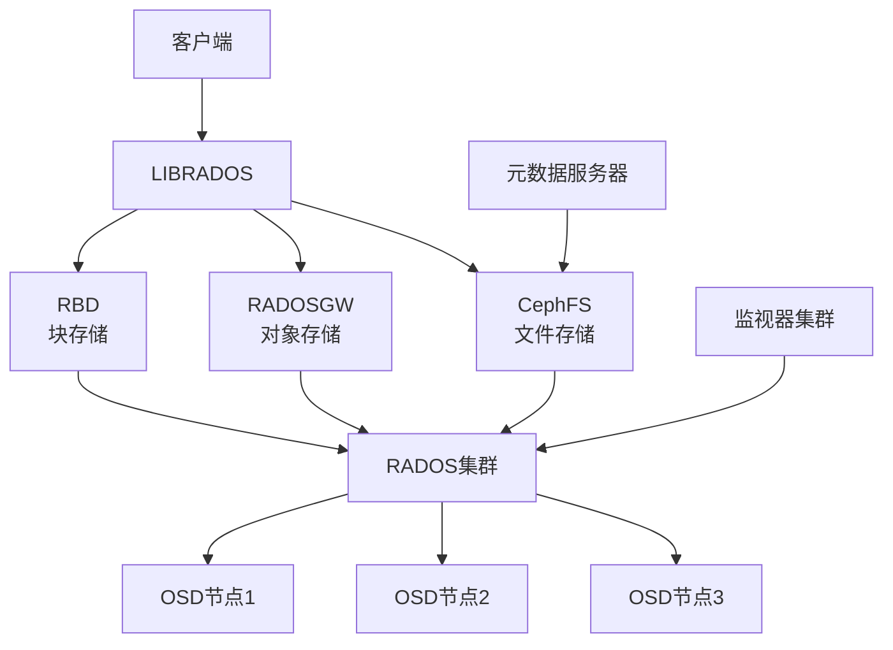

#### 关键技术

1. **CRUSH算法**：
   - 用于数据分布的可控、可扩展、分散的放置算法
   - 无需中央查找表，客户端可以计算数据位置

2. **RADOS（Reliable Autonomic Distributed Object Store）**：
   - Ceph的核心组件，提供可靠的对象存储
   - 实现数据复制、故障检测和恢复

3. **OSD（Object Storage Device）**：
   - 负责存储数据、处理复制、恢复和重新平衡
   - 每个OSD守护进程管理一个物理磁盘

4. **Monitor**：
   - 维护集群状态图（cluster map）
   - 提供一致且可靠的集群状态

### HDFS（Hadoop Distributed File System）

HDFS是为大数据处理设计的分布式文件系统，是Hadoop生态系统的核心组件。

#### 架构组件

```mermaid
graph TD
    Client[客户端] --> NameNode[名称节点]
    Client --> DataNode1[数据节点1]
    Client --> DataNode2[数据节点2]
    Client -->
让我们继续完成分布式存储系统原理的内容：

## 分布式存储系统案例分析（续）

### HDFS（Hadoop Distributed File System）（续）

#### 架构组件（续）

```mermaid
graph TD
    Client[客户端] --> NameNode[名称节点]
    Client --> DataNode1[数据节点1]
    Client --> DataNode2[数据节点2]
    Client --> DataNode3[数据节点3]
    
    NameNode --> DataNode1
    NameNode --> DataNode2
    NameNode --> DataNode3
    
    SecondaryNameNode[辅助名称节点] --> NameNode
```

#### 关键技术

1. **主从架构**：
   - NameNode（主节点）：管理文件系统命名空间和客户端访问
   - DataNode（数据节点）：存储实际数据块

2. **数据块复制**：
   - 默认每个数据块复制3份
   - 复制策略考虑机架感知（Rack Awareness）
   - 提供容错和高可用性

3. **流式数据访问**：
   - 设计用于批处理而非交互式访问
   - 高吞吐量优先于低延迟

4. **NameNode高可用性**：
   - 通过Active/Standby NameNode配置实现
   - 使用共享存储（如NFS或QJM）存储编辑日志

### Amazon S3（Simple Storage Service）

Amazon S3是最流行的云对象存储服务，提供高可用性、耐久性和可扩展性。

#### 架构特点

1. **对象存储模型**：
   - 数据存储为对象（文件）
   - 对象存储在桶（bucket）中
   - 每个对象有唯一的键（key）

2. **RESTful API**：
   - 通过HTTP/HTTPS提供标准接口
   - 支持PUT、GET、DELETE等操作

3. **强一致性**：
   - 自2020年12月起，S3提供强读后写一致性
   - 所有GET/LIST操作都能立即反映最近的写入

4. **存储类别**：
   - 标准存储（Standard）
   - 不频繁访问（Infrequent Access）
   - 归档存储（Glacier）
   - 深度归档（Deep Archive）

#### 数据持久性保障

1. **多可用区复制**：
   - 数据自动复制到同一区域的多个可用区
   - 设计为99.999999999%（11个9）的持久性

2. **版本控制**：
   - 可选功能，保留对象的多个版本
   - 防止意外删除和覆盖

3. **跨区域复制**：
   - 可选功能，将对象自动复制到不同区域
   - 提供灾难恢复和合规性支持

### MinIO

MinIO是一个高性能的开源对象存储服务器，兼容Amazon S3 API。

#### 架构特点

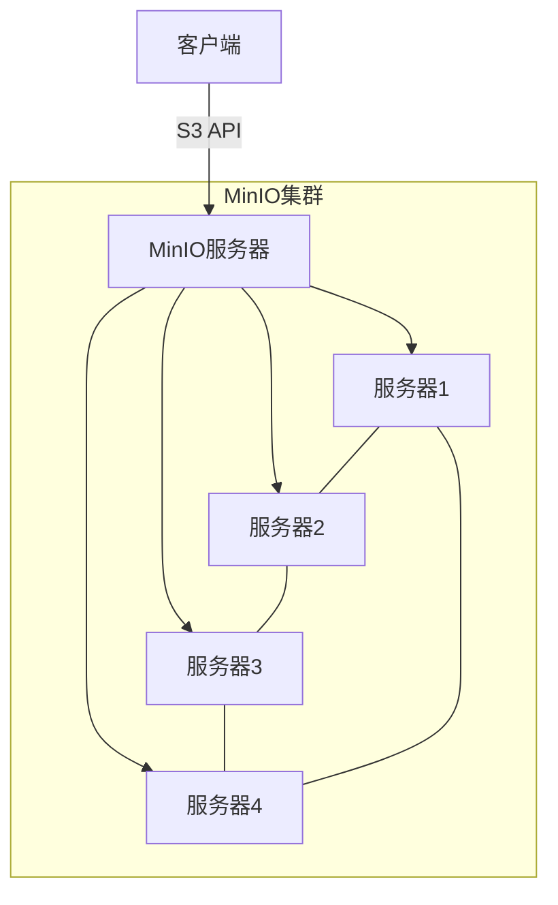

#### 关键技术

1. **纠删码（Erasure Coding）**：
   - 将数据分割成n个数据块和k个奇偶校验块
   - 可以容忍k个数据块的丢失
   - 比简单复制更节省存储空间

2. **位腐烂保护（Bit Rot Protection）**：
   - 使用高速哈希函数检测静默数据损坏
   - 自动修复损坏的数据

3. **分布式锁**：
   - 基于DSYNC（分布式同步）实现
   - 确保并发操作的一致性

4. **简单部署**：
   - 单一二进制文件，无外部依赖
   - 支持容器化部署

## 分布式存储系统的性能优化

### 缓存策略

缓存是提高分布式存储系统性能的关键技术。

#### 多级缓存架构

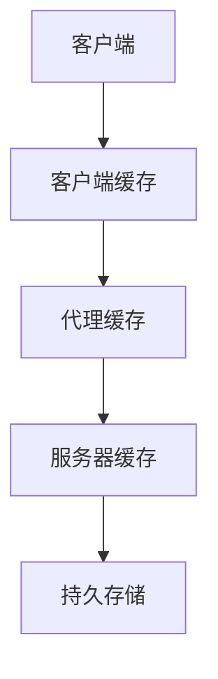

#### 缓存一致性策略

1. **写直达（Write-Through）**：
   - 写操作同时更新缓存和存储
   - 保证一致性但写性能较低

2. **写回（Write-Back）**：
   - 写操作只更新缓存，稍后异步更新存储
   - 提高写性能但可能丢失数据

3. **写绕过（Write-Around）**：
   - 写操作直接写入存储，绕过缓存
   - 适合写一次读多次的场景

4. **缓存失效（Cache Invalidation）**：
   - 数据更新时使相关缓存失效
   - 可以基于时间、事件或容量触发

### 预读与预取

预读和预取技术通过预测性地加载数据来减少延迟。

#### 顺序预读

当检测到顺序访问模式时，系统预先读取后续数据块。

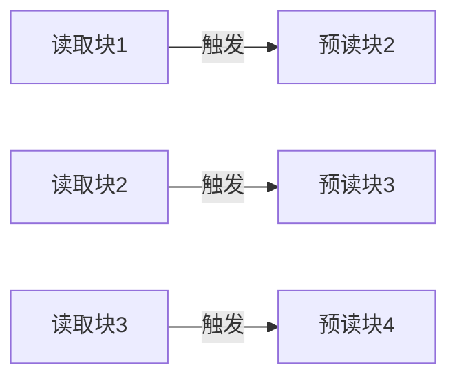

#### 智能预取

基于访问模式分析和机器学习预测未来可能访问的数据。

### 数据局部性优化

数据局部性是指相关数据在物理上的接近程度，良好的数据局部性可以减少I/O操作和网络传输。

#### 数据分区策略

1. **基于访问模式的分区**：
   - 将经常一起访问的数据放在同一分区
   - 减少跨分区查询

2. **时间局部性**：
   - 最近访问的数据可能很快再次被访问
   - 使用LRU（最近最少使用）等策略管理缓存

3. **空间局部性**：
   - 当前位置附近的数据可能很快被访问
   - 使用预读和数据块聚合

### I/O优化

#### 批处理与合并

将多个小I/O操作合并为较大的操作，减少I/O次数。

```mermaid
graph TD
    subgraph 优化前
        W1[写入1KB] --> D1[磁盘]
        W2[写入1KB] --> D1
        W3[写入1KB] --> D1
        W4[写入1KB] --> D1
    end
    
    subgraph 优化后
        W5[写入1KB] --> B[缓冲区]
        W6[写入1KB] --> B
        W7[写入1KB] --> B
        W8[写入1KB] --> B
        B --> |一次写入4KB| D2[磁盘]
    end
```

#### 异步I/O

使用异步I/O操作允许应用程序在I/O完成前继续执行其他任务。

#### I/O调度

根据优先级、截止时间或公平性调度I/O请求。

### 负载均衡

负载均衡是确保分布式存储系统中各节点负载均衡的关键技术。

#### 静态负载均衡

在数据放置阶段考虑负载均衡，如一致性哈希算法中的虚拟节点技术。

#### 动态负载均衡

系统运行时监控负载并动态调整数据分布。

```mermaid
graph TD
    Monitor[负载监控] --> Detect[检测热点]
    Detect --> Decision[迁移决策]
    Decision --> Migration[数据迁移]
    Migration --> Rebalance[负载重平衡]
```

#### 自适应复制

根据数据访问频率动态调整副本数量。

- 热点数据：增加副本数量
- 冷数据：减少副本数量

## 分布式存储系统的安全性

### 数据加密

#### 静态加密（Encryption at Rest）

保护存储在磁盘上的数据不被未授权访问。

- **块级加密**：加密整个存储块
- **文件级加密**：加密单个文件
- **对象级加密**：加密存储对象

#### 传输加密（Encryption in Transit）

保护网络传输中的数据。

- **TLS/SSL**：加密客户端与服务器之间的通信
- **节点间加密**：加密存储节点之间的通信

#### 密钥管理

- **集中式密钥管理**：使用专门的密钥管理服务
- **分布式密钥管理**：在系统内分散管理密钥
- **密钥轮换**：定期更换加密密钥

### 访问控制

#### 身份验证（Authentication）

验证用户或系统的身份。

- **用户名/密码**
- **证书认证**
- **多因素认证**
- **OAuth/OIDC**

#### 授权（Authorization）

控制已验证身份的访问权限。

- **访问控制列表（ACL）**
- **基于角色的访问控制（RBAC）**
- **基于属性的访问控制（ABAC）**
- **策略引擎**

#### 审计与合规

- **访问日志**：记录所有访问操作
- **变更跟踪**：记录数据和配置变更
- **合规报告**：生成符合监管要求的报告

### 安全威胁防护

#### 数据泄露防护

- **数据分类**：识别敏感数据
- **数据脱敏**：隐藏或模糊敏感信息
- **数据丢失防护（DLP）**：防止未授权的数据传输

#### 恶意软件防护

- **文件扫描**：检测上传的恶意文件
- **行为分析**：检测异常访问模式
- **沙箱执行**：在隔离环境中执行可疑代码

## 分布式存储系统的未来趋势

### 新型存储技术

#### 持久内存（Persistent Memory）

结合了内存的性能和存储的持久性。

- **Intel Optane**
- **NVDIMM（非易失性双列直插式内存模块）**
- **SCM（存储级内存）**

#### 计算存储（Computational Storage）

在存储设备内执行计算任务，减少数据移动。

```mermaid
graph TD
    subgraph 传统架构
        App1[应用] --> |数据传输| CPU1[CPU]
        Storage1[存储] --> |数据传输| CPU1
    end
    
    subgraph 计算存储架构
        App2[应用] --> CPU2[CPU]
        App2 --> |计算任务| Storage2[计算存储设备]
        Storage2 --> |结果| CPU2
    end
```

#### 存储级文件系统

文件系统直接在存储设备上实现，减少主机CPU开销。

### 智能存储管理

#### AI驱动的存储优化

使用机器学习优化存储配置、数据放置和缓存策略。

- **预测性缓存**：预测热点数据
- **智能分层**：自动将数据移至最合适的存储层
- **异常检测**：识别性能问题和潜在故障

#### 自修复系统

自动检测和修复存储系统中的问题。

- **预测性维护**：在故障发生前预测并解决问题
- **自动数据修复**：检测并修复损坏的数据
- **自适应配置**：根据工作负载自动调整系统参数

### 多云存储策略

#### 云存储抽象层

提供统一接口访问多个云存储服务。

```mermaid
graph TD
    App[应用] --> Abstraction[存储抽象层]
    Abstraction --> AWS[AWS S3]
    Abstraction --> Azure[Azure Blob]
    Abstraction --> GCP[Google Cloud Storage]
    Abstraction --> OnPrem[本地存储]
```

#### 数据主权与合规性

根据数据主权和合规要求自动放置和管理数据。

- **地理位置感知存储**：根据数据所属地区存储数据
- **合规性自动化**：自动执行数据保留和删除策略
- **审计追踪**：提供完整的数据访问和处理记录

## 总结

分布式存储系统是现代云基础设施的核心组件，它通过将数据分散到多个节点上，提供了高可扩展性、高可用性和容错能力。本文详细介绍了分布式存储的基本原理、架构设计和关键技术，包括数据分片、复制策略、一致性模型和共识算法等。

随着云计算和大数据技术的发展，分布式存储系统将继续演进，采用新型存储技术、智能管理策略和多云部署模式，以满足不断增长的数据存储和处理需求。理解分布式存储的核心原理和技术趋势，对于设计和实施高效、可靠的云原生应用至关重要。

在实际应用中，选择合适的分布式存储系统需要考虑多种因素，包括性能需求、一致性要求、可用性目标和成本约束。通过深入理解分布式存储的基本原理和各系统的特点，可以为特定应用场景选择最合适的存储解决方案。