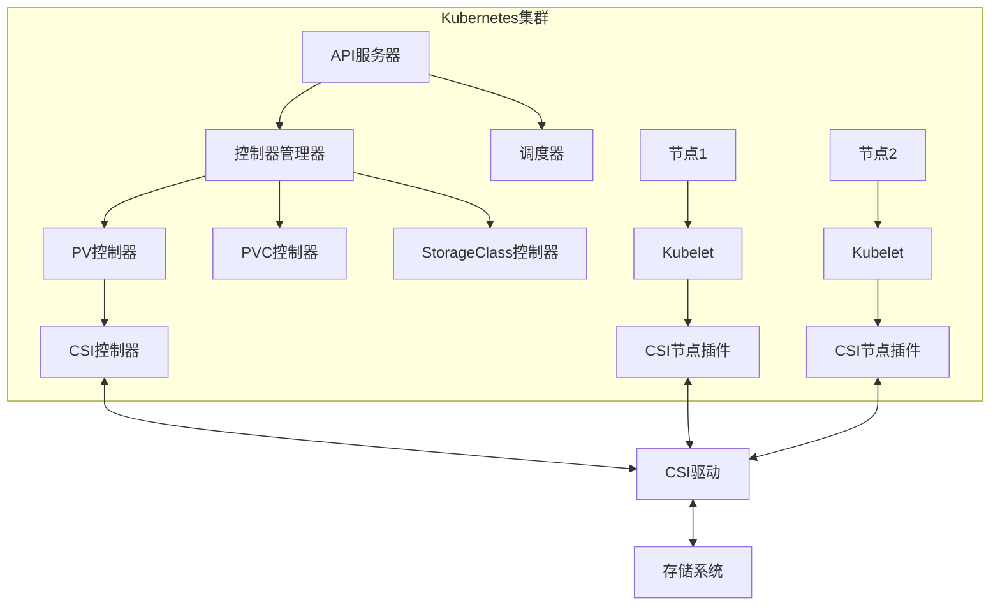
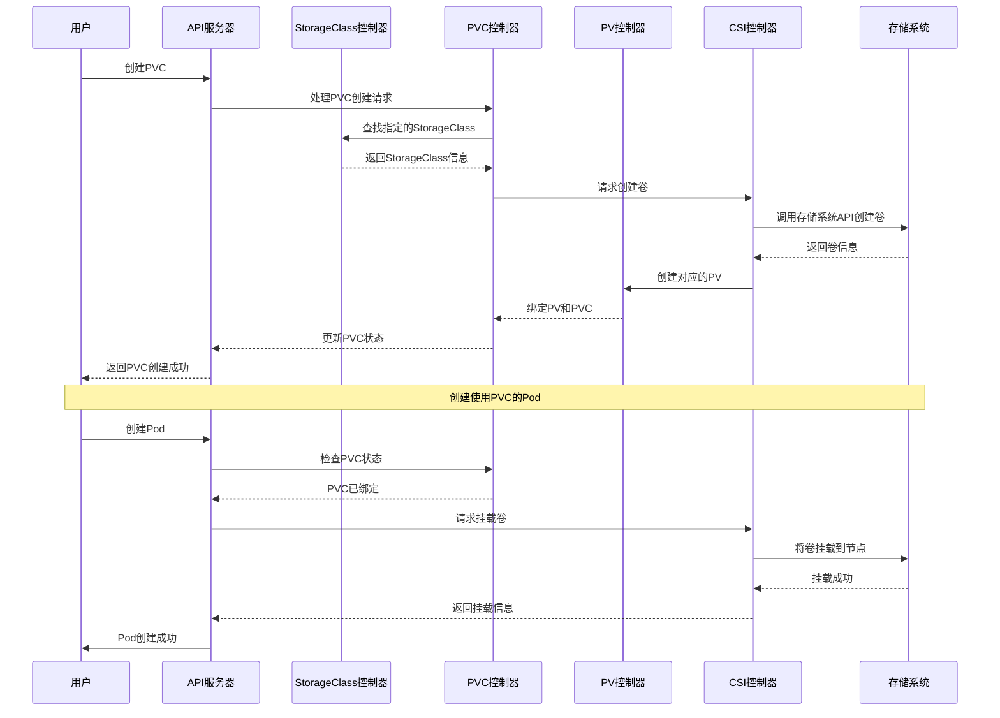
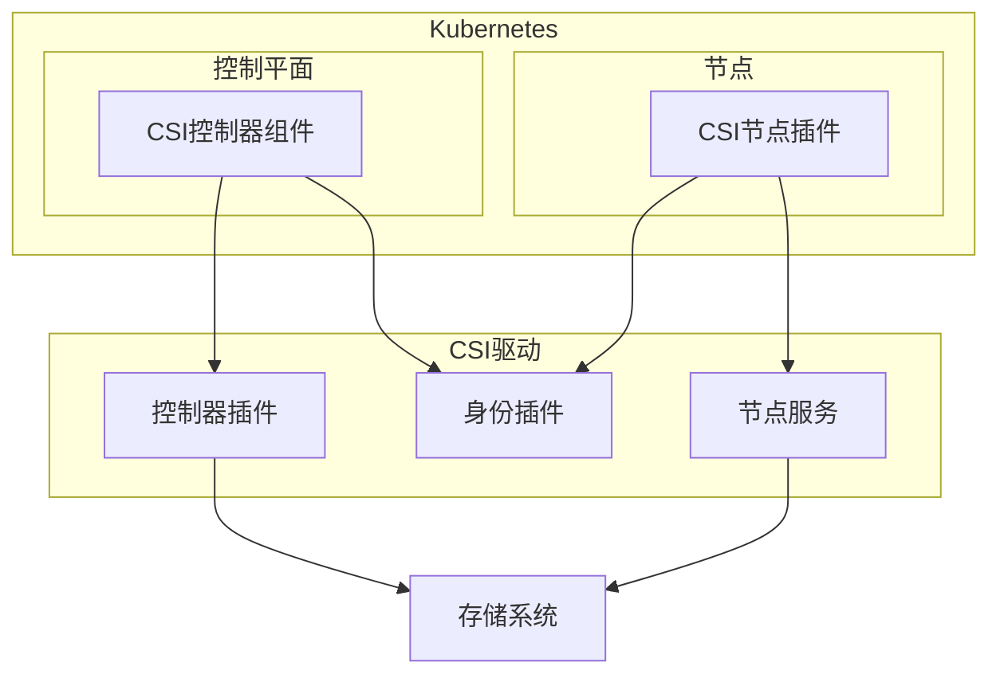
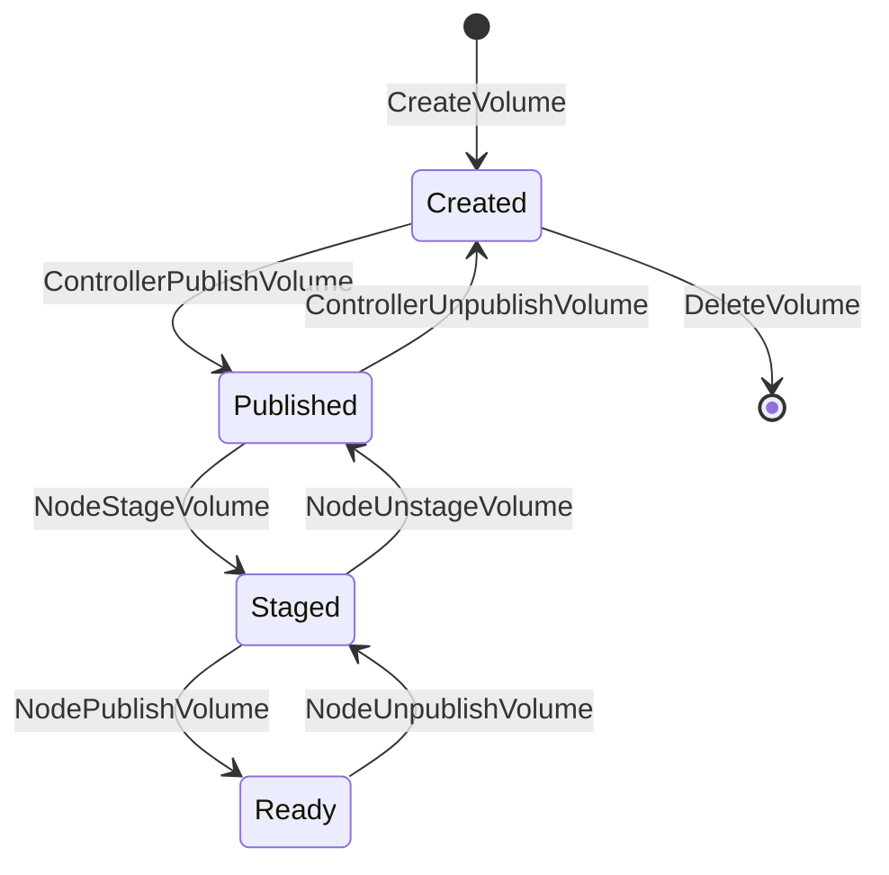
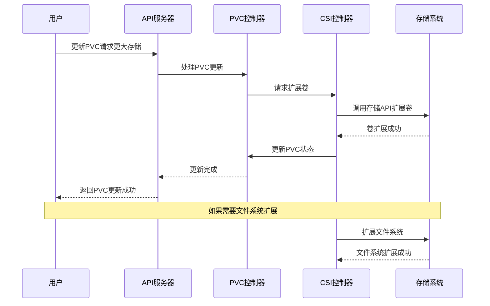

# 存储编排与自动化

## 存储编排基础概念

存储编排是指通过自动化方式管理和协调存储资源的分配、配置和生命周期的过程。在云原生环境中，存储编排使得存储资源能够像计算资源一样实现动态分配和自动化管理，从而满足应用的需求。

### 存储编排的核心目标

1. **自动化资源管理**：
   - 自动分配和回收存储资源
   - 减少人工干预，提高效率
   - 降低运维复杂度

2. **动态适应应用需求**：
   - 根据应用需求动态调整存储配置
   - 支持应用弹性扩展
   - 实现存储资源的按需分配

3. **标准化存储操作**：
   - 提供统一的存储管理接口
   - 抽象底层存储技术差异
   - 简化存储系统集成

4. **提高资源利用率**：
   - 优化存储资源分配
   - 避免资源浪费
   - 实现资源共享和复用

### 存储编排与传统存储管理的对比

| 特性 | 传统存储管理 | 存储编排 |
|------|--------------|----------|
| 资源分配 | 手动分配 | 自动分配 |
| 配置方式 | 静态配置 | 动态配置 |
| 扩展能力 | 有限，需停机 | 弹性，无需停机 |
| 管理界面 | 专有工具 | API驱动 |
| 自动化程度 | 低 | 高 |
| 与应用集成 | 松耦合 | 紧密集成 |
| 多租户支持 | 有限 | 原生支持 |

## Kubernetes存储编排架构

Kubernetes作为主流的容器编排平台，提供了完善的存储编排机制，使得容器化应用能够方便地使用持久化存储。

### Kubernetes存储架构组件



### 核心资源对象

#### 1. PersistentVolume (PV)

PersistentVolume是集群中的存储资源，类似于节点是集群中的计算资源。

- **特点**：
  - 由集群管理员创建或通过StorageClass动态配置
  - 独立于Pod的生命周期
  - 具有特定的容量、访问模式和存储类

```yaml
apiVersion: v1
kind: PersistentVolume
metadata:
  name: pv-example
spec:
  capacity:
    storage: 10Gi
  accessModes:
    - ReadWriteOnce
  persistentVolumeReclaimPolicy: Retain
  storageClassName: standard
  csi:
    driver: ebs.csi.aws.com
    volumeHandle: vol-0123456789abcdef0
    fsType: ext4
```

#### 2. PersistentVolumeClaim (PVC)

PersistentVolumeClaim是用户对存储的请求，类似于Pod是对计算资源的请求。

- **特点**：
  - 由用户创建，指定所需的存储大小和访问模式
  - 可以请求特定的StorageClass
  - 与Pod生命周期相关联

```yaml
apiVersion: v1
kind: PersistentVolumeClaim
metadata:
  name: pvc-example
spec:
  accessModes:
    - ReadWriteOnce
  resources:
    requests:
      storage: 5Gi
  storageClassName: standard
```

#### 3. StorageClass

StorageClass定义了存储的"类"，允许动态配置PersistentVolume。

- **特点**：
  - 指定存储配置参数和配置器（provisioner）
  - 支持不同的回收策略
  - 可以设置默认StorageClass

```yaml
apiVersion: storage.k8s.io/v1
kind: StorageClass
metadata:
  name: fast
provisioner: ebs.csi.aws.com
parameters:
  type: gp2
  fsType: ext4
reclaimPolicy: Delete
allowVolumeExpansion: true
```

### 存储编排工作流程



## 容器存储接口（CSI）

容器存储接口（Container Storage Interface，CSI）是Kubernetes与存储提供商之间的标准接口，允许存储供应商开发插件，使其存储系统能够与Kubernetes无缝集成。

### CSI架构

CSI架构由三个主要组件组成：

#### 1. CSI控制器插件

- **功能**：
  - 创建/删除卷
  - 挂载/卸载卷（从节点角度）
  - 快照管理
  - 卷扩展

- **部署方式**：
  - 通常作为Deployment部署
  - 可以有多个副本，但只有一个活跃实例

#### 2. CSI节点插件

- **功能**：
  - 将卷挂载到Pod
  - 格式化文件系统
  - 卷挂载点管理

- **部署方式**：
  - 通常作为DaemonSet部署
  - 每个节点运行一个实例

#### 3. CSI身份插件

- **功能**：
  - 提供驱动程序身份信息
  - 报告驱动程序能力

- **部署方式**：
  - 通常与控制器插件或节点插件集成



### CSI接口定义

CSI接口使用gRPC定义，包含三个主要服务：

#### 1. 身份服务（Identity Service）

```protobuf
service Identity {
  rpc GetPluginInfo(GetPluginInfoRequest) returns (GetPluginInfoResponse) {}
  rpc GetPluginCapabilities(GetPluginCapabilitiesRequest) returns (GetPluginCapabilitiesResponse) {}
  rpc Probe(ProbeRequest) returns (ProbeResponse) {}
}
```

#### 2. 控制器服务（Controller Service）

```protobuf
service Controller {
  rpc CreateVolume(CreateVolumeRequest) returns (CreateVolumeResponse) {}
  rpc DeleteVolume(DeleteVolumeRequest) returns (DeleteVolumeResponse) {}
  rpc ControllerPublishVolume(ControllerPublishVolumeRequest) returns (ControllerPublishVolumeResponse) {}
  rpc ControllerUnpublishVolume(ControllerUnpublishVolumeRequest) returns (ControllerUnpublishVolumeResponse) {}
  rpc ValidateVolumeCapabilities(ValidateVolumeCapabilitiesRequest) returns (ValidateVolumeCapabilitiesResponse) {}
  rpc ListVolumes(ListVolumesRequest) returns (ListVolumesResponse) {}
  rpc GetCapacity(GetCapacityRequest) returns (GetCapacityResponse) {}
  rpc ControllerGetCapabilities(ControllerGetCapabilitiesRequest) returns (ControllerGetCapabilitiesResponse) {}
  rpc CreateSnapshot(CreateSnapshotRequest) returns (CreateSnapshotResponse) {}
  rpc DeleteSnapshot(DeleteSnapshotRequest) returns (DeleteSnapshotResponse) {}
  rpc ListSnapshots(ListSnapshotsRequest) returns (ListSnapshotsResponse) {}
  rpc ControllerExpandVolume(ControllerExpandVolumeRequest) returns (ControllerExpandVolumeResponse) {}
}
```

#### 3. 节点服务（Node Service）

```protobuf
service Node {
  rpc NodeStageVolume(NodeStageVolumeRequest) returns (NodeStageVolumeResponse) {}
  rpc NodeUnstageVolume(NodeUnstageVolumeRequest) returns (NodeUnstageVolumeResponse) {}
  rpc NodePublishVolume(NodePublishVolumeRequest) returns (NodePublishVolumeResponse) {}
  rpc NodeUnpublishVolume(NodeUnpublishVolumeRequest) returns (NodeUnpublishVolumeResponse) {}
  rpc NodeGetVolumeStats(NodeGetVolumeStatsRequest) returns (NodeGetVolumeStatsResponse) {}
  rpc NodeExpandVolume(NodeExpandVolumeRequest) returns (NodeExpandVolumeResponse) {}
  rpc NodeGetCapabilities(NodeGetCapabilitiesRequest) returns (NodeGetCapabilitiesResponse) {}
  rpc NodeGetInfo(NodeGetInfoRequest) returns (NodeGetInfoResponse) {}
}
```

### CSI卷生命周期



1. **卷创建**：
   - 通过`CreateVolume`调用创建存储卷
   - 返回卷ID和属性

2. **控制器发布**：
   - 通过`ControllerPublishVolume`将卷与节点关联
   - 例如，将云存储卷挂载到VM实例

3. **节点暂存**：
   - 通过`NodeStageVolume`在节点上准备卷
   - 例如，格式化文件系统或挂载全局挂载点

4. **节点发布**：
   - 通过`NodePublishVolume`将卷挂载到Pod可访问的位置
   - 创建最终的挂载点

5. **使用卷**：
   - Pod可以读写挂载的卷

6. **节点取消发布**：
   - 通过`NodeUnpublishVolume`卸载卷
   - 移除Pod特定的挂载点

7. **节点取消暂存**：
   - 通过`NodeUnstageVolume`清理节点上的卷
   - 移除全局挂载点

8. **控制器取消发布**：
   - 通过`ControllerUnpublishVolume`解除卷与节点的关联
   - 例如，从VM实例分离云存储卷

9. **卷删除**：
   - 通过`DeleteVolume`删除存储卷
   - 释放底层存储资源

## 存储自动化实现方式

### 声明式存储管理

声明式存储管理是Kubernetes存储编排的核心理念，用户只需声明所需的存储资源，系统自动完成配置和管理。

#### 声明式与命令式对比

| 声明式管理 | 命令式管理 |
|------------|------------|
| 描述期望状态 | 描述具体操作步骤 |
| 系统负责实现状态转换 | 用户负责执行每个步骤 |
| 自动处理错误和恢复 | 需要手动处理错误 |
| 配置作为代码管理 | 操作步骤难以版本控制 |
| 适合自动化和GitOps | 适合一次性操作 |

#### 声明式存储示例

```yaml
# 声明所需的存储资源
apiVersion: v1
kind: PersistentVolumeClaim
metadata:
  name: database-data
spec:
  accessModes:
    - ReadWriteOnce
  resources:
    requests:
      storage: 100Gi
  storageClassName: fast-ssd

---
# 在应用中使用声明的存储
apiVersion: apps/v1
kind: StatefulSet
metadata:
  name: postgres
spec:
  serviceName: postgres
  replicas: 1
  selector:
    matchLabels:
      app: postgres
  template:
    metadata:
      labels:
        app: postgres
    spec:
      containers:
      - name: postgres
        image: postgres:13
        volumeMounts:
        - name: data
          mountPath: /var/lib/postgresql/data
      volumes:
      - name: data
        persistentVolumeClaim:
          claimName: database-data
```

### 存储策略管理

存储策略管理允许管理员定义存储资源的分配和使用策略，用户只需选择适合其应用的策略。

#### StorageClass策略参数

StorageClass可以包含多种策略参数，例如：

- **性能等级**：SSD、HDD
- **复制因子**：数据副本数量
- **加密设置**：是否加密、加密算法
- **快照策略**：快照频率、保留策略
- **地理位置**：数据存储区域

```yaml
apiVersion: storage.k8s.io/v1
kind: StorageClass
metadata:
  name: gold-storage
provisioner: ebs.csi.aws.com
parameters:
  type: io1
  iopsPerGB: "50"
  encrypted: "true"
  kmsKeyId: "arn:aws:kms:us-west-2:111122223333:key/1234abcd-12ab-34cd-56ef-1234567890ab"
  fsType: ext4
reclaimPolicy: Retain
allowVolumeExpansion: true
volumeBindingMode: WaitForFirstConsumer
```

#### 存储资源配额

通过ResourceQuota限制命名空间中的存储资源使用：

```yaml
apiVersion: v1
kind: ResourceQuota
metadata:
  name: storage-quota
spec:
  hard:
    persistentvolumeclaims: "10"
    requests.storage: "500Gi"
    ssd.storageclass.storage.k8s.io/requests.storage: "300Gi"
    standard.storageclass.storage.k8s.io/requests.storage: "200Gi"
```

### 存储自动扩展

存储自动扩展允许根据应用需求自动调整存储卷大小，无需手动干预。

#### 卷扩展流程



#### 启用卷扩展

1. **在StorageClass中启用**：

```yaml
apiVersion: storage.k8s.io/v1
kind: StorageClass
metadata:
  name: expandable-storage
provisioner: ebs.csi.aws.com
parameters:
  type: gp2
allowVolumeExpansion: true  # 启用卷扩展
```

2. **扩展现有PVC**：

```yaml
apiVersion: v1
kind: PersistentVolumeClaim
metadata:
  name: data-pvc
spec:
  accessModes:
    - ReadWriteOnce
  resources:
    requests:
      storage: 20Gi  # 从原来的10Gi扩展到20Gi
  storageClassName: expandable-storage
```

### 存储快照与备份

存储快照是存储卷在特定时间点的只读副本，可用于备份、恢复和创建新卷。

#### 卷快照资源

Kubernetes通过CSI提供了卷快照功能，包括以下资源：

1. **VolumeSnapshotClass**：定义快照的"类"和参数

```yaml
apiVersion: snapshot.storage.k8s.io/v1
kind: VolumeSnapshotClass
metadata:
  name: csi-hostpath-snapclass
driver: hostpath.csi.k8s.io
deletionPolicy: Delete
parameters:
  # 快照特定参数
```

2. **VolumeSnapshot**：请求创建卷的快照

```yaml
apiVersion: snapshot.storage.k8s.io/v1
kind: VolumeSnapshot
metadata:
  name: database-snapshot
spec:
  volumeSnapshotClassName: csi-hostpath-snapclass
  source:
    persistentVolumeClaimName: database-data
```

3. **VolumeSnapshotContent**：代表实际创建的快照资源

```yaml
apiVersion: snapshot.storage.k8s.io/v1
kind: VolumeSnapshotContent
metadata:
  name: snapcontent-72d9a349-aacd-42d2-a240-d775650d2455
spec:
  deletionPolicy: Delete
  driver: hostpath.csi.k8s.io
  source:
    volumeHandle: 7bdd0de3-bd2e-11e8-a8b0-000c298ff5fc
  volumeSnapshotRef:
    name: database-snapshot
    namespace: default
```

#### 从快照恢复

可以从快照创建新的PVC：

```yaml
apiVersion: v1
kind: PersistentVolumeClaim
metadata:
  name: database-restore
spec:
  accessModes:
    - ReadWriteOnce
  resources:
    requests:
      storage: 100Gi
  storageClassName: fast-ssd
  dataSource:
    name: database-snapshot
    kind: VolumeSnapshot
    apiGroup: snapshot.storage.k8s.io
```

#### 自动化备份

使用CronJob实现定期自动备份：

```yaml
apiVersion: batch/v1
kind: CronJob
metadata:
  name: database-backup
spec:
  schedule: "0 1 * * *"  # 每天凌晨1点
  jobTemplate:
    spec:
      template:
        spec:
          serviceAccountName: backup-sa
          containers:
          - name: backup
            image: bitnami/kubectl:latest
            command:
            - /bin/sh
            - -c
            - |
              kubectl create -f - <<EOF
              apiVersion: snapshot.storage.k8s.io/v1
              kind: VolumeSnapshot
              metadata:
                name: database-snapshot-$(date +%Y%m%d)
              spec:
                volumeSnapshotClassName: csi-hostpath-snapclass
                source:
                  persistentVolumeClaimName: database-data
              EOF
          restartPolicy: OnFailure
```

## 存储编排最佳实践

### 存储类型选择

根据应用需求选择合适的存储类型：

#### 1. 性能需求

- **高性能应用**：
  - 使用基于SSD的存储类
  - 考虑本地存储（Local PV）减少网络延迟
  - 选择支持高IOPS的存储提供商

- **一般应用**：
  - 标准存储类通常足够
  - 平衡成本和性能

#### 2. 访问模式

根据应用的数据共享需求选择合适的访问模式：

- **ReadWriteOnce (RWO)**：
  - 单节点读写
  - 适合数据库等需要独占访问的应用

- **ReadOnlyMany (ROX)**：
  - 多节点只读访问
  - 适合静态内容分发

- **ReadWriteMany (RWX)**：
  - 多节点读写访问
  - 适合共享文件系统、协作应用

```yaml
apiVersion: v1
kind: PersistentVolumeClaim
metadata:
  name: shared-data
spec:
  accessModes:
    - ReadWriteMany  # 多Pod共享访问
  resources:
    requests:
      storage: 10Gi
  storageClassName: nfs-storage
```

### 存储资源规划

#### 1. 容量规划

- **预留空间**：为数据增长预留足够空间（通常为预期使用量的1.5-2倍）
- **监控使用趋势**：实施监控系统跟踪存储使用情况
- **设置告警**：在达到容量阈值时触发告警

#### 2. 性能规划

- **基准测试**：在部署前进行存储性能基准测试
- **资源隔离**：使用StorageClass和ResourceQuota隔离不同应用的存储资源
- **避免过度使用**：监控IOPS和吞吐量，避免单个应用影响整体性能

### 高可用性配置

#### 1. 多可用区部署

配置跨可用区的存储解决方案：

```yaml
apiVersion: storage.k8s.io/v1
kind: StorageClass
metadata:
  name: multi-az-storage
provisioner: ebs.csi.aws.com
parameters:
  type: gp2
  availability-zone: "us-west-2a,us-west-2b,us-west-2c"
reclaimPolicy: Retain
```

#### 2. 数据备份策略

实施完善的备份策略：

- **定期快照**：使用VolumeSnapshot定期创建快照
- **备份轮换**：实施备份保留策略，自动删除过期备份
- **备份验证**：定期测试从备份恢复的能力
- **异地备份**：将备份数据存储在不同区域

#### 3. 灾难恢复计划

制定灾难恢复计划：

- **定义RTO（恢复时间目标）和RPO（恢复点目标）**
- **文档化恢复流程**
- **定期演练恢复过程**
- **自动化恢复步骤**

### 安全性考虑

#### 1. 数据加密

实施存储加密：

- **静态加密**：配置存储类支持静态数据加密

```yaml
apiVersion: storage.k8s.io/v1
kind: StorageClass
metadata:
  name: encrypted-storage
provisioner: ebs.csi.aws.com
parameters:
  type: gp2
  encrypted: "true"
  kmsKeyId: "arn:aws:kms:us-west-2:111122223333:key/1234abcd-12ab-34cd-56ef-1234567890ab"
```

- **传输加密**：确保CSI驱动和存储系统之间的通信加密
- **密钥管理**：使用外部密钥管理系统（如AWS KMS、HashiCorp Vault）

#### 2. 访问控制

实施严格的访问控制：

- **使用RBAC限制存储资源访问**
- **实施最小权限原则**
- **审计存储操作**

```yaml
apiVersion: rbac.authorization.k8s.io/v1
kind: Role
metadata:
  namespace: default
  name: pvc-creator
rules:
- apiGroups: [""]
  resources: ["persistentvolumeclaims"]
  verbs: ["get", "list", "create"]
- apiGroups: [""]
  resources: ["persistentvolumes"]
  verbs: ["get", "list"]
```

## 存储编排工具与平台

### Kubernetes原生工具

#### 1. kubectl

kubectl是管理Kubernetes资源的命令行工具，可用于管理存储资源：

```bash
# 创建PVC
kubectl create -f pvc.yaml

# 查看PVC状态
kubectl get pvc

# 查看PV详情
kubectl describe pv <pv-name>

# 创建存储类
kubectl apply -f storageclass.yaml

# 创建卷快照
kubectl apply -f volumesnapshot.yaml
```

#### 2. Kubernetes Dashboard

Kubernetes Dashboard提供了Web界面，可以可视化管理存储资源。

### 第三方存储管理工具

#### 1. Rook

Rook是Kubernetes的存储编排工具，专注于将分布式存储系统转变为自管理、自扩展和自修复的存储服务。

- **支持的存储系统**：
  - Ceph
  - NFS
  - EdgeFS
  - Cassandra

- **主要功能**：
  - 自动化部署和管理
  - 自动扩展和缩减
  - 监控和健康检查
  - 灾难恢复

```yaml
# Rook-Ceph集群示例
apiVersion: ceph.rook.io/v1
kind: CephCluster
metadata:
  name: rook-ceph
  namespace: rook-ceph
spec:
  cephVersion:
    image: ceph/ceph:v15.2.8
  dataDirHostPath: /var/lib/rook
  mon:
    count: 3
  dashboard:
    enabled: true
  storage:
    useAllNodes: true
    useAllDevices: false
    config:
      databaseSizeMB: "1024"
      journalSizeMB: "1024"
```

#### 2. OpenEBS

OpenEBS是一个开源的容器附加存储（CAS）解决方案，实现了存储的容器化。

- **主要功能**：
  - 容器化存储控制平面
  - 多种存储引擎（Jiva、cStor、Local PV）
  - 快照和克隆
  - 备份和恢复

```yaml
# OpenEBS StorageClass示例
apiVersion: storage.k8s.io/v1
kind: StorageClass
metadata:
  name: openebs-cstor
  annotations:
    openebs.io/cas-type: cstor
provisioner: openebs.io/provisioner-iscsi
parameters:
  cas-type: cstor
  cstorPoolCluster: cstor-pool-cluster
  replicaCount: "3"
```

#### 3. Portworx

Portworx是企业级的Kubernetes存储平台，提供高可用性、数据保护和灾难恢复功能。

- **主要功能**：
  - 云原生存储
  - 数据加密
  - 多云数据管理
  - 应用一致性快