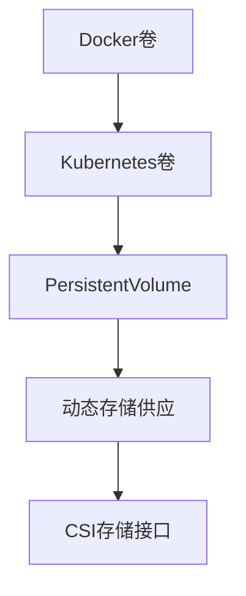
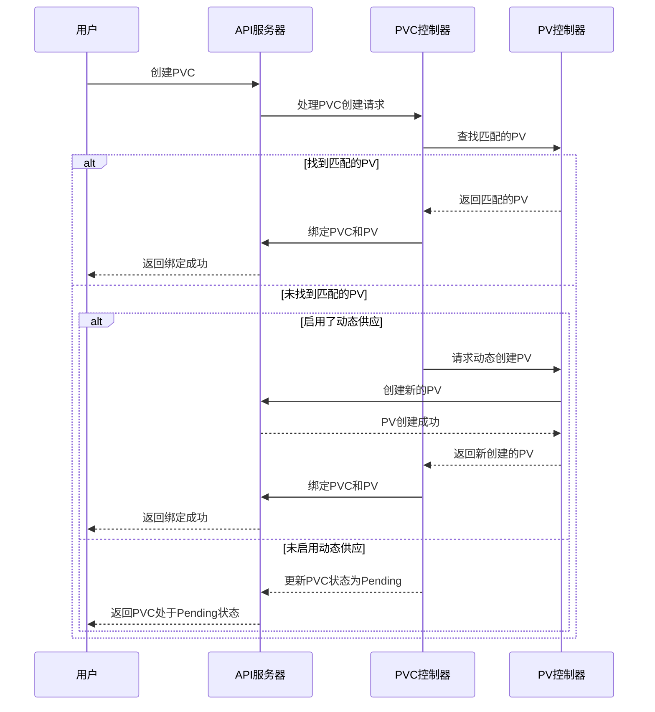
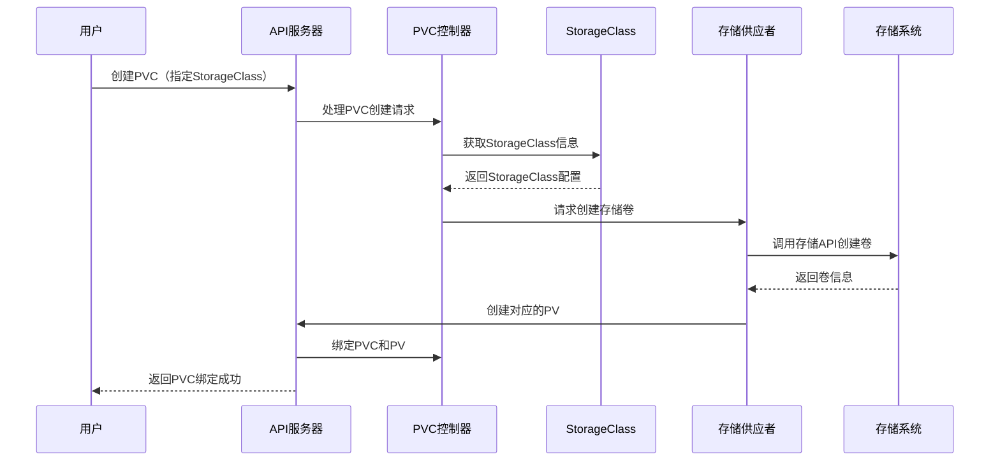

# 容器持久化存储配置

## 容器存储的基本概念

容器技术的一个核心特性是其短暂性（ephemeral）—容器在重启后会回到初始状态，容器内的数据变更会丢失。这种特性对于无状态应用很适合，但对于需要保存数据的应用（如数据库、文件服务等）则带来了挑战。容器持久化存储就是为了解决这一问题而设计的。

### 容器存储的挑战

1. **容器的临时性**：
   - 容器重启后，内部文件系统会重置
   - 容器被删除后，其数据完全丢失
   - 容器迁移到其他节点后，无法访问原节点上的数据

2. **数据共享需求**：
   - 多个容器可能需要共享同一份数据
   - 容器的替换或扩缩容时需要保持数据一致性

3. **存储管理复杂性**：
   - 不同存储系统有不同的接口和管理方式
   - 手动管理存储与容器的绑定关系繁琐且容易出错

### 容器存储解决方案演进



1. **Docker卷**：
   - 最初的容器存储解决方案
   - 将主机目录挂载到容器内
   - 局限于单机环境

2. **Kubernetes卷**：
   - 扩展了Docker卷的概念
   - 支持多种卷类型（如emptyDir、hostPath等）
   - 生命周期与Pod绑定

3. **持久卷系统**：
   - 将存储资源与使用分离
   - 引入PV（PersistentVolume）和PVC（PersistentVolumeClaim）
   - 支持存储的独立生命周期管理

4. **动态存储供应**：
   - 通过StorageClass自动创建PV
   - 简化存储管理流程
   - 支持按需分配存储资源

5. **CSI存储接口**：
   - 标准化存储接口
   - 支持第三方存储系统集成
   - 增强存储功能（如快照、克隆等）

## Kubernetes持久卷系统

Kubernetes持久卷系统是一个完整的存储管理框架，它将存储资源的提供和使用分离，使得开发人员和存储管理员可以各司其职。

### 持久卷（PersistentVolume，PV）

持久卷是集群中的存储资源，类似于节点是集群中的计算资源。PV由管理员创建或通过StorageClass动态创建，它独立于使用它的Pod存在。

#### PV的关键属性

1. **容量（Capacity）**：
   - 定义PV可提供的存储空间大小

2. **访问模式（Access Modes）**：
   - ReadWriteOnce (RWO)：只能被一个节点以读写方式挂载
   - ReadOnlyMany (ROX)：可以被多个节点以只读方式挂载
   - ReadWriteMany (RWX)：可以被多个节点以读写方式挂载

3. **回收策略（Reclaim Policy）**：
   - Retain：保留PV及其数据，需要管理员手动处理
   - Delete：删除PV及其关联的存储资产
   - Recycle：（已弃用）清空PV内容并使其可再次使用

4. **存储类（Storage Class）**：
   - 指定PV所属的存储类
   - 用于动态存储供应和存储分类

5. **挂载选项（Mount Options）**：
   - 定义挂载存储时的特定选项

#### PV示例

```yaml
apiVersion: v1
kind: PersistentVolume
metadata:
  name: pv-example
spec:
  capacity:
    storage: 10Gi
  accessModes:
    - ReadWriteOnce
  persistentVolumeReclaimPolicy: Retain
  storageClassName: standard
  mountOptions:
    - hard
    - nfsvers=4.1
  nfs:
    path: /data
    server: nfs-server.example.com
```

### 持久卷声明（PersistentVolumeClaim，PVC）

持久卷声明是用户对存储的请求，类似于Pod是对计算资源的请求。PVC由用户创建，指定所需的存储大小、访问模式和存储类。

#### PVC的关键属性

1. **访问模式（Access Modes）**：
   - 与PV相同，指定所需的访问方式

2. **资源请求（Resources）**：
   - 指定所需的存储空间大小

3. **存储类（Storage Class）**：
   - 指定使用哪个存储类
   - 如果不指定，将使用默认存储类

4. **选择器（Selector）**：
   - 可选，用于筛选符合条件的PV
   - 基于标签（Label）或存储类

#### PVC示例

```yaml
apiVersion: v1
kind: PersistentVolumeClaim
metadata:
  name: pvc-example
spec:
  accessModes:
    - ReadWriteOnce
  resources:
    requests:
      storage: 5Gi
  storageClassName: standard
  selector:
    matchLabels:
      environment: production
```

### PV和PVC的绑定过程



PV和PVC的绑定遵循以下规则：

1. **容量匹配**：PV的容量必须大于或等于PVC请求的容量
2. **访问模式匹配**：PV必须支持PVC请求的访问模式
3. **存储类匹配**：如果PVC指定了存储类，则PV必须属于该存储类
4. **选择器匹配**：如果PVC指定了选择器，则PV必须满足选择器条件

### 在Pod中使用PVC

一旦PVC绑定到PV，就可以在Pod中使用该PVC：

```yaml
apiVersion: v1
kind: Pod
metadata:
  name: database-pod
spec:
  containers:
    - name: database
      image: mysql:5.7
      volumeMounts:
        - mountPath: /var/lib/mysql
          name: database-data
      env:
        - name: MYSQL_ROOT_PASSWORD
          value: password
  volumes:
    - name: database-data
      persistentVolumeClaim:
        claimName: pvc-example
```

在这个例子中：
- Pod定义了一个名为`database-data`的卷，该卷使用名为`pvc-example`的PVC
- 容器将该卷挂载到`/var/lib/mysql`路径，作为MySQL数据目录
- 当Pod调度到某个节点时，Kubernetes会确保PVC绑定的PV可以在该节点上使用

## 存储类和动态供应

手动创建和管理PV是繁琐的，特别是在大规模集群中。存储类（StorageClass）和动态供应机制解决了这个问题，允许系统根据用户的PVC请求自动创建PV。

### 存储类（StorageClass）

存储类定义了一种存储"类型"，包括存储的配置参数和供应者（provisioner）。管理员可以创建多个存储类，以满足不同的存储需求。

#### 存储类的关键属性

1. **供应者（Provisioner）**：
   - 指定创建PV的组件
   - 可以是内置供应者（如kubernetes.io/aws-ebs）或CSI驱动

2. **参数（Parameters）**：
   - 供应者特定的配置参数
   - 例如，AWS EBS的卷类型、大小、IOPS等

3. **回收策略（Reclaim Policy）**：
   - 指定动态创建的PV的回收策略
   - 默认为Delete

4. **卷绑定模式（Volume Binding Mode）**：
   - Immediate：立即绑定（默认）
   - WaitForFirstConsumer：等待首个消费者

5. **允许卷扩展（Allow Volume Expansion）**：
   - 是否允许扩展使用该存储类的PVC

#### 存储类示例

```yaml
apiVersion: storage.k8s.io/v1
kind: StorageClass
metadata:
  name: fast
provisioner: kubernetes.io/aws-ebs
parameters:
  type: gp2
  fsType: ext4
  encrypted: "true"
reclaimPolicy: Retain
allowVolumeExpansion: true
volumeBindingMode: WaitForFirstConsumer
```

### 动态存储供应流程



动态供应的工作流程如下：

1. 用户创建PVC，指定所需的存储类
2. PVC控制器检测到新的PVC，并查找匹配的PV
3. 如果没有匹配的PV，且PVC指定了存储类，则触发动态供应
4. 存储供应者根据存储类的参数创建实际的存储卷
5. 供应者创建一个PV对象，表示新创建的存储卷
6. PVC控制器将PVC绑定到新创建的PV
7. 用户的Pod可以使用该PVC挂载存储卷

### 默认存储类

集群可以配置一个默认存储类，当PVC没有指定存储类时，将使用默认存储类。

```yaml
apiVersion: storage.k8s.io/v1
kind: StorageClass
metadata:
  name: standard
  annotations:
    storageclass.kubernetes.io/is-default-class: "true"
provisioner: kubernetes.io/aws-ebs
parameters:
  type: gp2
```

要查看集群中的默认存储类，可以使用以下命令：

```bash
kubectl get storageclass
```

输出中带有`(default)`标记的存储类就是默认存储类。

## 常见存储解决方案配置

Kubernetes支持多种存储解决方案，下面介绍几种常见的存储配置。

### 本地存储（Local Storage）

本地存储使用节点上的本地磁盘，提供高性能但缺乏数据持久性保证（如果节点故障）。

#### 本地PV示例

```yaml
apiVersion: v1
kind: PersistentVolume
metadata:
  name: local-pv
spec:
  capacity:
    storage: 100Gi
  accessModes:
  - ReadWriteOnce
  persistentVolumeReclaimPolicy: Delete
  storageClassName: local-storage
  local:
    path: /mnt/disks/ssd1
  nodeAffinity:
    required:
      nodeSelectorTerms:
      - matchExpressions:
        - key: kubernetes.io/hostname
          operator: In
          values:
          - node-1
```

#### 本地存储类示例

```yaml
apiVersion: storage.k8s.io/v1
kind: StorageClass
metadata:
  name: local-storage
provisioner: kubernetes.io/no-provisioner
volumeBindingMode: WaitForFirstConsumer
```

本地存储的特点：
- 高性能，低延迟
- 没有网络开销
- 节点故障时数据可能丢失
- 需要手动创建PV
- 适合对性能要求高但可以容忍数据丢失的应用

### NFS存储

NFS（网络文件系统）是一种常用的网络存储协议，支持多节点同时读写（RWX）。

#### NFS PV示例

```yaml
apiVersion: v1
kind: PersistentVolume
metadata:
  name: nfs-pv
spec:
  capacity:
    storage: 10Gi
  accessModes:
    - ReadWriteMany
  persistentVolumeReclaimPolicy: Retain
  nfs:
    server: nfs-server.example.com
    path: "/exported/path"
```

#### 使用NFS动态供应

要实现NFS的动态供应，可以使用NFS外部供应者：

```yaml
apiVersion: storage.k8s.io/v1
kind: StorageClass
metadata:
  name: nfs-storage
provisioner: nfs.csi.k8s.io
parameters:
  server: nfs-server.example.com
  share: /exported/path
```

NFS存储的特点：
- 支持多节点同时读写（RWX）
- 易于设置和管理
- 性能受网络影响
- 适合需要共享访问的应用（如CMS、共享文件等）

### 云存储

各大云服务提供商都提供了与Kubernetes集成的存储解决方案。

#### AWS EBS示例

```yaml
apiVersion: storage.k8s.io/v1
kind: StorageClass
metadata:
  name: ebs-sc
provisioner: ebs.csi.aws.com
parameters:
  type: gp3
  encrypted: "true"
volumeBindingMode: WaitForFirstConsumer
```

#### Azure Disk示例

```yaml
apiVersion: storage.k8s.io/v1
kind: StorageClass
metadata:
  name: azure-disk
provisioner: disk.csi.azure.com
parameters:
  skuName: Premium_LRS
  location: eastus
  resourceGroup: myResourceGroup
```

#### Google Persistent Disk示例

```yaml
apiVersion: storage.k8s.io/v1
kind: StorageClass
metadata:
  name: gce-pd
provisioner: pd.csi.storage.gke.io
parameters:
  type: pd-standard
  replication-type: none
```

云存储的特点：
- 高可用性和耐久性
- 自动备份和快照功能
- 按需扩展
- 通常只支持单节点读写（RWO）
- 成本较高
- 适合生产环境中的关键应用

## 高级存储功能

### 卷快照

卷快照（Volume Snapshot）是存储卷在特定时间点的只读副本，可用于备份、恢复和创建新卷。

#### 卷快照类

```yaml
apiVersion: snapshot.storage.k8s.io/v1
kind: VolumeSnapshotClass
metadata:
  name: csi-hostpath-snapclass
driver: hostpath.csi.k8s.io
deletionPolicy: Delete
```

#### 创建卷快照

```yaml
apiVersion: snapshot.storage.k8s.io/v1
kind: VolumeSnapshot
metadata:
  name: database-snapshot
spec:
  volumeSnapshotClassName: csi-hostpath-snapclass
  source:
    persistentVolumeClaimName: database-data
```

#### 从快照恢复

```yaml
apiVersion: v1
kind: PersistentVolumeClaim
metadata:
  name: database-restore
spec:
  accessModes:
    - ReadWriteOnce
  resources:
    requests:
      storage: 10Gi
  dataSource:
    name: database-snapshot
    kind: VolumeSnapshot
    apiGroup: snapshot.storage.k8s.io
```

### 卷克隆

卷克隆（Volume Cloning）允许创建现有PVC的副本。

```yaml
apiVersion: v1
kind: PersistentVolumeClaim
metadata:
  name: cloned-pvc
spec:
  accessModes:
    - ReadWriteOnce
  resources:
    requests:
      storage: 10Gi
  dataSource:
    name: source-pvc
    kind: PersistentVolumeClaim
```

### 卷扩展

卷扩展（Volume Expansion）允许增加PVC的大小。

```yaml
# 首先确保StorageClass允许卷扩展
apiVersion: storage.k8s.io/v1
kind: StorageClass
metadata:
  name: expandable-storage
provisioner: kubernetes.io/aws-ebs
parameters:
  type: gp2
allowVolumeExpansion: true

# 然后更新PVC请求更大的存储
apiVersion: v1
kind: PersistentVolumeClaim
metadata:
  name: expandable-pvc
spec:
  accessModes:
    - ReadWriteOnce
  resources:
    requests:
      storage: 20Gi  # 从原来的10Gi扩展到20Gi
  storageClassName: expandable-storage
```

## 存储配置最佳实践

### 容量规划

1. **预留足够空间**：
   - 为数据增长预留足够空间（通常为预期使用量的1.5-2倍）
   - 考虑应用的数据增长模式

2. **监控存储使用情况**：
   - 实施监控系统跟踪存储使用情况
   - 设置告警在达到容量阈值时触发

3. **使用卷扩展功能**：
   - 配置允许卷扩展的存储类
   - 在需要时增加PVC大小

### 性能优化

1. **选择合适的存储类型**：
   - 高性能应用：SSD或NVMe存储
   - 大容量存储：HDD存储
   - 共享访问：网络存储（如NFS）

2. **考虑访问模式**：
   - 单节点访问：使用块存储（如AWS EBS）
   - 多节点共享：使用文件存储（如NFS）或对象存储

3. **使用本地存储提高性能**：
   - 对于需要极高I/O性能的应用
   - 结合节点亲和性确保Pod调度到正确节点

### 数据保护

1. **实施备份策略**：
   - 使用卷快照定期创建备份
   - 将备份存储在不同的位置或区域
   - 定期测试恢复过程

2. **配置适当的回收策略**：
   - 生产环境通常使用Retain策略
   - 开发环境可以使用Delete策略

3. **使用加密保护敏感数据**：
   - 配置存储类启用加密
   - 使用密钥管理服务管理加密密钥

### 多环境配置

1. **使用命名空间隔离**：
   - 为不同环境（开发、测试、生产）创建不同的命名空间
   - 在每个命名空间中配置适当的存储资源

2. **环境特定的存储类**：
   - 为不同环境创建不同的存储类
   - 根据环境需求配置不同的参数

```yaml
# 开发环境存储类
apiVersion: storage.k8s.io/v1
kind: StorageClass
metadata:
  name: dev-storage
provisioner: kubernetes.io/aws-ebs
parameters:
  type: gp2
reclaimPolicy: Delete

# 生产环境存储类
apiVersion: storage.k8s.io/v1
kind: StorageClass
metadata:
  name: prod-storage
provisioner: kubernetes.io/aws-ebs
parameters:
  type: io1
  iopsPerGB: "50"
  encrypted: "true"
reclaimPolicy: Retain
```

3. **资源配额管理**：
   - 使用ResourceQuota限制命名空间中的存储资源使用

```yaml
apiVersion: v1
kind: ResourceQuota
metadata:
  name: storage-quota
spec:
  hard:
    persistentvolumeclaims: "10"
    requests.storage: "500Gi"
```

## 故障排除与常见问题

### PVC一直处于Pending状态

可能的原因：
1. 没有匹配的PV
2. 存储类不存在或配置错误
3. 存储供应者无法创建卷（如配额限制、权限问题等）

排查步骤：
```bash
# 查看PVC状态
kubectl describe pvc <pvc-name>

# 查看存储类
kubectl get storageclass

# 查看存储供应者日志
kubectl logs -n kube-system <provisioner-pod-name>
```

### 无法挂载卷

可能的原因：
1. 节点无法访问存储系统
2. 文件系统损坏
3. 权限问题

排查步骤：
```bash
# 查看Pod事件
kubectl describe pod <pod-name>

# 查看节点状态
kubectl describe node <node-name>

# 检查kubelet日志
kubectl logs -n kube-system <kubelet-pod-name>
```

### 数据丢失或损坏

可能的原因：
1. 存储系统故障
2. 不当的Pod终止（未正确卸载）
3. 文件系统错误

预防措施：
1. 使用高可用性存储解决方案
2. 实施定期备份
3. 配置Pod正确处理终止信号
4. 使用文件系统检查工具

## 实际应用案例

### 数据库持久化存储

MySQL数据库需要持久化存储来保存数据，以下是一个完整的配置示例：

```yaml
# 创建存储类
apiVersion: storage.k8s.io/v1
kind: StorageClass
metadata:
  name: mysql-storage
provisioner: kubernetes.io/aws-ebs
parameters:
  type: gp2
  fsType: ext4
allowVolumeExpansion: true
---
# 创建PVC
apiVersion: v1
kind: PersistentVolumeClaim
metadata:
  name: mysql-data
spec:
  accessModes:
    - ReadWriteOnce
  resources:
    requests:
      storage: 20Gi
  storageClassName: mysql-storage
---
# 创建MySQL部署
apiVersion: apps/v1
kind: Deployment
metadata:
  name: mysql
spec:
  selector:
    matchLabels:
      app: mysql
  strategy:
    type: Recreate
  template:
    metadata:
      labels:
        app: mysql
    spec:
      containers:
      - name: mysql
        image: mysql:5.7
        env:
        - name: MYSQL_ROOT_PASSWORD
          valueFrom:
            secretKeyRef:
              name: mysql-secret
              key: password
        ports:
        - containerPort: 3306
          name: mysql
        volumeMounts:
        - name: mysql-data
          mountPath: /var/lib/mysql
      volumes:
      - name: mysql-data
        persistentVolumeClaim:
          claimName: mysql-data
```

### 共享文件系统

多个Pod需要共享访问同一文件系统的场景：

```yaml
# 创建支持ReadWriteMany的存储类
apiVersion: storage.k8s.io/v1
kind: StorageClass
metadata:
  name: nfs-storage
provisioner: nfs.csi.k8s.io
parameters:
  server: nfs-server.example.com
  share: /exports
---
# 创建PVC
apiVersion: v1
kind: PersistentVolumeClaim
metadata:
  name: shared-data
spec:
  accessModes:
    - ReadWriteMany
  resources:
    requests:
      storage: 10Gi
  storageClassName: nfs-storage
---
# 创建使用共享存储的Pod
apiVersion: v1
kind: Pod
metadata:
  name: reader-pod
spec:
  containers:
  - name: reader
    image: nginx
    volumeMounts:
    - name: shared-data
      mountPath: /data
  volumes:
  - name: shared-data
    persistentVolumeClaim:
      claimName: shared-data
---
apiVersion: v1
kind: Pod
metadata:
  name: writer-pod
spec:
  containers:
  - name: writer
    image: busybox
    command: ["/bin/sh", "-c", "while true; do echo $(date) >> /data/output.txt; sleep 5; done"]
    volumeMounts:
    - name: shared-data
      mountPath: /data
  volumes:
  - name: shared-data
    persistentVolumeClaim:
      claimName: shared-data
```

### 有状态应用集群

使用StatefulSet部署有状态应用集群，每个Pod拥有独立的存储：

```yaml
apiVersion: v1
kind: Service
metadata:
  name: mongodb
  labels:
    app: mongodb
spec:
  ports:
  - port: 27017
    name: mongodb
  clusterIP: None
  selector:
    app: mongodb
---
apiVersion: apps/v1
kind: StatefulSet
metadata:
  name: mongodb
spec:
  serviceName: mongodb
  replicas: 3
  selector:
    matchLabels:
      app: mongodb
  template:
    metadata:
      labels:
        app: mongodb
    spec:
      containers:
      - name: mongodb
        image: mongo:4.2
        ports:
        - containerPort: 27017
          name: mongodb
        volumeMounts:
        - name: data
          mountPath: /data/db
  volumeClaimTemplates:
  - metadata:
      name: data
    spec:
      accessModes: [ "ReadWriteOnce" ]
      storageClassName: "fast-storage"
      resources:
        requests:
          storage: 10Gi
```

## 总结

容器持久化存储是保障容器化应用数据可靠性的关键技术。Kubernetes提供了完善的持久卷系统，包括PV、PVC和StorageClass，使得存储资源的管理变得简单和灵活。通过动态存储供应，用户可以按需创建存储资源，而无需关心底层存储的细节。

在实际应用中，选择合适的存储解决方案需要考虑多种因素，包括性能需求、可用性要求、数据共享需求和成本约束。通过遵循最佳实践，可以构建稳定、高效的容器存储系统，为容器化应用提供可靠的数据持久化支持。

随着云原生技术的发展，容器存储技术也在不断演进，CSI接口的标准化使得存储供应商可以更容易地集成其存储解决方案，为用户提供更多选择。未来，随着边缘计算、多云部署和数据密集型应用的增长，容器持久化存储将继续发挥关键作用。