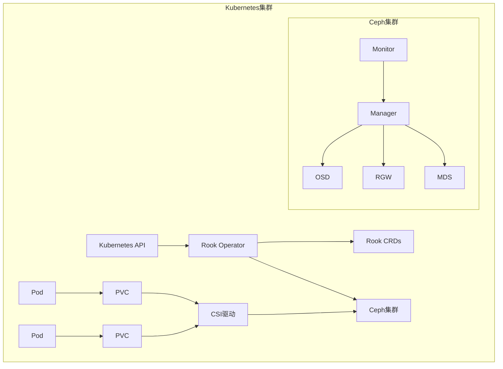
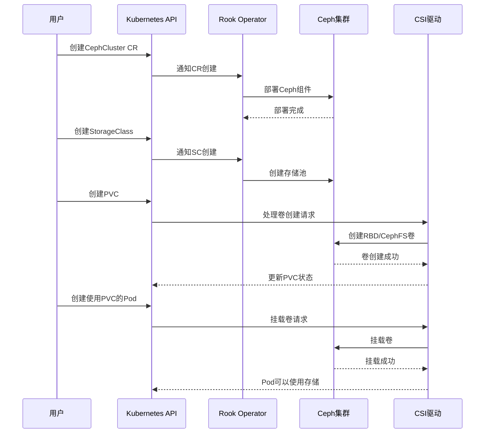

# Rook存储编排系统使用

## Rook简介

Rook是一个开源的云原生存储编排系统，它将分布式存储软件转变为自我管理、自我扩展和自我修复的存储服务。Rook通过自动化部署、启动、配置、供应、扩展、升级、迁移、灾难恢复、监控和资源管理，实现了存储管理的自动化。

### Rook的核心价值

1. **简化存储管理**：
   - 将复杂的存储系统配置转化为简单的Kubernetes资源
   - 减少存储管理的专业知识要求
   - 自动化日常存储运维任务

2. **云原生集成**：
   - 与Kubernetes原生集成
   - 使用Kubernetes API进行存储管理
   - 支持容器化工作负载的存储需求

3. **存储即代码**：
   - 通过声明式API管理存储
   - 支持GitOps工作流
   - 版本控制和审计跟踪

4. **多存储后端支持**：
   - 主要支持Ceph存储
   - 也支持NFS、EdgeFS、Cassandra等

### Rook与传统存储管理的对比

| 特性 | 传统存储管理 | Rook存储编排 |
|------|--------------|--------------|
| 部署方式 | 手动安装和配置 | 自动化部署 |
| 配置管理 | 配置文件和命令行 | Kubernetes资源 |
| 扩展方式 | 手动添加节点和磁盘 | 声明式扩展 |
| 监控集成 | 需要额外配置 | 内置监控 |
| 升级过程 | 复杂且风险高 | 自动化且可控 |
| 灾难恢复 | 手动流程 | 自动化恢复 |
| 多集群管理 | 困难 | 统一管理 |
| 学习曲线 | 陡峭 | 相对平缓 |

## Rook架构

Rook采用了操作符模式（Operator Pattern）设计，通过自定义资源定义（CRD）扩展Kubernetes API，实现存储系统的管理。

### 核心组件



1. **Rook Operator**：
   - Rook的核心控制组件
   - 监听Rook CRD的变化
   - 管理存储集群的生命周期
   - 实现自动化运维功能

2. **自定义资源定义（CRD）**：
   - CephCluster：定义Ceph集群配置
   - CephBlockPool：定义RBD存储池
   - CephFilesystem：定义CephFS文件系统
   - CephObjectStore：定义对象存储服务
   - CephClient：定义Ceph客户端

3. **CSI驱动**：
   - 实现容器存储接口
   - 提供块存储、文件系统和对象存储接口
   - 连接Kubernetes存储系统和Ceph集群

4. **Ceph组件**：
   - Monitor (MON)：维护集群状态映射
   - Manager (MGR)：提供额外的监控和接口
   - Object Storage Daemon (OSD)：存储数据和处理复制
   - Metadata Server (MDS)：管理CephFS元数据
   - RADOS Gateway (RGW)：提供对象存储接口

### 工作流程



## Rook-Ceph部署

Rook主要支持Ceph作为后端存储系统。Ceph是一个高度可扩展的分布式存储解决方案，提供块存储、文件存储和对象存储接口。

### 前置条件

在部署Rook-Ceph之前，需要确保满足以下条件：

1. **Kubernetes集群**：
   - Kubernetes 1.16+
   - 集群中至少有三个工作节点（生产环境推荐）

2. **存储资源**：
   - 每个存储节点至少有一个可用的原始块设备（如未格式化的磁盘或分区）
   - 推荐使用SSD以获得更好的性能

3. **网络**：
   - 节点间网络连接良好
   - 建议使用万兆网络（生产环境）

4. **权限**：
   - Rook需要特权容器权限来管理存储设备

### 部署步骤

#### 1. 部署Rook Operator

首先，部署Rook Operator及相关的CRD：

```bash
# 克隆Rook仓库
git clone --single-branch --branch v1.9.9 https://github.com/rook/rook.git
cd rook/deploy/examples

# 创建公共资源
kubectl create -f crds.yaml
kubectl create -f common.yaml

# 部署Rook Operator
kubectl create -f operator.yaml

# 验证Operator是否正常运行
kubectl -n rook-ceph get pod
```

#### 2. 创建Ceph集群

部署Operator后，创建Ceph集群：

```bash
# 创建基于设备的集群
kubectl create -f cluster.yaml

# 监控集群部署状态
kubectl -n rook-ceph get pods -w
```

`cluster.yaml`文件定义了Ceph集群的配置，包括监控节点数量、OSD的选择策略等。以下是一个简化的示例：

```yaml
apiVersion: ceph.rook.io/v1
kind: CephCluster
metadata:
  name: rook-ceph
  namespace: rook-ceph
spec:
  cephVersion:
    image: ceph/ceph:v16.2.7
  dataDirHostPath: /var/lib/rook
  mon:
    count: 3
  dashboard:
    enabled: true
  storage:
    useAllNodes: true
    useAllDevices: false
    config:
      databaseSizeMB: "1024"
      journalSizeMB: "1024"
```

#### 3. 部署Ceph工具箱

Ceph工具箱是一个包含Ceph命令行工具的Pod，用于管理和调试Ceph集群：

```bash
kubectl create -f toolbox.yaml
kubectl -n rook-ceph exec -it deploy/rook-ceph-tools -- bash
```

在工具箱中，可以使用Ceph命令检查集群状态：

```bash
ceph status
ceph osd status
ceph df
```

#### 4. 部署Ceph Dashboard

Ceph Dashboard提供了Web界面来监控和管理Ceph集群：

```bash
# 获取Dashboard URL
kubectl -n rook-ceph get service rook-ceph-mgr-dashboard -o jsonpath='{.spec.ports[0].nodePort}'

# 获取登录密码
kubectl -n rook-ceph get secret rook-ceph-dashboard-password -o jsonpath="{['data']['password']}" | base64 --decode
```

访问任意节点的NodePort即可打开Dashboard，默认用户名为`admin`。

## 存储类型配置

Rook-Ceph支持三种主要的存储类型：块存储、文件存储和对象存储。

### 块存储（RBD）

块存储适用于单个Pod访问的存储场景，如数据库。

#### 创建存储池和StorageClass

```yaml
apiVersion: ceph.rook.io/v1
kind: CephBlockPool
metadata:
  name: replicapool
  namespace: rook-ceph
spec:
  failureDomain: host
  replicated:
    size: 3
---
apiVersion: storage.k8s.io/v1
kind: StorageClass
metadata:
  name: rook-ceph-block
provisioner: rook-ceph.rbd.csi.ceph.com
parameters:
  clusterID: rook-ceph
  pool: replicapool
  imageFormat: "2"
  imageFeatures: layering
  csi.storage.k8s.io/provisioner-secret-name: rook-csi-rbd-provisioner
  csi.storage.k8s.io/provisioner-secret-namespace: rook-ceph
  csi.storage.k8s.io/controller-expand-secret-name: rook-csi-rbd-provisioner
  csi.storage.k8s.io/controller-expand-secret-namespace: rook-ceph
  csi.storage.k8s.io/node-stage-secret-name: rook-csi-rbd-node
  csi.storage.k8s.io/node-stage-secret-namespace: rook-ceph
  csi.storage.k8s.io/fstype: ext4
allowVolumeExpansion: true
reclaimPolicy: Delete
```

#### 使用块存储

```yaml
apiVersion: v1
kind: PersistentVolumeClaim
metadata:
  name: mysql-data
spec:
  storageClassName: rook-ceph-block
  accessModes:
    - ReadWriteOnce
  resources:
    requests:
      storage: 10Gi
---
apiVersion: apps/v1
kind: Deployment
metadata:
  name: mysql
spec:
  selector:
    matchLabels:
      app: mysql
  template:
    metadata:
      labels:
        app: mysql
    spec:
      containers:
      - name: mysql
        image: mysql:5.7
        env:
        - name: MYSQL_ROOT_PASSWORD
          value: "password"
        ports:
        - containerPort: 3306
        volumeMounts:
        - name: data
          mountPath: /var/lib/mysql
      volumes:
      - name: data
        persistentVolumeClaim:
          claimName: mysql-data
```

### 文件存储（CephFS）

文件存储支持多个Pod同时读写，适用于共享文件系统场景。

#### 创建文件系统和StorageClass

```yaml
apiVersion: ceph.rook.io/v1
kind: CephFilesystem
metadata:
  name: myfs
  namespace: rook-ceph
spec:
  metadataPool:
    replicated:
      size: 3
  dataPools:
    - name: replicated
      replicated:
        size: 3
  preserveFilesystemOnDelete: true
  metadataServer:
    activeCount: 1
    activeStandby: true
---
apiVersion: storage.k8s.io/v1
kind: StorageClass
metadata:
  name: rook-cephfs
provisioner: rook-ceph.cephfs.csi.ceph.com
parameters:
  clusterID: rook-ceph
  fsName: myfs
  pool: myfs-replicated
  csi.storage.k8s.io/provisioner-secret-name: rook-csi-cephfs-provisioner
  csi.storage.k8s.io/provisioner-secret-namespace: rook-ceph
  csi.storage.k8s.io/controller-expand-secret-name: rook-csi-cephfs-provisioner
  csi.storage.k8s.io/controller-expand-secret-namespace: rook-ceph
  csi.storage.k8s.io/node-stage-secret-name: rook-csi-cephfs-node
  csi.storage.k8s.io/node-stage-secret-namespace: rook-ceph
allowVolumeExpansion: true
reclaimPolicy: Delete
```

#### 使用文件存储

```yaml
apiVersion: v1
kind: PersistentVolumeClaim
metadata:
  name: shared-data
spec:
  storageClassName: rook-cephfs
  accessModes:
    - ReadWriteMany
  resources:
    requests:
      storage: 10Gi
---
apiVersion: apps/v1
kind: Deployment
metadata:
  name: nginx
spec:
  selector:
    matchLabels:
      app: nginx
  replicas: 3
  template:
    metadata:
      labels:
        app: nginx
    spec:
      containers:
      - name: nginx
        image: nginx
        volumeMounts:
        - name: shared-data
          mountPath: /usr/share/nginx/html
      volumes:
      - name: shared-data
        persistentVolumeClaim:
          claimName: shared-data
```

### 对象存储（RGW）

对象存储提供S3兼容的API，适用于非结构化数据存储。

#### 创建对象存储和StorageClass

```yaml
apiVersion: ceph.rook.io/v1
kind: CephObjectStore
metadata:
  name: my-store
  namespace: rook-ceph
spec:
  metadataPool:
    replicated:
      size: 3
  dataPool:
    replicated:
      size: 3
  preservePoolsOnDelete: true
  gateway:
    type: s3
    port: 80
    instances: 1
---
apiVersion: storage.k8s.io/v1
kind: StorageClass
metadata:
  name: rook-ceph-bucket
provisioner: rook-ceph.ceph.rook.io/bucket
reclaimPolicy: Delete
parameters:
  objectStoreName: my-store
  objectStoreNamespace: rook-ceph
```

#### 创建对象存储用户

```yaml
apiVersion: ceph.rook.io/v1
kind: CephObjectStoreUser
metadata:
  name: my-user
  namespace: rook-ceph
spec:
  store: my-store
  displayName: "My S3 User"
```

#### 获取访问凭证

```bash
kubectl -n rook-ceph get secret rook-ceph-object-user-my-store-my-user -o yaml | grep AccessKey | awk '{print $2}' | base64 --decode
kubectl -n rook-ceph get secret rook-ceph-object-user-my-store-my-user -o yaml | grep SecretKey | awk '{print $2}' | base64 --decode
```

#### 使用对象存储

可以使用S3兼容的客户端（如s3cmd、AWS CLI）访问对象存储：

```bash
# 配置AWS CLI
aws configure
# 输入之前获取的AccessKey和SecretKey
# 设置默认区域，如us-east-1
# 设置默认输出格式，如json

# 获取对象存储服务的端点
ENDPOINT=$(kubectl -n rook-ceph get svc rook-ceph-rgw-my-store -o jsonpath='{.spec.clusterIP}')

# 创建桶
aws --endpoint-url http://$ENDPOINT s3 mb s3://my-bucket

# 上传文件
aws --endpoint-url http://$ENDPOINT s3 cp file.txt s3://my-bucket/

# 列出桶中的对象
aws --endpoint-url http://$ENDPOINT s3 ls s3://my-bucket/
```

## 高级配置与管理

### 集群扩展

随着存储需求的增长，可能需要扩展Ceph集群。Rook支持两种扩展方式：添加新节点和添加新设备。

#### 添加新节点

如果`useAllNodes`设置为`true`，新节点加入集群后会自动被发现并使用。如果使用节点选择器，需要更新CephCluster配置：

```yaml
apiVersion: ceph.rook.io/v1
kind: CephCluster
metadata:
  name: rook-ceph
  namespace: rook-ceph
spec:
  # ... 其他配置 ...
  storage:
    useAllNodes: false
    useAllDevices: false
    nodes:
      - name: "node1"
        devices:
          - name: "sdb"
      - name: "node2"
        devices:
          - name: "sdb"
      - name: "node3"
        devices:
          - name: "sdb"
      # 添加新节点
      - name: "node4"
        devices:
          - name: "sdb"
```

应用更新后，Rook会自动在新节点上部署OSD。

#### 添加新设备

要添加新设备，更新CephCluster配置：

```yaml
apiVersion: ceph.rook.io/v1
kind: CephCluster
metadata:
  name: rook-ceph
  namespace: rook-ceph
spec:
  # ... 其他配置 ...
  storage:
    useAllNodes: true
    useAllDevices: false
    devices:
      - name: "sdb"
      # 添加新设备
      - name: "sdc"
```

应用更新后，Rook会自动在所有节点上使用新设备创建OSD。

### 监控与告警

Rook-Ceph集成了Prometheus和Grafana，提供全面的监控和告警功能。

#### 部署Prometheus和Grafana

```bash
kubectl create -f monitoring/prometheus.yaml
kubectl create -f monitoring/service-monitor.yaml
kubectl create -f monitoring/grafana.yaml
```

#### 访问Grafana

```bash
# 获取Grafana服务的NodePort
kubectl -n rook-ceph get service rook-ceph-grafana -o jsonpath='{.spec.ports[0].nodePort}'
```

访问任意节点的NodePort即可打开Grafana，默认用户名和密码为`admin/admin`。

#### 配置告警

Prometheus支持配置告警规则，当满足特定条件时触发告警：

```yaml
apiVersion: monitoring.coreos.com/v1
kind: PrometheusRule
metadata:
  name: prometheus-ceph-rules
  namespace: rook-ceph
spec:
  groups:
  - name: ceph.rules
    rules:
    - alert: CephOSDDown
      expr: sum(ceph_osd_up) < count(ceph_osd_up)
      for: 5m
      labels:
        severity: critical
      annotations:
        description: "Ceph OSD down"
        summary: "Ceph OSD down"
```

### 备份与恢复

Rook-Ceph支持多种备份和恢复方案，包括快照、克隆和灾难恢复。

#### 卷快照

使用CSI快照功能创建PVC的快照：

```yaml
# 创建VolumeSnapshotClass
apiVersion: snapshot.storage.k8s.io/v1
kind: VolumeSnapshotClass
metadata:
  name: csi-rbdplugin-snapclass
driver: rook-ceph.rbd.csi.ceph.com
parameters:
  clusterID: rook-ceph
  csi.storage.k8s.io/snapshotter-secret-name: rook-csi-rbd-provisioner
  csi.storage.k8s.io/snapshotter-secret-namespace: rook-ceph
deletionPolicy: Delete

# 创建VolumeSnapshot
apiVersion: snapshot.storage.k8s.io/v1
kind: VolumeSnapshot
metadata:
  name: mysql-snapshot
spec:
  volumeSnapshotClassName: csi-rbdplugin-snapclass
  source:
    persistentVolumeClaimName: mysql-data
```

#### 从快照恢复

从快照创建新的PVC：

```yaml
apiVersion: v1
kind: PersistentVolumeClaim
metadata:
  name: mysql-restore
spec:
  storageClassName: rook-ceph-block
  dataSource:
    name: mysql-snapshot
    kind: VolumeSnapshot
    apiGroup: snapshot.storage.k8s.io
  accessModes:
    - ReadWriteOnce
  resources:
    requests:
      storage: 10Gi
```

#### 灾难恢复

对于跨集群灾难恢复，可以使用Ceph的RBD镜像功能：

1. 在主集群中创建RBD镜像池
2. 在备份集群中创建对应的镜像池
3. 配置两个池之间的镜像关系
4. 定期同步数据

这需要使用Ceph命令行工具进行高级配置，超出了基本使用范围。

### 升级Ceph集群

Rook支持在线升级Ceph集群，只需更新CephCluster资源中的Ceph版本：

```yaml
apiVersion: ceph.rook.io/v1
kind: CephCluster
metadata:
  name: rook-ceph
  namespace: rook-ceph
spec:
  cephVersion:
    # 更新Ceph版本
    image: ceph/ceph:v16.2.9
  # ... 其他配置 ...
```

应用更新后，Rook会按照安全顺序逐步升级Ceph组件，确保集群在升级过程中保持可用。

## 性能优化

### 存储池优化

Ceph存储池的配置对性能有重要影响。以下是一些常见的优化参数：

#### 块存储池优化

```yaml
apiVersion: ceph.rook.io/v1
kind: CephBlockPool
metadata:
  name: replicapool
  namespace: rook-ceph
spec:
  failureDomain: host
  replicated:
    size: 3
  parameters:
    # 启用SSD优化
    compression_mode: none
    # 调整pg数量
    pg_num: "128"
    pgp_num: "128"
    # 启用RBD缓存
    rbd_cache: "true"
    rbd_cache_size: "67108864"
```

#### 文件系统池优化

```yaml
apiVersion: ceph.rook.io/v1
kind: CephFilesystem
metadata:
  name: myfs
  namespace: rook-ceph
spec:
  metadataPool:
    replicated:
      size: 3
    parameters:
      # 元数据池优化
      pg_num: "128"
      compression_mode: none
  dataPools:
    - name: replicated
      replicated:
        size: 3
      parameters:
        # 数据池优化
        pg_num: "256"
        compression_mode: aggressive
  metadataServer:
    activeCount: 2  # 增加MDS数量提高性能
    activeStandby: true
```

### OSD优化

OSD的配置对Ceph性能有直接影响：

```yaml
apiVersion: ceph.rook.io/v1
kind: CephCluster
metadata:
  name: rook-ceph
  namespace: rook-ceph
spec:
  # ... 其他配置 ...
  storage:
    useAllNodes: true
    useAllDevices: false
    devices:
      - name: "sdb"
    config:
      # 为OSD日志和数据库使用快速设备
      metadataDevice: "nvme0n1"
      # 调整OSD内存限制
      osd_memory_target: "4294967296"  # 4GB
      # 调整OSD操作线程
      osd_op_threads: "8"
```

### 网络优化

Ceph集群的网络配置对性能有重要影响：

```yaml
apiVersion: ceph.rook.io/v1
kind: CephCluster
metadata:
  name: rook-ceph
  namespace: rook-ceph
spec:
  # ... 其他配置 ...
  network:
    # 使用主机网络提高性能
    provider: host
    # 或者指定特定网络
    # provider: multus
    # selectors:
    #   public: public-network
    #   cluster: cluster-network
  # ... 其他配置 ...
```

## 故障排除

### 常见问题与解决方案

#### 1. OSD无法启动

**症状**：OSD Pod无法正常启动，状态为CrashLoopBackOff。

**解决方案**：
1. 检查OSD Pod的日志：
   ```bash
   kubectl -n rook-ceph logs -l app=rook-ceph-osd
   ```

2. 检查设备是否已被使用：
   ```bash
   kubectl -n rook-ceph exec -it deploy/rook-ceph-tools -- lsblk
   ```

3. 清理设备（如果需要）：
   ```bash
   kubectl -n rook-ceph exec -it deploy/rook-ceph-tools -- sgdisk --zap-all /dev/sdX
   ```

4. 重启OSD准备作业：
   ```bash
   kubectl -n rook-ceph delete job rook-ceph-osd-prepare-node1
   ```

#### 2. MON无法达到法定人数

**症状**：Monitor Pod无法正常启动，集群状态异常。

**解决方案**：
1. 检查MON Pod的状态：
   ```bash
   kubectl -n rook-ceph get pod -l app=rook-ceph-mon
   ```

2. 检查MON Pod的日志：
   ```bash
   kubectl -n rook-ceph logs -l app=rook-ceph-mon
   ```

3. 如果MON无法恢复，可以强制重新创建：
   ```bash
   kubectl -n rook-ceph patch CephCluster rook-ceph --type merge -p '{"spec":{"mon":{"allowMultiplePerNode":true}}}'
   ```

4. 恢复后恢复原始配置：
   ```bash
   kubectl -n rook-ceph patch CephCluster rook-ceph --type merge -p '{"spec":{"mon":{"allowMultiplePerNode":false}}}'
   ```

#### 3. PVC一直处于Pending状态

**症状**：创建的PVC一直处于Pending状态，无法绑定。

**解决方案**：
1. 检查PVC状态：
   ```bash
   kubectl describe pvc <pvc-name>
   ```

2. 检查StorageClass是否正确：
   ```bash
   kubectl get storageclass
   ```

3. 检查Ceph集群状态：
   ```bash
   kubectl -n rook-ceph exec -it deploy/rook-ceph-tools -- ceph status
   ```

4. 检查CSI驱动Pod：
   ```bash
   kubectl -n rook-ceph get pod -l app=csi-rbdplugin-provisioner
   ```

### 日志收集与分析

当遇到问题时，收集相关日志有助于诊断：

```bash
# 收集Rook Operator日志
kubectl -n rook-ceph logs deploy/rook-ceph-operator

# 收集OSD日志
kubectl -n rook-ceph logs -l app=rook-ceph-osd

# 收集MON日志
kubectl -n rook-ceph logs -l app=rook-ceph-mon

# 收集MGR日志
kubectl -n rook-ceph logs -l app=rook-ceph-mgr

# 收集CSI驱动日志
kubectl -n rook-ceph logs -l app=csi-rbdplugin-provisioner
```

### 集群健康检查

定期检查集群健康状态是预防问题的好方法：

```bash
# 检查Ceph集群状态
kubectl -n rook-ceph exec -it deploy/rook-ceph-tools -- ceph status

# 检查OSD状态
kubectl -n rook-ceph exec -it deploy/rook-ceph-tools -- ceph osd status

# 检查存储池状态
kubectl -n rook-ceph exec -it deploy/rook-ceph-tools -- ceph df

# 检查