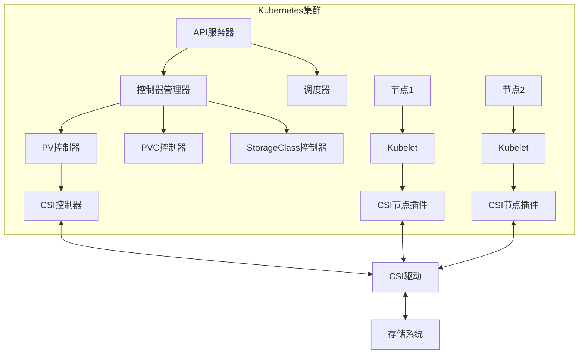
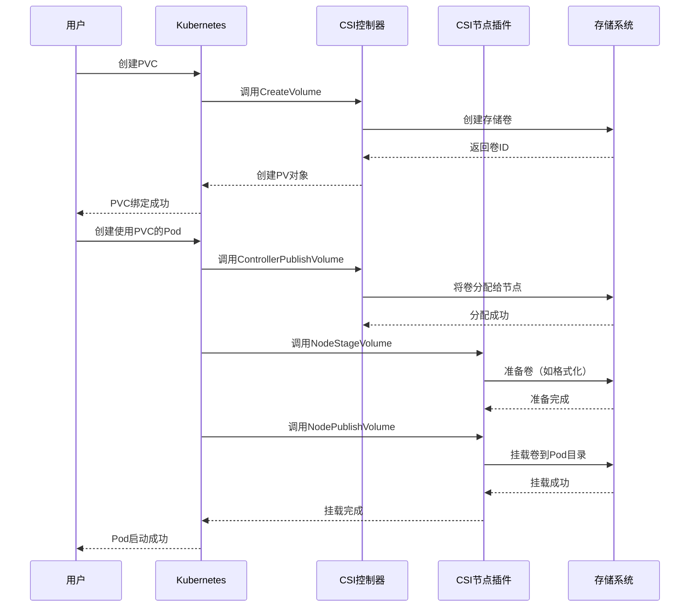
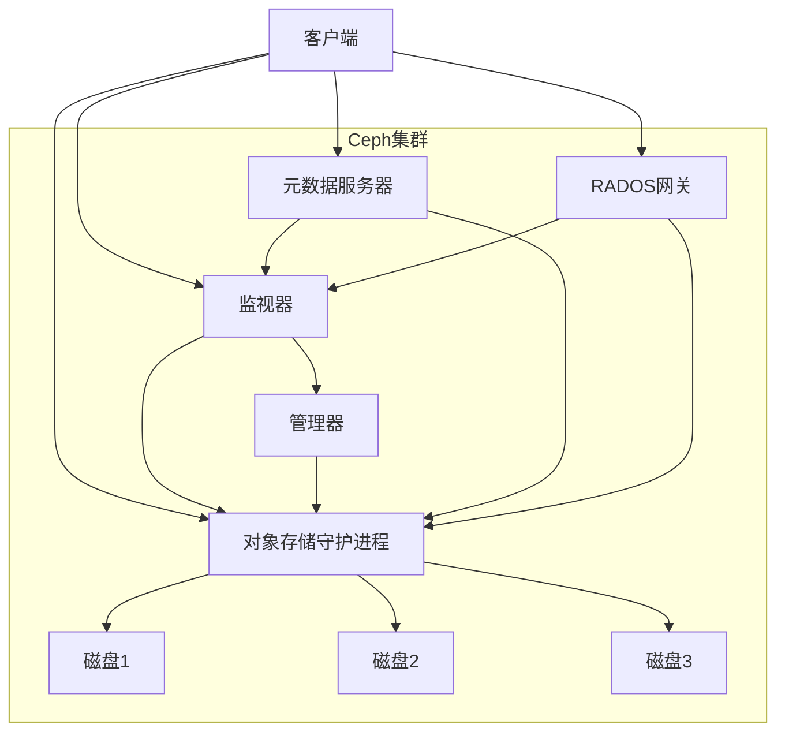
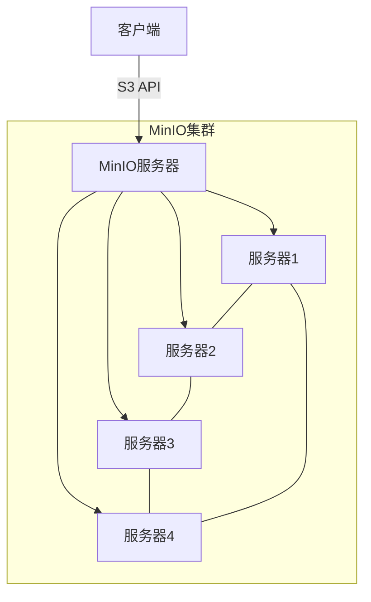
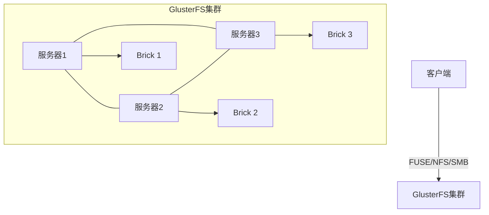
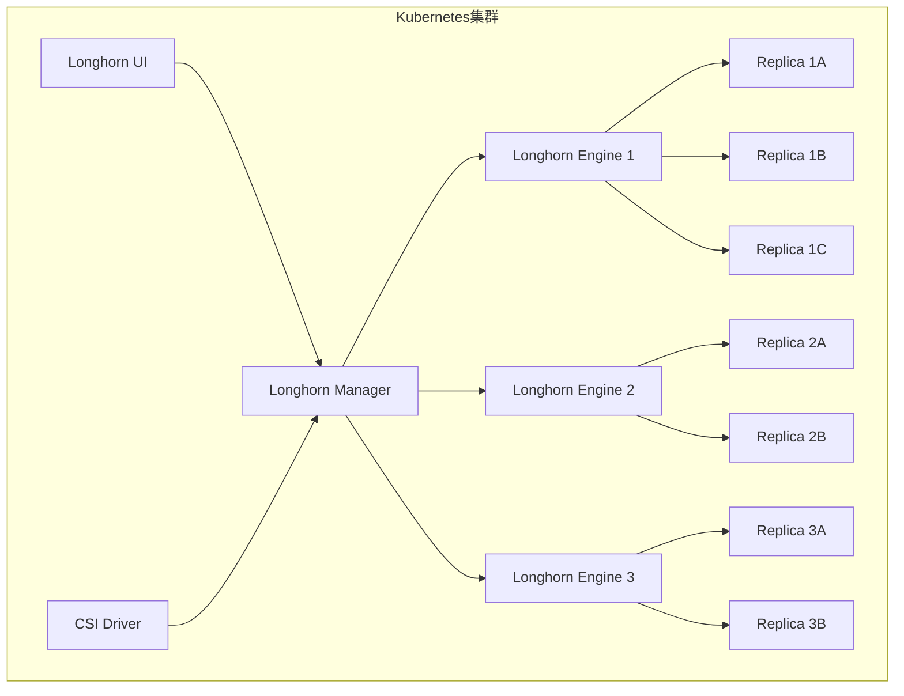

# 分布式存储系统集成

## 分布式存储系统概述

分布式存储系统是现代云原生架构的基础组件，它通过将数据分散存储在多个物理节点上，提供高可用性、可扩展性和容错能力。在云原生环境中，特别是Kubernetes平台上，集成分布式存储系统对于支持有状态应用、数据持久化和数据共享至关重要。

### 分布式存储的核心特性

1. **高可用性**：
   - 数据冗余存储，避免单点故障
   - 自动故障检测和恢复
   - 跨节点、跨机架甚至跨数据中心的数据分布

2. **可扩展性**：
   - 水平扩展能力，通过添加节点增加存储容量
   - 动态扩容，无需停机
   - 负载均衡，优化数据分布

3. **一致性保证**：
   - 支持不同级别的数据一致性模型
   - 事务支持
   - 版本控制

4. **多接口支持**：
   - 块存储：适用于数据库等需要原始磁盘访问的应用
   - 文件存储：提供标准文件系统接口
   - 对象存储：适用于大规模非结构化数据存储

### 常见分布式存储系统对比

| 特性 | Ceph | MinIO | GlusterFS | Longhorn |
|------|------|-------|-----------|----------|
| 存储类型 | 块、文件、对象 | 对象 | 文件 | 块 |
| 架构复杂度 | 高 | 低 | 中 | 低 |
| 适用规模 | 大型 | 中小型 | 中型 | 小型 |
| 性能 | 高（调优后） | 高 | 中 | 中 |
| 部署难度 | 高 | 低 | 中 | 低 |
| 云原生集成 | 良好 | 极佳 | 良好 | 原生 |
| 社区活跃度 | 高 | 高 | 中 | 中 |
| 商业支持 | 有 | 有 | 有 | 有 |

## Kubernetes存储集成基础

在深入特定存储系统集成之前，了解Kubernetes的存储架构和集成机制是必要的。

### Kubernetes存储架构



### 容器存储接口（CSI）

CSI是Kubernetes与存储系统之间的标准接口，它允许存储供应商开发独立于Kubernetes核心代码的插件，使其存储系统能够与Kubernetes无缝集成。

#### CSI组件

1. **CSI控制器插件**：
   - 负责卷的创建、删除、挂载和卸载
   - 通常作为Deployment部署在Kubernetes集群中

2. **CSI节点插件**：
   - 负责在节点上格式化和挂载卷
   - 通常作为DaemonSet部署，确保每个节点都有一个实例

3. **CSI驱动注册器**：
   - 向Kubernetes注册CSI驱动
   - 创建必要的套接字目录

#### CSI工作流程



## Ceph存储系统集成

Ceph是一个高度可扩展的分布式存储系统，提供块存储、文件存储和对象存储接口。它是企业级分布式存储的主流选择之一。

### Ceph架构概述



Ceph的核心组件包括：

1. **监视器（Monitor，MON）**：
   - 维护集群状态映射
   - 提供一致性保证
   - 处理客户端认证

2. **对象存储守护进程（OSD）**：
   - 存储数据和处理复制
   - 监控其他OSD的健康状态
   - 参与数据恢复和再平衡

3. **管理器（Manager，MGR）**：
   - 提供额外的监控和接口
   - 管理集群状态和统计信息
   - 托管基于Python的模块扩展功能

4. **元数据服务器（MDS）**：
   - 管理CephFS文件系统元数据
   - 提供POSIX兼容的文件系统接口

5. **RADOS网关（RGW）**：
   - 提供S3和Swift兼容的对象存储接口
   - 管理对象元数据和数据

### Ceph-CSI部署

Ceph-CSI是连接Kubernetes和Ceph的CSI驱动，支持RBD（块存储）和CephFS（文件系统）。

#### 前置条件

1. 运行中的Kubernetes集群（1.13+）
2. 运行中的Ceph集群
3. 配置好的Ceph客户端访问权限

#### 部署步骤

1. **克隆Ceph-CSI仓库**：

```bash
git clone https://github.com/ceph/ceph-csi.git
cd ceph-csi/deploy/kubernetes
```

2. **创建命名空间**：

```bash
kubectl create namespace ceph-csi
```

3. **配置Ceph集群信息**：

创建一个包含Ceph集群信息的ConfigMap：

```yaml
apiVersion: v1
kind: ConfigMap
metadata:
  name: ceph-csi-config
  namespace: ceph-csi
data:
  config.json: |-
    [
      {
        "clusterID": "01234567-89ab-cdef-0123-456789abcdef",
        "monitors": [
          "192.168.1.1:6789",
          "192.168.1.2:6789",
          "192.168.1.3:6789"
        ]
      }
    ]
```

4. **部署RBD CSI驱动**：

```bash
# 部署RBAC资源
kubectl apply -f csi-provisioner-rbac.yaml
kubectl apply -f csi-nodeplugin-rbac.yaml

# 部署CSI控制器
kubectl apply -f csi-rbdplugin-provisioner.yaml

# 部署CSI节点插件
kubectl apply -f csi-rbdplugin.yaml
```

5. **部署CephFS CSI驱动**（如果需要）：

```bash
# 部署CSI控制器
kubectl apply -f csi-cephfsplugin-provisioner.yaml

# 部署CSI节点插件
kubectl apply -f csi-cephfsplugin.yaml
```

6. **验证部署**：

```bash
kubectl get pods -n ceph-csi
```

### 配置Ceph RBD存储类

RBD（RADOS Block Device）提供块存储功能，适用于数据库等需要原始磁盘访问的应用。

#### 创建Ceph用户和池

在Ceph集群中创建专用用户和存储池：

```bash
# 创建存储池
ceph osd pool create kubernetes 128

# 启用RBD功能
ceph osd pool application enable kubernetes rbd

# 创建用户
ceph auth get-or-create client.kubernetes mon 'profile rbd' osd 'profile rbd pool=kubernetes' mgr 'profile rbd pool=kubernetes'

# 获取密钥
ceph auth get-key client.kubernetes
```

#### 创建Kubernetes Secret

将Ceph用户凭证存储为Kubernetes Secret：

```yaml
apiVersion: v1
kind: Secret
metadata:
  name: ceph-rbd-secret
  namespace: ceph-csi
stringData:
  userID: kubernetes
  userKey: AQBCEJhgAAAAABAA7Lz/k30uIqZoEg5fNQjX1A==
```

#### 创建StorageClass

```yaml
apiVersion: storage.k8s.io/v1
kind: StorageClass
metadata:
  name: ceph-rbd
provisioner: rbd.csi.ceph.com
parameters:
  clusterID: 01234567-89ab-cdef-0123-456789abcdef
  pool: kubernetes
  imageFormat: "2"
  imageFeatures: layering
  csi.storage.k8s.io/provisioner-secret-name: ceph-rbd-secret
  csi.storage.k8s.io/provisioner-secret-namespace: ceph-csi
  csi.storage.k8s.io/controller-expand-secret-name: ceph-rbd-secret
  csi.storage.k8s.io/controller-expand-secret-namespace: ceph-csi
  csi.storage.k8s.io/node-stage-secret-name: ceph-rbd-secret
  csi.storage.k8s.io/node-stage-secret-namespace: ceph-csi
  csi.storage.k8s.io/fstype: ext4
allowVolumeExpansion: true
reclaimPolicy: Delete
```

### 配置CephFS存储类

CephFS提供POSIX兼容的文件系统，支持多个Pod同时读写（ReadWriteMany）。

#### 创建Ceph用户和文件系统

```bash
# 创建CephFS文件系统（如果尚未创建）
ceph fs ls  # 检查现有文件系统
# 如果没有文件系统，创建一个
ceph osd pool create cephfs_data 128
ceph osd pool create cephfs_metadata 32
ceph fs new cephfs cephfs_metadata cephfs_data

# 创建用户
ceph auth get-or-create client.cephfs mon 'allow r' mds 'allow rw' osd 'allow rw pool=cephfs_data, allow rw pool=cephfs_metadata'

# 获取密钥
ceph auth get-key client.cephfs
```

#### 创建Kubernetes Secret

```yaml
apiVersion: v1
kind: Secret
metadata:
  name: ceph-cephfs-secret
  namespace: ceph-csi
stringData:
  adminID: cephfs
  adminKey: AQBCEJhgAAAAABAAoLz/k30uIqZoEg5fNQjX1A==
```

#### 创建StorageClass

```yaml
apiVersion: storage.k8s.io/v1
kind: StorageClass
metadata:
  name: ceph-cephfs
provisioner: cephfs.csi.ceph.com
parameters:
  clusterID: 01234567-89ab-cdef-0123-456789abcdef
  fsName: cephfs
  pool: cephfs_data
  csi.storage.k8s.io/provisioner-secret-name: ceph-cephfs-secret
  csi.storage.k8s.io/provisioner-secret-namespace: ceph-csi
  csi.storage.k8s.io/controller-expand-secret-name: ceph-cephfs-secret
  csi.storage.k8s.io/controller-expand-secret-namespace: ceph-csi
  csi.storage.k8s.io/node-stage-secret-name: ceph-cephfs-secret
  csi.storage.k8s.io/node-stage-secret-namespace: ceph-csi
allowVolumeExpansion: true
reclaimPolicy: Delete
```

### 使用Ceph存储

#### 创建RBD PVC

```yaml
apiVersion: v1
kind: PersistentVolumeClaim
metadata:
  name: mysql-data
spec:
  accessModes:
    - ReadWriteOnce
  resources:
    requests:
      storage: 10Gi
  storageClassName: ceph-rbd
```

#### 创建CephFS PVC

```yaml
apiVersion: v1
kind: PersistentVolumeClaim
metadata:
  name: shared-data
spec:
  accessModes:
    - ReadWriteMany
  resources:
    requests:
      storage: 10Gi
  storageClassName: ceph-cephfs
```

#### 在Pod中使用PVC

```yaml
apiVersion: v1
kind: Pod
metadata:
  name: mysql
spec:
  containers:
  - name: mysql
    image: mysql:5.7
    env:
    - name: MYSQL_ROOT_PASSWORD
      value: "password"
    volumeMounts:
    - name: data
      mountPath: /var/lib/mysql
  volumes:
  - name: data
    persistentVolumeClaim:
      claimName: mysql-data
```

## MinIO对象存储集成

MinIO是一个高性能的对象存储服务器，兼容Amazon S3 API，适用于构建私有云存储服务。

### MinIO架构概述



MinIO的主要特点：

1. **简单部署**：
   - 单一二进制文件，无外部依赖
   - 支持容器化部署
   - 轻量级资源需求

2. **高性能**：
   - 优化的读写性能
   - 支持纠删码（Erasure Coding）
   - 位腐烂保护（Bit Rot Protection）

3. **S3兼容性**：
   - 完全兼容Amazon S3 API
   - 支持S3生态系统工具
   - 简化应用迁移

4. **安全性**：
   - 支持TLS加密
   - 身份验证和访问控制
   - 服务器端加密

### MinIO Operator部署

MinIO Operator是在Kubernetes上部署和管理MinIO的推荐方式。

#### 安装MinIO Operator

1. **使用Helm安装**：

```bash
# 添加MinIO Helm仓库
helm repo add minio https://operator.min.io/

# 更新仓库
helm repo update

# 安装MinIO Operator
helm install --namespace minio-operator --create-namespace --generate-name minio/minio-operator
```

2. **或使用kubectl安装**：

```bash
kubectl apply -f https://raw.githubusercontent.com/minio/operator/master/docs/kustomization/base/operator.yaml
```

#### 验证安装

```bash
kubectl get pods -n minio-operator
```

### 部署MinIO租户

MinIO租户是一个独立的MinIO实例，可以是单节点或分布式部署。

#### 创建MinIO租户

```yaml
apiVersion: minio.min.io/v2
kind: Tenant
metadata:
  name: minio-tenant-1
  namespace: tenant-1
spec:
  # 租户配置
  image: minio/minio:RELEASE.2023-01-25T00-19-54Z
  imagePullPolicy: IfNotPresent
  
  # 服务配置
  serviceMetadata:
    labels:
      app: minio-tenant-1
  
  # 凭证配置
  credsSecret:
    name: minio-creds-secret
  
  # 存储配置
  pools:
    - name: pool-0
      servers: 4
      volumesPerServer: 4
      volumeClaimTemplate:
        metadata:
          name: data
        spec:
          accessModes:
            - ReadWriteOnce
          resources:
            requests:
              storage: 1Ti
          storageClassName: standard
  
  # 资源配置
  resources:
    requests:
      cpu: 2
      memory: 4Gi
    limits:
      cpu: 4
      memory: 8Gi
  
  # 控制台配置
  console:
    image: minio/console:v0.20.0
    replicas: 1
    resources:
      requests:
        cpu: 500m
        memory: 512Mi
      limits:
        cpu: 1
        memory: 1Gi
```

在创建租户之前，需要创建凭证Secret：

```yaml
apiVersion: v1
kind: Secret
metadata:
  name: minio-creds-secret
  namespace: tenant-1
type: Opaque
data:
  accesskey: bWluaW8= # "minio" in base64
  secretkey: bWluaW8xMjM= # "minio123" in base64
```

#### 访问MinIO控制台

```bash
# 获取控制台服务
kubectl get svc -n tenant-1

# 端口转发（如果需要）
kubectl port-forward svc/minio-tenant-1-console -n tenant-1 9090:9090
```

访问 http://localhost:9090 并使用之前设置的凭证登录。

### 配置MinIO存储类

MinIO CSI驱动允许Kubernetes使用MinIO作为持久卷的后端存储。

#### 安装MinIO CSI驱动

```bash
# 克隆仓库
git clone https://github.com/minio/direct-csi.git
cd direct-csi

# 安装驱动
kubectl apply -k deploy/kubernetes/direct-csi/
```

#### 创建StorageClass

```yaml
apiVersion: storage.k8s.io/v1
kind: StorageClass
metadata:
  name: direct-csi-min-io
provisioner: direct.csi.min.io
parameters:
  # 可选参数
allowVolumeExpansion: true
reclaimPolicy: Delete
volumeBindingMode: Immediate
```

### 使用MinIO对象存储

#### 创建MinIO客户端配置

```yaml
apiVersion: v1
kind: ConfigMap
metadata:
  name: mc-config
data:
  config.json: |-
    {
      "version": "10",
      "aliases": {
        "minio": {
          "url": "http://minio-tenant-1-hl-svc.tenant-1.svc.cluster.local:80",
          "accessKey": "minio",
          "secretKey": "minio123",
          "api": "s3v4",
          "path": "auto"
        }
      }
    }
```

#### 创建桶和设置策略

```yaml
apiVersion: batch/v1
kind: Job
metadata:
  name: minio-setup
spec:
  template:
    spec:
      containers:
      - name: mc
        image: minio/mc
        command:
        - /bin/sh
        - -c
        - |
          mc alias set minio http://minio-tenant-1-hl-svc.tenant-1.svc.cluster.local:80 minio minio123
          mc mb minio/mybucket
          mc policy set public minio/mybucket
        volumeMounts:
        - name: config
          mountPath: /root/.mc/config.json
          subPath: config.json
      restartPolicy: Never
      volumes:
      - name: config
        configMap:
          name: mc-config
```

#### 在应用中使用MinIO

```yaml
apiVersion: apps/v1
kind: Deployment
metadata:
  name: minio-client-app
spec:
  replicas: 1
  selector:
    matchLabels:
      app: minio-client
  template:
    metadata:
      labels:
        app: minio-client
    spec:
      containers:
      - name: app
        image: python:3.9
        command:
        - /bin/sh
        - -c
        - |
          pip install boto3
          python -c '
          import boto3
          s3 = boto3.client("s3",
                           endpoint_url="http://minio-tenant-1-hl-svc.tenant-1.svc.cluster.local:80",
                           aws_access_key_id="minio",
                           aws_secret_access_key="minio123")
          s3.put_object(Bucket="mybucket", Key="hello.txt", Body="Hello, MinIO!")
          print("Object uploaded successfully")
          '
          sleep infinity
```

## GlusterFS存储系统集成

GlusterFS是一个开源的分布式文件系统，适用于需要高可用性和可扩展性的文件存储场景。

### GlusterFS架构概述



GlusterFS的主要组件：

1. **Brick**：
   - 存储的基本单元，通常是服务器上的目录
   - 每个Brick包含文件和元数据

2. **卷（Volume）**：
   - 由多个Brick组成的逻辑存储单元
   - 支持多种类型：分布式、复制、条带化等

3. **Translator**：
   - 实现各种功能的模块
   - 组成处理堆栈，处理I/O操作

### 部署GlusterFS

GlusterFS可以直接在主机上部署，也可以在Kubernetes中使用容器化部署。

#### 主机部署

在每个存储节点上安装GlusterFS：

```bash
# 在Debian/Ubuntu上
apt-get install -y glusterfs-server

# 在RHEL/CentOS上
yum install -y glusterfs-server

# 启动服务
systemctl enable glusterd
systemctl start glusterd
```

#### 创建GlusterFS卷

```bash
# 在第一个节点上执行
# 添加对等节点
gluster peer probe node2
gluster peer probe node3

# 检查对等状态
gluster peer status

# 创建复制卷
gluster volume create gv0 replica 3 \
  node1:/data/brick1/gv0 \
  node2:/data/brick1/gv0 \
  node3:/data/brick1/gv0

# 启动卷
gluster volume start gv0

# 检查卷状态
gluster volume info
```

### 配置GlusterFS存储类

#### 安装GlusterFS客户端

在Kubernetes的每个节点上安装GlusterFS客户端：

```bash
# 在Debian/Ubuntu上
apt-get install -y glusterfs-client

# 在RHEL/CentOS上
yum install -y glusterfs-client
```

#### 创建Endpoints和Service

```yaml
apiVersion: v1
kind: Endpoints
metadata:
  name: glusterfs-cluster
subsets:
  - addresses:
      - ip: 192.168.1.10  # GlusterFS节点1的IP
      - ip: 192.168.1.11  # GlusterFS节点2的IP
      - ip: 192.168.1.12  # GlusterFS节点3的IP
    ports:
      - port: 1
---
apiVersion: v1
kind: Service
metadata:
  name: glusterfs-cluster
spec:
  ports:
  - port: 1
```

#### 创建StorageClass

```yaml
apiVersion: storage.k8s.io/v1
kind: StorageClass
metadata:
  name: glusterfs
provisioner: kubernetes.io/glusterfs
parameters:
  resturl: "http://192.168.1.10:8080"  # Heketi服务URL
  restauthenabled: "true"
  restuser: "admin"
  secretNamespace: "default"
  secretName: "heketi-secret"
  volumetype: "replicate:3"
```

注意：GlusterFS通常与Heketi一起使用，Heketi是GlusterFS的RESTful管理接口，用于动态配置卷。

#### 创建Heketi Secret

```yaml
apiVersion: v1
kind: Secret
metadata:
  name: heketi-secret
  namespace: default
type: kubernetes.io/glusterfs
data:
  key: BASE64_ENCODED_PASSWORD
```

### 使用GlusterFS存储

#### 创建PVC

```yaml
apiVersion: v1
kind: PersistentVolumeClaim
metadata:
  name: gluster-pvc
spec:
  accessModes:
    - ReadWriteMany
  resources:
    requests:
      storage: 10Gi
  storageClassName: glusterfs
```

#### 在Pod中使用PVC

```yaml
apiVersion: v1
kind: Pod
metadata:
  name: web-server
spec:
  containers:
  - name: nginx
    image: nginx
    volumeMounts:
    - name: gluster-vol
      mountPath: /usr/share/nginx/html
  volumes:
  - name: gluster-vol
    persistentVolumeClaim:
      claimName: gluster-pvc
```

## Longhorn存储系统集成

Longhorn是一个轻量级、可靠且功能强大的分布式块存储系统，专为Kubernetes设计。

### Longhorn架构概述



Longhorn的主要组件：

1. **Longhorn Manager**：
   - 控制卷的生命周期
   - 管理引擎实例和副本
   - 提供API服务

2. **Longhorn Engine**：
   - 实现块设备功能
   - 管理数据复制
   - 处理I/O操作

3. **Longhorn UI**：
   - Web界面，用于管理和监控
   - 可