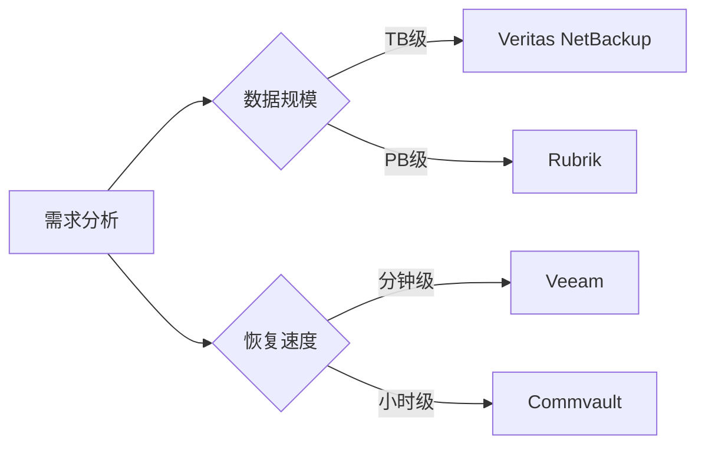
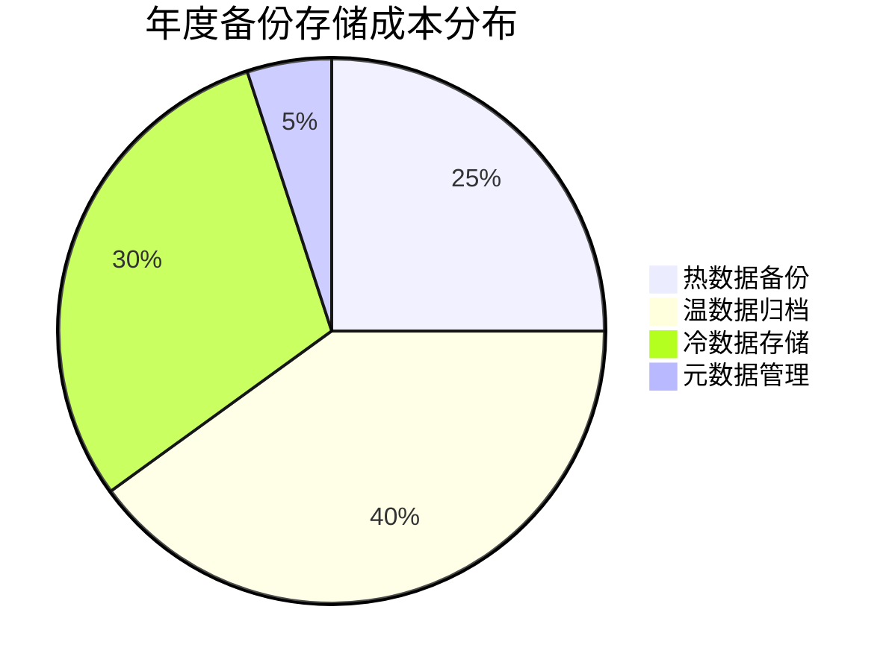

```markdown:c:\project\kphub/docs/data-backup-dr.md
---
title: 数据备份与灾难恢复
icon: practice
order: 8
---

# 数据备份与灾难恢复

数据安全是云原生存储的核心关注点，本文将系统介绍云原生环境中的数据保护体系。从基础原理到前沿技术，从工具使用到架构设计，全面解析数据备份与灾难恢复的实践方案。

## 1. 数据备份基础

### 1.1 备份核心原则

````mermaid
graph TD
    A[备份原则] --> B[3-2-1法则]
    A --> C[黄金副本管理]
    A --> D[生命周期管理]
    
    B --> B1[至少3份副本]
    B --> B2[2种不同介质]
    B --> B3[1份异地备份]
    
    C --> C1[版本控制]
    C --> C2[哈希校验]
    C --> C3[不可变存储]
    
    D --> D1[热数据备份]
    D --> D2[温数据归档]
    D --> D3[冷数据销毁]
````

#### 1.1.1 3-2-1原则详解
```bash
# 备份存储位置示例
本地磁盘 --> 网络存储(NAS) --> 云存储(S3)
       ↓           ↓              ↓
    SSD RAID6  磁带库         异地云区域
```

### 1.2 备份类型对比

| 类型         | RPO   | RTO   | 存储成本 | 适用场景           |
|--------------|-------|-------|----------|--------------------|
| 完整备份     | 24h   | 4-8h  | 高       | 周级基线           |
| 增量备份     | 1h    | 2-4h  | 低       | 日常业务数据       |
| 差异备份     | 4h    | 3-6h  | 中       | 中型数据库         |
| 持续保护     | 15min | 15min | 极高     | 核心交易系统       |
| 快照         | 5min  | 1min  | 中       | 虚拟机/容器        |

## 2. 云原生备份策略

### 2.1 Kubernetes数据保护

#### 2.1.1 Velero工作流程
````mermaid
sequenceDiagram
    participant A as Velero客户端
    participant B as Kubernetes集群
    participant C as 对象存储
    
    A->>B: 创建备份请求
    B->>B: 冻结写入操作
    B->>C: 上传PV数据
    B->>C: 存储资源定义
    B->>A: 返回备份状态
    C->>C: 加密压缩存储
````

备份操作示例：
```bash
velero backup create nginx-backup \
  --include-namespaces=nginx \
  --snapshot-volumes \
  --storage-location=aws-s3 \
  --ttl=720h
```

### 2.2 数据库备份方案

#### 2.2.1 MySQL物理+逻辑备份
```python
# 备份脚本示例
def mysql_backup():
    # 物理备份
    run("innobackupex --compress /backup/phy")
    
    # 逻辑备份
    run("mysqldump --single-transaction \
        --routines --triggers \
        --all-databases > /backup/logic/full.sql")
    
    # 上传云存储
    upload_to_s3("/backup")
    
    # 验证备份
    if verify_backup():
        cleanup_old(keep_last=5)
```

## 3. 灾难恢复计划

### 3.1 恢复策略矩阵

| 灾难级别 | 影响范围       | 恢复目标       | 技术方案                     |
|----------|----------------|----------------|------------------------------|
| 1级      | 单个节点故障   | <5分钟         | 本地快照恢复                 |
| 2级      | 机房级故障     | <1小时         | 跨AZ存储同步                 |
| 3级      | 区域级灾难     | <4小时         | 多云异地备份                 |
| 4级      | 全平台崩溃     | <24小时        | 离线磁带恢复                 |

### 3.2 恢复演练流程

````mermaid
graph TD
    A[制定演练计划] --> B[创建隔离环境]
    B --> C[恢复基础架构]
    C --> D[恢复数据]
    D --> E[验证业务]
    E --> F[生成报告]
    
    subgraph 关键指标
    F --> F1[RTO达成率]
    F --> F2[RPO偏差值]
    F --> F3[数据完整性]
    end
````

## 4. 工具与实施方案

### 4.1 开源工具对比

| 工具       | 存储支持          | 加密能力      | 增量备份 | 云原生集成 |
|------------|-------------------|---------------|----------|------------|
| Velero     | S3/GCS/Azure      | AES-256       | ✔️       | ✔️         |
| Kasten     | 多云存储          | KMS集成       | ✔️       | ✔️         |
| Restic     | 本地/云存储       | AES-CTR       | ✔️       | ❌         |
| BorgBackup | 自有仓库          | 无            | ✔️       | ❌         |

### 4.2 商业方案选型



## 5. 最佳实践案例

### 5.1 金融行业双活方案

````mermaid
graph LR
    A[生产中心] -->|同步复制| B[同城灾备]
    A -->|异步复制| C[异地灾备]
    B --> D[核心交易]
    C --> E[数据分析]
    
    subgraph 数据流
    A1[交易系统] --> A2[Oracle DG]
    A2 --> B2[存储镜像]
    A2 --> C2[日志归档]
    end
````

### 5.2 容器平台恢复演练

```yaml
# 恢复测试Job示例
apiVersion: batch/v1
kind: CronJob
metadata:
  name: disaster-drill
spec:
  schedule: "0 3 * * 6"
  jobTemplate:
    spec:
      template:
        spec:
          containers:
          - name: drill-runner
            image: dr-toolkit:latest
            command: ["/bin/sh", "-c"]
            args:
              - |
                velero restore create --from-backup last-known-good \
                --preserve-nodeports \
                --wait
          restartPolicy: OnFailure
```

## 6. 成本优化策略

### 6.1 存储分层设计



### 6.2 数据去重技术

| 算法         | 去重率 | CPU消耗 | 适用场景         |
|--------------|--------|---------|------------------|
| 定长分块     | 20-30% | 低      | 虚拟机镜像       |
| 变长分块     | 40-50% | 中      | 文件系统         |
| 全局哈希     | 60-70% | 高      | 对象存储         |
| 内容感知     | 80%+   | 极高    | 医疗影像数据     |

## 7. 前沿技术发展

### 7.1 不可变存储实践

```go
// 基于COS的不可变存储示例
func putImmutableObject(bucket, key string, data []byte) error {
    opts := &cos.ObjectPutOptions{
        ObjectPutHeaderOptions: &cos.ObjectPutHeaderOptions{
            XOptionHeader: &http.Header{},
        },
    }
    opts.XOptionHeader.Set("x-cos-object-lock","true")
    _, err := client.Object.Put(context.Background(), key, bytes.NewReader(data), opts)
    return err
}
```

### 7.2 AI驱动的预测恢复

````mermaid
sequenceDiagram
    participant A as 监控系统
    participant B as AI引擎
    participant C as 备份系统
    
    A->>B: 发送健康指标
    B->>B: 风险预测分析
    B->>C: 触发预防性备份
    C->>A: 反馈备份状态
    B->>A: 生成修复建议
````

通过本文的体系化讲解，读者可以掌握从基础备份原理到云原生灾备方案的完整知识链。建议企业根据自身业务需求，分阶段实施数据保护策略，优先保障核心业务连续性，逐步构建全方位的数据安全体系。
```