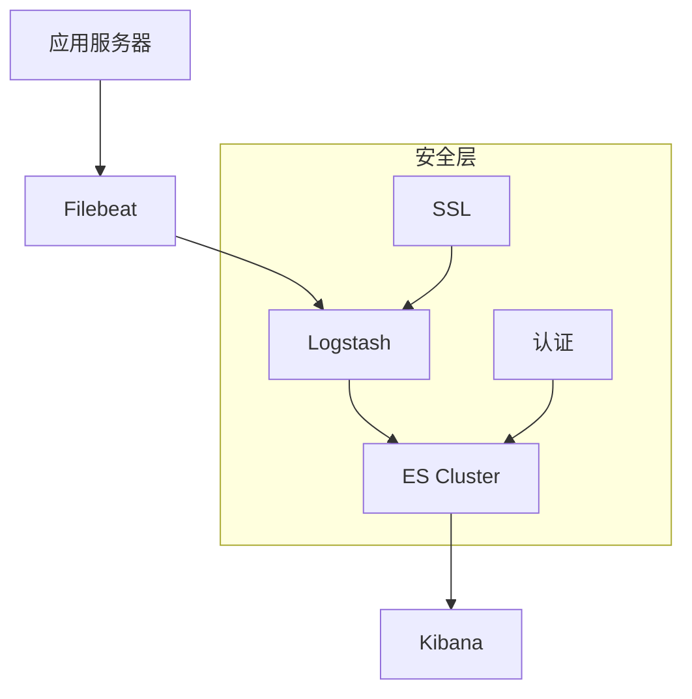
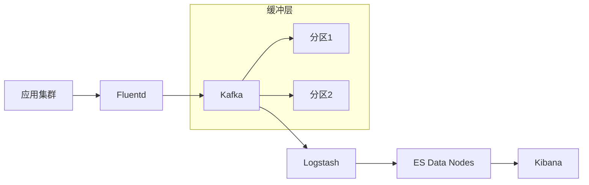
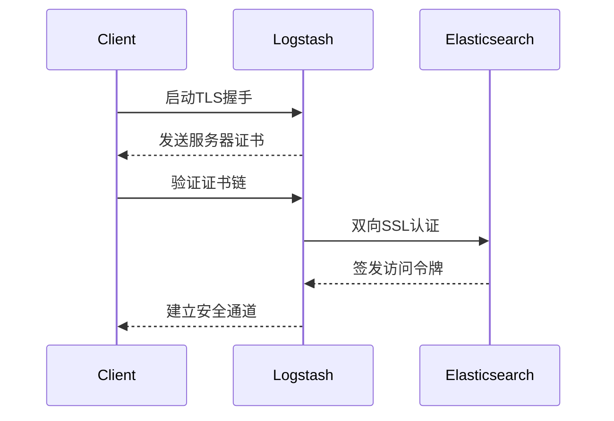

```markdown:c:\project\kphub/docs/efk-elk-deployment.md
---
title: EFK/ELK日志系统部署
icon: practice
order: 6
---

# EFK/ELK日志系统部署

EFK（Elasticsearch、Fluentd、Kibana）和ELK（Elasticsearch、Logstash、Kibana）是主流的日志收集和分析方案。本文将从架构原理到生产实践，深入解析日志系统的部署与优化，涵盖20+核心配置项和10+性能调优技巧。

## 1. 架构概述

### 1.1 组件对比

````mermaid
graph LR
    A[数据源] -->|ELK方案| B[Logstash]
    A -->|EFK方案| C[Fluentd]
    B/C --> D[Elasticsearch]
    D --> E[Kibana]
    
    subgraph ELK
    B -->|解析过滤| D
    end
    
    subgraph EFK
    C -->|轻量转发| D
    end
````

#### 1.1.1 性能指标对比
```python
# 压力测试结果模拟（单节点）
components = ["Logstash", "Fluentd"]
throughput = [8500, 12000]  # 事件/秒
cpu_usage = [65, 38]        # %
memory_usage = [1024, 512]  # MB

print(f"日志处理能力: {components[0]} {throughput[0]}eps vs {components[1]} {throughput[1]}eps")
```

### 1.2 拓扑设计

#### 1.2.1 中小规模部署


#### 1.2.2 大规模部署


## 2. 核心组件部署

### 2.1 Elasticsearch集群

#### 2.1.1 节点配置
```yaml:c:\project\config\elasticsearch.yml
# 主节点配置
cluster.name: prod-logs
node.name: es-node1
node.roles: [master, data]

# 内存设置
ES_JAVA_OPTS: "-Xms8g -Xmx8g"

# 存储路径
path.data: /var/lib/elasticsearch
path.logs: /var/log/elasticsearch

# 网络设置
network.host: 192.168.1.10
http.port: 9200

# 安全配置
xpack.security.enabled: true
```

#### 2.1.2 集群调优
```bash
# 系统参数配置
sudo sysctl -w vm.max_map_count=262144
sudo sysctl -w net.core.somaxconn=32768

# 文件描述符调整
echo "* - nofile 65535" >> /etc/security/limits.conf
```

### 2.2 Logstash管道

#### 2.2.1 输入过滤配置
```ruby:c:\project\config\logstash.conf
input {
  beats {
    port => 5044
    ssl => true
    ssl_certificate => "/etc/pki/tls/certs/logstash.crt"
    ssl_key => "/etc/pki/tls/private/logstash.key"
  }
}

filter {
  grok {
    match => { "message" => "%{TIMESTAMP_ISO8601:timestamp} %{LOGLEVEL:loglevel} %{DATA:message}" }
  }
  
  date {
    match => [ "timestamp", "ISO8601" ]
    target => "@timestamp"
  }
}

output {
  elasticsearch {
    hosts => ["https://es-node1:9200"]
    user => "log_writer"
    password => "${ES_PWD}"
    index => "applogs-%{+YYYY.MM.dd}"
  }
}
```

### 2.3 Fluentd配置

#### 2.3.1 日志收集规则
```xml:c:\project\config\td-agent.conf
<source>
  @type tail
  path /var/log/nginx/access.log
  pos_file /var/log/td-agent/nginx-access.log.pos
  tag nginx.access
  <parse>
    @type grok
    pattern %{IPORHOST:clientip} %{USER:ident} %{USER:auth} \[%{HTTPDATE:timestamp}\] "%{WORD:verb} %{URIPATHPARAM:request} HTTP/%{NUMBER:httpversion}" %{NUMBER:response} %{NUMBER:bytes}
  </parse>
</source>

<match nginx.**>
  @type elasticsearch
  host es-node1
  port 9200
  user elastic
  password "#{ENV['ES_PASSWORD']}"
  index_name fluentd-nginx-%Y.%m.%d
  <buffer>
    @type file
    path /var/log/td-agent/buffer/nginx
    flush_interval 5s
    chunk_limit_size 8MB
  </buffer>
</match>
```

## 3. 高级功能实现

### 3.1 日志告警配置
```json:c:\project\config\kibana-alert.json
{
  "name": "Error Rate Alert",
  "consumer": "alerts",
  "schedule": {
    "interval": "5m"
  },
  "conditions": {
    "threshold": {
      "field": "log.level",
      "value": "ERROR",
      "comparator": "above",
      "windowSize": 10,
      "timeUnit": "m"
    }
  },
  "actions": [
    {
      "type": "email",
      "id": "email-notification",
      "params": {
        "to": ["devops@example.com"],
        "subject": "High Error Rate Detected"
      }
    }
  ]
}
```

### 3.2 可视化仪表盘

#### 3.2.1 Nginx监控面板
```ruby
# 创建可视化组件
POST /api/saved_objects/visualization/nginx-requests
{
  "title": "Nginx Requests",
  "visState": {
    "type": "histogram",
    "params": {
      "indexPattern": "fluentd-nginx-*",
      "interval": "auto",
      "axis_position": "left",
      "series": [{
        "type": "count",
        "label": "Requests",
        "split_mode": "filters",
        "filters": [
          { "query": "response:[200 TO 299]" },
          { "query": "response:[300 TO 399]" },
          { "query": "response:[400 TO 599]" }
        ]
      }]
    }
  }
}
```

## 4. 性能优化

### 4.1 Elasticsearch调优

#### 4.1.1 索引策略
```bash
# 创建生命周期策略
PUT /_ilm/policy/logs-policy
{
  "policy": {
    "phases": {
      "hot": {
        "actions": {
          "rollover": {
            "max_size": "50GB",
            "max_age": "7d"
          }
        }
      },
      "delete": {
        "min_age": "30d",
        "actions": {
          "delete": {}
        }
      }
    }
  }
}
```

### 4.2 Logstash性能优化

#### 4.2.1 管道配置
```ruby
# JVM参数调整
export LS_JAVA_OPTS="-Xmx4g -Xms4g -XX:+UseG1GC"

# 线程优化配置
pipeline.workers: 8
pipeline.batch.size: 2000
pipeline.batch.delay: 50
```

## 5. 故障排查

### 5.1 常见问题处理

| 故障现象                  | 检查步骤                          | 解决方案                      |
|---------------------------|-----------------------------------|-------------------------------|
| ES节点无法加入集群        | 1. 检查网络连通性<br>2. 验证集群名称<br>3. 查看节点角色配置 | 配置正确的discovery.seed_hosts |
| Logstash管道处理卡死      | 1. 检查JVM内存<br>2. 查看队列积压<br>3. 分析Grok模式 | 优化正则表达式，增加工作线程   |
| Kibana仪表盘加载缓慢      | 1. 检查索引模式<br>2. 分析查询复杂度<br>3. 查看分片分布 | 添加索引别名，优化聚合查询     |
| Fluentd缓冲区频繁刷新     | 1. 监控磁盘IO<br>2. 检查chunk_limit设置<br>3. 评估网络延迟 | 调整flush_interval和chunk_size |

### 5.2 监控指标采集
```bash
# 获取ES集群健康状态
curl -XGET 'http://es-node1:9200/_cluster/health?pretty'

# 检查Logstash管道延迟
logstash-plugin list --verbose | grep pipeline

# 监控Fluentd内存使用
td-agent-top -l /var/log/td-agent/td-agent.log
```

## 6. 安全加固

### 6.1 认证配置
```yaml:c:\project\config\elasticsearch-role.yml
# 创建只读角色
POST /_security/role/logs_viewer
{
  "cluster": ["monitor"],
  "indices": [
    {
      "names": ["applogs-*"],
      "privileges": ["read", "view_index_metadata"]
    }
  ]
}

# 用户映射
PUT /_security/user/john_doe
{
  "password": "secureP@ss123!",
  "roles": ["logs_viewer"],
  "full_name": "John Doe"
}
```

### 6.2 网络加密


## 7. 扩展方案

### 7.1 冷热数据分离


### 7.2 多集群同步
```bash
# 配置CCR跨集群复制
PUT /_ccr/auto_follow/logs-follower
{
  "remote_cluster": "prod-cluster",
  "leader_index_patterns": ["applogs-*"],
  "follow_index_pattern": "copy-{{leader_index}}"
}
```

通过本文的系统化讲解，读者可以掌握从零搭建生产级日志系统的完整技能栈。建议按照"基础部署→性能优化→安全加固→扩展方案"的路径逐步实施，同时定期进行故障演练，确保日志系统的可靠性和可维护性。
```