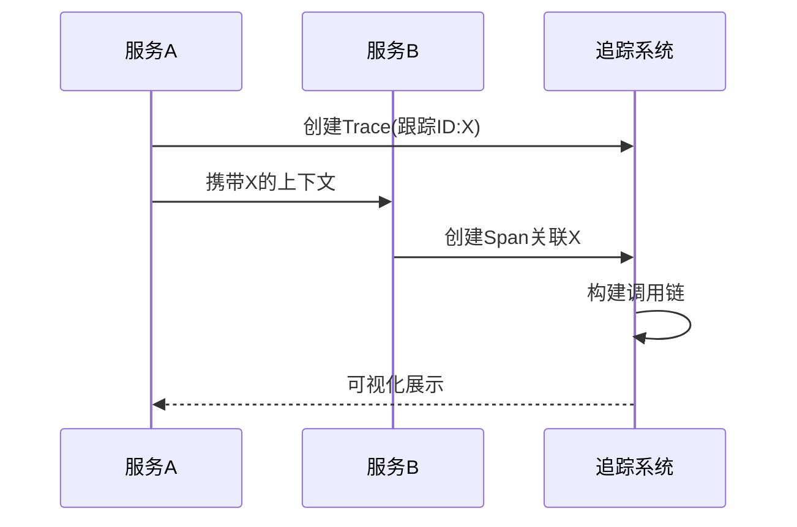
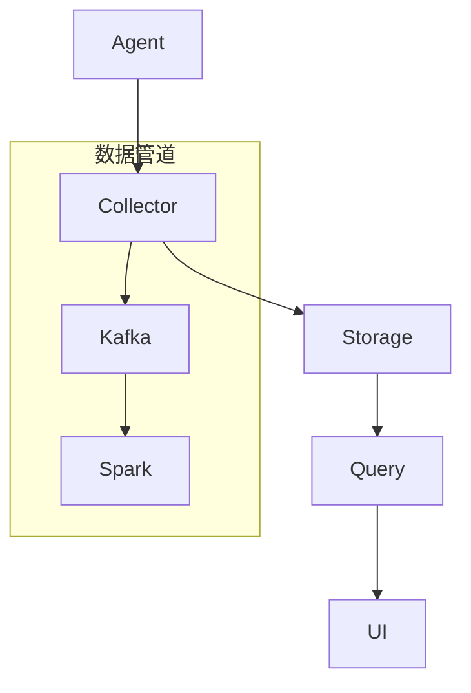

```markdown:c:\project\kphub/docs/distributed-tracing.md
---
title: Jaeger/Zipkin分布式追踪
icon: practice
order: 7
---

# Jaeger/Zipkin分布式追踪

分布式追踪是微服务架构中排查问题的关键工具，本文将深入解析追踪系统的工作原理、部署方案和最佳实践。通过20+核心配置示例和10+生产环境调优技巧，帮助读者构建企业级追踪体系。

## 1. 追踪系统基础

### 1.1 追踪核心概念

````mermaid
graph TD
    A[Trace] --> B[Span]
    B --> C[Operation]
    B --> D[Tag]
    B --> E[Log]
    B --> F[Reference]
    
    F --> F1[ChildOf]
    F --> F2[FollowsFrom]
    
    style A stroke:#f66,stroke-width:2px
    style B stroke:#690,stroke-width:2px
````

#### 1.1.1 数据模型解析
```protobuf
// OpenTelemetry原型定义
message Span {
    bytes trace_id = 1;
    bytes span_id = 2;
    string name = 3;
    uint64 start_time = 4;
    uint64 end_time = 5;
    repeated Attribute attributes = 6;
    repeated Event events = 7;
}
```

### 1.2 追踪工作原理



## 2. Jaeger架构解析

### 2.1 组件拓扑



### 2.2 生产部署方案

#### 2.2.1 Kubernetes部署
```yaml:c:\project\config\jaeger-all-in-one.yaml
apiVersion: jaegertracing.io/v1
kind: Jaeger
metadata:
  name: prod-jaeger
spec:
  strategy: production
  storage:
    type: elasticsearch
    options:
      es:
        server-urls: http://es-cluster:9200
        index-prefix: jaeger
  ingress:
    enabled: false
  agent:
    strategy: DaemonSet
```

## 3. Zipkin架构解析

### 3.1 组件对比

| 组件       | Jaeger等效       | 功能差异                |
|------------|------------------|-----------------------|
| Collector  | Collector        | 支持更多存储后端        |
| Query      | Query Service    | 原生支持Prometheus      |
| UI         | Jaeger UI        | 依赖关系可视化较弱      |

### 3.2 高可用部署
```docker
# Zipkin集群部署示例
services:
  zipkin:
    image: openzipkin/zipkin
    environment:
      - STORAGE_TYPE=elasticsearch
      - ES_HOSTS=es-node1:9200,es-node2:9200
    ports:
      - "9411:9411"
  
  kafka:
    image: confluentinc/cp-kafka
    ports:
      - "9092:9092"
```

## 4. 代码集成实战

### 4.1 Spring Boot集成
```java:c:\project\src\main\java\com\example\OrderController.java
@RestController
public class OrderController {
    private final Tracer tracer;
    
    @Autowired
    public OrderController(Tracer tracer) {
        this.tracer = tracer;
    }
    
    @PostMapping("/order")
    public ResponseEntity createOrder(@RequestBody Order order) {
        Span span = tracer.spanBuilder("createOrder")
            .setAttribute("user.id", order.getUserId())
            .startSpan();
            
        try (Scope scope = span.makeCurrent()) {
            // 业务逻辑
            span.addEvent("库存校验通过");
            return ResponseEntity.ok().build();
        } catch (Exception e) {
            span.recordException(e);
            throw e;
        } finally {
            span.end();
        }
    }
}
```

### 4.2 Gin框架集成
```go:c:\project\src\pkg\api\payment.go
func MakePayment(c *gin.Context) {
    tracer := otel.Tracer("payment-service")
    ctx, span := tracer.Start(c.Request.Context(), "process-payment")
    defer span.End()
    
    // 注入追踪上下文
    carrier := propagation.HeaderCarrier(c.Request.Header)
    propagator := otel.GetTextMapPropagator()
    propagator.Inject(ctx, carrier)
    
    // 调用下游服务
    resp, err := httpClient.Post(/*...*/)
    if err != nil {
        span.RecordError(err)
    }
    
    span.SetAttributes(
        attribute.Int("http.status", resp.StatusCode),
    )
}
```

## 5. 生产调优指南

### 5.1 存储优化
```bash
# Elasticsearch索引模板配置
PUT _template/jaeger
{
  "index_patterns": ["jaeger-*"],
  "settings": {
    "number_of_shards": 3,
    "number_of_replicas": 1,
    "refresh_interval": "30s"
  }
}
```

### 5.2 采样策略
```yaml:c:\project\config\sampling-config.yaml
sampling:
  strategies:
    - type: probabilistic
      param: 0.1
    - type: rate-limiting
      param: 100
  default_strategy:
    type: probabilistic
    param: 0.5
```

## 6. 故障诊断案例

### 6.1 订单超时分析


**根因定位**：
1. 支付服务P99延迟突增
2. 追踪显示风控服务响应变慢
3. 数据库慢查询日志验证
4. 最终定位缺失复合索引

### 6.2 跨服务追踪丢失
```bash
# 追踪上下文传播验证
curl -H "traceparent: 00-0af7651916cd43dd8448eb211c80319c-b7ad6b7169203331-01" http://service/api
```

## 7. 高级功能实现

### 7.1 自定义追踪分析
```python:c:\project\src\analytics\trace_processor.py
def analyze_trace(trace):
    critical_path = []
    current_span = find_longest_span(trace)
    
    while current_span:
        critical_path.append(current_span)
        current_span = get_parent_span(trace, current_span)
    
    visualize_path(critical_path)

def find_longest_span(trace):
    return max(trace.spans, key=lambda s: s.duration)
```

### 7.2 安全审计追踪
```sql
-- 追踪记录查询示例
SELECT * FROM jaeger_index
WHERE operationName = 'UserLogin'
AND tags['http.status_code'] = '500'
AND duration > 3000000
```

通过本文的系统化讲解，读者可以掌握从追踪原理到生产实践的完整知识链。建议结合具体业务场景选择合适的采样策略和存储方案，持续优化追踪系统的性能和可用性。
```