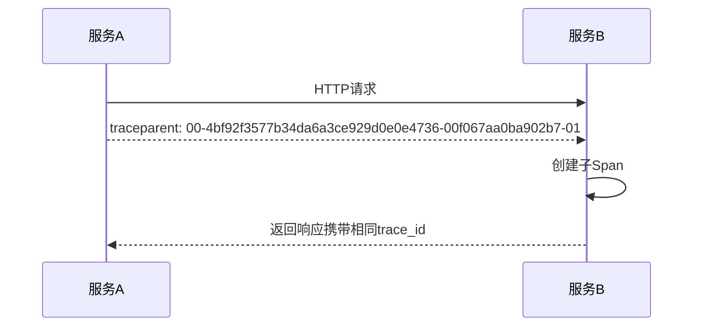
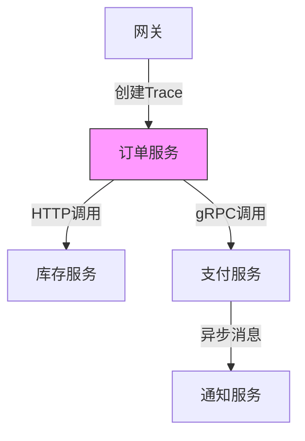
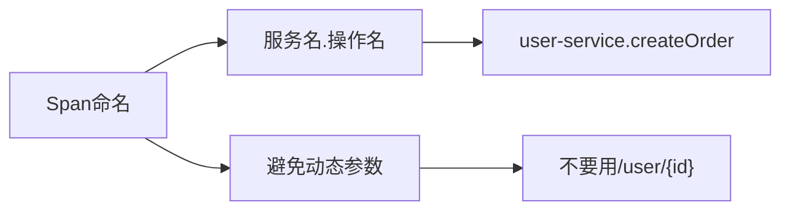

```markdown:c:\project\kphub/docs/opentelemetry-implementation.md
---
title: OpenTelemetry标准实施
icon: practice
order: 8
---

# OpenTelemetry标准实施

OpenTelemetry是可观测性领域的开放标准，本文将从架构原理到生产实践，深入解析标准化可观测性体系的构建。涵盖15+核心组件配置、20+代码示例和5种典型场景解决方案。

## 1. 架构解析

### 1.1 核心组件

````mermaid
graph TD
    A[Instrumentation] --> B[API]
    B --> C[SDK]
    C --> D[Exporter]
    D --> E[Backend]
    
    subgraph 语言支持
    A --> A1[自动埋点]
    A --> A2[手动埋点]
    end
    
    subgraph 数据处理
    C --> C1[采样]
    C --> C2[过滤]
    C --> C3[聚合]
    end
````

### 1.2 数据模型

```protobuf
// 跟踪数据原型
message Span {
    bytes trace_id = 1;
    bytes span_id = 2;
    string name = 3;
    uint64 start_time = 4;
    uint64 end_time = 5;
    repeated Attribute attributes = 6;
    repeated Link links = 7;
}

// 指标数据原型
message Metric {
    string name = 1;
    DataPoint data_point = 2;
}
```

## 2. 数据采集配置

### 2.1 基础配置

#### 2.1.1 Java Agent配置
```bash
java -javaagent:opentelemetry-javaagent.jar \
     -Dotel.service.name=order-service \
     -Dotel.traces.exporter=jaeger \
     -Dotel.metrics.exporter=prometheus \
     -jar app.jar
```

#### 2.1.2 Go SDK初始化
```go
import (
    "go.opentelemetry.io/otel"
    sdktrace "go.opentelemetry.io/otel/sdk/trace"
)

func initTracer() {
    exporter, _ := jaeger.New(jaeger.WithCollectorEndpoint())
    tp := sdktrace.NewTracerProvider(
        sdktrace.WithSampler(sdktrace.AlwaysSample()),
        sdktrace.WithBatcher(exporter),
    )
    otel.SetTracerProvider(tp)
}
```

## 3. 上下文传播

### 3.1 W3C TraceContext


### 3.2 跨进程传播
```python
# HTTP传播示例
from opentelemetry.propagate import inject, extract

# 发送请求
headers = {}
inject(headers)
requests.get(url, headers=headers)

# 接收请求
context = extract(request.headers)
tracer.start_span("process", context=context)
```

## 4. 导出器配置

### 4.1 多后端支持
```yaml:c:\project\config\otel-collector.yaml
receivers:
  otlp:
    protocols:
      grpc:
        endpoint: 0.0.0.0:4317

exporters:
  jaeger:
    endpoint: jaeger:14250
    tls:
      insecure: true
  prometheus:
    endpoint: 0.0.0.0:8889
  logging:
    logLevel: debug

service:
  pipelines:
    traces:
      receivers: [otlp]
      exporters: [jaeger, logging]
    metrics:
      receivers: [otlp]
      exporters: [prometheus]
```

## 5. 自动埋点实践

### 5.1 常见框架支持

| 框架         | 埋点方式       | 采集数据                |
|--------------|----------------|-------------------------|
| Spring Boot  | Java Agent     | HTTP请求、JDBC、Redis   |
| Gin          | Go SDK         | HTTP路由、DB查询        |
| Express      | Node.js SDK    | 中间件跟踪、DB调用       |
| Django       | Python SDK     | 视图函数、模板渲染       |

### 5.2 手动埋点示例
```java
Span span = tracer.spanBuilder("calculateTax")
               .setAttribute("user.id", userId)
               .startSpan();
try (Scope scope = span.makeCurrent()) {
    // 业务逻辑
    span.addEvent("开始税率计算");
    TaxResult result = taxService.calculate(request);
    span.setStatus(StatusCode.OK);
} catch (Exception e) {
    span.setStatus(StatusCode.ERROR);
    span.recordException(e);
} finally {
    span.end();
}
```

## 6. 分布式追踪实战

### 6.1 订单处理追踪


### 6.2 追踪数据分析
```sql
-- 查询慢事务
SELECT trace_id, AVG(duration) 
FROM traces 
WHERE service_name='payment-service'
  AND duration > 1000
GROUP BY trace_id
ORDER BY AVG(duration) DESC
LIMIT 10
```

## 7. 服务监控集成

### 7.1 指标采集
```yaml
metrics:
  processors:
    batch:
      timeout: 60s
  exporters:
    prometheus:
      endpoint: "0.0.0.0:9090"
  readers:
    periodic:
      interval: 15s
```

### 7.2 监控仪表盘
```json
{
  "title": "服务健康度",
  "panels": [
    {
      "type": "graph",
      "title": "请求速率",
      "targets": [{
        "expr": "rate(http_requests_total[5m])",
        "legendFormat": "{{service}}"
      }]
    },
    {
      "type": "singlestat",
      "title": "错误率",
      "targets": [{
        "expr": "sum(rate(http_requests_total{status_code=~'5..'}[5m])) / sum(rate(http_requests_total[5m]))"
      }]
    }
  ]
}
```

## 8. 高级功能实现

### 8.1 Baggage传递
```go
// 设置业务属性
ctx = baggage.SetBaggage(ctx, "user.id", "12345")

// 获取属性
bag := baggage.FromContext(ctx)
member := bag.Member("user.id")
fmt.Println(member.Value)
```

### 8.2 日志关联
```python
# 日志中注入Trace ID
logger.info("订单创建成功", 
    extra={
        "trace_id": span.get_span_context().trace_id,
        "span_id": span.get_span_context().span_id
    })
```

## 9. 性能优化

### 9.1 采样策略对比

| 策略类型       | 优点                  | 缺点                  |
|----------------|-----------------------|-----------------------|
| 头部采样       | 保持完整调用链        | 可能丢失关键数据      |
| 尾部采样       | 节省存储成本          | 实现复杂度高          |
| 概率采样       | 简单高效              | 无法保证数据完整性    |
| 速率限制采样   | 控制数据量稳定        | 需要动态调整参数      |

### 9.2 资源调优
```bash
# Java Agent内存设置
export JAVA_OPTS="-Xms2g -Xmx2g -XX:+UseG1GC"

# Go SDK批处理配置
export OTEL_BSP_MAX_EXPORT_BATCH_SIZE=512
export OTEL_BSP_SCHEDULE_DELAY=5000
```

## 10. 最佳实践

### 10.1 命名规范


### 10.2 错误处理
```typescript
try {
    // 业务逻辑
    span.setStatus({ code: StatusCode.OK });
} catch (error) {
    span.setStatus({ code: StatusCode.ERROR });
    span.recordException(error);
    throw error;
} finally {
    span.end();
}
```

通过本文的系统化讲解，读者可以掌握OpenTelemetry标准从理论到实践的完整知识体系。建议按照"规范定义→数据采集→系统集成→监控分析"的路径推进实施，逐步构建统一的可观测性平台。