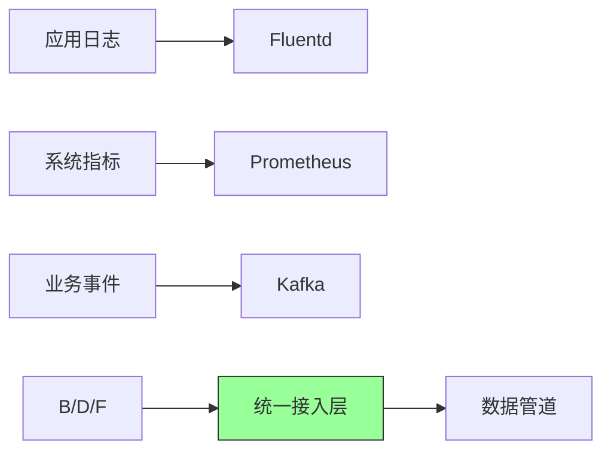
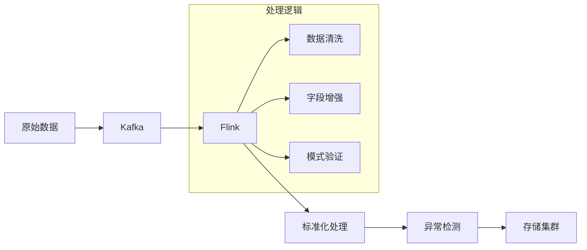
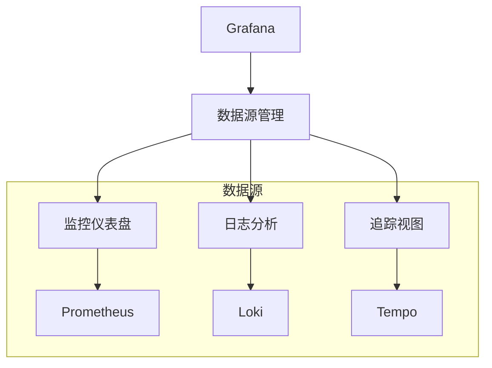
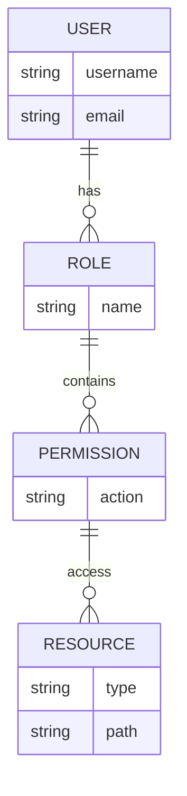
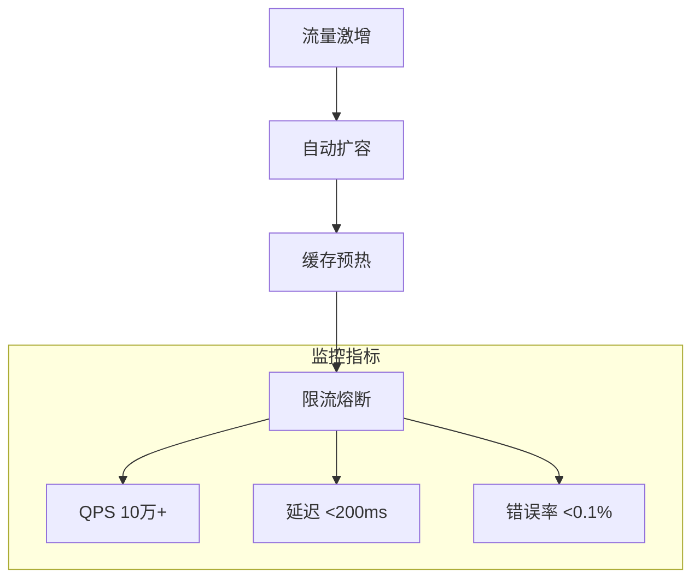
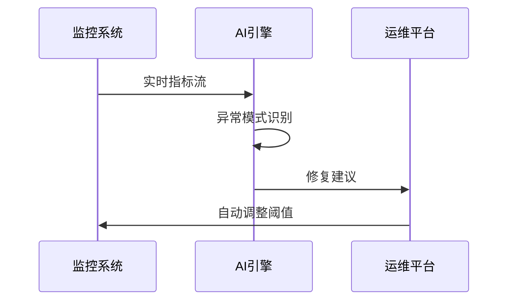

```markdown:c:\project\kphub/docs/observability-platform-integration.md
---
title: 可观测性平台集成方案
icon: practice
order: 9
---

# 可观测性平台集成方案

构建统一的可观测性平台需要整合多种工具和技术，本文将从架构设计到生产落地，详细解析企业级可观测性平台的实施路径。涵盖数据采集、存储、分析、可视化全流程，提供15+核心组件配置和10+实战场景解决方案。

## 1. 架构设计

### 1.1 分层架构模型

````mermaid
graph TD
    A[数据源] --> B[采集层]
    B --> C[处理层]
    C --> D[存储层]
    D --> E[分析层]
    E --> F[展示层]
    
    subgraph 功能分解
    B --> B1[Agent管理]
    C --> C1[流处理]
    D --> D1[冷热分离]
    E --> E1[机器学习]
    end
````

#### 1.1.1 数据流设计
```python
# 数据流容量计算示例
def calculate_throughput(events_per_sec, event_size):
    """
    events_per_sec: 每秒事件数
    event_size: 单事件大小(KB)
    return: 带宽需求(MB/s)
    """
    return (events_per_sec * event_size) / 1024

print(f"日处理量: {calculate_throughput(100000, 2)*86400/1024:.2f}TB")
```

### 1.2 技术选型矩阵

| 组件类型     | 开源方案               | 商业方案           | 混合方案             |
|--------------|------------------------|--------------------|----------------------|
| 数据采集     | Fluentd/OpenTelemetry | Splunk UF          | Datadog Agent        |
| 存储引擎     | Elasticsearch          | Splunk ITSI        | AWS OpenSearch       |
| 流处理       | Kafka Streams          | Apache Pulsar      | Confluent Platform   |
| 可视化       | Grafana                | Tableau            | New Relic Dashboards |

## 2. 数据采集集成

### 2.1 统一采集架构



### 2.2 多源采集配置

#### 2.2.1 Fluentd日志采集
```xml:c:\project\config\td-agent.conf
<source>
  @type tail
  path /var/log/app/*.log
  pos_file /var/log/td-agent/app.log.pos
  tag app
  <parse>
    @type json
    time_key timestamp
    time_type string
    time_format %Y-%m-%dT%H:%M:%S.%NZ
  </parse>
</source>

<match app>
  @type kafka2
  brokers kafka1:9092,kafka2:9092
  topic app_logs
  <format>
    @type json
  </format>
</match>
```

#### 2.2.2 Prometheus指标采集
```yaml:c:\project\config/prometheus.yml
scrape_configs:
  - job_name: 'node'
    static_configs:
      - targets: ['node1:9100', 'node2:9100']
        
  - job_name: 'kafka'
    metrics_path: '/metrics'
    static_configs:
      - targets: ['kafka1:7071']
    relabel_configs:
      - source_labels: [__address__]
        regex: (.*):\d+
        target_label: instance
```

## 3. 数据处理管道

### 3.1 流式处理架构



### 3.2 数据处理示例

```java:c:\project\src\main\java\com\example\LogProcessor.java
public class LogEnrichment {
    public static void main(String[] args) {
        StreamExecutionEnvironment env = StreamExecutionEnvironment.getExecutionEnvironment();
        
        DataStream<LogEvent> stream = env
            .addSource(new FlinkKafkaConsumer<>("raw-logs", new LogDeserializer(), properties))
            .map(log -> {
                // 字段增强
                log.setGeoInfo(IPUtils.getGeo(log.getIp()));
                log.setUserTag(UserService.getTags(log.getUserId()));
                return log;
            })
            .filter(log -> !log.getLevel().equals("DEBUG"))  // 过滤调试日志
            .keyBy(LogEvent::getServiceName)
            .process(new AnomalyDetector());
        
        stream.addSink(new ElasticsearchSink<>());
    }
}
```

## 4. 存储优化策略

### 4.1 分层存储设计

```mermaid
gantt
    title 数据生命周期管理
    dateFormat  X
    axisFormat %s
    section 热数据
    实时查询 : 0, 2d
    section 温数据
    日常分析 : 2d, 7d
    section 冷数据
    归档存储 : 7d, 30d
```

### 4.2 Elasticsearch优化

#### 4.2.1 索引模板
```json
PUT _template/logs-template
{
  "index_patterns": ["logs-*"],
  "settings": {
    "number_of_shards": 5,
    "number_of_replicas": 1,
    "refresh_interval": "30s",
    "codec": "best_compression"
  },
  "mappings": {
    "dynamic_templates": [
      {
        "strings_as_keyword": {
          "match_mapping_type": "string",
          "mapping": {
            "type": "keyword"
          }
        }
      }
    ]
  }
}
```

## 5. 可视化集成

### 5.1 统一门户架构



### 5.2 告警规则示例
```yaml:c:\project\config\alert-rules.yml
groups:
- name: service-alerts
  rules:
  - alert: HighErrorRate
    expr: |
      sum(rate(log_entries{level="ERROR"}[5m])) by (service)
      /
      sum(rate(log_entries[5m])) by (service) > 0.05
    for: 10m
    labels:
      severity: critical
    annotations:
      summary: "服务 {{ $labels.service }} 错误率过高"
```

## 6. 安全与权限

### 6.1 RBAC模型设计


### 6.2 审计日志配置
```bash
# 审计日志采集规则
<source>
  @type tail
  path /var/log/audit/*.log
  tag audit
  <parse>
    @type csv
    keys time,user,action,resource
  </parse>
</source>
```

## 7. 实战案例

### 7.1 电商大促监控



#### 7.1.1 动态扩容配置
```yaml
apiVersion: keda.sh/v1alpha1
kind: ScaledObject
metadata:
  name: order-service-scaler
spec:
  scaleTargetRef:
    name: order-service
  triggers:
  - type: prometheus
    metadata:
      serverAddress: http://prometheus:9090
      metricName: http_requests_per_second
      query: sum(rate(http_requests_total{service="order"}[2m]))
      threshold: '1000'
```

## 8. 性能调优

### 8.1 存储优化对比

| 优化手段         | 效果提升          | 实施复杂度 |
|------------------|-------------------|------------|
| 分片策略优化     | 查询速度↑35%     | 中         |
| 冷热数据分离     | 存储成本↓40%     | 高         |
| 压缩算法优化     | 磁盘占用↓50%     | 低         |
| 索引模式调整     | 写入速度↑25%     | 中         |

### 8.2 资源管理策略
```bash
# 容器资源限制示例
resources:
  limits:
    cpu: "2"
    memory: 4Gi
  requests:
    cpu: "1"
    memory: 2Gi
```

## 9. 前沿技术演进

### 9.1 eBPF技术应用
```c
// 系统调用追踪示例
SEC("tracepoint/syscalls/sys_enter_open")
int tracepoint__syscalls__sys_enter_open(struct trace_event_raw_sys_enter* ctx) {
    char filename[256];
    bpf_probe_read_user_str(filename, sizeof(filename), (char *)ctx->args[0]);
    bpf_printk("File opened: %s", filename);
    return 0;
}
```

### 9.2 AIOps集成


通过本文的系统化讲解，读者可以掌握从平台设计到生产落地的全流程实践。建议采用渐进式实施策略，优先构建核心监控能力，逐步扩展为全栈可观测平台。