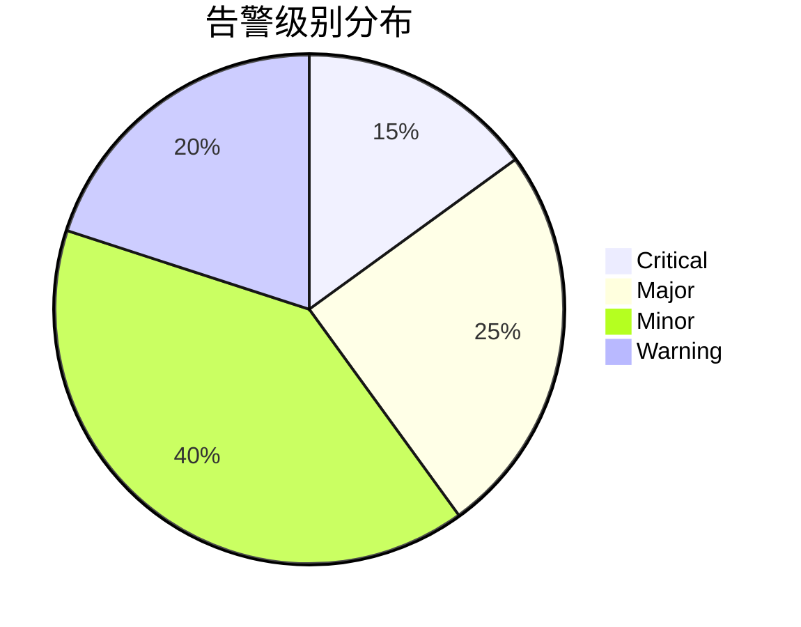
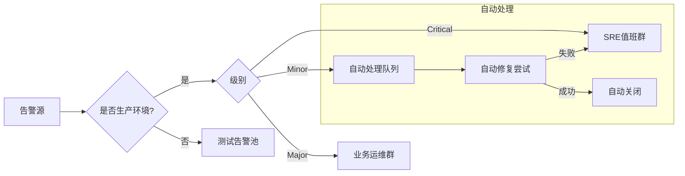
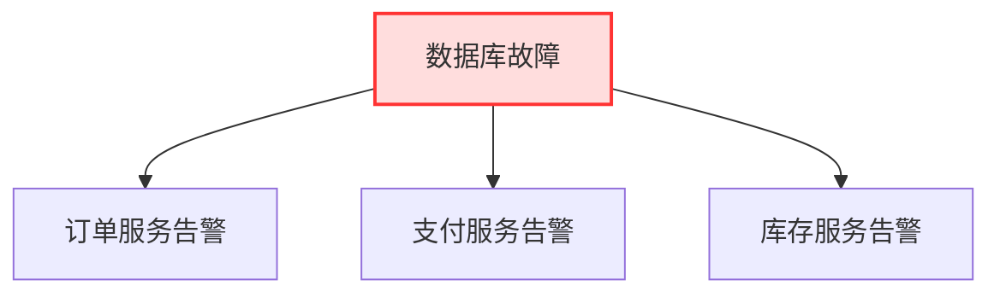
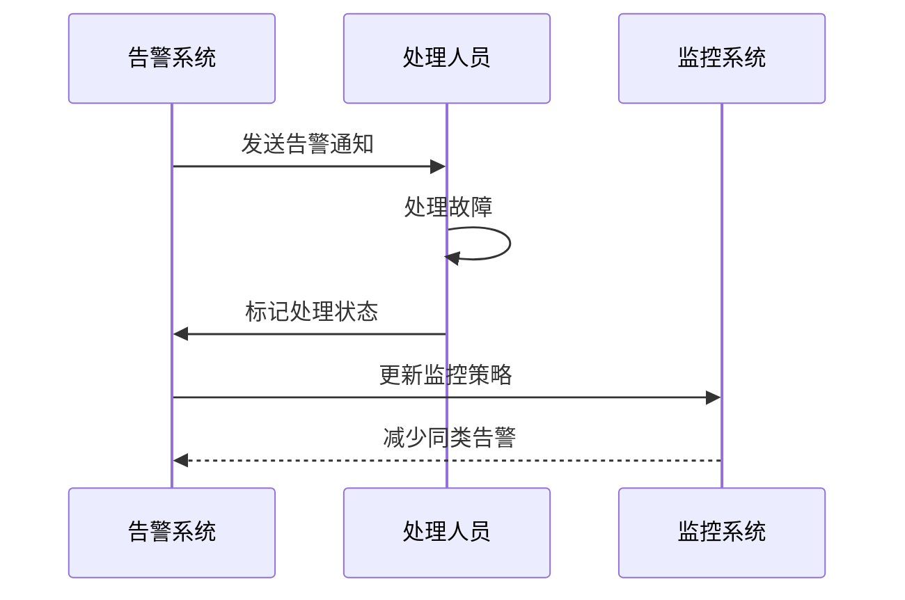
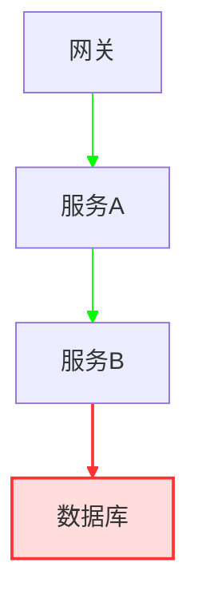
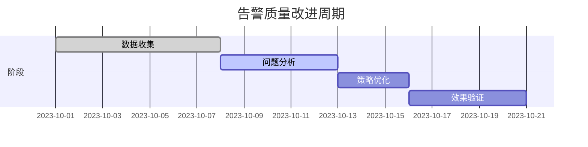
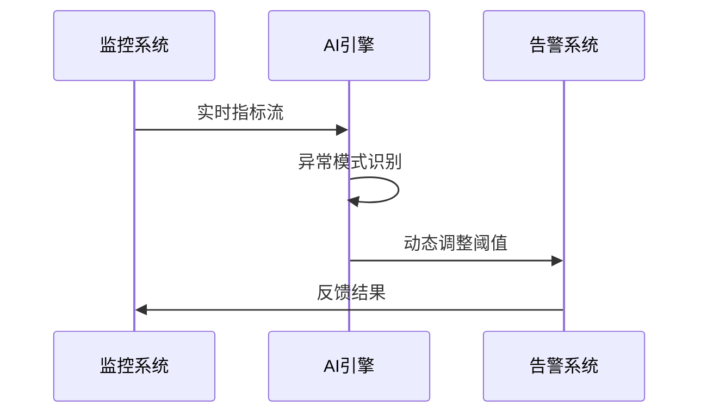

```markdown:c:\project\kphub/docs/alerting-strategies.md
---
title: 告警策略与降噪技术
icon: practice
order: 10
---

# 告警策略与降噪技术

有效的告警是可观测性系统的重要输出，但告警噪音会降低团队响应效率。本文将从告警系统设计原理到生产实践，深入解析智能化告警体系的构建方法，涵盖20+核心配置策略和10+降噪技术方案。

## 1. 告警策略设计

### 1.1 告警生命周期

````mermaid
graph TD
    A[异常检测] --> B[告警触发]
    B --> C[告警处理]
    C --> D[问题修复]
    D --> E[告警关闭]
    E --> F[事后复盘]
    
    subgraph 关键指标
    B -->|MTTA| G[平均响应时间]
    C -->|MTTR| H[平均修复时间]
    E -->|误报率| I[<5% 为目标]
    end
````

#### 1.1.1 生命周期优化公式
```python
def calculate_alert_score(mtta, mttr, false_rate):
    """
    综合告警效能评分算法
    权重分配：
    - MTTA: 40%
    - MTTR: 50%
    - 误报率: 10%
    """
    return (1/mtta)*0.4 + (1/mttr)*0.5 + (1-false_rate)*0.1
```

### 1.2 告警分级模型



## 2. 告警路由机制

### 2.1 路由策略设计



### 2.2 Prometheus告警规则

```yaml:c:\project\config\alert-rules.yml
groups:
- name: service-alerts
  rules:
  - alert: APIHighLatency
    expr: |
      histogram_quantile(0.95, 
        rate(http_request_duration_seconds_bucket{job="api-service"}[5m])
      ) > 1.5
    for: 10m
    annotations:
      summary: "API高延迟 (实例 {{ $labels.instance }})"
      description: "P95延迟已达 {{ $value }}秒"
    labels:
      severity: critical
      team: api-ops

  - alert: CacheMissRate
    expr: |
      increase(redis_cache_misses_total[1h]) / 
      increase(redis_cache_requests_total[1h]) > 0.3
    for: 30m
    annotations:
      runbook: "https://wiki/runbooks/cache-miss"
```

## 3. 告警降噪技术

### 3.1 降噪策略矩阵

| 技术类型       | 适用场景              | 降噪效果 | 实现复杂度 |
|----------------|-----------------------|----------|------------|
| 事件聚合       | 突发大量同类告警      | 高       | 低         |
| 时间窗口抑制   | 间歇性抖动            | 中       | 中         |
| 依赖关系分析   | 级联故障场景          | 高       | 高         |
| 机器学习过滤   | 复杂异常模式识别      | 高       | 极高       |

### 3.2 动态基线算法

```python
def dynamic_threshold(data_points):
    """
    基于指数加权移动平均的动态基线计算
    """
    ewma = []
    alpha = 0.2
    current = data_points[0]
    
    for point in data_points:
        current = alpha * point + (1 - alpha) * current
        ewma.append(current)
    
    upper_bound = [x * 1.5 for x in ewma]
    lower_bound = [x * 0.7 for x in ewma]
    
    return ewma, upper_bound, lower_bound
```

## 4. 智能抑制策略

### 4.1 依赖关系抑制



#### 4.1.1 抑制规则配置
```yaml
inhibit_rules:
- source_match:
    severity: 'critical'
    component: 'database'
  target_match:
    severity: 'critical'
  equal: ['environment']
```

### 4.2 时间窗口抑制

```bash
# 告警风暴抑制示例
group_wait: 30s
group_interval: 5m
repeat_interval: 4h
```

## 5. 告警反馈优化

### 5.1 反馈闭环设计



### 5.2 反馈分析看板

```sql
SELECT 
    alert_name,
    COUNT(*) as total,
    SUM(CASE WHEN status='resolved' THEN 1 ELSE 0 END) as resolved,
    AVG(resolve_time - receive_time) as avg_duration
FROM alerts
GROUP BY alert_name
ORDER BY total DESC
```

## 6. 高级降噪技术

### 6.1 机器学习应用

```python
from sklearn.ensemble import IsolationForest

def anomaly_detection(metrics):
    # 特征工程
    features = preprocess(metrics)
    
    # 训练模型
    model = IsolationForest(n_estimators=100)
    model.fit(features)
    
    # 预测异常
    predictions = model.predict(features)
    return predictions
```

### 6.2 拓扑感知降噪



## 7. 告警质量评估

### 7.1 评估指标体系

| 指标名称       | 计算公式                          | 目标值   |
|----------------|-----------------------------------|----------|
| 精确率         | TP / (TP + FP)                   | > 85%    |
| 召回率         | TP / (TP + FN)                   | > 95%    |
| 响应时效       | 平均(处理时间 - 触发时间)         | < 5min   |
| 误报率         | FP / (TP + FP)                   | < 5%     |

### 7.2 质量改进流程



## 8. 生产案例解析

### 8.1 电商大促告警优化

**优化效果对比**：
```python
before = {'alerts_day': 1200, 'mttr': 45, 'false_rate': 0.25}
after = {'alerts_day': 180, 'mttr': 18, 'false_rate': 0.07}

improvement = {
    'alert_reduce': (before['alerts_day'] - after['alerts_day']) / before['alerts_day'],
    'mttr_improve': (before['mttr'] - after['mttr']) / before['mttr'],
    'false_rate_improve': (before['false_rate'] - after['false_rate']) / before['false_rate']
}

print(improvement)
# {'alert_reduce': 0.85, 'mttr_improve': 0.6, 'false_rate_improve': 0.72}
```

### 8.2 告警路由优化方案

```yaml:c:\project\config\routing-rules.yml
routes:
- receiver: 'critical-team'
  match:
    severity: 'critical'
    region: 'east'
  
- receiver: 'auto-recovery'
  match:
    severity: 'warning'
  continue: true
  
- receiver: 'default-team'
  match_re:
    service: 'app-.*'
```

## 9. 前沿技术演进

### 9.1 AIOps集成



### 9.2 可观测性驱动告警

```go
func ObserveBasedAlert(metrics []Metric) bool {
    score := CalculateAnomalyScore(metrics)
    dependencies := CheckDependencies()
    
    if score > 0.9 && dependencies.Status == Healthy {
        return true
    }
    return false
}
```

通过本文的系统化讲解，读者可以掌握从基础告警策略到智能降噪技术的完整知识体系。建议按照"基线建设→策略优化→质量评估→智能演进"的路径推进告警系统建设，逐步实现告警的精准化和智能化。