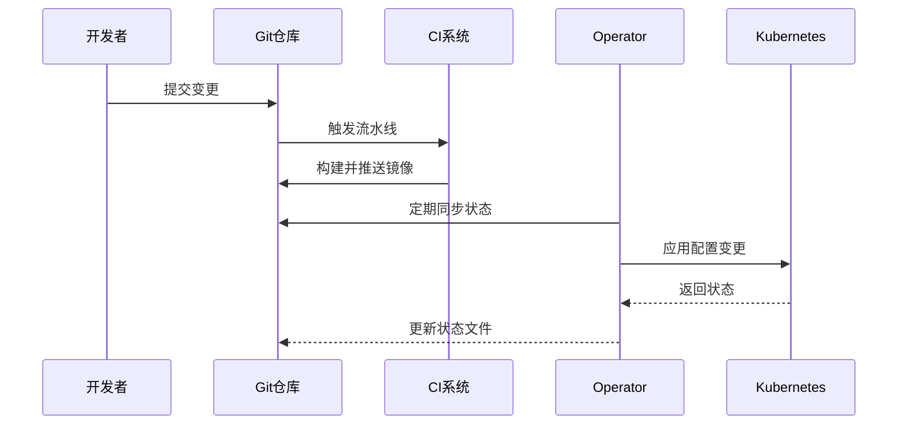
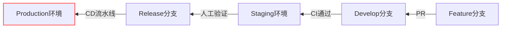
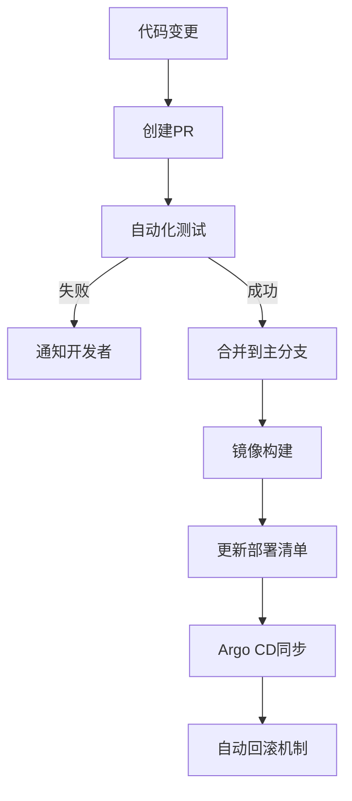
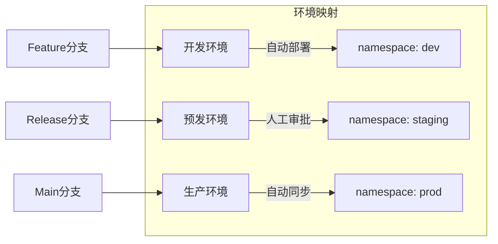
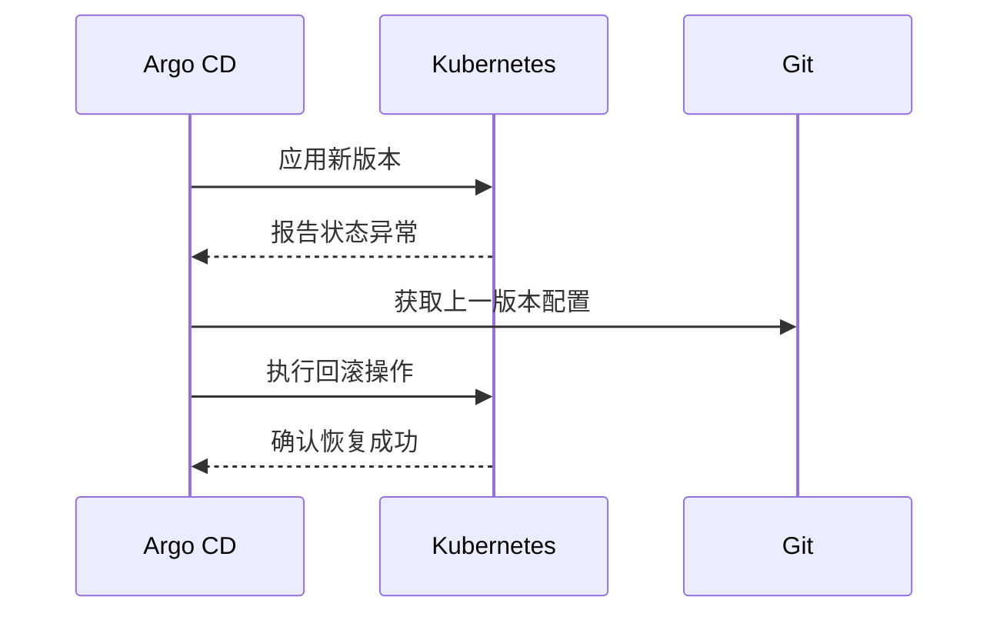
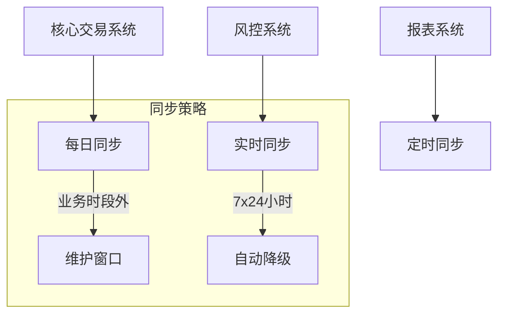
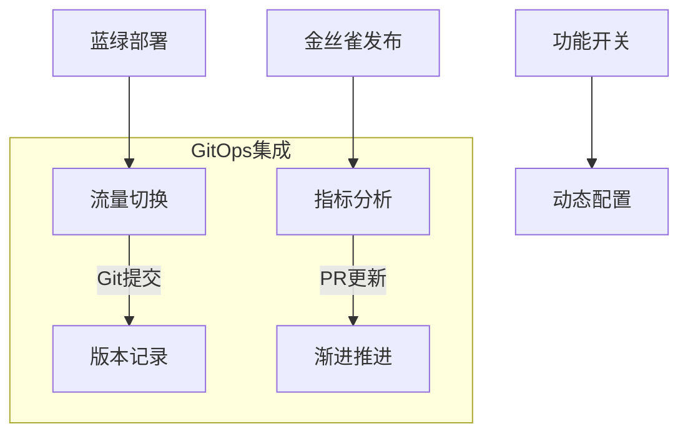

```markdown:c:\project\kphub/docs/gitops-workflow.md
---
title: GitOps工作流与原则
icon: theory
order: 1
---

# GitOps工作流与原则

GitOps是一种操作模型，它以Git作为声明式基础设施和应用程序的单一事实来源。本文将从基础原理到企业级实践，深入解析GitOps的完整知识体系，涵盖15+核心配置示例和10+生产环境最佳实践。

## 1. 核心原则解析

### 1.1 四大基本原则

````mermaid
graph TD
    A[GitOps原则] --> B[声明式配置]
    A --> C[版本控制]
    A --> D[自动同步]
    A --> E[闭环验证]
    
    B --> B1[Kubernetes YAML]
    B --> B2[Terraform HCL]
    C --> C1[Git历史追溯]
    C --> C2[分支策略]
    D --> D1[CI/CD流水线]
    D --> D2[Operator模式]
    E --> E1[健康检查]
    E --> E2[策略即代码]
````

### 1.2 传统Ops vs GitOps

```python
# 部署流程对比模拟
def traditional_deploy():
    ssh_to_prod()
    run("kubectl apply -f latest/")
    check_status()
    
def gitops_deploy():
    git_push("main")
    wait_ci()
    auto_sync()
    verify_status()
    
print("传统部署风险:", traditional_deploy.risks)
print("GitOps优势:", gitops_deploy.benefits)
```

## 2. 工作流设计

### 2.1 核心工作流



### 2.2 分支策略模型



## 3. 工具链集成

### 3.1 主流工具对比

| 工具         | 同步方式      | 多集群支持 | 审计能力 | 学习曲线 |
|--------------|-------------|------------|----------|----------|
| Argo CD      | Pull-based  | ✔️         | ✔️       | 中等     |
| Flux         | Push-based  | ✔️         | ✔️       | 高       |
| Jenkins X    | Hybrid      | ❌         | 部分     | 高       |
| Tekton       | Pipeline    | ✔️         | ❌       | 极高     |

### 3.2 Argo CD配置示例

```yaml:c:\project\config\argo-app.yaml
apiVersion: argoproj.io/v1alpha1
kind: Application
metadata:
  name: production-app
spec:
  project: default
  source:
    repoURL: https://github.com/company/gitops-repo
    targetRevision: HEAD
    path: kubernetes/production
  destination:
    server: https://kubernetes.default.svc
    namespace: production
  syncPolicy:
    automated:
      selfHeal: true
      prune: true
    syncOptions:
    - CreateNamespace=true
```

## 4. 实施步骤详解

### 4.1 基础架构即代码

#### 4.1.1 Terraform模块
```hcl:c:\project\infra\main.tf
module "eks_cluster" {
  source = "terraform-aws-modules/eks/aws"
  
  cluster_name = "gitops-prod"
  vpc_id       = module.vpc.vpc_id
  subnet_ids   = module.vpc.private_subnets

  node_groups = {
    main = {
      desired_capacity = 3
      max_capacity     = 5
      min_capacity     = 1
    }
  }
}
```

### 4.2 应用部署流程



## 5. 安全与合规

### 5.1 RBAC策略配置

```yaml:c:\project\config\rbac.yaml
apiVersion: rbac.authorization.k8s.io/v1
kind: Role
metadata:
  name: gitops-deployer
rules:
- apiGroups: ["apps"]
  resources: ["deployments"]
  verbs: ["get", "list", "watch", "update"]
---
apiVersion: argoproj.io/v1alpha1
kind: AppProject
metadata:
  name: production
spec:
  destinations:
  - namespace: production
    server: "https://kubernetes.default.svc"
  sourceRepos:
  - "https://github.com/company/gitops-repo"
```

### 5.2 审计日志集成

```bash
# 查看部署历史
argocd app history production-app

# 审计日志查询
kubectl logs -n argocd deploy/argocd-repo-server | grep AUDIT
```

## 6. 多环境策略

### 6.1 环境隔离模型



### 6.2 金丝雀发布配置

```yaml:c:\project\config\canary.yaml
apiVersion: flagger.app/v1beta1
kind: Canary
metadata:
  name: app-canary
spec:
  targetRef:
    apiVersion: apps/v1
    kind: Deployment
    name: app
  service:
    port: 9898
  analysis:
    interval: 1m
    threshold: 5
    metrics:
    - name: request-success-rate
      threshold: 99
    - name: request-duration
      threshold: 500
      interval: 30s
```

## 7. 故障恢复策略

### 7.1 自动回滚机制



### 7.2 回滚操作示例

```bash
# 手动回滚到指定版本
argocd app sync production-app --revision 4a3b2c1

# 查看回滚历史
argocd app history production-app --kind Deployment
```

## 8. 最佳实践案例

### 8.1 金融行业实施



### 8.2 合规性配置

```yaml:c:\project\config\policy.yaml
apiVersion: policy.open-cluster-management.io/v1
kind: Policy
metadata:
  name: gitops-policy
spec:
  remediationAction: enforce
  disabled: false
  policy-templates:
    - objectDefinition:
        apiVersion: policy.open-cluster-management.io/v1
        kind: ConfigurationPolicy
        metadata:
          name: gitops-rules
        spec:
          severity: high
          namespaceSelector:
            exclude: ["kube-*"]
          object-templates:
          - complianceType: musthave
            objectDefinition:
              kind: NetworkPolicy
              apiVersion: networking.k8s.io/v1
```

## 9. 效能提升技巧

### 9.1 缓存优化策略

```yaml:c:\project\config\flux-optimize.yaml
apiVersion: source.toolkit.fluxcd.io/v1beta2
kind: GitRepository
metadata:
  name: web-app
spec:
  interval: 1m0s
  url: https://github.com/company/web-app
  ref:
    branch: main
  timeout: 20s
  ignore: |
    /*.md
    /docs/
```

### 9.2 资源自动缩放

```yaml:c:\project\config\autoscale.yaml
apiVersion: keda.sh/v1alpha1
kind: ScaledObject
metadata:
  name: app-scaler
spec:
  scaleTargetRef:
    name: app
  triggers:
  - type: prometheus
    metadata:
      serverAddress: http://prometheus:9090
      metricName: http_requests_per_second
      query: sum(rate(http_requests_total[2m]))
      threshold: '100'
```

## 10. 前沿技术演进

### 10.1 渐进式交付



### 10.2 AI辅助审核

```python
def code_review_ai(pr_changes):
    # 使用NLP分析提交信息
    risk = analyze_risk(pr_changes)
    
    # 检查配置规范
    violations = check_policies(pr_changes)
    
    # 生成审核建议
    if risk > 0.8 or len(violations) > 0:
        return {"approve": False, "comments": violations}
    else:
        return {"approve": True}
```

通过本文的系统化讲解，读者可以掌握从GitOps基础原理到企业级实践的完整知识体系。建议按照"规范定义→工具选型→流程实施→持续优化"的路径推进，逐步构建安全可靠的GitOps工作流。