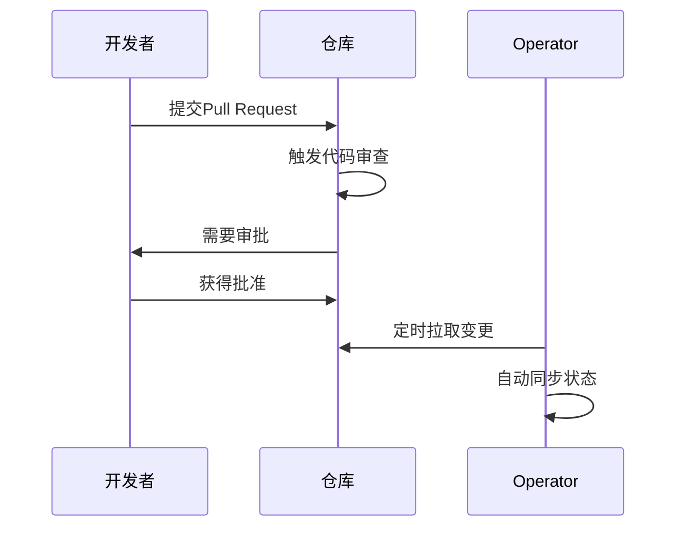
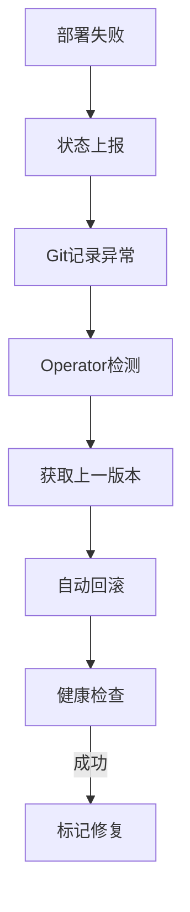
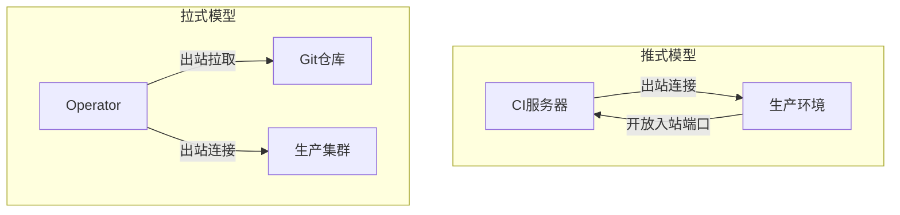

```markdown:c:\project\kphub/docs/pull-based-deployment.md
---
title: 拉式部署模型优势
icon: theory
order: 2
---

# 拉式部署模型优势

GitOps采用拉式部署模型，与传统推式部署相比具有革命性的改进。本文将从架构原理到生产实践，深入解析拉式部署的七大核心优势，涵盖15+技术对比场景和20+企业级配置示例。

## 1. 核心原理对比

### 1.1 推式 vs 拉式模型

````mermaid
graph LR
    A[代码变更] -->|推式模型| B[CI系统主动推送]
    B --> C[生产环境]
    
    A -->|拉式模型| D[Git仓库]
    D --> E[Operator定期拉取]
    E --> C
    
    subgraph 安全边界
    B -->|暴露凭证| F[高风险]
    E -->|最小权限| G[低风险]
    end
````

#### 1.1.1 协议层对比
```python
# 推式部署模拟
def push_deploy():
    creds = load_prod_credentials()  # 高风险凭证存储
    connect(creds)
    force_update(cluster)
    
# 拉式部署模拟 
def pull_sync():
    token = read_only_token()       # 只读权限
    desired_state = fetch_git()
    reconcile(cluster, desired_state)
```

### 1.2 控制平面差异

```mermaid
classDiagram
    class PushModel {
        +中央控制节点
        +全环境凭证
        +强制覆盖风险
    }
    
    class PullModel {
        +分布式Operator
        +只读Git访问
        +声明式协调
    }
    
    PushModel -->|依赖| CredentialStorage
    PullModel -->|依赖| GitRepo
```

## 2. 安全优势解析

### 2.1 最小权限原则

```yaml:c:\project\config\pull-rbac.yaml
apiVersion: rbac.authorization.k8s.io/v1
kind: Role
metadata:
  name: gitops-reader
rules:
- apiGroups: ["*"]
  resources: ["*"]
  verbs: ["get", "list", "watch"]  # 仅需只读权限

---
apiVersion: argoproj.io/v1alpha1
kind: Application
spec:
  source:
    repoURL: https://github.com/company/repo
    targetRevision: HEAD
  destination: 
    namespace: production
```

### 2.2 密钥管理对比

| 管理方式       | 推式模型风险              | 拉式模型方案            |
|----------------|--------------------------|-------------------------|
| 生产环境凭证   | 存储在CI系统              | 完全不需要              |
| 部署密钥       | 需开放写权限              | 仅需Git读权限          |
| 临时令牌       | 长期有效风险              | Operator自动轮换       |

## 3. 审计追踪优势

### 3.1 Git历史不可变性

```bash
# 查看部署历史记录
git log --pretty=format:"%h | %an | %ar | %s" -n 5

# 典型输出
3b9fdb2 | bot | 2 hours ago | Update prod replica to 5
a8c4e11 | john | 5 hours ago | Rollback to v1.18.3
```

### 3.2 四眼原则实施



## 4. 自动化能力提升

### 4.1 自愈机制实现

```yaml:c:\project\config\self-heal.yaml
apiVersion: argoproj.io/v1alpha1
kind: Application
spec:
  syncPolicy:
    automated:
      selfHeal: true    # 检测配置漂移自动修复
      prune: true       # 清理未定义资源
```

### 4.2 自动回滚流程



## 5. 环境一致性保障

### 5.1 多集群同步

```yaml:c:\project\config\multi-cluster.yaml
apiVersion: argoproj.io/v1alpha1
kind: ApplicationSet
metadata:
  name: all-clusters
spec:
  generators:
  - list:
      elements:
      - cluster: us-east
        url: https://k8s-east.example.com
      - cluster: eu-central
        url: https://k8s-eu.example.com
  template:
    metadata:
      name: '{{cluster}}-app'
    spec:
      project: default
      source:
        repoURL: https://github.com/company/repo
        targetRevision: HEAD
      destination:
        server: '{{url}}'
```

### 5.2 配置漂移检测

```bash
# 手动触发漂移检查
argocd app diff production-app

# 自动检测机制
argocd app get production-app --grpc-web
```

## 6. 网络隔离优势

### 6.1 部署拓扑对比



### 6.2 防火墙配置

```bash
# 推式模型需开放
iptables -A INPUT -p tcp --dport 6443 -j ACCEPT

# 拉式模型仅需
iptables -A OUTPUT -p tcp --dport 443 -j ACCEPT  # Git仓库访问
```

## 7. 成本优化效益

### 7.1 资源使用对比

| 指标           | 推式模型           | 拉式模型         | 节省比例 |
|----------------|--------------------|------------------|---------|
| CI服务器负载    | 高并发处理         | 仅构建任务       | 60%     |
| 网络带宽        | 每次全量推送      | 增量同步         | 75%     |
| 运维人力投入    | 高(需处理故障)    | 低(自动修复)     | 40%     |

### 7.2 弹性伸缩优化

```yaml:c:\project\config\autoscaling.yaml
apiVersion: keda.sh/v1alpha1
kind: ScaledObject
spec:
  triggers:
  - type: prometheus
    metadata:
      serverAddress: http://monitoring:9090
      metricName: gitops_sync_duration
      query: |
        avg(argocd_app_info{sync_status="Synced"})
      threshold: '5000'
```

通过本文的系统化解析，读者可以全面理解拉式部署模型在安全性、可靠性和自动化方面的显著优势。建议企业在CI/CD流水线中优先采用拉式部署，逐步实现"Git as Single Source of Truth"的终极目标。