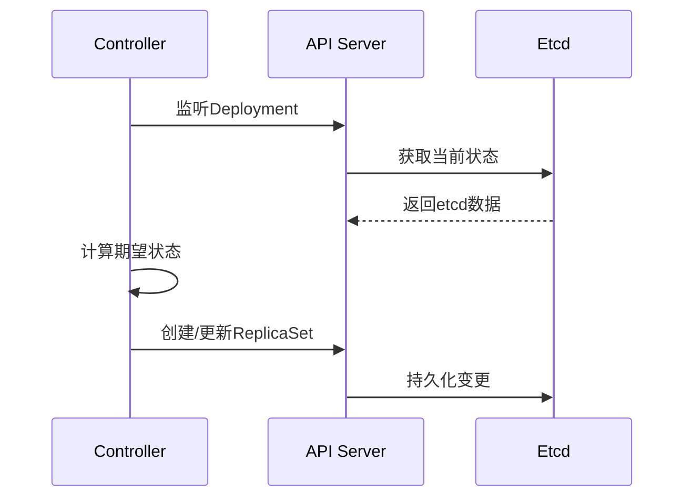
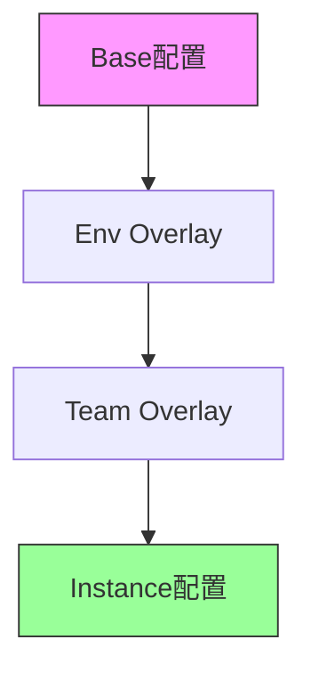
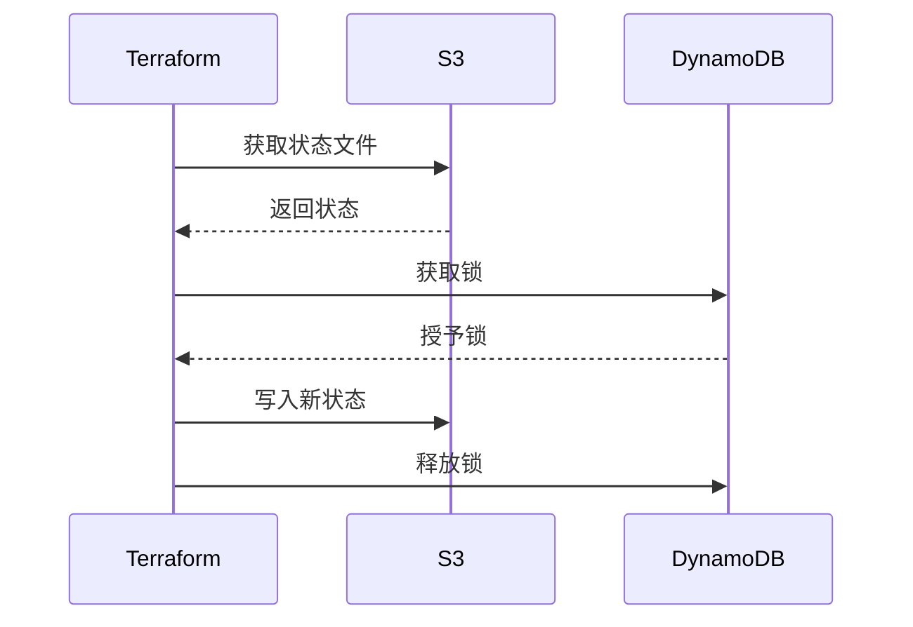
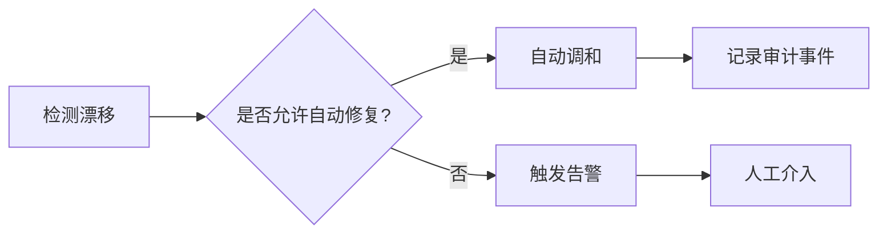
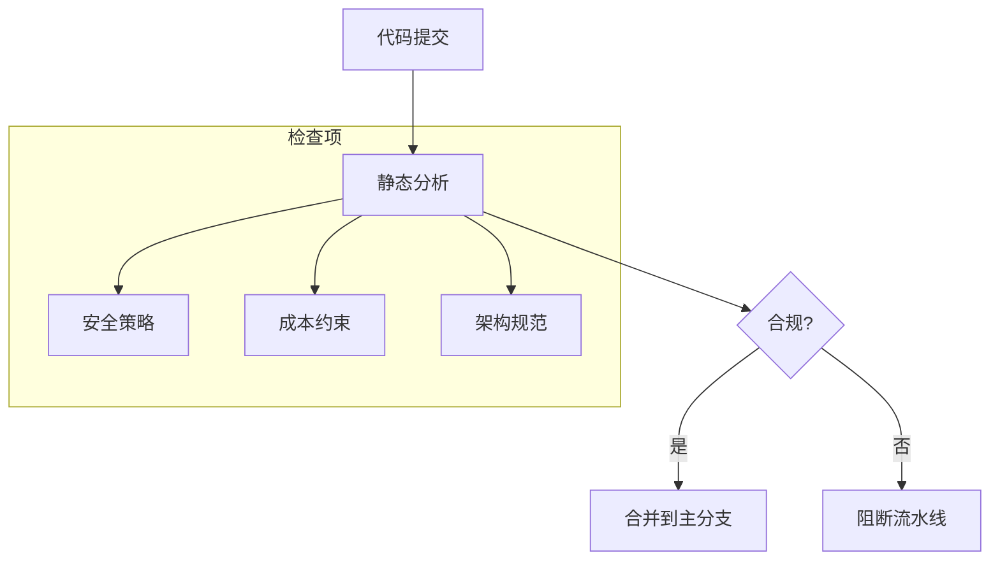
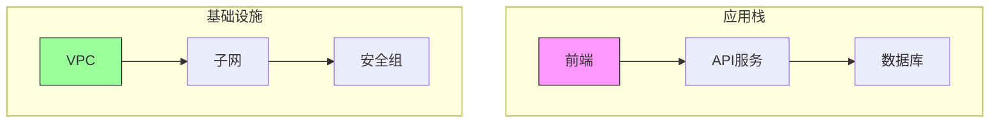
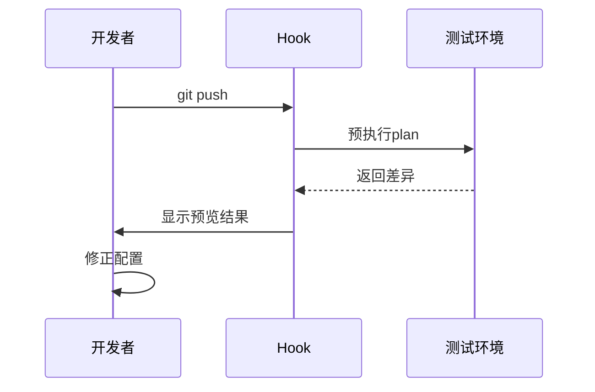
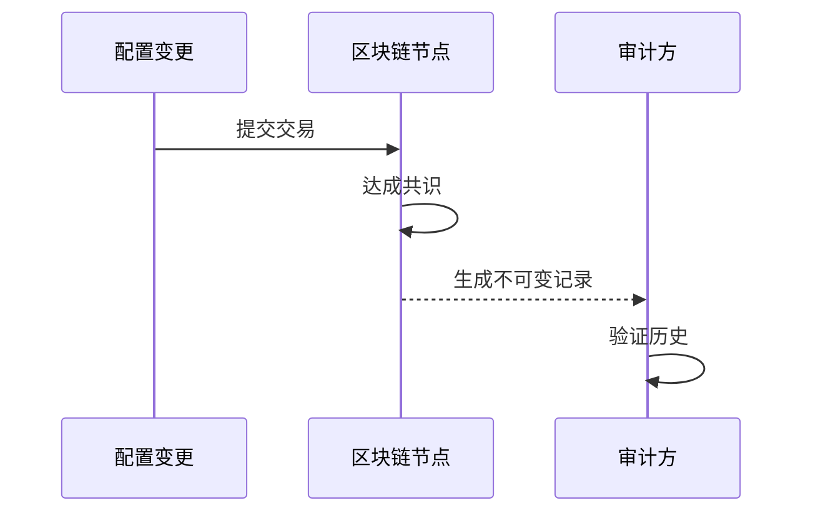

```markdown:c:\project\kphub/docs/declarative-config.md
---
title: 声明式配置管理
icon: theory
order: 3
---

# 声明式配置管理

声明式配置是GitOps的核心理念，它描述系统期望的状态而非达成该状态的步骤。本文将从原理剖析到企业级实践，深入解析声明式配置的完整知识体系，涵盖20+核心模式案例和15+生产环境最佳实践。

## 1. 核心原理剖析

### 1.1 声明式 vs 命令式

````mermaid
graph TD
    A[配置范式] --> B[声明式]
    A --> C[命令式]
    
    B --> B1["描述目标状态 (What)"]
    B --> B2["系统自动调和 (How)"]
    B --> B3["幂等性保证"]
    
    C --> C1["指定具体步骤 (How)"]
    C --> C2["顺序敏感性"]
    C --> C3["状态不可预测"]
````

#### 1.1.1 调和过程示例
```python
# 声明式调和算法
def reconcile_desired_state(desired, actual):
    diff = calculate_diff(desired, actual)
    for change in diff:
        apply_change(change)
    return actual == desired

# 命令式执行示例
def imperative_deploy():
    start_server()
    load_config()
    if not check_status():
        rollback()
```

### 1.2 数学建模

```math
S_{desired} = \{ s | s \in SystemComponents \}
```

$$
调和函数\ f(S_{actual}) \rightarrow S_{desired}\ 满足:
$$

$$
\forall c \in S_{actual}, \exists! c' \in S_{desired}\ 使得\ c \xrightarrow{ops} c'
$$

## 2. Kubernetes实践模式

### 2.1 核心资源配置

```yaml:c:\project\config\deployment.yaml
apiVersion: apps/v1
kind: Deployment
metadata:
  name: frontend
spec:
  replicas: 3
  selector:
    matchLabels:
      app: frontend
  template:
    metadata:
      labels:
        app: frontend
    spec:
      containers:
      - name: nginx
        image: nginx:1.25
        ports:
        - containerPort: 80
        resources:
          requests:
            memory: "128Mi"
            cpu: "250m"
```

#### 2.1.1 状态调和流程


### 2.2 高级模式实践

#### 2.2.1 配置分离策略


## 3. Terraform基础设施即代码

### 3.1 多云部署示例
```hcl:c:\project\infra\main.tf
module "aws_vpc" {
  source  = "terraform-aws-modules/vpc/aws"
  version = "5.0.0"
  
  cidr = "10.0.0.0/16"
  azs  = ["us-east-1a", "us-east-1b"]
}

module "gcp_network" {
  source  = "terraform-google-modules/network/google"
  version = "7.0.0"
  
  project_id   = var.gcp_project
  network_name = "glb-network"
}
```

### 3.2 状态锁定机制


## 4. 高级模式解析

### 4.1 配置漂移检测
```bash
# Kubernetes检测
kubectl diff -f config/
# Terraform检测
terraform plan -detailed-exitcode
```

#### 4.1.1 漂移修复策略


### 4.2 配置版本化
```git
commit 3a4b5c6d7e
Author: GitOps Bot <bot@company.com>
Date:   Thu Mar 21 10:00:00 2024 +0800

    Update frontend to v1.8.0
    
    - 增加新特性X
    - 修复安全漏洞CVE-2024-1234

commit 1a2b3c4d5e
Author: Human Developer <dev@company.com>
Date:   Wed Mar 20 15:30:00 2024 +0800

    Initial deployment config
```

## 5. 企业级实践方案

### 5.1 多环境管理
```yaml:c:\project\config\kustomization.yaml
bases:
- ../../base
patchesStrategicMerge:
- env/overlays/production/network.yaml
- team/security/policies.yaml
configMapGenerator:
- name: app-config
  behavior: merge
  files:
  - configs/app.properties
```

### 5.2 合规检查集成


## 6. 工具链深度集成

### 6.1 跨平台支持矩阵

| 工具         | Kubernetes | 云资源   | 裸金属   | 兼容性 |
|--------------|------------|----------|----------|--------|
| Terraform    | ✔️         | ✔️       | ✔️       | 高     |
| Ansible      | 部分       | ❌       | ✔️       | 中     |
| Pulumi       | ✔️         | ✔️       | ✔️       | 高     |
| Chef         | ❌         | ❌       | ✔️       | 低     |

### 6.2 可视化配置拓扑


## 7. 安全加固实践

### 7.1 机密管理方案
```yaml:c:\project\config\secrets.yaml
apiVersion: external-secrets.io/v1beta1
kind: ExternalSecret
metadata:
  name: db-credential
spec:
  refreshInterval: 1h
  secretStoreRef:
    name: vault
    kind: SecretStore
  target:
    name: db-secret
  data:
  - secretKey: password
    remoteRef:
      key: secrets/db
      property: password
```

### 7.2 策略即代码
```rego:c:\project\policies/security.rego
package main

deny[msg] {
    input.kind == "Deployment"
    not input.spec.template.spec.securityContext.runAsNonRoot
    msg = "必须使用非root用户运行容器"
}
```

## 8. 效能提升策略

### 8.1 缓存优化实践
```hcl:c:\project\infra\cache.tf
module "redis" {
  source  = "terraform-aws-modules/redis/aws"
  
  cluster_mode_enabled    = true
  replicas_per_node_group = 2
  shard_count             = 3
}
```

### 8.2 配置预检查


## 9. 前沿技术演进

### 9.1 机器学习调和
```python
def smart_reconcile(desired, actual):
    model = load_ai_model()
    diff = model.predict_diff(desired, actual)
    return optimize_plan(diff)
```

### 9.2 区块链审计


通过本文的系统化讲解，读者可以掌握从声明式配置基础到企业级实践的完整知识体系。建议按照"规范设计→工具选型→流程实施→持续优化"的路径推进，构建声明式驱动的现代IT系统。