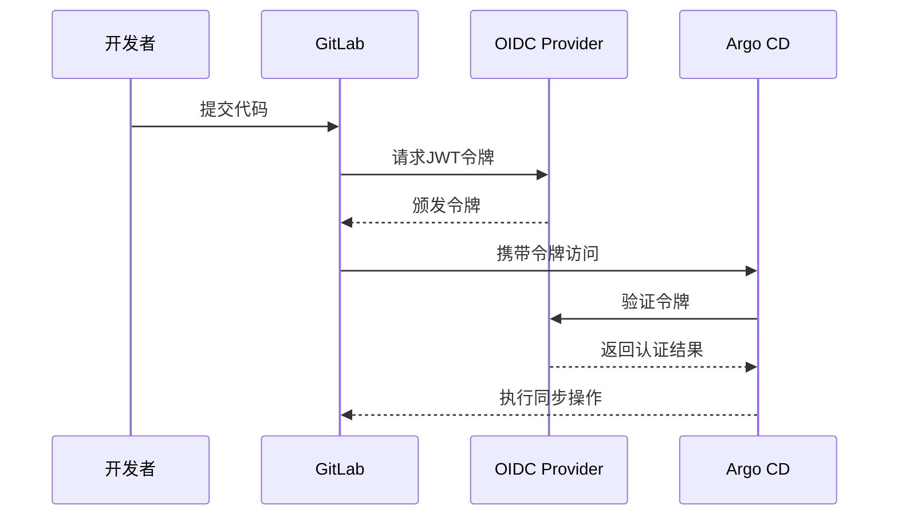
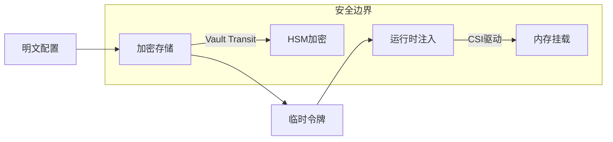
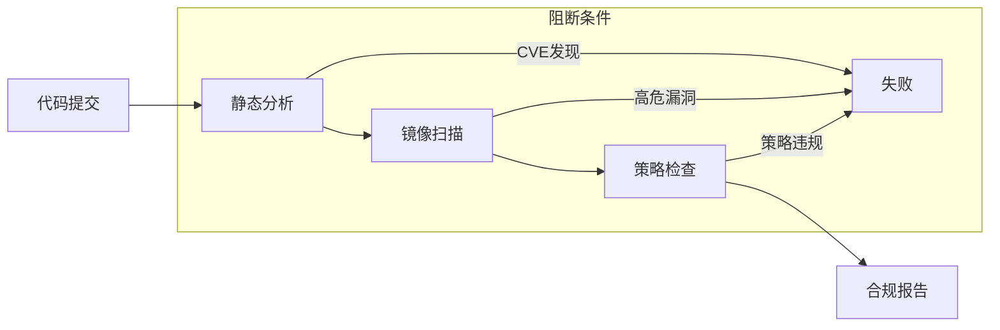
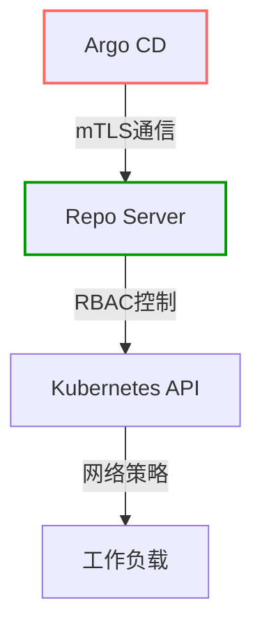
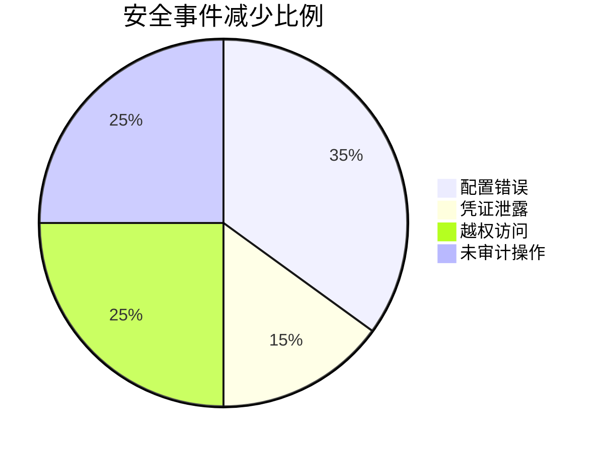

```markdown:c:\project\kphub/docs/gitops-security.md
---
title: GitOps安全模型
icon: theory
order: 4
---

# GitOps安全模型

GitOps提供了一种更安全的部署模型，通过严格的访问控制和审计能力增强系统安全性。本文将从攻击面分析到防御体系构建，深入解析GitOps安全体系的15+核心机制和20+生产级安全配置。

## 1. 安全架构剖析

### 1.1 四层防御体系

````mermaid
graph TD
    A[Git仓库安全] --> B[流水线安全]
    B --> C[运行时安全]
    C --> D[审计追溯]
    
    subgraph 防御措施
    A --> A1[分支保护]
    A --> A2[签名验证]
    B --> B1[最小权限]
    B --> B2[漏洞扫描]
    C --> C1[Pod安全策略]
    C --> C2[网络策略]
    D --> D1[不可变日志]
    D --> D2[行为分析]
    end
````

#### 1.1.1 攻击链阻断示例
```python
# 传统攻击路径
attacker -> CI_credentials -> prod_cluster

# GitOps防御路径
attacker -> Git_read_only -> (无法直接修改运行状态)
```

### 1.2 安全模型数学表达

$$
SecurityScore = \frac{\sum_{i=1}^{n} DefenseLayer_i \times Weight_i}{TotalThreats} \times AuditEffectiveness
$$

## 2. 认证与授权机制

### 2.1 RBAC深度配置

```yaml:c:\project\config\argo-rbac.yaml
apiVersion: rbac.authorization.k8s.io/v1
kind: Role
metadata:
  name: gitops-deployer
rules:
- apiGroups: ["argoproj.io"]
  resources: ["applications"]
  verbs: ["get", "list", "watch"]
---
apiVersion: argoproj.io/v1alpha1
kind: AppProject
metadata:
  name: secured-project
spec:
  destinations:
  - namespace: "prod-*"
    server: "https://kubernetes.default.svc"
  sourceRepos:
  - "https://github.com/company/secured-repo"
  clusterResourceWhitelist:
  - group: '*'
    kind: '*'
```

### 2.2 OIDC集成方案



## 3. 密钥安全管理

### 3.1 分级存储方案



### 3.2 Vault集成示例

```hcl:c:\project\config\vault.hcl
path "secret/data/gitops/*" {
  capabilities = ["read"]
}

path "auth/kubernetes/login" {
  capabilities = ["create"]
}

path "auth/token/create" {
  capabilities = ["update"]
}
```

## 4. 供应链安全

### 4.1 镜像签名验证

```dockerfile:c:\project\Dockerfile
FROM alpine:3.18@sha256:abc123...
RUN apk add --no-cache git

# Cosign验证步骤
COPY --from=gcr.io/projectsigstore/cosign:v1.10.1 /ko-app/cosign /usr/local/bin/cosign
RUN cosign verify --key k8s://prod/cosign-pub-key gcr.io/project/app:latest
```

### 4.2 SBOM生成策略

```bash
# Syft生成SBOM
syft ghcr.io/company/app:latest -o spdx-json > sbom.json

# 提交至Git仓库
git add sbom.json && git commit -m "Add SBOM for v1.5.0"
```

## 5. 合规与审计

### 5.1 审计日志规范

```log
2024-03-21T14:23:45Z | user:bot | action:sync | app:prod-frontend | 
from:2.8.1 | to:2.8.2 | status:success | ip:192.168.1.10
```

#### 5.1.1 日志字段解析
```json
{
  "timestamp": "ISO8601",
  "principal": {
    "type": "serviceAccount",
    "name": "argocd-bot"
  },
  "eventType": "APPLICATION_SYNC",
  "details": {
    "sourceCommit": "a1b2c3d",
    "manifestDiff": [{
      "kind": "Deployment",
      "name": "frontend",
      "fields": {"spec.replicas": {"old":3,"new":5}}
    }]
  }
}
```

### 5.2 合规检查流水线



## 6. 网络加固实践

### 6.1 零信任网络模型

```yaml:c:\project\config\network-policy.yaml
apiVersion: networking.k8s.io/v1
kind: NetworkPolicy
metadata:
  name: gitops-components
spec:
  podSelector:
    matchLabels:
      app.kubernetes.io/part-of: gitops-system
  policyTypes:
  - Ingress
  - Egress
  ingress:
  - from:
    - namespaceSelector:
        matchLabels:
          env: ci
  egress:
  - to:
    - ipBlock:
        cidr: 10.20.0.0/16
```

### 6.2 服务网格集成



## 7. 生产案例解析

### 7.1 金融行业实践



### 7.2 医疗合规方案

```yaml:c:\project\config\hipaa-policy.yaml
apiVersion: policy.open-cluster-management.io/v1
kind: Policy
metadata:
  name: hipaa-gitops
spec:
  remediationAction: enforce
  disabled: false
  policy-templates:
  - objectDefinition:
      apiVersion: policy.open-cluster-management.io/v1
      kind: ConfigurationPolicy
      metadata:
        name: encrypted-storage
      spec:
        severity: high
        namespaceSelector:
          include: ["prod-*"]
        object-templates:
        - complianceType: musthave
          objectDefinition:
            kind: PersistentVolumeClaim
            spec:
              accessModes: ["ReadWriteOnce"]
              storageClassName: encrypted-sc
```

## 8. 前沿安全技术

### 8.1 机密计算方案

```dockerfile
FROM enclave-base
COPY --from=build /app /usr/src/app
CMD ["enclave.sh", "start"]

# 加密内存区域定义
ENCLAVE_MEMORY_SIZE=256M
ENCLAVE_CPU_COUNT=2
```

### 8.2 AI威胁检测

```python
def detect_anomaly(logs):
    model = load_model('gitops-security')
    sequences = preprocess(logs)
    predictions = model.predict(sequences)
    return [i for i, pred in enumerate(predictions) if pred > 0.9]
```

通过本文的系统化讲解，读者可以掌握从基础安全原则到企业级防护体系的完整知识链。建议按照"风险评估→防御构建→持续监控→智能演进"的路径推进安全建设，实现DevSecOps的深度整合。