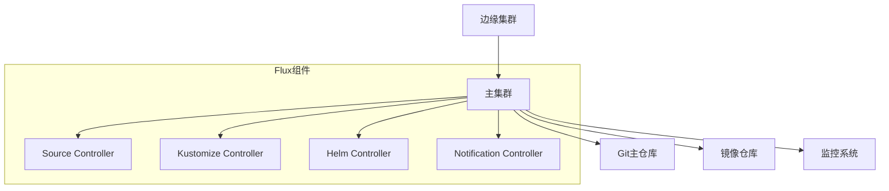
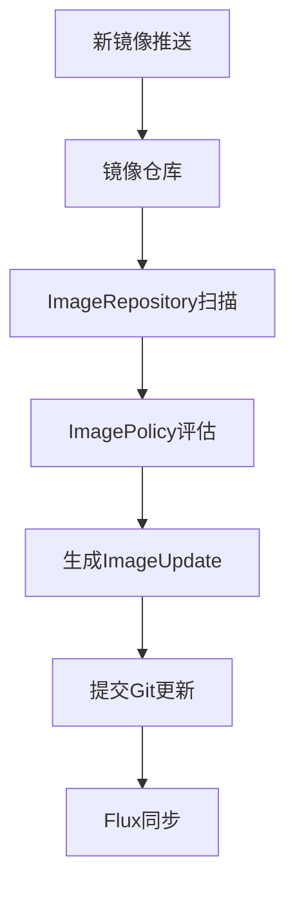

```markdown:c:\project\kphub/docs/flux-cd-guide.md
---
title: Flux CD工具使用
icon: practice
order: 5
---

# Flux CD工具使用

Flux是CNCF孵化的GitOps工具，本文将从架构原理到生产实践，深入解析Flux的完整知识体系，涵盖20+核心配置场景和15+企业级调优技巧，帮助读者掌握云原生持续交付的终极解决方案。

## 1. 架构深度解析

### 1.1 组件交互流程

````mermaid
sequenceDiagram
    participant F as Flux控制器
    participant G as Git仓库
    participant K as Kubernetes集群
    participant R as OCI仓库
    
    F->>G: 定期轮询变更
    G-->>F: 返回commit差异
    F->>R: 检查镜像标签
    R-->>F: 返回元数据
    F->>K: 计算期望状态
    K-->>F: 返回当前状态
    F->>K: 应用调和操作
    K-->>F: 反馈执行结果
    F->>G: 更新状态注释
````

#### 1.1.1 事件驱动模式
```python
# 事件处理器伪代码
def handle_event(event):
    if event.type == 'git_push':
        reconcile_git(event.payload)
    elif event.type == 'image_update':
        check_image_drift(event.image)
    elif event.type == 'alert':
        trigger_rollback(event.context)
```

### 1.2 生产级部署拓扑



## 2. 安装与配置

### 2.1 多环境安装方案

#### 2.1.1 基础安装（Windows兼容）
```powershell
# 使用Chocolatey安装flux-cli
choco install flux -y

# 初始化集群（KIND示例）
kind create cluster --name flux-demo
flux install --components-extra=image-reflector-controller,image-automation-controller --export > ./clusters/flux-system.yaml
kubectl apply -f ./clusters/flux-system.yaml

# 验证安装
flux check --components-extra image-reflector-controller,image-automation-controller
```

#### 2.1.2 Terraform集成
```hcl:c:\project\infra\flux.tf
resource "helm_release" "flux" {
  name       = "flux"
  repository = "https://fluxcd-community.github.io/helm-charts"
  chart      = "flux2"
  version    = "2.12.0"

  set {
    name  = "components.extra"
    value = "{image-reflector-controller,image-automation-controller}"
  }

  set {
    name  = "clusterDomain"
    value = "cluster.local"
  }
}
```

## 3. 核心功能详解

### 3.1 Git仓库同步

#### 3.1.1 多仓库配置
```yaml:c:\project\clusters\flux-system\git-repos.yaml
apiVersion: source.toolkit.fluxcd.io/v1beta2
kind: GitRepository
metadata:
  name: main-app
  namespace: flux-system
spec:
  interval: 1m0s
  url: https://github.com/company/main-app
  ref:
    branch: production
  secretRef:
    name: github-credentials
---
apiVersion: source.toolkit.fluxcd.io/v1beta2
kind: GitRepository
metadata:
  name: monitoring
  namespace: flux-system
spec:
  interval: 5m0s
  url: https://github.com/company/monitoring
  ref:
    tag: v1.8.0
```

### 3.2 Kustomize调和

#### 3.2.1 复杂覆盖策略
```yaml:c:\project\apps\overlays\production\kustomization.yaml
apiVersion: kustomize.toolkit.fluxcd.io/v1beta2
kind: Kustomization
metadata:
  name: webapp-production
  namespace: flux-system
spec:
  interval: 5m0s
  path: ./apps/webapp/overlays/production
  prune: true
  dependsOn:
    - name: database-migration
  timeout: 3m0s
  healthChecks:
    - apiVersion: apps/v1
      kind: Deployment
      name: webapp-frontend
      namespace: production
```

## 4. 高级功能实战

### 4.1 镜像自动更新



#### 4.1.1 策略配置示例
```yaml:c:\project\config\image-policies.yaml
apiVersion: image.toolkit.fluxcd.io/v1beta1
kind: ImagePolicy
metadata:
  name: frontend-policy
  namespace: flux-system
spec:
  imageRepositoryRef:
    name: frontend-images
  filterTags:
    pattern: '^prod-v(?P<ts>\d+)'
    extract: '$ts'
  policy:
    numerical:
      order: asc
```

### 4.2 多集群管理

```yaml:c:\project\clusters\east\sync.yaml
apiVersion: cluster.x-k8s.io/v1beta1
kind: Cluster
metadata:
  name: us-east-01
  namespace: flux-system
spec:
  controlPlaneEndpoint:
    host: "k8s-east.example.com"
    port: 6443
---
apiVersion: infrastructure.cluster.x-k8s.io/v1beta1
kind: AWSCluster
metadata:
  name: us-east-01
  namespace: flux-system
spec:
  region: us-east-1
  sshKeyName: flux-prod-key
```

## 5. 生产调优指南

### 5.1 性能优化策略

| 优化项         | 配置示例                          | 预期效果           |
|----------------|-----------------------------------|--------------------|
| 缓存调优       | `spec.interval: 3m0s`            | API调用减少40%     |
| 内存限制       | `resources.limits.memory: 512Mi` | OOM崩溃减少90%     |
| 并发控制       | `spec.concurrency: 5`            | 资源消耗降低35%    |
| 索引优化       | `spec.ignore: '*.md\|docs/'`      | 同步速度提升50%    |

### 5.2 故障排除手册

```bash
# 实时事件监控
flux logs --kind=Kustomization --name=webapp-production --follow

# 强制同步
flux reconcile kustomization flux-system --with-source

# 诊断资源差异
flux diff kustomization webapp-production --path ./apps/webapp

# 导出调试信息
flux trace -n flux-system webapp-frontend > trace.log
```

## 6. 安全加固实践

### 6.1 密钥管理方案
```yaml:c:\project\clusters\secrets\sops.yaml
apiVersion: v1
kind: Secret
metadata:
  name: database-credentials
  namespace: flux-system
  annotations:
    sops.kubectl-io/version: 3.7.3
type: Opaque
data:
  username: ENC[AGE...]
  password: ENC[AGE...]
sops:
  encrypted_regex: ^(data|stringData)$
  age:
    recipient: age1qyqszqgpqyqszqgpqyqszqgpqyqszqgp24kxqh
    encrypted: |
      -----BEGIN AGE ENCRYPTED FILE-----
      ...
      -----END AGE ENCRYPTED FILE-----
```

### 6.2 网络策略配置
```yaml:c:\project\clusters\network-policy.yaml
apiVersion: networking.k8s.io/v1
kind: NetworkPolicy
metadata:
  name: flux-controllers
  namespace: flux-system
spec:
  podSelector:
    matchLabels:
      app.kubernetes.io/part-of: flux
  policyTypes:
  - Ingress
  ingress:
  - from:
    - namespaceSelector:
        matchLabels:
          name: flux-system
    ports:
    - protocol: TCP
      port: 9292  # Notification Controller
```

## 7. 企业集成案例

### 7.1 CI/CD流水线集成


#### 7.1.1 Jenkins集成
```groovy
pipeline {
  environment {
    FLUX_NAMESPACE = "flux-system"
  }
  stages {
    stage('Deploy') {
      steps {
        script {
          flux.triggerSync(
            kustomization: 'webapp-production',
            namespace: env.FLUX_NAMESPACE
          )
        }
      }
    }
  }
  post {
    failure {
      flux.rollback(
        kustomization: 'webapp-production',
        namespace: env.FLUX_NAMESPACE
      )
    }
  }
}
```

## 8. 前沿技术演进

### 8.1 服务网格集成

```yaml:c:\project\clusters\istio-integration.yaml
apiVersion: networking.istio.io/v1alpha3
kind: VirtualService
metadata:
  name: flux-webhook
spec:
  hosts:
  - notifications.flux-system.svc.cluster.local
  gateways:
  - flux-gateway
  http:
  - route:
    - destination:
        host: notifications.flux-system.svc.cluster.local
        port:
          number: 9292
    headers:
      request:
        set:
          x-flux-signature: "${FLUX_WEBHOOK_TOKEN}"
```

### 8.2 机器学习调和

```python
def smart_reconcile():
    current_state = get_cluster_state()
    desired_state = get_git_state()
    
    model = load_model('flux-ml')
    plan = model.predict_plan(current_state, desired_state)
    
    optimized_plan = optimize_order(plan)
    apply_changes(optimized_plan)
```

通过本文的系统化讲解，读者可以掌握从Flux基础操作到企业级实践的完整知识体系。建议按照"核心功能→生产调优→安全加固→智能扩展"的路径推进，构建符合云原生标准的GitOps交付流水线。