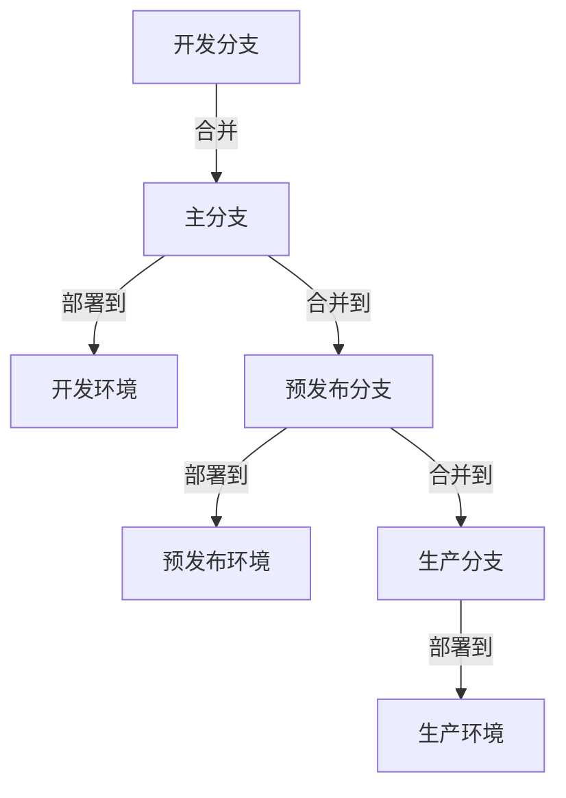
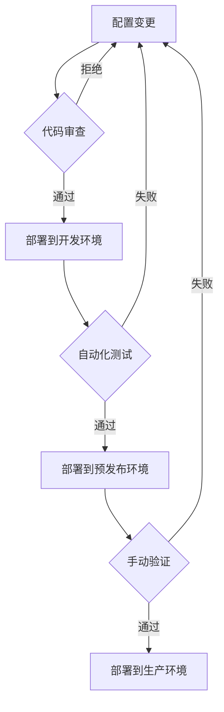

我将为您编写关于基于Git的配置管理的详细内容。

---
title: 基于Git的配置管理
icon: practice
order: 7
---

# 基于Git的配置管理

在GitOps模型中，Git仓库是配置的唯一真实来源。本文将详细介绍如何组织Git仓库结构、管理配置文件和实现环境隔离，构建高效的配置管理体系。

## Git仓库结构设计

### 单仓库 vs 多仓库

在设计基于Git的配置管理系统时，首先需要决定是采用单仓库（Monorepo）还是多仓库（Polyrepo）策略：

**单仓库（Monorepo）**：
- 将所有配置文件存储在一个Git仓库中
- 优点：
  - 配置变更的原子性，确保相关配置同时更新
  - 简化依赖管理和版本控制
  - 便于全局搜索和重构
- 缺点：
  - 随着项目增长，仓库可能变得庞大
  - 权限管理较为复杂

**多仓库（Polyrepo）**：
- 按应用、服务或环境将配置分散到多个仓库
- 优点：
  - 更精细的访问控制
  - 减少单个仓库的复杂度
  - 团队可以更独立地工作
- 缺点：
  - 跨仓库变更难以协调
  - 版本依赖管理更复杂

### 推荐的目录结构

无论选择哪种策略，良好的目录结构都至关重要。以下是一个推荐的配置仓库结构：

```
/
├── apps/                  # 应用级配置
│   ├── app1/
│   │   ├── base/          # 基础配置
│   │   ├── overlays/      # 环境特定配置覆盖
│   │   │   ├── dev/
│   │   │   ├── staging/
│   │   │   └── prod/
│   ├── app2/
│   └── ...
├── infrastructure/        # 基础设施配置
│   ├── networking/
│   ├── security/
│   └── monitoring/
├── platform/              # 平台级配置
│   ├── databases/
│   ├── messaging/
│   └── logging/
├── templates/             # 配置模板
├── scripts/               # 辅助脚本
└── docs/                  # 文档
```

## 配置文件管理

### 配置文件格式选择

选择合适的配置文件格式对于可读性和维护性至关重要：

- **YAML**：人类可读性强，支持注释，适合大多数配置场景
- **JSON**：与编程语言集成良好，但不支持注释
- **HCL**（HashiCorp Configuration Language）：适用于Terraform等HashiCorp工具
- **TOML**：简单易读，适合简单配置

示例（YAML格式）：

```yaml
# 数据库配置
database:
  host: db.example.com
  port: 5432
  credentials:
    username: ${DB_USER}  # 使用环境变量
    password: ${DB_PASSWORD}
  
# 应用设置
application:
  logLevel: INFO
  features:
    newUI: true
    analytics: false
```

### 配置分层与继承

采用分层配置可以减少重复并简化管理：

1. **基础配置层**：包含所有环境共享的默认配置
2. **环境特定层**：仅包含特定环境需要覆盖的配置
3. **实例特定层**：针对特定部署实例的配置

这种方法可以通过工具如Kustomize（Kubernetes）或自定义脚本实现。

示例（使用Kustomize）：

```yaml
# base/kustomization.yaml
apiVersion: kustomize.config.k8s.io/v1beta1
kind: Kustomization
resources:
- deployment.yaml
- service.yaml

# overlays/production/kustomization.yaml
apiVersion: kustomize.config.k8s.io/v1beta1
kind: Kustomization
bases:
- ../../base
patchesStrategicMerge:
- deployment-patch.yaml
```

### 敏感信息处理

配置管理中的一个关键挑战是安全地处理敏感信息：

1. **环境变量注入**：在运行时注入敏感信息
2. **密钥管理服务**：使用AWS Secrets Manager、HashiCorp Vault等
3. **加密工具**：如SOPS（Secrets OPerationS）、Sealed Secrets
4. **Git加密钩子**：在提交前自动加密敏感文件

示例（使用SOPS加密）：

```bash
# 加密配置文件
sops --encrypt --age public-key.txt config.yaml > config.enc.yaml

# 解密配置文件
sops --decrypt config.enc.yaml > config.yaml
```

## 环境隔离策略

### 分支策略

有几种常见的分支策略可用于环境隔离：

1. **环境分支模型**：
   - 为每个环境维护一个长期分支（如`dev`、`staging`、`production`）
   - 配置变更先应用到较低环境，然后合并到较高环境
   - 简单直观，但可能导致分支偏离

2. **GitOps分支模型**：
   - 主分支（`main`）包含所有环境的配置
   - 使用目录结构区分环境
   - 通过PR流程控制变更
   - 单一真实来源，但需要更严格的访问控制

3. **环境覆盖模型**：
   - 主分支包含基础配置
   - 环境特定配置存储在覆盖文件中
   - 部署工具在运行时合并基础配置和覆盖



### 标签和版本管理

使用Git标签可以标记特定的配置状态：

- 为每次部署创建标签（如`v1.2.3-prod`）
- 使用语义化版本控制（Semantic Versioning）
- 记录每个标签对应的变更内容

示例：

```bash
# 创建带注释的标签
git tag -a v1.2.3 -m "Release v1.2.3 with feature X and bugfix Y"

# 推送标签到远程仓库
git push origin v1.2.3
```

### 环境提升流程

建立明确的环境提升流程确保配置变更的可控性：

1. 开发人员在开发分支上创建配置变更
2. 通过PR将变更合并到主分支
3. 自动部署到开发环境并运行测试
4. 手动或自动提升到更高环境（如预发布）
5. 经过验证后，提升到生产环境



## 配置验证与测试

### 静态验证

在合并配置变更前进行静态验证：

- **语法检查**：确保配置文件格式正确
- **模式验证**：验证配置是否符合预定义的模式
- **策略检查**：确保配置符合组织策略（如安全要求）

示例（使用yamllint验证YAML文件）：

```bash
# 验证所有YAML文件
yamllint .

# 使用自定义规则验证
yamllint -c .yamllint.yml .
```

### 动态测试

在非生产环境中测试配置变更的实际效果：

- **集成测试**：验证配置与系统的集成
- **冒烟测试**：基本功能验证
- **回归测试**：确保现有功能不受影响

### 配置漂移检测

定期检测实际运行环境与Git中定义的配置之间的差异：

- 使用工具如Argo CD、Flux CD的漂移检测功能
- 实现自动或手动同步机制
- 记录并分析漂移原因，改进流程

## 最佳实践

### 文档化

- 在仓库中维护详细的README文件
- 记录配置结构、变更流程和环境特性
- 使用图表说明复杂的配置关系

### 审计与合规

- 保留完整的配置变更历史
- 实现四眼原则（至少两人审查重要变更）
- 定期审查访问权限和权限分配

### 自动化

- 实现配置变更的CI/CD流水线
- 自动化验证、测试和部署流程
- 使用Webhook触发相关系统更新

### 灾难恢复

- 定期备份Git仓库
- 制定配置回滚策略
- 测试从备份恢复的流程

## 工具生态系统

### 配置管理工具

- **Kustomize**：Kubernetes原生配置定制工具
- **Helm**：Kubernetes应用包管理器
- **Jsonnet/Dhall**：数据模板语言
- **Ansible**：IT自动化平台

### GitOps工具

- **Argo CD**：声明式GitOps持续交付工具
- **Flux CD**：GitOps for Kubernetes
- **Jenkins X**：云原生CI/CD平台
- **Terraform Cloud**：基础设施即代码的GitOps工作流

### 安全工具

- **SOPS**：加密文件编辑器
- **git-crypt**：Git文件透明加密
- **Vault**：密钥管理系统
- **Sealed Secrets**：Kubernetes加密Secret

## 结论

基于Git的配置管理为组织提供了一种强大的方式来管理和版本控制其配置。通过精心设计的仓库结构、适当的分支策略和自动化工具，可以实现配置的可追溯性、一致性和安全性。

随着组织的发展，配置管理系统也应该不断演进，采纳新的工具和最佳实践，以满足不断变化的需求。最重要的是，配置管理应该支持而不是阻碍开发和运维团队的工作，为他们提供一个可靠、高效的配置管理平台。