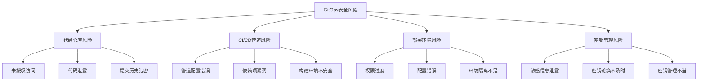
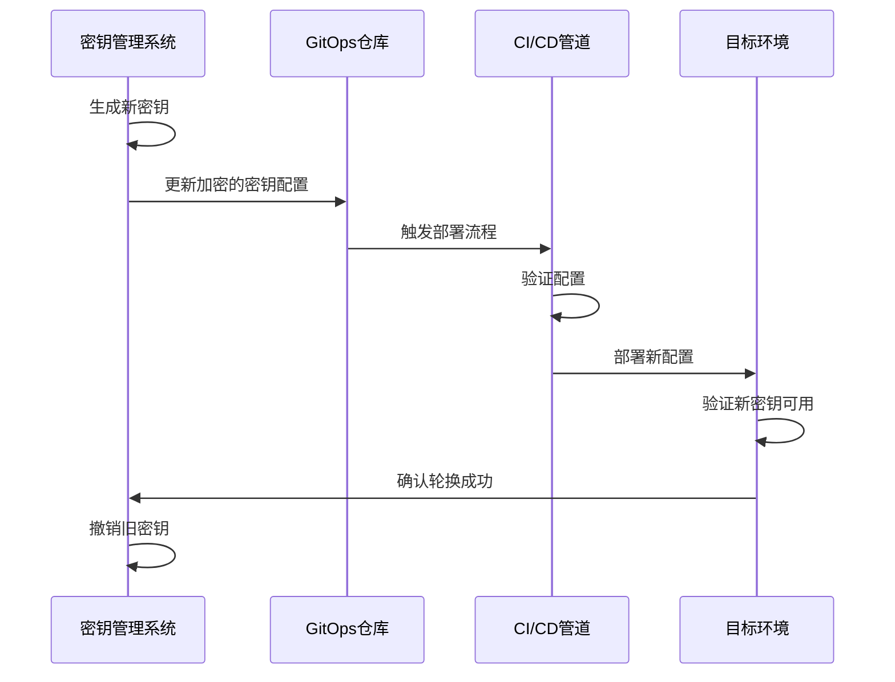
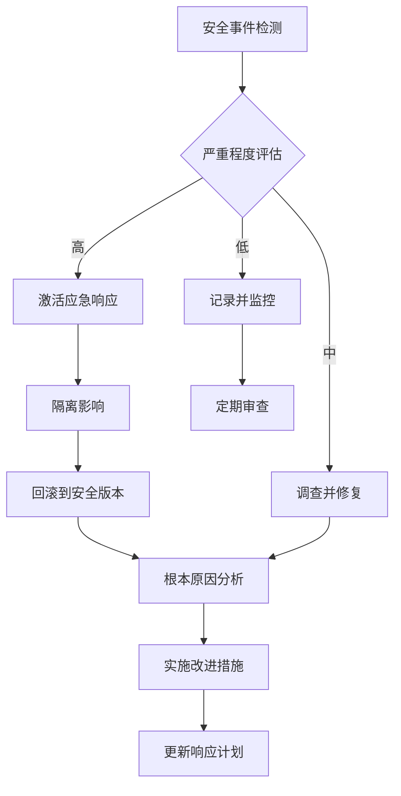

# GitOps安全最佳实践

实施GitOps需要遵循一系列安全最佳实践，确保部署流程的安全可靠。本文将详细介绍GitOps环境中的安全策略、密钥管理和访问控制方法。

## GitOps安全基础

### GitOps安全模型概述

GitOps将Git仓库作为单一可信源，这种模式本身就提供了一些内在的安全优势：

- **不可变基础设施**：通过代码定义基础设施，减少人为错误
- **版本控制**：所有变更都有历史记录，便于审计和回滚
- **自动化部署**：减少人工干预，降低人为安全风险

然而，这种模式也引入了新的安全挑战，如代码仓库安全、CI/CD管道安全以及密钥管理等。

### 安全风险评估

在实施GitOps前，应进行全面的安全风险评估：

1. **代码仓库风险**：未授权访问、代码泄露
2. **CI/CD管道风险**：管道配置错误、依赖项漏洞
3. **部署环境风险**：权限过度、配置错误
4. **密钥管理风险**：敏感信息泄露、密钥轮换不及时



## 仓库安全策略

### 代码仓库保护

保护Git仓库是GitOps安全的第一道防线：

1. **分支保护**：
   - 限制直接推送到主分支
   - 要求所有变更通过PR/MR流程
   - 设置必要的审批人数（至少2人）

2. **提交签名**：
   - 启用GPG签名验证
   - 要求所有提交必须签名
   - 定期轮换签名密钥

```bash
# 配置Git使用GPG签名
git config --global user.signingkey YOUR_GPG_KEY_ID
git config --global commit.gpgsign true

# 签名提交
git commit -S -m "安全变更，已签名"
```

3. **仓库访问控制**：
   - 实施最小权限原则
   - 定期审查访问权限
   - 使用RBAC（基于角色的访问控制）

### 代码审查流程

严格的代码审查流程是防止恶意代码或配置错误进入系统的关键：

1. **强制代码审查**：
   - 所有变更必须经过审查
   - 使用四眼原则（至少两人审查）
   - 审查者应具备相关领域专业知识

2. **自动化检查**：
   - 静态代码分析
   - 配置验证
   - 安全扫描

3. **审查清单**：
   - 权限变更检查
   - 敏感信息检查
   - 安全最佳实践符合性检查

```yaml
# 示例：GitHub分支保护规则
branches:
  - name: main
    protection:
      required_pull_request_reviews:
        required_approving_review_count: 2
        dismiss_stale_reviews: true
        require_code_owner_reviews: true
      required_status_checks:
        strict: true
        contexts: ["security-scan", "config-validation"]
      enforce_admins: true
      required_signatures: true
```

### 仓库监控与审计

持续监控仓库活动对于及时发现安全问题至关重要：

1. **活动日志**：
   - 记录所有仓库操作
   - 定期审查异常活动
   - 设置异常行为警报

2. **变更追踪**：
   - 跟踪关键文件的变更
   - 对敏感配置变更进行额外审查
   - 维护变更历史记录

3. **合规审计**：
   - 定期进行安全审计
   - 验证流程合规性
   - 记录审计结果和改进措施

## 密钥管理最佳实践

### 敏感信息处理

在GitOps流程中，妥善处理敏感信息是一项关键挑战：

1. **避免硬编码密钥**：
   - 永远不要在代码或配置中硬编码敏感信息
   - 使用环境变量或外部密钥管理系统
   - 实施密钥检测工具防止意外提交

2. **密钥加密**：
   - 使用专用工具加密敏感信息
   - 实施密钥轮换策略
   - 限制密钥访问权限

3. **密钥分离**：
   - 将敏感信息与配置分离
   - 使用引用而非直接值
   - 实施最小知情原则

### 密钥管理工具

多种工具可用于GitOps环境中的密钥管理：

1. **SOPS (Secrets OPerationS)**：
   - 支持多种加密后端（PGP、AWS KMS、GCP KMS等）
   - 可以选择性加密YAML/JSON文件中的特定字段
   - 与GitOps工具集成良好

```bash
# 使用SOPS加密配置文件
sops --encrypt --age public-key.txt config.yaml > config.enc.yaml

# 解密配置文件
sops --decrypt config.enc.yaml > config.yaml
```

2. **Sealed Secrets**：
   - Kubernetes专用密钥管理工具
   - 将Secret加密为SealedSecret对象
   - 只有集群内的控制器可以解密

```yaml
# 示例：SealedSecret对象
apiVersion: bitnami.com/v1alpha1
kind: SealedSecret
metadata:
  name: mysecret
  namespace: default
spec:
  encryptedData:
    password: AgBy8hCi8...truncated...xQB9Hg==
```

3. **HashiCorp Vault**：
   - 企业级密钥管理系统
   - 支持动态密钥生成
   - 提供完整的审计和访问控制

4. **云服务提供商密钥管理**：
   - AWS Secrets Manager
   - Google Secret Manager
   - Azure Key Vault

### 密钥轮换策略

定期轮换密钥是减少潜在安全风险的关键措施：

1. **自动轮换**：
   - 实施自动密钥轮换机制
   - 设置适当的轮换周期（30-90天）
   - 确保轮换过程不中断服务

2. **轮换流程**：
   - 生成新密钥
   - 更新应用配置
   - 验证新密钥可用
   - 撤销旧密钥

3. **应急轮换**：
   - 制定密钥泄露应急响应计划
   - 能够快速轮换所有受影响密钥
   - 进行定期演练



## CI/CD管道安全

### 管道配置安全

CI/CD管道是GitOps流程的核心，其安全性直接影响整个系统：

1. **管道配置保护**：
   - 将管道配置文件纳入版本控制
   - 对管道配置变更实施严格审查
   - 限制管道配置修改权限

2. **管道环境隔离**：
   - 为不同环境使用独立的管道
   - 实施环境间的访问控制
   - 防止生产凭证在非生产环境使用

3. **管道权限最小化**：
   - 为CI/CD系统分配最小必要权限
   - 使用临时凭证
   - 定期审查和轮换管道凭证

### 构建和部署安全

确保构建和部署过程的安全性：

1. **依赖项安全**：
   - 扫描依赖项漏洞
   - 使用可信源
   - 锁定依赖项版本

```yaml
# 示例：在CI管道中集成依赖项扫描
stages:
  - build
  - test
  - security
  - deploy

dependency-scan:
  stage: security
  script:
    - dependency-check --project "My Project" --scan .
  artifacts:
    paths:
      - dependency-check-report.html
```

2. **镜像安全**：
   - 使用最小基础镜像
   - 扫描容器漏洞
   - 签名和验证镜像

3. **部署验证**：
   - 部署前验证配置
   - 实施渐进式部署策略
   - 设置自动回滚机制

### 管道凭证管理

安全管理CI/CD管道中使用的凭证：

1. **凭证存储**：
   - 使用专用的凭证管理系统
   - 避免在管道配置中硬编码凭证
   - 限制凭证访问范围和时间

2. **临时凭证**：
   - 使用短期有效的临时凭证
   - 实施自动凭证轮换
   - 每次构建使用新凭证

3. **凭证审计**：
   - 记录凭证使用情况
   - 监控异常访问模式
   - 定期审查凭证权限

## 部署环境安全

### 环境隔离

正确隔离不同环境是防止安全问题扩散的关键：

1. **物理隔离**：
   - 使用独立的基础设施
   - 实施网络分段
   - 限制环境间通信

2. **逻辑隔离**：
   - 使用命名空间或租户分离
   - 实施环境特定的访问控制
   - 为不同环境使用独立的服务账号

3. **数据隔离**：
   - 防止生产数据在非生产环境使用
   - 实施数据脱敏
   - 限制敏感数据访问

### 运行时安全

保护应用在运行时的安全：

1. **容器安全**：
   - 以非特权用户运行容器
   - 实施只读文件系统
   - 限制容器能力

```yaml
# Kubernetes安全上下文示例
securityContext:
  runAsNonRoot: true
  runAsUser: 1000
  readOnlyRootFilesystem: true
  allowPrivilegeEscalation: false
  capabilities:
    drop:
      - ALL
```

2. **网络策略**：
   - 实施最小网络访问原则
   - 使用网络策略限制通信
   - 加密服务间通信

3. **资源限制**：
   - 设置CPU和内存限制
   - 防止资源耗尽攻击
   - 监控资源使用异常

### 合规性与审计

确保GitOps环境符合相关合规要求：

1. **合规框架**：
   - 识别适用的合规要求（如PCI DSS、HIPAA、GDPR）
   - 将合规检查集成到GitOps流程
   - 定期评估合规状态

2. **审计日志**：
   - 集中收集所有环境的审计日志
   - 保留足够的日志历史
   - 实施日志完整性保护

3. **证据收集**：
   - 自动收集合规证据
   - 记录所有变更的审批历史
   - 维护可验证的部署记录

## 访问控制与身份管理

### 身份验证机制

实施强大的身份验证是安全访问控制的基础：

1. **多因素认证**：
   - 为所有GitOps相关系统启用MFA
   - 要求敏感操作额外验证
   - 监控认证异常

2. **集中式身份管理**：
   - 使用SSO（单点登录）
   - 集成企业身份提供商
   - 自动禁用离职人员账号

3. **服务账号管理**：
   - 为自动化流程使用专用服务账号
   - 限制服务账号权限
   - 定期轮换服务账号凭证

### 权限模型设计

设计最小权限的访问控制模型：

1. **基于角色的访问控制**：
   - 定义清晰的角色和职责
   - 根据职责分配权限
   - 定期审查角色定义

```yaml
# Kubernetes RBAC示例
apiVersion: rbac.authorization.k8s.io/v1
kind: Role
metadata:
  namespace: default
  name: deployment-manager
rules:
- apiGroups: ["apps"]
  resources: ["deployments"]
  verbs: ["get", "list", "watch", "create", "update", "patch"]
```

2. **环境特定权限**：
   - 为不同环境设置不同权限级别
   - 提高生产环境访问门槛
   - 实施环境间的权限隔离

3. **临时权限提升**：
   - 实施权限提升流程
   - 记录提升原因和操作
   - 自动撤销临时权限

### 权限审计与治理

持续监控和改进访问控制：

1. **权限审计**：
   - 定期审查用户和服务账号权限
   - 识别未使用或过度权限
   - 实施权限清理流程

2. **访问记录**：
   - 记录所有访问活动
   - 分析异常访问模式
   - 设置异常行为警报

3. **权限治理**：
   - 制定明确的权限管理策略
   - 实施权限变更审批流程
   - 定期评估权限模型有效性

## 安全监控与响应

### 安全监控策略

持续监控GitOps环境的安全状态：

1. **全面监控**：
   - 监控代码仓库活动
   - 监控CI/CD管道执行
   - 监控部署环境状态

2. **异常检测**：
   - 建立正常行为基线
   - 检测偏离基线的活动
   - 实施自动响应机制

3. **安全指标**：
   - 定义关键安全指标
   - 跟踪安全状态趋势
   - 设置指标阈值警报

### 漏洞管理

有效管理和修复安全漏洞：

1. **漏洞扫描**：
   - 定期扫描代码和依赖项
   - 扫描容器镜像
   - 扫描基础设施配置

```yaml
# 示例：在GitOps流程中集成漏洞扫描
stages:
  - build
  - scan
  - deploy

vulnerability-scan:
  stage: scan
  script:
    - trivy image myapp:latest
  rules:
    - if: $CI_COMMIT_BRANCH == "main"
```

2. **漏洞分类**：
   - 根据严重性和影响评估漏洞
   - 优先修复高风险漏洞
   - 记录风险接受决策

3. **修复流程**：
   - 制定标准修复流程
   - 验证修复有效性
   - 跟踪修复时间指标

### 事件响应

准备应对安全事件：

1. **响应计划**：
   - 制定详细的安全事件响应计划
   - 定义角色和职责
   - 建立沟通渠道

2. **应急回滚**：
   - 实施快速回滚机制
   - 准备隔离受影响环境的流程
   - 定期测试回滚功能

3. **事后分析**：
   - 进行根本原因分析
   - 记录经验教训
   - 改进安全控制措施



## GitOps安全成熟度模型

### 安全成熟度评估

评估组织GitOps安全实践的成熟度：

1. **初始级**：
   - 基本版本控制
   - 简单访问控制
   - 手动部署流程

2. **发展级**：
   - 自动化CI/CD流程
   - 基本密钥管理
   - 环境隔离

3. **定义级**：
   - 全面安全策略
   - 自动化安全检查
   - 标准化流程

4. **管理级**：
   - 安全指标跟踪
   - 持续改进
   - 全面审计

5. **优化级**：
   - 自动化安全响应
   - 预测性安全分析
   - 安全文化融入

### 持续改进

建立持续改进GitOps安全的机制：

1. **安全评估**：
   - 定期进行安全评估
   - 识别改进机会
   - 跟踪安全成熟度进展

2. **知识共享**：
   - 记录安全最佳实践
   - 培训团队成员
   - 分享安全经验教训

3. **技术更新**：
   - 跟踪安全技术发展
   - 评估新安全工具
   - 更新安全控制措施

## 结论

GitOps为现代软件交付提供了强大的框架，但必须将安全考虑融入其每个环节。通过实施本文介绍的安全最佳实践，组织可以在享受GitOps带来的敏捷性和可靠性的同时，确保整个交付流程的安全性。

安全不是一次性工作，而是需要持续关注和改进的过程。随着威胁环境的不断变化，GitOps安全实践也需要不断演进。通过建立安全文化、实施技术控制和持续监控，组织可以构建既安全又高效的GitOps环境。