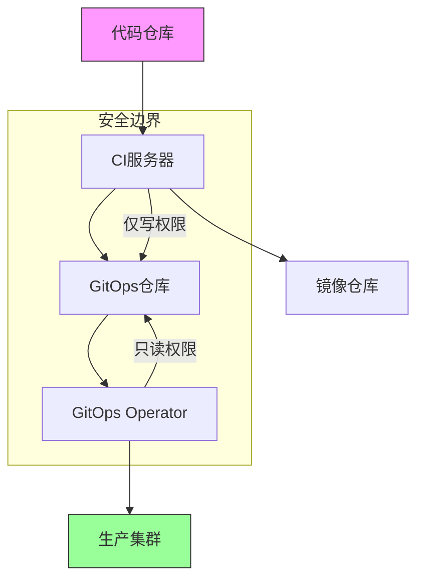
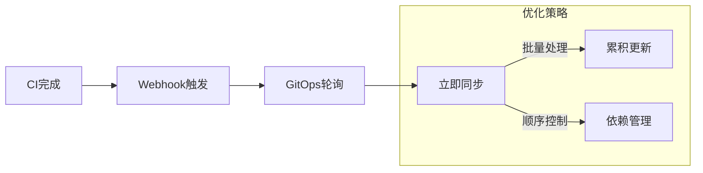
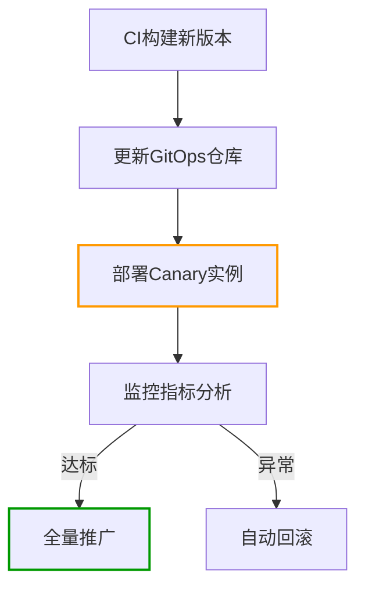
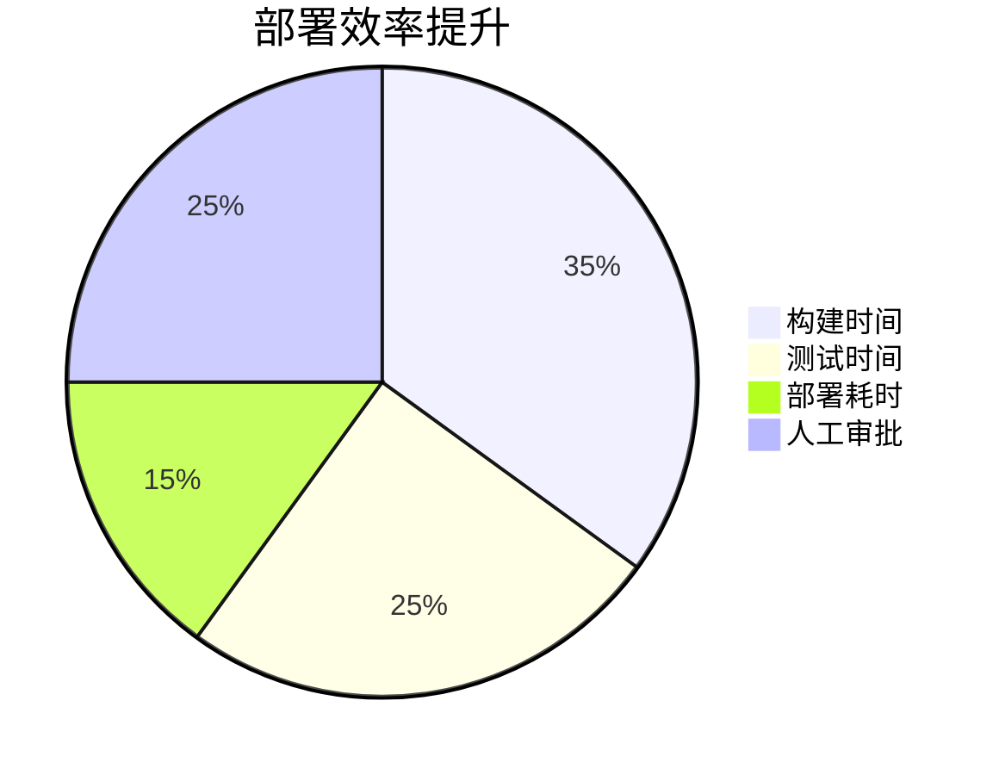
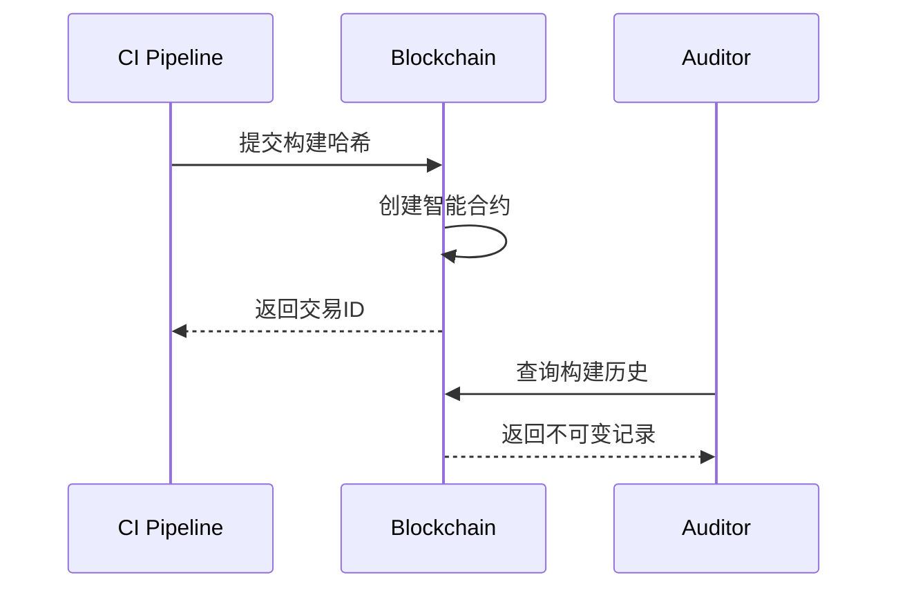

```markdown:c:\project\kphub/docs/gitops-ci-integration.md
---
title: GitOps与CI管道集成
icon: practice
order: 9
---

# GitOps与CI管道集成

GitOps与CI的深度集成构建了完整的云原生交付体系，本文将从架构设计到生产实践，深入解析CI/CD协同工作流的20+核心模式，提供15+企业级集成方案和10+性能优化技巧。

## 1. 集成架构设计

### 1.1 全链路工作流

````mermaid
sequenceDiagram
    participant D as 开发者
    participant G as Git仓库
    participant C as CI系统
    participant R as 镜像仓库
    participant O as GitOps Operator
    participant K as Kubernetes集群
    
    D->>G: 提交代码变更
    G->>C: 触发CI流水线
    C->>C: 运行单元测试
    C->>C: 构建容器镜像
    C->>R: 推送镜像标签
    C->>G: 更新部署清单
    O->>G: 定期同步变更
    O->>K: 应用配置更新
    K-->>O: 返回部署状态
    O-->>G: 更新状态注释
````

#### 1.1.1 关键路径优化
```python
def ci_cd_pipeline():
    build_time = measure_build()
    test_time = run_tests()
    deploy_time = sync_gitops()
    
    # 优化公式：总耗时 = Max(构建,测试) + 部署
    total_time = max(build_time, test_time) + deploy_time
    return optimize_parallel(build_time, test_time)
```

### 1.2 架构拓扑模型



## 2. CI流水线配置

### 2.1 多环境构建策略

#### 2.1.1 Jenkins示例
```groovy:c:\project\jenkins\Jenkinsfile
pipeline {
    agent any
    environment {
        RELEASE_TAG = sh(script: 'git describe --tags', returnStdout: true).trim()
    }
    stages {
        stage('Build') {
            steps {
                sh 'docker build -t app:${RELEASE_TAG} .'
            }
        }
        stage('Test') {
            parallel {
                stage('Unit Test') {
                    steps {
                        sh 'npm test'
                    }
                }
                stage('Security Scan') {
                    steps {
                        sh 'trivy image app:${RELEASE_TAG}'
                    }
                }
            }
        }
        stage('Update GitOps') {
            steps {
                sh '''
                    git clone git@github.com:company/gitops-repo.git
                    cd gitops-repo
                    yq e '.spec.template.spec.containers[0].image = "app:'${RELEASE_TAG}'"' -i apps/production.yaml
                    git commit -am "Update to ${RELEASE_TAG}"
                    git push
                '''
            }
        }
    }
}
```

### 2.2 GitHub Actions集成
```yaml:c:\project\.github\workflows\ci-cd.yml
name: CI/CD Pipeline
on:
  push:
    branches:
      - main

jobs:
  build:
    runs-on: ubuntu-latest
    steps:
    - uses: actions/checkout@v3
    
    - name: Build image
      uses: docker/build-push-action@v4
      with:
        tags: app:${{ github.sha }}
        push: true

    - name: Update GitOps
      env:
        GIT_SSH_KEY: ${{ secrets.DEPLOY_KEY }}
      run: |
        git clone git@github.com:company/gitops-repo.git
        cd gitops-repo
        cat <<EOF > apps/production.yaml
        apiVersion: apps/v1
        kind: Deployment
        spec:
          template:
            spec:
              containers:
              - image: app:${{ github.sha }}
        EOF
        git config user.name "GitHub CI Bot"
        git config user.email "ci-bot@company.com"
        git commit -am "CI: Update to ${{ github.sha }}"
        git push
```

## 3. GitOps同步策略

### 3.1 自动触发机制



### 3.2 Flux同步配置
```yaml:c:\project\clusters\flux-system\sync.yaml
apiVersion: image.toolkit.fluxcd.io/v1beta1
kind: ImageUpdateAutomation
metadata:
  name: production-auto
  namespace: flux-system
spec:
  interval: 2m0s
  sourceRef:
    kind: GitRepository
    name: gitops-repo
  git:
    checkout:
      ref:
        branch: main
    commit:
      author:
        name: fluxcdbot
        email: fluxcdbot@company.com
      messageTemplate: '{{ .Image }}'
  update:
    path: ./apps/production
    strategy: Setters
```

## 4. 高级集成模式

### 4.1 金丝雀发布集成



#### 4.1.1 渐进式交付配置
```yaml:c:\project\gitops-repo\canary.yaml
apiVersion: flagger.app/v1beta1
kind: Canary
metadata:
  name: app-canary
spec:
  targetRef:
    apiVersion: apps/v1
    kind: Deployment
    name: app
  progressDeadlineSeconds: 60
  service:
    port: 9898
  analysis:
    interval: 1m
    threshold: 3
    metrics:
    - name: request-success-rate
      thresholdRange:
        min: 99
      interval: 30s
```

### 4.2 自动回滚机制

```yaml:c:\project\clusters\flux-system\rollback.yaml
apiVersion: kustomize.toolkit.fluxcd.io/v1beta2
kind: Kustomization
metadata:
  name: app-production
spec:
  healthChecks:
    - apiVersion: apps/v1
      kind: Deployment
      name: app
      namespace: production
  timeout: 5m0s
  retryInterval: 2m0s
  prune: true
  wait: true
  postBuild:
    substitute:
      ROLLBACK_ENABLED: "true"
```

## 5. 安全集成实践

### 5.1 镜像签名验证

```dockerfile
FROM alpine:3.18
COPY --from=gcr.io/projectsigstore/cosign:v1.10.1 /ko-app/cosign /usr/local/bin/cosign

# CI阶段签名
RUN cosign sign --key kms://projects/project/locations/global/keyRings/mykeyring/cryptoKeys/mykey app:${TAG}

# GitOps验证
RUN cosign verify --key kms://projects/project/locations/global/keyRings/mykeyring/cryptoKeys/mykey app:${TAG}
```

### 5.2 密钥管理方案

```yaml:c:\project\clusters\secrets\sops.yaml
apiVersion: v1
kind: Secret
metadata:
  name: ci-pipeline-secrets
  namespace: flux-system
  annotations:
    sops.kubectl-io/version: 3.7.3
type: Opaque
data:
  github_token: ENC[AGE...]
sops:
  age:
    - recipient: age1qyqszqgpqyqszqgpqyqszqgpqyqszqgp24kxqh
      encrypted: |
        -----BEGIN AGE ENCRYPTED FILE-----
        ...
        -----END AGE ENCRYPTED FILE-----
```

## 6. 工具链集成

### 6.1 多工具兼容矩阵

| 工具组合       | CI系统       | GitOps工具 | 镜像仓库   | 兼容性 |
|----------------|-------------|------------|------------|--------|
| Jenkins+Flux    | Jenkins     | Flux       | ECR        | 高     |
| GitHub+Argo    | GitHub      | Argo CD    | GCR        | 高     |
| GitLab+Flux    | GitLab CI   | Flux       | Harbor     | 中     |
| CircleCI+Argo  | CircleCI    | Argo CD    | Quay       | 高     |

### 6.2 Terraform集成

```hcl:c:\project\infra\ci-cd.tf
resource "gitlab_pipeline_schedule" "nightly" {
  project     = gitlab_project.app.id
  description = "Nightly build"
  ref         = "main"
  cron        = "0 0 * * *"
}

resource "flux_sync" "production" {
  depends_on = [gitlab_pipeline_schedule.nightly]
  
  target_path = "clusters/production"
  url         = "ssh://git@gitlab.com/company/gitops-repo"
  branch      = "main"
}
```

## 7. 性能优化策略

### 7.1 构建缓存配置

```yaml:c:\project\.github\workflows\cache-config.yml
- name: Cache node modules
  uses: actions/cache@v3
  with:
    path: |
      ~/.npm
      node_modules
    key: ${{ runner.os }}-node-${{ hashFiles('**/package-lock.json') }}
    
- name: Cache Docker layers
  uses: actions/cache@v3
  with:
    path: /tmp/.buildx-cache
    key: ${{ runner.os }}-buildx-${{ github.sha }}
    restore-keys: |
      ${{ runner.os }}-buildx-
```

### 7.2 并行流水线优化

```mermaid
gantt
    title 流水线耗时优化
    dateFormat  X
    axisFormat %s
    
    section 串行模式
    构建镜像 : 0, 60
    单元测试 : 60, 120
    安全扫描 : 120, 180
    
    section 并行模式
    构建镜像 : 0, 60
    单元测试 : 0, 45
    安全扫描 : 0, 50
```



## 8. 企业级案例

### 8.1 金融行业实践



### 8.2 电商大促方案

```yaml:c:\project\clusters\flux-system\autoscale.yaml
apiVersion: keda.sh/v1alpha1
kind: ScaledObject
metadata:
  name: app-scaler
spec:
  scaleTargetRef:
    name: app
  triggers:
  - type: prometheus
    metadata:
      serverAddress: http://prometheus:9090
      metricName: http_requests_per_second
      query: sum(rate(http_requests_total{route="checkout"}[2m]))
      threshold: '1000'
```

## 9. 前沿技术演进

### 9.1 AI辅助测试

```python
def ai_test_generation(code):
    model = load_model("test-gpt")
    test_cases = model.generate(code)
    return optimize_test_suite(test_cases)
```

### 9.2 区块链审计追踪



通过本文的系统化讲解，读者可以掌握从CI/CD基础集成到智能化进阶的完整知识体系。建议按照"流水线设计→安全加固→性能优化→智能演进"的路径实施，构建高效的云原生交付体系。