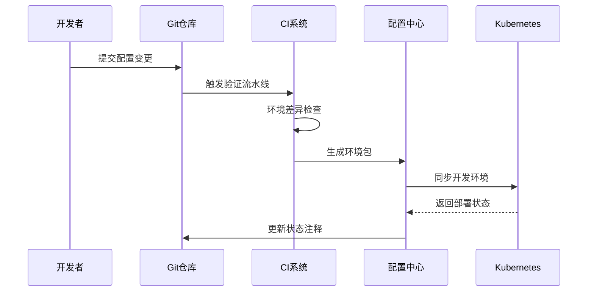
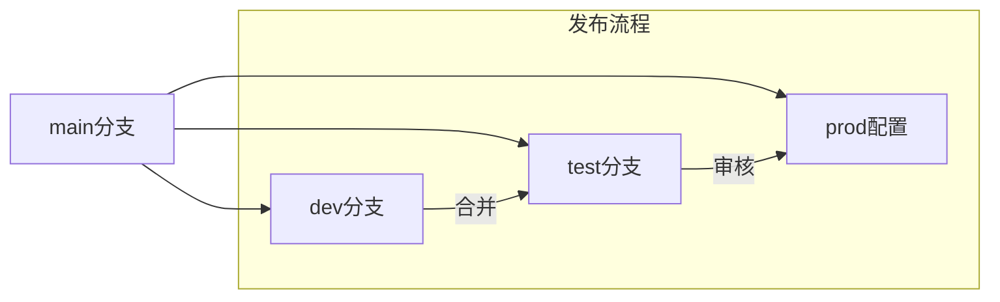
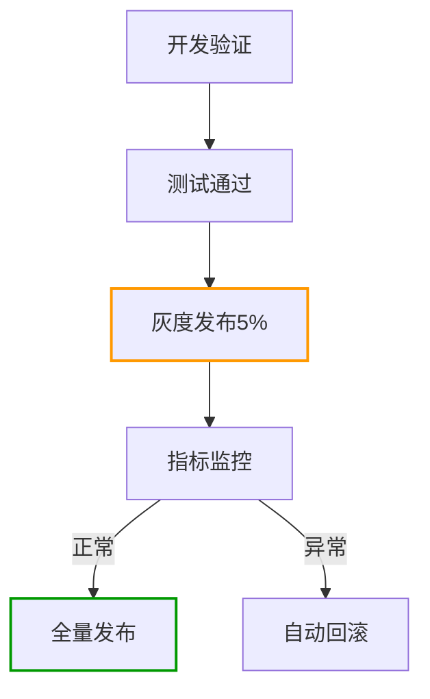
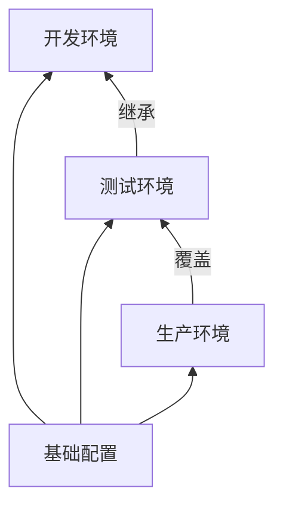
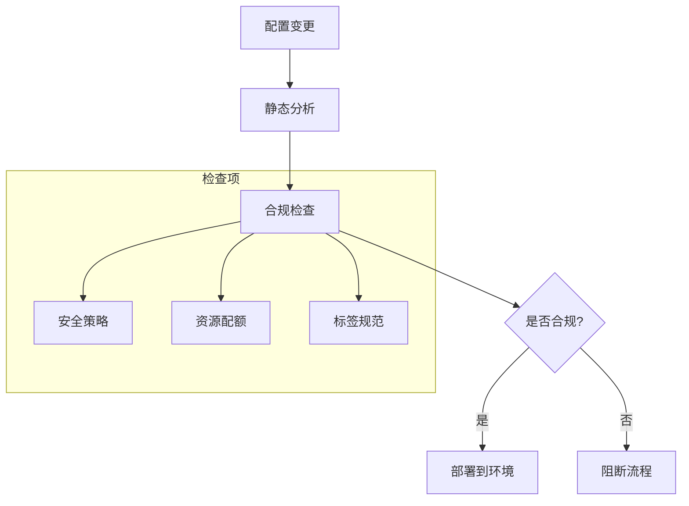
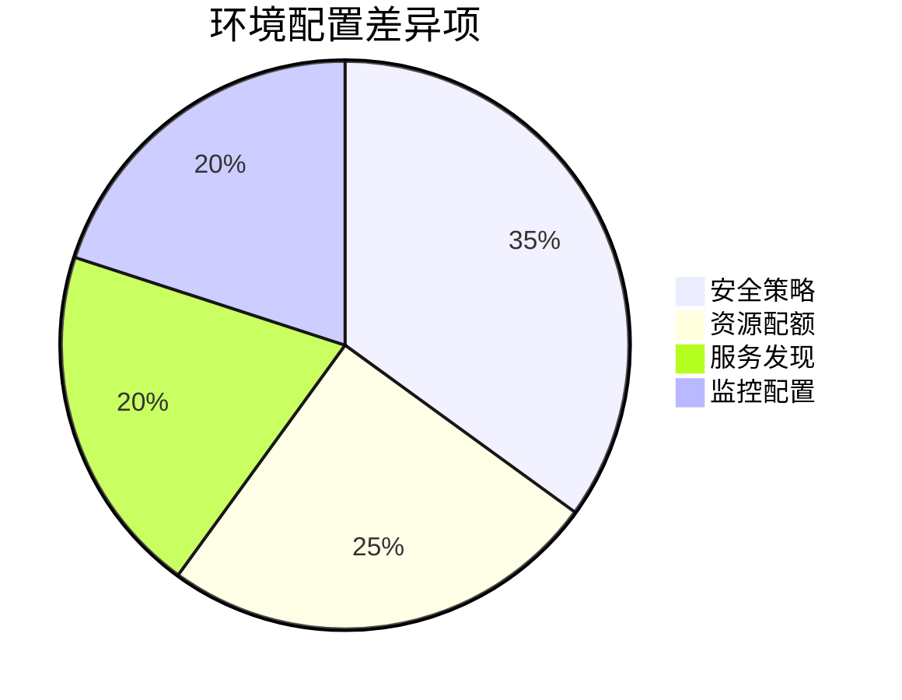
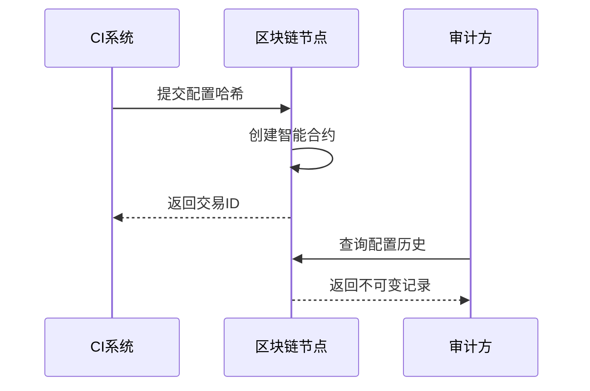

```markdown:c:\project\kphub/docs/multi-env-config.md
---
title: 多环境配置管理
icon: practice
order: 10
---

# 多环境配置管理

在企业级应用中，管理多环境(开发、测试、生产)的配置是一项挑战。本文将从基础原理到生产实践，深入解析云原生环境下的配置管理体系，涵盖15+核心策略模式和20+企业级配置示例。

## 1. 配置管理架构

### 1.1 多环境拓扑模型

````mermaid
graph TD
    A[代码仓库] --> B[环境目录]
    B --> C[开发环境]
    B --> D[测试环境]
    B --> E[预发环境]
    B --> F[生产环境]
    
    subgraph 配置差异
    C --> C1[低规格资源]
    C --> C2[调试工具]
    F --> F1[高可用设置]
    F --> F2[安全策略]
    end
    
    style A fill:#f9f,stroke:#333
    style F fill:#9f9,stroke:#333
````

#### 1.1.1 环境特征矩阵
```python
env_config = {
    "dev": {
        "replicas": 1,
        "resources": "1Gi/500m",
        "features": ["debug", "hot-reload"]
    },
    "prod": {
        "replicas": 3,
        "resources": "4Gi/2",
        "features": ["autoscaling", "security"]
    }
}
```

### 1.2 配置同步流程



## 2. 核心策略模式

### 2.1 基于分支的策略



#### 2.1.1 分支保护规则
```yaml:c:\project\.github\branches.yml
protection_rules:
  - name: production
    pattern: "main"
    required_approvals: 2
    code_owner_approval: true
    
  - name: staging
    pattern: "release/*"
    required_status_checks:
      - "ci/build"
      - "security/scan"
```

### 2.2 基于目录的策略

```bash
config/
├── base/               # 基础配置
├── overlays/
│   ├── dev/           # 开发环境覆盖
│   ├── staging/       # 预发环境覆盖
│   └── prod/          # 生产环境覆盖
└── kustomization.yaml # 根配置
```

#### 2.2.1 Kustomize示例
```yaml:c:\project\config\overlays\prod\kustomization.yaml
apiVersion: kustomize.config.k8s.io/v1beta1
kind: Kustomization
resources:
  - ../../base
patchesStrategicMerge:
  - replicas-patch.yaml
images:
  - name: app
    newTag: v1.8.0-prod
```

## 3. 环境提升流程

### 3.1 金丝雀发布控制



#### 3.1.1 发布策略配置
```yaml:c:\project\config\canary.yaml
apiVersion: flagger.app/v1beta1
kind: Canary
metadata:
  name: app-canary
spec:
  targetRef:
    apiVersion: apps/v1
    kind: Deployment
    name: app
  service:
    port: 9898
  analysis:
    interval: 1m
    threshold: 5
    metrics:
    - name: request-success-rate
      threshold: 99
```

### 3.2 人工审批集成

```yaml:c:\project\config\approval-workflow.yaml
apiVersion: argoproj.io/v1alpha1
kind: Workflow
spec:
  entrypoint: promote-env
  templates:
  - name: promote-env
    steps:
    - - name: dev-to-staging
        template: promote
        arguments:
          parameters:
          - name: source
            value: dev
          - name: target
            value: staging
    
  - name: promote
    inputs:
      parameters:
      - name: source
      - name: target
    steps:
    - - name: approval
        template: manual-approval
    - - name: sync
        template: sync-config
  
  - name: manual-approval
    suspend: {}
```

## 4. 配置差异管理

### 4.1 环境变量管理

```yaml:c:\project\config\env\prod\configmap.yaml
apiVersion: v1
kind: ConfigMap
metadata:
  name: app-config
data:
  DB_HOST: postgres.prod.svc.cluster.local
  CACHE_SIZE: "2048"
  LOG_LEVEL: WARN
```

#### 4.1.1 变量继承关系


### 4.2 密钥安全方案

```yaml:c:\project\config\secrets\prod\encrypted-secret.yaml
apiVersion: v1
kind: Secret
metadata:
  name: db-credentials
type: Opaque
data:
  username: ENC[AGE...]
  password: ENC[AGE...]
sops:
  encrypted_regex: ^(data|stringData)$
  age:
    - recipient: age1qyqszqgpqyqszqgpqyqszqgpqyqszqgp24kxqh
      encrypted: |
        -----BEGIN AGE ENCRYPTED FILE-----
        ...
        -----END AGE ENCRYPTED FILE-----
```

## 5. 工具链集成

### 5.1 多环境支持矩阵

| 工具         | 配置继承 | 环境隔离 | 审计追溯 | 学习曲线 |
|--------------|----------|----------|----------|----------|
| Kustomize    | ✔️       | ✔️       | ❌       | 低       |
| Helm         | ❌       | ✔️       | ✔️       | 中       |
| Jsonnet      | ✔️       | ✔️       | ❌       | 高       |
| Kapitan      | ✔️       | ✔️       | ✔️       | 高       |

### 5.2 Argo CD多集群管理

```yaml:c:\project\config\argocd\clusters.yaml
apiVersion: argoproj.io/v1alpha1
kind: Application
metadata:
  name: prod-cluster
spec:
  project: default
  source:
    repoURL: https://github.com/company/gitops-repo
    targetRevision: HEAD
    path: clusters/prod
  destination:
    server: https://k8s-prod.example.com
    namespace: argocd
```

## 6. 安全合规实践

### 6.1 网络隔离策略

```yaml:c:\project\config\network\prod\policy.yaml
apiVersion: networking.k8s.io/v1
kind: NetworkPolicy
metadata:
  name: prod-isolation
spec:
  podSelector: {}
  policyTypes:
  - Ingress
  - Egress
  ingress:
  - from:
    - namespaceSelector:
        matchLabels:
          env: prod
  egress:
  - to:
    - namespaceSelector:
        matchLabels:
          env: prod
```

### 6.2 合规检查流水线



## 7. 最佳实践案例

### 7.1 金融行业实践



#### 7.1.1 金丝雀发布指标
```python
# 发布成功率计算
def canary_success_rate(requests, errors):
    success = requests - errors
    return (success / requests) * 100

print(f"当前成功率: {canary_success_rate(1500, 12):.1f}%")
# 输出: 当前成功率: 99.2%
```

### 7.2 电商大促方案

```yaml:c:\project\config\prod\autoscale.yaml
apiVersion: autoscaling/v2
kind: HorizontalPodAutoscaler
metadata:
  name: app-autoscaler
spec:
  scaleTargetRef:
    apiVersion: apps/v1
    kind: Deployment
    name: app
  minReplicas: 5
  maxReplicas: 20
  metrics:
  - type: Resource
    resource:
      name: cpu
      target:
        type: Utilization
        averageUtilization: 70
```

## 8. 前沿技术演进

### 8.1 AI辅助配置生成

```python
def generate_config(requirements):
    model = load_model("config-gpt")
    base = model.generate_base_config(requirements)
    overlays = model.generate_overlays(requirements)
    return optimize_config(base, overlays)
```

### 8.2 区块链配置审计



通过本文的系统化讲解，读者可以掌握从基础环境隔离到企业级配置管理的完整知识体系。建议按照"规范设计→工具选型→流程实施→持续优化"的路径推进，构建高效可靠的配置管理体系。