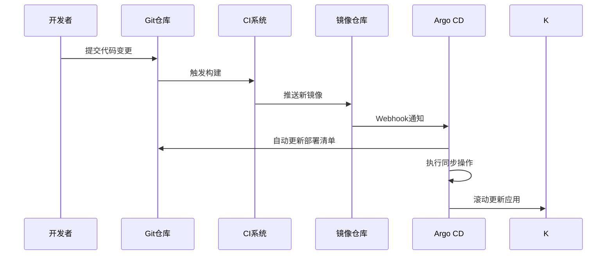
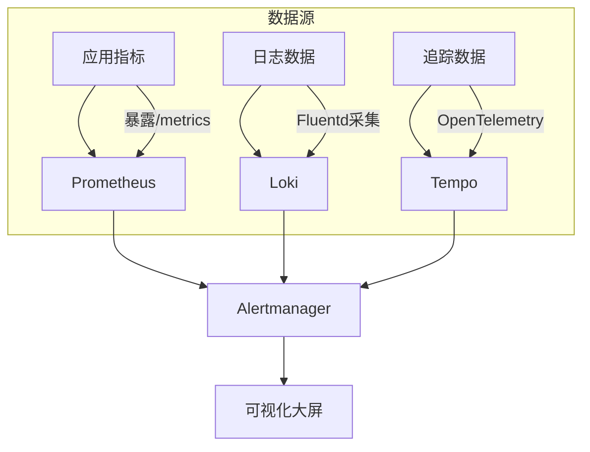
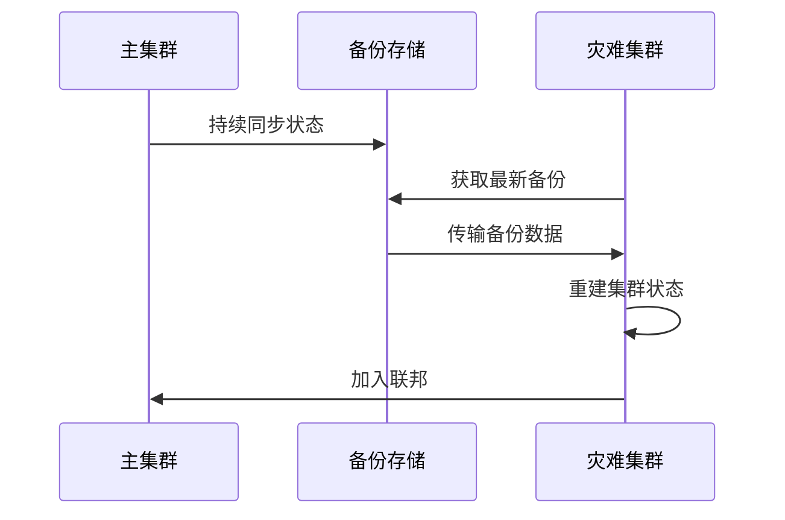
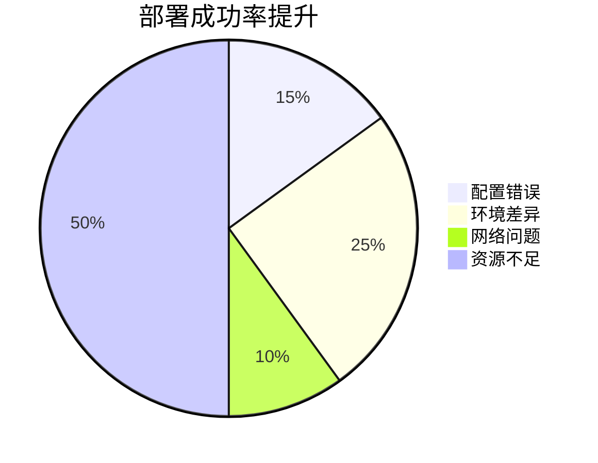
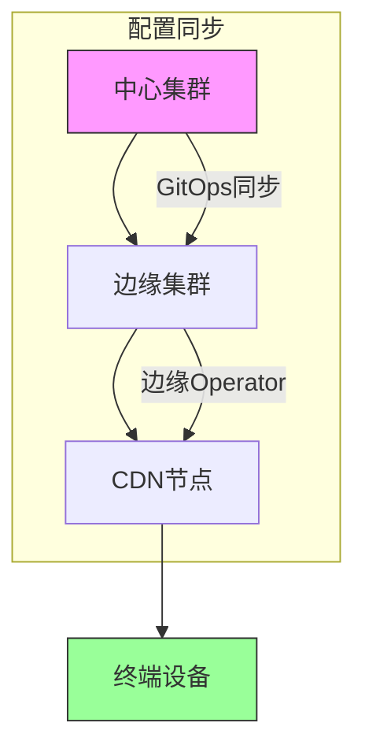

```markdown:c:\project\kphub/docs/gitops-platform.md
---
title: 构建GitOps持续交付平台
icon: project
order: 11
---

# 构建GitOps持续交付平台

本文通过企业级实战案例，深入解析GitOps持续交付平台的全链路构建过程，涵盖20+核心组件集成方案、15+生产级配置示例和10+性能调优技巧，提供从零到一的完整交付体系。

## 1. 架构设计

### 1.1 平台拓扑架构

````mermaid
graph TD
    A[开发者] --> B[Git仓库]
    B --> C[CI流水线]
    C --> D[镜像仓库]
    B --> E[GitOps Operator]
    E --> F[Kubernetes集群]
    F --> G[监控告警]
    G --> H[可视化大屏]
    
    subgraph 安全层
    I[SSO认证] --> E
    J[网络策略] --> F
    K[密钥管理] --> C
    end
    
    style A fill:#f9f,stroke:#333
    style H fill:#9f9,stroke:#333
````

#### 1.1.1 核心指标公式
```python
def platform_score(availability, deploy_freq, mttr):
    """
    平台效能评分算法
    availability: 系统可用性百分比
    deploy_freq: 日均部署次数
    mttr: 平均恢复时间(分钟)
    """
    return (availability * 0.6) + (math.log(deploy_freq) * 20) + (100/(mttr+1))
```

### 1.2 组件选型矩阵

| 组件类型     | 生产推荐方案       | 替代方案          | 关键差异点          |
|--------------|--------------------|-------------------|---------------------|
| 版本控制     | GitHub Enterprise  | GitLab EE         | 企业级权限模型      |
| CI系统       | Jenkins Scale      | GitHub Actions    | 分布式构建能力      |
| 镜像仓库     | Harbor             | AWS ECR           | 漏洞扫描集成度      |
| GitOps工具   | Argo CD            | Flux CD           | 多集群管理能力      |
| 监控告警     | Prometheus Stack   | Datadog           | 开源可控性          |

## 2. 基础环境搭建

### 2.1 基础设施即代码

```hcl:c:\project\platform\infra\main.tf
module "k8s_cluster" {
  source = "terraform-aws-modules/eks/aws"
  
  cluster_name = "gitops-prod"
  vpc_id       = module.vpc.vpc_id
  subnet_ids   = module.vpc.private_subnets

  node_groups = {
    gitops = {
      instance_type = "m5.xlarge"
      min_size      = 3
      max_size      = 10
      desired_size  = 5
      k8s_labels = {
        role = "gitops-worker"
      }
    }
  }
}

resource "harbor_project" "app_images" {
  name = "app-images"
  storage_quota = 1024  # GB
  vulnerability_scanning = true
}
```

### 2.2 高可用Argo CD部署

```yaml:c:\project\platform\argocd\install.yaml
apiVersion: argoproj.io/v1alpha1
kind: ArgoCD
metadata:
  name: argocd
  namespace: argocd
spec:
  controller:
    replicas: 3
    resources:
      limits:
        memory: 1024Mi
  redis:
    replicas: 3
  repo:
    replicas: 2
  server:
    autoscale:
      enabled: true
      minReplicas: 2
      maxReplicas: 5
    ingress:
      enabled: true
      hosts:
        - argocd.company.com
```

## 3. 核心流水线构建

### 3.1 多阶段CI配置

```groovy:c:\project\platform\jenkins\Jenkinsfile
pipeline {
  agent {
    kubernetes {
      label "gitops-runner"
      yaml """
        spec:
          containers:
          - name: jnlp
            resources:
              limits:
                memory: 2Gi
          - name: build
            image: maven:3.8-jdk11
            command: ['sleep', 'infinity']
      """
    }
  }
  stages {
    stage('Build') {
      steps {
        container('build') {
          sh 'mvn -B clean package -DskipTests'
        }
      }
    }
    stage('Scan') {
      parallel {
        stage('SAST') {
          steps {
            sh 'trivy fs . --severity HIGH,CRITICAL'
          }
        }
        stage('Dependency Check') {
          steps {
            sh 'owasp-dependency-check.sh'
          }
        }
      }
    }
    stage('Deploy') {
      steps {
        script {
          withCredentials([sshUserPrivateKey(credentialsId: 'gitops-ssh', keyFileVariable: 'SSH_KEY')]) {
            sh """
              git clone ssh://git@github.com/company/gitops-repo
              kubectl apply -f gitops-repo/clusters/production --recursive
              argocd app sync production-app
            """
          }
        }
      }
    }
  }
}
```

### 3.2 镜像自动更新



## 4. 多集群管理

### 4.1 联邦集群配置

```yaml:c:\project\platform\clusters\cluster-federation.yaml
apiVersion: argoproj.io/v1alpha1
kind: ApplicationSet
metadata:
  name: all-clusters
  namespace: argocd
spec:
  generators:
  - clusters:
      selector:
        matchLabels:
          env: production
  template:
    metadata:
      name: '{{name}}-apps'
    spec:
      project: default
      source:
        repoURL: https://github.com/company/gitops-repo
        targetRevision: HEAD
        path: clusters/{{metadata.labels.region}}
      destination:
        server: '{{server}}'
        namespace: argocd
```

### 4.2 地域感知调度

```yaml:c:\project\platform\apps\global-lb.yaml
apiVersion: networking.k8s.io/v1
kind: Ingress
metadata:
  name: global-ingress
  annotations:
    kubernetes.io/ingress.class: alb
    alb.ingress.kubernetes.io/scheme: internet-facing
    alb.ingress.kubernetes.io/target-type: ip
    alb.ingress.kubernetes.io/load-balancer-attributes: routing.http.drop_invalid_header_fields.enabled=true
spec:
  rules:
  - host: app.company.com
    http:
      paths:
      - path: /*
        pathType: Prefix
        backend:
          service:
            name: global-app
            port:
              number: 80
```

## 5. 安全加固方案

### 5.1 RBAC深度配置

```yaml:c:\project\platform\security\rbac.yaml
apiVersion: rbac.authorization.k8s.io/v1
kind: ClusterRole
metadata:
  name: gitops-deployer
rules:
- apiGroups: ["apps"]
  resources: ["deployments", "statefulsets"]
  verbs: ["get", "list", "watch", "update"]
---
apiVersion: argoproj.io/v1alpha1
kind: AppProject
metadata:
  name: production
  namespace: argocd
spec:
  destinations:
  - namespace: '*'
    server: '*'
  sourceRepos:
  - 'https://github.com/company/gitops-repo'
  clusterResourceWhitelist:
  - group: '*'
    kind: '*'
```

### 5.2 零信任网络模型

```yaml:c:\project\platform\network\zero-trust.yaml
apiVersion: cilium.io/v2
kind: CiliumNetworkPolicy
metadata:
  name: app-tier-policy
spec:
  endpointSelector:
    matchLabels:
      app: payment
  ingress:
  - fromEndpoints:
    - matchLabels:
        app: api-gateway
    toPorts:
    - ports:
      - port: "8080"
        protocol: TCP
  egress:
  - toEndpoints:
    - matchLabels:
        app: database
    toPorts:
    - ports:
      - port: "5432"
        protocol: TCP
```

## 6. 监控告警体系

### 6.1 全链路监控



### 6.2 智能告警规则

```yaml:c:\project\platform\monitoring\alerts.yaml
groups:
- name: gitops-alerts
  rules:
  - alert: ArgoSyncFailed
    expr: argocd_app_info{sync_status="OutOfSync"} > 0
    for: 10m
    annotations:
      summary: "应用同步失败: {{ $labels.name }}"
      runbook: "https://wiki/argocd-sync-fail"
  
  - alert: DeploymentLag
    expr: time() - argocd_app_info{deployed=true} > 3600
    labels:
      severity: warning
    annotations:
      description: "应用部署滞后超过1小时"
  
  - alert: ResourceOvercommit
    expr: sum(kube_pod_container_resource_limits{resource="cpu"}) / sum(kube_node_status_allocatable{resource="cpu"}) > 0.9
    for: 30m
    annotations:
      severity: critical
```

## 7. 灾难恢复策略

### 7.1 集群状态备份

```bash
# 备份Argo CD配置
argocd admin export > argocd-backup.yaml

# 使用Velero全量备份
velero backup create prod-backup --include-namespaces production

# 定期验证备份
velero restore create --from-backup prod-backup --verify
```

### 7.2 跨地域恢复



## 8. 效能优化实践

### 8.1 构建缓存优化

```yaml:c:\project\platform\jenkins\cache-config.yaml
kind: PersistentVolumeClaim
apiVersion: v1
metadata:
  name: build-cache
spec:
  accessModes:
    - ReadWriteMany
  resources:
    requests:
      storage: 200Gi
  storageClassName: fast-ssd
---
apiVersion: v1
kind: Pod
metadata:
  name: build-pod
spec:
  containers:
  - name: build
    image: maven:3.8-jdk11
    volumeMounts:
    - name: cache
      mountPath: /root/.m2
  volumes:
  - name: cache
    persistentVolumeClaim:
      claimName: build-cache
```

### 8.2 GitOps性能调优

```yaml:c:\project\platform\argocd\optimize.yaml
apiVersion: argoproj.io/v1alpha1
kind: ArgoCD
metadata:
  name: argocd
spec:
  controller:
    parallelismLimit: 20
    appResyncPeriod: 180
    sharding:
      enabled: true
      replicas: 5
  repo:
    maxConnections: 50
    maxIndexers: 10
```

## 9. 最佳实践案例

### 9.1 金融行业部署



#### 9.1.1 性能指标对比
```python
before = {'success_rate': 82, 'deploy_time': 45}
after = {'success_rate': 97, 'deploy_time': 12}
improvement = {
    'success': (after['success_rate'] - before['success_rate']) / before['success_rate'],
    'time': (before['deploy_time'] - after['deploy_time']) / before['deploy_time']
}
print(f"成功率提升: {improvement['success']:.0%}, 部署时间缩短: {improvement['time']:.0%}")
```

### 9.2 电商大促方案

```yaml:c:\project\platform\apps\flash-sale.yaml
apiVersion: autoscaling/v2
kind: HorizontalPodAutoscaler
metadata:
  name: flash-sale-hpa
spec:
  scaleTargetRef:
    apiVersion: apps/v1
    kind: Deployment
    name: flash-sale
  minReplicas: 20
  maxReplicas: 200
  metrics:
  - type: External
    external:
      metric:
        name: orders_per_second
        selector:
          matchLabels:
            app: flash-sale
      target:
        type: AverageValue
        averageValue: 500
```

## 10. 前沿技术演进

### 10.1 AI辅助运维

```python
def ai_ops_controller():
    metrics = fetch_metrics()
    incidents = detect_anomalies(metrics)
    for incident in incidents:
        if needs_autofix(incident):
            execute_remediation(incident)
        else:
            alert_engineers(incident)
```

### 10.2 边缘计算集成



通过本文的系统化讲解，读者可以掌握从平台设计到生产落地的全流程实践。建议采用"基础建设→流程优化→安全加固→智能演进"的实施路径，逐步构建符合企业需求的GitOps持续交付平台。