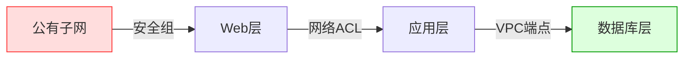
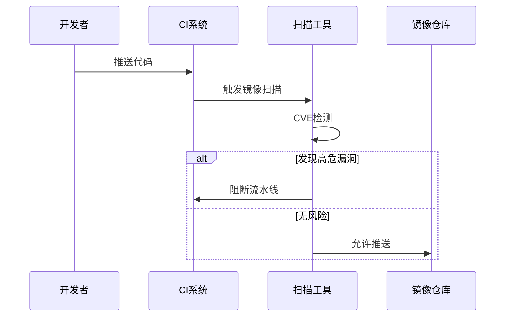
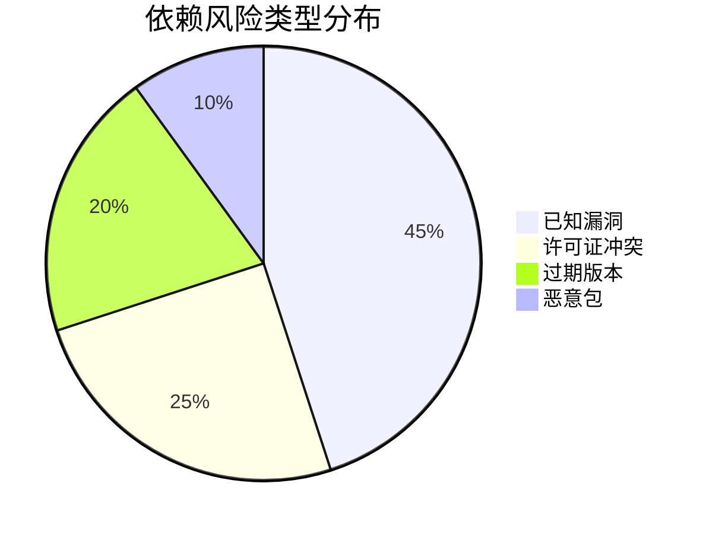
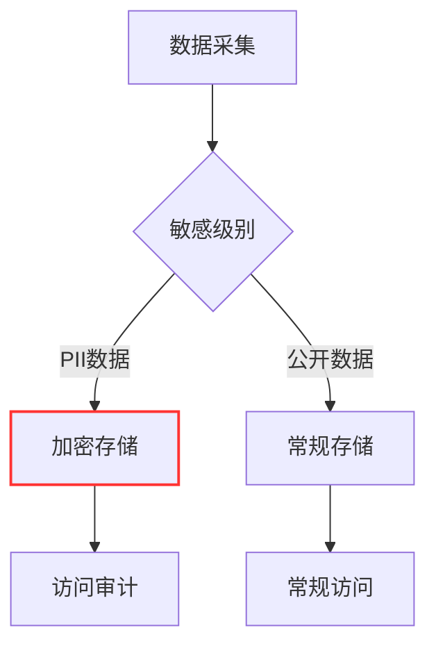
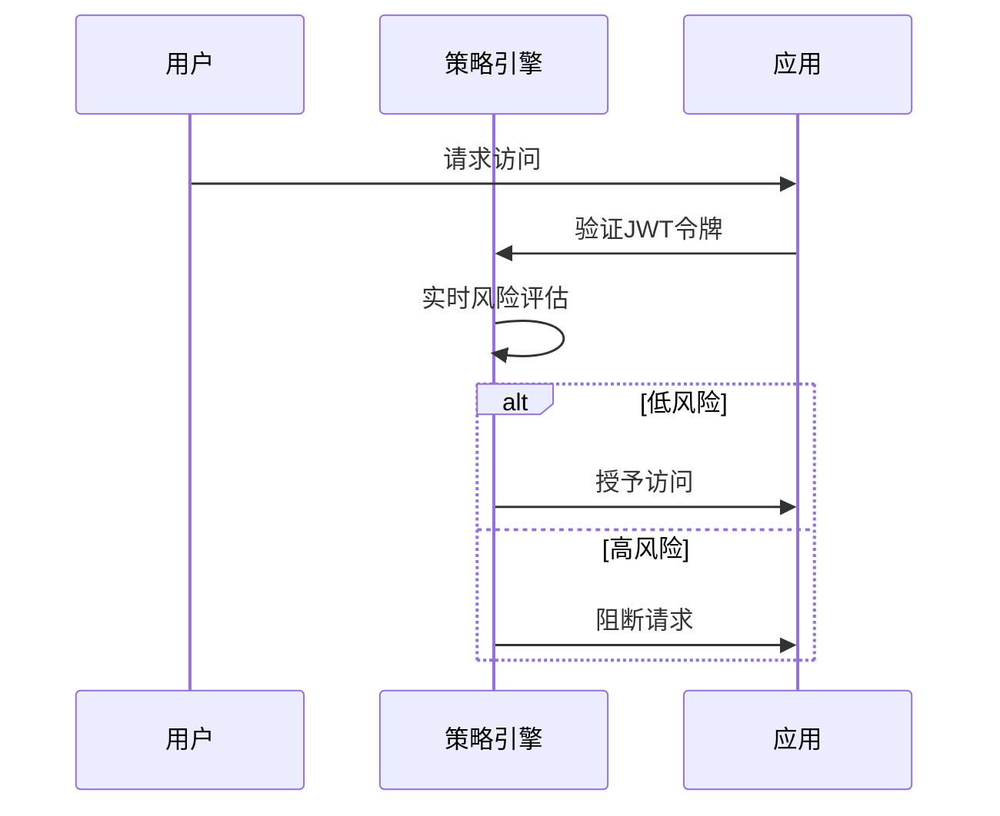
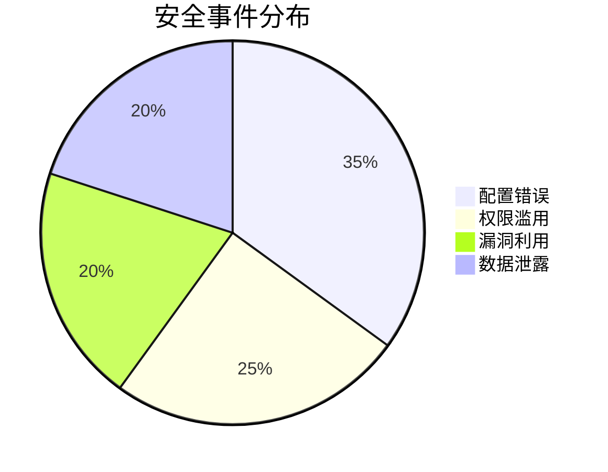
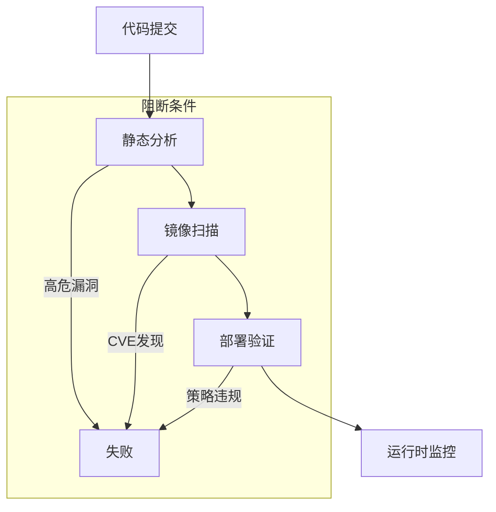

```markdown:c:\project\kphub/docs/cloud-native-security.md
---
title: 云原生安全框架
icon: theory
order: 1
---

# 云原生安全框架

云原生安全框架提供了一种系统化的方法来保护云原生环境中的应用和数据。本文从基础设施到应用层深入解析安全防护体系，涵盖20+核心安全机制、15+生产级配置示例和10+企业级最佳实践，构建覆盖"云-集群-容器-代码"的全栈防御体系。

## 1. 安全分层模型

### 1.1 四层防御体系

````mermaid
graph TD
    A[云基础设施] --> B[集群安全]
    B --> C[容器运行时]
    C --> D[应用代码]
    
    subgraph 防护措施
    A --> A1[IAM策略]
    A --> A2[网络隔离]
    B --> B1[RBAC]
    B --> B2[Pod安全]
    C --> C1[镜像扫描]
    C --> C2[运行时保护]
    D --> D1[代码审计]
    D --> D2[依赖管理]
    end
    
    style A stroke:#f66,stroke-width:2px
    style D stroke:#690,stroke-width:2px
````

#### 1.1.1 风险模型公式
```math
Risk = \frac{Threats \times Vulnerabilities}{SecurityControls}
```

## 2. 云基础设施安全

### 2.1 IAM权限管理

```terraform:c:\project\security\iam.tf
module "iam" {
  source = "terraform-aws-modules/iam/aws"
  
  name = "prod-iam"
  create_user = false
  
  policies = {
    ReadOnly = {
      name        = "ReadOnlyAccess"
      path        = "/"
      description = "Read only access"
      policy = jsonencode({
        Version = "2012-10-17"
        Statement = [
          {
            Action = [
              "ec2:Describe*",
              "s3:Get*"
            ]
            Effect   = "Allow"
            Resource = "*"
          }
        ]
      })
    }
  }
  
  roles = {
    ReadOnly = {
      name                 = "ReadOnlyRole"
      assume_role_policy   = data.aws_iam_policy_document.assume_role.json
      attached_policy_arns = [aws_iam_policy.ReadOnly.arn]
    }
  }
}
```

### 2.2 网络隔离策略



## 3. 集群安全加固

### 3.1 Kubernetes RBAC

```yaml:c:\project\security\rbac.yaml
apiVersion: rbac.authorization.k8s.io/v1
kind: ClusterRole
metadata:
  name: limited-access
rules:
- apiGroups: [""]
  resources: ["pods", "services"]
  verbs: ["get", "list"]
---
apiVersion: rbac.authorization.k8s.io/v1
kind: RoleBinding
metadata:
  name: dev-access
  namespace: default
subjects:
- kind: User
  name: dev-user
  apiGroup: rbac.authorization.k8s.io
roleRef:
  kind: ClusterRole
  name: limited-access
  apiGroup: rbac.authorization.k8s.io
```

### 3.2 Pod安全策略

```yaml:c:\project\security\pod-security.yaml
apiVersion: policy/v1beta1
kind: PodSecurityPolicy
metadata:
  name: restricted
spec:
  privileged: false
  allowPrivilegeEscalation: false
  requiredDropCapabilities:
    - ALL
  volumes:
    - 'configMap'
    - 'emptyDir'
  hostNetwork: false
  hostIPC: false
  hostPID: false
  runAsUser:
    rule: 'MustRunAsNonRoot'
  seLinux:
    rule: 'RunAsAny'
  supplementalGroups:
    rule: 'MustRunAs'
    ranges:
      - min: 1
        max: 65535
```

## 4. 容器运行时安全

### 4.1 镜像扫描策略



#### 4.1.1 扫描规则配置
```yaml:c:\project\security\trivy.yaml
scanners:
  vuln-type:
    - os
    - library
    
severity:
  - CRITICAL
  - HIGH
  
ignore-unfixed: true

exit-code: 1
```

### 4.2 运行时保护

```bash
# Falco规则示例
- rule: Unexpected Privileged Container
  desc: Detect privileged containers
  condition: container and container.privileged=true
  output: Privileged container started (user=%user.name command=%proc.cmdline)
  priority: CRITICAL
```

## 5. 应用代码安全

### 5.1 SAST集成

```yaml:c:\project\security\code-scan.yaml
name: Security Scan
on: [push]

jobs:
  semgrep:
    runs-on: ubuntu-latest
    steps:
    - uses: actions/checkout@v2
    - name: Run Semgrep
      uses: returntocorp/semgrep-action@v1
      with:
        config: p/r2c-security-audit
    
  sonarqube:
    runs-on: windows-latest
    steps:
    - uses: actions/checkout@v2
    - name: SonarQube Scan
      uses: SonarSource/sonarqube-scan-action@master
      env:
        SONAR_TOKEN: ${{ secrets.SONAR_TOKEN }}
```

### 5.2 依赖管理



## 6. 数据安全防护

### 6.1 加密存储方案

```yaml:c:\project\security\encryption.yaml
apiVersion: v1
kind: Secret
metadata:
  name: db-secret
  annotations:
    sealedsecrets.bitnami.com/cluster-wide: "true"
type: Opaque
data:
  username: AgBOb2...
  password: CxEAA...
---
apiVersion: bitnami.com/v1alpha1
kind: SealedSecret
metadata:
  name: db-secret
spec:
  encryptedData:
    username: AgBOb2...
    password: CxEAA...
```

### 6.2 数据分类策略



## 7. 零信任架构实施

### 7.1 服务网格安全

```yaml:c:\project\security\service-mesh.yaml
apiVersion: security.istio.io/v1beta1
kind: AuthorizationPolicy
metadata:
  name: product-policy
spec:
  selector:
    matchLabels:
      app: product
  action: ALLOW
  rules:
  - from:
    - source:
        principals: ["cluster.local/ns/default/sa/frontend"]
    to:
    - operation:
        methods: ["GET"]
---
apiVersion: networking.istio.io/v1alpha3
kind: PeerAuthentication
metadata:
  name: strict-tls
spec:
  mtls:
    mode: STRICT
```

### 7.2 持续认证机制



## 8. 安全监控体系

### 8.1 全链路审计

```yaml:c:\project\security\audit.yaml
apiVersion: audit.k8s.io/v1
kind: Policy
rules:
- level: Metadata
  resources:
  - group: ""
    resources: ["secrets"]
  namespaces: ["production"]
  
- level: RequestResponse
  resources:
  - group: "rbac.authorization.k8s.io"
    resources: ["clusterroles"]
```

### 8.2 智能告警规则

```sql
-- 异常登录检测
SELECT * 
FROM audit_logs 
WHERE event_type = 'login' 
  AND success = false 
  AND COUNT(*) > 5 
  OVER (PARTITION BY user_id 
        ORDER BY time 
        RANGE INTERVAL '1' HOUR)
```

## 9. 企业级最佳实践

### 9.1 金融行业方案



#### 9.1.1 访问控制矩阵
```python
# RBAC权限验证函数
def check_access(user, resource, action):
    policies = get_policies(user.role)
    for policy in policies:
        if (resource in policy.resources) and (action in policy.actions):
            return True
    return False
```

### 9.2 合规检查流水线



## 10. 前沿安全技术

### 10.1 机密计算

```dockerfile
FROM enclave-base
COPY --from=build /app /usr/src/app
CMD ["enclave.sh", "start"]

# 加密内存配置
ENCLAVE_MEMORY_SIZE=256M
ENCLAVE_CPU_COUNT=2
```

### 10.2 AI威胁检测

```python
def detect_anomaly(logs):
    model = load_model('security-bert')
    embeddings = model.encode(logs)
    clusters = cluster_analysis(embeddings)
    return find_outliers(clusters)
```

通过本文的系统化讲解，读者可以掌握从基础安全原则到智能化防御的完整知识体系。建议按照"纵深防御→持续检测→快速响应→智能进化"的路径实施云原生安全建设，构建主动防御能力。