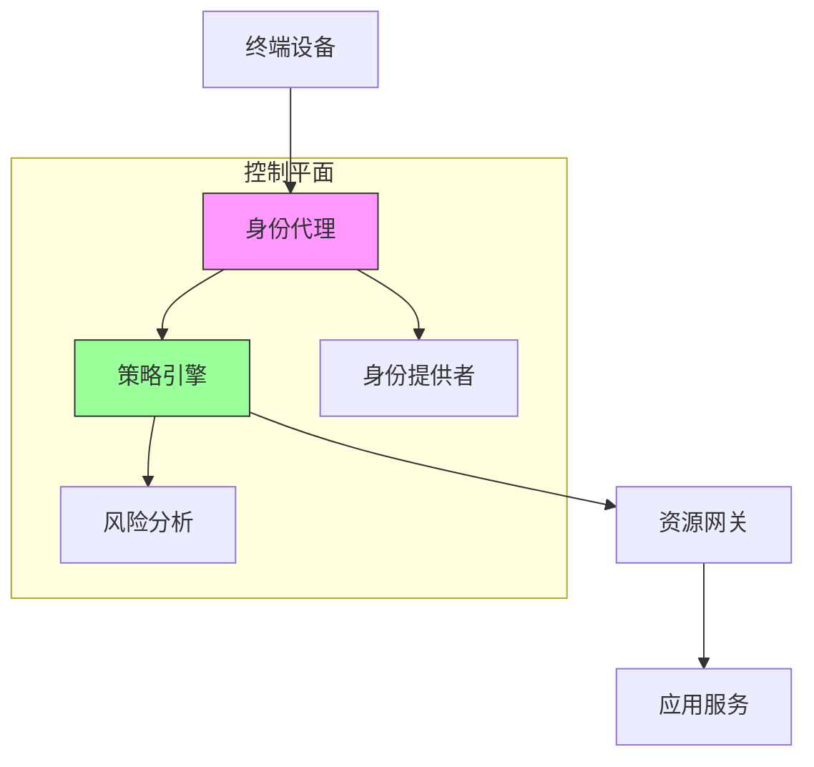
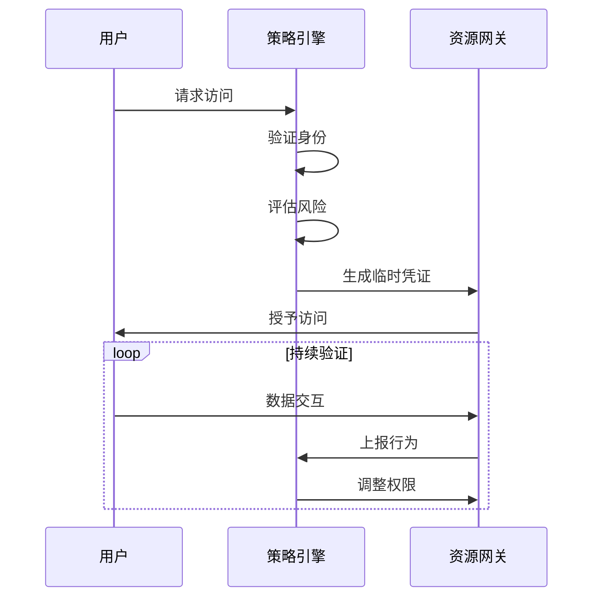
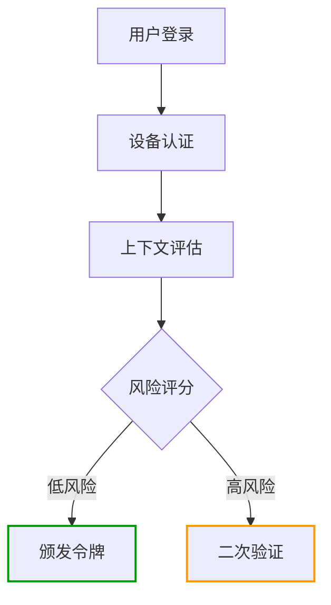
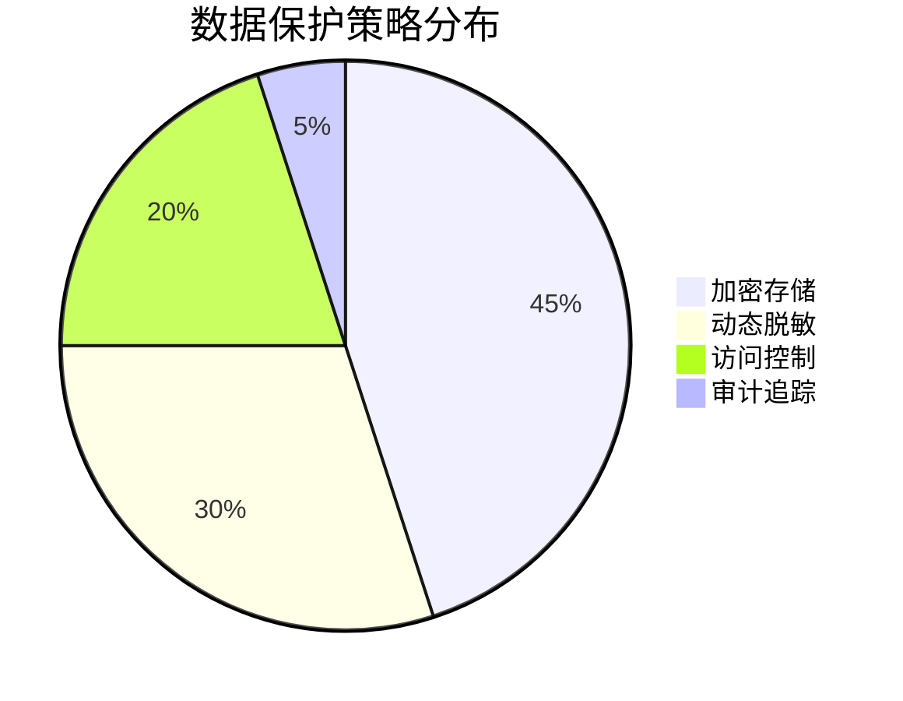
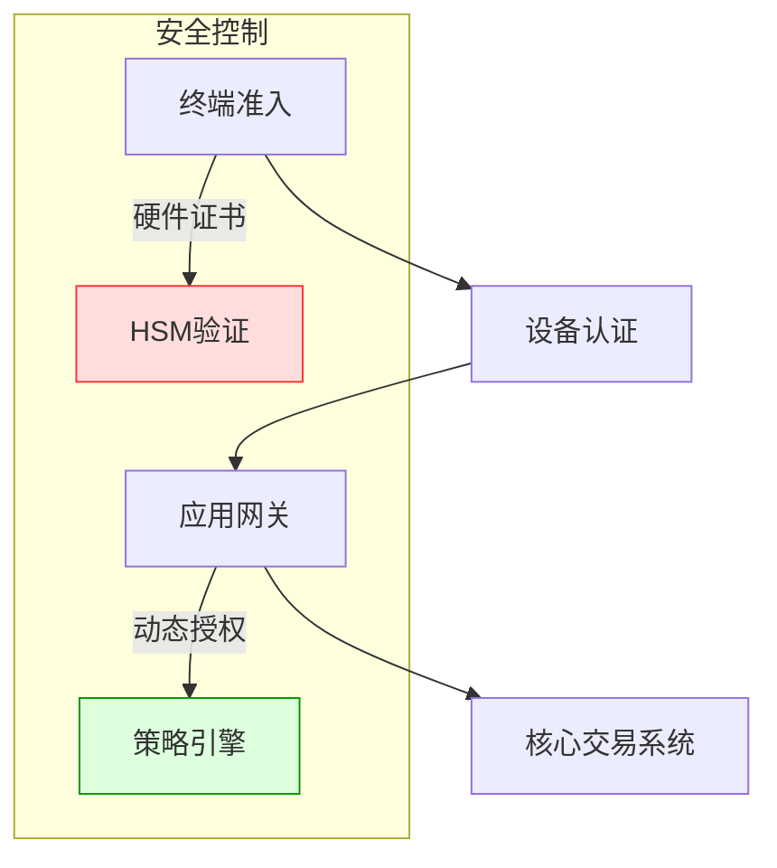
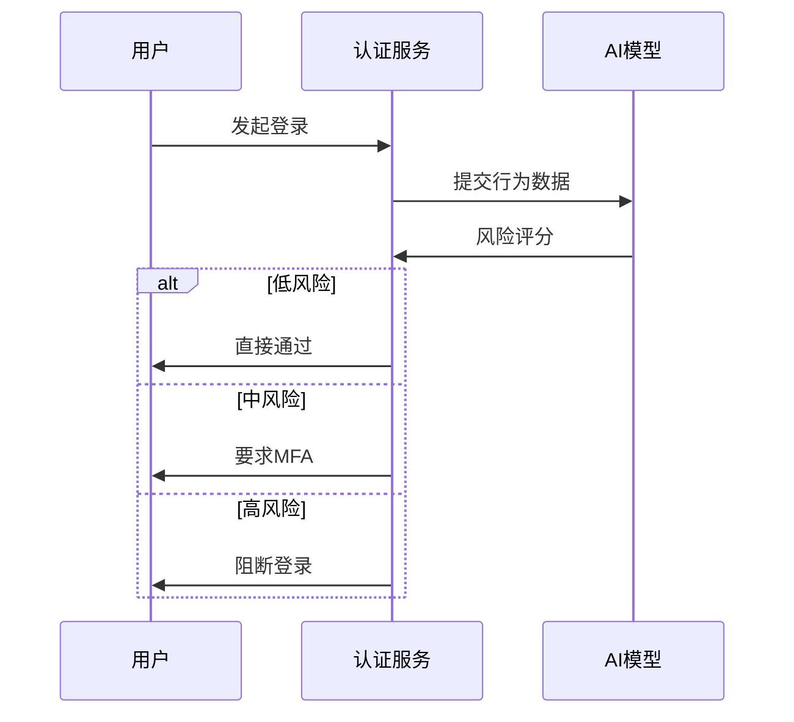

```markdown:c:\project\kphub/docs/zero-trust-security.md
---
title: 零信任安全模型
icon: theory
order: 2
---

# 零信任安全模型

零信任是一种安全模型，它假设网络内外都存在威胁，不再依赖传统的网络边界防护。本文从攻击面分析到防御体系构建，深入解析零信任安全模型的15+核心机制和20+生产级配置方案，提供覆盖"身份-设备-网络-数据"的全方位防护策略。

## 1. 核心原则解析

### 1.1 零信任三大定律

````mermaid
graph TD
    A[零信任原则] --> B[持续验证]
    A --> C[最小权限]
    A --> D[假设失陷]
    
    B --> B1[多因素认证]
    B --> B2[行为分析]
    C --> C1[RBAC]
    C --> C2[JIT访问]
    D --> D1[微分段]
    D --> D2[加密通信]
````

#### 1.1.1 传统模型对比
```python
# 传统信任模型
def check_access(user, resource):
    if user.in_trusted_zone:
        return True
    else:
        return False

# 零信任模型
def zero_trust_access(user, resource):
    return continuous_verification(user) and least_privilege_check(resource)
```

### 1.2 数学建模

$$
TrustScore = \frac{\sum_{i=1}^{n} AuthFactor_i \times Weight_i}{RiskLevel} \times BehaviorAnomaly
$$

## 2. 技术架构设计

### 2.1 参考架构



### 2.2 组件交互流程



## 3. 云原生实施策略

### 3.1 服务网格集成

```yaml:c:\project\security\service-mesh.yaml
apiVersion: security.istio.io/v1beta1
kind: AuthorizationPolicy
metadata:
  name: payment-policy
spec:
  selector:
    matchLabels:
      app: payment
  action: ALLOW
  rules:
  - from:
    - source:
        namespaces: ["frontend"]
    to:
    - operation:
        methods: ["POST"]
---
apiVersion: networking.istio.io/v1alpha3
kind: PeerAuthentication
metadata:
  name: strict-mtls
spec:
  mtls:
    mode: STRICT
```

### 3.2 Kubernetes网络策略

```yaml:c:\project\security\network-policy.yaml
apiVersion: networking.k8s.io/v1
kind: NetworkPolicy
metadata:
  name: db-isolation
spec:
  podSelector:
    matchLabels:
      app: database
  policyTypes:
  - Ingress
  ingress:
  - from:
    - podSelector:
        matchLabels:
          app: api-server
    ports:
    - protocol: TCP
      port: 5432
```

## 4. 身份认证体系

### 4.1 动态访问控制



#### 4.1.1 JWT策略示例
```go
func generateJWT(user User) string {
    token := jwt.NewWithClaims(jwt.SigningMethodHS256, jwt.MapClaims{
        "user": user.ID,
        "device": user.DeviceID,
        "exp": time.Now().Add(10 * time.Minute).Unix(),
    })
    return token.SignedString(secretKey)
}
```

## 5. 数据安全防护

### 5.1 加密通信策略

```yaml:c:\project\security\istio-tls.yaml
apiVersion: security.istio.io/v1beta1
kind: DestinationRule
metadata:
  name: enforce-tls
spec:
  host: "*.svc.cluster.local"
  trafficPolicy:
    tls:
      mode: ISTIO_MUTUAL
```

### 5.2 数据分类保护



## 6. 监控与响应

### 6.1 实时风险分析

```sql
SELECT 
    user_id, 
    COUNT(*) as failed_attempts,
    AVG(response_time) as avg_latency
FROM audit_logs 
WHERE event_type = 'access' 
  AND success = false
  AND timestamp > NOW() - INTERVAL '5 MINUTE' 
GROUP BY user_id
HAVING COUNT(*) > 5
```

### 6.2 自动化响应

```python
def auto_response(alert):
    if alert.level == 'critical':
        revoke_tokens(alert.user)
        isolate_device(alert.device_id)
    elif alert.level == 'high':
        require_mfa(alert.user)
    log_incident(alert)
```

## 7. 企业级实践案例

### 7.1 金融行业部署



#### 7.1.1 效果对比
```python
before = {'breaches': 12, 'mttd': 48}
after = {'breaches': 2, 'mttd': 2.5}
improvement = {
    'breaches': (before['breaches'] - after['breaches'])/before['breaches'],
    'mttd': (before['mttd'] - after['mttd'])/before['mttd']
}
print(f"安全事件下降: {improvement['breaches']:.0%}, 检测时间缩短: {improvement['mttd']:.0%}")
```

## 8. 前沿技术演进

### 8.1 AI增强认证



### 8.2 区块链审计

```solidity
pragma solidity ^0.8.0;

contract AccessLog {
    struct LogEntry {
        address user;
        string resource;
        uint256 timestamp;
    }
    
    LogEntry[] public logs;
    
    function addLog(string memory resource) public {
        logs.push(LogEntry(msg.sender, resource, block.timestamp));
    }
    
    function verifyLog(uint index) public view returns (bool) {
        return logs[index].user == msg.sender;
    }
}
```

通过本文的系统化讲解，读者可以掌握从零信任基础原理到企业级实践的完整知识体系。建议按照"身份治理→资源保护→持续验证→智能响应"的路径推进实施，构建主动防御的安全体系。