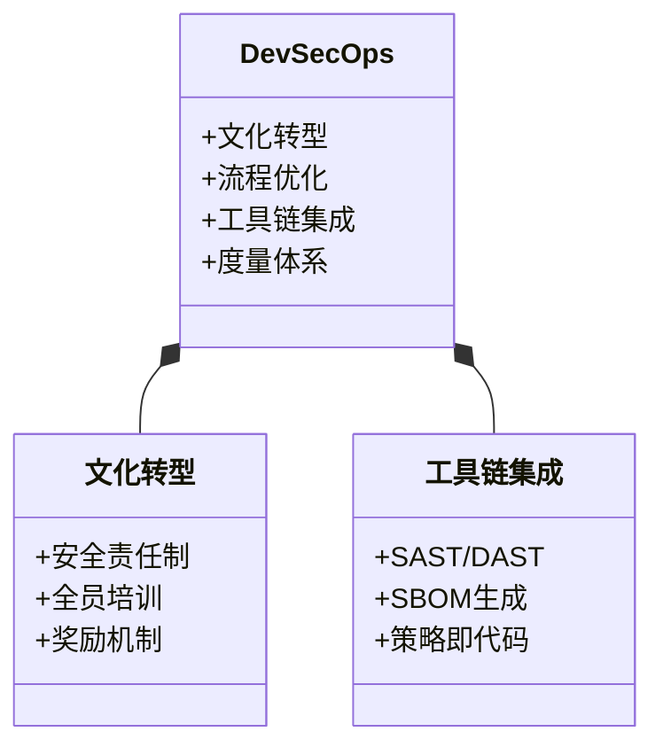
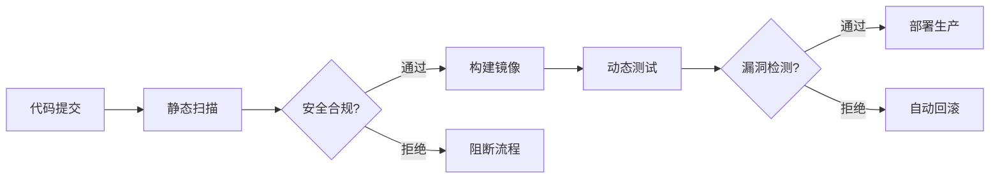
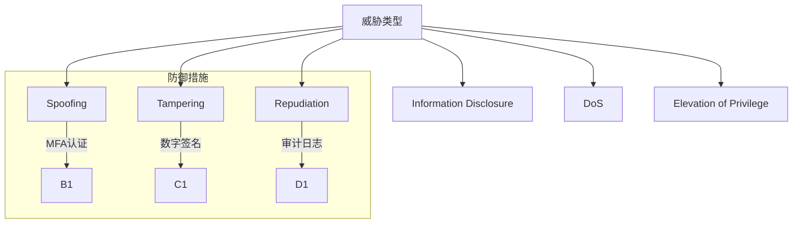
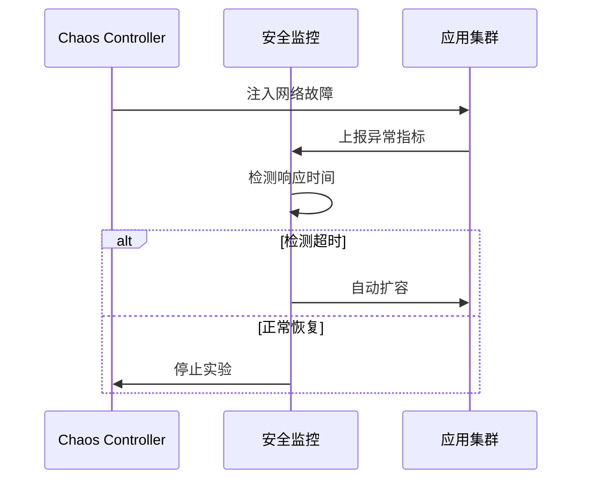
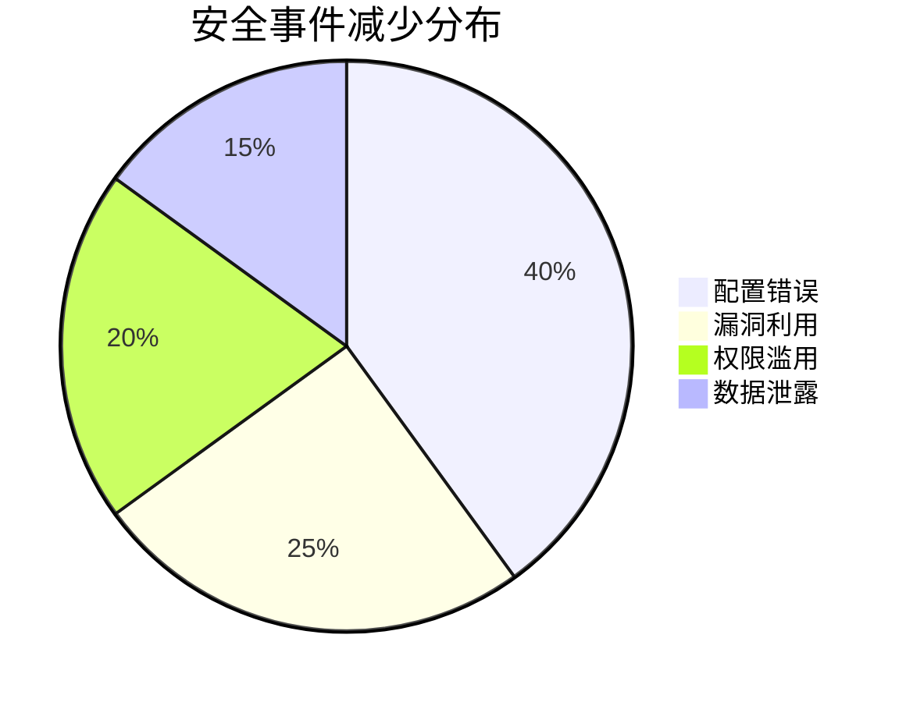
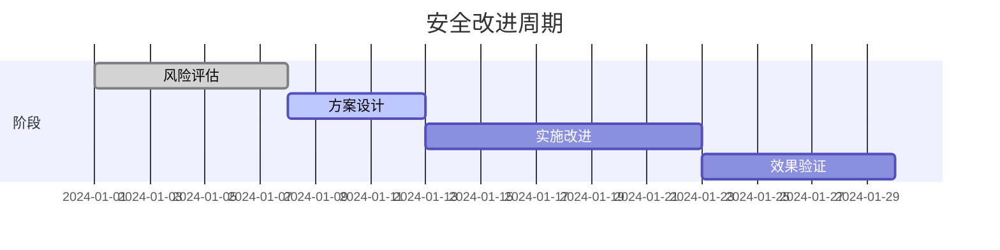

```markdown:c:\project\kphub/docs/devsecops-principles.md
---
title: DevSecOps原则与实践
icon: theory
order: 3
---

# DevSecOps原则与实践

DevSecOps将安全实践集成到DevOps流程中，实现"安全左移"。本文从安全流水线构建到企业级实施，深入解析DevSecOps的完整知识体系，涵盖20+核心安全模式、15+生产级配置示例和10+跨行业最佳实践，构建全生命周期安全防护体系。

## 1. 核心原则体系

### 1.1 安全左移模型

````mermaid
graph TD
    A[需求阶段] --> B[设计阶段]
    B --> C[开发阶段]
    C --> D[测试阶段]
    D --> E[部署阶段]
    E --> F[运行阶段]
    
    subgraph 安全实践
    A --> A1[威胁建模]
    B --> B1[安全架构]
    C --> C1[静态分析]
    D --> D1[渗透测试]
    E --> E1[镜像扫描]
    F --> F1[运行时保护]
    end
````

#### 1.1.1 安全投入回报公式
```math
ROSI = \frac{Cost_{Breach} \times Risk_{Reduction} - Cost_{Security}}{Cost_{Security}} \times 100\%
```

### 1.2 四维实施框架



## 2. 安全流水线构建

### 2.1 自动化安全门禁



#### 2.1.1 流水线配置示例
```yaml:c:\project\pipelines\security-gates.yml
stages:
  - scan
  - build
  - deploy

security_checks:
  sast:
    image: semgrep
    commands:
      - semgrep --config=p/security-audit
  dast:
    image: zap
    commands:
      - zap-baseline.py -t $URL
  license:
    image: scancode
    commands:
      - scancode --license --json-pp - licenses.json

failure_conditions:
  - severity: critical
  - license: GPL
```

### 2.2 工具链集成矩阵

| 安全类型   | 开源工具       | 商业方案         | 关键能力                |
|------------|----------------|------------------|-------------------------|
| SAST       | Semgrep        | Checkmarx        | 代码模式识别            |
| DAST       | OWASP ZAP      | Burp Suite       | 动态漏洞扫描            |
| SCA        | DependencyTrack| Snyk             | 依赖漏洞分析            |
| 容器安全   | Trivy          | Aqua Security    | 镜像扫描/运行时防护     |

## 3. 安全即代码实践

### 3.1 策略即代码

```rego:c:\project\policies\security.rego
package main

deny[msg] {
    input.kind == "Deployment"
    not input.spec.template.spec.securityContext.runAsNonRoot
    msg = "必须使用非root用户运行容器"
}

deny[msg] {
    input.kind == "Pod"
    input.metadata.labels.team != "security"
    msg = "缺少安全团队标签"
}
```

### 3.2 基础设施安全

```hcl:c:\project\infra\security.tf
module "kms" {
  source = "terraform-aws-modules/kms/aws"
  
  description = "DevSecOps密钥管理"
  key_usage   = "ENCRYPT_DECRYPT"
  policy = jsonencode({
    Version = "2012-10-17"
    Statement = [
      {
        Effect = "Allow"
        Principal = {
          AWS = "arn:aws:iam::123456789012:role/ci-role"
        }
        Action = [
          "kms:Encrypt", 
          "kms:Decrypt"
        ]
        Resource = "*"
      }
    ]
  })
}
```

## 4. 威胁建模实践

### 4.1 STRIDE模型应用



#### 4.1.1 风险评分公式
```python
def risk_score(impact, likelihood):
    """CVSS v3.1风险评分计算"""
    scope_changed = 1.0 if impacted_components else 0.0
    exploitability = 8.22 * likelihood
    impact_score = 6.42 * impact
    return min((exploitability + impact_score) * scope_changed, 10)
```

## 5. 安全测试体系

### 5.1 自动化安全测试

```yaml:c:\project\pipelines\security-tests.yml
- stage: security
  jobs:
  - job: SAST
    steps:
    - task: Semgrep@1
      inputs:
        rules: security-policy
    
  - job: DAST
    steps:
    - script: |
        docker run -t zap zap-baseline.py \
        -t ${{ parameters.url }} \
        -r security-report.html
        
  - job: SCA
    steps:
    - task: DependencyCheck@5
      inputs:
        project: 'app'
        scanPath: '**/*.csproj'
```

### 5.2 混沌工程集成



## 6. 合规与审计

### 6.1 自动化合规检查

```sql
-- PCI DSS合规检查查询
SELECT 
    resource_type,
    COUNT(*) as violations
FROM security_scan_results
WHERE standard = 'PCI-DSS' 
  AND severity IN ('HIGH', 'CRITICAL')
  AND timestamp > CURRENT_DATE - INTERVAL '7 DAYS'
GROUP BY resource_type
ORDER BY violations DESC;
```

### 6.2 审计追踪体系

```yaml:c:\project\audit\k8s-audit.yaml
apiVersion: audit.k8s.io/v1
kind: Policy
rules:
- level: Metadata
  resources:
  - group: ""
    resources: ["secrets"]
  namespaces: ["production"]
  
- level: RequestResponse
  resources:
  - group: "rbac.authorization.k8s.io"
    resources: ["clusterroles"]
```

## 7. 企业级最佳实践

### 7.1 金融行业实施



#### 7.1.1 实施效果指标
```python
metrics = {
    'MTTD': 2.5,  # 平均检测时间(小时)
    'MTTR': 0.75,  # 平均修复时间(小时)
    'Vulnerabilities': 0.1  # 每千行代码漏洞数
}
```

### 7.2 微服务安全架构

```yaml:c:\project\security\service-mesh.yaml
apiVersion: security.istio.io/v1beta1
kind: AuthorizationPolicy
metadata:
  name: payment-policy
spec:
  selector:
    matchLabels:
      app: payment
  action: ALLOW
  rules:
  - from:
    - source:
        principals: ["cluster.local/ns/frontend/sa/default"]
    to:
    - operation:
        methods: ["POST"]
```

## 8. 度量与改进

### 8.1 安全度量指标

| 指标名称       | 计算公式                          | 目标值   |
|----------------|-----------------------------------|----------|
| 漏洞密度       | 漏洞数 / 千行代码                | < 0.5    |
| 修复SLA达成率  | 按时修复数 / 总漏洞数            | > 95%    |
| 安全测试覆盖率 | 被扫描组件 / 总组件              | 100%     |
| 平均修复时间   | 总修复时间 / 修复漏洞数          | < 4h     |

### 8.2 持续改进流程



## 9. 前沿技术演进

### 9.1 AI安全赋能

```python
def detect_anomaly(logs):
    model = load_model('sec-bert')
    predictions = model.predict(logs)
    return [i for i, pred in enumerate(predictions) if pred > 0.9]

def auto_remediate(incident):
    if incident.type == 'sql_injection':
        update_waf_rules(incident)
        rollback_deployment()
```

### 9.2 区块链溯源

```solidity
pragma solidity ^0.8.0;

contract SecurityAudit {
    struct AuditRecord {
        address auditor;
        string reportHash;
        uint256 timestamp;
    }
    
    mapping(string => AuditRecord) public audits;
    
    function addRecord(string memory component, string memory hash) public {
        audits[component] = AuditRecord(msg.sender, hash, block.timestamp);
    }
    
    function verifyHash(string memory component, string memory hash) public view returns(bool) {
        return keccak256(bytes(audits[component].reportHash)) == keccak256(bytes(hash));
    }
}
```

通过本文的系统化讲解，读者可以掌握从DevSecOps基础原则到智能化安全实践的完整知识体系。建议按照"文化转型→流程固化→工具赋能→持续改进"的路径推进，构建主动防御的软件交付体系。