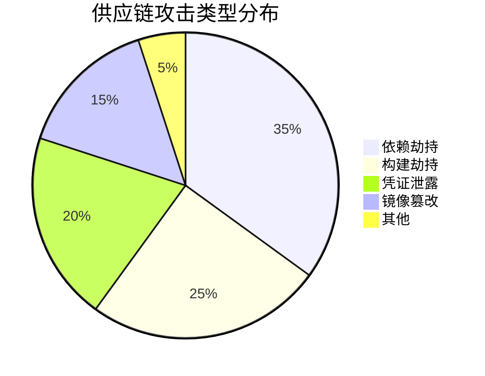
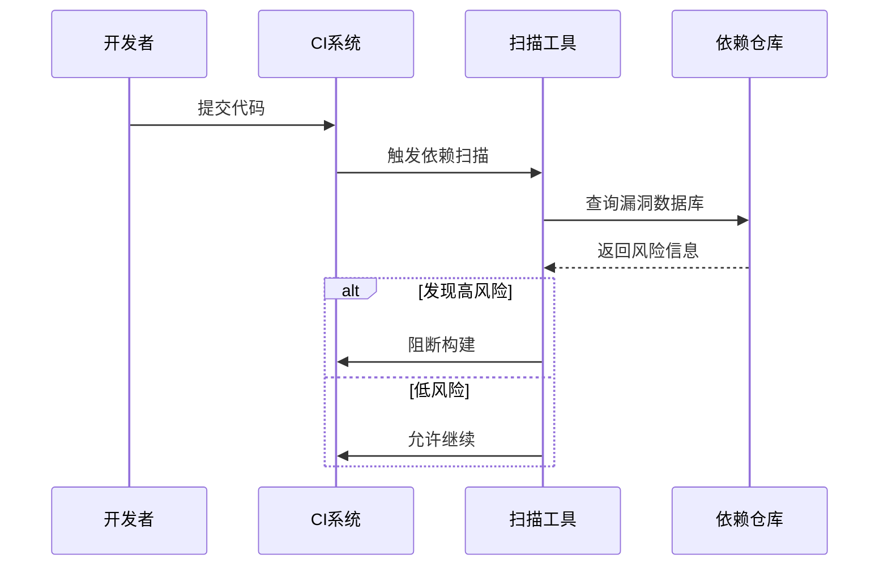
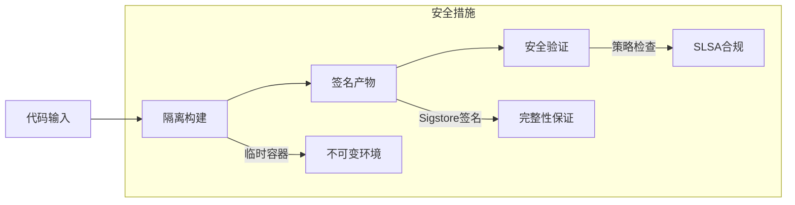
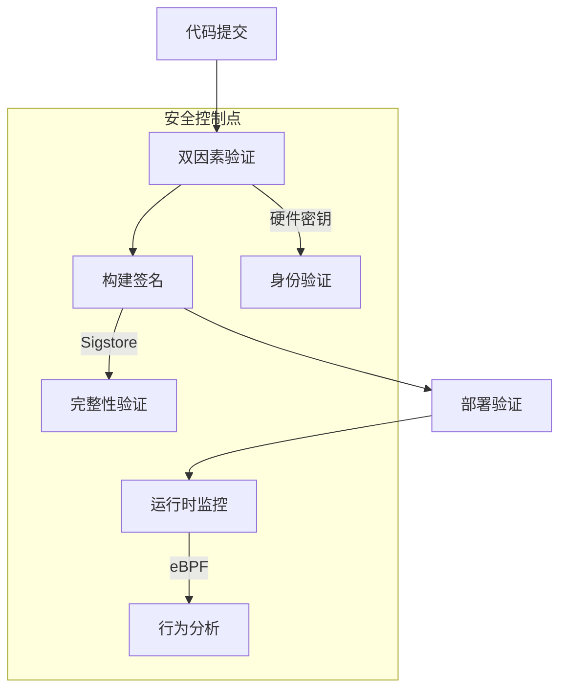

```markdown:c:\project\kphub/docs/supply-chain-security.md
---
title: 供应链安全挑战
icon: theory
order: 4
---

# 供应链安全挑战

软件供应链安全是云原生环境中的关键挑战，涉及从代码到部署的全过程。本文从攻击面分析到防御体系构建，深入解析软件供应链安全的20+核心风险场景和15+企业级防护方案，提供覆盖"开发-构建-分发-部署"全链路的安全实践指南。

## 1. 供应链攻击面分析

### 1.1 现代软件供应链模型

````mermaid
graph TD
    A[开发者] --> B[代码仓库]
    B --> C[CI/CD系统]
    C --> D[依赖仓库]
    D --> E[构建产物]
    E --> F[镜像仓库]
    F --> G[运行环境]
    
    subgraph 攻击向量
    B -->|恶意提交| X1
    D -->|投毒包| X2
    C -->|凭证泄露| X3
    F -->|镜像篡改| X4
    end
    
    style X1 stroke:#f33,stroke-width:2px
    style X4 stroke:#f33,stroke-width:2px
````

#### 1.1.1 攻击影响公式
```math
Impact = \sum_{i=1}^{n} Component_{criticality} \times Exploitability_i
```

### 1.2 典型攻击模式



## 2. 依赖安全管理

### 2.1 依赖风险扫描



#### 2.1.1 扫描策略配置
```yaml:c:\project\config\dependency-check.yml
scanners:
  - type: oss-index
    enabled: true
    fail-on-severity: high
  - type: snyk
    api-key: ${SNYK_TOKEN}
    
exclusions:
  - CVE-2021-44228
  - group: com.example
```

### 2.2 SBOM管理实践

```bash
# 生成SBOM
syft ghcr.io/company/app:latest -o cyclonedx > sbom.xml

# 签名验证
cosign sign --key aws-kms:///alias/sbom-key sbom.xml
```

## 3. 构建过程加固

### 3.1 可信构建环境



### 3.2 SLSA合规配置

```yaml:c:\project\config\slsa.yml
apiVersion: slsa/v1alpha
kind: Provenance
spec:
  builder:
    id: https://github.com/company/actions/build@v1
  materials:
    - uri: git+https://github.com/company/app
      digest:
        sha256: abc123...
  metadata:
    buildInvocationId: "1234-5678"
    completeness:
      parameters: true
      environment: true
```

## 4. 镜像安全防护

### 4.1 镜像签名验证

```dockerfile
FROM alpine:3.18@sha256:abc123...
COPY --from=gcr.io/projectsigstore/cosign:v1.10.1 /ko-app/cosign /usr/local/bin/cosign
RUN cosign verify --key k8s://prod/cosign-pub-key gcr.io/project/app:latest
```

### 4.2 运行时防护

```yaml:c:\project\config\falco-rules.yml
- rule: Unauthorized Process
  desc: Detect processes not in allowlist
  condition: >
    spawned_process and
    not proc.name in (valid_processes)
  output: "Unexpected process %proc.name"
  priority: CRITICAL
```

## 5. 企业级防护方案

### 5.1 零信任供应链



### 5.2 访问控制矩阵

| 资源类型       | 开发者权限       | 构建系统权限     | 生产环境权限     |
|----------------|------------------|------------------|------------------|
| 代码仓库       | 读/写           | 只读             | 无               |
| 依赖仓库       | 只读            | 读/写            | 无               |
| 镜像仓库       | 无              | 读/写            | 只读             |
| 生产集群       | 无              | 无               | 受限部署         |

## 6. 前沿防护技术

### 6.1 区块链溯源

```solidity
pragma solidity ^0.8.0;

contract BuildProvenance {
    struct BuildRecord {
        address builder;
        string artifactHash;
        uint256 timestamp;
    }
    
    mapping(string => BuildRecord) public records;
    
    function addRecord(string memory component, string memory hash) public {
        records[component] = BuildRecord(msg.sender, hash, block.timestamp);
    }
    
    function verifyHash(string memory component, string memory hash) public view returns(bool) {
        return keccak256(bytes(records[component].artifactHash)) == keccak256(bytes(hash));
    }
}
```

### 6.2 AI辅助分析

```python
def detect_anomaly(repo_activity):
    model = load_model('supplychain-ai')
    features = extract_features(repo_activity)
    predictions = model.predict(features)
    return [i for i, score in enumerate(predictions) if score > 0.9]
```

通过本文的系统化讲解，读者可以掌握从供应链风险识别到企业级防护的完整知识体系。建议按照"依赖治理→构建加固→运行时防护→智能监测"的路径推进，构建可信的软件供应链安全体系。