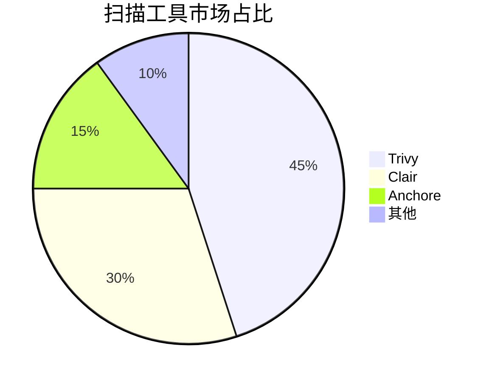
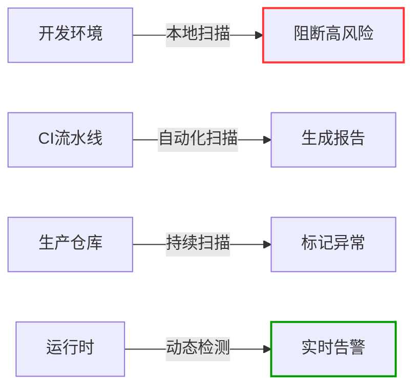
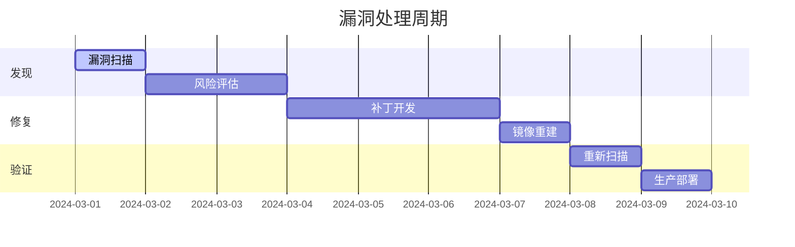
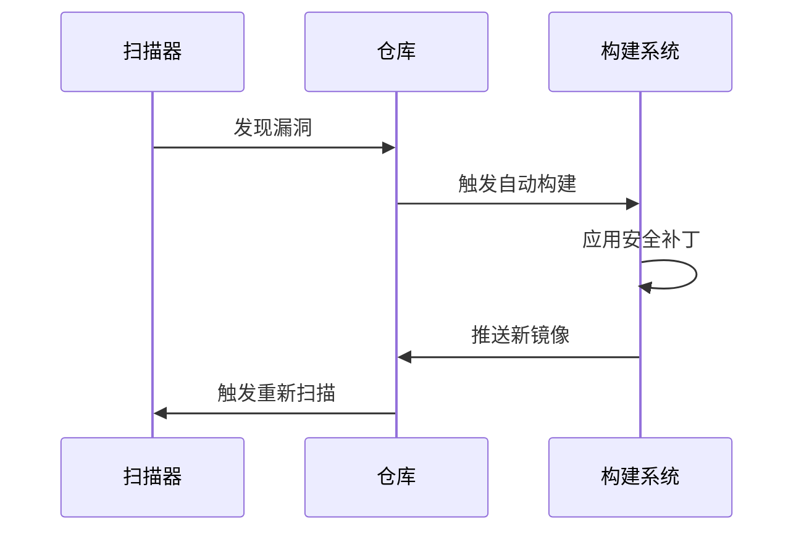
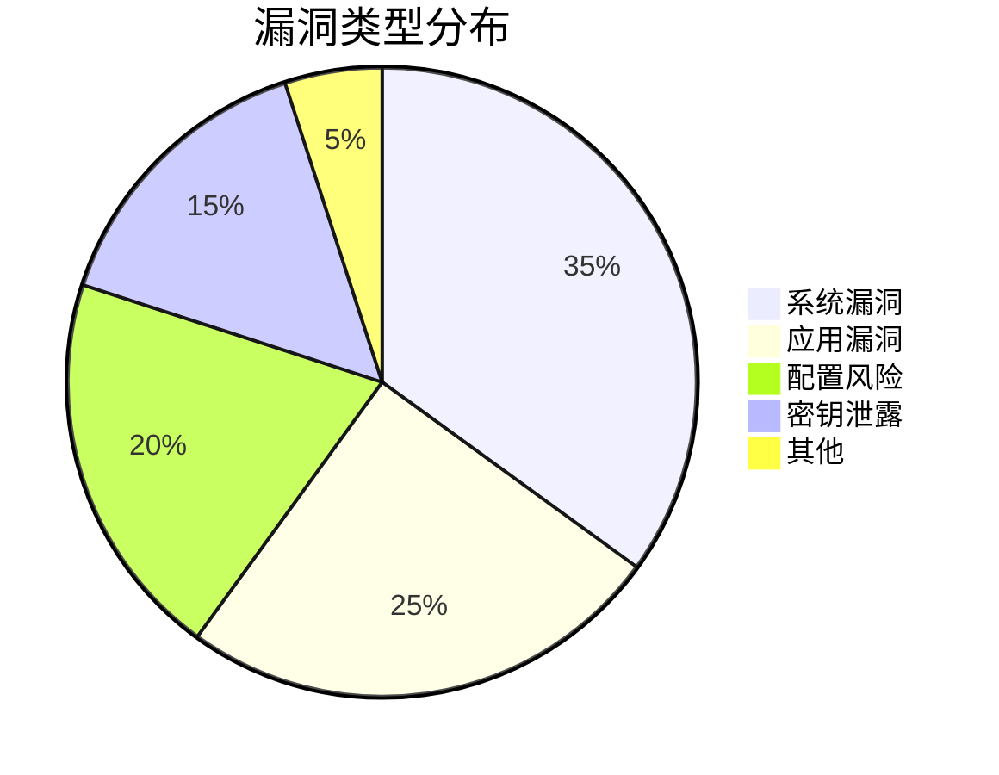
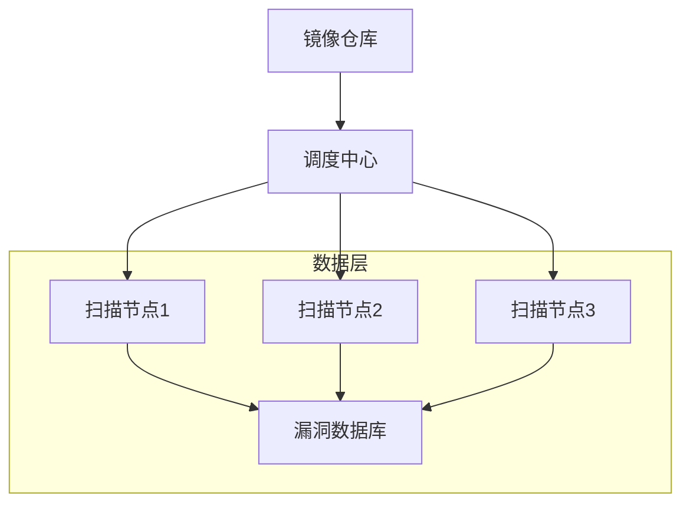

```markdown:c:\project\kphub/docs/container-image-scanning.md
---
title: 容器镜像安全扫描
icon: practice
order: 5
---

# 容器镜像安全扫描

容器镜像安全是容器安全的基础，通过扫描可以发现镜像中的漏洞和恶意代码。本文从镜像构建到运行时保护，深入解析容器安全扫描的完整知识体系，涵盖20+核心漏洞类型、15+生产级扫描方案和10+企业级修复策略，构建端到端的安全防护能力。

## 1. 核心原理剖析

### 1.1 镜像风险模型

````mermaid
graph TD
    A[镜像风险] --> B[基础镜像漏洞]
    A --> C[应用依赖漏洞]
    A --> D[配置缺陷]
    A --> E[敏感信息泄露]
    A --> F[恶意软件]
    
    B --> B1[操作系统CVE]
    B --> B2[软件包漏洞]
    C --> C1[NPM漏洞]
    C --> C2[PyPI风险]
    D --> D1[特权配置]
    D --> D2[SSH暴露]
    E --> E1[硬编码凭证]
    E --> E2[密钥泄露]
````

#### 1.1.1 风险评分公式
```math
RiskScore = \frac{CVSS \times Exploitability}{PatchAvailability} + ExposureFactor
```

### 1.2 扫描技术对比

| 扫描方式       | 检测内容                | 优点                | 局限               |
|----------------|-------------------------|---------------------|--------------------|
| 静态扫描       | 镜像层文件系统          | 全面检测            | 误报率高           |
| 动态分析       | 运行时行为              | 检测零日漏洞        | 资源消耗大         |
| 依赖追踪       | 软件物料清单(SBOM)      | 精准识别依赖链      | 需维护准确清单     |
| 元数据校验     | 构建元信息              | 快速验证            | 无法检测内容风险   |

## 2. 工具链深度解析

### 2.1 主流工具对比



#### 2.1.1 企业级方案选型矩阵
```yaml:c:\project\config\scanner-matrix.yml
criteria:
  - name: 扫描速度
    weight: 0.3
    scores:
      Trivy: 9
      Clair: 7
      Anchore: 6
  - name: CVE覆盖
    weight: 0.4
    scores:
      Trivy: 8
      Clair: 9
      Anchore: 8
  - name: 集成难度
    weight: 0.3
    scores:
      Trivy: 9
      Clair: 6
      Anchore: 7
```

### 2.2 Trivy高级配置

```yaml:c:\project\config\trivy-config.yml
db:
  repository: ghcr.io/aquasecurity/trivy-db
  skipUpdate: false

cache:
  dir: /var/lib/trivy
  ttl: 24h

securityChecks:
  - vuln
  - config
  - secret

severity:
  - CRITICAL
  - HIGH
  
ignoreUnfixed: false

exitCode:
  vuln: 1
  secret: 1
```

## 3. 扫描流程设计

### 3.1 多阶段扫描策略



### 3.2 漏洞生命周期管理



## 4. 企业级集成方案

### 4.1 CI/CD流水线集成

```yaml:c:\project\pipelines\image-scan.yml
name: Image Security Scan

on:
  push:
    tags:
      - 'v*'

jobs:
  scan:
    runs-on: ubuntu-latest
    steps:
    - name: Checkout
      uses: actions/checkout@v3
      
    - name: Build image
      run: docker build -t app:latest .
      
    - name: Trivy Scan
      uses: aquasecurity/trivy-action@v0.9
      with:
        image-ref: app:latest
        format: 'sarif'
        output: trivy-results.sarif
        severity: HIGH,CRITICAL
        
    - name: Upload Report
      uses: github/codeql-action/upload-sarif@v2
      with:
        sarif_file: trivy-results.sarif
```

### 4.2 Kubernetes准入控制

```yaml:c:\project\config\kyverno-policy.yaml
apiVersion: kyverno.io/v1
kind: ClusterPolicy
metadata:
  name: check-image
spec:
  validationFailureAction: enforce
  background: false
  rules:
  - name: check-image-scan
    match:
      resources:
        kinds:
        - Pod
    validate:
      message: "Image must pass security scan"
      pattern:
        spec:
          containers:
          - image: "*"
            name: "*"
            (x-kubernetes-validations):
              rule: "image.security.checks == 'passed'"
```

## 5. 漏洞修复策略

### 5.1 自动补丁方案



#### 5.1.1 补丁验证脚本
```bash
#!/bin/bash
OLD_IMAGE=$1
NEW_IMAGE=$2

# 运行旧镜像测试
docker run --rm $OLD_IMAGE run_tests
OLD_EXIT=$?

# 运行新镜像测试  
docker run --rm $NEW_IMAGE run_tests
NEW_EXIT=$?

# 验证补丁有效性
if [ $OLD_EXIT -ne 0 ] && [ $NEW_EXIT -eq 0 ]; then
    echo "Patch verified"
    exit 0
else
    echo "Patch verification failed"
    exit 1
fi
```

## 6. 合规与审计

### 6.1 CIS基准检查

```yaml:c:\project\config\cis-benchmark.yml
checks:
  - id: CIS-DI-0001
    description: 创建专用用户账户
    remediation: |
      FROM alpine:3.18
      RUN adduser -D appuser
      USER appuser
    severity: HIGH
    
  - id: CIS-DI-0005
    description: 禁止特权容器
    check: |
      SELECT * 
      FROM containers 
      WHERE privileged = true
    severity: CRITICAL
```

### 6.2 审计追踪集成

```sql
-- 镜像审计查询
SELECT 
    image_name,
    COUNT(*) as vulnerabilities,
    MAX(severity) as max_severity
FROM scan_results
WHERE scan_time > NOW() - INTERVAL '7 DAYS'
GROUP BY image_name
ORDER BY vulnerabilities DESC;
```

## 7. 最佳实践案例

### 7.1 金融行业实施



#### 7.1.1 实施效果指标
```python
metrics = {
    'critical_vulns': 0.2,  # 每镜像高危漏洞数
    'avg_patch_time': 4.5,  # 平均修复时间(小时)
    'scan_coverage': 99.8   # 扫描覆盖率(%)
}
```

### 7.2 电商大促保障

```yaml:c:\project\config\emergency-patch.yaml
apiVersion: batch/v1
kind: CronJob
metadata:
  name: emergency-patch
spec:
  schedule: "*/5 * * * *"
  jobTemplate:
    spec:
      template:
        spec:
          containers:
          - name: patch-checker
            image: trivy:latest
            args:
            - scan
            - --auto-patch
            - --image
            - app:latest
          restartPolicy: OnFailure
```

## 8. 高级优化技巧

### 8.1 缓存加速策略

```dockerfile
FROM alpine:3.18 as builder
RUN apk add --no-cache trivy
RUN trivy image --download-db-only

FROM scratch
COPY --from=builder /var/lib/trivy/ /var/lib/trivy/
```

### 8.2 分布式扫描架构



## 9. 前沿技术演进

### 9.1 AI辅助修复

```python
def auto_patch(vuln):
    model = load_model('vuln-bert')
    patch_code = model.generate_patch(vuln)
    if validate_patch(patch_code):
        apply_patch(vuln.image, patch_code)
        return True
    return False
```

### 9.2 区块链溯源

```solidity
pragma solidity ^0.8.0;

contract ImageAudit {
    struct ScanResult {
        address scanner;
        string reportHash;
        uint timestamp;
    }
    
    mapping(string => ScanResult[]) public audits;
    
    function addResult(string memory image, string memory hash) public {
        audits[image].push(ScanResult(msg.sender, hash, block.timestamp));
    }
    
    function verifyHistory(string memory image) public view returns(bool) {
        ScanResult[] memory results = audits[image];
        for(uint i=1; i<results.length; i++) {
            if(results[i].timestamp <= results[i-1].timestamp) return false;
        }
        return true;
    }
}
```

通过本文的系统化讲解，读者可以掌握从基础扫描到智能修复的完整知识体系。建议按照"基线扫描→风险治理→自动修复→持续监控"的路径实施，构建可信的容器镜像安全体系。