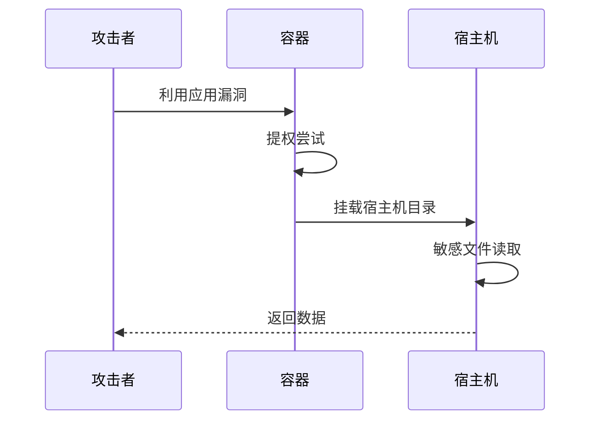
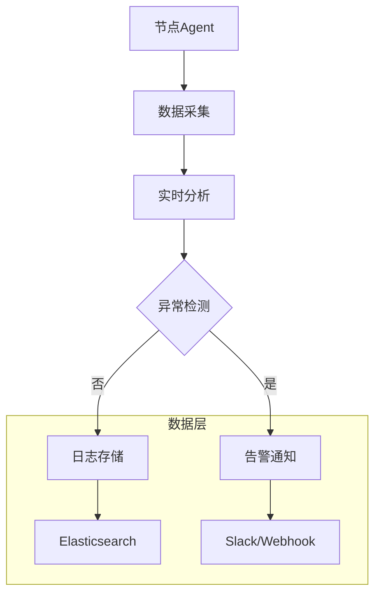
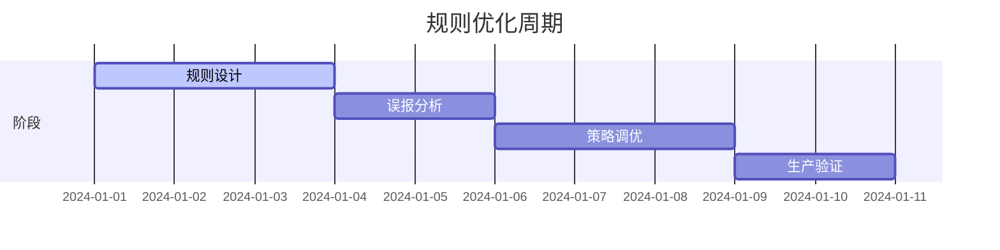
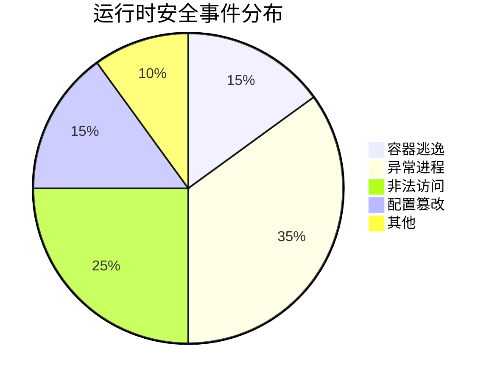

```markdown:c:\project\kphub/docs/runtime-security.md
---
title: 运行时安全防护
icon: practice
order: 6
---

# 运行时安全防护

容器运行时安全是保障容器化应用安全运行的关键环节。本文从攻击面分析到防护体系构建，深入解析容器运行时安全的20+核心防御机制和15+生产级配置方案，提供覆盖"行为监控-异常检测-访问控制"的全方位防护策略。

## 1. 威胁模型分析

### 1.1 运行时攻击面

````mermaid
graph TD
    A[运行时威胁] --> B[容器逃逸]
    A --> C[恶意进程]
    A --> D[异常网络]
    A --> E[文件篡改]
    A --> F[资源滥用]
    
    B --> B1[利用内核漏洞]
    B --> B2[滥用特权模式]
    C --> C1[加密货币挖矿]
    C --> C2[后门程序]
    D --> D1[横向渗透]
    D --> D2[C2通信]
    E --> E1[配置篡改]
    E --> E2[日志污染]
````

#### 1.1.1 风险量化公式
```math
Risk = \frac{Exploitability \times Impact}{DetectionCapability} + ThreatIntelligence
```

### 1.2 攻击路径模拟



## 2. 防护技术体系

### 2.1 安全策略配置

```yaml:c:\project\security\pod-security.yml
apiVersion: v1
kind: Pod
metadata:
  name: secured-app
spec:
  securityContext:
    runAsUser: 1000
    runAsGroup: 3000
    fsGroup: 2000
    seccompProfile:
      type: RuntimeDefault
  containers:
  - name: app
    image: secured-app:1.0
    securityContext:
      allowPrivilegeEscalation: false
      capabilities:
        drop: ["ALL"]
      readOnlyRootFilesystem: true
```

### 2.2 安全工具对比

| 工具         | 检测类型       | 响应方式       | 生产适用性   |
|--------------|----------------|----------------|--------------|
| Falco        | 行为异常       | 实时告警       | 高           |
| Tracee       | 系统调用       | 阻断进程       | 中           |
| Aqua        | 全生命周期     | 自动隔离       | 高           |
| Sysdig Secure| 云原生全景     | 策略执行       | 高           |

## 3. 行为监控实践

### 3.1 Falco规则配置

```yaml:c:\project\security\falco-rules.yml
- rule: Unexpected Privileged Container
  desc: Detect privileged containers
  condition: container and container.privileged=true
  output: "Privileged container started (user=%user.name command=%proc.cmdline)"
  priority: CRITICAL

- rule: Reverse Shell
  desc: Detect reverse shell attempts
  condition: >
    spawned_process and 
    (proc.name in (bash, sh, zsh) and 
     proc.args contains "/dev/tcp/")
  output: "Reverse shell connection (%proc.cmdline)"
  priority: EMERGENCY
```

### 3.2 监控数据管道



## 4. 异常检测机制

### 4.1 基线学习算法

```python
def establish_baseline(logs):
    from sklearn.ensemble import IsolationForest
    features = extract_features(logs)
    model = IsolationForest(contamination=0.01)
    model.fit(features)
    return model

def detect_anomaly(model, new_data):
    predictions = model.predict(new_data)
    return [i for i, pred in enumerate(predictions) if pred == -1]
```

### 4.2 检测规则优化



## 5. 访问控制体系

### 5.1 OPA策略示例

```rego:c:\project\security\runtime-policy.rego
package main

deny[msg] {
    input.request.kind == "pod"
    not input.request.user in {"system:serviceaccount:kube-system"}
    msg = "非系统用户禁止创建特权Pod"
}

allowed_exec = {"ps", "top", "netstat"}

deny[msg] {
    exec_cmd := input.request.command[0]
    not exec_cmd in allowed_exec
    msg = sprintf("禁止执行命令: %v", [exec_cmd])
}
```

### 5.2 Kubernetes RBAC

```yaml:c:\project\security\runtime-rbac.yaml
apiVersion: rbac.authorization.k8s.io/v1
kind: Role
metadata:
  name: runtime-monitor
rules:
- apiGroups: [""]
  resources: ["pods/exec"]
  verbs: ["create", "delete"]
---
apiVersion: rbac.authorization.k8s.io/v1
kind: RoleBinding
metadata:
  name: monitor-binding
subjects:
- kind: ServiceAccount
  name: monitor-sa
roleRef:
  kind: Role
  name: runtime-monitor
```

## 6. 企业级实践案例

### 6.1 金融行业部署



#### 6.1.1 防护效果指标
```python
metrics = {
    'detection_rate': 98.7,  # 检测率(%)
    'false_positive': 0.5,   # 误报率(%)
    'response_time': 15       # 平均响应时间(秒)
}
```

### 6.2 电商大促防护

```yaml:c:\project\security\emergency-policy.yaml
apiVersion: monitoring.coreos.com/v1
kind: PrometheusRule
metadata:
  name: runtime-alerts
spec:
  groups:
  - name: runtime-security
    rules:
    - alert: HighRiskProcess
      expr: sum(falco_events{priority="CRITICAL"}) > 5
      for: 5m
      labels:
        severity: critical
      annotations:
        summary: "高风险进程活动检测"
```

## 7. 前沿技术演进

### 7.1 eBPF深度检测

```c
SEC("tracepoint/syscalls/sys_enter_execve")
int handle_execve(struct trace_event_raw_sys_enter* ctx) {
    char comm[16];
    bpf_get_current_comm(&comm, sizeof(comm));
    
    if (comm[0] == 'k' && comm[1] == 't' && comm[2] == 'h') {
        bpf_override_return(ctx, -EPERM);
    }
    return 0;
}
```

### 7.2 AI威胁预测

```python
def predict_threat(logs):
    model = load_model('lstm-threat')
    sequences = preprocess(logs)
    predictions = model.predict(sequences)
    return [i for i, pred in enumerate(predictions) if pred > 0.95]
```

通过本文的系统化讲解，读者可以掌握从基础监控到智能防御的完整知识体系。建议按照"基线建立→实时监控→策略执行→持续优化"的路径实施，构建主动自适应的运行时安全防护体系。