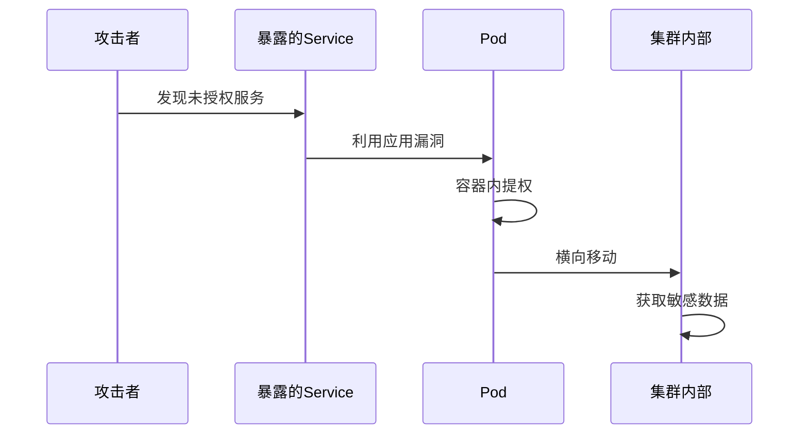
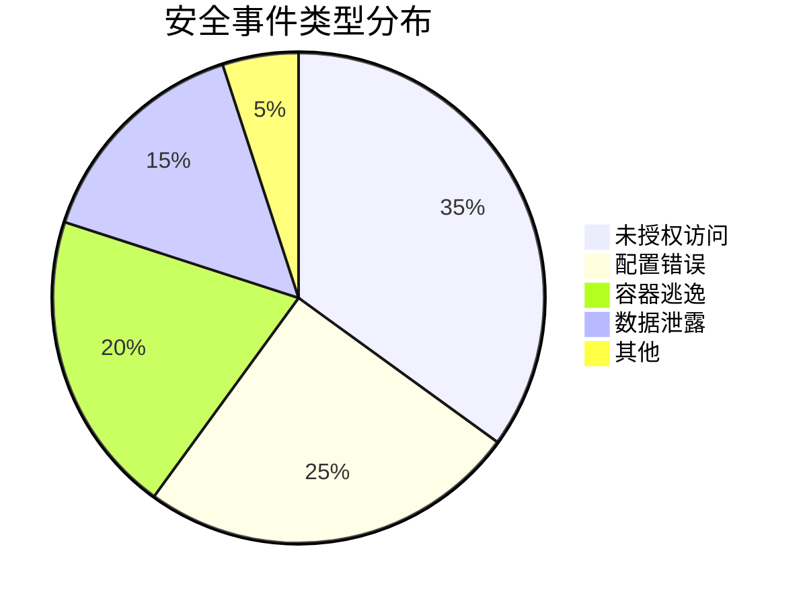
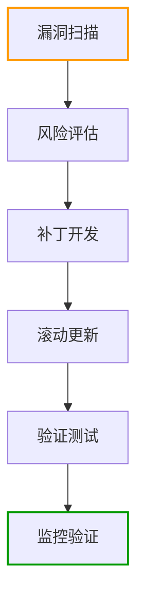

```markdown:c:\project\kphub/docs/kubernetes-security.md
---
title: Kubernetes安全加固
icon: practice
order: 7
---

# Kubernetes安全加固

Kubernetes作为容器编排平台，其安全配置直接影响整个云原生环境的安全性。本文从攻击面分析到生产加固实践，深入解析Kubernetes安全体系的20+核心防御机制和15+企业级配置方案，提供覆盖"控制平面-工作节点-应用负载"的全方位加固指南。

## 1. 核心安全风险

### 1.1 攻击面全景分析

````mermaid
graph TD
    A[K8s攻击面] --> B[控制平面]
    A --> C[工作节点]
    A --> D[容器运行时]
    A --> E[网络层]
    
    B --> B1[未授权API访问]
    B --> B2[etcd未加密]
    C --> C1[kubelet漏洞]
    C --> C2[特权容器逃逸]
    D --> D1[运行时漏洞]
    E --> E1[网络策略缺失]
    E --> E2[服务暴露过广]
````

#### 1.1.1 风险量化模型
```math
RiskScore = \frac{CVSS \times Exploitability}{DetectionLevel} + ExposureFactor
```

### 1.2 典型攻击路径



## 2. 控制平面加固

### 2.1 API Server安全配置

```yaml:c:\project\security\kube-apiserver.yaml
apiVersion: kubelet.config.k8s.io/v1beta1
kind: KubeletConfiguration
authentication:
  anonymous:
    enabled: false
  webhook:
    enabled: true
authorization:
  mode: Webhook
tlsCertFile: /etc/kubernetes/pki/apiserver.crt
tlsPrivateKeyFile: /etc/kubernetes/pki/apiserver.key
clientCAFile: /etc/kubernetes/pki/ca.crt
enable-admission-plugins: "NodeRestriction,PodSecurityPolicy"
```

### 2.2 etcd加密配置

```bash
# 数据加密配置
kube-apiserver \
  --encryption-provider-config=encryption-config.yaml \
  --etcd-cafile=/etc/kubernetes/pki/etcd/ca.crt \
  --etcd-certfile=/etc/kubernetes/pki/apiserver-etcd-client.crt \
  --etcd-keyfile=/etc/kubernetes/pki/apiserver-etcd-client.key
```

## 3. 工作节点防护

### 3.1 kubelet安全加固

```yaml:c:\project\security\kubelet-config.yaml
apiVersion: kubelet.config.k8s.io/v1beta1
kind: KubeletConfiguration
featureGates:
  RotateKubeletServerCertificate: true
  ProtectKernelDefaults: true
authorization:
  mode: Webhook
authentication:
  x509:
    clientCAFile: /etc/kubernetes/pki/ca.crt
  webhook:
    enabled: true
readOnlyPort: 0
serverTLSBootstrap: true
```

### 3.2 CIS基准检查

```bash
# 使用kube-bench执行检查
docker run --rm --pid=host -v /etc:/etc:ro -v /var:/var:ro \
  aquasec/kube-bench:latest node --version 1.23

# 自动修复脚本示例
kube-bench -f cis-1.23.yaml --fix
```

## 4. 应用负载安全

### 4.1 Pod安全策略

```yaml:c:\project\security\pod-security-policy.yaml
apiVersion: policy/v1beta1
kind: PodSecurityPolicy
metadata:
  name: restricted
spec:
  privileged: false
  allowPrivilegeEscalation: false
  requiredDropCapabilities:
    - ALL
  volumes:
    - 'configMap'
    - 'emptyDir'
  hostNetwork: false
  hostIPC: false
  hostPID: false
  runAsUser:
    rule: 'MustRunAsNonRoot'
```

### 4.2 网络策略强化

```yaml:c:\project\security\network-policy.yaml
apiVersion: networking.k8s.io/v1
kind: NetworkPolicy
metadata:
  name: db-isolation
spec:
  podSelector:
    matchLabels:
      app: database
  policyTypes:
  - Ingress
  ingress:
  - from:
    - podSelector:
        matchLabels:
          app: api-server
    ports:
    - protocol: TCP
      port: 5432
```

## 5. 认证与授权

### 5.1 RBAC深度配置

```yaml:c:\project\security\rbac.yaml
apiVersion: rbac.authorization.k8s.io/v1
kind: ClusterRole
metadata:
  name: limited-access
rules:
- apiGroups: [""]
  resources: ["pods"]
  verbs: ["get", "list"]
---
apiVersion: rbac.authorization.k8s.io/v1
kind: RoleBinding
metadata:
  name: dev-access
subjects:
- kind: User
  name: dev-user
roleRef:
  kind: ClusterRole
  name: limited-access
```

### 5.2 OPA策略示例

```rego:c:\project\security\kube-mgmt.rego
package kubernetes.admission

deny[msg] {
    input.request.kind.kind == "Pod"
    not input.request.object.spec.securityContext.runAsNonRoot
    msg = "必须使用非root用户运行容器"
}

deny[msg] {
    input.request.kind.kind == "Service"
    input.request.object.spec.type == "NodePort"
    msg = "禁止创建NodePort类型服务"
}
```

## 6. 监控与审计

### 6.1 安全事件监控

```yaml:c:\project\security\falco-rules.yaml
- rule: Unexpected NodePort Service
  desc: Detect NodePort service creation
  condition: kevt and kservice and kservice.type="NodePort"
  output: "NodePort service created by %ka.user.name"
  priority: WARNING

- rule: Privileged Container
  desc: Detect privileged containers
  condition: container and container.privileged=true
  output: "Privileged container started by %user.name"
  priority: CRITICAL
```

### 6.2 审计日志分析

```sql
-- 高风险操作查询
SELECT 
    user, 
    COUNT(*) as action_count,
    ARRAY_AGG(DISTINCT resource) as resources
FROM audit_logs 
WHERE verb IN ('create', 'delete') 
  AND timestamp > CURRENT_DATE - INTERVAL '1 HOUR'
GROUP BY user 
HAVING COUNT(*) > 10
ORDER BY action_count DESC;
```

## 7. 企业级最佳实践

### 7.1 金融行业方案



#### 7.1.1 加固效果指标
```python
metrics = {
    'cis_compliance': 98.5,  # CIS基准符合率
    'patching_cycle': 2.3,   # 平均补丁周期(天)
    'audit_coverage': 100    # 审计覆盖率(%)
}
```

### 7.2 多集群管理策略

```yaml:c:\project\security\cluster-federation.yaml
apiVersion: policy.open-cluster-management.io/v1
kind: Policy
metadata:
  name: cluster-security
spec:
  remediationAction: enforce
  disabled: false
  policy-templates:
  - objectDefinition:
      apiVersion: policy.open-cluster-management.io/v1
      kind: ConfigurationPolicy
      metadata:
        name: pod-security
      spec:
        severity: high
        namespaceSelector:
          include: ["*"]
        object-templates:
        - complianceType: musthave
          objectDefinition:
            kind: PodSecurityPolicy
            metadata:
              name: restricted
```

## 8. 持续安全维护

### 8.1 漏洞管理流程



### 8.2 自动化巡检脚本

```bash
#!/bin/bash
# 安全配置检查
check_kubelet() {
    ps -ef | grep kubelet | grep --quiet -- "--anonymous-auth=false"
    return $?
}

# CIS基准验证
verify_cis() {
    docker run --rm -v $(pwd):/app aquasec/kube-bench:latest \
        -f /app/cis-1.23.yaml
}

# 自动修复功能
auto_fix() {
    sed -i 's/--anonymous-auth=true/--anonymous-auth=false/' \
        /etc/kubernetes/kubelet.conf
}
```

通过本文的系统化讲解，读者可以掌握从基础加固到企业级防护的完整知识体系。建议按照"基准配置→持续监控→策略执行→智能响应"的路径实施，构建符合等保要求的Kubernetes安全体系。
```