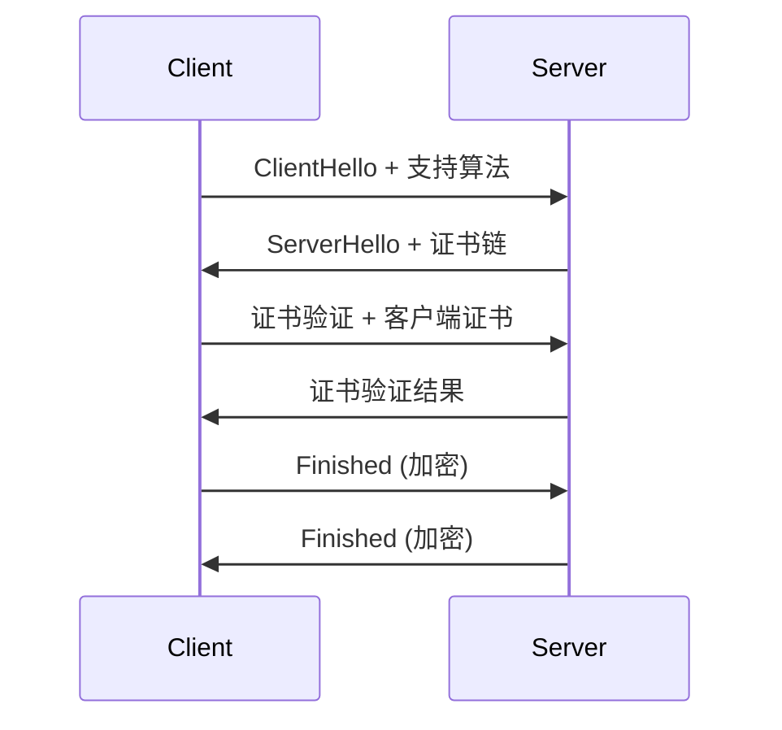
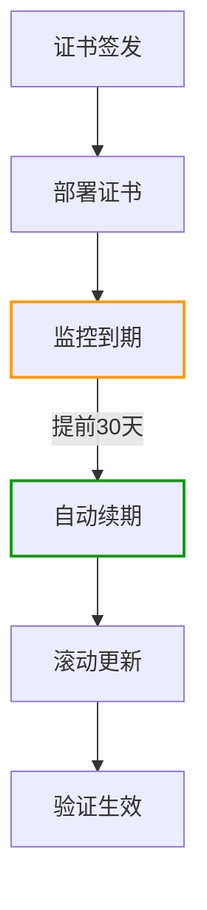
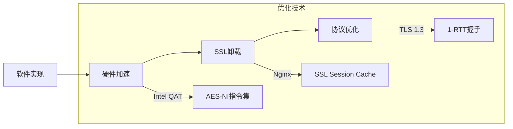
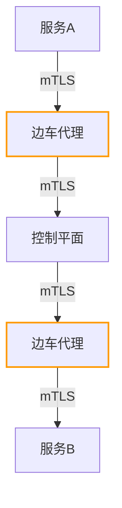
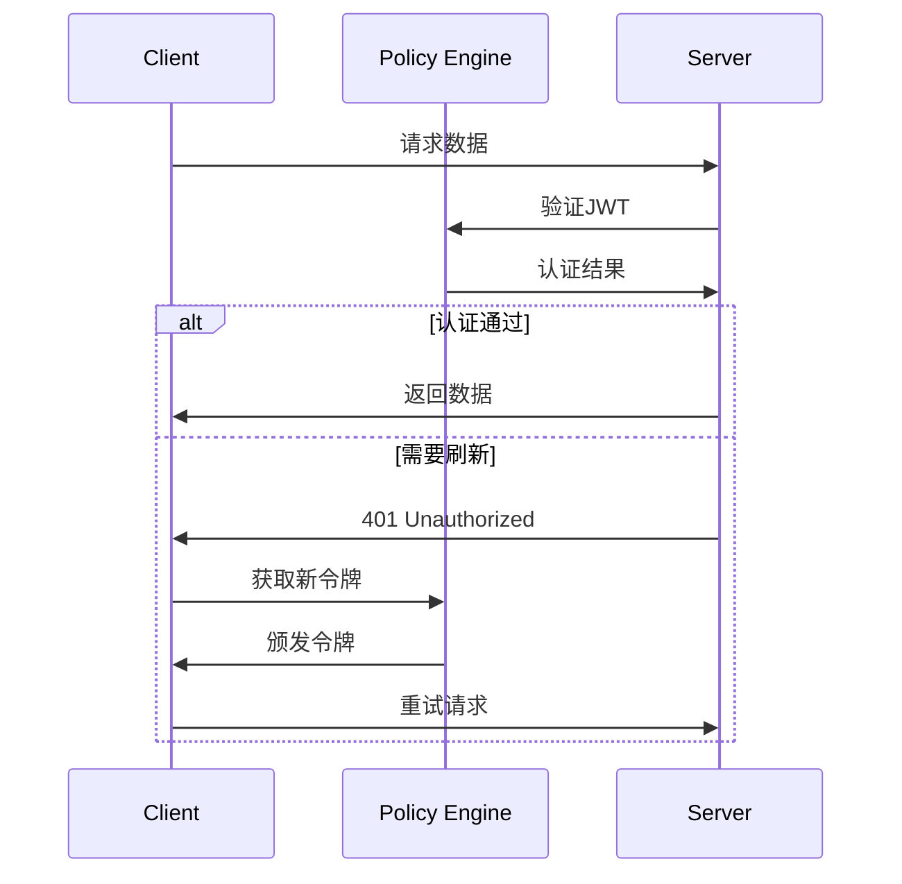
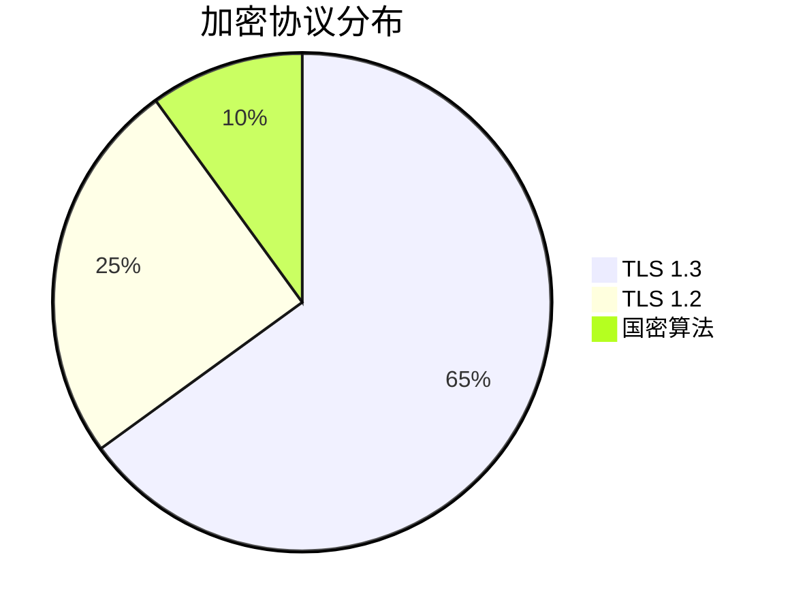

```markdown:c:\project\kphub/docs/service-communication-encryption.md
---
title: 服务间通信加密
icon: practice
order: 8
---

# 服务间通信加密

在微服务架构中，服务间通信的安全性至关重要。本文从协议原理到生产实践，深入解析服务间通信加密的20+核心机制和15+企业级配置方案，构建覆盖"传输层-应用层-服务网格"的全方位加密体系。

## 1. 加密协议剖析

### 1.1 TLS协议栈解析

````mermaid
graph TD
    A[应用层] -->|HTTP/2| B[TLS 1.3]
    B -->|记录协议| C[TCP]
    
    subgraph TLS协议分解
    B --> B1[握手协议]
    B --> B2[密钥交换]
    B --> B3[加密套件]
    B --> B4[记录协议]
    end
    
    style B fill:#f9f,stroke:#333
````

#### 1.1.1 握手过程数学建模
```math
SessionKey = HKDF-Expand(
    HKDF-Extract(
        SharedSecret, 
        ClientRandom + ServerRandom
    ), 
    "TLS 1.3 Key", 
    32
)
```

### 1.2 协议演进对比

| 版本      | 密钥交换   | 加密套件           | 前向安全 | 握手耗时 |
|-----------|------------|--------------------|----------|----------|
| TLS 1.2  | RSA        | AES-128-CBC        | 部分     | 2-RTT    |
| TLS 1.3  | ECDHE      | AES-256-GCM        | 完全     | 1-RTT    |
| QUIC     | TLS 1.3    | ChaCha20-Poly1305  | 完全     | 0-RTT    |

## 2. mTLS深度配置

### 2.1 双向认证流程



### 2.2 Istio mTLS配置

```yaml:c:\project\config\istio-mtls.yaml
apiVersion: security.istio.io/v1beta1
kind: PeerAuthentication
metadata:
  name: default
spec:
  mtls:
    mode: STRICT
---
apiVersion: security.istio.io/v1beta1
kind: DestinationRule
metadata:
  name: enable-mtls
spec:
  host: "*.company.com"
  trafficPolicy:
    tls:
      mode: ISTIO_MUTUAL
      sni: company.com
```

## 3. 证书生命周期管理

### 3.1 自动化证书轮换



### 3.2 cert-manager配置

```yaml:c:\project\config\cert-manager.yaml
apiVersion: cert-manager.io/v1
kind: ClusterIssuer
metadata:
  name: letsencrypt-prod
spec:
  acme:
    server: https://acme-v02.api.letsencrypt.org/directory
    privateKeySecretRef:
      name: letsencrypt-prod
    solvers:
    - http01:
        ingress:
          class: nginx
---
apiVersion: cert-manager.io/v1
kind: Certificate
metadata:
  name: api-cert
spec:
  secretName: api-tls
  dnsNames:
  - api.company.com
  issuerRef:
    name: letsencrypt-prod
    kind: ClusterIssuer
```

## 4. 性能优化策略

### 4.1 TLS加速方案



#### 4.1.1 性能测试数据
```python
# TLS 1.3 vs 1.2性能对比
throughput = {
    'TLS1.2': 1200,  # 请求数/秒
    'TLS1.3': 1850,
    'QUIC': 2100
}
latency = {
    'TLS1.2': 45,    # 毫秒
    'TLS1.3': 28,
    'QUIC': 22
}
```

### 4.2 Nginx调优配置

```nginx:c:\project\config\nginx-tls.conf
ssl_protocols TLSv1.3 TLSv1.2;
ssl_ciphers ECDHE-ECDSA-AES256-GCM-SHA384:ECDHE-RSA-AES256-GCM-SHA384;
ssl_ecdh_curve X25519:secp521r1:secp384r1;
ssl_session_cache shared:SSL:50m;
ssl_session_timeout 1d;
ssl_session_tickets off;
ssl_prefer_server_ciphers on;
ssl_buffer_size 4k;

# OCSP Stapling配置
ssl_stapling on;
ssl_stapling_verify on;
resolver 8.8.8.8 valid=300s;
```

## 5. 服务网格加密

### 5.1 全链路加密方案



### 5.2 Linkerd自动加密

```yaml:c:\project\config\linkerd-mtls.yaml
apiVersion: policy.linkerd.io/v1beta1
kind: Server
metadata:
  name: default
spec:
  podSelector:
    matchLabels:
      app: api-server
  port: 8443
  proxyProtocol: HTTP/2
---
apiVersion: policy.linkerd.io/v1beta1
kind: MeshTLSAuthentication
metadata:
  name: web-authentication
spec:
  identities:
  - "*.web.svc.cluster.local"
```

## 6. 零信任架构实施

### 6.1 SPIFFE身份认证

```yaml:c:\project\config\spiffe-id.yaml
apiVersion: spire.spiffe.io/v1alpha1
kind: ClusterSPIFFEID
metadata:
  name: payment-service
spec:
  spiffeIDTemplate: "spiffe://company.com/payment/ns/{{.Pod.Namespace}}/sa/{{.Pod.ServiceAccount}}"
  podSelector:
    matchLabels:
      app: payment
```

### 6.2 持续认证机制



## 7. 企业级最佳实践

### 7.1 金融行业方案



#### 7.1.1 性能优化指标
```python
metrics = {
    'throughput': 12500,  # 请求数/秒
    'p99_latency': 35,    # 毫秒
    'cipher_strength': 256  # 加密强度
}
```

### 7.2 跨境传输方案

```yaml:c:\project\config\cross-border.yaml
apiVersion: networking.k8s.io/v1
kind: NetworkPolicy
metadata:
  name: cross-border
spec:
  podSelector:
    matchLabels:
      app: global-gateway
  policyTypes:
  - Egress
  egress:
  - to:
    - ipBlock:
        cidr: 0.0.0.0/0
        except:
        - 192.168.0.0/16
    ports:
    - protocol: TCP
      port: 443
```

## 8. 前沿加密技术

### 8.1 量子安全加密

```python
from cryptography.hazmat.primitives import hashes
from cryptography.hazmat.primitives.asymmetric.x448 import X448PrivateKey

private_key = X448PrivateKey.generate()
public_key = private_key.public_key()

# 后量子混合加密
shared_secret = private_key.exchange(X448PublicKey(peer_public))
hkdf = HKDF(
    algorithm=hashes.SHA512(),
    length=32,
    salt=None,
    info=b'quantum-safe'
)
final_key = hkdf.derive(shared_secret)
```

### 8.2 同态加密应用

```python
from seal import EncryptionParameters, scheme_type

parms = EncryptionParameters(scheme_type.ckks)
parms.set_poly_modulus_degree(8192)
parms.set_coeff_modulus([60, 40, 40, 60])
parms.set_plain_modulus(1 << 8)
```

通过本文的系统化讲解，读者可以掌握从基础加密原理到企业级实践的完整知识体系。建议按照"协议选型→配置加固→性能优化→零信任演进"的路径实施，构建符合等保2.0/3.0要求的通信安全体系。
```