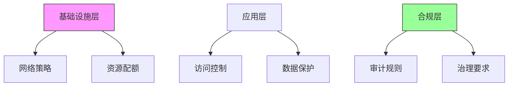
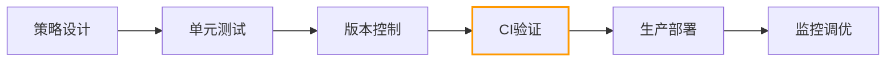
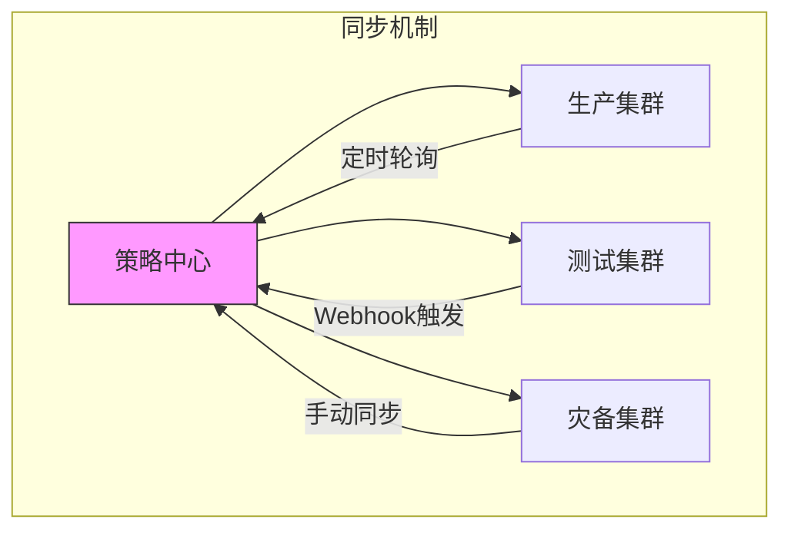
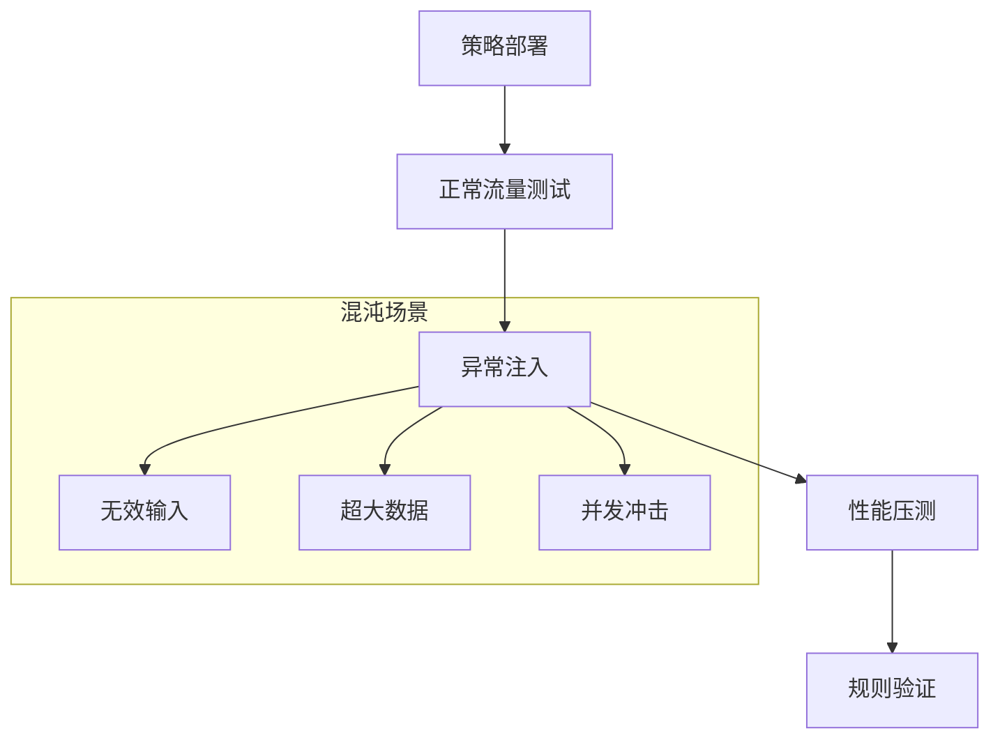
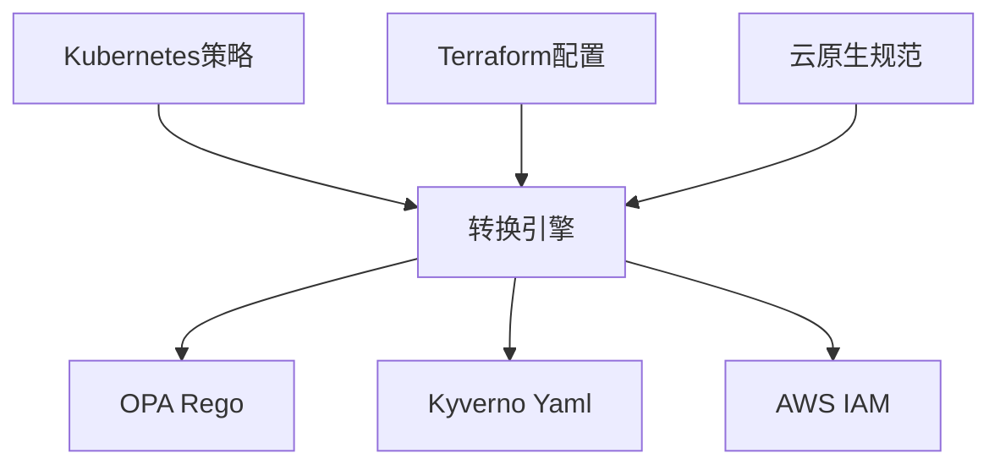

```markdown:c:\project\kphub/docs/policy-as-code.md
---
title: 安全策略即代码
icon: practice
order: 9
---

# 安全策略即代码

安全策略即代码(Policy as Code)是将安全策略以代码形式表达和管理的方法。本文从架构设计到生产实践，深入解析策略即代码的完整知识体系，涵盖20+核心策略模式、15+企业级配置方案和10+性能优化技巧，构建覆盖"开发-部署-运行时"全生命周期的策略管理能力。

## 1. 核心架构解析

### 1.1 策略执行流程

````mermaid
sequenceDiagram
    participant R as 请求方
    participant E as 执行引擎
    participant P as 策略仓库
    participant D as 数据源
    
    R->>E: 提交请求
    E->>P: 获取策略
    E->>D: 查询上下文
    D-->>E: 返回数据
    E->>E: 策略评估
    E-->>R: 返回决策
    
    Note right of E: 决策类型包括<br/>允许/拒绝/修正/审计
````

#### 1.1.1 策略评估公式
```math
Decision = \sum_{i=1}^{n} Policy_i(Context) \times Weight_i
```

### 1.2 分层策略模型



## 2. 工具链深度解析

### 2.1 OPA高级策略

```rego:c:\project\policies\security.rego
package kubernetes.validating

deny[msg] {
    input.request.kind.kind == "Pod"
    not input.request.object.spec.securityContext.runAsNonRoot
    msg = "必须使用非root用户运行容器"
}

deny[msg] {
    input.request.kind.kind == "Service"
    input.request.object.spec.type == "NodePort"
    msg = "禁止创建NodePort类型服务"
}

audit[msg] {
    input.request.kind.kind == "Deployment"
    input.request.object.spec.replicas > 5
    msg = "副本数超过生产环境限制"
}
```

### 2.2 Kyverno准入控制

```yaml:c:\project\policies\kyverno-policy.yaml
apiVersion: kyverno.io/v1
kind: ClusterPolicy
metadata:
  name: require-labels
spec:
  validationFailureAction: enforce
  background: false
  rules:
  - name: check-for-labels
    match:
      resources:
        kinds:
        - Pod
    validate:
      message: "必须包含业务标签"
      pattern:
        metadata:
          labels:
            app: "?*"
            env: "?*"
```

## 3. 策略生命周期管理

### 3.1 策略开发流程



#### 3.1.1 策略测试框架
```bash
# OPA策略测试
opa test ./policies -v

# Kyverno策略验证
kyverno apply ./policies --cluster=dev
```

### 3.2 版本控制策略

```yaml:c:\project\policies\release.yaml
apiVersion: backstage.io/v1alpha1
kind: Policy
metadata:
  name: security-policies
  annotations:
    git.commits: |
      - hash: a1b2c3d
        author: security-team
        date: 2024-03-01
        message: 新增容器root限制策略
spec:
  lifecycle: production
  dependencies:
    - k8s-v1.23+
    - opa-0.45.0
```

## 4. 企业级实践案例

### 4.1 多集群策略分发



### 4.2 金融行业合规策略

```rego:c:\project\policies\finance.rego
package financial.compliance

deny[msg] {
    input.request.kind.kind == "PersistentVolume"
    input.request.object.spec.capacity.storage > "100Gi"
    msg = "单卷容量超过合规限制"
}

deny[msg] {
    input.request.kind.kind == "Secret"
    not encryption_check(input.request.object.data)
    msg = "敏感数据必须加密存储"
}

encryption_check(data) {
    regex.match(`^ENC\[.*\]$`, data[_])
}
```

## 5. 策略性能优化

### 5.1 缓存策略设计

```yaml:c:\project\policies\opa-config.yaml
services:
  kubernetes:
    url: https://k8s-api:6443
    caching:
      enabled: true
      ttl: 5m

bundles:
  main:
    service: kubernetes
    resource: /apis/policies/v1/namespaces/opa/bundles/main

decision_logs:
  console: true
  reporting:
    min_delay_seconds: 300
    max_delay_seconds: 600
```

### 5.2 策略复杂度分析

```python
def calculate_complexity(policy):
    nodes = count_ast_nodes(policy)
    rules = count_rules(policy)
    dependencies = count_data_sources(policy)
    return nodes * 0.5 + rules * 2 + dependencies * 1.5

def optimize_policy(policy):
    simplified = remove_redundant_rules(policy)
    simplified = merge_similar_conditions(simplified)
    return apply_caching(simplified)
```

## 6. 策略测试验证

### 6.1 自动化测试框架

```yaml:c:\project\policies\tests\deployment_test.yaml
cases:
- name: 拒绝root容器
  input:
    request:
      kind:
        kind: Pod
      object:
        spec:
          securityContext:
            runAsNonRoot: false
  expected: deny
  
- name: 允许合规Pod
  input:
    request:
      kind:
        kind: Pod
      object:
        spec:
          securityContext:
            runAsNonRoot: true
  expected: allow
```

### 6.2 混沌测试方案



## 7. 前沿技术演进

### 7.1 AI辅助策略生成

```python
def generate_policy(natural_language):
    model = load_model('policy-bert')
    tokens = tokenize(natural_language)
    ast = model.predict(tokens)
    return compile_rego(ast)

sample_input = "禁止公开的存储桶访问"
output = generate_policy(sample_input)
# 输出OPA Rego策略
```

### 7.2 区块链审计追踪

```solidity
pragma solidity ^0.8.0;

contract PolicyAudit {
    struct PolicyChange {
        address author;
        string policyHash;
        uint timestamp;
    }
    
    mapping(string => PolicyChange[]) public history;
    
    function recordChange(string memory policyId, string memory hash) public {
        history[policyId].push(PolicyChange(msg.sender, hash, block.timestamp));
    }
    
    function verifyHistory(string memory policyId) public view returns(bool) {
        PolicyChange[] memory changes = history[policyId];
        for(uint i = 1; i < changes.length; i++) {
            if(changes[i].timestamp <= changes[i-1].timestamp) return false;
        }
        return true;
    }
}
```

## 8. 跨平台策略管理

### 8.1 多云适配方案

```yaml:c:\project\policies\cross-cloud.yaml
apiVersion: policy.open-cluster-management.io/v1
kind: Policy
metadata:
  name: cross-cloud-security
spec:
  remediationAction: enforce
  disabled: false
  policy-templates:
  - objectDefinition:
      apiVersion: policy.open-cluster-management.io/v1
      kind: ConfigurationPolicy
      metadata:
        name: encryption-policy
      spec:
        severity: high
        object-templates:
        - complianceType: musthave
          objectDefinition:
            apiVersion: storage.k8s.io/v1
            kind: StorageClass
            metadata:
              name: encrypted
            parameters:
              encryption: "true"
```

### 8.2 策略转换引擎



通过本文的系统化讲解，读者可以掌握从基础策略编写到企业级治理的完整知识体系。建议按照"策略设计→自动化测试→智能优化→持续审计"的路径实施，构建可扩展的策略即代码体系。