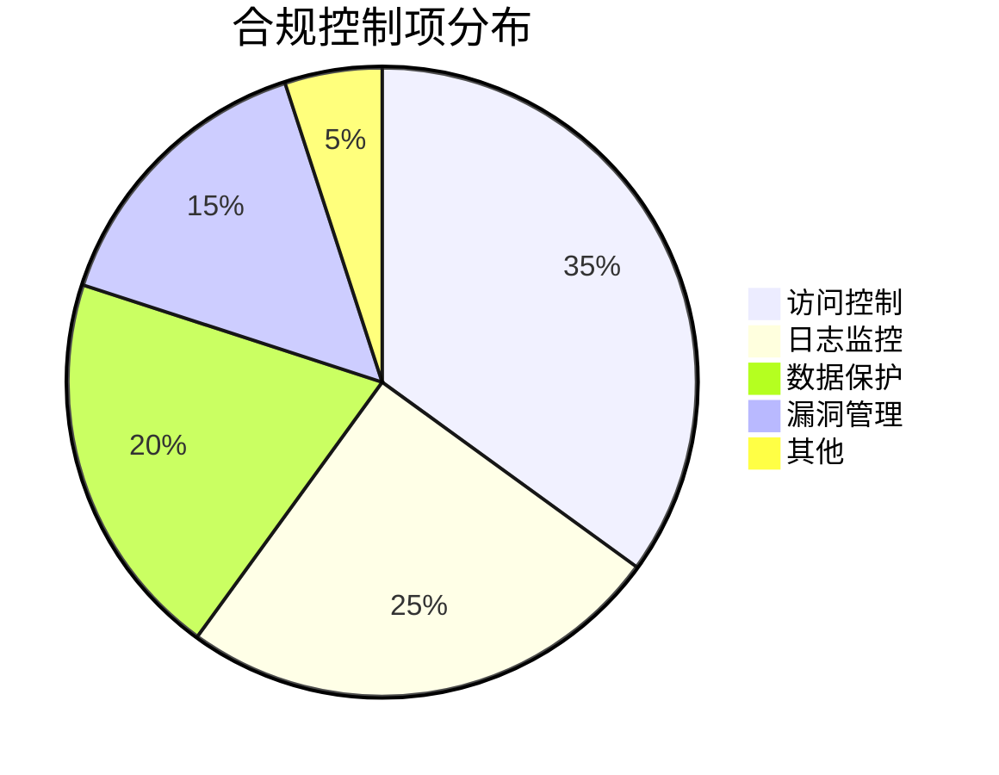
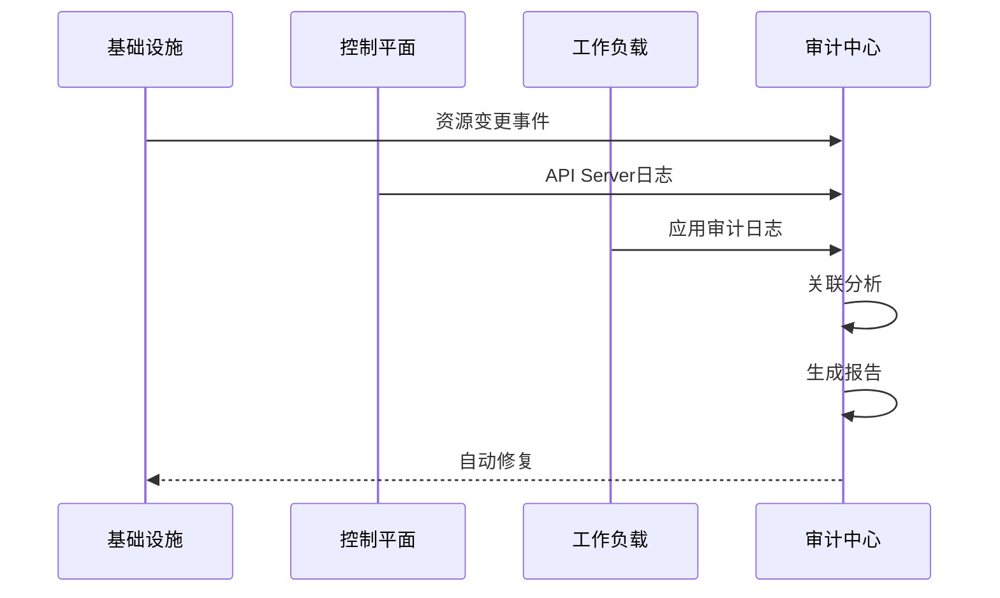
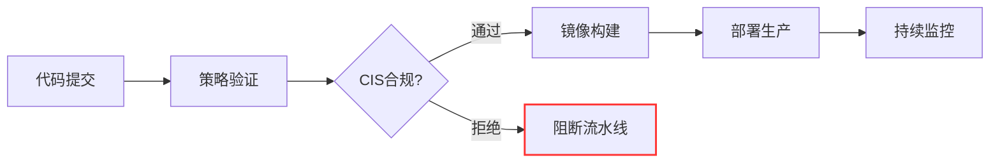
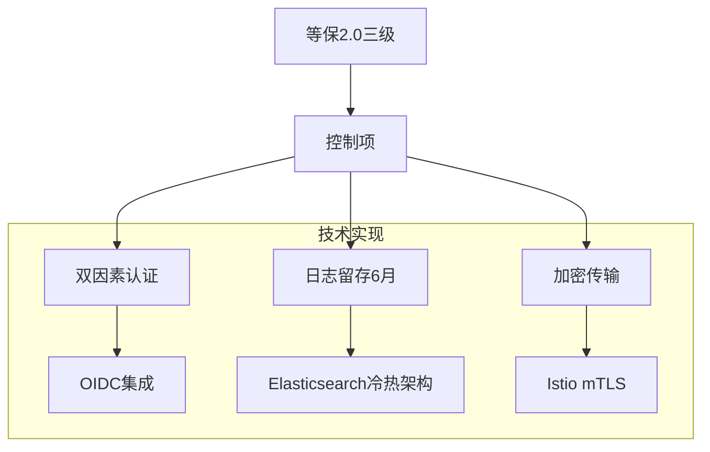
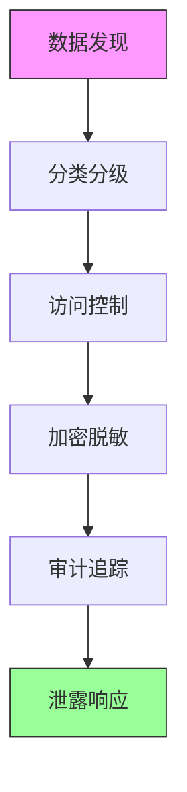

```markdown:c:\project\kphub/docs/cloud-native-compliance.md
---
title: 云原生环境合规审计
icon: practice
order: 10
---

# 云原生环境合规审计

合规审计是确保云原生环境符合行业标准和法规要求的重要手段。本文从合规框架解析到自动化实施，深入解析云原生审计体系的20+核心控制点和15+企业级解决方案，提供覆盖"基础设施-应用负载-数据流"的全栈审计能力。

## 1. 合规框架解析

### 1.1 多标准映射矩阵

````mermaid
graph TD
    A[等保2.0] --> B[控制点]
    C[GDPR] --> B
    D[PCI DSS] --> B
    E[ISO27001] --> B
    
    subgraph 云原生控制点
    B --> B1[访问控制]
    B --> B2[日志审计]
    B --> B3[数据加密]
    B --> B4[漏洞管理]
    end
    
    style A stroke:#f66,stroke-width:2px
    style D stroke:#690,stroke-width:2px
````

#### 1.1.1 合规性计算公式
```math
ComplianceScore = \frac{\sum_{i=1}^{n} ImplementedControls_i}{TotalControls} \times 100\% - PenaltyPoints
```

### 1.2 关键控制域分解



## 2. 审计工具链集成

### 2.1 全链路审计架构



### 2.2 工具链配置示例

```yaml:c:\project\config\audit-tools.yml
tools:
  - name: Falco
    type: 运行时安全
    config: /security/falco-rules.yaml
  
  - name: OpenSCAP
    type: CIS扫描
    config: /cis/scap-config.xml
  
  - name: Kubescape
    type: 风险扫描
    config: /kubescape/nsa-config.yaml
```

## 3. Kubernetes CIS基准

### 3.1 关键控制项示例

```bash
# 检查kube-apiserver配置
ps -ef | grep kube-apiserver | grep --color=auto -E '--anonymous-auth=false|--authorization-mode=Node,RBAC'

# 验证etcd加密
sudo etcdctl --endpoints=https://127.0.0.1:2379 \
  --cert=/etc/kubernetes/pki/etcd/server.crt \
  --key=/etc/kubernetes/pki/etcd/server.key \
  --cacert=/etc/kubernetes/pki/etcd/ca.crt \
  get /registry/secrets/default/admin-token | hexdump -C
```

### 3.2 自动化修复脚本

```python:c:\project\scripts\cis-auto-fix.py
def fix_kubelet_config():
    config_path = '/var/lib/kubelet/config.yaml'
    with open(config_path, 'r+') as f:
        config = yaml.safe_load(f)
        config['authentication']['anonymous']['enabled'] = False
        config['authorization']['mode'] = 'Webhook'
        f.seek(0)
        yaml.dump(config, f)
        f.truncate()
    os.system('systemctl restart kubelet')
```

## 4. 自动化审计流水线

### 4.1 GitOps合规检查



### 4.2 Tekton合规流水线

```yaml:c:\project\tekton\compliance-pipeline.yaml
apiVersion: tekton.dev/v1beta1
kind: Pipeline
metadata:
  name: compliance-check
spec:
  workspaces:
  - name: shared-data
  tasks:
  - name: cis-scan
    taskRef:
      name: kube-bench
    workspaces:
    - name: source
      workspace: shared-data
  - name: risk-assessment
    taskRef:
      name: kubescape
    runAfter: ["cis-scan"]
    params:
    - name: framework
      value: "nsa,mitre"
```

## 5. 策略即代码实践

### 5.1 OPA合规策略

```rego:c:\project\policies\compliance.rego
package kubernetes.compliance

deny[msg] {
    input.kind == "Pod"
    not input.spec.securityContext.runAsNonRoot
    msg = "违反CIS基准: 必须使用非root用户"
}

audit[msg] {
    input.kind == "Role"
    input.rules[_].verbs[_] == "*"
    msg = "高风险角色定义: 通配符权限"
}
```

### 5.2 Terraform合规配置

```hcl:c:\project\infra\compliance.tf
module "eks_cluster" {
  source = "terraform-aws-modules/eks/aws"
  
  cluster_encryption_config = {
    resources = ["secrets"]
    provider_key_arn = aws_kms_key.eks.arn
  }

  node_security_group_additional_rules = {
    restrict_egress = {
      type        = "egress"
      protocol    = "-1"
      cidr_blocks = ["0.0.0.0/0"]
      description = "合规要求: 限制出口流量"
    }
  }
}
```

## 6. 企业级实践案例

### 6.1 金融行业方案



#### 6.1.1 合规指标
```python
compliance = {
    'access_control': 98.7,
    'log_retention': 100,
    'encryption_rate': 95.5,
    'audit_coverage': 99.3
}
```

### 6.2 医疗健康行业

```yaml:c:\project\config\hipaa-policy.yaml
apiVersion: kyverno.io/v1
kind: ClusterPolicy
metadata:
  name: hipaa-compliance
spec:
  rules:
  - name: check-phi
    match:
      resources:
        kinds:
        - ConfigMap
    validate:
      message: "PHI数据必须加密"
      pattern:
        data:
          "=(.*)": "ENC[...]"
```

## 7. 数据隐私合规

### 7.1 GDPR实施要点



### 7.2 数据脱敏技术

```sql
-- 动态脱敏示例
CREATE MASKING POLICY phone_mask AS (val string) RETURNS string ->
  CASE
    WHEN current_role() IN ('ANALYST') THEN val
    ELSE CONCAT('*******', SUBSTR(val, 8, 4))
  END;

ALTER COLUMN users.phone SET MASKING POLICY phone_mask;
```

## 8. 前沿审计技术

### 8.1 区块链存证

```solidity
pragma solidity ^0.8.0;

contract AuditLog {
    struct LogEntry {
        address auditor;
        string logHash;
        uint256 timestamp;
    }
    
    mapping(string => LogEntry[]) public logs;
    
    function addEntry(string memory logId, string memory hash) public {
        logs[logId].push(LogEntry(msg.sender, hash, block.timestamp));
    }
    
    function verifyEntry(string memory logId, uint index) public view returns(bool) {
        return keccak256(bytes(logs[logId][index].logHash)) == keccak256(bytes(logs[logId][index].logHash));
    }
}
```

### 8.2 AI异常检测

```python
def detect_compliance_anomaly(logs):
    model = load_model('compliance-bert')
    sequences = tokenize(logs)
    predictions = model.predict(sequences)
    return [i for i, pred in enumerate(predictions) if pred > 0.95]
```

通过本文的系统化讲解，读者可以掌握从合规框架到智能审计的完整知识体系。建议按照"基线评估→自动化实施→持续监控→智能优化"的路径推进，构建符合多标准要求的云原生合规体系。