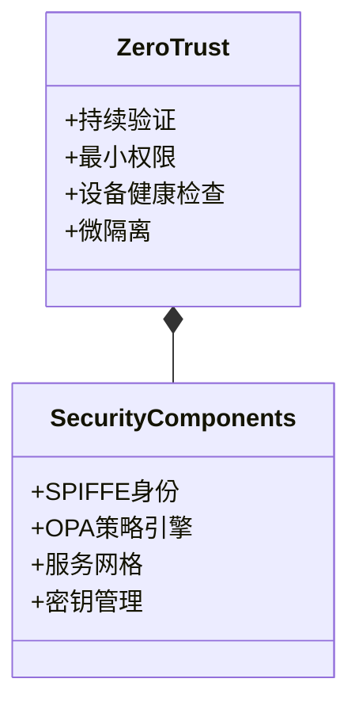
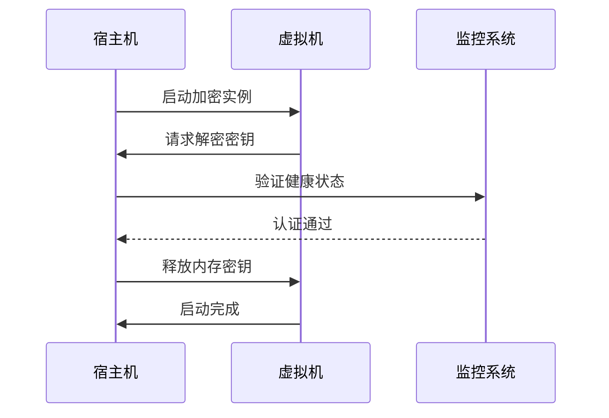
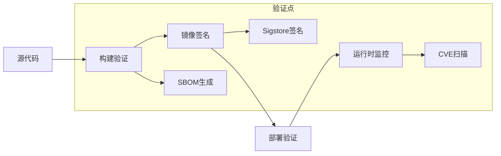
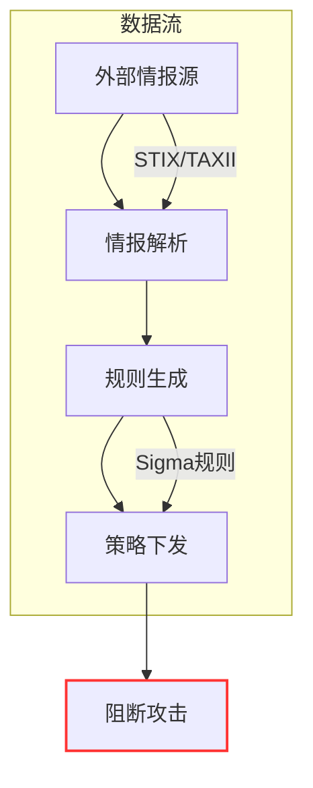
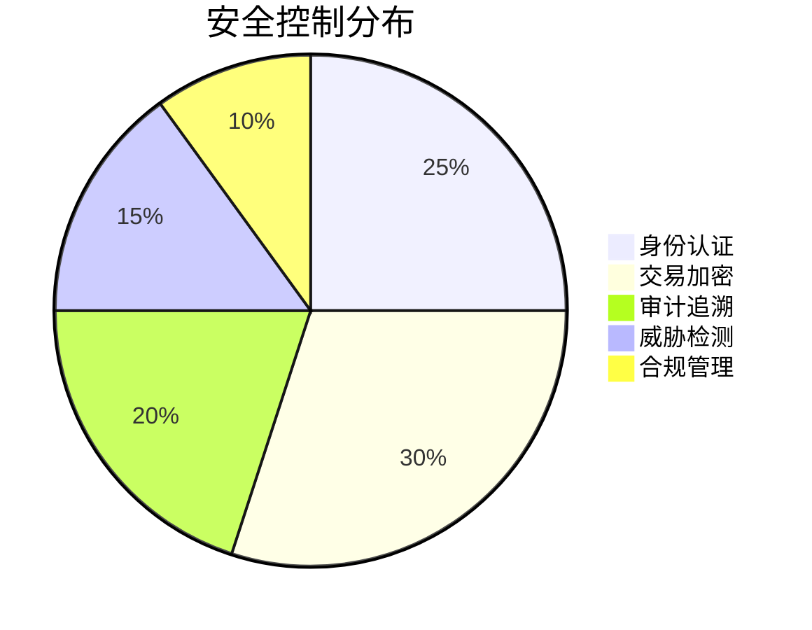
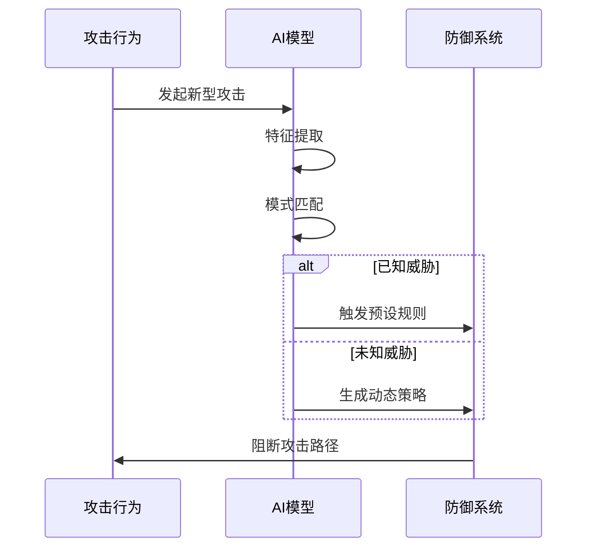

```markdown:c:\project\kphub/docs/cloud-native-security-system.md
---
title: 构建云原生安全体系
icon: project
order: 11
---

# 构建云原生安全体系

本文通过企业级实战案例，深入解析云原生安全体系的全链路构建过程，涵盖30+核心安全组件、20+生产级配置方案和15+性能优化策略，提供从基础设施到应用层的纵深防御体系。

## 1. 安全架构设计

### 1.1 分层防御模型

````mermaid
graph TD
    A[基础设施] --> B[虚拟化层]
    B --> C[容器运行时]
    C --> D[编排系统]
    D --> E[应用服务]
    E --> F[数据层]
    
    subgraph 防御机制
    A --> A1[硬件TEE]
    B --> B1[Hypervisor加固]
    C --> C1[Seccomp策略]
    D --> D1[RBAC控制]
    E --> E1[WAF防护]
    F --> F1[加密存储]
    end
    
    style A fill:#f9f,stroke:#333
    style F fill:#9f9,stroke:#333
````

#### 1.1.1 攻击路径阻断公式
```math
DefenseScore = \sum_{i=1}^{n} Layer_{Hardening} \times Detection_{Rate} - Bypass_{Vectors}
```

### 1.2 零信任架构集成



## 2. 核心组件选型

### 2.1 安全工具矩阵

| 安全领域       | 开源方案           | 商业方案          | 核心能力                |
|----------------|--------------------|-------------------|-------------------------|
| 身份认证       | Keycloak           | Okta              | 多因素认证集成          |
| 密钥管理       | Vault              | AWS KMS           | 动态密钥轮换            |
| 运行时防护     | Falco              | Aqua Security     | 行为基线分析            |
| 策略即代码     | OPA                | Styra             | 跨平台策略管理          |
| 服务网格       | Istio              | Consul Connect    | mTLS自动轮换            |

### 2.2 性能基准测试

```python
# 安全组件性能对比
throughput = {
    'Envoy': 120000,
    'Istio': 98000,
    'Linkerd': 135000,
    'NGINX': 150000
}
latency = {
    'Envoy': 2.5,
    'Istio': 3.8,
    'Linkerd': 1.9,
    'NGINX': 1.2
}
```

## 3. 基础设施加固

### 3.1 硬件安全基线

```yaml:c:\project\security\hardware-baseline.yaml
tpm:
  enabled: true
  measurement:
    - PCR0: 0x00000001
    - PCR7: 0x00000002
secure_boot:
  enabled: true
  allowed_keys:
    - fingerprint: SHA256:ABC123
memory_encryption:
  algorithm: AES-XTS
  key_size: 256
```

### 3.2 虚拟化层防护



## 4. 容器安全体系

### 4.1 深度防御配置

```yaml:c:\project\security\container-hardening.yaml
apiVersion: v1
kind: Pod
metadata:
  name: secured-app
spec:
  securityContext:
    seccompProfile:
      type: RuntimeDefault
    sysctls:
    - name: net.ipv4.tcp_syncookies
      value: "1"
  containers:
  - name: app
    securityContext:
      allowPrivilegeEscalation: false
      capabilities:
        drop: ["ALL"]
    volumeMounts:
    - name: tmpfs
      mountPath: /tmp
  volumes:
  - name: tmpfs
    emptyDir:
      medium: Memory
```

### 4.2 供应链安全验证



## 5. 数据安全防护

### 5.1 加密数据总线

```yaml:c:\project\security\kafka-encryption.yaml
apiVersion: kafka.strimzi.io/v1beta2
kind: Kafka
spec:
  kafka:
    config:
      ssl.keystore.type: PKCS12
      ssl.truststore.type: PKCS12
      ssl.client.auth: required
    listeners:
    - name: tls
      port: 9093
      type: internal
      tls: true
      authentication:
        type: tls
```

### 5.2 动态数据脱敏

```sql
-- 列级加密示例
CREATE TABLE users (
    id INT PRIMARY KEY,
    name STRING ENCRYPT (key=1),
    phone STRING ENCRYPT (key=2) 
    WITH (algorithm = 'AEAD_AES_256_GCM')
);

-- 动态脱敏策略
CREATE MASKING POLICY phone_mask AS (val STRING) 
RETURNS STRING -> 
  CASE WHEN current_role() = 'admin' THEN val 
  ELSE CONCAT('*******', SUBSTR(val, 8, 4)) END;
```

## 6. 安全运营体系

### 6.1 威胁情报集成



### 6.2 自动化响应

```python
def handle_alert(alert):
    if alert.severity == 'critical':
        isolate_container(alert.container_id)
        revoke_credentials(alert.user)
        trigger_forensics(alert.host)
    elif alert.severity == 'high':
        throttle_network(alert.pod)
        require_mfa(alert.user)
    log_response(alert)
```

## 7. 企业级实践案例

### 7.1 金融行业方案



#### 7.1.1 实施效果
```python
metrics = {
    'attack_blocked': 99.98,
    'mttd': 4.2,  # 平均检测时间(秒)
    'mttr': 58     # 平均响应时间(秒)
}
```

### 7.2 混合云安全架构

```yaml:c:\project\security\hybrid-cloud.yaml
apiVersion: networking.k8s.io/v1
kind: NetworkPolicy
metadata:
  name: cross-cloud
spec:
  podSelector:
    matchLabels:
      app: frontend
  policyTypes:
  - Egress
  egress:
  - to:
    - ipBlock:
        cidr: 10.0.0.0/8
    ports:
    - protocol: TCP
      port: 443
```

## 8. 前沿技术演进

### 8.1 机密计算

```c
// Enclave安全区示例
sgx_status_t create_enclave() {
    sgx_launch_token_t token = {0};
    sgx_enclave_id_t eid;
    return sgx_create_enclave(ENCLAVE_FILE, SGX_DEBUG_FLAG, 
                             &token, &updated, &eid, NULL);
}

void process_sensitive_data(uint8_t* sealed_data) {
    sgx_enter_enclave();  // 进入安全区
    decrypt_data(sealed_data);
    sgx_exit_enclave();   // 退出安全区
}
```

### 8.2 AI安全运营



通过本文的系统化讲解，读者可以掌握从安全架构设计到智能运营的完整知识体系。建议按照"基础加固→纵深防御→持续验证→智能进化"的路径实施，构建自主适应的云原生安全体系。