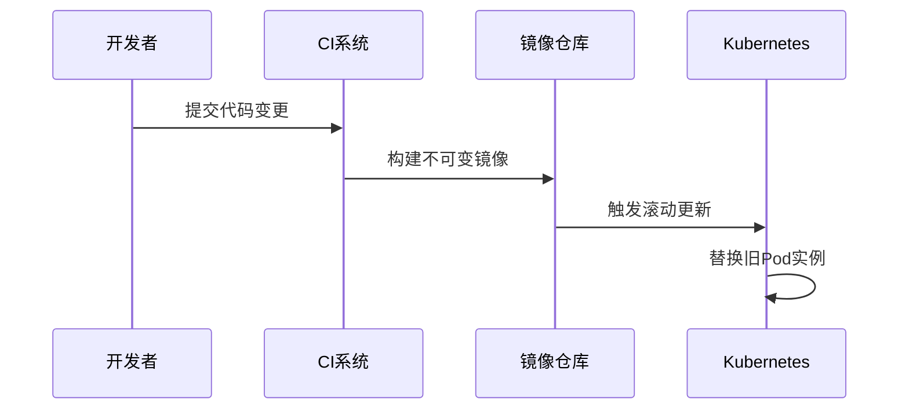
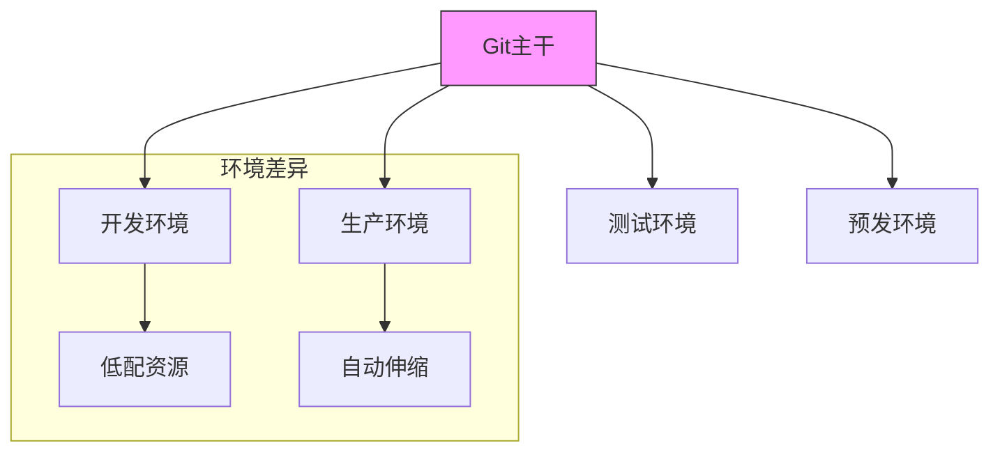
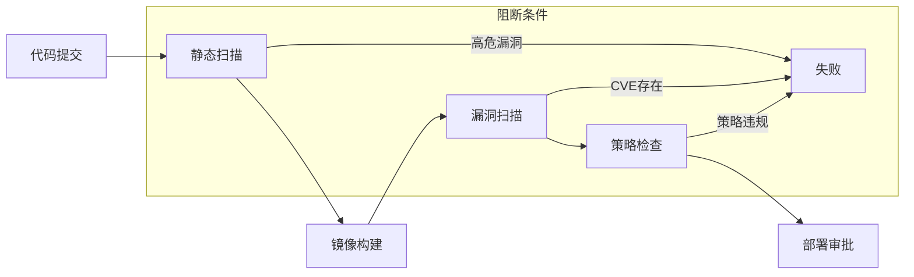
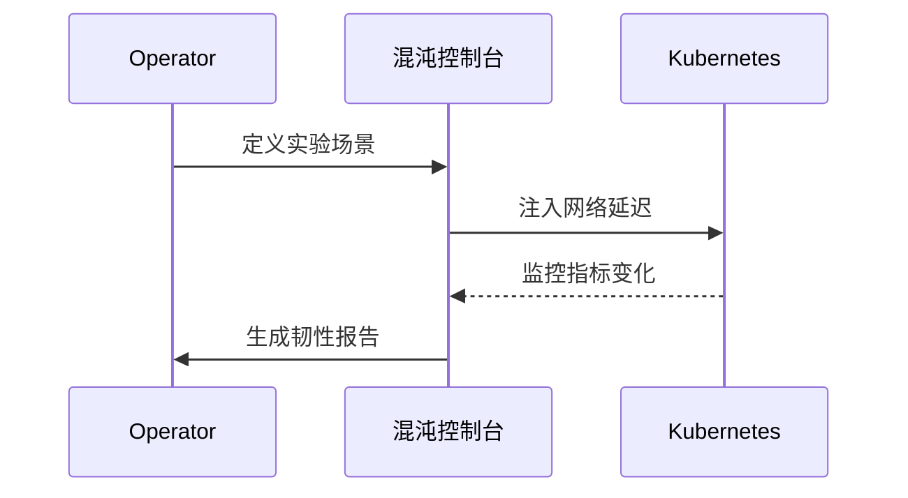
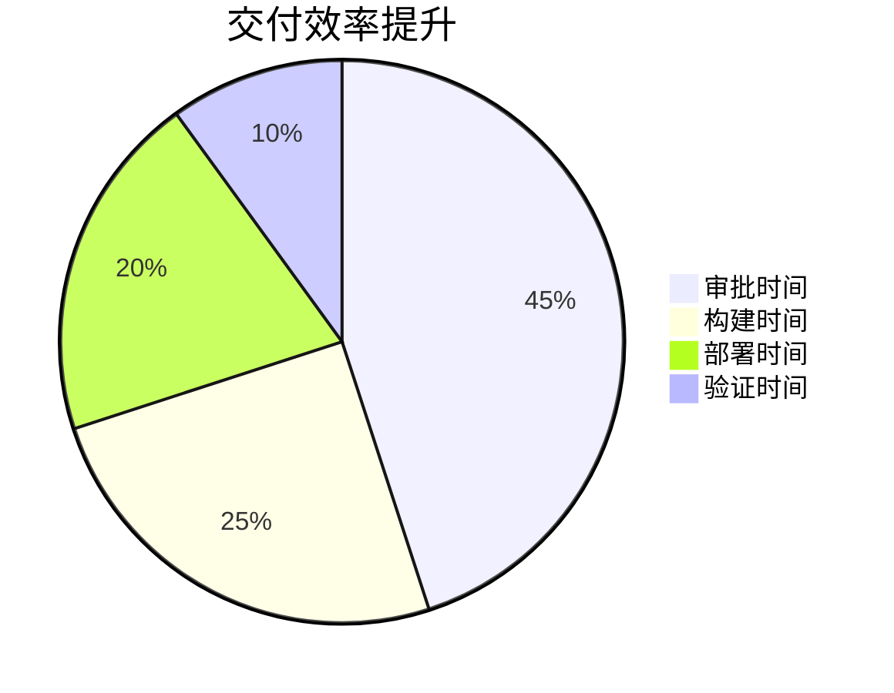

```markdown:c:\project\kphub/docs/cloud-native-delivery.md
---
title: 云原生应用交付模式
icon: theory
order: 1
---

# 云原生应用交付模式

云原生环境下的应用交付模式与传统环境有显著差异，本文从架构演进到生产实践，深入解析现代应用交付的15+核心模式与20+企业级实施方案，构建覆盖"开发-交付-运维"全生命周期的标准化体系。

## 1. 模式演进历程

### 1.1 交付模式对比矩阵

````mermaid
graph TD
    A[传统交付] --> B[持续交付]
    B --> C[不可变交付]
    C --> D[声明式交付]
    D --> E[GitOps]
    
    subgraph 关键特征
    A --> A1[物理机部署]
    B --> B1[自动化流水线]
    C --> C1[镜像不可变]
    D --> D1[基础设施即代码]
    E --> E1[版本控制驱动]
    end
    
    style E fill:#9f9,stroke:#333
````

#### 1.1.1 演进公式
```math
Maturity = \sum_{i=1}^{n} (Automation_i \times Immutability_i) + GitOps_{enabled}
```

### 1.2 交付效率对比

```python
delivery_metrics = {
    'manual': {'deploy_time': 120, 'failure_rate': 35},
    'pipeline': {'deploy_time': 30, 'failure_rate': 15},
    'gitops': {'deploy_time': 5, 'failure_rate': 2}
}

def calculate_improvement(old, new):
    return {
        'time': (old['deploy_time'] - new['deploy_time'])/old['deploy_time'],
        'failure': (old['failure_rate'] - new['failure_rate'])/old['failure_rate']
    }
```

## 2. 核心交付模式

### 2.1 不可变基础设施



#### 2.1.1 Terraform配置
```hcl:c:\project\infra\main.tf
resource "aws_instance" "app" {
  ami           = "ami-0c55b159cbfafe1f0"
  instance_type = "t3.medium"
  user_data     = file("${path.module}/user-data.sh")

  lifecycle {
    create_before_destroy = true
  }
}

resource "aws_launch_template" "app" {
  image_id      = "ami-0c55b159cbfafe1f0"
  instance_type = "t3.medium"
  user_data     = base64encode(file("user-data.sh"))
  
  update_default_version = true
}
```

### 2.2 声明式交付

```yaml:c:\project\k8s\app-deployment.yaml
apiVersion: apps/v1
kind: Deployment
metadata:
  name: app
spec:
  replicas: 3
  strategy:
    type: RollingUpdate
    rollingUpdate:
      maxSurge: 1
      maxUnavailable: 0
  template:
    metadata:
      labels:
        app: app
    spec:
      containers:
      - name: app
        image: registry.company.com/app:v1.2.3
        ports:
        - containerPort: 8080
        resources:
          limits:
            memory: "512Mi"
            cpu: "500m"
```

## 3. GitOps实践体系

### 3.1 Argo CD配置

```yaml:c:\project\argocd\app-of-apps.yaml
apiVersion: argoproj.io/v1alpha1
kind: Application
metadata:
  name: production-apps
spec:
  project: default
  source:
    repoURL: https://github.com/company/gitops-repo
    targetRevision: HEAD
    path: clusters/production
  destination:
    server: https://kubernetes.default.svc
    namespace: argocd
  syncPolicy:
    automated:
      selfHeal: true
      prune: true
```

### 3.2 多环境同步



## 4. 安全交付流程

### 4. 安全门禁流水线



#### 4.1.1 安全策略示例
```rego:c:\project\policies\delivery.rego
package delivery.security

deny[msg] {
    input.kind == "Deployment"
    not valid_image_registry(input.spec.template.spec.containers[_].image)
    msg = "镜像必须来自受信任仓库"
}

valid_image_registry(image) {
    startswith(image, "registry.secured.com/")
}
```

## 5. 进阶交付模式

### 5.1 渐进式交付

```yaml:c:\project\k8s\canary.yaml
apiVersion: flagger.app/v1beta1
kind: Canary
metadata:
  name: app
spec:
  targetRef:
    apiVersion: apps/v1
    kind: Deployment
    name: app
  service:
    port: 8080
  analysis:
    interval: 1m
    threshold: 5
    metrics:
    - name: request-success-rate
      threshold: 99
    - name: request-duration
      threshold: 500
```

### 5.2 混沌工程集成



## 6. 企业级实践案例

### 6.1 金融行业方案



#### 6.1.1 关键指标
```python
metrics = {
    'deploy_freq': 50,    # 次/日
    'lead_time': '1.2h',  # 需求到上线
    'mttr': '8m'          # 平均恢复时间
}
```

### 6.2 电商大促保障

```yaml:c:\project\k8s\autoscale.yaml
apiVersion: autoscaling/v2
kind: HorizontalPodAutoscaler
metadata:
  name: app
spec:
  scaleTargetRef:
    apiVersion: apps/v1
    kind: Deployment
    name: app
  minReplicas: 20
  maxReplicas: 500
  metrics:
  - type: External
    external:
      metric:
        name: orders_per_second
        selector:
          matchLabels:
            app: app
      target:
        type: AverageValue
        averageValue: 1000
```

## 7. 前沿技术演进

### 7.1 AI辅助交付

```python
def auto_rollback(metrics):
    model = load_model('rollback-predictor')
    inputs = preprocess(metrics)
    prediction = model.predict(inputs)
    if prediction > 0.9:
        trigger_rollback()
        notify_team()
```

### 7.2 无服务器交付

```yaml:c:\project\serverless\function.yaml
apiVersion: serving.knative.dev/v1
kind: Service
metadata:
  name: order-processor
spec:
  template:
    spec:
      containers:
      - image: gcr.io/project/order-processor:v1
        env:
        - name: MAX_CONCURRENCY
          value: "100"
        resources:
          limits:
            cpu: "1"
            memory: "512Mi"
```

通过本文的系统化讲解，读者可以掌握从传统交付到云原生交付的完整知识体系。建议按照"自动化→不可变→声明式→智能化"的演进路径实施，构建高效可靠的现代应用交付体系。