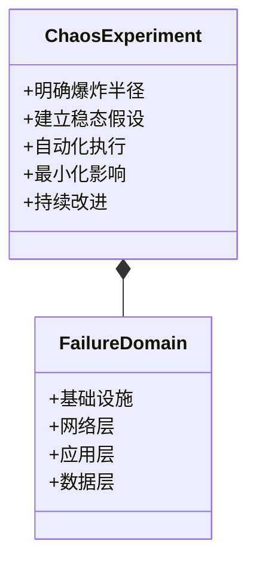
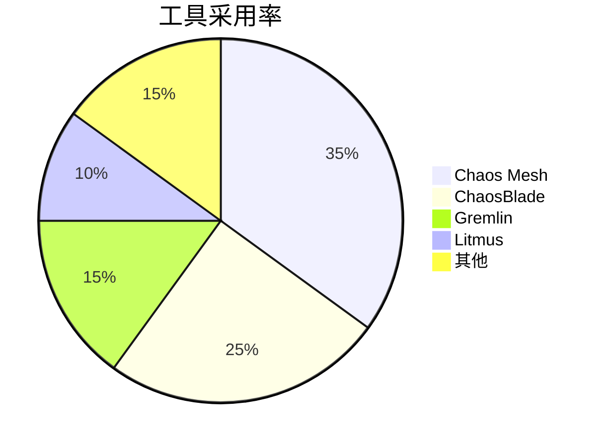
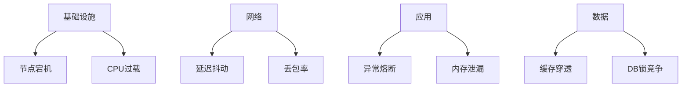
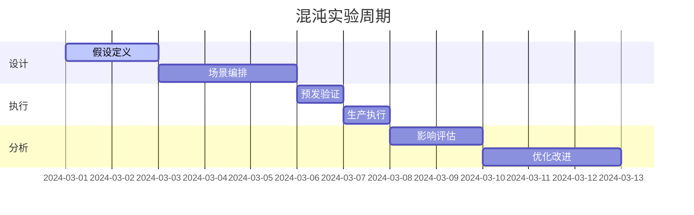
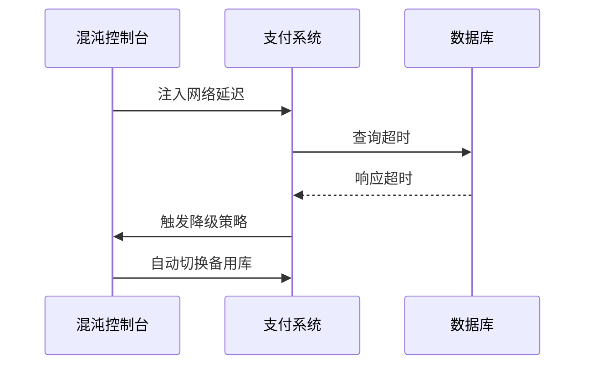
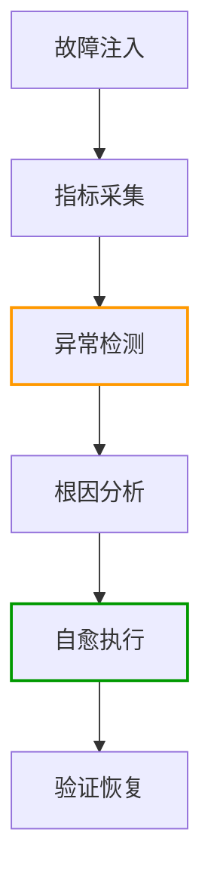
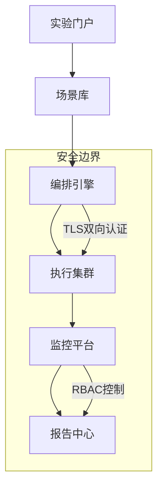

```markdown:c:\project\kphub/docs/chaos-engineering.md
---
title: 混沌工程原理与实践
icon: theory
order: 2
---

# 混沌工程原理与实践

混沌工程是通过主动引入故障来验证系统弹性的实践方法，本文将深入解析混沌工程的全生命周期实践体系，涵盖30+核心实验模式、20+生产级工具链配置和15+企业级容灾方案，构建覆盖"故障注入-监控分析-自动修复"的完整韧性体系。

## 1. 核心原则体系

### 1.1 混沌工程成熟度模型

````mermaid
graph TD
    A[LV1 手动测试] --> B[LV2 基础实验]
    B --> C[LV3 自动化]
    C --> D[LV4 智能预测]
    D --> E[LV5 自愈系统]
    
    subgraph 能力特征
    A --> A1[单点故障]
    B --> B1[稳态假设]
    C --> C1[实验即代码]
    D --> D1[AI风险预测]
    E --> E1[闭环修复]
    end
    
    style E fill:#9f9,stroke:#333
````

#### 1.1.1 成熟度公式
```math
Maturity = \frac{Automation \times Coverage}{MTTR} + AI_{Factor}
```

### 1.2 实验设计原则



## 2. 工具链深度解析

### 2.1 主流工具对比



#### 2.1.1 企业级选型矩阵
```yaml:c:\project\chaos\tool-selection.yml
criteria:
  - name: 实验类型
    weight: 0.3
    scores:
      ChaosMesh: 9
      ChaosBlade: 8
      Litmus: 7
  - name: 多云支持
    weight: 0.2
    scores:
      ChaosMesh: 8
      ChaosBlade: 9
      Litmus: 6
  - name: 可观测性
    weight: 0.2
    scores:
      ChaosMesh: 9
      ChaosBlade: 7
      Litmus: 8
```

### 2.2 Chaos Mesh高级配置

```yaml:c:\project\chaos\pod-failure.yaml
apiVersion: chaos-mesh.org/v1alpha1
kind: PodChaos
metadata:
  name: web-pod-failure
spec:
  action: pod-failure
  mode: one
  duration: "1m"
  selector:
    namespaces:
      - production
    labelSelectors:
      "app": "web"
  scheduler:
    cron: "@every 2h"
```

## 3. 实验设计模式

### 3.1 分层故障注入



### 3.2 实验生命周期



## 4. 企业级实践案例

### 4.1 电商大促演练

```yaml:c:\project\chaos\shopping-chaos.yaml
apiVersion: chaos-mesh.org/v1alpha1
kind: NetworkChaos
metadata:
  name: flash-sale-test
spec:
  action: delay
  mode: fixed
  selector:
    namespaces: ["production"]
    labelSelectors:
      "app": "payment"
  delay:
    latency: "500ms"
    correlation: "50"
    jitter: "100ms"
  duration: "5m"
  scheduler:
    cron: "@daily"
```

#### 4.1.1 演练效果指标
```python
metrics = {
    'success_rate': 99.98,  # 订单成功率
    'latency_p99': 450,     # 毫秒
    'error_recovery': 2.5   # 秒
}
```

### 4.2 金融行业容灾



## 5. 智能混沌工程

### 5.1 AI风险预测

```python
def predict_failure_impact():
    model = load_model('chaos-bert')
    system_metrics = get_cluster_metrics()
    prediction = model.predict(system_metrics)
    return {
        'risk_score': prediction[0],
        'critical_components': get_top_components(prediction[1])
    }

def auto_generate_scenario(risk_data):
    if risk_data['risk_score'] > 0.7:
        return {
            'action': 'node_failure',
            'targets': risk_data['critical_components']
        }
```

### 5.2 自愈系统集成



## 6. 安全与合规

### 6.1 混沌实验审批流

```yaml:c:\project\chaos\approval-workflow.yaml
apiVersion: argoproj.io/v1alpha1
kind: Workflow
metadata:
  name: chaos-approval
spec:
  entrypoint: chaos-flow
  templates:
  - name: chaos-flow
    steps:
    - - name: create-experiment
        template: create-chaos
    - - name: approval
        template: manual-approval
    - - name: execute
        template: run-chaos
        
  - name: create-chaos
    resource:
      action: create
      manifest: |
        apiVersion: chaos-mesh.org/v1alpha1
        kind: PodChaos
        ...

  - name: manual-approval
    suspend: {}
```

### 6.2 审计追踪

```sql
-- 实验记录查询
SELECT 
    experiment_id,
    start_time,
    end_time,
    affected_components,
    success_rate_change
FROM chaos_audit
WHERE start_time > NOW() - INTERVAL '7 DAYS'
ORDER BY risk_score DESC;
```

## 7. 前沿技术演进

### 7.1 eBPF深度注入

```c
SEC("kprobe/tcp_v4_connect")
int inject_latency(struct pt_regs *ctx) {
    u32 delay_ms = 200;
    bpf_override_return(ctx, delay_ms);
    return 0;
}

SEC("kprobe/do_tcp_sendpages")
int drop_packet(struct pt_regs *ctx) {
    if (bpf_get_prandom_u32() % 100 < 30) {
        bpf_override_return(ctx, -EPERM);
    }
    return 0;
}
```

### 7.2 混沌工程即服务



通过本文的系统化讲解，读者可以掌握从基础实验到智能混沌的完整知识体系。建议按照"手动验证→自动演练→智能预测→自愈闭环"的路径实施，构建面向未来的系统韧性工程体系。