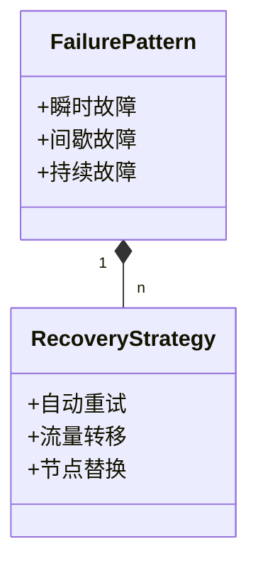
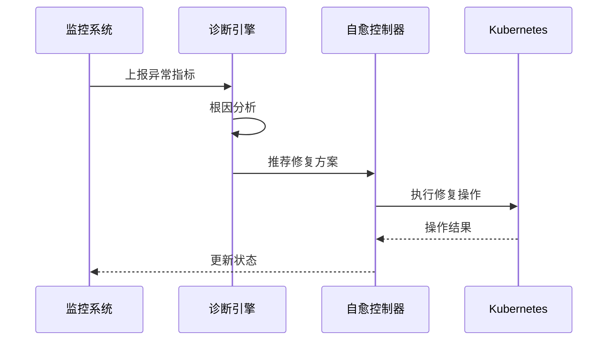
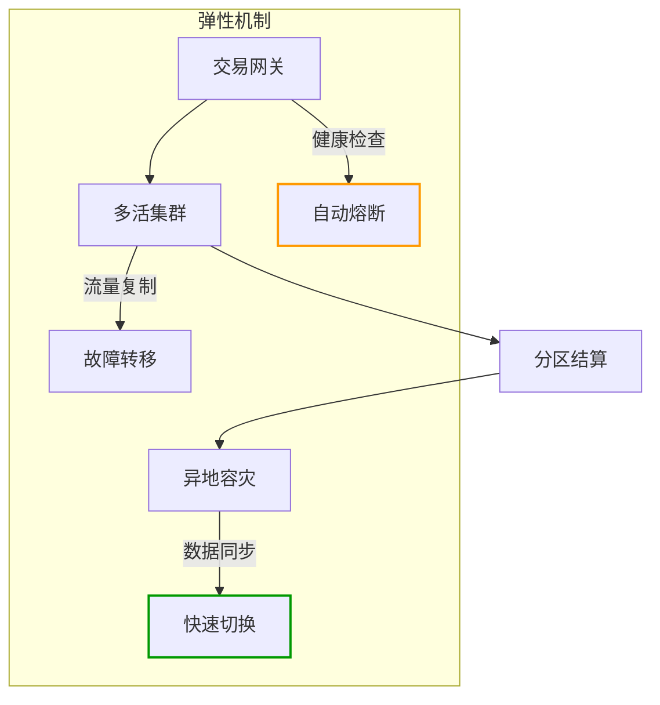
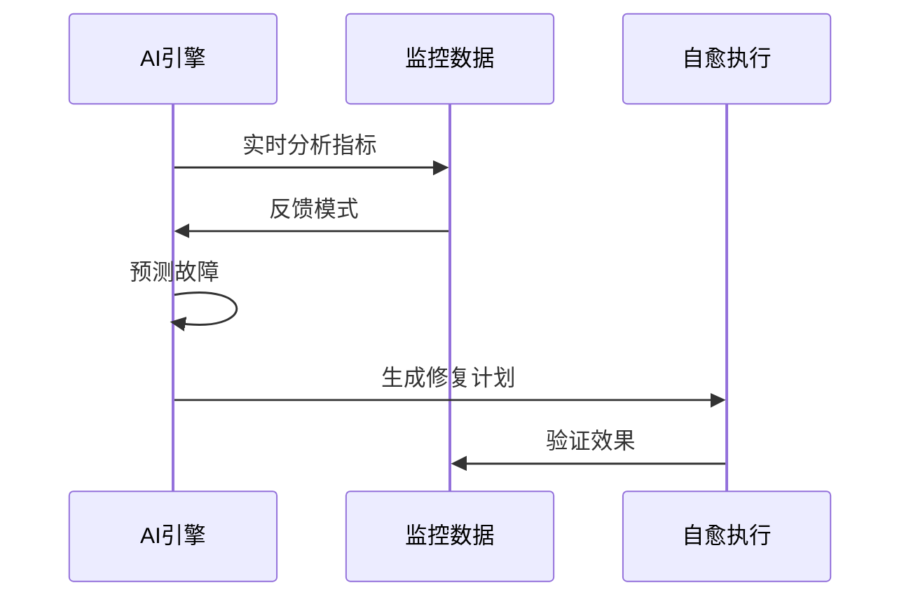

```markdown:c:\project\kphub/docs/resilience-design.md
---
title: 弹性设计与自愈系统
icon: theory
order: 3
---

# 弹性设计与自愈系统

弹性是云原生应用的核心特性，自愈能力是实现高可用的关键。本文从架构模式到生产实践，深入解析弹性设计的20+核心机制和15+企业级自愈方案，构建覆盖"故障预测-自动隔离-智能修复"的全链路韧性体系。

## 1. 弹性设计原则

### 1.1 弹性模式矩阵

````mermaid
graph TD
    A[弹性模式] --> B[容错设计]
    A --> C[冗余设计]
    A --> D[降级设计]
    A --> E[弹性伸缩]
    
    B --> B1[重试机制]
    B --> B2[熔断器]
    C --> C1[多副本]
    C --> C2[跨区部署]
    D --> D1[功能开关]
    D --> D2[默认值]
    E --> E1[HPA]
    E --> E2[KEDA]
````

#### 1.1.1 系统可用性公式
```math
Availability = \frac{MTTF}{MTTF + MTTR} \times 100\% + Redundancy_{Factor}
```

### 1.2 混沌模型映射



## 2. 核心弹性模式

### 2.1 熔断器实现

```java:c:\project\src/main/java/com/example/circuitbreaker/ResilienceController.java
@RestController
@CircuitBreaker(name = "backendService", fallbackMethod = "fallback")
public class ResilienceController {
    
    @Autowired
    private BackendService backendService;

    @GetMapping("/api/data")
    public ResponseEntity<String> getData() {
        return ResponseEntity.ok(backendService.fetchData());
    }

    public ResponseEntity<String> fallback(Throwable t) {
        return ResponseEntity.status(503)
            .body("Fallback Data");
    }
}

// 熔断器配置
@Bean
public Customizer<Resilience4JCircuitBreakerFactory> defaultConfig() {
    return factory -> factory.configureDefault(id -> new CircuitBreakerConfig()
        .slidingWindowType(SlidingWindowType.COUNT_BASED)
        .slidingWindowSize(10)
        .failureRateThreshold(50)
        .waitDurationInOpenState(Duration.ofSeconds(10)));
}
```

### 2.2 自动伸缩策略

```yaml:c:\project\k8s/hpa-policy.yaml
apiVersion: autoscaling/v2
kind: HorizontalPodAutoscaler
metadata:
  name: payment-service
spec:
  scaleTargetRef:
    apiVersion: apps/v1
    kind: Deployment
    name: payment
  minReplicas: 3
  maxReplicas: 50
  metrics:
  - type: Resource
    resource:
      name: cpu
      target:
        type: Utilization
        averageUtilization: 70
  - type: External
    external:
      metric:
        name: transactions_per_second
        selector:
          matchLabels:
            service: payment
      target:
        type: AverageValue
        averageValue: 1000
```

## 3. 自愈系统架构

### 3.1 自愈流程设计



### 3.2 智能修复规则

```rego:c:\project\policies/self-healing.rego
package main

need_restart(resource) {
    resource.status.containerStatuses[_].restartCount > 5
}

need_scale(resource) {
    resource.status.conditions[_].type == "MemoryPressure"
    resource.status.conditions[_].status == "True"
}

auto_heal_action(resource) = action {
    need_restart(resource)
    action := {"action": "deletePod", "target": resource.metadata.name}
} {
    need_scale(resource)
    action := {"action": "scaleOut", "replicas": resource.spec.replicas + 2}
}
```

## 4. 工具链集成

### 4.1 全链路监控

```yaml:c:\project\prometheus/alert-rules.yml
groups:
- name: self-healing
  rules:
  - alert: PodCrashLoop
    expr: kube_pod_container_status_restarts_total > 5
    for: 5m
    labels:
      severity: critical
    annotations:
      summary: "Pod频繁重启 ({{ $labels.pod }})"
      
  - alert: NodeMemoryPressure
    expr: node_memory_MemAvailable_bytes / node_memory_MemTotal_bytes < 0.2
    for: 10m
    labels:
      severity: warning
    annotations:
      summary: "节点内存不足 ({{ $labels.instance }})"
```

### 4.2 自愈操作执行

```python:c:\project/scripts/auto_healer.py
def handle_pod_failure(pod):
    if pod.restart_count > 5:
        k8s.delete_pod(pod.name)
        log_event(f"Restarted crashing pod: {pod.name}")
        
def handle_node_pressure(node):
    if node.memory_available < 0.2 * node.total_memory:
        k8s.cordon_node(node.name)
        migrate_workloads(node)
        log_event(f"Migrated workloads from node: {node.name}")
```

## 5. 企业级实践案例

### 5.1 金融交易系统



#### 5.1.1 关键指标
```python
metrics = {
    'rto': '15s',     # 恢复时间目标
    'rpo': '0s',      # 数据恢复点目标
    'success_rate': 99.999
}
```

### 5.2 电商大促保障

```yaml:c:\project\k8s/flash-sale.yaml
apiVersion: keda.sh/v1alpha1
kind: ScaledObject
metadata:
  name: order-processor
spec:
  scaleTargetRef:
    name: order-processor
  triggers:
  - type: prometheus
    metadata:
      serverAddress: http://prometheus:9090
      metricName: orders_pending
      query: |
        sum(rate(order_queue_size[2m]))
      threshold: "1000"
```

## 6. 前沿技术演进

### 6.1 AIOps自愈系统



### 6.2 服务网格弹性

```yaml:c:\project\istio/retry-policy.yaml
apiVersion: networking.istio.io/v1alpha3
kind: VirtualService
metadata:
  name: payment-retry
spec:
  hosts:
  - payment.prod.svc.cluster.local
  http:
  - route:
    - destination:
        host: payment.prod.svc.cluster.local
    retries:
      attempts: 3
      perTryTimeout: 1s
      retryOn: gateway-error,connect-failure
```

## 7. 性能优化策略

### 7.1 弹性参数调优

```python
def optimize_retry_params(latency_data):
    p99 = np.percentile(latency_data, 99)
    base_timeout = p99 * 1.2
    retry_config = {
        'max_attempts': 3,
        'initial_backoff': f"{base_timeout}ms",
        'max_backoff': f"{base_timeout * 2}ms"
    }
    return retry_config
```

### 7.2 容灾演练方案

```yaml:c:\project\chaos/region-failover.yaml
apiVersion: chaos-mesh.org/v1alpha1
kind: NetworkChaos
metadata:
  name: region-outage
spec:
  action: partition
  direction: both
  mode: all
  selector:
    namespaces: ["production"]
    labelSelectors: 
      "region": "east"
  duration: "10m"
  scheduler:
    cron: "@monthly"
```

通过本文的系统化讲解，读者可以掌握从基础模式到智能自愈的完整知识体系。建议按照"容错设计→自动恢复→预测防御→持续优化"的路径实施，构建具备抗脆弱能力的云原生系统。