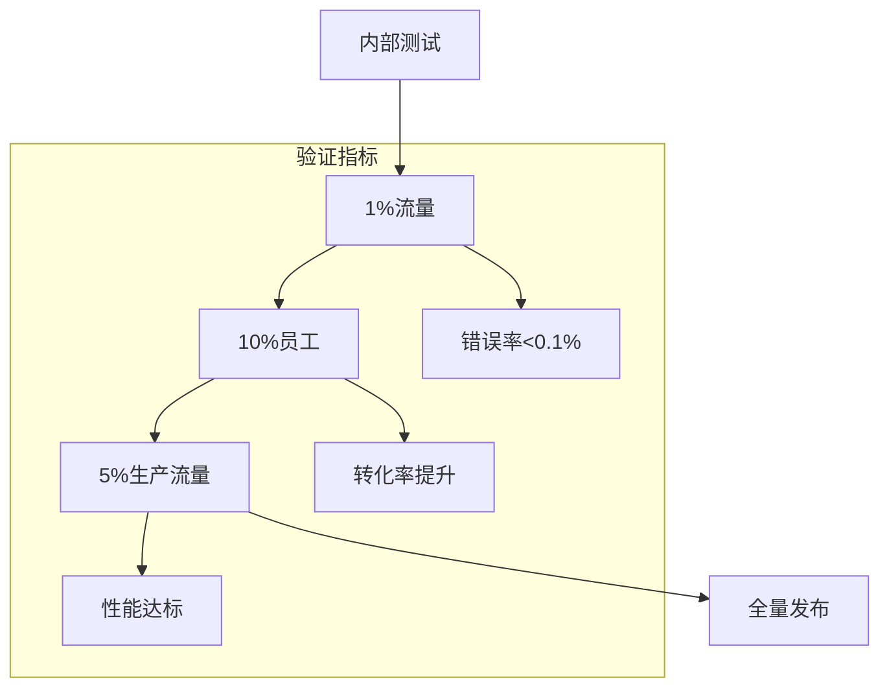
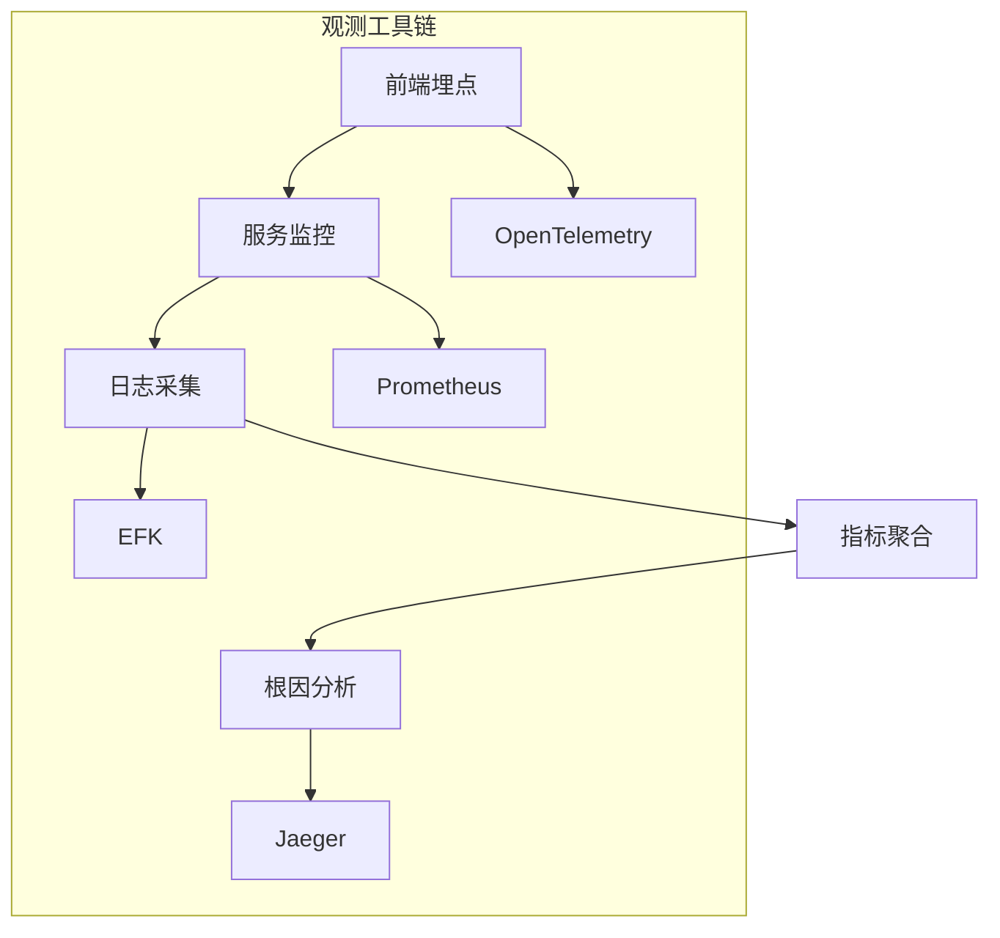
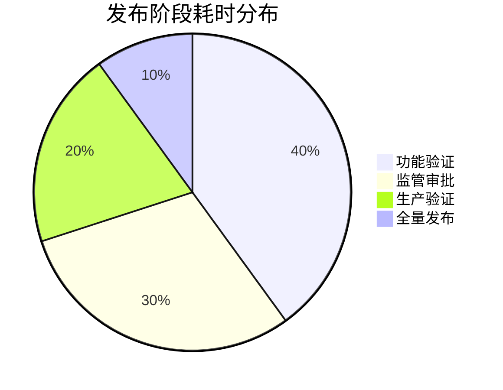

```markdown:c:\project\kphub/docs/progressive-delivery.md
---
title: 渐进式交付策略
icon: theory
order: 4
---

# 渐进式交付策略

渐进式交付是降低发布风险的有效策略，本文从流量治理到生产验证，深入解析渐进式交付的20+核心模式和15+企业级实施方案，构建覆盖"部署策略-流量控制-异常熔断"的完整交付体系。

## 1. 核心模式解析

### 1.1 策略演进图谱

````mermaid
graph TD
    A[全量发布] --> B[滚动更新]
    B --> C[蓝绿部署]
    C --> D[金丝雀发布]
    D --> E[功能开关]
    E --> F[暗箱发布]
    
    subgraph 关键能力
    B --> B1[分批替换]
    C --> C1[瞬时切换]
    D --> D1[流量采样]
    E --> E1[动态启用]
    end
    
    style F fill:#9f9,stroke:#333
````

#### 1.1.1 风险控制公式
```math
Risk = \frac{Impact \times Probability}{DetectionCapability} \div RollbackSpeed
```

### 1.2 策略对比矩阵

| 策略         | 切换速度 | 资源消耗 | 回滚难度 | 适用场景         |
|--------------|----------|----------|----------|------------------|
| 滚动更新     | 慢       | 低       | 困难     | 常规迭代         |
| 蓝绿部署     | 快       | 高       | 容易     | 重大版本更新     |
| 金丝雀发布   | 中       | 中       | 中等     | 新功能验证       |
| 功能开关     | 即时     | 低       | 容易     | 功能灰度发布     |
| 暗箱发布     | 无感     | 低       | 容易     | 后台服务更新     |

## 2. 流量治理体系

### 2.1 金丝雀发布配置

```yaml:c:\project\k8s/canary.yaml
apiVersion: flagger.app/v1beta1
kind: Canary
metadata:
  name: product-service
spec:
  targetRef:
    apiVersion: apps/v1
    kind: Deployment
    name: product-v2
  service:
    port: 8080
  analysis:
    interval: 1m
    threshold: 5
    iterations: 10
    metrics:
    - name: request-success-rate
      thresholdRange:
        min: 99
      interval: 1m
    - name: request-duration
      thresholdRange:
        max: 500
      interval: 30s
```

### 2.2 服务网格路由

```yaml:c:\project\istio/virtual-service.yaml
apiVersion: networking.istio.io/v1alpha3
kind: VirtualService
metadata:
  name: product
spec:
  hosts:
  - product.company.com
  http:
  - route:
    - destination:
        host: product.prod.svc.cluster.local
        subset: v1
      weight: 90
    - destination:
        host: product.prod.svc.cluster.local
        subset: v2
      weight: 10
    headers:
      request:
        set:
          x-canary: "true"
```

## 3. 功能开关实现

### 3.1 动态配置管理

```java:c:\project\src/main/java/com/company/feature/FeatureToggle.java
@RestController
public class ProductController {
    
    @Autowired
    private FeatureManager featureManager;

    @GetMapping("/products")
    public ResponseEntity<List<Product>> getProducts() {
        if(featureManager.isActive("new-ranking-algorithm")) {
            return applyNewRanking();
        }
        return applyLegacyRanking();
    }
}

// 后台管理端点
@PostMapping("/features/{name}")
public void toggleFeature(@PathVariable String name, 
                         @RequestParam boolean enabled) {
    featureManager.toggle(name, enabled);
}
```

### 3.2 渐进式启用策略



## 4. 异常熔断机制

### 4.1 熔断器配置

```yaml:c:\project\resilience4j/config.yaml
resilience4j.circuitbreaker:
  instances:
    productService:
      registerHealthIndicator: true
      slidingWindowType: TIME_BASED
      slidingWindowSize: 60
      minimumNumberOfCalls: 10
      permittedNumberOfCallsInHalfOpenState: 5
      waitDurationInOpenState: 60s
      failureRateThreshold: 50
      eventConsumerBufferSize: 10

resilience4j.retry:
  instances:
    productServiceRetry:
      maxAttempts: 3
      waitDuration: 500ms
      retryExceptions:
        - java.net.ConnectException
```

### 4.2 自动回滚策略

```python:c:\project\scripts/auto_rollback.py
def monitor_canary(deployment):
    metrics = get_metrics(deployment)
    if metrics['error_rate'] > 5 or metrics['latency_p99'] > 1000:
        trigger_rollback(deployment)
        notify_team(deployment, metrics)

def trigger_rollback(deployment):
    k8s.patch_deployment(
        name=deployment,
        image=deployment.current_image,
        revision=deployment.current_revision
    )
    log_event(f"Rollback triggered for {deployment}")
```

## 5. 观测与验证体系

### 5.1 全链路可观测



### 5.2 业务验证框架

```yaml:c:\project\tests/validation.yaml
features:
  - name: 购物车优化
    validation:
      api: POST /cart
      criteria:
        - metric: p95_latency
          condition: < 800ms
        - metric: error_rate
          condition: < 0.5%
      load_test:
        users: 1000
        duration: 5m
    rollout:
      stages:
        - target: 1%
          duration: 1h
        - target: 10%
          duration: 4h
```

## 6. 企业级实践案例

### 6.1 金融交易系统



#### 6.1.1 实施效果
```python
metrics = {
    'release_frequency': 50,  # 次/月
    'rollback_rate': 0.5,     # 回滚率%
    'mtbf': '30d',            # 平均无故障时间
}
```

### 6.2 电商秒杀系统

```yaml:c:\project\k8s/flash-sale.yaml
apiVersion: autoscaling/v2
kind: HorizontalPodAutoscaler
metadata:
  name: flash-sale
spec:
  scaleTargetRef:
    apiVersion: apps/v1
    kind: Deployment
    name: flash-sale
  minReplicas: 100
  maxReplicas: 5000
  behavior:
    scaleUp:
      policies:
      - type: Percent
        value: 100
        periodSeconds: 60
    scaleDown:
      stabilizationWindowSeconds: 600
  metrics:
  - type: External
    external:
      metric:
        name: orders_per_second
        selector: 
          matchLabels:
            service: flash-sale
      target:
        type: AverageValue
        averageValue: 500
```

## 7. 前沿技术演进

### 7.1 AI驱动交付

```python
def predict_release_risk():
    model = load_model('release-bert')
    features = extract_features(code_changes, test_results)
    risk = model.predict(features)
    return optimize_release_plan(risk)

def optimize_release_plan(risk_data):
    if risk_data['score'] > 0.7:
        return {'strategy': 'canary', 'initial_traffic': 1}
    elif risk_data['score'] > 0.4:
        return {'strategy': 'blue-green', 'stage': 2}
    else:
        return {'strategy': 'rolling'}
```

### 7.2 无感热升级

```c
// 连接迁移示例
int upgrade_process() {
    int new_sock = transfer_connection(old_sock);
    reload_configuration();
    migrate_session_data();
    atomic_switch(new_sock);
    return 0;
}
```

通过本文的系统化讲解，读者可以掌握从基础策略到智能交付的完整知识体系。建议按照"流量控制→异常熔断→自动验证→持续优化"的路径实施，构建零停机风险的交付体系。